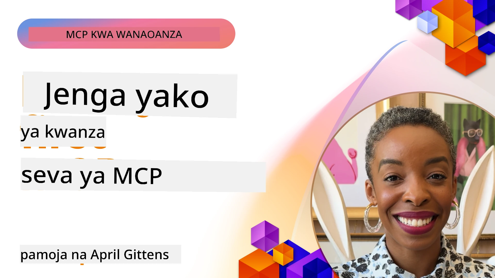

## Kuanzisha  

_(Bonyeza picha hapo juu kutazama video ya somo hili)_

Sehemu hii ina masomo kadhaa:

- **1 Server yako ya kwanza**, katika somo hili la kwanza, utajifunza jinsi ya kuunda server yako ya kwanza na kuikagua kwa kutumia kifaa cha ukaguzi, njia muhimu ya kujaribu na kutatua hitilafu za server yako, [kwenda somo](01-first-server/README.md)

- **2 Mteja**, katika somo hili, utajifunza jinsi ya kuandika mteja ambaye anaweza kuungana na server yako, [kwenda somo](02-client/README.md)

- **3 Mteja na LLM**, njia bora zaidi ya kuandika mteja ni kwa kuongeza LLM ili iweze "kujadiliana" na server yako kuhusu nini cha kufanya, [kwenda somo](03-llm-client/README.md)

- **4 Kutumia mode ya Wakala wa GitHub Copilot wa server katika Visual Studio Code**. Hapa, tunatazama jinsi ya kuendesha server yetu ya MCP kutoka ndani ya Visual Studio Code, [kwenda somo](04-vscode/README.md)

- **5 Server ya Usafirishaji wa stdio** usafirishaji wa stdio ni standardi inayopendekezwa kwa mawasiliano ya karibu kati ya server za MCP na wateja, ikitoa mawasiliano salama yaliyoanzishwa kwa msingi wa michakato kwa kizuizi cha ndani, [kwenda somo](05-stdio-server/README.md)

- **6 Uhamishaji wa HTTP wa MCP (HTTP Inayoweza Kusambazwa)**. Jifunze kuhusu uhamishaji wa HTTP wa kisasa (njia inayopendekezwa kwa server za MCP za mbali kulingana na [MCP Specification 2025-11-25](https://spec.modelcontextprotocol.io/specification/2025-11-25/basic/transports/#streamable-http)), arifa za maendeleo, na jinsi ya kutekeleza server na wateja wa MCP kwa wakati halisi na kwa upanuzi kwa kutumia HTTP inayoweza kusambazwa. [kwenda somo](06-http-streaming/README.md)

- **7 Kutumia AI Toolkit kwa VSCode** kwa matumizi na kujaribu Wateja na Server zako za MCP [kwenda somo](07-aitk/README.md)

- **8 Upimaji**. Hapa tutazingatia hasa jinsi ya kujaribu server na mteja wetu kwa njia tofauti, [kwenda somo](08-testing/README.md)

- **9 Utekelezaji**. Sura hii itaangalia njia mbalimbali za kupeleka suluhisho zako za MCP, [kwenda somo](09-deployment/README.md)

- **10 Matumizi ya hali ya juu ya server**. Sura hii inahusu matumizi ya hali ya juu ya server, [kwenda somo](./10-advanced/README.md)

- **11 Uthibitishaji**. Sura hii inajumuisha jinsi ya kuongeza uthibitishaji rahisi, kuanzia Uthibitishaji wa Msingi hadi kutumia JWT na RBAC. Unahimizwa kuanza hapa kisha angalia Mada za Juu katika Sura ya 5 na kufanya usalama zaidi kwa mapendekezo katika Sura ya 2, [kwenda somo](./11-simple-auth/README.md)

- **12 Wageni wa MCP**. Sanidi na tumia wateja maarufu wa mwenyeji wa MCP ikiwemo Claude Desktop, Cursor, Cline, na Windsurf. Jifunze aina za usafirishaji na utatuzi wa matatizo, [kwenda somo](./12-mcp-hosts/README.md)

- **13 Mkaguzi wa MCP**. Tatua matatizo na jaribu server zako za MCP kwa njia ya mwingiliano kwa kutumia kifaa cha Mkaguzi wa MCP. Jifunze kutatua matatizo ya zana, rasilimali, na ujumbe wa itifaki, [kwenda somo](./13-mcp-inspector/README.md)

Itifaki ya Muktadha wa Mfano (MCP) ni itifaki wazi inayobainisha jinsi programu zinavyotoa muktadha kwa LLM. Fikiria MCP kama kipokezi cha USB-C kwa programu za AI - kinatoa njia sanifu ya kuunganisha mifano ya AI na vyanzo tofauti vya data na zana.

## Malengo ya Kujifunza

Mwisho wa somo hili, utaweza:

- Kusanidi mazingira ya maendeleo ya MCP kwa C#, Java, Python, TypeScript, na JavaScript
- Kujenga na kueneza server za msingi za MCP zenye vipengele maalum (rasilimali, maelekezo, na zana)
- Kuunda programu mwenyeji zinazounganisha na server za MCP
- Kupima na kutatua hitilafu za utekelezaji wa MCP
- Kuelewa changamoto za kawaida za usanidi na suluhisho zake
- Kuunganisha utekelezaji wako wa MCP na huduma maarufu za LLM

## Kusanidi Mazingira Yako ya MCP

Kabla hujaanza kufanya kazi na MCP, ni muhimu kuandaa mazingira yako ya maendeleo na kuelewa mtiririko wa kazi wa msingi. Sehemu hii itakuongoza kupitia hatua za mwanzo za usanidi kuhakikisha kuanza kwa urahisi na MCP.

### Mahitaji ya Awali

Kabla ya kuingia kwenye maendeleo ya MCP, hakikisha una:

- **Mazingira ya Maendeleo**: Kwa lugha uliyoiamua (C#, Java, Python, TypeScript, au JavaScript)
- **IDE/Mhariri**: Visual Studio, Visual Studio Code, IntelliJ, Eclipse, PyCharm, au mhariri wa kisasa wa msimbo wowote
- **Wasimamizi wa Pakiti**: NuGet, Maven/Gradle, pip, au npm/yarn
- **Vifunguo vya API**: Kwa huduma za AI unazopanga kutumia katika programu zako za mwenyeji

### SDK Rasmi

Katika sura zijazo utaona suluhisho zilizojengwa kwa kutumia Python, TypeScript, Java na .NET. Hapa kuna SDK zote rasmi zinazounga mkono.

MCP hutoa SDK rasmi kwa lugha mbalimbali (zinazolingana na [MCP Specification 2025-11-25](https://spec.modelcontextprotocol.io/specification/2025-11-25/)):
- [C# SDK](https://github.com/modelcontextprotocol/csharp-sdk) - Inasimamiwa kwa ushirikiano na Microsoft
- [Java SDK](https://github.com/modelcontextprotocol/java-sdk) - Inasimamiwa kwa ushirikiano na Spring AI
- [TypeScript SDK](https://github.com/modelcontextprotocol/typescript-sdk) - Utekelezaji rasmi wa TypeScript
- [Python SDK](https://github.com/modelcontextprotocol/python-sdk) - Utekelezaji rasmi wa Python (FastMCP)
- [Kotlin SDK](https://github.com/modelcontextprotocol/kotlin-sdk) - Utekelezaji rasmi wa Kotlin
- [Swift SDK](https://github.com/modelcontextprotocol/swift-sdk) - Inasimamiwa kwa ushirikiano na Loopwork AI
- [Rust SDK](https://github.com/modelcontextprotocol/rust-sdk) - Utekelezaji rasmi wa Rust
- [Go SDK](https://github.com/modelcontextprotocol/go-sdk) - Utekelezaji rasmi wa Go

## Muhimu Kutunza Akilini

- Kusanidi mazingira ya maendeleo ya MCP ni rahisi kwa kutumia SDK za lugha maalum
- Kujenga server za MCP kunahusisha kuunda na kusajili zana kwa skimu zilizo wazi
- Wateja wa MCP huungana na server na mifano ili kutumia uwezo uliopanuliwa
- Kupima na kutatua hitilafu ni muhimu kwa utekelezaji imara wa MCP
- Chaguzi za utekelezaji ni kutoka kwenye maendeleo ya ndani hadi suluhisho za wingu

## Mazoezi

Tuna seti ya mifano inayozidia mazoezi utakayoyaona katika sura zote za sehemu hii. Zaidi ya hayo kila sura pia ina mazoezi na kazi zake binafsi

- [Kalkuleta ya Java](./samples/java/calculator/README.md)
- [Kalkuleta ya .Net](../../../03-GettingStarted/samples/csharp)
- [Kalkuleta ya JavaScript](./samples/javascript/README.md)
- [Kalkuleta ya TypeScript](./samples/typescript/README.md)
- [Kalkuleta ya Python](../../../03-GettingStarted/samples/python)

## Rasilimali Zaidi

- [Jenga Wakala kwa kutumia Itifaki ya Muktadha wa Mfano Azure](https://learn.microsoft.com/azure/developer/ai/intro-agents-mcp)
- [MCP ya Mbali na Azure Container Apps (Node.js/TypeScript/JavaScript)](https://learn.microsoft.com/samples/azure-samples/mcp-container-ts/mcp-container-ts/)
- [Mwakala wa MCP wa OpenAI .NET](https://learn.microsoft.com/samples/azure-samples/openai-mcp-agent-dotnet/openai-mcp-agent-dotnet/)

## Ifuatayo Nini

Anza na somo la kwanza: [Kuunda Server yako ya Kwanza ya MCP](01-first-server/README.md)

Mara baada ya kumaliza moduli hii, endelea kwa: [Moduli 4: Utekelezaji wa Vitendo](../04-PracticalImplementation/README.md)

---

<!-- CO-OP TRANSLATOR DISCLAIMER START -->
**Kiarifu cha Kutotegemea**:
Nyaraka hii imetafsiriwa kwa kutumia huduma ya tafsiri ya AI [Co-op Translator](https://github.com/Azure/co-op-translator). Wakati tunajitahidi kuwa sahihi, tafadhali fahamu kuwa tafsiri za kiotomatiki zinaweza kuwa na makosa au ukosefu wa usahihi. Nyaraka ya asili katika lugha yake halisi inapaswa kuchukuliwa kama chanzo cha mamlaka. Kwa taarifa muhimu, tafsiri ya kitaalamu inayofanywa na binadamu inashauriwa. Hatuwezi kuwajibika kwa kutoelewana au tafsiri potofu zinazotokana na matumizi ya tafsiri hii.
<!-- CO-OP TRANSLATOR DISCLAIMER END -->