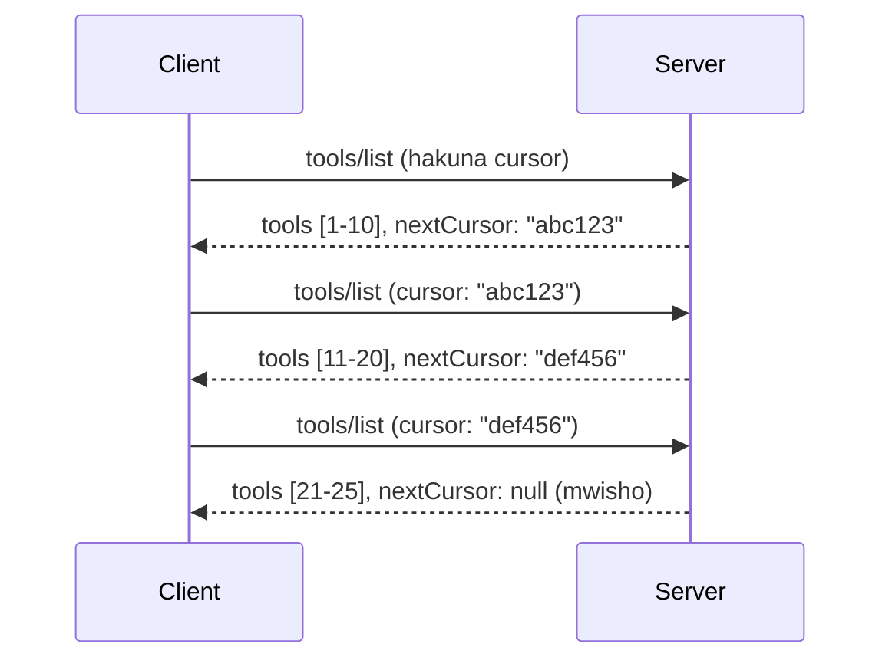

# Upangaji na Mkusanyiko Mkubwa wa Matokeo katika MCP

Wakati seva yako ya MCP inashughulikia seti kubwa za data - iwe ni kuorodhesha maelfu ya faili, rekodi za hifadhidata, au matokeo ya utafutaji - unahitaji upangaji ili kusimamia kumbukumbu kwa ufanisi na kutoa uzoefu wa mtumiaji mwenye usikivu. Mwongozo huu unahusu jinsi ya kutekeleza na kutumia upangaji katika MCP.

## Kwa Nini Upangaji Ni Muhimu

Bila upangaji, majibu makubwa yanaweza kusababisha:

- **Kutumika kwa kumbukumbu kwa kiasi kikubwa** - Kupakia rekodi milioni moja kwa wakati mmoja
- **Muda wa majibu polepole** - Watumiaji wanangoja wakati data yote inapakiwa
- **Makosa ya muda kuisha** - Maombi yanazidi mipaka ya muda
- **Utendaji duni wa AI** - LLMs zinapata shida na muktadha mkubwa sana

MCP inatumia **upangaji unaotumia kielekezi** kwa upenyezaji unaotegemewa na thabiti kupitia seti za matokeo.

---

## Jinsi Upangaji wa MCP Unavyofanya Kazi

### Dhana ya Kielekezi

**Kielekezi** ni mfuatano usio wazi unaoashiria nafasi yako katika seti ya matokeo. Fikiria kama alama ya ukurasa katika kitabu ndefu.


### Upangaji katika Mbinu za MCP

Mbinu hizi za MCP zinaunga mkono upangaji:

| Mbinu | Inarudisha | Msaada wa Kielekezi |
|--------|---------|----------------|
| `tools/list` | Maelezo ya zana | ✅ |
| `resources/list` | Maelezo ya rasilimali | ✅ |
| `prompts/list` | Maelezo ya maswali | ✅ |
| `resources/templates/list` | Violezo vya rasilimali | ✅ |

---

## Utekelezaji wa Seva

### Python (FastMCP)

```python
from mcp.server import Server
from mcp.types import Tool, ListToolsResult
import math

app = Server("paginated-server")

# Kijumlishi kikubwa kilichofanikishwa
ALL_TOOLS = [
    Tool(name=f"tool_{i}", description=f"Tool number {i}", inputSchema={})
    for i in range(100)
]

PAGE_SIZE = 10

@app.list_tools()
async def list_tools(cursor: str | None = None) -> ListToolsResult:
    """List tools with pagination support."""
    
    # Tafsiri kielekezi kupata index ya kuanzia
    start_index = 0
    if cursor:
        try:
            start_index = int(cursor)
        except ValueError:
            start_index = 0
    
    # Pata ukurasa wa matokeo
    end_index = min(start_index + PAGE_SIZE, len(ALL_TOOLS))
    page_tools = ALL_TOOLS[start_index:end_index]
    
    # Hesabu kielekezi kinachofuata
    next_cursor = None
    if end_index < len(ALL_TOOLS):
        next_cursor = str(end_index)
    
    return ListToolsResult(
        tools=page_tools,
        nextCursor=next_cursor
    )
```

### TypeScript

```typescript
import { Server } from "@modelcontextprotocol/sdk/server/index.js";
import { ListToolsResultSchema } from "@modelcontextprotocol/sdk/types.js";

const server = new Server({
  name: "paginated-server",
  version: "1.0.0"
});

// Seti kubwa la data lililojaribishwa
const ALL_TOOLS = Array.from({ length: 100 }, (_, i) => ({
  name: `tool_${i}`,
  description: `Tool number ${i}`,
  inputSchema: { type: "object", properties: {} }
}));

const PAGE_SIZE = 10;

server.setRequestHandler(ListToolsResultSchema, async (request) => {
  // Tambua kidokezo
  let startIndex = 0;
  if (request.params?.cursor) {
    startIndex = parseInt(request.params.cursor, 10) || 0;
  }
  
  // Pata ukurasa wa matokeo
  const endIndex = Math.min(startIndex + PAGE_SIZE, ALL_TOOLS.length);
  const pageTools = ALL_TOOLS.slice(startIndex, endIndex);
  
  // Hesabu kidokezo kinachofuata
  const nextCursor = endIndex < ALL_TOOLS.length ? String(endIndex) : undefined;
  
  return {
    tools: pageTools,
    nextCursor
  };
});
```

### Java (Spring MCP)

```java
@Service
public class PaginatedToolService {
    
    private static final int PAGE_SIZE = 10;
    private final List<Tool> allTools;
    
    public PaginatedToolService() {
        // Anzisha seti kubwa ya data
        this.allTools = IntStream.range(0, 100)
            .mapToObj(i -> new Tool("tool_" + i, "Tool number " + i, Map.of()))
            .collect(Collectors.toList());
    }
    
    @McpMethod("tools/list")
    public ListToolsResult listTools(@Param("cursor") String cursor) {
        // Tafsiri kashkursi
        int startIndex = 0;
        if (cursor != null && !cursor.isEmpty()) {
            try {
                startIndex = Integer.parseInt(cursor);
            } catch (NumberFormatException e) {
                startIndex = 0;
            }
        }
        
        // Pata ukurasa wa matokeo
        int endIndex = Math.min(startIndex + PAGE_SIZE, allTools.size());
        List<Tool> pageTools = allTools.subList(startIndex, endIndex);
        
        // Hesabu kashkursi inayofuata
        String nextCursor = endIndex < allTools.size() ? String.valueOf(endIndex) : null;
        
        return new ListToolsResult(pageTools, nextCursor);
    }
}
```

---

## Utekelezaji wa Mteja

### Mteja wa Python

```python
from mcp import ClientSession

async def get_all_tools(session: ClientSession) -> list:
    """Fetch all tools using pagination."""
    all_tools = []
    cursor = None
    
    while True:
        result = await session.list_tools(cursor=cursor)
        all_tools.extend(result.tools)
        
        if result.nextCursor is None:
            break
        cursor = result.nextCursor
    
    return all_tools

# Matumizi
async with client_session as session:
    tools = await get_all_tools(session)
    print(f"Found {len(tools)} tools")
```

### Mteja wa TypeScript

```typescript
import { Client } from "@modelcontextprotocol/sdk/client/index.js";

async function getAllTools(client: Client): Promise<Tool[]> {
  const allTools: Tool[] = [];
  let cursor: string | undefined = undefined;
  
  do {
    const result = await client.listTools({ cursor });
    allTools.push(...result.tools);
    cursor = result.nextCursor;
  } while (cursor);
  
  return allTools;
}

// Matumizi
const tools = await getAllTools(client);
console.log(`Found ${tools.length} tools`);
```

### Mwamko wa Kupakia Polepole

Kwa seti kubwa sana za data, pakia kurasa unapotaka:

```python
class PaginatedToolIterator:
    """Lazily iterate through paginated tools."""
    
    def __init__(self, session: ClientSession):
        self.session = session
        self.cursor = None
        self.buffer = []
        self.exhausted = False
    
    async def __anext__(self):
        # Rudisha kutoka kwa buffer ikiwa inapatikana
        if self.buffer:
            return self.buffer.pop(0)
        
        # Angalia kama tumemaliza kurasa zote
        if self.exhausted:
            raise StopAsyncIteration
        
        # Pata ukurasa unaofuata
        result = await self.session.list_tools(cursor=self.cursor)
        self.buffer = list(result.tools)
        self.cursor = result.nextCursor
        
        if self.cursor is None:
            self.exhausted = True
        
        if not self.buffer:
            raise StopAsyncIteration
        
        return self.buffer.pop(0)
    
    def __aiter__(self):
        return self

# Matumizi - ya kuokoa kumbukumbu kwa hifadhidata kubwa
async for tool in PaginatedToolIterator(session):
    process_tool(tool)
```

---

## Upangaji kwa Rasilimali

Rasilimali mara nyingi zinahitaji upangaji kwa saraka au seti kubwa za data:

```python
from mcp.server import Server
from mcp.types import Resource, ListResourcesResult
import os

app = Server("file-server")

@app.list_resources()
async def list_resources(cursor: str | None = None) -> ListResourcesResult:
    """List files in directory with pagination."""
    
    directory = "/data/files"
    all_files = sorted(os.listdir(directory))
    
    # Tafsiri kielekezi (fayili ya faharasa)
    start_index = int(cursor) if cursor else 0
    page_size = 20
    end_index = min(start_index + page_size, len(all_files))
    
    # Tengeneza orodha ya rasilimali kwa ukurasa huu
    resources = []
    for filename in all_files[start_index:end_index]:
        filepath = os.path.join(directory, filename)
        resources.append(Resource(
            uri=f"file://{filepath}",
            name=filename,
            mimeType="application/octet-stream"
        ))
    
    # Hisa kielekezi kinachofuata
    next_cursor = str(end_index) if end_index < len(all_files) else None
    
    return ListResourcesResult(
        resources=resources,
        nextCursor=next_cursor
    )
```

---

## Mikakati ya Kubuni Kielekezi

### Mkakati 1: Kifani cha Index (Rahisi)

```python
# Kainushi ni tu kiambatisho
cursor = "50"  # Anza kwenye kipengee cha 50
```

**Faida:** Rahisi, haina hali
**Hasara:** Matokeo yanaweza kubadilika ikiwa vitu vinaongezwa/kuondolewa

### Mkakati 2: Kifani cha ID (Thabiti)

```python
# Kielekezi ni ID ya mwisho kuona
cursor = "item_abc123"  # Anza baada ya kipengee hiki
```

**Faida:** Thabiti hata kama vitu vinabadilika
**Hasara:** Inahitaji IDs zilizo pangwa

### Mkakati 3: Hali Iliyo Kodishwa (Ngumu)

```python
import base64
import json

def encode_cursor(state: dict) -> str:
    return base64.b64encode(json.dumps(state).encode()).decode()

def decode_cursor(cursor: str) -> dict:
    return json.loads(base64.b64decode(cursor).decode())

# Kursor ina nyanja nyingi za hali
cursor = encode_cursor({
    "offset": 50,
    "filter": "active",
    "sort": "name"
})
```

**Faida:** Inaweza kukodisha hali ngumu
**Hasara:** Ngumu zaidi, kielekezi kikubwa

---

## Mambo Bora Za Kufanywa

### 1. Chagua Ukubwa wa Kurasa Unaofaa

```python
# Zingatia ukubwa wa data
PAGE_SIZE_SMALL_ITEMS = 100   # Metadata rahisi
PAGE_SIZE_MEDIUM_ITEMS = 20   # Vitu vyenye utajiri zaidi
PAGE_SIZE_LARGE_ITEMS = 5     # Maudhui changamano
```

### 2. Hudumia Kielekezi Kisicho Sahihi kwa Upole

```python
@app.list_tools()
async def list_tools(cursor: str | None = None) -> ListToolsResult:
    try:
        start_index = int(cursor) if cursor else 0
        if start_index < 0 or start_index >= len(ALL_TOOLS):
            start_index = 0  # Weka upya kutoka mwanzo
    except (ValueError, TypeError):
        start_index = 0  # Kielekezi batili, anza upya
    # ...
```

### 3. Jumuisha Jumla ya Hesabu (Hiari)

```python
return ListToolsResult(
    tools=page_tools,
    nextCursor=next_cursor,
    # Baadhi ya utekelezaji ni pamoja na jumla kwa maendeleo ya UI
    _meta={"total": len(ALL_TOOLS)}
)
```

### 4. Jaribu Mikataba ya Kiwango cha Juu

```python
async def test_pagination():
    # Seti ya matokeo tupu
    result = await session.list_tools()
    assert result.tools == []
    assert result.nextCursor is None
    
    # Ukurasa mmoja
    result = await session.list_tools()
    assert len(result.tools) <= PAGE_SIZE
    
    # Kirusha batili
    result = await session.list_tools(cursor="invalid")
    assert result.tools  # Inapaswa kurudisha ukurasa wa kwanza
```

---

## Makosa Ya Kawaida

### ❌ Kurudisha Matokeo Yote Kisha Kufanya Upangaji Kwenye Mteja

```python
# MBAYA: Inaleta kila kitu kwenye kumbukumbu
@app.list_tools()
async def list_tools() -> ListToolsResult:
    all_tools = load_all_tools()  # Zana milioni 1!
    return ListToolsResult(tools=all_tools)
```

### ✅ Fanya Upangaji Kwenye Chanzo cha Data

```python
# BORA: Inapakia tu kile kinachohitajika
@app.list_tools()
async def list_tools(cursor: str | None = None) -> ListToolsResult:
    offset = int(cursor) if cursor else 0
    tools = await db.query_tools(offset=offset, limit=PAGE_SIZE)
    return ListToolsResult(tools=tools, nextCursor=...)
```

---

## Ifuatayo Ni Nini

- [Moduli 5.14 - Uhandisi wa Muktadha](../../05-AdvancedTopics/mcp-contextengineering/README.md)
- [Moduli 8 - Mambo Bora Za Kufanywa](../../08-BestPractices/README.md)
- [3.8 - Kupima Seva Yako ya MCP](../../03-GettingStarted/08-testing/README.md)

---

## Rasilimali Zaidi

- [Maelezo ya MCP - Upangaji](https://spec.modelcontextprotocol.io/specification/2025-11-25/)
- [Maelezo ya Upangaji Unaotumia Kielekezi](https://slack.engineering/evolving-api-pagination-at-slack/)
- [Majaribio ya upangaji ya SDK ya Python](https://github.com/modelcontextprotocol/python-sdk/blob/main/tests/client/test_list_methods_cursor.py)

---

<!-- CO-OP TRANSLATOR DISCLAIMER START -->
**Kiarifu cha Msamaha**:
Nyaraka hii imetafsiriwa kwa kutumia huduma ya tafsiri ya AI [Co-op Translator](https://github.com/Azure/co-op-translator). Ingawa tunajitahidi kuwa sahihi, tafadhali fahamu kwamba tafsiri za otomati zinaweza kuwa na makosa au kasoro. Nyaraka ya asili katika lugha yake halali inapaswa kuzingatiwa kama chanzo cha mamlaka. Kwa taarifa muhimu, tafsiri ya kitaalamu ya binadamu inapendekezwa. Hatuwajibiki kwa kutoelewana au tafsiri potofu zinazotokana na matumizi ya tafsiri hii.
<!-- CO-OP TRANSLATOR DISCLAIMER END -->