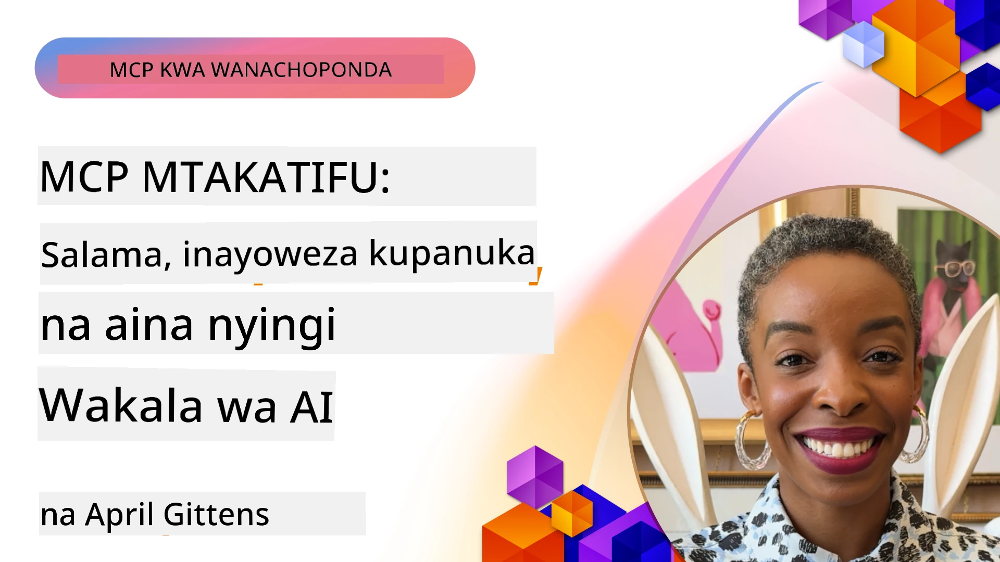

# Mada Zinazotanguliwa katika MCP

_(Bonyeza picha hapo juu kutazama video ya somo hili)_

Sura hii inashughulikia mfululizo wa mada za juu katika utekelezaji wa Itifaki ya Muktadha wa Mfano (MCP), ikiwa ni pamoja na ujumuishaji wa moduli nyingi, kuongeza ukubwa, mbinu bora za usalama, na ujumuishaji wa biashara. Mada hizi ni muhimu kwa kujenga programu imara na zinazotegemewa za MCP zinazoweza kukidhi mahitaji ya mifumo ya kisasa ya AI.

## Muhtasari

Somo hili linachunguza dhana za juu katika utekelezaji wa Itifaki ya Muktadha wa Mfano, likilenga ujumuishaji wa moduli nyingi, kuongeza ukubwa, mbinu bora za usalama, na ujumuishaji wa biashara. Mada hizi ni muhimu kwa ajili ya kujenga programu za kiwango cha uzalishaji cha MCP zinazoweza kushughulikia mahitaji magumu katika mazingira ya biashara.

## Malengo ya Kujifunza

Mwisho wa somo hili, utaweza:

- Kutekeleza uwezo wa moduli nyingi ndani ya mifumo ya MCP
- Kubuni usanifu wa MCP unaoweza kuongezeka ukubwa kwa hali za mahitaji makubwa
- Kutumia mbinu bora za usalama zinazolingana na kanuni za usalama za MCP
- Kuunganisha MCP na mifumo na mifumo ya AI ya biashara
- Kuboresha utendaji na uaminifu katika mazingira ya uzalishaji

## Masomo na Miradi ya Mfano

| Kiungo | Kichwa | Maelezo |
|------|-------|-------------|
| [5.1 Ujumuishaji na Azure](./mcp-integration/README.md) | Jumuisha na Azure | Jifunze jinsi ya kuunganisha MCP Server yako kwenye Azure |
| [5.2 Mfano wa Moduli Nyingi](./mcp-multi-modality/README.md) | Sampuli za MCP Moduli Nyingi  | Sampuli za sauti, picha na majibu ya moduli nyingi |
| [5.3 Mfano wa MCP OAuth2](../../../05-AdvancedTopics/mcp-oauth2-demo) | Demo ya MCP OAuth2 | Programu ndogo ya Spring Boot inayoonyesha OAuth2 na MCP, kama Server wa Idhini na Rasilimali. Inaonyesha utoaji wa tokeni salama, vituo vilivyeruhusiwa, uhamishaji wa Azure Container Apps, na ujumuishaji wa Usimamizi wa API. |
| [5.4 Muktadha wa Mizizi](./mcp-root-contexts/README.md) | Muktadha wa Mizizi  | Jifunze zaidi kuhusu muktadha wa mizizi na jinsi ya kuwatekeleza |
| [5.5 Upangaji Njia](./mcp-routing/README.md) | Upangaji Njia | Jifunze aina tofauti za upangaji njia |
| [5.6 Sampuli](./mcp-sampling/README.md) | Sampuli | Jifunze jinsi ya kufanya kazi na sampuli |
| [5.7 Kupanuka](./mcp-scaling/README.md) | Kupanuka  | Jifunze kuhusu kupanuka |
| [5.8 Usalama](./mcp-security/README.md) | Usalama  | Linda MCP Server yako |
| [5.9 Mfano wa Utafutaji Wa Mtandao](./web-search-mcp/README.md) | Utafutaji wa Mtandao MCP | MCP server na mteja wa Python wanaojumuisha SerpAPI kwa utafutaji wa mtandao halisi, habari, bidhaa, na maswali na majibu. Inaonyesha usimamizi wa zana nyingi, ujumuishaji wa API za nje, na utunzaji thabiti wa makosa. |
| [5.10 Utoaji Data wa Moja kwa Moja](./mcp-realtimestreaming/README.md) | Utoaji wa Mfululizo  | Utoaji wa data wa moja kwa moja umekuwa wa lazima katika dunia ya leo inayotegemea data, ambapo biashara na programu zinahitaji upatikanaji wa habari mara moja kwa maamuzi ya wakati.|
| [5.11 Utafutaji wa Mtandao wa Moja kwa Moja](./mcp-realtimesearch/README.md) | Utafutaji wa Mtandao | Utafutaji wa mtandao wa moja kwa moja - jinsi MCP inavyobadilisha utafutaji wa mtandao kwa kutoa njia iliyowekwa ya usimamizi wa muktadha kupitia mifano ya AI, injini za utafutaji, na programu.| 
| [5.12 Uthibitishaji wa Entra ID kwa Servers za Model Context Protocol](./mcp-security-entra/README.md) | Uthibitishaji wa Entra ID | Microsoft Entra ID inatoa suluhisho thabiti la mtandao la usimamizi wa utambulisho na ufikiaji, kusaidia kuhakikisha kuwa watumiaji na programu zilizoidhinishwa tu ndizo zinaweza kuingiliana na server yako ya MCP.|
| [5.13 Ujumuishaji wa Wakala wa Azure AI Foundry](./mcp-foundry-agent-integration/README.md) | Ujumuishaji wa Azure AI Foundry | Jifunze jinsi ya kuunganisha servers za Model Context Protocol na mawakala wa Azure AI Foundry, kuwezesha usimamizi mzuri wa zana na uwezo wa AI wa biashara kwa muunganisho wa vyanzo vya data vya nje vilivyo kuwa viwango.|
| [5.14 Uhandisi wa Muktadha](./mcp-contextengineering/README.md) | Uhandisi wa Muktadha | Fursa ya baadaye ya mbinu za uhandisi wa muktadha kwa servers za MCP, ikijumuisha uboreshaji wa muktadha, usimamizi wa muktadha unaobadilika, na mikakati ya uhandisi wa maagizo ndani ya mifumo ya MCP.|
| [5.15 Usafirishaji Maalum wa MCP](./mcp-transport/README.md) | Usafirishaji Maalum | Jifunze jinsi ya kutekeleza mbinu maalum za usafirishaji kwa hali maalum za mawasiliano za MCP.|
| [5.16 Kina cha Vipengele vya Itifaki](./mcp-protocol-features/README.md) | Vipengele vya Itifaki | Jasiri vipengele vya juu vya itifaki ikijumuisha arifa za maendeleo, kufuta maombi, templeti za rasilimali, na mifumo ya utunzaji wa makosa.|

> **Mpya katika Maelezo ya MCP 2025-11-25**: Maelezo sasa yanajumuisha msaada wa majaribio kwa **Kazi** (operesheni za muda mrefu zenye ufuatiliaji wa maendeleo), **Maelezo ya Zana** (metadata kuhusu tabia za zana kwa usalama), **Ufafanuzi wa Hali ya URL** (kutoa maombi ya yaliyomo maalum ya URL kutoka kwa wateja), na **Mizizi** iliyoboreshwa (kwa usimamizi wa muktadha wa maeneo ya kazi). Angalia [rekodi ya mabadiliko ya Maelezo ya MCP](https://spec.modelcontextprotocol.io/) kwa maelezo kamili.

## Marejeleo Zaidi

Kwa taarifa za kisasa zaidi juu ya mada za juu za MCP, rejea:
- [Nyaraka za MCP](https://modelcontextprotocol.io/)
- [Maelezo ya MCP (2025-11-25)](https://spec.modelcontextprotocol.io/specification/2025-11-25/)
- [Hifadhi ya GitHub](https://github.com/modelcontextprotocol)
- [Orodha ya Juu 10 ya Usalama wa MCP wa OWASP](https://microsoft.github.io/mcp-azure-security-guide/mcp/) - Hatari za usalama na mbinu za kutokomeza
- [Warsha ya Mkutano wa Usalama wa MCP (Sherpa)](https://azure-samples.github.io/sherpa/) - Mafunzo ya usalama ya vitendo

## Muhimu Kuhifadhi Akilini

- Utekelezaji wa moduli nyingi wa MCP unapanua uwezo wa AI zaidi ya usindikaji wa maandishi
- Kupanuka ni muhimu kwa utekelezaji wa biashara na kinaweza kushughulikiwa kwa kupanua kwa usawa na inavyoelekea juu
- Hatua kamili za usalama zinatulinda data na kuhakikisha udhibiti mzuri wa upatikanaji
- Ujumuishaji wa biashara na majukwaa kama Azure OpenAI na Microsoft AI Foundry unakuza uwezo wa MCP
- Utekelezaji wa juu wa MCP unafaidika na usanifu ulioboreshwa na usimamizi wa rasilimali kwa uangalifu

## Mazoezi

Buni utekelezaji wa MCP wa kiwango cha biashara kwa matumizi maalum:

1. Tambua mahitaji ya moduli nyingi kwa matumizi yako
2. Eleza udhibiti wa usalama unaohitajika kulinda data nyeti
3. Buni usanifu unaoweza kuongezeka ukubwa ambazo zinaweza kushughulikia mizigo tofauti
4. Panga viungo vya ujumuishaji na mifumo ya AI ya biashara
5. Andika matatizo yanayoweza kutokea katika utendaji na mikakati ya kukabiliana nayo

## Rasilimali Zaidi

- [Nyaraka za Azure OpenAI](https://learn.microsoft.com/en-us/azure/ai-services/openai/)
- [Nyaraka za Microsoft AI Foundry](https://learn.microsoft.com/en-us/ai-services/)

---

## Kinachofuata

Chunguza masomo katika moduli hii kuanzia: [5.1 Ujumuishaji wa MCP](./mcp-integration/README.md)

Mara tu utakapo maliza moduli hii, endelea na: [Moduli 6: Michango ya Jamii](../06-CommunityContributions/README.md)

---

<!-- CO-OP TRANSLATOR DISCLAIMER START -->
**Tangazo la Kutokujali**:
Hati hii imetafsiriwa kwa kutumia huduma ya tafsiri ya AI [Co-op Translator](https://github.com/Azure/co-op-translator). Ingawa tunajitahidi kufikia usahihi, tafadhali fahamu kwamba tafsiri za kiotomatiki zinaweza kuwa na makosa au upungufu wa usahihi. Hati ya asili katika lugha yake ya asili inapaswa kuzingatiwa kama chanzo cha mamlaka. Kwa taarifa muhimu, tafsiri ya kitaalamu inayofanywa na binadamu inashauriwa. Hatubebe dhamana yoyote kwa kutoelewana au tafsiri potofu zinazotokana na matumizi ya tafsiri hii.
<!-- CO-OP TRANSLATOR DISCLAIMER END -->