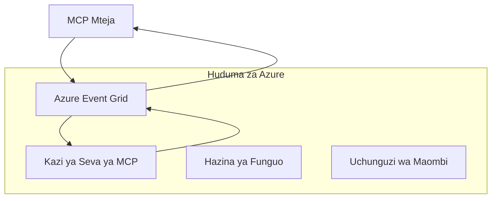
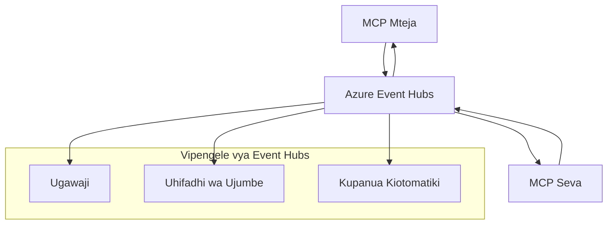

# MCP Usafirishaji Maalum - Mwongozo wa Utekelezaji wa Juu

Itifaki ya Muktadha wa Mfano (MCP) inatoa unyumbufu katika mbinu za usafirishaji, ikiruhusu utekelezaji maalum kwa mazingira maalum ya biashara. Mwongozo huu wa juu unachunguza utekelezaji wa usafirishaji maalum kwa kutumia Azure Event Grid na Azure Event Hubs kama mifano ya vitendo ya kujenga suluhisho za MCP zinazoweza kupanuka na asili ya wingu.

## Utangulizi

Wakati usafirishaji wa kawaida wa MCP (stdio na uchezaji wa HTTP) unahudumia matumizi mengi, mazingira ya biashara mara nyingi yanahitaji mbinu maalum za usafirishaji kwa ajili ya kuongeza uwezo wa kupanuka, kuaminika, na kuunganishwa na miundombinu ya wingu iliyopo. Usafirishaji maalum unamwezesha MCP kutumia huduma za ujumbe za asili za wingu kwa mawasiliano yasiyo ya papo hapo, usanifu unaoendeshwa na matukio, na usindikaji uliosambazwa.

Somo hili linachunguza utekelezaji wa usafirishaji wa juu kulingana na sifa za hivi karibuni za MCP (2025-11-25), huduma za ujumbe za Azure, na mifumo iliyothibitishwa ya kuunganisha biashara.

### **Mimaarifa ya Usafirishaji wa MCP**

**Kutoka kwa Sifa za MCP (2025-11-25):**

- **Usafirishaji wa Kawaida**: stdio (inapendekezwa), uchezaji wa HTTP (kwa hali za mbali)
- **Usafirishaji Maalum**: Usafirishaji wowote unaotekeleza itifaki ya kubadilishana ujumbe ya MCP
- **Muundo wa Ujumbe**: JSON-RPC 2.0 na nyongeza maalum za MCP
- **Mawasiliano ya Mwelekeo Mbili**: Mawasiliano ya duplex kamili yanahitajika kwa taarifa na majibu

## Malengo ya Kujifunza

Mwisho wa somo hili la juu, utaweza:

- **Kuelewa Mahitaji ya Usafirishaji Maalum**: Tekeleza itifaki ya MCP juu ya safu yoyote ya usafirishaji huku ukizingatia ufuataji
- **Kujenga Usafirishaji wa Azure Event Grid**: Tengeneza seva za MCP zinazoendeshwa na matukio kwa kutumia Azure Event Grid kwa upanuzi usio na seva
- **Kutekeleza Usafirishaji wa Azure Event Hubs**: Buni suluhisho za MCP zenye mtiririko wa juu kwa kutumia Azure Event Hubs kwa uchezaji wa wakati halisi
- **Tumia Mifumo ya Biashara**: Unganisha usafirishaji maalum na miundombinu ya Azure iliyopo na mifano ya usalama
- **Shughulikia Uaminifu wa Usafirishaji**: Tekeleza uimara wa ujumbe, upangaji, na usimamizi wa makosa kwa hali za biashara
- **Boresha Utendaji**: Buni suluhisho za usafirishaji kwa mahitaji ya upanuzi, ucheleweshaji, na mtiririko

## **Mahitaji ya Usafirishaji**

### **Mahitaji Muhimu kutoka kwa Sifa za MCP (2025-11-25):**

```yaml
Message Protocol:
  format: "JSON-RPC 2.0 with MCP extensions"
  bidirectional: "Full duplex communication required"
  ordering: "Message ordering must be preserved per session"
  
Transport Layer:
  reliability: "Transport MUST handle connection failures gracefully"
  security: "Transport MUST support secure communication"
  identification: "Each session MUST have unique identifier"
  
Custom Transport:
  compliance: "MUST implement complete MCP message exchange"
  extensibility: "MAY add transport-specific features"
  interoperability: "MUST maintain protocol compatibility"
```

## **Utekelezaji wa Usafirishaji wa Azure Event Grid**

Azure Event Grid hutoa huduma ya kuongoza matukio isiyo na seva inayofaa kwa usanifu wa MCP unaoendeshwa na matukio. Utekelezaji huu unaonyesha jinsi ya kujenga mifumo ya MCP inayoweza kupanuka na isiyounganishwa kwa karibu.

### **Muhtasari wa Mimaarifa**


### **Utekelezaji wa C# - Usafirishaji wa Event Grid**

```csharp
using Azure.Messaging.EventGrid;
using Microsoft.Extensions.Azure;
using System.Text.Json;

public class EventGridMcpTransport : IMcpTransport
{
    private readonly EventGridPublisherClient _publisher;
    private readonly string _topicEndpoint;
    private readonly string _clientId;
    
    public EventGridMcpTransport(string topicEndpoint, string accessKey, string clientId)
    {
        _publisher = new EventGridPublisherClient(
            new Uri(topicEndpoint), 
            new AzureKeyCredential(accessKey));
        _topicEndpoint = topicEndpoint;
        _clientId = clientId;
    }
    
    public async Task SendMessageAsync(McpMessage message)
    {
        var eventGridEvent = new EventGridEvent(
            subject: $"mcp/{_clientId}",
            eventType: "MCP.MessageReceived",
            dataVersion: "1.0",
            data: JsonSerializer.Serialize(message))
        {
            Id = Guid.NewGuid().ToString(),
            EventTime = DateTimeOffset.UtcNow
        };
        
        await _publisher.SendEventAsync(eventGridEvent);
    }
    
    public async Task<McpMessage> ReceiveMessageAsync(CancellationToken cancellationToken)
    {
        // Event Grid is push-based, so implement webhook receiver
        // This would typically be handled by Azure Functions trigger
        throw new NotImplementedException("Use EventGridTrigger in Azure Functions");
    }
}

// Azure Function for receiving Event Grid events
[FunctionName("McpEventGridReceiver")]
public async Task<IActionResult> HandleEventGridMessage(
    [EventGridTrigger] EventGridEvent eventGridEvent,
    ILogger log)
{
    try
    {
        var mcpMessage = JsonSerializer.Deserialize<McpMessage>(
            eventGridEvent.Data.ToString());
        
        // Process MCP message
        var response = await _mcpServer.ProcessMessageAsync(mcpMessage);
        
        // Send response back via Event Grid
        await _transport.SendMessageAsync(response);
        
        return new OkResult();
    }
    catch (Exception ex)
    {
        log.LogError(ex, "Error processing Event Grid MCP message");
        return new BadRequestResult();
    }
}
```

### **Utekelezaji wa TypeScript - Usafirishaji wa Event Grid**

```typescript
import { EventGridPublisherClient, AzureKeyCredential } from "@azure/eventgrid";
import { McpTransport, McpMessage } from "./mcp-types";

export class EventGridMcpTransport implements McpTransport {
    private publisher: EventGridPublisherClient;
    private clientId: string;
    
    constructor(
        private topicEndpoint: string,
        private accessKey: string,
        clientId: string
    ) {
        this.publisher = new EventGridPublisherClient(
            topicEndpoint,
            new AzureKeyCredential(accessKey)
        );
        this.clientId = clientId;
    }
    
    async sendMessage(message: McpMessage): Promise<void> {
        const event = {
            id: crypto.randomUUID(),
            source: `mcp-client-${this.clientId}`,
            type: "MCP.MessageReceived",
            time: new Date(),
            data: message
        };
        
        await this.publisher.sendEvents([event]);
    }
    
    // Kupokea kwa tukio kupitia Azure Functions
    onMessage(handler: (message: McpMessage) => Promise<void>): void {
        // Utekelezaji utatumia Azure Functions Event Grid trigger
        // Hii ni kiolesura cha dhana kwa mpokeaji wa webhook
    }
}

// Utekelezaji wa Azure Functions
import { app, InvocationContext, EventGridEvent } from "@azure/functions";

app.eventGrid("mcpEventGridHandler", {
    handler: async (event: EventGridEvent, context: InvocationContext) => {
        try {
            const mcpMessage = event.data as McpMessage;
            
            // Kusindika ujumbe wa MCP
            const response = await mcpServer.processMessage(mcpMessage);
            
            // Tuma jibu kupitia Event Grid
            await transport.sendMessage(response);
            
        } catch (error) {
            context.error("Error processing MCP message:", error);
            throw error;
        }
    }
});
```

### **Utekelezaji wa Python - Usafirishaji wa Event Grid**

```python
from azure.eventgrid import EventGridPublisherClient, EventGridEvent
from azure.core.credentials import AzureKeyCredential
import asyncio
import json
from typing import Callable, Optional
import uuid
from datetime import datetime

class EventGridMcpTransport:
    def __init__(self, topic_endpoint: str, access_key: str, client_id: str):
        self.client = EventGridPublisherClient(
            topic_endpoint, 
            AzureKeyCredential(access_key)
        )
        self.client_id = client_id
        self.message_handler: Optional[Callable] = None
    
    async def send_message(self, message: dict) -> None:
        """Send MCP message via Event Grid"""
        event = EventGridEvent(
            data=message,
            subject=f"mcp/{self.client_id}",
            event_type="MCP.MessageReceived",
            data_version="1.0"
        )
        
        await self.client.send(event)
    
    def on_message(self, handler: Callable[[dict], None]) -> None:
        """Register message handler for incoming events"""
        self.message_handler = handler

# Utekelezaji wa Azure Functions
import azure.functions as func
import logging

def main(event: func.EventGridEvent) -> None:
    """Azure Functions Event Grid trigger for MCP messages"""
    try:
        # Tafsiri ujumbe wa MCP kutoka kwa tukio la Event Grid
        mcp_message = json.loads(event.get_body().decode('utf-8'))
        
        # Chakata ujumbe wa MCP
        response = process_mcp_message(mcp_message)
        
        # Tuma jibu kurudi kupitia Event Grid
        # (Utekelezaji utaunda mteja mpya wa Event Grid)
        
    except Exception as e:
        logging.error(f"Error processing MCP Event Grid message: {e}")
        raise
```

## **Utekelezaji wa Usafirishaji wa Azure Event Hubs**

Azure Event Hubs hutoa uwezo wa mtiririko wa juu wa wakati halisi kwa hali za MCP zinazohitaji ucheleweshaji mdogo na kiasi kikubwa cha ujumbe.

### **Muhtasari wa Mimaarifa**


### **Utekelezaji wa C# - Usafirishaji wa Event Hubs**

```csharp
using Azure.Messaging.EventHubs;
using Azure.Messaging.EventHubs.Producer;
using Azure.Messaging.EventHubs.Consumer;
using System.Text;

public class EventHubsMcpTransport : IMcpTransport, IDisposable
{
    private readonly EventHubProducerClient _producer;
    private readonly EventHubConsumerClient _consumer;
    private readonly string _consumerGroup;
    private readonly CancellationTokenSource _cancellationTokenSource;
    
    public EventHubsMcpTransport(
        string connectionString, 
        string eventHubName,
        string consumerGroup = "$Default")
    {
        _producer = new EventHubProducerClient(connectionString, eventHubName);
        _consumer = new EventHubConsumerClient(
            consumerGroup, 
            connectionString, 
            eventHubName);
        _consumerGroup = consumerGroup;
        _cancellationTokenSource = new CancellationTokenSource();
    }
    
    public async Task SendMessageAsync(McpMessage message)
    {
        var messageBody = JsonSerializer.Serialize(message);
        var eventData = new EventData(Encoding.UTF8.GetBytes(messageBody));
        
        // Add MCP-specific properties
        eventData.Properties.Add("MessageType", message.Method ?? "response");
        eventData.Properties.Add("MessageId", message.Id);
        eventData.Properties.Add("Timestamp", DateTimeOffset.UtcNow);
        
        await _producer.SendAsync(new[] { eventData });
    }
    
    public async Task StartReceivingAsync(
        Func<McpMessage, Task> messageHandler)
    {
        await foreach (PartitionEvent partitionEvent in _consumer.ReadEventsAsync(
            _cancellationTokenSource.Token))
        {
            try
            {
                var messageBody = Encoding.UTF8.GetString(
                    partitionEvent.Data.EventBody.ToArray());
                var mcpMessage = JsonSerializer.Deserialize<McpMessage>(messageBody);
                
                await messageHandler(mcpMessage);
            }
            catch (Exception ex)
            {
                // Handle deserialization or processing errors
                Console.WriteLine($"Error processing message: {ex.Message}");
            }
        }
    }
    
    public void Dispose()
    {
        _cancellationTokenSource?.Cancel();
        _producer?.DisposeAsync().AsTask().Wait();
        _consumer?.DisposeAsync().AsTask().Wait();
        _cancellationTokenSource?.Dispose();
    }
}
```

### **Utekelezaji wa TypeScript - Usafirishaji wa Event Hubs**

```typescript
import { 
    EventHubProducerClient, 
    EventHubConsumerClient, 
    EventData 
} from "@azure/event-hubs";

export class EventHubsMcpTransport implements McpTransport {
    private producer: EventHubProducerClient;
    private consumer: EventHubConsumerClient;
    private isReceiving = false;
    
    constructor(
        private connectionString: string,
        private eventHubName: string,
        private consumerGroup: string = "$Default"
    ) {
        this.producer = new EventHubProducerClient(
            connectionString, 
            eventHubName
        );
        this.consumer = new EventHubConsumerClient(
            consumerGroup,
            connectionString,
            eventHubName
        );
    }
    
    async sendMessage(message: McpMessage): Promise<void> {
        const eventData: EventData = {
            body: JSON.stringify(message),
            properties: {
                messageType: message.method || "response",
                messageId: message.id,
                timestamp: new Date().toISOString()
            }
        };
        
        await this.producer.sendBatch([eventData]);
    }
    
    async startReceiving(
        messageHandler: (message: McpMessage) => Promise<void>
    ): Promise<void> {
        if (this.isReceiving) return;
        
        this.isReceiving = true;
        
        const subscription = this.consumer.subscribe({
            processEvents: async (events, context) => {
                for (const event of events) {
                    try {
                        const messageBody = event.body as string;
                        const mcpMessage: McpMessage = JSON.parse(messageBody);
                        
                        await messageHandler(mcpMessage);
                        
                        // Sasisha alama ya ukaguzi kwa utoaji wa angalau mara moja
                        await context.updateCheckpoint(event);
                    } catch (error) {
                        console.error("Error processing Event Hubs message:", error);
                    }
                }
            },
            processError: async (err, context) => {
                console.error("Event Hubs error:", err);
            }
        });
    }
    
    async close(): Promise<void> {
        this.isReceiving = false;
        await this.producer.close();
        await this.consumer.close();
    }
}
```

### **Utekelezaji wa Python - Usafirishaji wa Event Hubs**

```python
from azure.eventhub import EventHubProducerClient, EventHubConsumerClient
from azure.eventhub import EventData
import json
import asyncio
from typing import Callable, Dict, Any
import logging

class EventHubsMcpTransport:
    def __init__(
        self, 
        connection_string: str, 
        eventhub_name: str,
        consumer_group: str = "$Default"
    ):
        self.producer = EventHubProducerClient.from_connection_string(
            connection_string, 
            eventhub_name=eventhub_name
        )
        self.consumer = EventHubConsumerClient.from_connection_string(
            connection_string,
            consumer_group=consumer_group,
            eventhub_name=eventhub_name
        )
        self.is_receiving = False
    
    async def send_message(self, message: Dict[str, Any]) -> None:
        """Send MCP message via Event Hubs"""
        event_data = EventData(json.dumps(message))
        
        # Ongeza mali maalum za MCP
        event_data.properties = {
            "messageType": message.get("method", "response"),
            "messageId": message.get("id"),
            "timestamp": "2025-01-14T10:30:00Z"  # Tumia alama ya wakati halisi
        }
        
        async with self.producer:
            event_data_batch = await self.producer.create_batch()
            event_data_batch.add(event_data)
            await self.producer.send_batch(event_data_batch)
    
    async def start_receiving(
        self, 
        message_handler: Callable[[Dict[str, Any]], None]
    ) -> None:
        """Start receiving MCP messages from Event Hubs"""
        if self.is_receiving:
            return
        
        self.is_receiving = True
        
        async with self.consumer:
            await self.consumer.receive(
                on_event=self._on_event_received(message_handler),
                starting_position="-1"  # Anza kutoka mwanzo
            )
    
    def _on_event_received(self, handler: Callable):
        """Internal event handler wrapper"""
        async def handle_event(partition_context, event):
            try:
                # Tafsiri ujumbe wa MCP kutoka kwa tukio la Event Hubs
                message_body = event.body_as_str(encoding='UTF-8')
                mcp_message = json.loads(message_body)
                
                # Chakata ujumbe wa MCP
                await handler(mcp_message)
                
                # Sasisha alama ya ukaguzi kwa usambazaji wa angalau mara moja
                await partition_context.update_checkpoint(event)
                
            except Exception as e:
                logging.error(f"Error processing Event Hubs message: {e}")
        
        return handle_event
    
    async def close(self) -> None:
        """Clean up transport resources"""
        self.is_receiving = False
        await self.producer.close()
        await self.consumer.close()
```

## **Mifumo ya Usafirishaji ya Juu**

### **Uimara na Uaminifu wa Ujumbe**

```csharp
// Implementing message durability with retry logic
public class ReliableTransportWrapper : IMcpTransport
{
    private readonly IMcpTransport _innerTransport;
    private readonly RetryPolicy _retryPolicy;
    
    public async Task SendMessageAsync(McpMessage message)
    {
        await _retryPolicy.ExecuteAsync(async () =>
        {
            try
            {
                await _innerTransport.SendMessageAsync(message);
            }
            catch (TransportException ex) when (ex.IsRetryable)
            {
                // Log and retry
                throw;
            }
        });
    }
}
```

### **Uunganishaji wa Usalama wa Usafirishaji**

```csharp
// Integrating Azure Key Vault for transport security
public class SecureTransportFactory
{
    private readonly SecretClient _keyVaultClient;
    
    public async Task<IMcpTransport> CreateEventGridTransportAsync()
    {
        var accessKey = await _keyVaultClient.GetSecretAsync("EventGridAccessKey");
        var topicEndpoint = await _keyVaultClient.GetSecretAsync("EventGridTopic");
        
        return new EventGridMcpTransport(
            topicEndpoint.Value.Value,
            accessKey.Value.Value,
            Environment.MachineName
        );
    }
}
```

### **Ufuatiliaji na Uwezo wa Kuonekana wa Usafirishaji**

```csharp
// Adding telemetry to custom transports
public class ObservableTransport : IMcpTransport
{
    private readonly IMcpTransport _transport;
    private readonly ILogger _logger;
    private readonly TelemetryClient _telemetryClient;
    
    public async Task SendMessageAsync(McpMessage message)
    {
        using var activity = Activity.StartActivity("MCP.Transport.Send");
        activity?.SetTag("transport.type", "EventGrid");
        activity?.SetTag("message.method", message.Method);
        
        var stopwatch = Stopwatch.StartNew();
        
        try
        {
            await _transport.SendMessageAsync(message);
            
            _telemetryClient.TrackDependency(
                "EventGrid",
                "SendMessage",
                DateTime.UtcNow.Subtract(stopwatch.Elapsed),
                stopwatch.Elapsed,
                true
            );
        }
        catch (Exception ex)
        {
            _telemetryClient.TrackException(ex);
            throw;
        }
    }
}
```

## **Hali za Kuunganisha Biashara**

### **Hali 1: Usindikaji wa MCP Uliosambazwa**

Kutumia Azure Event Grid kusambaza maombi ya MCP kwa nodi nyingi za usindikaji:

```yaml
Architecture:
  - MCP Client sends requests to Event Grid topic
  - Multiple Azure Functions subscribe to process different tool types
  - Results aggregated and returned via separate response topic
  
Benefits:
  - Horizontal scaling based on message volume
  - Fault tolerance through redundant processors
  - Cost optimization with serverless compute
```

### **Hali 2: Uchezaji wa MCP wa Wakati Halisi**

Kutumia Azure Event Hubs kwa mwingiliano wa MCP wenye mzunguko wa juu:

```yaml
Architecture:
  - MCP Client streams continuous requests via Event Hubs
  - Stream Analytics processes and routes messages
  - Multiple consumers handle different aspect of processing
  
Benefits:
  - Low latency for real-time scenarios
  - High throughput for batch processing
  - Built-in partitioning for parallel processing
```

### **Hali 3: Mimaarifa Mchanganyiko ya Usafirishaji**

Kuchanganya usafirishaji mbalimbali kwa matumizi tofauti:

```csharp
public class HybridMcpTransport : IMcpTransport
{
    private readonly IMcpTransport _realtimeTransport; // Event Hubs
    private readonly IMcpTransport _batchTransport;    // Event Grid
    private readonly IMcpTransport _fallbackTransport; // HTTP Streaming
    
    public async Task SendMessageAsync(McpMessage message)
    {
        // Route based on message characteristics
        var transport = message.Method switch
        {
            "tools/call" when IsRealtime(message) => _realtimeTransport,
            "resources/read" when IsBatch(message) => _batchTransport,
            _ => _fallbackTransport
        };
        
        await transport.SendMessageAsync(message);
    }
}
```

## **Uboreshaji wa Utendaji**

### **Kufunga Ujumbe kwa Event Grid**

```csharp
public class BatchingEventGridTransport : IMcpTransport
{
    private readonly List<McpMessage> _messageBuffer = new();
    private readonly Timer _flushTimer;
    private const int MaxBatchSize = 100;
    
    public async Task SendMessageAsync(McpMessage message)
    {
        lock (_messageBuffer)
        {
            _messageBuffer.Add(message);
            
            if (_messageBuffer.Count >= MaxBatchSize)
            {
                _ = Task.Run(FlushMessages);
            }
        }
    }
    
    private async Task FlushMessages()
    {
        List<McpMessage> toSend;
        lock (_messageBuffer)
        {
            toSend = new List<McpMessage>(_messageBuffer);
            _messageBuffer.Clear();
        }
        
        if (toSend.Any())
        {
            var events = toSend.Select(CreateEventGridEvent);
            await _publisher.SendEventsAsync(events);
        }
    }
}
```

### **Mikakati ya Kugawanya kwa Event Hubs**

```csharp
public class PartitionedEventHubsTransport : IMcpTransport
{
    public async Task SendMessageAsync(McpMessage message)
    {
        // Partition by client ID for session affinity
        var partitionKey = ExtractClientId(message);
        
        var eventData = new EventData(JsonSerializer.SerializeToUtf8Bytes(message))
        {
            PartitionKey = partitionKey
        };
        
        await _producer.SendAsync(new[] { eventData });
    }
}
```

## **Kujaribu Usafirishaji Maalum**

### **Upimaji wa Vitengo kwa Test Doubles**

```csharp
[Test]
public async Task EventGridTransport_SendMessage_PublishesCorrectEvent()
{
    // Arrange
    var mockPublisher = new Mock<EventGridPublisherClient>();
    var transport = new EventGridMcpTransport(mockPublisher.Object);
    var message = new McpMessage { Method = "tools/list", Id = "test-123" };
    
    // Act
    await transport.SendMessageAsync(message);
    
    // Assert
    mockPublisher.Verify(
        x => x.SendEventAsync(
            It.Is<EventGridEvent>(e => 
                e.EventType == "MCP.MessageReceived" &&
                e.Subject == "mcp/test-client"
            )
        ),
        Times.Once
    );
}
```

### **Upimaji wa Muunganiko kwa Azure Test Containers**

```csharp
[Test]
public async Task EventHubsTransport_IntegrationTest()
{
    // Using Testcontainers for integration testing
    var eventHubsContainer = new EventHubsContainer()
        .WithEventHub("test-hub");
    
    await eventHubsContainer.StartAsync();
    
    var transport = new EventHubsMcpTransport(
        eventHubsContainer.GetConnectionString(),
        "test-hub"
    );
    
    // Test message round-trip
    var sentMessage = new McpMessage { Method = "test", Id = "123" };
    McpMessage receivedMessage = null;
    
    await transport.StartReceivingAsync(msg => {
        receivedMessage = msg;
        return Task.CompletedTask;
    });
    
    await transport.SendMessageAsync(sentMessage);
    await Task.Delay(1000); // Allow for message processing
    
    Assert.That(receivedMessage?.Id, Is.EqualTo("123"));
}
```

## **Mazingira Bora na Miongozo**

### **Misingi ya Ubunifu wa Usafirishaji**

1. **Idempotency**: Hakikisha usindikaji wa ujumbe ni idempotent kushughulikia nakala
2. **Usimamizi wa Makosa**: Tekeleza usimamizi wa makosa kwa kina na foleni za barua zilizokufa
3. **Ufuatiliaji**: Ongeza telemetry ya kina na ukaguzi wa afya
4. **Usalama**: Tumia vitambulisho vinavyosimamiwa na upatikanaji wa kiwango cha chini
5. **Utendaji**: Buni kwa mahitaji yako maalum ya ucheleweshaji na mtiririko

### **Mapendekezo Maalum ya Azure**

1. **Tumia Kitambulisho Kinachosimamiwa**: Epuka mistari ya muunganisho katika uzalishaji
2. **Tekeleza Vizuizi vya Mzunguko**: Linda dhidi ya kushindwa kwa huduma za Azure
3. **Fuatilia Gharama**: Rekodi kiasi cha ujumbe na gharama za usindikaji
4. **Panga kwa Upanuzi**: Buni mikakati ya kugawanya na kupanua mapema
5. **Jaribu kwa Kina**: Tumia Azure DevTest Labs kwa upimaji wa kina

## **Hitimisho**

Usafirishaji maalum wa MCP unawawezesha hali za biashara zenye nguvu kwa kutumia huduma za ujumbe za Azure. Kwa kutekeleza usafirishaji wa Event Grid au Event Hubs, unaweza kujenga suluhisho za MCP zinazoweza kupanuka, kuaminika na kuunganishwa kwa urahisi na miundombinu ya Azure iliyopo.

Mifano iliyotolewa inaonyesha mifumo tayari kwa uzalishaji ya kutekeleza usafirishaji maalum huku ukizingatia ufuataji wa itifaki ya MCP na mbinu bora za Azure.

## **Rasilimali Zaidi**

- [Sifa za MCP 2025-06-18](https://spec.modelcontextprotocol.io/specification/2025-06-18/)
- [Nyaraka za Azure Event Grid](https://docs.microsoft.com/azure/event-grid/)
- [Nyaraka za Azure Event Hubs](https://docs.microsoft.com/azure/event-hubs/)
- [Azure Functions Event Grid Trigger](https://docs.microsoft.com/azure/azure-functions/functions-bindings-event-grid)
- [Azure SDK kwa .NET](https://github.com/Azure/azure-sdk-for-net)
- [Azure SDK kwa TypeScript](https://github.com/Azure/azure-sdk-for-js)
- [Azure SDK kwa Python](https://github.com/Azure/azure-sdk-for-python)

---

> *Mwongozo huu unazingatia mifumo ya utekelezaji wa vitendo kwa mifumo ya MCP ya uzalishaji. Daima thibitisha utekelezaji wa usafirishaji dhidi ya mahitaji yako maalum na mipaka ya huduma za Azure.*
> **Kiwango cha Sasa**: Mwongozo huu unaakisi [Sifa za MCP 2025-06-18](https://spec.modelcontextprotocol.io/specification/2025-06-18/) mahitaji ya usafirishaji na mifumo ya juu ya usafirishaji kwa mazingira ya biashara.


## Nini Kifuatacho
- [6. Michango ya Jamii](../../06-CommunityContributions/README.md)

---

<!-- CO-OP TRANSLATOR DISCLAIMER START -->
**Kiarifa cha Kukataa**:
Hati hii imetafsiriwa kwa kutumia huduma ya tafsiri ya AI [Co-op Translator](https://github.com/Azure/co-op-translator). Ingawa tunajitahidi kwa usahihi, tafadhali fahamu kwamba tafsiri za kiotomatiki zinaweza kuwa na makosa au upungufu wa usahihi. Hati ya asili katika lugha yake ya asili inapaswa kuchukuliwa kama chanzo cha mamlaka. Kwa taarifa muhimu, tafsiri ya kitaalamu ya binadamu inapendekezwa. Hatubebwi dhamana kwa kutoelewana au tafsiri potofu zinazotokana na matumizi ya tafsiri hii.
<!-- CO-OP TRANSLATOR DISCLAIMER END -->