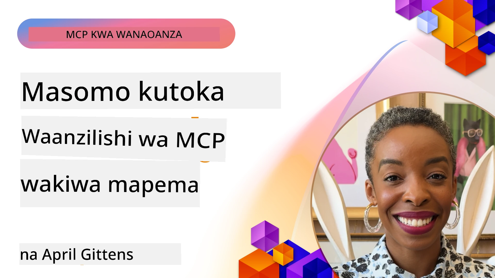

# 🌟 Mafunzo Kutoka kwa Watumiaji wa Mapema

[](https://youtu.be/jds7dSmNptE)

_(Bonyeza picha hapo juu kutazama video ya somo hili)_

## 🎯 Kile Moduli Hii Inajumuisha

Moduli hii inachunguza jinsi mashirika halisi na waendelezaji wanavyotumia Model Context Protocol (MCP) kutatua changamoto halisi na kuendesha ubunifu. Kupitia masomo ya kina ya kesi, miradi ya vitendo, na mifano halisi, utagundua jinsi MCP inavyoruhusu kuunganishwa kwa AI kwa usalama, kwa kiwango kikubwa, ambako husanifisha mifano ya lugha, zana, na data ya shirika.

### 📚 Tazama MCP Katika Matendo

Unataka kuona kanuni hizi zikifanyiwa kazi kwa zana ambazo tayari zimekuwa tayari kwa uzalishaji? Angalia [**Seva 10 za Microsoft MCP Zinazobadilisha Uzalishaji wa Waendelezaji**](microsoft-mcp-servers.md), zinazoweka kwenye mwanga seva halisi za Microsoft MCP unazoweza kutumia leo.

## Muhtasari

Somo hili linachunguza jinsi watumiaji wa mapema walivyotumia Model Context Protocol (MCP) kutatua changamoto halisi na kuendesha ubunifu katika sekta mbalimbali. Kupitia masomo ya kina ya kesi na miradi ya vitendo, utaona jinsi MCP inavyowezesha muunganisho wa AI ulio sanifishwa, salama, na unaoweza kupanuka—kutekeleza mifano mikubwa ya lugha, zana, na data ya shirika katika mfumo mmoja. Utapata uzoefu wa vitendo wa kubuni na kujenga suluhisho zinazotegemea MCP, kujifunza kutoka kwa mifano thabiti ya utekelezaji, na kugundua mbinu bora za kuingiza MCP katika mazingira ya uzalishaji. Somo pia linaangazia mwelekeo unaojitokeza, mwelekeo wa baadaye, na rasilimali za chanzo huria zitakazokusaidia kuwepo mstari wa mbele wa teknolojia ya MCP na mfumo wake unaoendelea kuibuka.

## Malengo ya Kujifunza

- Kuchambua utekelezaji halisi wa MCP katika sekta tofauti
- Kubuni na kujenga programu kamili zinazotegemea MCP
- Kuchunguza mitindo inayoibuka na mwelekeo wa baadaye katika teknolojia ya MCP
- Kutumia mbinu bora katika hali halisi za maendeleo

## Utekelezaji Halisi wa MCP

### Somo la Kesi 1: Uendeshaji wa Kiotomatiki wa Huduma kwa Wateja wa Shirika

Kampuni ya kimataifa ilitekeleza suluhisho linalotegemea MCP kuleta muungano thabiti wa mwingiliano wa AI katika mifumo yao ya huduma kwa wateja. Hii iliwawezesha:

- Kuunda kiolesura kimoja kwa watoa huduma wa LLM wengi
- Kudumisha usimamizi mzuri wa maagizo katika idara mbalimbali
- Kutoa usalama wa hali ya juu na udhibiti wa kufuata kanuni
- Kubadilisha kwa urahisi kati ya mifano tofauti ya AI kulingana na mahitaji maalum

**Utekelezaji wa Kiufundi:**

```python
# Utekelezaji wa seva ya MCP ya Python kwa msaada wa wateja
import logging
import asyncio
from modelcontextprotocol import create_server, ServerConfig
from modelcontextprotocol.server import MCPServer
from modelcontextprotocol.transports import create_http_transport
from modelcontextprotocol.resources import ResourceDefinition
from modelcontextprotocol.prompts import PromptDefinition
from modelcontextprotocol.tool import ToolDefinition

# Sanidi uandishi wa kumbukumbu
logging.basicConfig(level=logging.INFO)

async def main():
    # Tengeneza usanidi wa seva
    config = ServerConfig(
        name="Enterprise Customer Support Server",
        version="1.0.0",
        description="MCP server for handling customer support inquiries"
    )
    
    # Anzisha seva ya MCP
    server = create_server(config)
    
    # Sajili rasilimali za hifadhidata ya maarifa
    server.resources.register(
        ResourceDefinition(
            name="customer_kb",
            description="Customer knowledge base documentation"
        ),
        lambda params: get_customer_documentation(params)
    )
    
    # Sajili mifano ya maagizo
    server.prompts.register(
        PromptDefinition(
            name="support_template",
            description="Templates for customer support responses"
        ),
        lambda params: get_support_templates(params)
    )
    
    # Sajili zana za msaada
    server.tools.register(
        ToolDefinition(
            name="ticketing",
            description="Create and update support tickets"
        ),
        handle_ticketing_operations
    )
    
    # Anzisha seva kwa usafirishaji wa HTTP
    transport = create_http_transport(port=8080)
    await server.run(transport)

if __name__ == "__main__":
    asyncio.run(main())
```

**Matokeo:** Kupunguza gharama za model kwa asilimia 30, kuboresha uthabiti wa majibu kwa asilimia 45, na kufanikisha kufuata kanuni kwa ufanisi katika shughuli za kimataifa.

### Somo la Kesi 2: Msaidizi wa Uchunguzi wa Afya

Mtoa huduma wa afya alitengeneza miundombinu ya MCP kuunganisha mifano kadhaa maalum ya AI ya matibabu huku akihakikisha data nyeti za wagonjwa zilindwe:

- Kubadilisha kwa urahisi kati ya mifano ya matibabu ya jumla na maalum
- Udhibiti mkali wa faragha na rekodi za ukaguzi
- Uunganishaji na mifumo ya Rekodi za Afya za Kielektroniki (EHR) iliyopo
- Uboreshaji thabiti wa maagizo kwa istilahi za matibabu

**Utekelezaji wa Kiufundi:**

```csharp
// C# MCP host application implementation in healthcare application
using Microsoft.Extensions.DependencyInjection;
using ModelContextProtocol.SDK.Client;
using ModelContextProtocol.SDK.Security;
using ModelContextProtocol.SDK.Resources;

public class DiagnosticAssistant
{
    private readonly MCPHostClient _mcpClient;
    private readonly PatientContext _patientContext;
    
    public DiagnosticAssistant(PatientContext patientContext)
    {
        _patientContext = patientContext;
        
        // Configure MCP client with healthcare-specific settings
        var clientOptions = new ClientOptions
        {
            Name = "Healthcare Diagnostic Assistant",
            Version = "1.0.0",
            Security = new SecurityOptions
            {
                Encryption = EncryptionLevel.Medical,
                AuditEnabled = true
            }
        };
        
        _mcpClient = new MCPHostClientBuilder()
            .WithOptions(clientOptions)
            .WithTransport(new HttpTransport("https://healthcare-mcp.example.org"))
            .WithAuthentication(new HIPAACompliantAuthProvider())
            .Build();
    }
    
    public async Task<DiagnosticSuggestion> GetDiagnosticAssistance(
        string symptoms, string patientHistory)
    {
        // Create request with appropriate resources and tool access
        var resourceRequest = new ResourceRequest
        {
            Name = "patient_records",
            Parameters = new Dictionary<string, object>
            {
                ["patientId"] = _patientContext.PatientId,
                ["requestingProvider"] = _patientContext.ProviderId
            }
        };
        
        // Request diagnostic assistance using appropriate prompt
        var response = await _mcpClient.SendPromptRequestAsync(
            promptName: "diagnostic_assistance",
            parameters: new Dictionary<string, object>
            {
                ["symptoms"] = symptoms,
                patientHistory = patientHistory,
                relevantGuidelines = _patientContext.GetRelevantGuidelines()
            });
            
        return DiagnosticSuggestion.FromMCPResponse(response);
    }
}
```

**Matokeo:** Maboresho katika mapendekezo ya uchunguzi ya madaktari huku ukizingatia vifungu vyote vya HIPAA na kupunguza kwa kiasi kikubwa kubadilisha muktadha kati ya mifumo.

### Somo la Kesi 3: Uchambuzi wa Hatari kwa Huduma za Kifedha

Msingi wa kifedha ulitekeleza MCP kuleta uwiano katika michakato yao ya uchambuzi wa hatari katika idara tofauti:

- Kuunda kiolesura kimoja kwa mifano ya hatari ya mikopo, kugundua udanganyifu, na hatari ya uwekezaji
- Kutekeleza udhibiti mkali wa upatikanaji na toleo la modeli
- Kuhakikisha kwamba mapendekezo yote ya AI yanapatikana kwa ukaguzi
- Kudumisha usahihi wa uandishi wa data katika mifumo tofauti

**Utekelezaji wa Kiufundi:**

```java
// Seva ya MCP ya Java kwa tathmini ya hatari za kifedha
import org.mcp.server.*;
import org.mcp.security.*;

public class FinancialRiskMCPServer {
    public static void main(String[] args) {
        // Tengeneza seva ya MCP yenye vipengele vya usalama wa kifedha
        MCPServer server = new MCPServerBuilder()
            .withModelProviders(
                new ModelProvider("risk-assessment-primary", new AzureOpenAIProvider()),
                new ModelProvider("risk-assessment-audit", new LocalLlamaProvider())
            )
            .withPromptTemplateDirectory("./compliance/templates")
            .withAccessControls(new SOCCompliantAccessControl())
            .withDataEncryption(EncryptionStandard.FINANCIAL_GRADE)
            .withVersionControl(true)
            .withAuditLogging(new DatabaseAuditLogger())
            .build();
            
        server.addRequestValidator(new FinancialDataValidator());
        server.addResponseFilter(new PII_RedactionFilter());
        
        server.start(9000);
        
        System.out.println("Financial Risk MCP Server running on port 9000");
    }
}
```

**Matokeo:** Kuboresha kufuata kanuni za serikali, mizunguko ya haraka ya utoaji modeli kwa asilimia 40, na uhakika wa tathmini ya hatari kwenye idara mbalimbali.

### Somo la Kesi 4: Microsoft Playwright MCP Server kwa Uendeshaji wa Kivinjari

Microsoft iliunda [Playwright MCP server](https://github.com/microsoft/playwright-mcp) kuwezesha uendeshaji salama, wa kawaida wa kivinjari kupitia Model Context Protocol. Seva hii tayari kwa uzalishaji inaruhusu mawakala wa AI na LLM kuingiliana na vivinjari vya wavuti kwa udhibiti, ufuatiliaji, na upanuzi—kuwawezesha matukio kama upimaji wa wavuti ulio otomatiki, uchimbaji wa data, na michakato ya mwisho hadi mwisho.

> **🎯 Zana Tayari kwa Uzalishaji**
> 
> Somo hili linatoa mfano wa seva halisi ya MCP unayoweza kuitumia leo! Jifunze zaidi kuhusu Playwright MCP Server na seva zingine 9 za Microsoft MCP tayari kwa uzalishaji katika [**Mwongozo wa Seva za Microsoft MCP**](microsoft-mcp-servers.md#8--playwright-mcp-server).

**Sifa Muhimu:**
- Inaonyesha uwezo wa kuendesha kazi za kivinjari (kuvinjari, kujaza fomu, kupiga picha skrini, n.k.) kama zana za MCP
- Kutekeleza udhibiti mkali wa upatikanaji na kuzingatia mazingira yaliyofungwa kuzuia vitendo visivyoidhinishwa
- Kutoa rekodi za kina kwa shughuli zote za kivinjari
- Kusaidia kuunganishwa na Azure OpenAI na watoa huduma wengine wa LLM kwa uendeshaji wa mawakala
- Inasimamia GitHub Copilot’s Coding Agent kwa uwezo wa kuvinjari wavuti

**Utekelezaji wa Kiufundi:**

```typescript
// TypeScript: Kusajili zana za kuendesha kivinjari za Playwright katika seva ya MCP
import { createServer, ToolDefinition } from 'modelcontextprotocol';
import { launch } from 'playwright';

const server = createServer({
  name: 'Playwright MCP Server',
  version: '1.0.0',
  description: 'MCP server for browser automation using Playwright'
});

// Sajili zana ya kuvinjari kwenye URL na kupiga picha ya skrini
server.tools.register(
  new ToolDefinition({
    name: 'navigate_and_screenshot',
    description: 'Navigate to a URL and capture a screenshot',
    parameters: {
      url: { type: 'string', description: 'The URL to visit' }
    }
  }),
  async ({ url }) => {
    const browser = await launch();
    const page = await browser.newPage();
    await page.goto(url);
    const screenshot = await page.screenshot();
    await browser.close();
    return { screenshot };
  }
);

// Anzisha seva ya MCP
server.listen(8080);
```

**Matokeo:**

- Kuanzisha uendeshaji salama wa kivinjari kwa mawakala wa AI na LLM
- Kupunguza juhudi za majaribio ya mikono na kuboresha upatikanaji wa majaribio ya programu za wavuti
- Kutoa mfumo unaoweza kutumika tena na unaopanuka kwa uunganishaji wa zana za kivinjari katika mazingira ya shirika
- Kuimarisha uwezo wa kuvinjari wavuti wa GitHub Copilot

**Marejeo:**

- [Hazina ya GitHub ya Playwright MCP Server](https://github.com/microsoft/playwright-mcp)
- [Suluhisho za AI na Uendeshaji za Microsoft](https://azure.microsoft.com/en-us/products/ai-services/)

### Somo la Kesi 5: Azure MCP – Model Context Protocol ya Kiwango cha Shirika kama Huduma

Azure MCP Server ([https://aka.ms/azmcp](https://aka.ms/azmcp)) ni utekelezaji wa Microsoft unaosimamiwa wa kiwango cha shirika wa Model Context Protocol, ulioundwa kutoa uwezo wa seva ya MCP inayoweza kupanuka, salama, na inayozingatia kanuni kama huduma ya wingu. Azure MCP inaruhusu mashirika kufanikisha uzinduzi wa haraka, usimamizi, na muunganisho wa seva za MCP na huduma za Azure AI, data, na usalama, kupunguza mzigo wa kiutendaji na kuharakisha matumizi ya AI.

> **🎯 Zana Tayari kwa Uzalishaji**
> 
> Hii ni seva halisi ya MCP unayoweza kuitumia leo! Jifunze zaidi kuhusu Azure AI Foundry MCP Server katika [**Mwongozo wa Seva za Microsoft MCP**](microsoft-mcp-servers.md).

- Ukodishaji wa seva ya MCP uliosimamiwa kikamilifu wenye upanuzi wa kiotomatiki, ufuatiliaji, na usalama
- Muunganisho wa asili na Azure OpenAI, Azure AI Search, na huduma nyingine za Azure
- Uthibitishaji na idhini ya shirika kupitia Microsoft Entra ID
- Msaada kwa zana maalum, templeti za maagizo, na viunganishi vya rasilimali
- Kufuata usalama wa shirika na mahitaji ya kisheria

**Utekelezaji wa Kiufundi:**

```yaml
# Example: Azure MCP server deployment configuration (YAML)
apiVersion: mcp.microsoft.com/v1
kind: McpServer
metadata:
  name: enterprise-mcp-server
spec:
  modelProviders:
    - name: azure-openai
      type: AzureOpenAI
      endpoint: https://<your-openai-resource>.openai.azure.com/
      apiKeySecret: <your-azure-keyvault-secret>
  tools:
    - name: document_search
      type: AzureAISearch
      endpoint: https://<your-search-resource>.search.windows.net/
      apiKeySecret: <your-azure-keyvault-secret>
  authentication:
    type: EntraID
    tenantId: <your-tenant-id>
  monitoring:
    enabled: true
    logAnalyticsWorkspace: <your-log-analytics-id>
```

**Matokeo:**  
- Kupunguza muda wa kufikia thamani kwa miradi ya AI ya shirika kwa kutoa jukwaa la seva ya MCP linalotengenezwa na kuzingatia kanuni
- Kurahisisha muunganisho wa LLM, zana, na vyanzo vya data vya shirika
- Kuongeza usalama, ufuatiliaji, na ufanisi wa kiutendaji kwa mzigo wa MCP
- Kuboresha ubora wa msimbo kwa mbinu bora za Azure SDK na mifano ya uthibitishaji wa sasa

**Marejeo:**  
- [Nyaraka za Azure MCP](https://aka.ms/azmcp)
- [Hazina ya Azure MCP Server GitHub](https://github.com/Azure/azure-mcp)
- [Huduma za Azure AI](https://azure.microsoft.com/en-us/products/ai-services/)
- [Kituo cha Microsoft MCP](https://mcp.azure.com)

## Somo la Kesi 6: NLWeb  
MCP (Model Context Protocol) ni itifaki inayokua kwa ajili ya Chatbots na wasaidizi wa AI kuingiliana na zana. Kila mfano wa NLWeb pia ni seva ya MCP, inayounga mkono njia moja kuu, ask, inayotumiwa kuuliza swali tovuti kwa lugha ya asili. Jibu linalorejeshwa linatumia schema.org, msamiati unaotumika sana wa kuelezea data ya wavuti. Kwa kusema kwa upole, MCP ni NLWeb kama Http ni kwa HTML. NLWeb huunganisha itifaki, fomati za Schema.org, na msimbo wa mfano kusaidia tovuti kuunda haraka sehemu hizi za mwisho, ikiwanufaisha binadamu kupitia kiolesura cha mazungumzo na mashine kupitia mwingiliano wa mawakala wa asili kwa mawakala.

Kuna vipengele viwili tofauti kwa NLWeb.
- Itifaki, rahisi kuanzia nayo, kuingiliana na tovuti kwa lugha ya asili na fomati, ikitumia json na schema.org kwa jibu linalorejeshwa. Angalia nyaraka za REST API kwa maelezo zaidi.
- Utekelezaji rahisi wa (1) unaotumia alama zilizopo, kwa tovuti zinazoweza kufupishwa kama orodha ya vitu (bidhaa, mapishi, vivutio, mapitio, n.k.). Pamoja na seti ya vidhibiti vya kiolesura, tovuti zinaweza kutoa kwa urahisi interface za mazungumzo kwa maudhui yao. Angalia nyaraka za Life of a chat query kwa maelezo zaidi jinsi inavyofanya kazi.

**Marejeo:**  
- [Nyaraka za Azure MCP](https://aka.ms/azmcp)
- [NLWeb](https://github.com/microsoft/NlWeb)

### Somo la Kesi 7: Azure AI Foundry MCP Server – Muunganisho wa Wakala wa AI wa Shirika

Seva za Azure AI Foundry MCP zinaonyesha jinsi MCP inavyoweza kutumika kupanga na kusimamia mawakala wa AI na mitiririko ya kazi katika mazingira ya shirika. Kwa kuunganisha MCP na Azure AI Foundry, mashirika yanaweza kuweka viwango vya mwingiliano wa mawakala, kutumia usimamizi wa mitiririko ya Foundry, na kuhakikisha uzinduzi wa usalama na wa kiwango kikubwa.

> **🎯 Zana Tayari kwa Uzalishaji**
> 
> Hii ni seva halisi ya MCP unayoweza kuitumia leo! Jifunze zaidi kuhusu Azure AI Foundry MCP Server katika [**Mwongozo wa Seva za Microsoft MCP**](microsoft-mcp-servers.md#9--azure-ai-foundry-mcp-server).

**Sifa Muhimu:**
- Upatikanaji kamili wa mfumo wa AI wa Azure, ukiwemo katalogi ya modeli na usimamizi wa uzinduzi
- Uorodheshaji maarifa kupitia Azure AI Search kwa matumizi ya RAG
- Zana za tathmini za utendaji wa modeli za AI na uhakiki wa ubora
- Muunganisho na Azure AI Foundry Catalog na Labs kwa mifano ya utafiti ya kisasa
- Usimamizi wa mawakala na uwezo wa tathmini kwa matukio ya uzalishaji

**Matokeo:**
- Kuunda haraka mifano na ufuatiliaji imara wa mitiririko ya kazi ya mawakala wa AI
- Muunganisho rahisi na huduma za Azure AI kwa matukio ya hali ya juu
- Kiolesura kimoja kwa ujenzi, uzinduzi, na ufuatiliaji wa mistari ya mawakala
- Uboreshaji wa usalama, kufuata kanuni, na ufanisi wa kiutendaji kwa mashirika
- Kuongeza kasi ya matumizi ya AI huku ukidumisha udhibiti juu ya michakato ya mawakala tata

**Marejeo:**
- [Hazina ya Azure AI Foundry MCP Server GitHub](https://github.com/azure-ai-foundry/mcp-foundry)
- [Kuunganisha Wakala wa Azure AI na MCP (Blogu ya Microsoft Foundry)](https://devblogs.microsoft.com/foundry/integrating-azure-ai-agents-mcp/)

### Somo la Kesi 8: Foundry MCP Playground – Jaribio na Kuyatengeneza Mifano

Foundry MCP Playground inatoa mazingira tayari kwa matumizi kwa ajili ya kujaribu seva za MCP na muunganisho wa Azure AI Foundry. Waendelezaji wanaweza kuunda haraka mifano, kujaribu, na kutathmini mifano ya AI na mitiririko ya mawakala kwa kutumia rasilimali kutoka Azure AI Foundry Catalog na Labs. Hifadhi hii huwezesha usanidi rahisi, hutoa miradi ya mfano, na inasaidia maendeleo ya pamoja, na kufanya iwe rahisi kuchunguza mbinu bora na matukio mapya kwa gharama ndogo. Ni muhimu hasa kwa timu zinazotaka kuthibitisha mawazo, kushiriki majaribio, na kuharakisha kujifunza bila hitaji la miundombinu tata. Kwa kupunguza vizingiti vya kuingia, hifadhi hii huchochea ubunifu na michango ya jamii katika mfumo wa MCP na Azure AI Foundry.

**Marejeo:**

- [Hazina ya Foundry MCP Playground GitHub](https://github.com/azure-ai-foundry/foundry-mcp-playground)

### Somo la Kesi 9: Microsoft Learn Docs MCP Server – Upatikanaji wa Nyaraka kwa Usaidizi wa AI

Microsoft Learn Docs MCP Server ni huduma ya wingu inayotoa mawakala wa AI upatikanaji wa moja kwa moja wa nyaraka rasmi za Microsoft kupitia Model Context Protocol. Seva hii tayari kwa uzalishaji inaunganisha mfumo kamili wa Microsoft Learn na kuwezesha utafutaji wa maana katika vyanzo vyote rasmi vya Microsoft.

> **🎯 Zana Tayari kwa Uzalishaji**
> 
> Hii ni seva halisi ya MCP unayoweza kuitumia leo! Jifunze zaidi kuhusu Microsoft Learn Docs MCP Server katika [**Mwongozo wa Seva za Microsoft MCP**](microsoft-mcp-servers.md#1--microsoft-learn-docs-mcp-server).

**Sifa Muhimu:**
- Upatikanaji wa wakati halisi wa nyaraka rasmi za Microsoft, nyaraka za Azure, na nyaraka za Microsoft 365
- Uwezo wa hali ya juu wa utafutaji wa maana unaoelewa muktadha na nia
- Habari daima za kisasa kadri maudhui ya Microsoft Learn yanavyotangazwa
- Ujiribikaji kamili katika Microsoft Learn, nyaraka za Azure, na vyanzo vya Microsoft 365
- Kurejesha sehemu hadi 10 za maudhui zenye ubora wa juu pamoja na vichwa vya makala na URL

**Kwa Nini Ni Muhimu:**
- Kutatua tatizo la "maarifa ya AI yaliyopitwa na wakati" kwa teknolojia za Microsoft
- Kuhakikisha mawakala wa AI wanapata vipengele vya hivi karibuni vya .NET, C#, Azure, na Microsoft 365
- Kutoa taarifa za serikali zinazotegemewa kwa uzalishaji sahihi wa msimbo
- Muhimu kwa waendelezaji wanaofanya kazi na teknolojia za Microsoft zinazobadilika kwa kasi

**Matokeo:**
- Kuboresha sana usahihi wa msimbo uliotengenezwa na AI kwa teknolojia za Microsoft
- Kupunguza muda unaotumika kutafuta nyaraka za sasa na mbinu bora
- Kuongeza tija ya mtengenezaji programu kwa kupata nyaraka zinazofahamu muktadha
- Muunganisho mzuri na mitiririko ya maendeleo bila kuondoka kwenye IDE

**Marejeo:**
- [Hazina ya Microsoft Learn Docs MCP Server GitHub](https://github.com/MicrosoftDocs/mcp)
- [Nyaraka za Microsoft Learn](https://learn.microsoft.com/)

## Miradi ya Vitendo

### Mradi 1: Jenga Seva ya MCP yenye Watoa Huduma Wengi

**Lengo:** Tengeneza seva ya MCP inayoweza kuelekeza maombi kwa watoa huduma wa modeli mbalimbali za AI kulingana na vigezo maalum.

**Mahitaji:**

- Kuunga mkono watoa huduma wa angalau mfano tatu tofauti (mfano, OpenAI, Anthropic, modeli za ndani)
- Kutekeleza utaratibu wa njia wa kuelekeza maombi kulingana na metadata za maombi
- Kuunda mfumo wa usanidi wa kusimamia cheti cha watoa huduma
- Kuongeza cache kuboresha utendaji na gharama
- Kujenga dashibodi rahisi kwa ajili ya ufuatiliaji wa matumizi

**Hatua za Utekelezaji:**

1. Tengeneza miundombinu ya msingi ya seva ya MCP
2. Tekeleza adapters za watoa huduma kwa kila huduma ya modeli ya AI
3. Unda mantiki ya kuelekeza maombi kulingana na sifa za maombi
4. Ongeza mbinu za caching kwa maombi ya mara kwa mara
5. Tengeneza dashibodi ya ufuatiliaji
6. Jaribu na mifumo mbalimbali ya maombi

**Teknolojia:** Chagua kati ya Python (.NET/Java/Python kulingana na upendeleo wako), Redis kwa caching, na fremu rahisi ya wavuti kwa dashibodi.

### Mradi 2: Mfumo wa Usimamizi wa Maagizo ya Shirika
**Lengo:** Tengeneza mfumo unaotegemea MCP wa kusimamia, kuweka toleo, na kutekeleza templeti za maelekezo ndani ya shirika.

**Mahitaji:**

- Tengeneza hifadhidata iliyojumuishwa kwa templeti za maelekezo
- Tekeleza ufuatiliaji wa matoleo na michakato ya kuidhinisha
- Tengeneza uwezo wa kujaribu templeti kwa kuingiza mifano
- Entwick lenye udhibiti wa upatikanaji kulingana na majukumu
- Tengeneza API kwa ajili ya kupakua na kutekeleza templeti

**Hatua za Utekelezaji:**

1. Tengeneza muundo wa hifadhidata kwa ajili ya kuhifadhi templeti
2. Tengeneza API kuu kwa ajili ya shughuli za CRUD za templeti
3. Tekeleza mfumo wa kuweka matoleo
4. Tengeneza mchakato wa kuidhinisha
5. Tengeneza mfumo wa kupima templeti
6. Tengeneza kiolesura rahisi cha wavuti kwa usimamizi
7. Unganisha na seva ya MCP

**Teknolojia:** Chaguo lako la fremu ya nyuma ya mfumo, hifadhidata ya SQL au NoSQL, na fremu ya mbele kwa ajili ya kiolesura cha usimamizi.

### Mradi wa 3: Jukwaa la Uundaji Maudhui linalotegemea MCP

**Lengo:** Tengeneza jukwaa la uundaji maudhui linalotumia MCP kutoa matokeo thabiti kwa aina tofauti za maudhui.

**Mahitaji:**

- Saidia aina nyingi za muundo wa maudhui (machapisho ya blog, mitandao ya kijamii, nakala za masoko)
- Tekeleza uundaji wa templeti na chaguzi za kubinafsisha
- Tengeneza mfumo wa ukaguzi na maoni ya maudhui
- Fuatilia vipimo vya utendaji wa maudhui
- Saidia ufuatiliaji wa matoleo na marekebisho ya maudhui

**Hatua za Utekelezaji:**

1. Weka miundombinu ya mteja MCP
2. Tengeneza templeti za aina tofauti za maudhui
3. Tengeneza mchakato wa uundaji maudhui
4. Tekeleza mfumo wa ukaguzi
5. Entwick lenye mfumo wa kufuatilia vipimo
6. Tengeneza kiolesura cha mtumiaji kwa usimamizi wa templeti na uundaji maudhui

**Teknolojia:** Lugha yako unayopendelea ya programu, fremu ya wavuti, na mfumo wa hifadhidata.

## Mwelekeo wa Baadaye wa Teknolojia ya MCP

### Mwelekeo Inayoibukia

1. **MCP ya Moduli Nyingi**
   - Upanuzi wa MCP kuoanisha mwingiliano na mifano ya picha, sauti, na video
   - Maendeleo ya uwezo wa hoja ya mtazamo mseto
   - Miundo ya maelekezo iliyopangwa kwa moduli tofauti

2. **Miundombinu ya MCP Iliyo Sambazwa**
   - Mitandao ya MCP iliyosambazwa inayoweza kushirikiana rasilimali kati ya mashirika
   - Itifaki za kawaida za kushirikiana mifano kwa usalama
   - Mbinu za kompyuta zinazohifadhi faragha

3. **Masoko ya MCP**
   - Mazingira ya kushirikiana na kupata kipato kwa templeti na viendelezi vya MCP
   - Mchakato wa uhakikishaji na vyeti
   - Uunganisho na masoko ya mifano

4. **MCP kwa Uhasibu wa Edge**
   - Urekebishaji wa viwango vya MCP kwa vifaa vya Edge vilivyo na rasilimali chache
   - Itifaki zilizo boreshwa kwa mazingira yenye upatikanaji wa mtandao mdogo
   - Utekelezaji maalum wa MCP kwa mifumo ya IoT

5. **Mifumo ya Udhibiti**
   - Uendelezaji wa nyongeza za MCP kwa uzingatiaji wa kanuni
   - Mifumo ya kawaida ya ukaguzi na violesura vya kuelezea
   - Uunganisho na mifumo inayoibuka ya udhibiti wa AI

### Suluhisho za MCP kutoka Microsoft

Microsoft na Azure wameendeleza hifadhidata kadhaa za chanzo wazi kusaidia watengenezaji kutekeleza MCP katika hali tofauti:

#### Shirika la Microsoft

1. [playwright-mcp](https://github.com/microsoft/playwright-mcp) - Seva ya MCP ya Playwright kwa uendeshaji wa kivinjari na upimaji
2. [files-mcp-server](https://github.com/microsoft/files-mcp-server) - Utekelezaji wa seva ya MCP ya OneDrive kwa upimaji wa ndani na mchango wa jamii
3. [NLWeb](https://github.com/microsoft/NlWeb) - NLWeb ni mkusanyiko wa itifaki za wazi na zana zinazohusiana za chanzo wazi. Lengo kuu ni kuweka msingi wa AI Web

#### Shirika la Azure-Samples

1. [mcp](https://github.com/Azure-Samples/mcp) - Viungo vya sampuli, zana, na rasilimali za kujenga na kuunganisha seva za MCP kwenye Azure kwa kutumia lugha mbalimbali
2. [mcp-auth-servers](https://github.com/Azure-Samples/mcp-auth-servers) - Seva za rejea za MCP zinazoonyesha uthibitishaji kwa vipimo vya sasa vya Model Context Protocol
3. [remote-mcp-functions](https://github.com/Azure-Samples/remote-mcp-functions) - Ukurasa wa kuingia kwa utekelezaji wa Seva za Remote MCP katika Azure Functions na viungo vya hifadhidata za lugha maalum
4. [remote-mcp-functions-python](https://github.com/Azure-Samples/remote-mcp-functions-python) - Templeti ya kuanza haraka kwa kujenga na kutekeleza seva za Remote MCP kutumia Azure Functions na Python
5. [remote-mcp-functions-dotnet](https://github.com/Azure-Samples/remote-mcp-functions-dotnet) - Templeti ya kuanza haraka kwa kujenga na kutekeleza seva za Remote MCP kutumia Azure Functions na .NET/C#
6. [remote-mcp-functions-typescript](https://github.com/Azure-Samples/remote-mcp-functions-typescript) - Templeti ya kuanza haraka kwa kujenga na kutekeleza seva za Remote MCP kutumia Azure Functions na TypeScript
7. [remote-mcp-apim-functions-python](https://github.com/Azure-Samples/remote-mcp-apim-functions-python) - Usimamizi wa API wa Azure kama Kituo cha AI kwa seva za Remote MCP kwa kutumia Python
8. [AI-Gateway](https://github.com/Azure-Samples/AI-Gateway) - Mawariko ya APIM ❤️ AI ikiwa na uwezo wa MCP, ikijumuisha Azure OpenAI na AI Foundry

Hifadhidata hizi zinatoa utekelezaji mbalimbali, templeti, na rasilimali kwa ajili ya kazi na Model Context Protocol katika lugha tofauti za programu na huduma za Azure. Zinahusisha matumizi mbalimbali kuanzia utekelezaji wa seva za kawaida hadi uthibitishaji, utoaji huduma za wingu, na hali za uunganishaji wa taasisi.

#### Katalogi ya Rasilimali za MCP

Katalogi ya [Rasilimali za MCP](https://github.com/microsoft/mcp/tree/main/Resources) katika hifadhidata rasmi ya Microsoft MCP hutoa mkusanyiko ulioratibiwa wa rasilimali za mfano, templeti za maelekezo, na tafsiri za zana kwa matumizi na seva za Model Context Protocol. Katalogi hii imelenga kusaidia watengenezaji kuanza haraka na MCP kwa kutoa vipengele vya kujitumia na mifano bora ya mazoea:

- **Templeti za Maelekezo:** Templeti tayari kwa matumizi kwa kazi za kawaida za AI na hali mbalimbali, ambazo zinaweza kubadilishwa kwa utekelezaji wako wa seva za MCP.
- **Tafsiri za Zana:** Mifano ya skimu za zana na metadata kwa kuweka viwango vya kuunganisha na kuishiisha zana kati ya seva mbalimbali za MCP.
- **Mifano ya Rasilimali:** Mifano ya tafsiri za rasilimali kwa kuunganishwa na vyanzo vya data, API, na huduma za nje ndani ya mfumo wa MCP.
- **Utekelezaji wa Rejea:** Mifano ya vitendo inayoonyesha jinsi ya kupanga na kupanga rasilimali, maelekezo, na zana katika miradi halisi ya MCP.

Rasilimali hizi huongeza kasi ya maendeleo, kuhimiza viwango, na kusaidia kuhakikisha mazoea bora wakati wa kujenga na kutekeleza suluhisho zinazotegemea MCP.

#### Katalogi ya Rasilimali za MCP

- [Rasilimali za MCP (Maelekezo ya Mfano, Zana, na Tafsiri za Rasilimali)](https://github.com/microsoft/mcp/tree/main/Resources)

### Fursa za Utafiti

- Mbinu za uboreshaji wa maelekezo ndani ya mifumo ya MCP
- Mifano ya usalama kwa upanaji wa MCP wa wamiliki wengi
- Upimaji wa utendaji kati ya utekelezaji tofauti za MCP
- Mbinu rasmi za uhakiki kwa seva za MCP

## Hitimisho

Model Context Protocol (MCP) inabadilisha kwa haraka mustakabali wa kuunganishwa kwa AI kwa viwango, usalama, na urahisi wa matumizi katika sekta mbalimbali. Kupitia tafiti za kesi na miradi ya vitendo katika somo hili, umeona jinsi watumiaji wa mapema—ikiwa ni pamoja na Microsoft na Azure—wanavyotumia MCP kutatua changamoto halisi, kuharakisha upokezaji wa AI, na kuhakikisha uzingatiaji, usalama, na upanuzi. Njia ya moduli ya MCP inawawezesha mashirika kuunganisha mifano mikubwa ya lugha, zana, na data za taasisi ndani ya mfumo mmoja unaoweza kupimwa na kuombwa. Kadri MCP inavyobadilika, kuwa na mshikamano na jamii, kuchunguza rasilimali za chanzo wazi, na kutumia mazoea bora itakuwa muhimu kujenga suluhisho imara za AI zenye kujiandaa kwa ajili ya kesho.

## Rasilimali Zaidi

- [Hifadhidata ya MCP Foundry GitHub](https://github.com/azure-ai-foundry/mcp-foundry)
- [Uwanja wa Michezo wa Foundry MCP](https://github.com/azure-ai-foundry/foundry-mcp-playground)
- [Uunganisho wa Wakala wa Azure AI na MCP (Blogu ya Microsoft Foundry)](https://devblogs.microsoft.com/foundry/integrating-azure-ai-agents-mcp/)
- [Hifadhidata ya MCP GitHub (Microsoft)](https://github.com/microsoft/mcp)
- [Katalogi ya Rasilimali za MCP (Maelekezo ya Mfano, Zana, na Tafsiri za Rasilimali)](https://github.com/microsoft/mcp/tree/main/Resources)
- [Jamii & Nyaraka za MCP](https://modelcontextprotocol.io/introduction)
- [Vipimo vya MCP (2025-11-25)](https://spec.modelcontextprotocol.io/specification/2025-11-25/)
- [Nyaraka za MCP Azure](https://aka.ms/azmcp)
- [Orodha ya Juu 10 ya MCP OWASP](https://microsoft.github.io/mcp-azure-security-guide/mcp/) - Mazoea bora ya usalama
- [Seva ya Playwright MCP GitHub](https://github.com/microsoft/playwright-mcp)
- [Seva ya Files MCP (OneDrive)](https://github.com/microsoft/files-mcp-server)
- [Azure-Samples MCP](https://github.com/Azure-Samples/mcp)
- [Seva za Uthibitishaji za MCP (Azure-Samples)](https://github.com/Azure-Samples/mcp-auth-servers)
- [Remote MCP Functions (Azure-Samples)](https://github.com/Azure-Samples/remote-mcp-functions)
- [Remote MCP Functions Python (Azure-Samples)](https://github.com/Azure-Samples/remote-mcp-functions-python)
- [Remote MCP Functions .NET (Azure-Samples)](https://github.com/Azure-Samples/remote-mcp-functions-dotnet)
- [Remote MCP Functions TypeScript (Azure-Samples)](https://github.com/Azure-Samples/remote-mcp-functions-typescript)
- [Remote MCP APIM Functions Python (Azure-Samples)](https://github.com/Azure-Samples/remote-mcp-apim-functions-python)
- [AI-Gateway (Azure-Samples)](https://github.com/Azure-Samples/AI-Gateway)
- [Suluhisho za AI na Uendeshaji za Microsoft](https://azure.microsoft.com/en-us/products/ai-services/)

## Mazoezi

1. Changanua mojawapo ya tafiti za kesi na pendekeza mbinu mbadala ya utekelezaji.
2. Chagua moja ya mawazo ya mradi na tengeneza maelezo ya kiufundi kwa undani.
3. Fanya utafiti wa sekta isiyoangaziwa ndani ya tafiti za kesi na bainisha jinsi MCP inaweza kushughulikia changamoto zake maalum.
4. Chunguza moja ya mwelekeo wa baadaye na tengeneza dhana ya nyongeza mpya ya MCP kuunga mkono hilo.

## Nini Kifuatacho

Chunguza zaidi: [Seva za Microsoft MCP](./microsoft-mcp-servers.md)

Endelea kwa: [Moduli 8: Mazoea Bora](../08-BestPractices/README.md)

---

<!-- CO-OP TRANSLATOR DISCLAIMER START -->
**Kauli ya Kukataa**:
Nyaraka hii imefasiriwa kwa kutumia huduma ya tafsiri ya AI [Co-op Translator](https://github.com/Azure/co-op-translator). Ingawa tunajitahidi kuwa sahihi, tafadhali fahamu kwamba tafsiri za kiotomatiki zinaweza kuwa na makosa au ukosefu wa usahihi. Nyaraka ya asili katika lugha yake ya mzazi inapaswa kuchukuliwa kama chanzo cha halali. Kwa taarifa muhimu, tafsiri ya mtaalamu wa lugha ya binadamu inashauriwa. Hatubeba dhamana kwa kutoelewana au tafsiri potofu zitokanazo na matumizi ya tafsiri hii.
<!-- CO-OP TRANSLATOR DISCLAIMER END -->