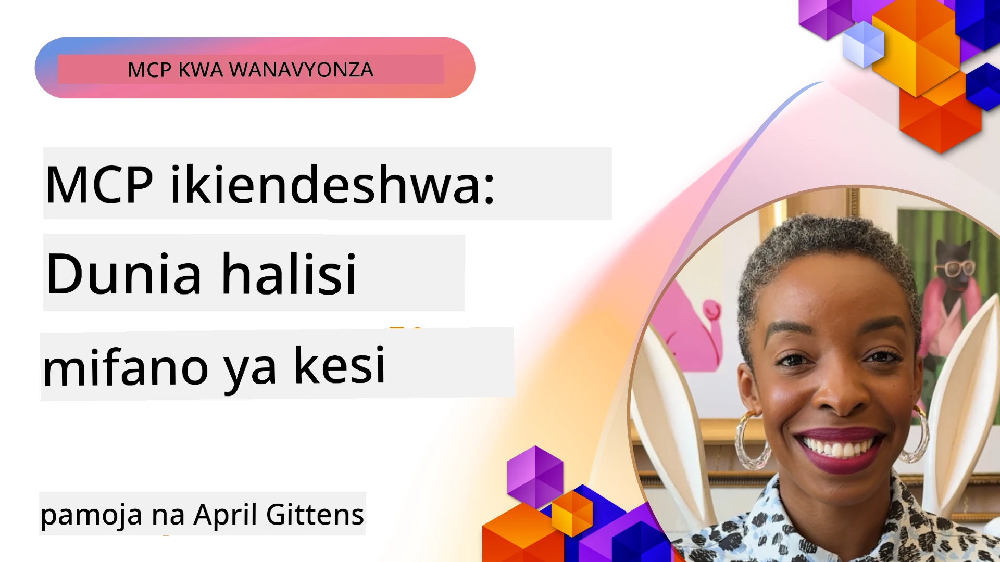

# MCP Katika Kitendo: Masomo ya Kesi Halisi

_(Bonyeza picha hapo juu kutazama video ya somo hili)_

Model Context Protocol (MCP) inabadilisha jinsi programu za AI zinavyoshirikiana na data, zana, na huduma. Sehemu hii inaonyesha masomo ya kesi halisi yanayoonyesha matumizi ya vitendo ya MCP katika mazingira mbalimbali ya biashara.

## Muhtasari

Sehemu hii inaonyesha mifano halisi ya utekelezaji wa MCP, ikionyesha jinsi mashirika yanavyotumia itifaki hii kutatua changamoto ngumu za kibiashara. Kwa kuchunguza masomo haya ya kesi, utapata ufahamu wa mabadiliko, kupanuka, na faida za vitendo za MCP katika hali halisi.

## Malengo Muhimu ya Kujifunza

Kwa kuchunguza masomo haya ya kesi, utaweza:

- Kuelewa jinsi MCP inavyoweza kutumika kutatua matatizo maalum ya biashara  
- Kujifunza kuhusu mifumo tofauti ya kuunganisha na mbinu za usanifu  
- Kutambua mbinu bora za kutekeleza MCP katika mazingira ya biashara  
- Kupata ufahamu wa changamoto na suluhisho zilizokumbwa katika utekelezaji halisi  
- Kutambua fursa za kutumia mifumo kama hiyo katika miradi yako mwenyewe  

## Masomo ya Kesi Yanayojulikana

### 1. [Wakala wa Usafiri wa Azure AI – Utekelezaji wa Marejeleo](./travelagentsample.md)

Somo hili la kesi linachunguza suluhisho kamili la marejeleo la Microsoft linaloonyesha jinsi ya kujenga programu ya kupanga safari yenye mawakala wengi iliyoendeshwa na AI kwa kutumia MCP, Azure OpenAI, na Azure AI Search. Mradi huu unaonyesha:

- Uratibu wa mawakala wengi kupitia MCP  
- Uunganishaji wa data za biashara na Azure AI Search  
- Usanifu salama, unaoweza kupanuka kwa kutumia huduma za Azure  
- Zana zinazoweza kupanuliwa kwa vipengele vya MCP vinavyoweza kutumika tena  
- Uzoefu wa mtumiaji wa mazungumzo unaoendeshwa na Azure OpenAI  

Maelezo ya usanifu na utekelezaji yanatoa ufahamu muhimu wa jinsi ya kujenga mifumo ngumu ya mawakala wengi kwa MCP kama safu ya uratibu.

### 2. [Kusasisha Vitu vya Azure DevOps Kutokana na Data ya YouTube](./UpdateADOItemsFromYT.md)

Somo hili la kesi linaonyesha matumizi ya vitendo ya MCP kwa ajili ya kuendesha mchakato wa otomatiki wa mtiririko wa kazi. Linaonyesha jinsi zana za MCP zinavyoweza kutumika:

- Kuchangia data kutoka kwenye majukwaa ya mtandaoni (YouTube)  
- Kusasisha vitu vya kazi katika mifumo ya Azure DevOps  
- Kuunda mtiririko wa kazi unaorudiwa wa otomatiki  
- Kuunganisha data katika mifumo tofauti  

Mfano huu unaonyesha jinsi hata utekelezaji rahisi wa MCP unaweza kutoa ufanisi mkubwa kwa kurahisisha kazi za kila siku na kuboresha uthabiti wa data kati ya mifumo.

### 3. [Kupata Nyaraka kwa Wakati Halisi kwa MCP](./docs-mcp/README.md)

Somo hili la kesi linakuongoza kuunganishwa kwa mteja wa Python console na seva ya Model Context Protocol (MCP) kwa ajili ya kupata na kurekodi nyaraka za Microsoft zilizo na muktadha na wakati halisi. Utajifunza jinsi ya:

- Kuungana na seva ya MCP kwa kutumia mteja wa Python na MCP SDK rasmi  
- Kutumia wateja wa HTTP wa mtiririko kwa upatikanaji wa data kwa ufanisi na wakati halisi  
- Kupiga simu vifaa vya nyaraka kwenye seva na kurekodi majibu moja kwa moja kwenye console  
- Kuingiza nyaraka za Microsoft zilizosasishwa katika mtiririko wako wa kazi bila kuondoka kwenye terminal  

Sura hii ina kazi ya vitendo, sampuli ndogo ya msimbo wa kazi, na viungo vya rasilimali za ziada kwa kujifunza zaidi. Tazama maelezo kamili na msimbo katika sura hii kuonyesha jinsi MCP inavyoweza kubadilisha upatikanaji wa nyaraka na tija ya ontwikkar katika mazingira ya console.

### 4. [Programu ya Mtandao ya Mtengenezaji wa Mpango wa Kusoma wa Kujumuisha na MCP](./docs-mcp/README.md)

Somo hili la kesi linaonyesha jinsi ya kujenga programu ya mtandao yenye mazungumzo kwa kutumia Chainlit na Model Context Protocol (MCP) kuunda mipango ya kusoma iliyoandaliwa binafsi kwa mada yoyote. Watumiaji wanaweza kubainisha somo (kama "urejeshaji wa AI-900") na muda wa masomo (mfano, wiki 8), na programu itatoa muhtasari wa kila wiki wa maudhui yaliyopendekezwa. Chainlit inatoa kiolesura cha mazungumzo kinachovutia na kubadilika.

- Programu ya mtandao yenye mazungumzo inayoendeshwa na Chainlit  
- Maagizo yanayotolewa na mtumiaji kwa mada na muda  
- Mapendekezo ya maudhui ya wiki kwa wiki kwa kutumia MCP  
- Majibu ya wakati halisi, yanayobadilika kwenye kiolesura cha mazungumzo  

Mradi huu unaonyesha jinsi AI ya mazungumzo na MCP vinaweza kuunganishwa kuunda zana za kielimu zinazojibadilisha kwa mtumiaji katika mazingira ya mtandao ya kisasa.

### 5. [Nyaraka Ndani ya Mhariri na Seva ya MCP katika VS Code](./docs-mcp/README.md)

Somo hili la kesi linaonyesha jinsi unavyoweza kuleta Microsoft Learn Docs moja kwa moja ndani ya mazingira yako ya VS Code kwa kutumia seva ya MCP—huna haja ya kubadilisha tabia za kivinjari tena! Utaona jinsi ya:

- Kutitiza na kusoma nyaraka ndani ya VS Code mara moja kwa kutumia paneli ya MCP au orodha ya amri  
- Kurejelea nyaraka na kuingiza viungo moja kwa moja katika README au faili za moduli za masomo  
- Kutumia GitHub Copilot na MCP pamoja kwa mtiririko wa kazi za nyaraka na msimbo unaotumia AI bila usumbufu  
- Kuhakiki na kuboresha nyaraka zako kwa maoni ya wakati halisi na usahihi unaotokana na Microsoft  
- Kuunganisha MCP na mitiririko ya kazi ya GitHub kwa uhakiki endelevu wa nyaraka  

Utekelezaji unajumuisha:

- Muundo wa mfano wa `.vscode/mcp.json` kwa usanidi rahisi  
- Mwongozo wa picha wa uzoefu wa ndani ya mhariri  
- Vidokezo vya kuunganisha Copilot na MCP ili kuongeza ufanisi  

Hali hii ni bora kwa waandishi wa kozi, waandishi wa nyaraka, na watengenezaji wanaotaka kuendelea na mkazo katika mhariri wao huku wakitumia nyaraka, Copilot, na zana za uhakiki—vyote vinaendeshwa na MCP.

### 6. [Uundaji wa Seva ya APIM MCP](./apimsample.md)

Somo hili la kesi linatoa mwongozo wa hatua kwa hatua jinsi ya kuunda seva ya MCP kwa kutumia Azure API Management (APIM). Linahusu:

- Kuanzisha seva ya MCP katika Azure API Management  
- Kufichua operesheni za API kama zana za MCP  
- Kusanidi sera za ukomo wa viwango na usalama  
- Kupima seva ya MCP kwa kutumia Visual Studio Code na GitHub Copilot  

Mfano huu unaonyesha jinsi ya kutumia uwezo wa Azure kuunda seva imara ya MCP inayoweza kutumika katika programu mbalimbali, ikiboresha muunganiko wa mifumo ya AI na API za biashara.

### 7. [Sajili ya MCP ya GitHub — Kuongeza Kasi ya Muunganiko wa Mawakala](https://github.com/mcp)

Somo hili la kesi linachunguza jinsi Sajili ya MCP ya GitHub, iliyoanzishwa Septemba 2025, inavyoshughulikia changamoto muhimu katika ekosistimu ya AI: ugawanyifu wa ugunduzi na usambazaji wa seva za Model Context Protocol (MCP).

#### Muhtasari  
**Sajili ya MCP** inaondoa ugumu wa seva za MCP zilizogawanyika kwenye hifadhi na sajili mbalimbali, ambazo hapo awali zilifanya muunganiko kuwa polepole na wenye hitilafu. Seva hizi zinawawezesha mawakala wa AI kushirikiana na mifumo ya nje kama API, hifadhidata, na vyanzo vya nyaraka.

#### Taarifa ya Tatizo  
Waendelezaji wa mtiririko wa kazi wa mawakala walikabili changamoto kadhaa:  
- **Ugunduzi mbaya** wa seva za MCP kwenye majukwaa tofauti  
- **Maswali ya kusanidi yanayoarara** kwenye majukwaa na nyaraka  
- **Hatari za usalama** kutoka vyanzo visivyo hakikishi na visivyoaminika  
- **Ukosefu wa mabadiliko** katika ubora na ulinganifu wa seva  

#### Usanifu wa Suluhisho  
Sajili ya MCP ya GitHub huweka pamoja seva za MCP zinazoaminika kwa sifa muhimu:  
- **Usanidi wa bonyeza moja** kupitia VS Code kwa usanidi rahisi  
- **Kuchuja kwa ishara juu ya kelele** kulingana na nyota, shughuli, na uthibitisho wa jamii  
- **Muunganiko wa moja kwa moja** na GitHub Copilot na zana nyingine zinazoungwa mkono na MCP  
- **Mfumo wa michango ya wazi** unaowezesha jamii na washirika wa biashara kuchangia  

#### Athari za Biashara  
Sajili imeleta maboresho yanayoonekana:  
- **Kuanza haraka zaidi** kwa waendelezaji kutumia zana kama Microsoft Learn MCP Server, inayotiririsha nyaraka rasmi moja kwa moja kwa mawakala  
- **Kuongezeka kwa tija** kupitia seva maalum kama `github-mcp-server`, inayowezesha uendeshaji wa GitHub kwa lugha ya asili (kuundwa kwa PR, kurudia CI, kuchambua msimbo)  
- **Kuimarika kwa uaminifu wa ekosistimu** kupitia orodha zilizochaguliwa na viwango wazi vya usanidi  

#### Thamani ya Kistratejia  
Kwa watendaji waliobobea katika usimamizi wa mzunguko wa mawakala na mitiririko ya kazi inayozalishika, Sajili ya MCP hutoa:  
- **Uwezo wa kusambaza mawakala** kwa vipengele vilivyo na viwango  
- **Mifumo ya tathmini inayotegemea sajili** kwa upimaji na uthibitishaji thabiti  
- **Muunganiko wa zana mbalimbali** unaowezesha mtiririko usio na mshono kati ya majukwaa tofauti ya AI  

Somo hili la kesi linaonyesha kuwa Sajili ya MCP si orodha tu—ni jukwaa la msingi kwa muunganiko wa mfano unaoweza kupanuka na usambazaji wa mifumo ya mawakala.

## Hitimisho

Masomo haya ya kesi saba ya kina yanaonyesha mabadiliko makubwa na matumizi ya vitendo ya Model Context Protocol katika hali halisi mbalimbali. Kuanzia mifumo ngumu ya kupanga safari yenye mawakala wengi na usimamizi wa API za biashara hadi mitiririko ya nyaraka iliyo rahisishwa na Sajili ya MCP ya GitHub, mifano hii inaonyesha jinsi MCP inavyotoa njia ya viwango, inayoweza kupanuka kuunganisha mifumo ya AI na zana, data, na huduma wanazohitaji kutoa thamani ya kipekee.

Masomo ya kesi haya yanagusa nyanja mbalimbali za utekelezaji wa MCP:  
- **Muungano wa Biashara**: Usimamizi wa Azure API na otomatiki ya Azure DevOps  
- **Uratibu wa Mawakala Wengi**: Kupanga safari kwa mawakala wanaoratibu AI  
- **Tija ya Mwandishi**: Muunganiko wa VS Code na upatikanaji wa nyaraka kwa wakati halisi  
- **Maendeleo ya Ekosistimu**: Sajili ya MCP ya GitHub kama jukwaa la msingi  
- **Matumizi ya Kielimu**: Watengenezaji wa mipango ya kusoma ya kujumuisha na kiolesura cha mazungumzo  

Kwa kusoma utekelezaji haya, unapokea ufahamu muhimu kuhusu:  
- **Mifumo ya usanifu** kwa vipimo na matumizi tofauti  
- **Mikakati ya utekelezaji** inayowiana kati ya utendakazi na urahisi wa matengenezo  
- **Mambo ya usalama na kupanuka** kwa matumizi ya viwandani  
- **Mbinu bora** za uundaji seva za MCP na muungano wa mteja  
- **Fikra za ekosistimu** kwa kujenga suluhisho za AI zinazoshirikiana  

Mifano hii kwa pamoja inaonyesha kuwa MCP si mfumo wa nadharia tu bali itifaki imara, tayari kwa uzalishaji inayorahisisha suluhisho za vitendo kwa changamoto ngumu za biashara. Iwe unaunda zana rahisi za otomatiki au mifumo ngumu ya mawakala wengi, mifumo na mbinu zilizoelezwa hapa zinatoa msingi thabiti kwa miradi yako ya MCP mwenyewe.

## Rasilimali Zaidi

- [Hazina ya GitHub ya Wakala wa Usafiri wa Azure AI](https://github.com/Azure-Samples/azure-ai-travel-agents)  
- [Zana ya Azure DevOps MCP](https://github.com/microsoft/azure-devops-mcp)  
- [Zana ya Playwright MCP](https://github.com/microsoft/playwright-mcp)  
- [Seva ya Microsoft Docs MCP](https://github.com/MicrosoftDocs/mcp)  
- [Sajili ya GitHub MCP — Kuongeza Kasi ya Muunganiko wa Mawakala](https://github.com/mcp)  
- [Mifano ya Jumuiya ya MCP](https://github.com/microsoft/mcp)  

## Nini Kifuatacho

- Awali: [Sura 8: Mbinu Bora](../08-BestPractices/README.md)  
- Ifuatayo: [Sura 10: Kurahisisha Mitiririko ya AI: Kujenga Seva ya MCP kwa Zana za AI](../10-StreamliningAIWorkflowsBuildingAnMCPServerWithAIToolkit/README.md)

---

<!-- CO-OP TRANSLATOR DISCLAIMER START -->
**Kauli ya Kutolewa**:
Hati hii imetafsiriwa kwa kutumia huduma ya tafsiri ya AI [Co-op Translator](https://github.com/Azure/co-op-translator). Ingawa tunajitahidi kufanikisha usahihi, tafadhali fahamu kwamba tafsiri za moja kwa moja zinaweza kuwa na makosa au upotoshaji. Hati asilia katika lugha yake ya asili inapaswa kuzingatiwa kama chanzo cha kuaminika. Kwa taarifa muhimu, tafsiri ya kitaalamu ya binadamu inapendekezwa. Hatuhusiki kwa kutoelewana au tafsiri potofu zinazotokana na matumizi ya tafsiri hii.
<!-- CO-OP TRANSLATOR DISCLAIMER END -->