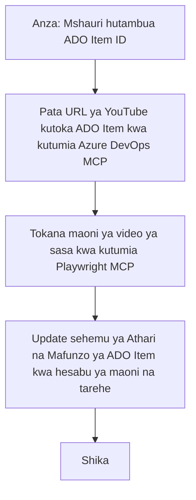

# Uchambuzi wa Kesi: Kusasisha Vitu vya Azure DevOps Kutoka Data ya YouTube kwa MCP

> **Kiarifa:** Kuna zana na ripoti zilizopo mtandaoni ambazo zinaweza kuendesha mchakato wa kusasisha vitu vya Azure DevOps kwa data kutoka kwenye majukwaa kama YouTube. Hali ifuatayo inatolewa kama mfano tu wa matumizi kuonesha jinsi zana za MCP zinavyoweza kutumika kwa kazi za otomatiki na mwingiliano.

## Muhtasari

Uchambuzi huu wa kesi unaonyesha mfano mmoja wa jinsi Itifaki ya Muktadha wa Mfano (MCP) na zana zake zinaweza kutumika kuendesha mchakato wa kusasisha vitu vya kazi vya Azure DevOps (ADO) kwa taarifa zinazopatikana kutoka majukwaa ya mtandaoni, kama YouTube. Hali iliyotajwa ni mfano mmoja tu wa uwezo mpana wa zana hizi, ambazo zinaweza kubadilishwa kwa mahitaji mengine mengi ya otomatiki.

Katika mfano huu, Mwakilishi anafuatilia vikao vya mtandaoni kwa kutumia vitu vya ADO, ambapo kila kitu kina URL ya video ya YouTube. Kwa kutumia zana za MCP, Mwakilishi anaweza kuweka vitu vya ADO kuwa vya kisasa kwa takwimu za hivi karibuni za video, kama idadi ya maoni, kwa njia inayorudiwa na ya otomatiki. Njia hii inaweza kuwekwa kwa matumizi mengine ambapo taarifa kutoka vyanzo vya mtandaoni zinahitaji kuingizwa katika ADO au mifumo mingine.

## Hali

Mwakilishi anahusika na kufuatilia athari za vikao vya mtandaoni na ushirikiano wa jamii. Kikao kila kimoja kinaandikwa kama kipengee cha kazi cha ADO katika mradi wa 'DevRel', na kipengee cha kazi kina uwanja wa URL ya video ya YouTube. Ili kuripoti kwa usahihi kufikia kwa kikao, Mwakilishi anahitaji kusasisha kipengee cha ADO kwa idadi ya sasa ya maoni ya video na tarehe taarifa hii ilipatikana.

## Zana Zilitumika

- [Azure DevOps MCP](https://github.com/microsoft/azure-devops-mcp): Inaruhusu upatikanaji wa programu na masasisho ya vitu vya kazi vya ADO kupitia MCP.
- [Playwright MCP](https://github.com/microsoft/playwright-mcp): Unaendesha vitendo vya kivinjari kutoa data ya moja kwa moja kutoka kwenye kurasa za mtandao, kama takwimu za video za YouTube.

## Mtiririko wa Kazi Hatua kwa Hatua

1. **Tambua Kipengee cha ADO**: Anza na nambari ya kipengee cha kazi cha ADO (mfano, 1234) katika mradi wa 'DevRel'.
2. **Pata URL ya YouTube**: Tumia zana ya Azure DevOps MCP kupata URL ya YouTube kutoka kipengee cha kazi.
3. **Toa Idadi ya Maoni ya Video**: Tumia zana ya Playwright MCP kuvinjari URL ya YouTube na kutoa idadi ya sasa ya maoni.
4. **Sasisha Kipengee cha ADO**: Andika idadi ya hivi karibuni ya maoni na tarehe ya upatikanaji katika sehemu ya 'Impact and Learnings' ya kipengee cha kazi cha ADO kwa kutumia zana ya Azure DevOps MCP.

## Mfano wa Msimulizi

```bash
- Work with the ADO Item ID: 1234
- The project is '2025-Awesome'
- Get the YouTube URL for the ADO item
- Use Playwright to get the current views from the YouTube video
- Update the ADO item with the current video views and the updated date of the information
```

## Mermaid Flowchart


## Utekelezaji wa Kifundi

- **Mpangilio wa MCP**: Mtiririko wa kazi unaendeshwa na seva ya MCP, ambayo inaendeshwa kutumia zana za Azure DevOps MCP na Playwright MCP.
- **Otomatiki**: Mchakato unaweza kuzinduliwa kwa mikono au kupangwa kuendeshwa kwa vipindi vya kawaida ili kuweka vitu vya ADO vikiwa vya kisasa.
- **Uwezo wa Kupanuka**: Mfano huo huo unaweza kupanuliwa kusasisha vitu vya ADO kwa takwimu zingine za mtandaoni (mfano, vipendwa, maoni) au kutoka majukwaa mengine.

## Matokeo na Athari

- **Ufanisi**: Inapunguza juhudi za mikono kwa Mawakilishi kwa kuendesha upatikanaji na masasisho ya takwimu za video.
- **Usahihi**: Inahakikisha kuwa vitu vya ADO vinaonyesha data ya hivi karibuni inayopatikana kutoka vyanzo vya mtandaoni.
- **Urudiwa**: Inatoa mtiririko wa kazi unaoweza kutumika tena kwa hali sawa zinazohusisha vyanzo vingine vya data au takwimu.

## Marejeleo

- [Azure DevOps MCP](https://github.com/microsoft/azure-devops-mcp)
- [Playwright MCP](https://github.com/microsoft/playwright-mcp)
- [Itifaki ya Muktadha wa Mfano (MCP)](https://modelcontextprotocol.io/)

## Kinachofuata

- Rudi kwa: [Muhtasari wa Uchambuzi wa Kesi](./README.md)
- Ifuatayo: [Upataji wa Nyaraka kwa Wakati Halisi kwa MCP](./docs-mcp/README.md)

---

<!-- CO-OP TRANSLATOR DISCLAIMER START -->
**Kiarifa cha Msamaha**:
Nyaraka hii imetafsiriwa kwa kutumia huduma ya tafsiri ya AI [Co-op Translator](https://github.com/Azure/co-op-translator). Ingawa tunajitahidi kwa usahihi, tafadhali fahamu kwamba tafsiri za kiotomatiki zinaweza kuwa na makosa au kasoro. Nyaraka ya asili katika lugha yake ya mama inapaswa kuchukuliwa kama chanzo cha mamlaka. Kwa taarifa muhimu, tafsiri ya kitaalamu ya binadamu inashauriwa. Hatubebei mzimu wowote kwa kutoelewana au tafsiri potofu zinazotokana na matumizi ya tafsiri hii.
<!-- CO-OP TRANSLATOR DISCLAIMER END -->