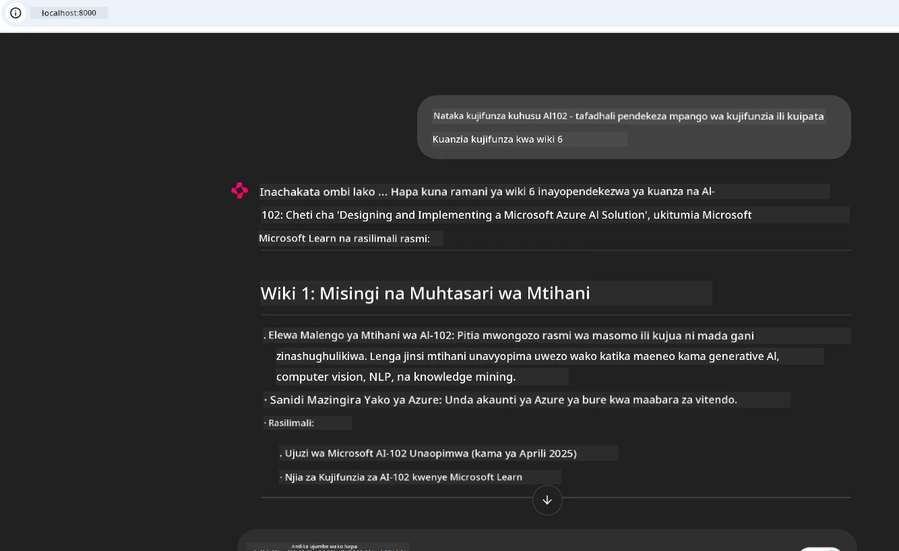
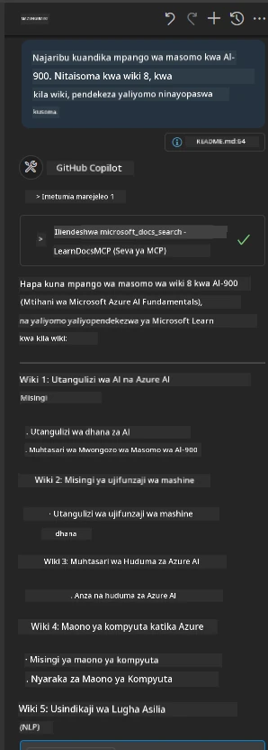

# Uchunguzi wa Kesi: Kuunganisha na Microsoft Learn Docs MCP Server kutoka kwa Mteja

Je, umewahi kujikuta ukicheza kati ya tovuti za nyaraka, Stack Overflow, na vibonye visivyoisha vya injini za utafutaji, yote huku ukijaribu kutatua tatizo katika msimbo wako? Labda unahifadhi monitor ya pili kwa ajili ya nyaraka tu, au unabadilishana mara kwa mara kati ya IDE yako na kivinjari. Je, haingekuwa bora ikiwa unaweza kuleta nyaraka moja kwa moja katika mtiririko wako wa kazi—zikijumuishwa katika programu zako, IDE yako, au hata zana zako binafsi? Katika uchunguzi huu wa kesi, tutaangalia jinsi ya kufanya hivyo kwa kuunganishwa moja kwa moja na Microsoft Learn Docs MCP server kutoka kwa programu yako ya mteja mwenyewe.

## Muhtasari

Maendeleo ya kisasa siyo tu kuandika msimbo—ni kuhusu kupata taarifa sahihi kwa wakati sahihi. Nyaraka zipo kila mahali, lakini mara nyingi si pale unapoihitaji zaidi: ndani ya zana na mtiririko wako wa kazi. Kwa kuingiza upokeaji wa nyaraka moja kwa moja ndani ya programu zako, unaweza kuokoa muda, kupunguza mabadiliko ya muktadha, na kuongeza ufanisi. Katika sehemu hii, tutaonyesha jinsi ya kuunganisha mteja na Microsoft Learn Docs MCP server, ili uweze kupata nyaraka za wakati halisi, zinazoelewa muktadha bila kuondoka kwenye programu yako.

Tutapitia hatua za kuanzisha muunganisho, kutuma ombi, na kushughulikia majibu yanayotiririka kwa ufanisi. Njia hii haiwezi tu kuweka mtiririko wako wa kazi kwenye mstari, bali pia huweka mlango wa kujenga zana za mbunifu zaidi, zenye msaada zaidi.

## Malengo ya Kujifunza

Kwa nini tunafanya hivi? Kwa sababu uzoefu bora wa mbunifu ni ule unaondoa usumbufu. Fikiria dunia ambapo mhariri wako wa msimbo, chatbot, au programu ya wavuti inaweza kujibu maswali yako ya nyaraka papo hapo, kwa kutumia maudhui mapya kutoka Microsoft Learn. Mwisho wa sura hii, utajua jinsi ya:

- Kuelewa misingi ya mawasiliano kati ya MCP server na mteja kwa nyaraka
- Kutekeleza programu ya consola au wavuti kuunganishwa na Microsoft Learn Docs MCP server
- Kutumia wateja wa HTTP wanaotiririsha kwa ajili ya upokeaji wa nyaraka za wakati halisi
- Kurejesha na kufasiri majibu ya nyaraka katika programu yako

Utaona jinsi ujuzi huu utakavyokusaidia kujenga zana zisizo tu zinazojibu, bali pia zinazojihusisha na muktadha na kuwa nyeti kwa mazingira.

## Hali ya Kesi 1 - Upokeaji wa Nyaraka za Wakati Halisi na MCP

Katika hali hii ya kesi, tutakuonyesha jinsi ya kuunganisha mteja na Microsoft Learn Docs MCP server, ili uweze kupata nyaraka za wakati halisi, zinazoelewa muktadha bila kuondoka kwenye programu yako.

Tuitumie hii kwa vitendo. Kazi yako ni kuandika programu inayounganisha na Microsoft Learn Docs MCP server, kuitisha zana ya `microsoft_docs_search`, na kurekodi jibu linapotiriririka kwa console.

### Kwa nini njia hii?
Kwa sababu ni msingi wa kujenga ushirikiano wa hali ya juu—iwe unataka kuendesha chatbot, ugani wa IDE, au dashibodi ya wavuti.

Utapata msimbo na maelekezo kwa hali hii ya kesi katika folda ya [`solution`](./solution/README.md) ndani ya uchunguzi huu wa kesi. Hatua zitaelekeza jinsi ya kuweka muunganisho:
- Tumia SDK rasmi ya MCP na mteja wa HTTP unaoweza kutiririsha kwa muunganisho
- Ita zana ya `microsoft_docs_search` kwa parameter ya swali ili kupata nyaraka
- Tekeleza usajili sahihi na kushughulikia makosa
- Unda interface ya console inayojihusisha kuruhusu watumiaji kuingiza maswali mengi ya utafutaji

Hali hii inaonyesha jinsi ya:
- Kuungana na Docs MCP server
- Kutuma swali
- Kuchambua na kuchapisha matokeo

Huu ndo mfano wa jinsi suluhisho linavyoweza kuendeshwa:

```
Prompt> What is Azure Key Vault?
Answer> Azure Key Vault is a cloud service for securely storing and accessing secrets. ...
```

Hapo chini ni suluhisho la mfano mdogo. Msimbo kamili na maelezo yanapatikana katika folda ya suluhisho.

<details>
<summary>Python</summary>

```python
import asyncio
from mcp.client.streamable_http import streamablehttp_client
from mcp import ClientSession

async def main():
    async with streamablehttp_client("https://learn.microsoft.com/api/mcp") as (read_stream, write_stream, _):
        async with ClientSession(read_stream, write_stream) as session:
            await session.initialize()
            result = await session.call_tool("microsoft_docs_search", {"query": "Azure Functions best practices"})
            print(result.content)

if __name__ == "__main__":
    asyncio.run(main())
```

- Kwa utekelezaji kamili na usajili, angalia [`scenario1.py`](../../../../09-CaseStudy/docs-mcp/solution/python/scenario1.py).
- Kwa maelekezo ya usanikishaji na matumizi, angalia faili la [`README.md`](./solution/python/README.md) katika folda hiyo hiyo.
</details>


## Hali ya Kesi 2 - Programu ya Mtandao ya Kizalishaji ya Mpango wa Kujifunza Inayojihusisha na MCP

Katika hali hii ya kesi, utajifunza jinsi ya kuingiza Docs MCP katika mradi wa maendeleo ya wavuti. Lengo ni kuwapa watumiaji uwezo wa kutafuta nyaraka za Microsoft Learn moja kwa moja kupitia interface ya wavuti, na kufanya nyaraka kupatikana papo hapo ndani ya programu yako au tovuti.

Utaona jinsi ya:
- Kuweka programu ya wavuti
- Kuunganisha na Docs MCP server
- Kushughulikia maingizo ya mtumiaji na kuonyesha matokeo

Huu ndo mfano wa jinsi suluhisho linavyoweza kuendeshwa:

```
User> I want to learn about AI102 - so suggest the roadmap to get it started from learn for 6 weeks

Assistant> Here’s a detailed 6-week roadmap to start your preparation for the AI-102: Designing and Implementing a Microsoft Azure AI Solution certification, using official Microsoft resources and focusing on exam skills areas:

---
## Week 1: Introduction & Fundamentals
- **Understand the Exam**: Review the [AI-102 exam skills outline](https://learn.microsoft.com/en-us/credentials/certifications/exams/ai-102/).
- **Set up Azure**: Sign up for a free Azure account if you don't have one.
- **Learning Path**: [Introduction to Azure AI services](https://learn.microsoft.com/en-us/training/modules/intro-to-azure-ai/)
- **Focus**: Get familiar with Azure portal, AI capabilities, and necessary tools.

....more weeks of the roadmap...

Let me know if you want module-specific recommendations or need more customized weekly tasks!
```

Hapo chini ni suluhisho la mfano mdogo. Msimbo kamili na maelezo yanapatikana katika folda ya suluhisho.



<details>
<summary>Python (Chainlit)</summary>

Chainlit ni mfumo wa kuunda programu za wavuti za AI za mazungumzo. Inafanya iwe rahisi kuunda chatbot na wasaidizi wa mazungumzo wanaoweza kuitisha zana za MCP na kuonyesha matokeo papo hapo. Ni bora kwa utengenezaji wa prototipu haraka na interfaces rahisi kwa watumiaji.

```python
import chainlit as cl
import requests

MCP_URL = "https://learn.microsoft.com/api/mcp"

@cl.on_message
def handle_message(message):
    query = {"question": message}
    response = requests.post(MCP_URL, json=query)
    if response.ok:
        result = response.json()
        cl.Message(content=result.get("answer", "No answer found.")).send()
    else:
        cl.Message(content="Error: " + response.text).send()
```

- Kwa utekelezaji kamili, angalia [`scenario2.py`](../../../../09-CaseStudy/docs-mcp/solution/python/scenario2.py).
- Kwa maelekezo ya usanikishaji na kuendesha, angalia [`README.md`](./solution/python/README.md).
</details>


## Hali ya Kesi 3: Nyaraka Ndani ya Mhariri na MCP Server ndani ya VS Code

Ikiwa unataka kupata Microsoft Learn Docs moja kwa moja ndani ya VS Code (badala ya kubadilisha vibonye vya kivinjari), unaweza kutumia MCP server ndani ya mhariri wako. Hii inakuwezesha:
- Kutafuta na kusoma nyaraka ndani ya VS Code bila kuondoka kwenye mazingira ya uandishi wa msimbo.
- Kurejelea nyaraka na kuweka viungo moja kwa moja katika README au faili za kozi.
- Kutumia GitHub Copilot na MCP pamoja kwa mtiririko wa nyaraka zenye nguvu za AI.

**Utaona jinsi ya:**
- Kuongeza faili halali `.vscode/mcp.json` kwenye mzizi wa mwambaro wako (angalia mfano hapa chini).
- Kufungua paneli ya MCP au kutumia paleti ya amri katika VS Code kutafuta na kuweka nyaraka.
- Kurejelea nyaraka moja kwa moja katika faili zako za markdown unapoendesha kazi.
- Kuchanganya mtiririko huu na GitHub Copilot kwa ufanisi zaidi.

Huu ni mfano wa jinsi ya kuweka MCP server ndani ya VS Code:

```json
{
  "servers": {
    "LearnDocsMCP": {
      "url": "https://learn.microsoft.com/api/mcp"
    }
  }
}
```

</details>

> Kwa maelezo ya kina yenye picha na mwongozo wa hatua kwa hatua, angalia [`README.md`](./solution/scenario3/README.md).



Njia hii ni bora kwa yeyote anayejenga kozi za kitaalamu, kuandika nyaraka, au kuendeleza msimbo kwa marejeleo ya mara kwa mara.

## Muhimu wa Kukumbuka

Kuingiza nyaraka moja kwa moja ndani ya zana zako siyo tu urahisi—ni mabadiliko makubwa kwa ufanisi. Kwa kuunganishwa na Microsoft Learn Docs MCP server kutoka kwa mteja wako, unaweza:

- Kuondoa mabadiliko ya muktadha kati ya msimbo wako na nyaraka
- Kupata nyaraka za kisasa, zinazoelewa muktadha za wakati halisi
- Kujenga zana za mbunifu, zinazoendeshwa na ushirikiano zaidi

Ujuzi huu utakusaidia kuunda suluhisho zisizo tu zinafanya kazi vizuri, bali pia ni furaha kutumia.

## Rasilimali Zaidi

Ili kukuza ufahamu wako, chunguza rasilimali rasmi hizi:

- [Microsoft Learn Docs MCP Server (GitHub)](https://github.com/MicrosoftDocs/mcp)
- [Anza na Azure MCP Server (mcp-python)](https://learn.microsoft.com/en-us/azure/developer/azure-mcp-server/get-started#create-the-python-app)
- [Azure MCP Server ni Nini?](https://learn.microsoft.com/en-us/azure/developer/azure-mcp-server/)
- [Utangulizi wa Model Context Protocol (MCP)](https://modelcontextprotocol.io/introduction)
- [Ongeza vijumlishaji kutoka MCP Server (Python)](https://learn.microsoft.com/en-us/semantic-kernel/concepts/plugins/adding-mcp-plugins)

## Nini Kinachofuata

- Rudi kwenye: [Muhtasari wa Uchunguzi wa Kesi](../README.md)
- Endelea kwa: [Sura ya 10: Kurahisisha Mtiririko wa Kazi za AI kwa AI Toolkit](../../10-StreamliningAIWorkflowsBuildingAnMCPServerWithAIToolkit/README.md)

---

<!-- CO-OP TRANSLATOR DISCLAIMER START -->
**Kagua**:
Hati hii imetafsiriwa kwa kutumia huduma ya tafsiri ya AI [Co-op Translator](https://github.com/Azure/co-op-translator). Ingawa tunajitahidi kuhakikisha usahihi, tafadhali fahamu kwamba tafsiri za kiotomatiki zinaweza kuwa na makosa au kasoro. Hati asili katika lugha yake ya asili inapaswa kuchukuliwa kama chanzo cha mamlaka. Kwa taarifa muhimu, tafsiri ya mtaalamu wa binadamu inapendekezwa. Hatuna dhamana kwa kutoelewana au tafsiri potofu zitokanazo na matumizi ya tafsiri hii.
<!-- CO-OP TRANSLATOR DISCLAIMER END -->