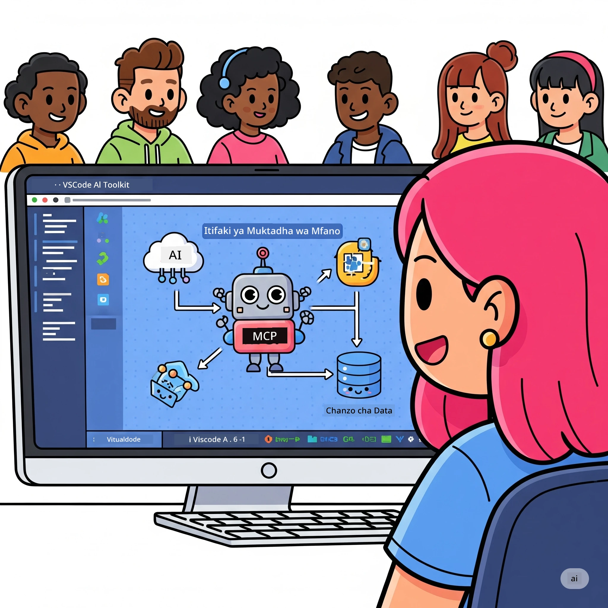
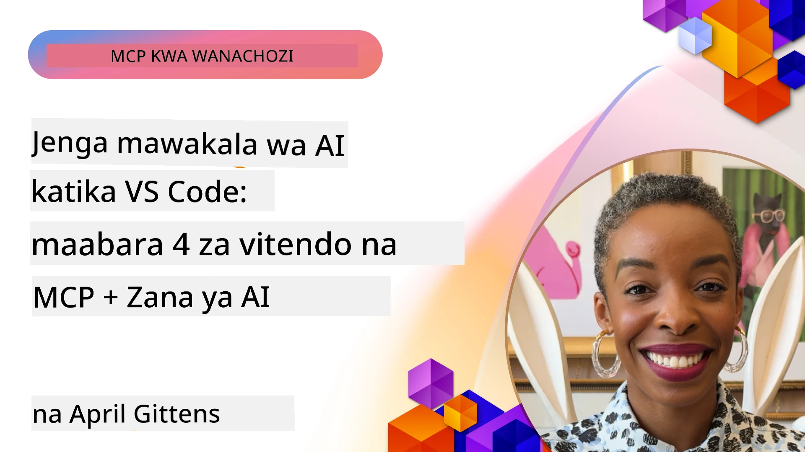

# Kuweka Mizunguko ya AI Rahisi: Kujenga Server ya MCP kwa AI Toolkit

## 🎯 Muhtasari

_(Bonyeza picha hapo juu kuangalia video ya somo hili)_

Karibu kwenye **Warsha ya Protocol ya Muktadha wa Mfano (MCP)**! Warsha hii ya kina yenye vitendo huchanganya teknolojia mbili za kisasa kubadilisha maendeleo ya programu za AI:

- **🔗 Protocol ya Muktadha wa Mfano (MCP)**: Kiwango wazi kwa ushirikiano wa zana za AI bila mshono
- **🛠️ AI Toolkit kwa Visual Studio Code (AITK)**: Upanuzi mzito wa maendeleo ya AI wa Microsoft

### 🎓 Utajifunza Nini

Mwisho wa warsha hii, utakuwa mtaalamu katika ujenzi wa programu za akili zinazounganisha mifano ya AI na zana halisi pamoja na huduma. Kuanzia upimaji wa moja kwa moja hadi ushirikiano wa API maalum, utakua na ujuzi wa vitendo wa kutatua changamoto ngumu za biashara.

## 🏗️ Teknolojia Zinazotumika

### 🔌 Protocol ya Muktadha wa Mfano (MCP)

MCP ni **"USB-C ya AI"** - kiwango cha ulimwengu kinachounganisha mifano ya AI na zana za nje na vyanzo vya data.

**✨ Sifa Muhimu:**

- 🔄 **Ushirikiano Ulio Thabiti**: Mwelekeo wa ulimwengu wote kwa miunganisho ya zana za AI
- 🏛️ **Muundo Wepesi**: Server za ndani na za mbali kupitia usafirishaji wa stdio/SSE
- 🧰 **Ekosistimu Tajiri**: Zana, arifu, na rasilimali kwenye itifaki moja
- 🔒 **Tayari kwa Biashara**: Usalama na uhakikisho wa ndani

**🎯 Kwa Nini MCP Ni Muhimu:**
Kama USB-C ilivyotatua machafuko ya nyaya, MCP inafuta ugumu wa ushirikiano wa AI. Itifaki moja, nafasi zisizo na kikomo.

### 🤖 AI Toolkit kwa Visual Studio Code (AITK)

Upanuzi mkuu wa maendeleo ya AI wa Microsoft unaobadilisha VS Code kuwa nguvu ya AI.

**🚀 Uwezo Msingi:**

- 📦 **Katalogi ya Mifano**: Pata mifano kutoka Azure AI, GitHub, Hugging Face, Ollama
- ⚡ **Utabiri wa Ndani**: Utendaji ulioboreshwa kwa ONNX kwenye CPU/GPU/NPU
- 🏗️ **Mtengenezaji wa Wakala**: Maendeleo ya wakala wa AI kwa njia ya kuona na MCP
- 🎭 **Multi-Modal**: Msaada wa maandishi, kuona, na matokeo yaliyopangwa

**💡 Faida za Maendeleo:**

- Usambazaji wa mfano bila mipangilio
- Uhandisi wa arifu wa kuona
- Mazingira ya majaribio ya wakati halisi
- Ushirikiano usio na mshono na server ya MCP

## 📚 Safari ya Kujifunza

### [🚀 Moduli 1: Misingi ya AI Toolkit](./lab1/README.md)

**Muda**: Dakika 15

- 🛠️ Sakinisha na weka AI Toolkit kwa VS Code
- 🗂️ Chunguza Katalogi ya Mifano (mifano 100+ kutoka GitHub, ONNX, OpenAI, Anthropic, Google)
- 🎮 Tawala Maeneo ya Mazingira ya Majaribio ya wakati halisi
- 🤖 Jenga wakala wako wa AI wa kwanza kwa Agent Builder
- 📊 Tambua utendaji wa mfano kwa vipimo vilivyomo (F1, umuhimu, mfanano, ulinganifu)
- ⚡ Jifunze usindikaji wa kundi na msaada wa multi-modal

**🎯 Matokeo ya Kujifunza**: Tengeneza wakala wa AI anayefanya kazi kwa uelewa wa kina wa uwezo wa AITK

### [🌐 Moduli 2: MCP na Misingi ya AI Toolkit](./lab2/README.md)

**Muda**: Dakika 20

- 🧠 Fahamu muundo na dhana za Protocol ya Muktadha wa Mfano (MCP)
- 🌐 Chunguza ekosistimu ya server za MCP za Microsoft
- 🤖 Jenga wakala wa otomatiki wa kivinjari kwa kutumia Playwright MCP server
- 🔧 Unganisha server za MCP na AI Toolkit Agent Builder
- 📊 Pangilia na jaribu zana za MCP ndani ya mawakala wako
- 🚀 Hamisha na sambaza mawakala wa MCP kwa matumizi ya uzalishaji

**🎯 Matokeo ya Kujifunza**: Sambaza wakala wa AI aliyeongezwa nguvu na zana za nje kupitia MCP

### [🔧 Moduli 3: Maendeleo ya Juu ya MCP kwa AI Toolkit](./lab3/README.md)

**Muda**: Dakika 20

- 💻 Tengeneza server za MCP maalum kwa kutumia AI Toolkit
- 🐍 Sanidi na tumia SDK ya MCP Python mpya (v1.9.3)
- 🔍 Tengeneza mazingira ya MCP Inspector kwa utafiti
- 🛠️ Jenga Server ya Hali ya Hewa ya MCP kwa mchakato wa ufumbuzi wa kasoro wa kitaalamu
- 🧪 Fanyia kazi na tafuta kasoro kwa server za MCP ndani ya Agent Builder na mazingira ya Inspector

**🎯 Matokeo ya Kujifunza**: Tengeneza na tafuta kasoro za server za MCP maalum kwa zana za kisasa

### [🐙 Moduli 4: Maendeleo ya Vitendo ya MCP - Server Maalum ya GitHub Clone](./lab4/README.md)

**Muda**: Dakika 30

- 🏗️ Jenga Server halisi ya GitHub Clone MCP kwa michakato ya maendeleo
- 🔄 Tekeleza kloni smart ya hifadhidata na uthibitishaji na utunzaji wa makosa
- 📁 Tengeneza usimamizi bora wa saraka na ushirikiano wa VS Code
- 🤖 Tumia GitHub Copilot Agent Mode na zana maalum za MCP
- 🛡️ Tekeleza uhakika wa uzalishaji na ushirikiano wa majukwaa mbalimbali

**🎯 Matokeo ya Kujifunza**: Sambaza server ya MCP iliyotayarishwa kwa uzalishaji ambayo inaweka rahisi mizunguko halisi ya maendeleo

## 💡 Matumizi na Mwelekeo wa Dunia Halisi

### 🏢 Matumizi ya Biashara

#### 🔄 Otomatiki ya DevOps

Badilisha mzunguko wako wa maendeleo kwa otomatiki ya akili:

- **Usimamizi Smart wa Hifadhidata**: Mapitio ya msimbo na maamuzi ya muungano yaliyoendeshwa na AI
- **CI/CD Bora**: Uboreshaji wa njia za kiotomatiki kulingana na mabadiliko ya msimbo
- **Ugawaji Masuala**: Kuweka makosa kwa otomatiki na utekelezaji

#### 🧪 Mapinduzi ya Udhibiti wa Ubora

Pakia upimaji kwa otomatiki inayoungwa mkono na AI:

- **Uundaji Bora wa Majaribio**: Tengeneza seti kamili za majaribio moja kwa moja
- **Upimaji wa Mapungufu ya Visual**: Kugundua mabadiliko ya UI kwa AI
- **Ufuatiliaji wa Utendaji**: Kugundua na kutatua matatizo kwa mapema

#### 📊 Akili ya Mizunguko ya Data

Jenga mizunguko bora ya usindikaji data:

- **Mchakato wa ETL Unaojiboresha**: Mabadiliko ya data yenye kujisahihisha
- **Ugunduzi wa Kasoro**: Ufuatiliaji wa ubora wa data kwa wakati halisi
- **Uelekezaji Smart**: Usimamizi bora wa mtiririko wa data

#### 🎧 Kuboresha Uzoefu wa Wateja

Tengeneza mwingiliano wa kipekee na wateja:

- **Msaada unaojali Muktadha**: Wakala wa AI wenye ufikiaji wa historia ya mteja
- **Utatuzi wa Tatizo kwa Mbele**: Huduma za wateja zinazo tabiri
- **Ushirikiano wa Njia Nyingi**: Uzoefu wa AI umeunganishwa kwenye majukwaa

## 🛠️ Masharti na Usanidi

### 💻 Mahitaji ya Mfumo

| Sehemu | Mahitaji | Maelezo |
|-----------|-------------|-------|
| **Mfumo wa Uendeshaji** | Windows 10+, macOS 10.15+, Linux | Kila OS ya kisasa |
| **Visual Studio Code** | Toleo thabiti la hivi karibuni | Inahitajika kwa AITK |
| **Node.js** | v18.0+ na npm | Kwa maendeleo ya server ya MCP |
| **Python** | 3.10+ | Hiari kwa server za MCP za Python |
| **Kumbukumbu** | RAM 8GB angalau | Inashauriwa 16GB kwa mifano ya ndani |

### 🔧 Mazingira ya Maendeleo

#### Upanuzi Unaopendekezwa kwa VS Code

- **AI Toolkit** (ms-windows-ai-studio.windows-ai-studio)
- **Python** (ms-python.python)
- **Kifumbuzi cha Kasoro cha Python** (ms-python.debugpy)
- **GitHub Copilot** (GitHub.copilot) - Hiari lakini msaada

#### Zana za Hiari

- **uv**: Meneja wa kisasa wa vifurushi vya Python
- **MCP Inspector**: Zana ya kuona kasoro kwa server za MCP
- **Playwright**: Kwa mifano ya otomatiki ya wavuti

## 🎖️ Matokeo ya Kujifunza na Njia ya Cheti

### 🏆 Orodha ya Ujuzi wa Kichwa

Kwa kumaliza warsha hii, utapata ujuzi wa:

#### 🎯 Uwezo wa Msingi

- [ ] **Ujuzi wa Itifaki ya MCP**: Uelewa wa kina wa muundo na mifumo ya utekelezaji
- [ ] **Utaalamu wa AITK**: Matumizi ya kiwango cha mtaalamu wa AI Toolkit kwa maendeleo haraka
- [ ] **Maendeleo ya Server Maalum**: Tengeneza, sambaza, na tumia server za MCP za uzalishaji
- [ ] **Ufanisi wa Ushirikiano wa Zana**: Unganisha AI bila kikwazo na mizunguko ya maendeleo iliyopo
- [ ] **Utekelezaji wa Utatuzi wa Matatizo**: Tumia ujuzi uliopatikana kwa changamoto za biashara halisi

#### 🔧 Ujuzi wa Kiufundi

- [ ] Sanidi na tumia AI Toolkit kwenye VS Code
- [ ] Panga na tengeneza server maalum za MCP
- [ ] Unganisha Mifano ya GitHub na muundo wa MCP
- [ ] Jenga michakato ya majaribio ya moja kwa moja kwa Playwright
- [ ] Sambaza mawakala wa AI kwa matumizi ya uzalishaji
- [ ] Tafuta kasoro na boresha utendaji wa server ya MCP

#### 🚀 Uwezo wa Juu

- [ ] Tunga ushirikiano wa AI kwa kiwango cha biashara
- [ ] Tekeleza mbinu bora za usalama kwa programu za AI
- [ ] Tengeneza miundo inayoweza kupanuka ya server za MCP
- [ ] Tengeneza minyororo ya zana maalum kwa nyanja za kipekee
- [ ] Fundisha wengine katika maendeleo ya AI asilia

## 📖 Rasilimali Zaidi

- [MCP Specification (2025-11-25)](https://spec.modelcontextprotocol.io/specification/2025-11-25/)
- [Hazina ya AI Toolkit GitHub](https://github.com/microsoft/vscode-ai-toolkit)
- [Mkusanyiko wa Server za MCP za Mfano](https://github.com/modelcontextprotocol/servers)
- [Mwongozo wa Mienendo Bora](https://modelcontextprotocol.io/docs/best-practices)
- [OWASP MCP Top 10](https://microsoft.github.io/mcp-azure-security-guide/mcp/) - Mbinu bora za usalama

---

**🚀 Tayari kubadilisha mizunguko yako ya maendeleo ya AI?**

Tujenge pamoja mustakabali wa programu za akili kwa pamoja na MCP na AI Toolkit!

## Kile kinachofuata

Endelea kwa: [Moduli 11: Maabara za Vitendo za Server ya MCP](../11-MCPServerHandsOnLabs/README.md)

---

<!-- CO-OP TRANSLATOR DISCLAIMER START -->
**Taasisi**:
Hati hii imetafsiriwa kwa kutumia huduma ya tafsiri ya AI [Co-op Translator](https://github.com/Azure/co-op-translator). Ingawa tunajitahidi kufikia usahihi, tafadhali fahamu kuwa tafsiri za kiotomatiki zinaweza kuwa na makosa au upungufu wa usahihi. Hati ya asili katika lugha yake ya asili inapaswa kuchukuliwa kama chanzo cha mamlaka. Kwa habari muhimu, tafsiri ya kitaalamu kutoka kwa binadamu inapendekezwa. Hatujawajibika kwa kutokuelewana au makoseo yanayotokea kutokana na matumizi ya tafsiri hii.
<!-- CO-OP TRANSLATOR DISCLAIMER END -->