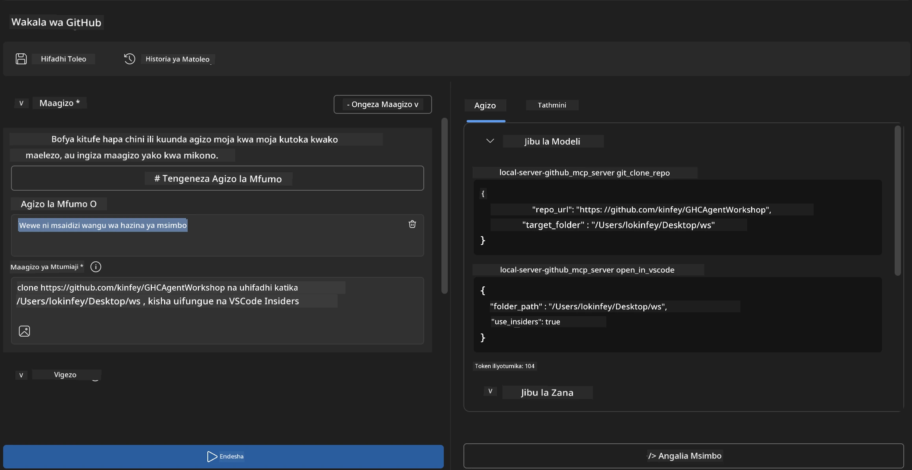

# 🐙 Moduli 4: Maendeleo ya Vitendo ya MCP - Seva ya Kigeuzi ya GitHub ya Kipekee


> **⚡ Anza Haraka:** Jenga seva ya MCP inayotumika uzalishaji inayojirudisha yenyewe ya kuiga hifadhidata za GitHub na muingiliano wa VS Code kwa dakika 30 tu!

## 🎯 Malengo ya Kujifunza

Mwisho wa maabara hii, utaweza:

- ✅ Kuunda seva ya MCP ya kipekee kwa mtiririko wa kazi wa maendeleo halisi
- ✅ Kutekeleza utendaji wa kuiga hifadhidata za GitHub kupitia MCP
- ✅ Kuunganisha seva za MCP za kipekee na VS Code na Agent Builder
- ✅ Kutumia Mode ya Wakala wa GitHub Copilot na zana za MCP za kipekee
- ✅ Kupima na kuweka seva za MCP za kipekee katika mazingira ya uzalishaji

## 📋 Masharti ya Awali

- Kumaliza Maabara 1-3 (Misingi ya MCP na maendeleo ya juu)
- Usajili wa GitHub Copilot ([usajili wa bure unapatikana](https://github.com/github-copilot/signup))
- VS Code yenye AI Toolkit na virutubisho vya GitHub Copilot
- CLI ya Git imewekwa na kusanidiwa

## 🏗️ Muhtasari wa Mradi

### **Changamoto ya Maendeleo Halisi**
Kama waendelezaji, mara nyingi tunatumia GitHub kuiga hifadhidata na kuzifungua kwenye VS Code au VS Code Insiders. Mchakato huu wa mwongozo unahusisha:
1. Kufungua terminal/command prompt
2. Kuhamia kwenye saraka inayotakiwa
3. Kutumia amri ya `git clone`
4. Kufungua VS Code kwenye saraka iliyogiwa

**Suluhisho letu la MCP linapunguzia hili kuwa amri moja yenye akili!**

### **Utabadilisha Nini**
Seva ya **GitHub Clone MCP** (`git_mcp_server`) inayotoa:

| Kipengele | Maelezo | Faida |
|---------|-------------|---------|
| 🔄 **Kuiga Hifadhidata kwa Akili** | Kuiga hifadhidata za GitHub kwa uthibitisho | Uthibitishaji wa makosa kiotomatiki |
| 📁 **Usimamizi wa Saraka kwa Akili** | Angalia na tengeneza saraka kwa usalama | Kuzuia kuandika juu ya mambo yaliyopo |
| 🚀 **Muunganisho wa VS Code wa Msalaba-Mifumo** | Fungua miradi katika VS Code/Insiders | Mpito mzuri wa mtiririko wa kazi |
| 🛡️ **Utatuzi Imara wa Makosa** | Shimika matatizo ya mtandao, ruhusa, na njia | Uthabiti sawa wa matumizi uzalishaji |

---

## 📖 Utekelezaji Hatua kwa Hatua

### Hatua 1: Unda Wakala wa GitHub katika Agent Builder

1. **Anzisha Agent Builder** kupitia kiendelezi cha AI Toolkit  
2. **Unda wakala mpya** na usanidi ufuatao:  
   ```
   Agent Name: GitHubAgent
   ```
  
3. **anzisha seva ya MCP ya kipekee:**  
   - Nenda kwenye **Tools** → **Add Tool** → **MCP Server**  
   - Chagua **"Create A new MCP Server"**  
   - Chagua **kiolezo cha Python** kwa urefu wa kubadilika zaidi  
   - **Jina la Seva:** `git_mcp_server`  

### Hatua 2: Sanidi Mode ya Wakala wa GitHub Copilot

1. **Fungua GitHub Copilot** katika VS Code (Ctrl/Cmd + Shift + P → "GitHub Copilot: Open")  
2. **Chagua Mfano wa Wakala** katika kiolesura cha Copilot  
3. **Chagua mfano wa Claude 3.7** kwa uelewa wa hali ya juu wa mantiki  
4. **Washa muunganisho wa MCP** kwa kupata zana  

> **💡 Ushauri wa Mtaalamu:** Claude 3.7 hutoa uelewa mzuri juu ya mtiririko wa kazi wa maendeleo na mifumo ya utatuzi makosa.

### Hatua 3: Tekeleza Utendaji Msingi wa Seva ya MCP

**Tumia ombi hili kwa undani na Mode ya Wakala wa GitHub Copilot:**  

```
Create two MCP tools with the following comprehensive requirements:

🔧 TOOL A: clone_repository
Requirements:
- Clone any GitHub repository to a specified local folder
- Return the absolute path of the successfully cloned project
- Implement comprehensive validation:
  ✓ Check if target directory already exists (return error if exists)
  ✓ Validate GitHub URL format (https://github.com/user/repo)
  ✓ Verify git command availability (prompt installation if missing)
  ✓ Handle network connectivity issues
  ✓ Provide clear error messages for all failure scenarios

🚀 TOOL B: open_in_vscode
Requirements:
- Open specified folder in VS Code or VS Code Insiders
- Cross-platform compatibility (Windows/Linux/macOS)
- Use direct application launch (not terminal commands)
- Auto-detect available VS Code installations
- Handle cases where VS Code is not installed
- Provide user-friendly error messages

Additional Requirements:
- Follow MCP 1.9.3 best practices
- Include proper type hints and documentation
- Implement logging for debugging purposes
- Add input validation for all parameters
- Include comprehensive error handling
```
  
### Hatua 4: Jaribu Seva Yako ya MCP

#### 4a. Jaribu Katika Agent Builder

1. **Anzisha usanidi wa utatuzi** kwa Agent Builder  
2. **Sanidi wakala wako na ombi hili la mfumo:**  

```
SYSTEM_PROMPT:
You are my intelligent coding repository assistant. You help developers efficiently clone GitHub repositories and set up their development environment. Always provide clear feedback about operations and handle errors gracefully.
```
  
3. **Jaribu kwa hali halisi za mtumiaji:**  

```
USER_PROMPT EXAMPLES:

Scenario : Basic Clone and Open
"Clone {Your GitHub Repo link such as https://github.com/kinfey/GHCAgentWorkshop
 } and save to {The global path you specify}, then open it with VS Code Insiders"
```
  


**Matokeo Yanayotarajiwa:**  
- ✅ Kuiga mafanikio na uthibitisho wa njia  
- ✅ Kuanzisha VS Code moja kwa moja  
- ✅ Ujumbe wazi wa makosa kwa hali zisizofaa  
- ✅ Ushughulikiaji sahihi wa matukio ya kipekee  

#### 4b. Jaribu Katika MCP Inspector


---


**🎉 Hongera!** Umeunda seva ya MCP ya vitendo, inayotumika uzalishaji ili kutatua changamoto halisi za mtiririko wa maendeleo. Seva yako ya kuiga GitHub imeonyesha nguvu ya MCP kwa kuendesha kiotomatiki na kuboresha uzalishaji wa watengenezaji.

### 🏆 Mafanikio Uliyopata:
- ✅ **MCP Developer** - Umeunda seva ya MCP ya kipekee  
- ✅ **Workflow Automator** - Umeboresha michakato ya maendeleo  
- ✅ **Integration Expert** - Umeunganisha zana anuwai za maendeleo  
- ✅ **Production Ready** - Umejenga suluhisho zinazoweza kutumika  

---

## 🎓 Kumaliza Warsha: Safari Yako na Protocol ya Muktadha wa Mfano

**Mwanachama wa Warsha Mpendwa,**

Hongera kwa kumaliza moduli zote nne za warsha ya Protocol ya Muktadha wa Mfano! Umefuata njia ndefu kuanzia kuelewa misingi ya AI Toolkit hadi kujenga seva za MCP zinazotumika uzalishaji zinazotatua changamoto za maendeleo halisi.

### 🚀 Muhtasari wa Njia Yako ya Kujifunza:

**[Moduli 1](../lab1/README.md)**: Umeanza kwa kuchunguza misingi ya AI Toolkit, kupima mfano, na kuunda wakala wako wa kwanza wa AI.

**[Moduli 2](../lab2/README.md)**: Umejifunza usanifu wa MCP, kuunganisha Playwright MCP, na kujenga wakala wako wa kwanza wa otomatiki wa kivinjari.

**[Moduli 3](../lab3/README.md)**: Umeendeleza maendeleo ya seva za MCP za kipekee na seva ya Weather MCP na kuhitimu zana za utatuzi.

**[Moduli 4](../lab4/README.md)**: Sasa umeitumia yote kuunda zana ya otomatiki ya mtiririko wa kazi wa hifadhidata za GitHub.

### 🌟 Umeweza Kutoa:

- ✅ **Ecosystem ya AI Toolkit**: Mifano, mawakala, na mifumo ya muunganisho  
- ✅ **Usanifu wa MCP**: Muundo wa mteja-seva, itifaki za usafirishaji, na usalama  
- ✅ **Zana za Waendelezaji**: Kutoka Playground hadi Inspector hadi utekelezaji uzalishaji  
- ✅ **Maendeleo ya Kipekee**: Kujenga, kupima, na kuweka seva zako za MCP  
- ✅ **Matumizi ya Vitendo**: Kutatua changamoto halisi za mtiririko wa kazi kwa AI  

### 🔮 Hatua Zako Zifuatazo:

1. **Jenga Seva Yako Ya MCP**: Tumia ujuzi huu kuendesha otomatiki mtiririko wako wa kipekee  
2. **Jiunge na Jamii ya MCP**: Shiriki kazi zako na jifunze kwa wengine  
3. **Chunguza Muunganisho wa Juu**: Unganisha seva za MCP kwenye mifumo ya biashara  
4. **Changia Chanzo Huria**: Saidia kuboresha zana na nyaraka za MCP  

Kumbuka, warsha hii ni mwanzo tu. Ecosystem ya Protocol ya Muktadha wa Mfano inabadilika kwa kasi, na sasa umebeba uwezo wa kuwa mstari wa mbele wa zana za maendeleo zinazoendeshwa na AI.

**Asante kwa ushiriki wako na bidii katika kujifunza!**

Tunatumai warsha hii imetoa mawazo yatakayobadilisha jinsi unavyotengeneza na kuingiliana na zana za AI katika safari yako ya maendeleo.

**Furahia kuandika msimbo!**

---

## Nini Kifuatacho

Hongera kwa kumaliza maabara zote katika Moduli 10!

- Rudia kwa: [Muhtasari wa Moduli 10](../README.md)  
- Endelea na: [Moduli 11: Maabara za Vitendo za Seva ya MCP](../../11-MCPServerHandsOnLabs/README.md)

---

<!-- CO-OP TRANSLATOR DISCLAIMER START -->
**Kiarifa cha kutojihusisha**:
Nyarisho hii imetafsiriwa kwa kutumia huduma ya tafsiri ya AI [Co-op Translator](https://github.com/Azure/co-op-translator). Ingawa tunajitahidi kwa usahihi, tafadhali fahamu kuwa tafsiri za kiotomatiki zinaweza kuwa na makosa au upendeleo. Nyarisho la awali katika lugha yake asilia linapaswa kuzingatiwa kama chanzo cha mamlaka. Kwa habari muhimu, tafsiri ya kitaalamu ya binadamu inashauriwa. Hatubebei lawama kwa kutoelewana au tafsiri potofu zitokanazo na matumizi ya tafsiri hii.
<!-- CO-OP TRANSLATOR DISCLAIMER END -->