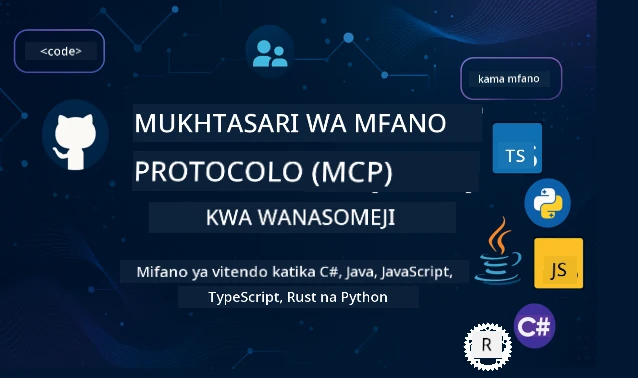

 

[](https://GitHub.com/microsoft/mcp-for-beginners/graphs/contributors)
[](https://GitHub.com/microsoft/mcp-for-beginners/issues)
[](https://GitHub.com/microsoft/mcp-for-beginners/pulls)
[](http://makeapullrequest.com)

[](https://GitHub.com/microsoft/mcp-for-beginners/watchers)
[](https://GitHub.com/microsoft/mcp-for-beginners/fork)
[](https://GitHub.com/microsoft/mcp-for-beginners/stargazers)


[](https://discord.gg/nTYy5BXMWG)

Fuata hatua hizi kuanza kutumia rasilimali hizi:
1. **Fungua Nakala ya Hifadhidata**: Bonyeza [](https://GitHub.com/microsoft/mcp-for-beginners/fork)
2. **Nakili Nakala ya Hifadhidata**:   `git clone https://github.com/microsoft/mcp-for-beginners.git`
3. **Jiunge na** [](https://discord.gg/nTYy5BXMWG)


### 🌐 Msaada wa Lugha Nyingi

#### Unaungwa mkono kupitia GitHub Action (Otomatiki na Daima Imeboreshwa)

<!-- CO-OP TRANSLATOR LANGUAGES TABLE START -->
[Arabic](../ar/README.md) | [Bengali](../bn/README.md) | [Bulgarian](../bg/README.md) | [Burmese (Myanmar)](../my/README.md) | [Chinese (Simplified)](../zh-CN/README.md) | [Chinese (Traditional, Hong Kong)](../zh-HK/README.md) | [Chinese (Traditional, Macau)](../zh-MO/README.md) | [Chinese (Traditional, Taiwan)](../zh-TW/README.md) | [Croatian](../hr/README.md) | [Czech](../cs/README.md) | [Danish](../da/README.md) | [Dutch](../nl/README.md) | [Estonian](../et/README.md) | [Finnish](../fi/README.md) | [French](../fr/README.md) | [German](../de/README.md) | [Greek](../el/README.md) | [Hebrew](../he/README.md) | [Hindi](../hi/README.md) | [Hungarian](../hu/README.md) | [Indonesian](../id/README.md) | [Italian](../it/README.md) | [Japanese](../ja/README.md) | [Kannada](../kn/README.md) | [Korean](../ko/README.md) | [Lithuanian](../lt/README.md) | [Malay](../ms/README.md) | [Malayalam](../ml/README.md) | [Marathi](../mr/README.md) | [Nepali](../ne/README.md) | [Nigerian Pidgin](../pcm/README.md) | [Norwegian](../no/README.md) | [Persian (Farsi)](../fa/README.md) | [Polish](../pl/README.md) | [Portuguese (Brazil)](../pt-BR/README.md) | [Portuguese (Portugal)](../pt-PT/README.md) | [Punjabi (Gurmukhi)](../pa/README.md) | [Romanian](../ro/README.md) | [Russian](../ru/README.md) | [Serbian (Cyrillic)](../sr/README.md) | [Slovak](../sk/README.md) | [Slovenian](../sl/README.md) | [Spanish](../es/README.md) | [Swahili](./README.md) | [Swedish](../sv/README.md) | [Tagalog (Filipino)](../tl/README.md) | [Tamil](../ta/README.md) | [Telugu](../te/README.md) | [Thai](../th/README.md) | [Turkish](../tr/README.md) | [Ukrainian](../uk/README.md) | [Urdu](../ur/README.md) | [Vietnamese](../vi/README.md)

> **Unapendelea Nakili Kwenye Kivinjari?**
>
> Hifadhidata hii ina tafsiri za lugha zaidi ya 50 ambazo huongeza ukubwa wa kupakua kwa kiasi kikubwa. Ili nakili bila tafsiri, tumia sparse checkout:
>
> **Bash / macOS / Linux:**
> ```bash
> git clone --filter=blob:none --sparse https://github.com/microsoft/mcp-for-beginners.git
> cd mcp-for-beginners
> git sparse-checkout set --no-cone '/*' '!translations' '!translated_images'
> ```
>
> **CMD (Windows):**
> ```cmd
> git clone --filter=blob:none --sparse https://github.com/microsoft/mcp-for-beginners.git
> cd mcp-for-beginners
> git sparse-checkout set --no-cone "/*" "!translations" "!translated_images"
> ```
>
> Hii inakupa kila kitu unachohitaji kukamilisha kozi kwa upakuaji wa haraka zaidi.
<!-- CO-OP TRANSLATOR LANGUAGES TABLE END -->

# 🚀 Mtaala wa Itifaki ya Muktadha wa Mfano (MCP) kwa Waanza

## **Jifunze MCP kwa Mifano ya Maktaba ya Mikono katika C#, Java, JavaScript, Rust, Python, na TypeScript**

## 🧠 Muhtasari wa Mtaala wa Itifaki ya Muktadha wa Mfano
Karibu kwenye safari yako ya Itifaki ya Muktadha wa Mfano! Ikiwa umewahi kujiuliza jinsi programu za AI zinavyowasiliana na zana na huduma tofauti, unakaribia kugundua suluhisho la kifahari linalobadilisha jinsi wanasanidi programu wanavyojenga mifumo mahiri.

Fikiria MCP kama mtafsiri wa ulimwengu kwa programu za AI - kama vile porti za USB zinavyokuwezesha kuunganisha kifaa chochote kwenye kompyuta yako, MCP inaruhusu mifano ya AI kuunganishwa na zana au huduma yoyote kwa njia iliyo ya kawaida. Iwe unajenga chatbot yako ya kwanza au unafanya kazi kwenye workflow za AI tata, kuelewa MCP kutakupa nguvu ya kuunda programu zinazoweza zaidi na zinazobadilika.

Mtaala huu umeandaliwa kwa uvumilivu na uangalifu kwa ajili ya safari yako ya kujifunza. Tutaanza na dhana rahisi unazozijua tayari na kuelekea kwa ujuzi zaidi kupitia mazoezi ya mikono katika lugha yako unayopendelea ya programu. Kila hatua inajumuisha maelezo wazi, mifano ya vitendo, na kila mara msukumo mwingi katika njia hiyo.

Ukimaliza safari hii, utakuwa na uhakika wa kujenga seva zako za MCP, kuzichanganya na majukwaa maarufu ya AI, na kuelewa jinsi teknolojia hii inavyobadilisha mustakabali wa maendeleo ya AI. Hebu tuanze adventure hii ya kusisimua pamoja!

### Nyaraka Rasmi na Maelezo ya Maelezo

Mtaala huu unaendana na **MCP Specification 2025-11-25** (toleo thabiti la karibuni). Maelezo ya MCP yanatumia nambari zilizo na tarehe (muundo wa YYYY-MM-DD) kuhakikisha kufuatilia toleo la itifaki kwa uwazi.

Rasilimali hizi zinakuwa na thamani zaidi kadri ufahamu wako unavyoongezeka, lakini usijisikie shinikizo la kusoma kila kitu mara moja. Anza na maeneo unayovutiwa nayo zaidi!
- 📘 [Nyaraka za MCP](https://modelcontextprotocol.io/) – Hii ni rasilimali yako kuu kwa mafunzo hatua kwa hatua na miongozo ya mtumiaji. Nyaraka zimeandikwa kwa wanaoanza, zikitoa mifano wazi unayoweza kufuata kwa mwendo wako mwenyewe.
- 📜 [Maelezo ya MCP](https://modelcontextprotocol.io/specification/2025-11-25) – Fikiria hii kama mwongozo wako wa marejeleo kamili. Unapokuwa ukifanya kazi kwenye mtaala, utarudi hapa kutafuta maelezo maalum na kuchunguza vipengele vya juu.
- 📜 [Msimbo wa Toleo la MCP](https://modelcontextprotocol.io/specification/versioning) – Hii ina habari kuhusu historia ya matoleo ya itifaki na jinsi MCP inavyotumia nambari zilizo na tarehe (muundo wa YYYY-MM-DD).
- 🧑‍💻 [Hifadhidata ya MCP GitHub](https://github.com/modelcontextprotocol) – Hapa utapata SDK, zana, na mifano ya msimbo katika lugha mbalimbali za programu. Ni kama hazina ya mifano ya vitendo na vipengele tayari kutumia.
- 🌐 [Jumuiya ya MCP](https://github.com/orgs/modelcontextprotocol/discussions) – Jiunge na wenzako wanaojifunza na wanasanidi programu wenye uzoefu kwenye mijadala kuhusu MCP. Ni jamii yenye msaada ambapo maswali yanakaribishwa na maarifa yanashirikishwa kwa uhuru.
  
## Malengo ya Kujifunza

Mwisho wa mtaala huu, utakuwa na uhakika na msisimko kuhusu uwezo wako mpya. Hapa kuna kile utakachofanikisha:

• **Elewa misingi ya MCP**: Utaelewa ni nini Itifaki ya Muktadha wa Mfano na kwa nini inabadilisha jinsi programu za AI zinavyoshirikiana, ukitumia mifano na analogies zinazofaa.

• **Jenga seva yako ya kwanza ya MCP**: Utaunda seva inayofanya kazi ya MCP katika lugha yako ya programu unayopendelea, kuanzia mifano rahisi na kukuza ujuzi hatua kwa hatua.

• **Unganisha mifano ya AI na zana halisi**: Utafundishwa jinsi ya kuunganisha pengo kati ya mifano ya AI na huduma halisi, ukitoa programu zako uwezo mpya mkubwa.

• **Tekeleza mbinu bora za usalama**: Utaelewa jinsi ya kuweka utekelezaji wako wa MCP salama na kuilinda programu zako na watumiaji wako.

• **Tangaza kwa ujasiri**: Utafahamu jinsi ya kubeba miradi yako ya MCP kutoka hatua ya maendeleo hadi uzalishaji, kwa mikakati ya kufanya kazi vitendo halisi.

• **Jiunge na jumuiya ya MCP**: Utakuwa sehemu ya jumuiya inayokua ya wanasanidi programu wanaoongoza mustakabali wa maendeleo ya programu za AI.

## Msingi Muhimu

Kabla ya kuingia kwenye mambo maalum ya MCP, hebu tuhakikishe unajua baadhi ya dhana za msingi. Usijali ikiwa sio mtaalamu katika maeneo haya - tutaelezea kila kitu unachohitaji kadri tunavyoendelea!

### Kuelewa Itifaki (Msingi wa Mambo)

Fikiria itifaki kama sheria za mazungumzo. Ukipiga simu kwa rafiki, nyote mnajua kusema "hello" unaporipokea, kubadilishana kuzungumza, na kusema "kwaheri" unaporudi. Programu za kompyuta zinahitaji sheria sawa ili kuwasiliana kwa ufanisi.

MCP ni itifaki - seti ya sheria zilizokubalika kusaidia mifano na programu za AI kuwa na "mazungumzo" yenye tija na zana na huduma. Kama vile kuwa na sheria za mazungumzo huwezeshwa mawasiliano kati ya watu, hivyo MCP huifanya mawasiliano ya programu za AI kuwa ya kuaminika zaidi na yenye nguvu.

### Uhusiano wa Mteja-Server (Jinsi Programu Zinavyofanya Kazi Pamoja)

Tunayatumia mahusiano ya mteja-server kila siku! Unapotumia kivinjari cha wavuti (mteja) kutembelea tovuti, unajiunga na seva ya wavuti inayokutumia maudhui ya ukurasa. Kivinjari kinajua jinsi ya kuomba habari, na seva inajua jinsi ya kujibu.

Katika MCP, tunahusiano kama hayo: mifano ya AI hutumika kama wateja wanaoomba taarifa au vitendo, wakati seva za MCP hutoa uwezo huo. Ni kama kuwa na msaidizi mnyororo (seva) ambaye AI inamuomba kufanya kazi maalum.

### Kwa nini Ulinganifu ni Muhimu (Kufanya Kazi Pamoja)

Fikiria kama kila mtengenezaji wa magari angekuwa na aina tofauti za pampu za mafuta - ungetahitaji kiunganisha tofauti kwa kila gari! Ulinganifu inamaanisha kukubaliana juu ya mbinu za kawaida ili vitu vifanye kazi bila matatizo.

MCP hutoa ulinganifu huu kwa programu za AI. Badala ya kila mfano wa AI kuhitaji msimbo maalum kufanya kazi na kila zana, MCP huunda njia ya ulimwengu wote ya kuwasiliana. Hii inamaanisha wanasanidi programu wanaweza kuunda zana mara moja na zifanye kazi na mifumo mingi tofauti ya AI.

## 🧭 Muhtasari wa Njia Yako ya Kujifunza

Safari yako ya MCP imepangwa kwa makini kuongeza ujasiri na ujuzi wako hatua kwa hatua. Kila awamu inatambulisha dhana mpya wakati ikithibitisha ulivyojifunza tayari.

### 🌱 Awamu ya Msingi: Kuelewa Misingi (Moduli 0-2)

Hapa ndipo adventure yako inaanza! Tutakutambulisha kwa dhana za MCP kutumia mifano inayojulikana na mifano rahisi. Utaelewa ni nini MCP, kwa nini ipo, na jinsi inavyofaa katika dunia kubwa ya maendeleo ya AI.

• **Moduli 0 - Utangulizi wa MCP**: Tutaanza kwa kuchunguza ni nini MCP na kwa nini ni muhimu kwa programu za kisasa za AI. Utaona mifano ya MCP ikitumika duniani halisi na kuelewa jinsi inavyotatua matatizo ya kawaida yanayokumba wanasanidi programu.

• **Moduli 1 - Maana ya Dhana Muhimu**: Hapa utajifunza vipengele vya msingi vya MCP. Tutatumia mifano mingi na picha kuhakikisha dhana hizi zinahisi za kawaida na kueleweka.

• **Moduli 2 - Usalama katika MCP**: Usalama unaweza kuonekana hofu, lakini tutakuonyesha jinsi MCP inajumuisha vipengele vya usalama na kukujuza mbinu bora zinazolinda programu zako tangu mwanzo.

### 🔨 Awamu ya Ujenzi: Kuunda Utekelezaji Wako wa Kwanza (Moduli 3)

Sasa furaha halisi inaanza! Utaanza kufanya mazoezi ya mikono kujenga seva na wateja halisi wa MCP. Usijali - tutaanzia rahisi na kukuongoza kila hatua.
Moduli hii inajumuisha mwongozo kadhaa wa vitendo yanayokuwezesha kufanya mazoezi kwa lugha ya programu unayoipendelea. Utaunda seva yako ya kwanza, kujenga mteja kuungana nayo, na hata kuunganishwa na zana maarufu za maendeleo kama VS Code.

Kila mwongozo unajumuisha mifano kamili ya msimbo, vidokezo vya kutatua matatizo, na maelezo ya kwanini tunachagua muundo fulani. Mwisho wa hatua hii, utakuwa na utekelezaji wa MCP unaofanya kazi ambao utaweza kujibutia fahari!

### 🚀 Awamu ya Ukuaji: Dhana za Juu na Matumizi Halisi (Moduli 4-5)

Baada ya kufundishwa misingi, uko tayari kuchunguza sifa za juu zaidi za MCP. Tutashughulikia mikakati ya utekelezaji wa vitendo, mbinu za utatuzi wa hitilafu, na mada za juu kama ushirikishaji wa AI wa modal mbalimbali.

Pia utajifunza jinsi ya kupanua utekelezaji wa MCP kwa matumizi ya uzalishaji na kuunganishwa na majukwaa ya wingu kama Azure. Moduli hizi zinakuandaa kujenga suluhisho za MCP zinazoweza kukabiliana na mahitaji halisi ya dunia.

### 🌟 Awamu ya Utaalamu: Jamii na Utaalam Maalum (Moduli 6-11)

Awamu ya mwisho inazingatia kujiunga na jamii ya MCP na utaalam katika maeneo yanayokuvutia zaidi. Utajifunza jinsi ya kuchangia miradi ya MCP ya chanzo wazi, kutekeleza mifumo ya juu ya uthibitisho, na kujenga suluhisho kamili zilizoingizwa na misimbo ya data.

Moduli 11 inastahili kutajwa kwa kipekee - ni njia kamili ya kujifunza kupitia maabara 13 zinazotekeleza MCP kwa seva za uzalishaji na integrasiyo na PostgreSQL. Ni kama mradi wa mwisho unaounganisha kila kitu ulichochofundishwa!

### 📚 Muundo Kamili wa Mtaala

| Module | Mada | Maelezo | Kiungo |
|--------|-------|-------------|------|
| **Moduli 0-3: Misingi** | | | |
| 00 | Utangulizi wa MCP | Muhtasari wa Itifaki ya Muktadha wa Mfano na umuhimu wake katika mifereji ya AI | [Soma zaidi](./00-Introduction/README.md) |
| 01 | Dhana Muhimu Zilizo Elezewa | Uchunguzi wa kina wa dhana kuu za MCP | [Soma zaidi](./01-CoreConcepts/README.md) |
| 02 | Usalama katika MCP | Vitisho vya usalama na mbinu bora | [Soma zaidi](./02-Security/README.md) |
| 03 | Kuanzia na MCP | Usanidi wa mazingira, seva/mteja wa msingi, uunganishaji | [Soma zaidi](./03-GettingStarted/README.md) |
| **Moduli 3: Kujenga Seva Yako ya Kwanza & Mteja** | | | |
| 3.1 | Seva ya Kwanza | Tengeneza seva yako ya kwanza ya MCP | [Mwongozo](./03-GettingStarted/01-first-server/README.md) |
| 3.2 | Mteja wa Kwanza | Tengeneza mteja wa msingi wa MCP | [Mwongozo](./03-GettingStarted/02-client/README.md) |
| 3.3 | Mteja na LLM | Jumuisha mifano mikubwa ya lugha | [Mwongozo](./03-GettingStarted/03-llm-client/README.md) |
| 3.4 | Uunganishaji wa VS Code | Tumia seva za MCP katika VS Code | [Mwongozo](./03-GettingStarted/04-vscode/README.md) |
| 3.5 | Seva ya stdio | Tengeneza seva kwa kutumia usafirishaji wa stdio | [Mwongozo](./03-GettingStarted/05-stdio-server/README.md) |
| 3.6 | Utoaji wa Mstari wa HTTP | Tekeleza utoaji wa mstari wa HTTP katika MCP | [Mwongozo](./03-GettingStarted/06-http-streaming/README.md) |
| 3.7 | Kikombo cha AI | Tumia Kikombo cha AI na MCP | [Mwongozo](./03-GettingStarted/07-aitk/README.md) |
| 3.8 | Upimaji | Jaribu utekelezaji wa seva ya MCP | [Mwongozo](./03-GettingStarted/08-testing/README.md) |
| 3.9 | Utoaji | Sambaza seva za MCP kwa uzalishaji | [Mwongozo](./03-GettingStarted/09-deployment/README.md) |
| 3.10 | Matumizi ya seva ya juu | Tumia seva za juu kwa matumizi ya vipengele vya juu na usanifu bora | [Mwongozo](./03-GettingStarted/10-advanced/README.md) |
| 3.11 | Uthibitishaji Rahisi | Sura inakuonyesha uthibitishaji tangu mwanzo na RBAC | [Mwongozo](./03-GettingStarted/11-simple-auth/README.md) |
| 3.12 | Wageni wa MCP | Sanidi Claude Desktop, Cursor, Cline, na wageni wengine wa MCP | [Mwongozo](./03-GettingStarted/12-mcp-hosts/README.md) |
| 3.13 | Mkaguzi wa MCP | Tatua hitilafu na jaribu seva za MCP kwa chombo cha Mkaguzi | [Mwongozo](./03-GettingStarted/13-mcp-inspector/README.md) |
| **Moduli 4-5: Vitendo & Juu** | | | |
| 04 | Utekelezaji wa Vitendo | SDK, utatuzi wa hitilafu, upimaji, template za maelekezo zinazoweza kutumika tena | [Soma zaidi](./04-PracticalImplementation/README.md) |
| 4.1 | Pagination | Dhibiti matokeo makubwa kwa kutumia pagination ya cursor-based | [Mwongozo](./04-PracticalImplementation/pagination/README.md) |
| 05 | Mada Zaidi katika MCP | AI wa modal nyingi, upanuzi, matumizi ya biashara | [Soma zaidi](./05-AdvancedTopics/README.md) |
| 5.1 | Uunganishaji na Azure | Uunganishaji wa MCP na Azure | [Mwongozo](./05-AdvancedTopics/mcp-integration/README.md) |
| 5.2 | Modalities Mbili | Kufanya kazi na modalities nyingi | [Mwongozo](./05-AdvancedTopics/mcp-multi-modality/README.md) |
| 5.3 | Demo ya OAuth2 | Tekeleza uthibitishaji wa OAuth2 | [Mwongozo](./05-AdvancedTopics/mcp-oauth2-demo/README.md) |
| 5.4 | Muktadha wa Msingi | Elewa na utekeleze muktadha wa msingi | [Mwongozo](./05-AdvancedTopics/mcp-root-contexts/README.md) |
| 5.5 | Routing | Mikakati ya MCP ya routing | [Mwongozo](./05-AdvancedTopics/mcp-routing/README.md) |
| 5.6 | Sampuli | Mbinu za sampuli katika MCP | [Mwongozo](./05-AdvancedTopics/mcp-sampling/README.md) |
| 5.7 | Kupanua | Panua utekelezaji wa MCP | [Mwongozo](./05-AdvancedTopics/mcp-scaling/README.md) |
| 5.8 | Usalama | Mambo ya usalama wa hali ya juu | [Mwongozo](./05-AdvancedTopics/mcp-security/README.md) |
| 5.9 | Utafutaji Mtandaoni | Tekeleza uwezo wa utafutaji mtandaoni | [Mwongozo](./05-AdvancedTopics/web-search-mcp/README.md) |
| 5.10 | Utoaji wa Mstari wa Wakati Halisi | Jenga uwezo wa utoaji wa mstari wa wakati halisi | [Mwongozo](./05-AdvancedTopics/mcp-realtimestreaming/README.md) |
| 5.11 | Utafutaji wa Wakati Halisi | Tekeleza utafutaji wa wakati halisi | [Mwongozo](./05-AdvancedTopics/mcp-realtimesearch/README.md) |
| 5.12 | Uthibitishaji wa Entra ID | Uthibitishaji na Microsoft Entra ID | [Mwongozo](./05-AdvancedTopics/mcp-security-entra/README.md) |
| 5.13 | Uunganishaji wa Foundry | Unganisha na Azure AI Foundry | [Mwongozo](./05-AdvancedTopics/mcp-foundry-agent-integration/README.md) |
| 5.14 | Uhandisi wa Muktadha | Mbinu za uhandisi wa muktadha wa ufanisi | [Mwongozo](./05-AdvancedTopics/mcp-contextengineering/README.md) |
| 5.15 | Usafirishaji Maalum wa MCP | Utekelezaji wa usafirishaji maalum | [Mwongozo](./05-AdvancedTopics/mcp-transport/README.md) |
| 5.16 | Vipengele vya Itifaki | Arifa za maendeleo, kughairi, template za rasilimali | [Mwongozo](./05-AdvancedTopics/mcp-protocol-features/README.md) |
| **Moduli 6-10: Jamii & Mbinu Bora** | | | |
| 06 | Michango ya Jamii | Jinsi ya kuchangia kwa mfumo wa MCP | [Mwongozo](./06-CommunityContributions/README.md) |
| 07 | Maarifa kutoka kwa Watumiaji wa Awali | Hadithi za utekelezaji halisi | [Mwongozo](./07-LessonsfromEarlyAdoption/README.md) |
| 08 | Mbinu Bora za MCP | Utendaji, uvumilivu wa hitilafu, uimara | [Mwongozo](./08-BestPractices/README.md) |
| 09 | Masomo ya MCP | Mifano ya utekelezaji wa vitendo | [Mwongozo](./09-CaseStudy/README.md) |
| 10 | Warsha ya Vitendo | Kujenga Seva ya MCP na Kikombo cha AI | [Maabara](./10-StreamliningAIWorkflowsBuildingAnMCPServerWithAIToolkit/README.md) |
| **Moduli 11: Maabara ya Vitendo ya Seva ya MCP** | | | |
| 11 | Uunganishaji wa Database wa Seva ya MCP | Njia kamili ya maabara 13 kwa integrasiyo ya PostgreSQL | [Maabara](./11-MCPServerHandsOnLabs/README.md) |
| 11.1 | Utangulizi | Muhtasari wa MCP na integrasiyo ya database pamoja na kesi ya matumizi ya uchambuzi wa rejareja | [Lab 00](./11-MCPServerHandsOnLabs/00-Introduction/README.md) |
| 11.2 | Usanifu Msingi | Kuelewa usanifu wa seva ya MCP, tabaka za database, na mifumo ya usalama | [Lab 01](./11-MCPServerHandsOnLabs/01-Architecture/README.md) |
| 11.3 | Usalama & Usitumizi wa Wateja Wengi | Usalama wa Kiwango cha Safu, uthibitisho, na upatikanaji wa data kwa wanatumiaji wengi | [Lab 02](./11-MCPServerHandsOnLabs/02-Security/README.md) |
| 11.4 | Usanidi wa Mazingira | Kuweka mazingira ya maendeleo, Docker, rasilimali za Azure | [Lab 03](./11-MCPServerHandsOnLabs/03-Setup/README.md) |
| 11.5 | Muundo wa Database | Usanidi wa PostgreSQL, muundo wa skimu ya rejareja, na data za sampuli | [Lab 04](./11-MCPServerHandsOnLabs/04-Database/README.md) |
| 11.6 | Utekelezaji wa Seva ya MCP | Kujenga seva ya FastMCP na integrasiyo ya database | [Lab 05](./11-MCPServerHandsOnLabs/05-MCP-Server/README.md) |
| 11.7 | Maendeleo ya Zana | Kuunda zana za kuulizia database na uchunguzi wa skimu | [Lab 06](./11-MCPServerHandsOnLabs/06-Tools/README.md) |
| 11.8 | Utafutaji wa Maana | Tekeleza vector embeddings na Azure OpenAI na pgvector | [Lab 07](./11-MCPServerHandsOnLabs/07-Semantic-Search/README.md) |
| 11.9 | Upimaji & Utatuzi wa Hitilafu | Mikakati ya upimaji, zana za utatuzi wa hitilafu, na mbinu za uthibitishaji | [Lab 08](./11-MCPServerHandsOnLabs/08-Testing/README.md) |
| 11.10 | Uunganishaji wa VS Code | Kusanidi uunganishaji wa VS Code MCP na matumizi ya AI Chat | [Lab 09](./11-MCPServerHandsOnLabs/09-VS-Code/README.md) |
| 11.11 | Mikakati ya Utoaji | Utoaji wa Docker, Azure Container Apps, na mambo ya upanuzi | [Lab 10](./11-MCPServerHandsOnLabs/10-Deployment/README.md) |
| 11.12 | Ufuatiliaji | Application Insights, uandishi wa kumbukumbu, ufuatiliaji wa utendaji | [Lab 11](./11-MCPServerHandsOnLabs/11-Monitoring/README.md) |
| 11.13 | Mbinu Bora | Uboreshaji wa utendaji, kuimarisha usalama, na vidokezo vya uzalishaji | [Lab 12](./11-MCPServerHandsOnLabs/12-Best-Practices/README.md) |

### 💻 Miradi ya Mifano ya Msimbo

Moja ya sehemu zinazovutia zaidi za kujifunza MCP ni kuona ujuzi wako wa msimbo ukikua hatua kwa hatua. Tumeunda mifano ya msimbo yetu kuanzia rahisi na kuendelea kuwa ngumu zaidi kadri unavyoelewa vizuri. Hapa ni jinsi tunavyotambulisha dhana - na msimbo rahisi kuelewa lakini unaoonyesha kanuni halisi za MCP, utaelewa sio tu ni nini msimbo huu unafanya, bali kwa nini umeundwa kwa njia hii na jinsi unavyofaa katika programu kubwa za MCP.

#### Sampuli Za Msingi za Kadiria MCP

| Lugha | Maelezo | Kiungo |
|----------|-------------|------|
| C# | Mfano wa Seva ya MCP | [Tazama Msimbo](./03-GettingStarted/samples/csharp/README.md) |
| Java | Kadiria MCP | [Tazama Msimbo](./03-GettingStarted/samples/java/calculator/README.md) |
| JavaScript | Demo ya MCP | [Tazama Msimbo](./03-GettingStarted/samples/javascript/README.md) |
| Python | Seva ya MCP | [Tazama Msimbo](../../03-GettingStarted/samples/python/mcp_calculator_server.py) |
| TypeScript | Mfano wa MCP | [Tazama Msimbo](./03-GettingStarted/samples/typescript/README.md) |
| Rust | Mfano wa MCP | [Tazama Msimbo](./03-GettingStarted/samples/rust/README.md) |

#### Utekelezaji wa Juu wa MCP

| Lugha | Maelezo | Kiungo |
|----------|-------------|------|
| C# | Sampuli ya Juu | [Tazama Msimbo](./04-PracticalImplementation/samples/csharp/README.md) |
| Java na Spring | Mfano wa Programu ya Kontena | [Tazama Msimbo](./04-PracticalImplementation/samples/java/containerapp/README.md) |
| JavaScript | Sampuli ya Juu | [Tazama Msimbo](./04-PracticalImplementation/samples/javascript/README.md) |
| Python | Utekelezaji Changamano | [Tazama Msimbo](./04-PracticalImplementation/samples/python/README.md) |
| TypeScript | Sampuli ya Kontena | [Tazama Msimbo](./04-PracticalImplementation/samples/typescript/README.md) |

## 🎯 Masharti ya Awali kwa Kujifunza MCP

Ili kupata manufaa makubwa zaidi kutoka mtaala huu, unapaswa kuwa na:

- Ujuzi wa msingi wa programu katika angalau moja ya lugha hizi: C#, Java, JavaScript, Python, au TypeScript
- Uelewa wa mfano wa mteja-seva na API
- Ujumuishi na dhana za REST na HTTP
- (Hiari) Asili katika dhana za AI/ML

- Kujiunga na mijadala ya jamii yetu kwa msaada

## 📚 Mwongozo wa Masomo & Rasilimali

Hifadhidata hii inajumuisha rasilimali kadhaa ili kukusaidia kuvinjari na kujifunza kwa ufanisi:

### Mwongozo wa Masomo
Mwongozo wa kina wa [Somo](./study_guide.md) upo kukusaidia kuvinjari hazina hii kwa ufanisi. Ramani hii ya mtaala wa kuona inaonyesha jinsi mada zote zinavyohusiana na hutoa mwongozo juu ya jinsi ya kutumia miradi ya mfano kwa ufanisi. Inasaidia hasa ikiwa wewe ni mwanafunzi wa kuona anayeipenda kuona picha kubwa.

Mwongozo unajumuisha:
- Ramani ya mtaala wa kuona ikionyesha mada zote zilizojumuishwa
- Ugawaji wa kina wa kila sehemu ya hazina
- Mwongozo juu ya jinsi ya kutumia miradi ya mfano
- Njia za kujifunza zinazopendekezwa kwa viwango tofauti vya ujuzi
- Rasilimali za ziada za kuongeza safari yako ya kujifunza

### Mabadiliko

Tunatunza [Mabadiliko](./changelog.md) wa kina unaofuatilia masasisho yote makubwa kwa vifaa vya mtaala, ili uweze kubaki kuwa wa kisasa na maboresho na nyongeza za karibuni.
- Nyongeza za maudhui mapya
- Mabadiliko ya muundo
- Maboresho ya vipengele
- Sasisho za nyaraka

## 🛠️ Jinsi ya Kutumia Mtaala Huu kwa Ufanisi

Kila somo katika mwongozo huu linajumuisha:

1. Maelezo wazi ya dhana za MCP  
2. Mifano ya msimbo ya moja kwa moja katika lugha nyingi  
3. Mazoezi ya kujenga programu halisi za MCP  
4. Rasilimali za ziada kwa wanafunzi wa hali ya juu

### Hebu Jifunze MCP na C# - Mfululizo wa Mafunzo
Hebu tujifunze kuhusu Model Context Protocol (MCP), mfumo wa kisasa ulioundwa kuweka viwango vya mawasiliano kati ya modeli za AI na programu za wateja. Kupitia kikao hiki cha wanaoanza, tutakutambulisha kwa MCP na kukuongoza jinsi ya kuunda seva yako ya kwanza ya MCP.
#### C#: [https://aka.ms/letslearnmcp-csharp](https://aka.ms/letslearnmcp-csharp)
#### Java: [https://aka.ms/letslearnmcp-java](https://aka.ms/letslearnmcp-java)
#### JavaScript: [https://aka.ms/letslearnmcp-javascript](https://aka.ms/letslearnmcp-javascript)
#### Python: [https://aka.ms/letslearnmcp-python](https://aka.ms/letslearnmcp-python)

## 🎓 Safari Yako ya MCP Ina Anza

Hongera! Umechukua hatua ya kwanza katika safari ya kusisimua itakayopanua uwezo wako wa programu na kukuunganisha na teknolojia ya kisasa ya maendeleo ya AI.

### Umefanikiwa Kwanza

Kwa kusoma utangulizi huu, tayari umeanza kujenga msingi wa maarifa ya MCP. Unaelewa MCP ni nini, kwa nini ni muhimu, na mtaala huu utakavyosaidia katika safari yako ya kujifunza. Hiyo ni mafanikio makubwa na mwanzo wa utaalamu wako katika teknolojia hii muhimu.

### Mchoro Uliopo Mbele

Unapoendelea kupitia moduli, kumbuka kila mtaalamu alikuwa mwanzoni mwanzo. Dhana ambazo zinaweza kuonekana ngumu sasa zitakuwa kawaida kadri unavyozoeza na kuzitumia. Kila hatua ndogo inajenga uwezo mkubwa utakaokutumikia katika taaluma yako ya maendeleo.

### Mtandao Wako wa Msaada

Unajiunga na jamii ya wanafunzi na wataalamu wanayopenda MCP na wana hamu ya kuwasaidia wengine kufanikiwa. Iwapo umekwama kwenye changamoto ya kuandika msimbo au unafurahia kushiriki mafanikio, jamii iko hapa kusaidia safari yako.

Iwapo utakumbwa na shida au maswali kuhusu ujenzi wa programu za AI. Jiunge na wanafunzi wenzako na waendelezaji wenye uzoefu katika mijadala kuhusu MCP. Ni jamii yenye msaada ambapo maswali yanakaribishwa na maarifa hulinunuliwa kwa uhuru.

[](https://discord.gg/nTYy5BXMWG)

Iwapo una maoni juu ya bidhaa au makosa wakati wa kujenga tembelea:

[](https://aka.ms/foundry/forum)

### Tayari Kuanzia?

Safari yako ya MCP inaanza sasa! Anza na Moduli 0 ili uingia ndani ya uzoefu wako wa kwanza wa MCP, au chunguza miradi ya mfano kuona kile utakachojenga. Kumbuka - mtaalamu kila mtu alianza mahali ulipo sasa, na kwa subira na mazoezi, utashangazwa na kile utakachoweza kufanikisha.

Karibu katika dunia ya maendeleo ya Model Context Protocol. Hebu tujenge kitu cha ajabu pamoja!

## 🤝 Kuchangia Jamii ya Kujifunza

Mtaala huu unakua kuwa na nguvu zaidi kwa michango kutoka kwa wanafunzi kama wewe! Iwapo unarekebisha kosa la tahajia, kupendekeza maelezo ya wazi zaidi, au kuongeza mfano mpya, michango yako husaidia wanaoanza wengine kufanikiwa.

Shukrani kwa Microsoft Valued Professional [Shivam Goyal](https://www.linkedin.com/in/shivam2003/) kwa kuchangia sampuli za msimbo.

Mchakato wa michango umeundwa kukaribisha na kusaidia. Michango mingi inahitaji Mkataba wa Leseni ya Mchangiaji (CLA), lakini zana za otomatiki zitakuongoza kupitia mchakato kwa urahisi.

## 📜 Kujifunza Chanzo Huria

Mtaala huu mzima unapatikana chini ya [LICENSE](../../LICENSE) ya MIT, maana unaweza kuitumia, kuibadilisha, na kuisambaza kwa uhuru. Hii inaunga mkono dhamira yetu ya kufanya maarifa ya MCP kupatikana kwa waendelezaji kote ulimwenguni.

## 🤝 Miongozo ya Michango

Mradi huu unakaribisha michango na mapendekezo. Michango mingi inahitaji kukubaliana na
Mkataba wa Leseni ya Mchangiaji (CLA) unaosema unastahili na kweli unatoa
haki za kutumia mchango wako. Kwa maelezo, tembelea <https://cla.opensource.microsoft.com>.

Unapowasilisha ombi la pull, bot wa CLA ataamua moja kwa moja kama unahitaji kutoa CLA na kuipamba PR ipasavyo (mfano, ukaguzi wa hali, maoni). Fuata tu maelekezo yanayotolewa na bot. Hilo litahitaji kufanywa mara moja tu katika hazina zote zinazotumia CLA yetu.

Mradi huu umechukua [Microsoft Open Source Code of Conduct](https://opensource.microsoft.com/codeofconduct/).
Kwa habari zaidi tazama [Maswali Yanayoulizwa Mara kwa Mara kuhusu Msimamo wa Maadili](https://opensource.microsoft.com/codeofconduct/faq/) au wasiliana na [opencode@microsoft.com](mailto:opencode@microsoft.com) kwa maswali au maoni zaidi.

---

*Uko tayari kuanza safari yako ya MCP? Anza na [Moduli 00 - Utangulizi wa MCP](./00-Introduction/README.md) na chukua hatua zako za kwanza katika dunia ya maendeleo ya Model Context Protocol!*


## 🎒 Kozi Nyingine
Timu yetu inatengeneza kozi nyingine! Angalia:

<!-- CO-OP TRANSLATOR OTHER COURSES START -->
### LangChain
[](https://aka.ms/langchain4j-for-beginners)
[](https://aka.ms/langchainjs-for-beginners?WT.mc_id=m365-94501-dwahlin)
[](https://github.com/microsoft/langchain-for-beginners?WT.mc_id=m365-94501-dwahlin)
---

### Azure / Edge / MCP / Wakala
[](https://github.com/microsoft/AZD-for-beginners?WT.mc_id=academic-105485-koreyst)
[](https://github.com/microsoft/edgeai-for-beginners?WT.mc_id=academic-105485-koreyst)
[](https://github.com/microsoft/mcp-for-beginners?WT.mc_id=academic-105485-koreyst)
[](https://github.com/microsoft/ai-agents-for-beginners?WT.mc_id=academic-105485-koreyst)

---
 
### Mfululizo wa AI Inayozalisha
[](https://github.com/microsoft/generative-ai-for-beginners?WT.mc_id=academic-105485-koreyst)
[-9333EA?style=for-the-badge&labelColor=E5E7EB&color=9333EA)](https://github.com/microsoft/Generative-AI-for-beginners-dotnet?WT.mc_id=academic-105485-koreyst)
[-C084FC?style=for-the-badge&labelColor=E5E7EB&color=C084FC)](https://github.com/microsoft/generative-ai-for-beginners-java?WT.mc_id=academic-105485-koreyst)
[-E879F9?style=for-the-badge&labelColor=E5E7EB&color=E879F9)](https://github.com/microsoft/generative-ai-with-javascript?WT.mc_id=academic-105485-koreyst)

---
 
### Kujifunza Msingi
[](https://aka.ms/ml-beginners?WT.mc_id=academic-105485-koreyst)
[](https://aka.ms/datascience-beginners?WT.mc_id=academic-105485-koreyst)
[](https://aka.ms/ai-beginners?WT.mc_id=academic-105485-koreyst)
[](https://github.com/microsoft/Security-101?WT.mc_id=academic-96948-sayoung)
[](https://aka.ms/webdev-beginners?WT.mc_id=academic-105485-koreyst)
[](https://aka.ms/iot-beginners?WT.mc_id=academic-105485-koreyst)
[](https://github.com/microsoft/xr-development-for-beginners?WT.mc_id=academic-105485-koreyst)

---
 
### Mfululizo wa Copilot
[](https://aka.ms/GitHubCopilotAI?WT.mc_id=academic-105485-koreyst)
[](https://github.com/microsoft/mastering-github-copilot-for-dotnet-csharp-developers?WT.mc_id=academic-105485-koreyst)
[](https://github.com/microsoft/CopilotAdventures?WT.mc_id=academic-105485-koreyst)
<!-- CO-OP TRANSLATOR OTHER COURSES END -->

---

<!-- CO-OP TRANSLATOR DISCLAIMER START -->
**Kumbusho**:  
Hati hii imetafsiriwa kwa kutumia huduma ya tafsiri ya AI [Co-op Translator](https://github.com/Azure/co-op-translator). Wakati tunajitahidi kupata usahihi, tafadhali fahamu kwamba tafsiri za moja kwa moja zinaweza kuwa na makosa au upungufu wa usahihi. Hati ya asili katika lugha yake ya mama inapaswa kuzingatiwa kama chanzo halali. Kwa taarifa za muhimu sana, tafsiri ya kitaalamu inayofanywa na binadamu inashauriwa. Hatutawajibika kwa kutoelewana au tafsiri potofu zinazotokana na matumizi ya tafsiri hii.
<!-- CO-OP TRANSLATOR DISCLAIMER END -->