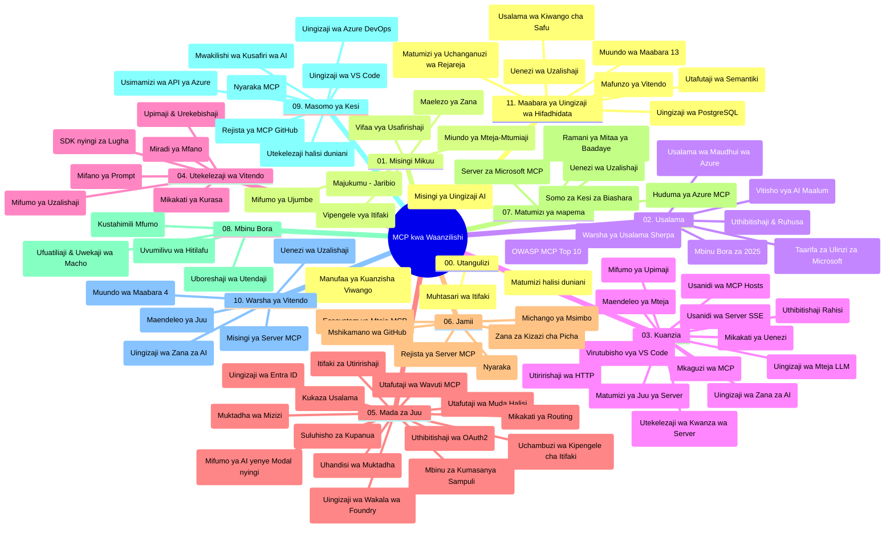

# Itifaki ya Muktadha wa Mfano (MCP) kwa Waanzishaji - Mwongozo wa Kujifunza

Mwongozo huu wa kujifunza unatoa muhtasari wa muundo na yaliyomo kwenye hazina ya "Model Context Protocol (MCP) for Beginners". Tumia mwongozo huu kuvinjari hazina kwa ufanisi na kufaidika zaidi na rasilimali zilizopo.

## Muhtasari wa Hazina

Model Context Protocol (MCP) ni mfumo uliosanifiwa kwa maingiliano kati ya mifano ya AI na programu za wateja. Asili ilizaliwa na Anthropic, MCP sasa inasimamiwa na jamii pana ya MCP kupitia shirika rasmi la GitHub. Hazina hii hutoa mtaala mpana wenye mifano ya vitendo ya nambari katika C#, Java, JavaScript, Python, na TypeScript, iliyoundwa kwa waendelezaji wa AI, wahandisi wa mifumo, na wahandisi wa programu.

## Ramani ya Mtaala wa Kuonyesha

## Muundo wa Hazina

Hazina imepangwa katika sehemu kumi na moja kuu, kila moja ikilenga nyanja tofauti za MCP:

1. **Utangulizi (00-Introduction/)**
   - Muhtasari wa Itifaki ya Muktadha wa Mfano
   - Kwa nini kusanifisha ni muhimu katika nyaya za AI
   - Matumizi halisi na manufaa

2. **Madharia Muhimu (01-CoreConcepts/)**
   - Miundo ya mteja-seva
   - Vipengele muhimu vya itifaki
   - Mifumo ya ujumbe ndani ya MCP

3. **Usalama (02-Security/)**
   - Vitisho vya usalama katika mifumo ya MCP
   - Mazoezi bora ya usalama katika utekelezaji
   - Mikakati ya uthibitishaji na ruhusa
   - **Nyaraka Kamili za Usalama**:
     - Mazoezi Bora ya Usalama ya MCP 2025
     - Mwongozo wa Utekelezaji wa Usalama wa Azure Content
     - Udhibiti na Mbinu za Usalama za MCP
     - Marejeleo ya Haraka ya Mazoezi Bora ya MCP
   - **Mada Muhimu za Usalama**:
     - Mashambulizi ya sindano za maelekezo na sumu za zana
     - Uvujaji wa vikao na matatizo ya mbunifu aliyochanganyikiwa
     - Udhaifu wa ufikiaji wa tokeni
     - Uruhusa kupita kiasi na udhibiti wa upatikanaji
     - Usalama wa mnyororo wa usambazaji wa vipengele vya AI
     - Uunganishaji wa Microsoft Prompt Shields

4. **Anza Kutumia (03-GettingStarted/)**
   - Usanidi wa mazingira na mipangilio
   - Kuunda seva na wateja wa MCP wa msingi
   - Uunganisho na programu zilizopo
   - Inajumuisha sehemu za:
     - Utekelezaji wa seva ya kwanza
     - Maendeleo ya mteja
     - Uunganisho wa mteja wa LLM
     - Uunganisho wa VS Code
     - Seva ya Matukio ya Server-Sent (SSE)
     - Matumizi ya seva ya juu
     - Upeperushaji wa HTTP
     - Uunganisho wa AI Toolkit
     - Mikakati ya majaribio
     - Mwongozo wa usambazaji

5. **Utekelezaji wa Kivitendo (04-PracticalImplementation/)**
   - Kutumia SDK katika lugha tofauti za programu
   - Mbinu za kubaini hitilafu, kufanya majaribio, na kuthibitisha
   - Kutengeneza templeti na mtiririko wa kazi unaoweza kutumika tena
   - Miradi ya mfano na mifano ya utekelezaji

6. **Mada za Juu (05-AdvancedTopics/)**
   - Mbinu za uhandisi wa muktadha
   - Uunganisho wa wakala Foundry
   - Mtiririko wa kazi wa AI wa aina nyingi
   - Demo za uthibitishaji OAuth2
   - Uwezo wa utafutaji wa papo hapo
   - Upeperushaji wa papo hapo
   - Utekelezaji wa muktadha mzizi
   - Mikakati ya utumaji data
   - Mbinu za sampuli
   - Mbinu za upanaji
   - Mambo ya usalama
   - Uunganisho wa usalama wa Entra ID
   - Uunganisho wa utafutaji wa wavuti

7. **Michango ya Jumuiya (06-CommunityContributions/)**
   - Jinsi ya kuchangia nambari na nyaraka
   - Ushirikiano kupitia GitHub
   - Maboresho na maoni yanayotokana na jamii
   - Kutumia wateja mbalimbali wa MCP (Claude Desktop, Cline, VSCode)
   - Kufanya kazi na seva maarufu za MCP zikiwemo za usindikaji picha

8. **Mafunzo kutoka kwa Matumizi ya Mapema (07-LessonsfromEarlyAdoption/)**
   - Utekelezaji wa ulimwengu halisi na hadithi za mafanikio
   - Kujenga na kusambaza suluhisho za MCP
   - Mwelekeo na ramani ya mustakabali
   - **Mwongozo wa Seva za Microsoft MCP**: Mwongozo kamili wa seva 10 za MCP za Microsoft tayari kutoa huduma, zikiwemo:
     - Seva ya Microsoft Learn Docs MCP
     - Seva ya Azure MCP (viunganishi maalum 15+)
     - Seva ya GitHub MCP
     - Seva ya Azure DevOps MCP
     - Seva ya MarkItDown MCP
     - Seva ya SQL Server MCP
     - Seva ya Playwright MCP
     - Seva ya Dev Box MCP
     - Seva ya Azure AI Foundry MCP
     - Seva ya Microsoft 365 Agents Toolkit MCP

9. **Mazoezi Bora (08-BestPractices/)**
   - Kusahihisha utendaji na kuboresha
   - Kubuni mifumo ya MCP isiyovunjika
   - Mikakati ya kujaribu na uimara

10. **Somo za Kesi (09-CaseStudy/)**
    - **Somo saba za kesi kamili** zinazoonyesha utofauti wa MCP katika hali tofauti:
    - **Wakala wa Usafiri wa Azure AI**: Usimamizi wa nguvu nyingi na Azure OpenAI na AI Search
    - **Uunganisho wa Azure DevOps**: Kuendesha taratibu za mitiririko kazi kwa sasisho za data ya YouTube
    - **Uchapaji Hati wa Wakati Halisi**: Mteja wa Python wa console na upeperushaji wa HTTP
    - **Kizalishaji cha Mpango wa Masomo wa Mshirikiano**: Programu ya wavuti ya Chainlit yenye AI ya mazungumzo
    - **Nyaraka Zaidi ya Mhariri**: Uunganisho wa VS Code na mitiririko ya kazi ya GitHub Copilot
    - **Usimamizi wa Azure API**: Uunganisho wa API ya kampuni na uundaji seva ya MCP
    - **Sajili ya MCP ya GitHub**: Maendeleo ya mazingira na jukwaa la uunganisho la wakala
    - Mifano ya utekelezaji inayoanzia uunganisho wa kampuni, tija ya waendelezaji, na maendeleo ya mazingira

11. **Warsha ya Vitendo (10-StreamliningAIWorkflowsBuildingAnMCPServerWithAIToolkit/)**
    - Warsha ya vitendo pana inayochanganya MCP na AI Toolkit
    - Kujenga programu za akili zinazounganisha mifano ya AI na zana za dunia halisi
    - Moduli za vitendo zinazojumuisha misingi, maendeleo ya seva maalum, na mikakati ya usambazaji wa uzalishaji
    - **Muundo wa Kiwanda**:
      - Kiwanda 1: Misingi ya Seva ya MCP
      - Kiwanda 2: Maendeleo ya Sevabuya ya MCP
      - Kiwanda 3: Uunganisho wa AI Toolkit
      - Kiwanda 4: Usambazaji wa Uzalishaji na Upanuzi
    - Njia ya kujifunza kwa vitendo yenye maelekezo hatua kwa hatua

12. **Maabara za Uunganisho wa Hifadhidata za Seva ya MCP (11-MCPServerHandsOnLabs/)**
    - **Njia ya kujifunza ya maabara 13 kamili** ya kujenga seva za MCP tayari kuzalisha uzalishaji na uunganisho wa PostgreSQL
    - **Utekelezaji halisi wa uchambuzi wa rejareja** kwa kutumia kesi ya matumizi ya Zava Retail
    - **Mifumo ya kiwango cha kampuni** ikiwa ni pamoja na Usalama wa Kiwango cha Safu (RLS), utafutaji wa maana, na upatikanaji wa data wa wapangaji wengi
    - **Muundo Kamili wa Maabara**:
      - **Maabara 00-03: Msingi** - Utangulizi, Mimarisho, Usalama, Usanidi wa Mazingira
      - **Maabara 04-06: Ujenzi wa Seva ya MCP** - Ubuni wa Hifadhidata, Utekelezaji wa Seva ya MCP, Uendelezaji wa Zana
      - **Maabara 07-09: Vipengele vya Juu** - Utafutaji wa Maana, Majaribio & Uwagiliaji Hitilafu, Uunganisho wa VS Code
      - **Maabara 10-12: Uzalishaji & Mazoezi Bora** - Usambazaji, Ufuatiliaji, Uboreshaji
    - **Teknolojia Zinazoshughulikiwa**: Mfumo wa FastMCP, PostgreSQL, Azure OpenAI, Azure Container Apps, Application Insights
    - **Matokeo ya Kujifunza**: seva za MCP tayari uzalishaji, mifumo ya uunganisho wa hifadhidata, uchambuzi unaoendeshwa na AI, usalama wa kampuni

## Rasilimali Zaidi

Hazina ina rasilimali za kusaidia:

- **Folda ya Picha**: Inajumuisha michoro na maelezo yanayotumika katika mtaala mzima
- **Tafsiri**: Usaidizi wa lugha nyingi na tafsiri za moja kwa moja za nyaraka
- **Rasilimali Rasmi za MCP**:
  - [Nyaraka za MCP](https://modelcontextprotocol.io/)
  - [Maelekezo ya MCP](https://spec.modelcontextprotocol.io/)
  - [Hazina ya MCP GitHub](https://github.com/modelcontextprotocol)

## Jinsi ya Kutumia Hazina Hii

1. **Kujifunza kwa Mfuatano**: Fuata sura kwa mpangilio (00 hadi 11) kwa uzoefu wa kujifunza uliopangwa.
2. **Kuzingatia Lugha Fulani**: Kama unavutiwa na lugha fulani ya programu, chunguza folda za mifano kwa utekelezaji katika lugha unayopendelea.
3. **Utekelezaji wa Kivitendo**: Anza na sehemu ya "Getting Started" kusanidi mazingira yako na kuunda seva na mteja wako wa MCP wa kwanza.
4. **Uchunguzi wa Juu**: Ukipata uelewa wa misingi, ingia katika mada za juu ili kupanua maarifa yako.
5. **Ushirikiano wa Jamii**: Jiunge na jamii ya MCP kupitia majadiliano ya GitHub na channels za Discord kuungana na wataalamu na waendelezaji wenzako.

## Wateja na Zana za MCP

Mtaala unahusisha wateja na zana mbalimbali za MCP:

1. **Wateja Rasmi**:
   - Visual Studio Code 
   - MCP katika Visual Studio Code
   - Claude Desktop
   - Claude katika VSCode 
   - Claude API

2. **Wateja wa Jamii**:
   - Cline (kielekezi cha terminal)
   - Cursor (mhariri wa nambari)
   - ChatMCP
   - Windsurf

3. **Zana za Usimamizi wa MCP**:
   - MCP CLI
   - MCP Manager
   - MCP Linker
   - MCP Router

## Seva Maarufu za MCP

Hazina inaanzisha seva mbalimbali za MCP, zikiwemo:

1. **Seva Rasmi za Microsoft MCP**:
   - Seva ya Microsoft Learn Docs MCP
   - Seva ya Azure MCP (viunganishi maalum 15+)
   - Seva ya GitHub MCP
   - Seva ya Azure DevOps MCP
   - Seva ya MarkItDown MCP
   - Seva ya SQL Server MCP
   - Seva ya Playwright MCP
   - Seva ya Dev Box MCP
   - Seva ya Azure AI Foundry MCP
   - Seva ya Microsoft 365 Agents Toolkit MCP

2. **Seva za Marejeleo Rasmi**:
   - Filesystem
   - Fetch
   - Memory
   - Sequential Thinking

3. **Uundaji Picha**:
   - Azure OpenAI DALL-E 3
   - Stable Diffusion WebUI
   - Replicate

4. **Zana za Maendeleo**:
   - Git MCP
   - Terminal Control
   - Code Assistant

5. **Seva Maalum**:
   - Salesforce
   - Microsoft Teams
   - Jira & Confluence

## Kuchangia

Hazina hii inakaribisha michango kutoka kwa jamii. Angalia sehemu ya Michango ya Jamii kwa mwongozo wa jinsi ya kuchangia kwa ufanisi katika mazingira ya MCP.

----

*Mwongozo huu wa kujifunza ulisasishwa mwisho tarehe 5 Februari 2026, ukiakisi Maelekezo ya MCP ya hivi karibuni 2025-11-25 na kutoa muhtasari wa hazina hadi tarehe hiyo. Yaliyomo katika hazina yanaweza kusasishwa baada ya tarehe hii.*

---

<!-- CO-OP TRANSLATOR DISCLAIMER START -->
**Taarifa ya Kutolewa Hukumu**:
Hati hii imetafsiriwa kwa kutumia huduma ya tafsiri ya AI [Co-op Translator](https://github.com/Azure/co-op-translator). Ingawa tunajitahidi kuhakikisha usahihi, tafadhali fahamu kuwa tafsiri za moja kwa moja zinaweza kuwa na makosa au upungufu wa usahihi. Hati ya asili katika lugha yake halisi inapaswa kuchukuliwa kama chanzo cha mamlaka. Kwa taarifa muhimu, tafsiri ya kitaalamu ya binadamu inapendekezwa. Hatubebei jukumu kwa kutoelewana au tafsiri potofu zinazotokana na matumizi ya tafsiri hii.
<!-- CO-OP TRANSLATOR DISCLAIMER END -->