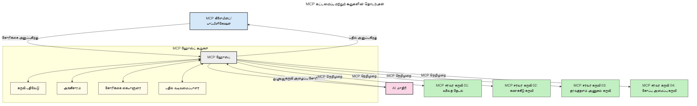
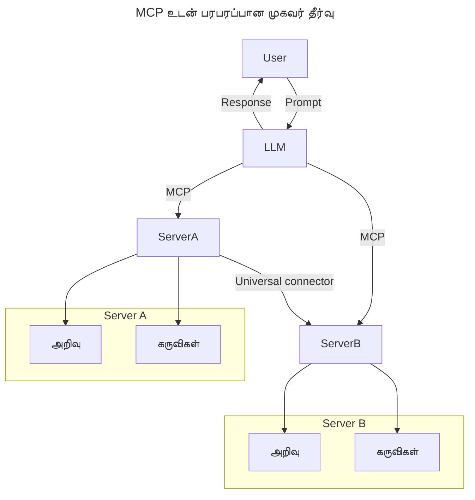
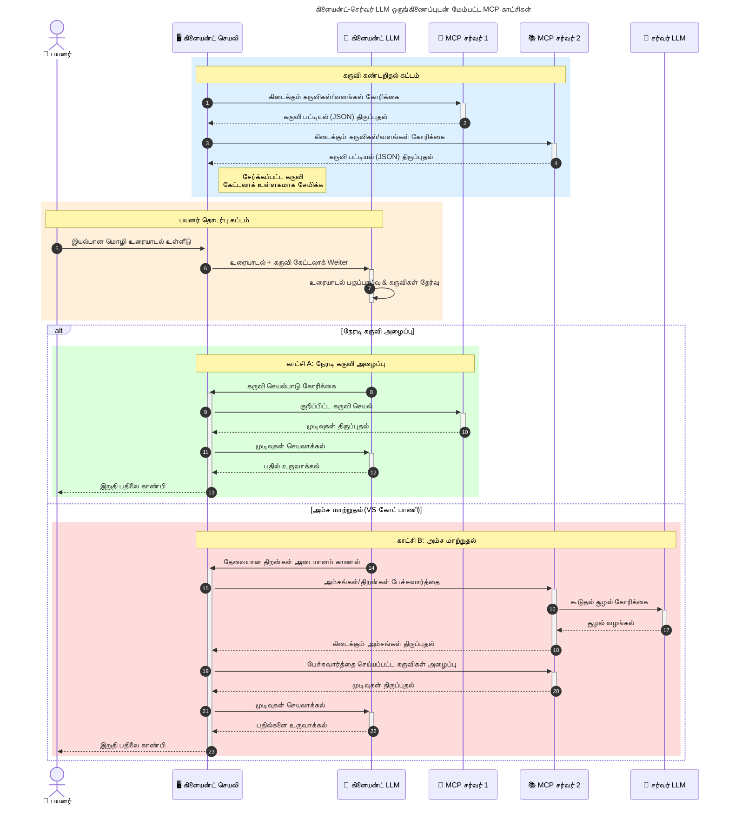

# மாடல் சூழல் நெறிமுறை (MCP) அறிமுகம்: பரிமாண உதவியுள்ள AI பயன்பாடுகளுக்கு ஏன் முக்கியம்?

_(இந்த பாடத்தின் காணொளியை பார்க்க மேல் உள்ள படத்தை அழுத்தவும்)_

உருவாக்கும் AI பயன்பாடுகள் ஒரு பெரிய முன்னேற்றமாகும், ஏனெனில் அவை பெரும்பாலும் பயனர்களுக்கு இயல்பான மொழி உத்தரவுகள் மூலம் செயலியில் தொடர்புகொள்ள அனுமதிக்கின்றன. இருப்பினும், இப்படியான செயலிகளில் அதிக நேரமும் வளமும் செலவு செய்யும்போது, அதனை எளிதில் விரிவாக்குவதற்கு, பல மாடல்கள் பயன்படுத்தப்படக்கூடிய வகையில், மற்றும் மாடலின் பல்வேறு சிக்கல்களை கையாளக்கூடிய வகையில் செயலியை ஒருங்கிணைக்க முடியும் என்பதில் உறுதி பெறவேண்டும். சுருக்கமாகச் சொல்வதானால், உருவாக்கும் AI செயலிகளை தொடங்குவது எளிது, ஆனால் அவை வளர்ந்து, சிக்கலானதாகியாகும்போது, ஒரு கட்டமைப்பை வரையறுக்கத் தொடங்க வேண்டும் மற்றும் உங்கள் செயலிகள் ஒரே விதமான முறையில் கட்டப்பட உறுதி செய்ய ஒரு தரநிலையைப் பொறுத்திருப்பது அவசியம். இதுவே MCP அமைப்பு பொருத்தப்படுகிறது மற்றும் தரநிலையை வழங்குகிறது.

---

## **🔍 மாடல் சூழல் நெறிமுறை (MCP) என்றால் என்ன?**

**மாடல் சூழல் நெறிமுறை (MCP)** என்பது **பெரிய மொழி மாதிரிகள் (LLMs)** வெளிப்புற கருவிகள், APIகள் மற்றும் தரவுப் பொருட்களுடன் பிரசவமில்லாமல் தொடர்பு கொள்ள அனுமதிக்கும் **திறந்த, தரநிலைபடுத்தப்பட்ட இடைமுகம்** ஆகும். இது AI மாதிரியின் பயிற்சி தரவு அப்பால் செயல்பாட்டை மேம்படுத்த ஒரே மாதிரியாக அமைப்பைக் கொண்டுவரும், புத்திசாலி, பரிமாணமான, மற்றும் அதிக பதில் அளிக்கும் AI அமைப்புகளை உருவாக்க உதவுகிறது.

---

## **🎯 AIலுள்ள தரநிலைப்படுத்தல் ஏன் முக்கியம்?**

உருவாக்கும் AI பயன்பாடுகள் சிக்கலானதாகும்போது, **பரிமாணக்கூடிய தன்மை, விரிவாக்கக்கூடிய தன்மை, பராமரிக்கக்கூடிய தன்மை,** மற்றும் **வெளியீட்டு இயங்கு கட்டுப்பாடு தவிர்ப்பது** போன்றவற்றை உறுதி செய்யும் தரநிலைகளை ஏற்றுக்கொள்ளுதல் அவசியமாகிறது. MCP பின்வருவனவற்றை செய்யும்:

- மாடல்-கருவி ஒருங்கிணைப்புகளை ஒன்றாக்குதல்
- அதிகாரமற்ற, தனிப்பயன் தீர்வுகளை குறைத்தல்
- பல்வேறு வழங்குநர்களிடமிருந்து பல மாடல்களை ஒரே சூழலில் coexist செய்ய அனுமதித்தல்

**குறிப்பு:** MCP தன்னை ஒரு திறந்த தரநிலை எனப் பொருள்படுத்தினாலும், IEEE, IETF, W3C, ISO போன்ற ஏதேனும் தரநிலை அமைப்புகளால் MCPயை தரநிலைப்படுத்தும் திட்டங்கள் இல்லை.

---

## **📚 கற்க தனிக்குறிக்கோள்கள்**

இந்த கட்டுரையின் முடிவில், நீங்கள் செய்யக்கூடியவை:

- **மாடல் சூழல் நெறிமுறை (MCP)** மற்றும் அதன் பயன்பாடுகளை வரையறுத்தல்
- MCP எவ்வாறு மாடல்-கருவி தொடர்பை தரநிலைப்படுத்துகிறது என்பதை புரிந்துகொள்வது
- MCP கட்டமைப்பின் முக்கிய கூறுகளை அடையாளம் காண்தல்
- MCP யின் வணிக மற்றும் மேம்பாட்டு சூழல்களில் ஆராய்ச்சி

---

## **💡 மாடல் சூழல் நெறிமுறை (MCP) விளையாட்டைக் மாற்றுபவர்**

### **🔗 MCP அறிவுத்திறன் தொடர்புகளில் பிரிவினையை தீர்க்கிறது**

MCPக்கு முன்னர், மாடல்களுடன் கருவிகளை ஒருங்கிணைப்பது குறித்த செயலிகள் வேண்டும்:

- கருவி-மாடல் ஒவ்வொருக்காக தனிப்பயன் குறியீடு
- ஒவ்வொரு வழங்குநருக்கும் முறையான APIகள் இல்லை
- புதுப்பிப்புகள் காரணமாக அடிக்கடி முறியடிப்பு
- மேலும் கருவிகள் சேர்க்கும் போது பரிமாணம் குறைவு

### **✅ MCP தரநிலையின் நன்மைகள்**

| **நன்மை**              | **விளக்கம்**                                                               |
|------------------------|-----------------------------------------------------------------------------|
| ஒருங்கிணைப்பு          | LLMகள் பல வழங்குநர்களின் கருவிகளுடன் பிரச்சனையில்லாமல் பணியாற்றுவார்கள்     |
| ஒரே மாதிரிமான நடைமுறை | தளங்களும் கருவிகளும் ஒன்றும் ஒழுங்காக நடத்தும்                              |
| மீண்டும் பயன்பாடு         | ஒருமுறை உருவாக்கப்பட்ட கருவிகள் பல திட்டங்களிலும் பயன்படுத்தக்கூடியவை         |
| விரைவான மேம்பாடு         | தரநிலைபடுத்தப்பட்ட, பிளக்-ஆன்-ப்ளே வகை இடைமுகங்களால் வளர்ச்சி நேரம் குறைப்பு |

---

## **🧱 MCP உச்ச மட்ட கட்டமைப்பின் முன்னோட்டம்**

MCP ஒரு **வாடிக்கையாளர்-சேவையாளர் மாதிரி** பின்பற்றுகிறது, இதில்:

- **MCP ஹோஸ்ட்கள்** AI மாடல்களை ஓட்டுகின்றன
- **MCP வாடிக்கையாளர்கள்** கோரிக்கைகளை தொடங்குகின்றனர்
- **MCP சேவையகங்கள்** சூழல், கருவிகள் மற்றும் திறன்களை வழங்குகின்றன

### **முக்கிய கூறுகள்:**

- **வளங்கள்** – மாதிரிகளுக்கான நிலையான அல்லது இயக்க динамиகான தரவு  
- **உத்தரவாதங்கள்** – வழிகாட்டிய உருவாக்கத்துக்கான முன்கூட்டிய பணி வழிகள்  
- **கருவிகள்** – தேடல், கணக்கீட்டுகள் போன்ற செயல்பாடுகள்  
- ** மாதிரிமானத் தேர்வு ** – மீண்டும் மீண்டும் தொடர்பு கொண்டு செயற்படும் முகாமுத்தன்மை
- **பிரேரणा** – பயனர் உள்ளீட்டிற்கு சேவையகமாக தொடங்கி கோரிகைகள்
- **ரூட்ஸ்** – சேவையக அணுகல் கட்டுப்பாட்டிற்கான கோப்புறைக் காண்கைகள்

### **நெறிமுறை கட்டமைப்பு:**

MCP இரண்டு அடுக்கு கட்டமைப்பைப் பயன்படுத்துகிறது:
- **தரவு அடுக்கு**: JSON-RPC 2.0 அடிப்படையிலான தொடர்பு, வாழ்க்கை சுழற்சி மேலாண்மை மற்றும் அடிப்படைகள்
- **ஊடுருவல் அடுக்கு**: STDIO (உள்ளூரில்) மற்றும் Streamable HTTP உடன் SSE (தொலை) தொடர்பு வழிகள்

---

## MCP சேவையகங்கள் எப்படி வேலை செய்கின்றன

MCP சேவையகங்கள் பின்வருவதாக செயல்படுகின்றன:

- **கோரிக்கை ஆன்மம்**:
    1. இறுதி பயனர் அல்லது அவன் சார்பில் செயல்படும் மென்பொருள் கோரிக்கையை தொடங்குகிறது.
    2. **MCP வாடிக்கையாளர்** கோரிக்கையை **MCP ஹோஸ்ட்**-க்கு அனுப்புகிறது, இது AI மாடல் இயங்குநிலையை நிர்வகிக்கிறது.
    3. **AI மாடல்** பயனர் உத்தரவை பெறுகிறது, மற்றும் ஒரு அல்லது அதற்கு மேற்பட்ட கருவி அழைப்புகளின் மூலம் வெளிப்புற கருவிகள் அல்லது தரவுகளுக்கு அணுகலை கோர்கிறதாம்.
    4. **MCP ஹோஸ்ட்**, நேரடியாக மாடல் அல்ல, தரநிலைப்படுத்திய நெறிமுறையைப் பயன்படுத்தி தொடர்புடைய **MCP சேவையகம்(கள்)** உடன் தொடர்பு கொள்ளும்.
- **MCP ஹோஸ்ட் செயல்பாடுகள்**:
    - **கருவி பதிவேடு**: கிடைக்கும் கருவிகள் மற்றும் அவற்றின் திறன்களைப் பதிவு செய்கிறது.
    - **அங்கீகாரம்**: கருவி அணுகல் அனுமதிகளை சரிபார்க்கிறது.
    - **கோரிக்கை கையாளி**: மாடலின் கோரிக்கைகளை செயலாக்குகிறது.
    - **பதில்வழக்கு**: கருவி வெளியீடுகளை மாடல் புரிந்துகொள்ளக்கூடிய வடிவில் அமைக்கும்.
- **MCP சேவையக செயல்பாடு**:
    - **MCP ஹோஸ்ட்** கருவி அழைப்புகளை ஒன்றிற்கு மேற்பட்ட **MCP சேவையகம்(கள்)**க்கு வழிநடத்துகிறது, ஒவ்வொன்றும் தொழிற்பாடுகளை (தேடல், கணக்கீடு, தரவுத்தளம் விசாரணைகள்) வழங்குகிறது.
    - **MCP சேவையகம்(கள்)** தங்களது செயல்பாடுகளை நிறைவேற்றி **MCP ஹோஸ்ட்**க்கு முடிவுகளை ஒரே மாதிரியாக திருப்பி அனுப்புகிறது.
    - **MCP ஹோஸ்ட்** இந்த முடிவுகளை வடிவமைத்து **AI மாடல்**க்கு அனுப்புகிறது.
- **பதில் முடிவு**:
    - **AI மாடல்** கருவி வெளியீடுகளை இறுதி பதிலில் சேர்க்கிறது.
    - **MCP ஹோஸ்ட்** அந்த பதிலை **MCP வாடிக்கையாளர்**க்கு அனுப்புகிறது, அது இறுதி பயனர் அல்லது அழைக்கும் மென்பொருளுக்கு வழங்குகிறது.

    

## 👨‍💻 MCP சேவையகத்தை எவ்வாறு உருவாக்குவது (உதाहरणங்களுடன்)

MCP சேவையகங்கள் LLM திறன்களை தரவையும் செயல்பாடுகளையும் வழங்குவதன் மூலம் விரிவாக்க உதவுகின்றன.

செயல்படுத்த தயாரா? கீழ்காணும் மொழி மற்றும்/அல்லது ஸ்டாக்-பாரம்பரிய SDKகளுடன் வேறுபட்ட மொழி/ஸ்டாக்களில் எளிய MCP சேவையகங்களை உருவாக்குவதற்கான உதாரணங்களும்:

- **Python SDK**: https://github.com/modelcontextprotocol/python-sdk

- **TypeScript SDK**: https://github.com/modelcontextprotocol/typescript-sdk

- **Java SDK**: https://github.com/modelcontextprotocol/java-sdk

- **C#/.NET SDK**: https://github.com/modelcontextprotocol/csharp-sdk

## 🌍 MCPயின் உண்மையான உலக பயன்பாடுகள்

MCP AI திறன்களை விரிவாக்கி பலவகையான பயன்பாடுகளை இயக்குகிறது:

| **பயன்பாடு**              | **விளக்கம்**                                                                |
|--------------------------|------------------------------------------------------------------------------|
| வணிக தரவு ஒருங்கிணைப்பு  | LLMகளை தரவுத்தளங்கள், CRMகள் அல்லது உள் கருவிகளுடன் இணைக்கவும்             |
| முகாமுத்த AI அமைப்புகள்  | கருவி அணுகல் மற்றும் முடிவெடுக்கும் பணிவழிகள் கொண்ட சுயஆதிக்கை முகவர்கள்    |
| பன்முறை செயலிகள்       | உரை, படங்கள் மற்றும் ஒலி கருவிகளை ஒன்றாக கூடிய AI செயலியில் சேர்க்கவும்   |
| நேரடி தரவு ஒருங்கிணைப்பு | AI தொடர்புகளில் நேரடித் தரவை கொண்டு வாரியான, தற்போதைய வெளியீடுகளை தருதல்    |

### 🧠 MCP = AI தொடர்புகளுக்கான பல்நாடக தரநிலை

மாடல் சூழல் நெறிமுறை MCP ஆனது, USB-C சாதனங்களுக்கான புள்ளி இணைப்புகளை தரநிலைப்படுத்தியவாறு, AI தொடர்புகளுக்கான ஒரு பல்நாடக தரநிலையாக செயல்படுகிறது. AI உலகத்தில், MCP ஒரு ஒரே மாதிரித்திட்ட இடைமுகத்தை வழங்குகிறது, இது மாடல்கள் (வாடிக்கையாளர்கள்) வெளிப்புற கருவிகள் மற்றும் தரவு வழங்குநர்கள் (சேவையகங்கள்) உடன் பிரச்சனையில்லாமல் இணைப்பதற்கு உதவுகிறது. இது ஒவ்வொரு API அல்லது தரவு மூலத்திற்கான வேறுபட்ட தனிப்பயன் நெறிமுறைகளின் தேவை இல்லாமல் ஆக்கியது.

MCPக்கு உட்பட்ட MCP-உரிய கருவி (MCP சேவையகம் என அழைக்கப்படுகிறது) ஒன்றிய தரநிலையை பின்பற்றுகிறது. இந்த சேவையகங்கள் தங்களின் கருவிகள் அல்லது செயல்பாடுகளை பட்டியலிட முடியும், மற்றும் AI முகவர் கோரும்போது அந்த செயல்பாடுகளை நிறைவேற்றும். MCP ஆதரவு கொண்ட AI முகவர் தளங்கள் சேவையகங்களின் கிடைக்கும் கருவிகளை கண்டறிந்து, இந்த தரநிலை நெறிமுறையால் அவற்றை அழைக்க முடியும்.

### 💡 அறிவு அணுகலை எளிதாக்குதல்

கருவிகளை வழங்குவதிற்கு அப்பால் MCP அறிவு அணுகலும் எளிதாக்குகிறது. இது செயலிகளுக்கு பெரிய மொழி மாதிரிகளுக்கு (LLMs) சூழலை வழங்குவதில் உதவுகிறது, அவற்றை பல தரவு மூலங்களுடன் இணைத்துக் கொள்கிறது. உதாரணமாக, MCP சேவையகம் ஒரு நிறுவனத்தின் ஆவணக் களஞ்சியத்தை பிரதிநிதித்துவப்படுத்தி, முகவர்களுக்கு தேவையான தகவலை தேட உதவலாம். மற்றொரு சேவையகம் குறிப்பிட்ட செயல்பாடுகளை எக்சியூட் செய்தல், மின்னஞ்சல் அனுப்புதல் அல்லது பதிவுகளை புதுப்பித்தல் போன்றவற்றை மேற்கொள்ளலாம். முகவரின் பார்வையில், இவை வெறும் கருவிகள்; சில கருவிகள் தரவுகளை (அறிவு சூழல்) தருகின்றன, மற்றவை செயற்பாடுகளை செய்கின்றன. MCP இரண்டையும் திறம்பட நிர்வகிக்கிறது.

ஒரு முகவர் MCP சேவையகத்துடன் இணைந்தவுடன், சேவையகத்தின் கிடைக்கும் திறன்களையும் அணுகக்கூடிய தரவுகளையும் தரநிலையான வடிவத்தில் தானாக கற்றுக்கொள்கிறது. இந்த தரநிலைப்படுத்தல் கருவி கிடைக்கும் தன்மையை மாறுதலுக்கு உட்படச் செய்கிறது. உதாரணமாக, ஒரு புதிய MCP சேவையகத்தை முகவரின் அமைப்பில் சேர்த்தவுடன், அதன் செயல்பாடுகள் உடனடியாக பயன்படுத்தக்கூடியவை ஆகின்றன, மேலும் முகவரின் கையேடுகளை மாற்ற தேவையில்லை.

இது பரிமாற்றம் ஓர் வரைபடத்தில் காணப்படும், சேவையகங்கள் கருவிகளையும் அறிவையும் வழங்கி அமைப்புகளுக்கு இடையேயான ஒத்துழைப்பை உறுதி செய்கின்றன.

### 👉 உதாரணம்: பரிமாண முகவர் தீர்வு

பல MCP சேவையகங்கள் ஒன்றுக்கொருவர் தொடர்புகொண்டு திறன்களை பகிர்ந்து கொள்ளும் இலக்கண இணைப்பை Universal Connector வழங்குகிறது, இது ServerA சேவையகம் ServerBக்கு பணி ஒதுக்கவோ அல்லது அதன் கருவிகள் மற்றும் அறிவை அணுகவோ உதவுகிறது. இது சேவையகங்கள் முழுவதும் கருவி மற்றும் தரவுகளை பிரித்து பரிமாற்றும், பரிமாண அதிமுக மற்றும் அமைப்பு முகவர் கட்டமைப்புகளை ஊக்குவிக்கிறது. MCP கருவி வெளிப்பாட்டை தரநிலைப்படுத்துவதால், முகவர்கள் இறுக்கமாக நிரல் இணைப்புகளைப்பொறுத்தாமல் சேவையகங்களிடையே கோரிக்கைகளை இயல்பான முறையில் கண்டுபிடித்து வழிநடத்த முடியும்.

கருவி மற்றும் அறிவு பகிர்வு: கருவிகள் மற்றும் தரவுகள் சேவையகங்களுக்கு மேல் அணுகலாம், மேலும் பரிமாணமிக்க மற்றும் மனப்பான்மையுள்ள முகவர் கட்டமைப்புகளை ஊக்கம் அளிக்கிறது.

### 🔄 வாடிக்கையாளர்-பக்கம் LLM ஒருங்கிணைப்புடன் மேம்பட்ட MCP சூழல்கள்

அடிப்படையான MCP கட்டமைப்புக்கு அப்பால், வாடிக்கையாளர் மற்றும் சேவையக இரண்டிலும் LLMகளுடன் மேலும் கல்வெட்டு தொடர்புக்கள் உள்ள சூழல்கள் பலவாக இருக்கின்றன. அடுத்த வரைபடத்தில், **வாடிக்கையாளர் செயலி** எளிதில் பல MCP கருவிகளுடன் IDE ஆக இருக்கலாம், LLM வழியாக பயனரால் பயன்படுத்தப்படும்:

## 🔐 MCPயின் பயனுள்ள நன்மைகள்

MCP பயன்படுத்துவதன் சில நடைமுறை நன்மைகள்:

- **புதியதைச் சேர்க்கும் திறன்**: மாதிரிகள் தங்கள் பயிற்சி தரவை கடந்து புதிய தகவல்களைப் பெற முடியும்
- **திறன் விரிவாக்கம்**: பயிற்சி பெறாத பணி கருவிகளை மாதிரிகள் பயன்படுத்த முடியும்
- **கற்பனை குறைப்பு**: வெளிப்புற தரவு மூலங்கள் உண்மைத்தன்மையை உறுதி செய்கின்றன
- **தனித்துவம்**: உணர்வு தரவு பாதுகாப்புள்ள சூழலில் இருக்கும், உத்தரவுகளில் சேர்க்கப்படாமல்

## 📌 முக்கியக் கருத்துக்கள்

MCP பயன்படுத்தும் போது முக்கியமானவை:

- **MCP** AI மாதிரிகள் கருவிகள் மற்றும் தரவுடன் தொடர்பை தரநிலைப்படுத்துகிறது
- விரிவாக்கம், ஒத்திசைவு மற்றும் ஒருங்கிணைவு ஆகியவற்றை ஊக்குவிக்கிறது
- MCP மேம்பாட்டு நேரத்தை குறைக்க, நம்பகத்தன்மையை மேம்படுத்த மற்றும் மாதிரியின் திறன்களை விரிவாக்க உதவுகிறது
- வாடிக்கையாளர்-சேவையக கட்டமைப்பு நெகிழ்வான, விரிவாக்கக்கூடிய AI செயலிகளை இயக்கு

## 🧠 பயிற்சி

நீங்கள் விரும்பும் ஒரு AI பயன்பாட்டை பற்றி சிந்திக்கவும்.

- எந்த **வெளிப்புற கருவிகள் அல்லது தரவுகள்** அதன் திறன்களை மேம்படுத்த முடியும்?
- MCP ஒருங்கிணைப்பை எப்படிச் செயல்முறை எளிதாக்கும் மற்றும் நம்பகமானதாக மாற்றும்?

## கூடுதல் ஆதாரங்கள்

- [MCP GitHub ஹாசகம்](https://github.com/modelcontextprotocol)

## அடுத்தது

அடுத்து: [அத்தியாயம் 1: முதன்மை கருத்துக்கள்](../01-CoreConcepts/README.md)

---

<!-- CO-OP TRANSLATOR DISCLAIMER START -->
**கவனித்தல்**:
இந்த ஆவணம் [Co-op Translator](https://github.com/Azure/co-op-translator) என்ற AI மொழிபெயர்ப்புச் சேவையை பயன்படுத்தி மொழிபெயர்க்கப்பட்டுள்ளது. எங்களது முயற்சிகள் மிகக்கூடிய துல்லியத்துக்காக olsa கூட, தானியங்கி மொழிபெயர்ப்புகளில் பிழைகள் அல்லது தவறுகள் இருக்க வாய்ப்புள்ளது என்பதை தயவுசெய்து கருத்தில் கொள்ளவும். மூல ஆவணத்தை அதன் அதன் சொந்த மொழியில் அங்கீகாரம் பெற்ற ஆதாரமாகக் கொள்ள வேண்டும். முக்கியமான தகவல்களுக்காக, தொழில்நுட்ப மனித மொழிபெயர்ப்பாளர்களின் சேவையைப் பெறுவதுகேற்ப ұсыныப்படுகிறது. இந்த மொழிபெயர்ப்பின் பயன்பாட்டினால் ஏற்படக் கூடிய ஏதேனும் தவறான புரிதல்கள் அல்லது புரிதலுக்கேற்ப மாறுபாடுகளுக்கு நாம் பொறுப்பு ஏற்றுக் கொள்ளமாட்டோம்.
<!-- CO-OP TRANSLATOR DISCLAIMER END -->