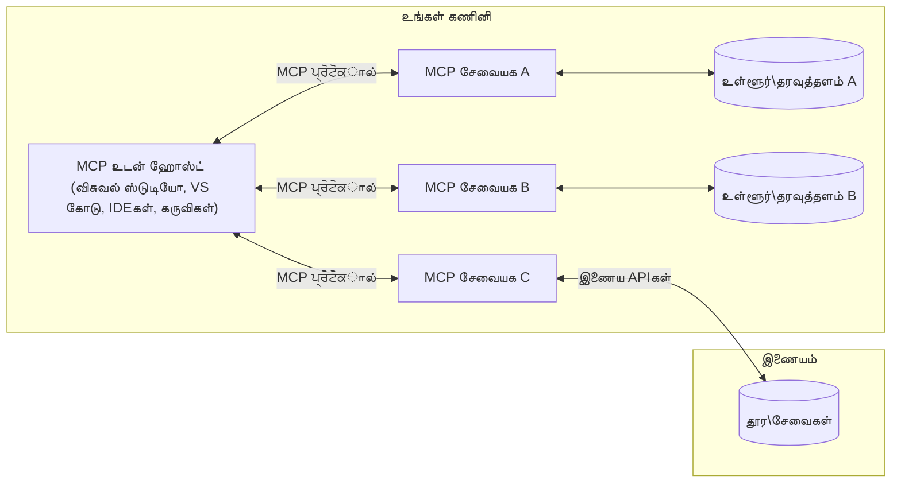

# MCP கோர் கோன்செப்ட்ஸ்: AI ஒருங்கிணைப்பிற்கான மாதிரி சூழல் நெறிமுறையை கையில் கொள்ளுதல்

[](https://youtu.be/earDzWGtE84)

_(இந்த பாடத்தின் வீடியோவை காண மேலுள்ள படத்தை கிளிக் செய்யவும்)_

[Model Context Protocol (MCP)](https://github.com/modelcontextprotocol) என்பது பெரிய மொழி மாடல்கள் (LLMs) மற்றும் புற உபகரணங்கள், செயலிகள் மற்றும் தரவு மூலோபாயங்களுக்கிடையேயான தொடர்பை மேம்படுத்தும் ஒரு சக்திவாய்ந்த, நிலையான தூணாக்கல் ஆகும்.  
இந்த கையேடு MCP இன் முக்கியக் கருத்துக்களை உங்களுக்கு தரும். நீங்கள் இதன் கிளையண்ட்-சர்வர் கட்டமைப்பு, அத்தியாவசிய கூறுகள், தொடர்பு இயந்திரங்கள் மற்றும் செயலாக்க சிறந்த நடைமுறைகள் குறித்து ஆராய்வீர்கள்.

- **தெளிவான பயனர் அனுமதி**: அனைத்து தரவு அணுகல் மற்றும் செயல்கள் செயற்திறன்படுத்தல் முன்னர் தெளிவான பயனர் ஒப்புதலை தேவைப்படும். பயனர்கள் எந்த தரவு அணுகப்படுமென்பதைவும், எந்த நடவடிக்கைகள் மேற்கொள்ளப்படும் என்பதையும் தெளிவாக புரிந்து கொண்டு அனுமதிகளையும் அதிகாரங்களையும் நுணுக்கமாக கட்டுப்படுத்த வேண்டும்.

- **தரவு தனியுரிமை பாதுகாப்பு**: பயனர் தரவு மட்டும் தெளிவான அனுமதியுடன் வெளிப்பட வேண்டும் மற்றும் முழு தொடர்பு செயல்முறை முழுவதும் வலுவான அணுகல் கட்டுப்பாடுகள் மூலம் பாதுகாக்கப்பட வேண்டும். செயலாக்கங்கள் அசட்டையற்ற தரவு பரிமாற்றத்தைத் தடுப்பது மற்றும் தனியுரிமை எல்லைகளை கடைப்பிடிக்க வேண்டும்.

- **கருவி இயக்க பாதுகாப்பு**: ஒவ்வொரு கருவி அழைப்பும் கருவியின் செயல்பாடு, அளவுருக்கள் மற்றும் சாத்தியமான தாக்கங்களை தெளிவாக புரிந்து கொண்டு தெளிவான பயனர் அனுமதியுடன் இடம்பெற வேண்டும். வலுவான பாதுகாப்பு எல்லைகள் எதிர்பாராத, பாதுகாப்பற்ற அல்லது தீமையான கருவி செயல்பாட்டை தடுக்கும்.

- **போக்குவரத்து அடுக்கு பாதுகாப்பு**: அனைத்து தொடர்பு சேனல்களும் பொருத்தமான குறியாக்க மற்றும் அடையாள மேலாண்மை முறைகளை பயன்படுத்த வேண்டும். தொலைதூர இணைப்புகள் பாதுகாப்பான போக்குவரத்து நெறிமுறைகள் மற்றும் சரியான சான்று முகாம் நிர்வகிப்பை செயல்படுத்த வேண்டும்.

#### செயலாக்க வழிகாட்டுதல்கள்:

- **அனுமதி மேலாண்மை**: பயனர்களுக்கு எந்த சர்வர்கள், கருவிகள் மற்றும் வளங்கள் அணுகக்கூடியவை என்பதைக் கட்டுப்படுத்தும் நுணுக்கமான அனுமதி அமைப்புகளை செயல்படுத்தவும்  
- **அடையாளம் உறுதிப்படுத்தல் மற்றும் அங்கீகாரம்**: பாதுகாப்பான அடையாள உறுதி முறைகள் (OAuth, API விசைகள்) மற்றும் சரியான டோக்கன் மேலாண்மை மற்றும் காலாவதியாக்கத்தை பயன்படுத்தவும்  
- **நுழைவு சரிபார்ப்பு**: அனைத்து அளவுருக்கள் மற்றும் தரவு உள்ளீடுகளை உள்ளிடப்பட்ட திட்டங்களுக்கு ஏற்ப சரிபார்த்து அழுத்துதல் தாக்குதல்களை தடுக்கும்  
- **ஆடிட் பதிவுகள்**: பாதுகாப்பு கண்காணிப்பு மற்றும் अनुपालनத்துக்காக அனைத்து நடவடிக்கைகளின் விரிவான பதிவுகளை பராமரி

## முன்னோட்டம்

இந்த பாடம் Model Context Protocol (MCP) சுற்றுப்புற அமைப்பு மற்றும் கூறுகளை ஆராய்கிறது. நீங்கள் MCP தொடர்புகளை இயக்கும் கிளையண்ட்-சர்வர் கட்டமைப்பும் முக்கிய கூறுகளும் தொடர்பு இயந்திரங்களும் பற்றி அறிந்துகொள்ளப்போகிறீர்கள்.

## முக்கிய கற்றல் குறிக்கோள்கள்

இந்த பாடத்தின் இறுதியில், நீங்கள்:

- MCP கிளையண்ட்-சர்வர் கட்டமைப்பை புரிந்து கொள்ள  
- ஹோஸ்ட்கள், கிளையண்ட்கள் மற்றும் சர்வர்களின் பங்கு மற்றும் பொறுப்புகளை அடையாளம் காண  
- MCP ஐ நெகிழ்வான ஒருங்கிணைப்பு அடுக்காக மாற்றும் முக்கிய அம்சங்களை பகுப்பாய்வு செய்ய  
- MCP சூழல் மண்டலத்தில் தகவல் ஓடுதலை அறிந்து கொள்ள  
- .NET, Java, Python மற்றும் JavaScript இல் குறியீட்டுத் தகவல்களினூடு நடைமுறை அறிவைப் பெற

## MCP கட்டமைப்பு: ஆழமான பார்வை

MCP சுற்றுச் சூழல் ஒரு கிளையண்ட்-சர்வர் மாதிரியில் கட்டப்பட்டது. இந்த தொகுதி ரீதியான அமைப்பு AI செயலிகளுக்கு கருவிகள், தரவுத்தளங்கள், APIs மற்றும் சூழல்பொருந்திய வளங்களுடன் திறம்பட தொடர்பு கொள்ள வழிகாட்டுகிறது. இந்த கட்டமைப்பை அதன் முக்கிய கூறுகளில் பிரித்துப் பார்க்கலாம்.

அதன் அடிப்படையில் MCP ஒரு கிளையண்ட்-சர்வர் கட்டமைப்பைப் பின்பற்றுகிறது, அதில் ஒரு ஹோஸ்ட் செயலி பல சர்வர்களுடன் இணைக்க முடியும்:


- **MCP ஹோஸ்ட்கள்**: VSCode, Claude Desktop, IDEகள் அல்லது MCP மூலமாக தரவை அணுக விரும்பும் AI கருவிகள் போன்ற நிகழ்ச்சிகள்  
- **MCP கிளையண்ட்கள்**: சர்வர்களுடன் 1:1 இணைப்புகளை பராமரிக்கும் நெறிமுறை கிளையண்ட்கள்  
- **MCP சர்வர்கள்**: ஒவ்வொரு MCP சர்வரும் முறைமைந்த Model Context Protocol மூலம் குறிப்பிட்ட திறன்களை வெளிப்படுத்தும் ஒளியுள்ள நிகழ்ச்சிகள்  
- **உள்ளூர் தரவு மூலோபாயங்கள்**: உங்கள் கணினியின் கோப்புகள், தரவுத்தளங்கள் மற்றும் சேவைகள், MCP சர்வர்கள் பாதுகாப்பாக அணுகக்கூடியவை  
- **தொலை சேவைகள்**: இணையதளத்தின் வழியாக கிடைக்கும் வெளி அமைப்புகள், MCP சர்வர்கள் APIs மூலம் இணைக்கக்கூடியவை.

MCP நெறிமுறை ஒரு evolves ஆகும் ஒப்பந்தம், தேதி-அடிப்படையிலான பதிப்பீட்டுடன் (YYYY-MM-DD வடிவம்). தற்போதைய நெறிமுறை பதிப்பு **2025-11-25** ஆகும். நீங்கள் ப 最新 .[protocol specification](https://modelcontextprotocol.io/specification/2025-11-25/) கேள்விகளை பார்க்கலாம்

### 1. ஹோஸ்ட்கள்

Model Context Protocol (MCP) இல், **ஹோஸ்ட்கள்** என்பது பயனர்கள் நெறிமுறையுடன் தொடர்பு கொள்வதற்கான முதன்மை இடைமுகமாக செயல்படும் AI செயலிகள் ஆகும். ஹோஸ்ட்கள் பல MCP சர்வர்களுடன் இணைப்புகளை ஒருங்கிணைத்து பராமரிக்க MCP கிளையண்ட்களை ஒவ்வொரு சர்வர் இணைப்பிற்கும் உருவாக்குகின்றன. ஹோஸ்ட்களின் எடுத்துக்காட்டுகள்:

- **AI செயலிகள்**: Claude Desktop, Visual Studio Code, Claude Code  
- **ஆர்க slightlyாரசு சூழல்கள்**: IDEகள் மற்றும் MCP ஒருங்கிணைப்புடன் கூடிய குறியீடு ஆசிரியர்கள்  
- **தனிப்பயன் செயலிகள்**: நோக்கம் குறிப்பிட்ட AI முகவர்கள் மற்றும் கருவிகள்

**ஹோஸ்ட்கள்** AI மாதிரி தொடர்புகளை ஒருங்கிணைக்கும் செயலிகள். அவை:

- **AI மாதிரி ஒருங்கிணைக்க**: LLMகளை இயக்கு அல்லது தொடர்பு கொண்டு பதில்களை உருவாக்கி AI பணிகளை ஒருங்கிணைக்க  
- **கிளையண்ட் இணைப்புகளை நிர்வகிக்க**: ஒவ்வொரு MCP சர்வர் இணைப்பிற்கும் ஒரு MCP கிளையண்டை உருவாக்கி பராமரிக்க  
- **பயனர் இடைமுக கட்டுப்பாடு**: உரையாடல் ஓட்டம், பயனர் தொடர்புகள் மற்றும் பதில்களின் காட்டலை கையாள  
- **பாதுகாப்பு விதிகளை அமல்படுத்த**: அனுமதிகள், பாதுகாப்பு கட்டுப்பாடுகள் மற்றும் அடையாள உறுதிப்படுத்தலை கட்டுப்படுத்து  
- **பயனர் அனுமதியை கையாள**: தரவுப் பகிர்வு மற்றும் கருவி இயக்கத்திற்கு பயனர் ஒப்புதலை நிர்வகிக்க

### 2. கிளையண்ட்கள்

**கிளையண்ட்கள்** என்பது புலன்களுக்கு ஒதுக்கப்பட்ட 1:1 இணைப்புகளை பராமரிக்கும் அத்தியாவசிய கூறுகள். ஒவ்வொரு MCP கிளையண்டும் ஹோஸ்டால் உருவாக்கப்பட்டு குறிப்பிட்ட MCP சர்வருடன் இணைக்கப்படுகிறது, ஒருங்கிணைந்த மற்றும் பாதுகாப்பான தொடர்பு சேனல்களை உறுதி செய்கிறது. பல கிளையண்ட்கள் ஹோஸ்ட்களுக்கு பல சர்வர்களை ஒரே நேரத்தில் இணைக்க உதவுகின்றன.

**கிளையண்ட்கள்** என்பது ஹோஸ்ட் செயலி உள்ளே இணைப்பாளி கூறுகள். அவை:

- **நெறிமுறை தொடர்பு**: சர்வர்களுக்கு JSON-RPC 2.0 கோரிக்கைகளை சுட்டி மற்றும் அறிவுரைகளுடன் அனுப்ப  
- **திறன்களை பேச்சுவார்த்தை செய்வது**: துவக்கத்தில் சர்வர்களுடன் ஆதரவான அம்சங்கள் மற்றும் நெறிமுறை பதிப்புகள் குறித்து பேச்சுவார்த்தை செய்ய  
- **கருவி இயக்கம்**: மாதிரிகளிடம் இருந்து கருவி இயக்கக் கோரிக்கைகளை நிர்வகித்து பதில்களை செயலாக்க  
- **உண்மை நேர புதுப்பிப்புகள்**: சர்வர்களிடமிருந்து அறிவிப்புகள் மற்றும் நேரடி புதுப்பிப்புகளை கையாள  
- **பதில் செயலாக்கம்**: பயனர்களுக்கு காட்ட சர்வர் பதில்களை செயலாக்கி வடிவமைக்க

### 3. சர்வர்கள்

**சர்வர்கள்** MCP கிளையண்ட்களுக்கு சூழல், கருவிகள் மற்றும் திறன்களை வழங்கும் நிகழ்ச்சிகள். அவை உள்ளூரில் (ஹோஸ்ட் அமைப்புடன் ஒரே கணினியில்) அல்லது தொலைவில் (வெளிக் கோப்புறைகள் மற்றும் மேடைகளில்) இயங்கக்கூடியவை. சர்வர்கள் கிளையண்ட் கோரிக்கைகளை கையாளி கட்டமைக்கப்பட்ட பதில்களை வழங்க பொறுப்பாக உள்ளனர். சர்வர்கள் பிரதிநிதித்துவமான செயல்பாட்டை Model Context Protocol மூலம் வெளிப்படுத்துகின்றன.

**சர்வர்கள்** என்பது சூழல் மற்றும் திறன்களை வழங்கும் சேவைகள். அவை:

- **அம்ச பதிவு**: குறைவான உருவக்கொள்ளைகளை (வளங்கள், சுட்டிகள், கருவிகள்) கிளையண்ட்களுக்கு பதிவு செய்யவும் வெளிப்படுத்தவும்  
- **கோரிக்கை செயலாக்கம்**: கருவி அழைப்புகள், வள கோரிக்கைகள் மற்றும் சுட்டி கோரிக்கைகளை பெற மற்றும் இயக்க  
- **சூழல் வழங்கல்**: மாதிரி பதில்களை மேம்படுத்த தகவல் மற்றும் தரவை வழங்க  
- **நிலை நிர்வகிப்பு**: தேவையான போது அமர்வு நிலையை பராமரி மற்றும் மாநில சார்ந்த தொடர்பை கையாள  
- **உண்மை நேர அறிவிப்புகள்**: திறன்கள் மாற்றங்கள் மற்றும் புதுப்பிப்புகளை இணைக்கப்பட்ட கிளையண்ட்களுக்கு அறிவிக்க

சர்வர்கள் சிறப்பான செயல்பாடு கொண்டு மாதிரி திறன்களை நீட்டிக்க யாராலும் உருவாக்கப்பட முடியும், மேலும் உள்ளூர் மற்றும் தொலை நிலைப்படுத்தலை இரண்டும் ஆதரிக்கின்றன.

### 4. சர்வர் உருவக்கொள்ளைகள்

Model Context Protocol (MCP) சர்வர்கள், கிளையண்ட்கள், ஹோஸ்ட்கள் மற்றும் மொழி மாதிரிகள் இடையேயான செறிவான தொடர்புகளை வரையறுக்கும் மெய்நிகர் கட்டமைப்புகளை வழங்கும் மூன்று முக்கிய **உருவக்கொள்ளைகளை** வழங்குகின்றன. இந்த உருவக்கொள்ளைகள் நெறிமுறையின் வாயிலாக கிடைக்கும் சூழல் தகவல் மற்றும் நடவடிக்கைகளை விவரிக்கின்றன.

MCP சர்வர்கள் கீழ்காணும் மூன்று முக்கிய உருவக்கொள்ளைகளின் எந்தவொரு கலவையையும் வெளிப்படுத்த முடியும்:

#### வளங்கள் 

**வளங்கள்** என்பது AI செயலிகளுக்கு சூழல் தகவலை வழங்கும் தரவு மூலங்கள். அவை மாதிரியின் புரிதலை மற்றும் முடிவெடுப்பை மேம்படுத்தக்கூடிய நிலையான அல்லது இயக்கமடைந்த உள்ளடக்கங்களை பிரதிநிதித்துவம் செய்யின்றன:

- **சூழல் தரவு**: AI மாதிரி பயன்பாட்டிற்கான கட்டமைக்கப்பட்ட தகவல் மற்றும் சூழல்  
- **அறிவு அடிகள்**: ஆவணக் களஞ்சியங்கள், கட்டுரைகள், கையேடுகள் மற்றும் ஆய்வு கட்டுரைகள்  
- **உள்ளூர் தரவு மூலங்கள்**: கோப்புகள், தரவுத்தளங்கள் மற்றும் உள்ளூர் அமைப்பு தகவல்  
- **வெளியூர் தரவு**: API பதில்கள், இணைய சேவைகள் மற்றும் தொலை அமைப்பு தரவு  
- **இயங்கும் உள்ளடக்கம்**: வெளிப்புற நிலைமைகள் அடிப்படையிலான உண்மை நேர தரவு

வளங்கள் URIகள் மூலம் அடையாளமிடப்படும் மற்றும் `resources/list` மூலம் கண்டுபிடித்து `resources/read` மூலம் பெறப்படுகின்றன:

```text
file://documents/project-spec.md
database://production/users/schema
api://weather/current
```

#### சுட்டிகள்

**சுட்டிகள்** என்பது மொழி மாதிரிகளுடன் தொடர்புகொள்வதற்கான மறுபயன்பாட்டுக்குரிய மாதிரிகள் ஆகும். அவை நடைமுறை தொடர்பு வடிவமைப்புகள் மற்றும் வடிவமைக்கப்பட்ட பணிச்சூழல்களை வழங்குகின்றன:

- **வடிவமைக்கப்பட்ட தொடர்புகள்**: முன்கூட்டியே அமைக்கப்பட்ட செய்திகள் மற்றும் உரையாடல் தொடங்கிகள்  
- **பணிச்சூழல் வடிவங்கள்**: பொதுவான வழிகளுக்கு நிலையான தொடர்ச்சிகள்  
- **குறைந்த அலகு எடுத்துக்காட்டுகள்**: மாதிரி அறிவுறுத்தலுக்கான எடுத்துக்காட்டு அடிப்படை வடிவங்கள்  
- **கணினி சுட்டிகள்**: மாதிரி நடத்தை மற்றும் சூழலை வரையறுக்கும் அடிப்படை சுட்டிகள்  
- **இயங்கும் வடிவங்கள்**: குறிப்பிட்ட சூழல்களுக்கு தழுவி மாற்றக்கூடிய அளவுருக்கள் கொண்ட சுட்டிகள்  

சுட்டிகள் மாறிலி மாற்றத்தை ஆதரித்து `prompts/list` வழியாக கண்டுபிடித்து `prompts/get` மூலம் பெறப்படுகின்றன:

```markdown
Generate a {{task_type}} for {{product}} targeting {{audience}} with the following requirements: {{requirements}}
```

#### கருவிகள்

**கருவிகள்** என்பது AI மாதிரிகள் குறிப்பிட்ட நடவடிக்கைகளை செய்ய அழைக்கக்கூடிய செயல்படும் செயலிகள் ஆகும். இவை MCP சுற்றுப்புற அமைப்பின் "வினைபயன்மைகளை" பிரதிநிதித்துவம் செய்கின்றன, அவை மாதிரிகளுக்கு வெளியான அமைப்புகளுடன் தொடர்பு கொள்ள உதவுகின்றன:

- **இயக்கக்கூடிய செயலிகள்**: மாதிரிகள் குறிப்பிட்ட அளவுருக்களுடன் அழைக்க கூடிய தனிப்பட்ட செயல்பாடுகள்  
- **வெளி அமைப்பு ஒருங்கிணைப்பு**: API அழைப்புகள், தரவுத்தளம் தேடல்கள், கோப்பு செயல்பாடுகள் மற்றும் கணக்கீடுகள்  
- **தனித்துவ அடையாளம்**: ஒவ்வொரு கருவிக்கும் தனிப்பட்ட பெயர், விளக்கம் மற்றும் அளவுரு திட்டம் உண்டு  
- **கட்டமைக்கப்பட்ட உள்ளீடு/வெளியீடு**: கருவிகள் சரிபார்க்கப்பட்ட அளவுருக்களை ஏற்றுக்கொண்டு கட்டமைக்கப்பட்ட, வகைப்படுத்தப்பட்ட பதில்களை வழங்குகின்றன  
- **நடைமுறை திறன்கள்**: மாதிரிகளுக்கு வணிக்ப்படுத்தப்பட்ட செயல்பாடுகளை முன்மொழிவதற்கும் நேரடி தரவைப் பெற வழி வகுக்கும்  

கருவிகள் அளவுரு சரிபார்ப்புக்கு JSON Schema கொண்டு வரையறுக்கப்பட்டு `tools/list` மூலம் கண்டுபிடித்து `tools/call` மூலம் இயக்கப்படுகின்றன. கருவிகள் சிறந்த UI காட்சி வழங்கும் கூடுதல் மெய்நிகர் தரவாக **ஐகான்கள்** கொண்டிருக்கலாம்.

**கருவி சுட்டுரைகள்**: கருவிகள் செயல்பாட்டைப் பற்றி விவரிக்கும் நடத்தை சுட்டுரைகள் (உதா., `readOnlyHint`, `destructiveHint`) உண்டு, அவை கருவி செயல் பற்றி கிளையண்ட்கள் அறிவுனர்த்தமாக தேர்ந்தெடுக்க உதவும்.

கருவி வரையறை உதாரணம்:

```typescript
server.tool(
  "search_products", 
  {
    query: z.string().describe("Search query for products"),
    category: z.string().optional().describe("Product category filter"),
    max_results: z.number().default(10).describe("Maximum results to return")
  }, 
  async (params) => {
    // தேடலை நடாத்தி கட்டமைக்கப்பட்ட முடிவுகளை வழங்குக
    return await productService.search(params);
  }
);
```

## கிளையண்ட் உருவக்கொள்ளைகள்

Model Context Protocol (MCP) இல், **கிளையண்ட்கள்** சர்வர்களுக்கு ஹோஸ்ட் செயலியில் கூடுதல் திறன்களை கோர ஆதரவுக்கும், AI மாதிரி திறன்கள் மற்றும் பயனர் தொடர்புகளை அணுகக்கூடிய செறிவான மற்றும் மேலதிக சர்வர் செயல்பாடுகளுக்கான உருவக்கொள்ளைகளை வெளிப்படுத்தலாம்.

### சாம்பிளிங்

**சாம்பிளிங்** மூலம் சர்வர்கள் கிளையண்டின் AI செயலியில் இருந்து மொழி மாதிரி முடிப்புகளை கோர முடியும். இந்த உருவக்கோள் சர்வர்கள் தங்கள் சொந்த மாதிரி பொறுப்பு இல்லாமல் LLM திறன்களை அணுக அனுமதிக்கும்:

- **மாதிரி-சுயாதீன அணுகல்**: LLM SDKகள் இல்லாமலோ, மாதிரி அணுகலை நிர்வகிக்காமலோ முடிவுகளைப்ப கோர முடியும்  
- **சர்வர் தொடக்கம் AI**: சர்வர்கள் தானாகவே கிளையண்டின் AI மாதிரியை பயன்படுத்தி உள்ளடக்கத்தை உருவாக்க முடியும்  
- **மீண்டும் படி LLM தொடர்புகள்**: செறிவான சூழல்களுக்காக சர்வர்கள் AI உதவியைப் பெற முடியும்  
- **இயங்கும் உள்ளடக்க உருவாக்கம்**: ஹோஸ்டின் மாதிரியைப் பயன்படுத்தி தரவுக்கு சூழல் பதில்களை உருவாக்கும் வாய்ப்பு  
- **கருவி அழைப்புக்கு ஆதரவு**: சர்வர்கள் `tools` மற்றும் `toolChoice` அளவுருக்களைச் சேர்த்து கிளையண்டின் மாடல் சாம்பிளிங் போது கருவிகளை அழைக்க இயலும்

சாம்பிளிங் `sampling/complete` முறையின் வாயிலாக துவங்குகிறது, இதில் சர்வர்கள் முடிப்பு கோரிக்கைகளை கிளையண்ட்களுக்கு அனுப்புகின்றன.

### ருட்கள்

**ருட்கள்** என்பது கிளையண்ட்கள் சர்வர்களுக்கு கோப்பு அமைப்பு எல்லைகளை வெளிப்படுத்த ஒரு நிலையான வழியாகும், இது சர்வர்களுக்கு எந்த அடைவுகள் மற்றும் கோப்புகளுக்கு அணுகல் உண்டு என்பதையை புரிந்துகொள்ள உதவுகிறது:

- **கோப்பு அமைப்பு எல்லைகள்**: சர்வர்கள் எங்கே கோப்புறைகளில் செயல்பட முடியும் என்பதற்கான எல்லைகள் வரையறுக்கப்படுகின்றன  
- **அணுகல் கட்டுப்பாடு**: சர்வர்களுக்கு அனுமதி உள்ள அடைவுகள் மற்றும் கோப்புகளை விளக்குகிறது  
- **இயங்கும் புதுப்பிப்புகள்**: வேர்ட் பட்டியல் மாறும் போது கிளையண்ட்கள் சர்வர்களுக்கு அறிவித்து விட முடியும்  
- **URI அடிப்படை அடையாளம்**: `file://` URIகள் மூலம் அணுகக்கூடிய அடைவுகள் மற்றும் கோப்புகள் அடையாளம் காணப்படுகின்றன

ருட்கள் `roots/list` முறையின் மூலம் கண்டுபிடிக்கப்படுகின்றன மற்றும் கிளையண்ட்கள் `notifications/roots/list_changed` வழியாக மாற்றங்களை அறிவிக்கின்றன.

### ஏழுதல்

**ஏழுதல்** மூலம் சர்வர்கள் கிளையண்ட் இடைமுகத்தின் வழியாக பயனர்களிடமிருந்து கூடுதல் தகவல் அல்லது உறுதிப்பத்திரம் கோர முடியும்:

- **பயனர் உள்ளீட்டு கோரிக்கைகள்**: கருவி இயக்கத்திற்காக தேவையான போது கூடுதல் தகவலைக் கேட்கின்றன  
- **உறுதிப்பத்திரம் உரையாடல்கள்**: உணர்ச்சி மிகுந்த அல்லது தாக்கம் உள்ள நடவடிக்கைகளுக்கு பயனர் அனுமதி கோருதல்  
- **செயற்கைகூறு பணிச்சூழல்கள்**: படி படியாக பயனர் தொடர்புகளை உருவாக்க சர்வர்களுக்கு வாய்ப்பு  
- **இயங்கும் அளவுரு சேகரிப்பு**: கருவி இயக்கத்தின் போது காணாமல் போன அல்லது விருப்ப அளவுருக்களை சேகரிக்கும்

ஏழுதல் கோரிக்கைகள் `elicitation/request` முறையாக அனுப்பப்பட்டு கிளையண்ட் இடைமுகத்தில் பயனர் உள்ளீட்டை சேகரிக்கின்றன.

**URL முறை ஏழுதல்**: சர்வர்கள் URL அடிப்படையிலான பயனர் தொடர்புக்களைப் கோரும் வசதி உண்டு, பயனர்களை வெளியே உள்ள இணையப் பக்கங்களுக்கு இயக்கி அடையாளம் உறுதி, உறுதி அல்லது தரவு உள்ளீட்டைச் செய்யச் செய்யலாம்.

### பதிவு

**பதிவு** மூலம் சர்வர்கள் கிளையண்ட்களுக்கு கட்டமைக்கப்பட்ட பதிவு செய்திகள் அனுப்பி பிழைகள் கண்டறிதல், கண்காணிப்பு மற்றும் செயல்பாட்டு வெளிப்படைத்தன்மைக்கான ஆதரவை வழங்குகின்றன:

- **பிழைத்தடுக்குதல் ஆதரவு**: பிழைகளைக் கண்டறிய விரிவான செயல்திறன் பதிவுகளை வழங்கும்  
- **செயல்பாட்டு கண்காணிப்பு**: நிலை புதுப்பிப்புகள் மற்றும் செயல்திறன் அளவுகோல்களை கிளையண்ட்களுக்கு அனுப்புதல்  
- **பிழை அறிக்கை**: விரிவான பிழை சூழல் மற்றும் பகுப்பாய்வு தகவலை வழங்குதல்  
- **ஆடிட் தடயங்கள்**: சர்வர் செயல்பாடுகள் மற்றும் முடிவுகளின் விரிவான பதிவுகளை உருவாக்குதல்

பதிவு செய்திகள் சர்வர் செயல்பாட்டில் வெளிப்படைத்தன்மையை வழங்கவும் பிழைத்தடுப்பை எளிதாக்கவும் கிளையண்ட்களுக்கு அனுப்பப்படுகின்றன.

## MCP இல் தகவல் ஓட்டம்

Model Context Protocol (MCP) ஹோஸ்ட்கள், கிளையண்ட்கள், சர்வர்கள் மற்றும் மாதிரிகள் இடையேயான அமைக்கப்பட்ட தகவல் ஓட்டத்தை வரையறுக்கிறது. இந்த ஓட்டத்தை புரிந்துகொள்வது பயனர் கோரிக்கைகள் எவ்வாறு செயலாக்கப்படுகின்றன மற்றும் வெளியே உள்ள கருவிகள் மற்றும் தரவுகள் எப்படி மாதிரி பதில்களில் ஒருங்கிணைக்கப்படுகின்றன என்பதைக் கெளரவிக்கிறது.

- **ஹோஸ்ட் இணைப்பை தொடங்குகிறது**  
  ஹோஸ்ட் செயலி (IDE அல்லது உரையாடல் இடைமுகம் போன்றது) MCP சர்வருடன் இணைப்பை ஏற்படுத்துகிறது, பொதுவாக STDIO, WebSocket அல்லது மற்றொரு ஆதரவு போக்குவரத்து வழியாக.

- **திறன் பேச்சுவார்த்தை**  
  கிளையண்ட் (ஹோஸ்ட் உள்ளே நுழைந்துள்ள) மற்றும் சர்வர் தங்கள் ஆதரவு அம்சங்கள், கருவிகள், வளங்கள் மற்றும் நெறிமுறை பதிப்புகள் பற்றிய தகவலை பரிமாறிக் கொள்கின்றன. இது இரு பக்கங்களும் அமர்வு திறன்களை புரிந்துகொள்ள உறுதி செய்கிறது.

- **பயனர் கோரிக்கை**  
  பயனர் ஹோஸ்டுடன் உரையாடுகின்றார் (எ.கா., ஒரு சுட்டி அல்லது கட்டளை உள்ளிடுதல்). ஹோஸ்ட் இதை சேகரித்து கிளையண்டுக்கு அனுப்புகிறது.

- **வளம் அல்லது கருவி பயன்பாடு**  
  - கிளையண்ட் மாதிரியின் புரிதலை செறிவுப்படுத்த சர்வரிலிருந்து கூடுதல் சூழல் அல்லது வளங்களை (கோப்புகள், தரவுத்தள பதிவுகள் அல்லது அறிவுத் தளக் கட்டுரைகள் போன்றவை) கோரலாம்.  
  - மாதிரி கருவி தேவை என தீர்மானித்தால் (உதா., தரவு பெற, கணக்கு செய்ய அல்லது API அழைக்க), கிளையண்ட் கருவி அழைப்புக் கோரிக்கையை சர்வருக்கு அனுப்பி, கருவியின் பெயரையும் அளவுருக்களையும் குறிப்பிடும்.

- **சர்வர் செயல்பாடு**  
சேவை வழங்கி வளம் அல்லது கருவி கோரிக்கையை பெறுகிறது, தேவையான செயல்பாடுகளை (ஒரு செயல்பாட்டை இயக்குதல், தரவுத்தளத்தை விசாரித்தல் அல்லது கோப்பை மீட்டெடுத்தல் போன்றவை) செய்யும், மற்றும் முடிவுகளை கட்டமைக்கப்பட்ட வடிவத்தில் கிளையன்டுக்கு திருப்பி வழங்குகிறது.

- **பதில் உருவாக்குதல்**  
  கிளையன்ட் சேவை வழங்கியின் பதில்களை (வளம் தரவு, கருவி வெளியீடுகள் மற்றும் பிற) தொடர்ந்தும் செயல்படும் மாதிரிக் கூட்டுப் பங்கேற்பில் ஒருங்கிணைக்கிறது. மாதிரி இந்த தகவலை பயன்படுத்தி விரிவான மற்றும் சூழல் சார்ந்த பொருத்தமான பதிலை உருவாக்குகிறது.

- **முடிவின் பிரசாரம்**  
  ஹோஸ்ட் கிளையன்டிலிருந்து இறுதி வெளியீட்டை பெறுகிறது மற்றும் பயனருக்கு அதை வழங்குகிறது, பெரும்பாலும் மாதிரி உருவாக்கிய உரையும் கருவி செயல்பாடுகள் அல்லது வள நாட்காணல்கள் எதுவும் இருந்தால் அதற்கான முடிவுகளையும் அடங்கும்.

இந்த ஓட்டம் MCPக்கு பரிந்துரைக்கபடும் உயர் நிலை, இடையூறு செயல் மற்றும் சூழல் உணர்ச்சியுள்ள செயற்கை நுண்ணறிவு பயன்பாடுகளுக்கு ஆதரவளிக்கின்றது என்று மாதிரிகளை வெளிப்புற கருவிகள் மற்றும் தரவுத்தளங்களுடன் ஒருங்கிணைக்கும்.

## ஒப்பந்த கட்டமைப்பு மற்றும் அடுக்குகள்

MCP இரண்டு தனித்துவமான கட்டமைப்பு அடுக்குகளை கொண்டுள்ளது, அவை முழு தொடர்பு கட்டமைப்பை வழங்க ஒன்றாக செயல்படுகின்றன:

### தரவு அடுக்கு

**தரவு அடுக்கு** MCP விதியை முதன்மையாக **JSON-RPC 2.0**யைப் பயன்படுத்தி செயல்படுத்துகிறது. இந்த அடுக்கு செய்தி கட்டமைப்பு, அர்த்தங்கள் மற்றும் தொடர்பு மாதிரிகளை வரையறுக்கிறது:

#### முதன்மை கூறுகள்:

- **JSON-RPC 2.0 ஒப்பந்தம்**: அனைத்து தொடர்புகளும் தொகுப்புச் சின்னமாய் JSON-RPC 2.0 செய்தி வடிவத்தை பயன்படுத்தி முறைகளை அழைப்பதற்கு, பதில்களை வழங்குவதற்கு, மற்றும் அறிவிப்புகளுக்கு  
- **வாழ்க்கை சுழற்சி மேலாண்மை**: இணைப்பு துவக்கல், திறமைகள் பேச்சுவார்த்தை மற்றும் அமர்வு முடிவடையும் வரை கிளையன்டுகள் மற்றும் சேவை வழங்கிகளுக்கு இடையேயான செயல்திறன்  
- **சேவை வழங்கி முதன்மைகள்**: கருவிகள், வளங்கள் மற்றும் விருப்பங்களை கொண்டு சேவை வழங்கிகள் அடிப்படையான செயல்பாட்டை வழங்கும்  
- **கிளையன்ட் முதன்மைகள்**: சேவை வழங்கிகள் LLMகளிடமிருந்து மாதிரிப்பதிவை கோருவதற்கும், பயனர் உள்ளீட்டை ஈர்க்கவும், பதிவு செய்திகளை அனுப்பவும் அனுமதிக்கும்  
- **நேரடி அறிவிப்புகள்**: நிலையான புதுப்பிப்புகளுக்கான அசிங்கிரோனஸ் அறிவிப்புகளை ஆதரிக்கிறது, மீட்டெட்பதில்லாமல்

#### முக்கிய அம்சங்கள்:

- **ஒப்பந்த பதிப்பு பேச்சுவார்த்தை**: கால தயார் பதிப்பின் (YYYY-MM-DD) மூலம் பொருந்துதல் உறுதி செய்யப்படுகிறது  
- **திறமை கண்டுபிடிப்பு**: துவக்கத்தில் கிளையன்ட்கள் மற்றும் சேவை வழங்கிகள் ஆதரவு தரக்கூடிய அம்சங்களைக் பகிர்ந்து கொள்கின்றன  
- **நிலைத்த அமர்வுகள்**: பல தொடர்புக்களுக்குள் இணைப்பு நிலையை பராமரித்து சூழல் தொடர்ச்சியை உறுதி செய்கிறது

### பரிமாற்ற அடுக்கு

**பரிமாற்ற அடுக்கு** MCP பங்கேற்பாளர்களுக்கிடையேயான தொடர்பு சேனல்கள், செய்தி கட்டமைப்பு மற்றும் அங்கீகாரத்தை நிர்வகிக்கிறது:

#### ஆதரவுள்ள பரிமாற்ற முறைகள்:

1. **STDIO பரிமாற்றம்**:  
   - நேரடி செயல்முறை தொடர்புக்காக முறைமை உள்ளீடு/வெளியீடு ஸ்ட்ரீம்களை பயன்படுத்துகிறது  
   - அதே கணினியில் உள்ள உள்ளூர் செயல்முறைகளுக்கு சிறந்தது, நெட்வொர்க் மேல் சார்ந்தது இல்லாமல்  
   - உள்ளூர் MCP சேவை வழங்கி செயல்பாடுகளுக்கு பொதுவாக பயன்படுத்தப்படுகிறது

2. **நாடாணி HTTP பரிமாற்றம்**:  
   - HTTP POSTஐ கிளையன்ட்-சேவை வழங்கி மெசேஜ்களுக்காக பயன்படுத்துகிறது  
   - விருப்பமான Server-Sent Events (SSE) மூலம் சேவை வழங்கியிடமிருந்து கிளையன்டினுக்கு நேரடி ஸ்ட்ரீமிங்  
   - வலைதளங்கள் வழியாக தொலைநிலை சேவை வழங்கிகளுடன் தொடர்புக்கு உதவுகிறது  
   - பொதுவான HTTP அங்கீகாரம் (bearer tokens, API விசைகள், தனிப்பயன் தலைப்புகள்) ஆதரிக்கிறது  
   - MCP பாதுகாப்பான டோக்கன் அடித்த அங்கீகாரத்திற்கு OAuthஐ பரிந்துரைக்கிறது

#### பரிமாற்ற மறைமுகம்:

பரிமாற்ற அடுக்கு JSON-RPC 2.0 செய்தி வடிவத்தை அனைத்து பரிமாற்ற முறைகளிலும் ஒரேபோல கையாள அனுமதிக்கும் தொடர்பு விவரங்களை மறைமுகப்படுத்துகிறது. இதனால் உள்ளூர் மற்றும் தொலைநிலை சேவை வழங்கிகளுக்கிடையேயான மாற்றம் எளிதாக்குகிறது.

### பாதுகாப்பு கவனிக்கைகள்

MCP நடைமுறைகள் அனைத்து ஒப்பந்த செயல்பாடுகளில் பாதுகாப்பான, நம்பகமான மற்றும் பாதுகாப்பான தொடர்புகளுக்கு பின்பற்றவேண்டிய சில முக்கிய பாதுகாப்பு கொள்கைகளை கடைப்பிடிக்க வேண்டும்:

- **பயனர் ஒப்புதல் மற்றும் கட்டுப்பாடு**: எந்தவொரு தரவும் அணுகப்படுவதற்கு முன்னும் செயல்பாடுகள் மேற்கொள்ளப்படுவதற்கு முன்னும் பயனர்கள் வந்த ஒப்புதலை வழங்க வேண்டும். பகிரப்படும் தரவுகளையும் எந்த நடவடிக்கைகள் அனுமதிக்கப்பட்டவையாகும் என்பதையும் பயனர்கள் தெளிவாக கட்டுப்படுத்த வேண்டும், மேலும் செயல்பாடுகளை கொண்டிருந்தபோது பயனர் இடைமுகங்கள் தெளிவான ஆய்வு மற்றும் அனுமதிக்க உதவ வேண்டும்.

- **தரவு தனியுரிமை**: பயனர் தரவு தெளிவான ஒப்புதலுடன் மட்டுமே வெளிப்படுத்த வேண்டும் மற்றும் பொருத்தமான அணுகல் கட்டுப்பாடுகள் மூலம் பாதுகாக்கப்பட வேண்டும். MCP நடைமுறைகள் அனுமதிக்கப்படாத தரவுப் பரிமாற்றத்திற்கு எதிராக பாதுகாப்பை உறுதி செய்யவேண்டும் மற்றும் அனைத்து தொடர்புகளிலும் தனியுரிமையை பராமரிக்க வேண்டும்.

- **கருவி பாதுகாப்பு**: எந்த கருவியையும் இயக்குவதற்கு முன் தெளிவான பயனர் ஒப்புதல் தேவைப்படும். ஒவ்வொரு கருவியின் செயல்பாடுகளையும் பயனர்கள் தெளிவாக புரிந்துகொள்ள வேண்டும் மற்றும் தவறான அல்லது பாதுகாப்பற்ற கருவி இயக்கத்தைத் தடுக்கும் வலுவான பாதுகாப்பு எல்லைகள் செயல்படுத்தப்படவேண்டும்.

இந்த பாதுகாப்பு கொள்கைகளை பின்பற்றுவதன் மூலம் MCP எல்லா ஒப்பந்த தொடர்புகளிலும் பயனர் நம்பிக்கை, தனியுரிமை மற்றும் பாதுகாப்பை உறுதி செய்துகொள்கிறது மற்றும் சக்திவாய்ந்த செயற்கை நுண்ணறிவு ஒருங்கிணைப்புகளை ஆதரிக்கிறது.

## குறியீட்டு உதாரணங்கள்: முக்கிய கூறுகள்

பின்வரும் மென்பொருள் மொழிகளில் முக்கிய MCP சேவை வழங்கி கூறுகள் மற்றும் கருவிகள் எப்படி நடைமுறைப்படுத்தப்படுகின்றன என்று எடுத்துக்காட்டுகின்றன.

### .NET உதாரணம்: எளிய MCP சேவை வழங்கி கருவிகளுடன் உருவாக்குதல்

இது தனிப்பயன் கருவிகள் கொண்டு எளிய MCP சேவை வழங்கியை எப்படி செயல்படுத்துவது என்பதை காட்டும் நடைமுறை .NET குறியீடு உதாரணம். இந்த எடுத்துக்காட்டு கருவிகளை வரையறுக்கும், பதிவு செய்வது, கோரிக்கைகளை கையாள்வது மற்றும் மாதிரி சூழல் ஒப்பந்தத்துடன் சேவை வழங்கியை இணைப்பதை அடங்கும்.

```csharp
using System;
using System.Threading.Tasks;
using ModelContextProtocol.Server;
using ModelContextProtocol.Server.Transport;
using ModelContextProtocol.Server.Tools;

public class WeatherServer
{
    public static async Task Main(string[] args)
    {
        // Create an MCP server
        var server = new McpServer(
            name: "Weather MCP Server",
            version: "1.0.0"
        );
        
        // Register our custom weather tool
        server.AddTool<string, WeatherData>("weatherTool", 
            description: "Gets current weather for a location",
            execute: async (location) => {
                // Call weather API (simplified)
                var weatherData = await GetWeatherDataAsync(location);
                return weatherData;
            });
        
        // Connect the server using stdio transport
        var transport = new StdioServerTransport();
        await server.ConnectAsync(transport);
        
        Console.WriteLine("Weather MCP Server started");
        
        // Keep the server running until process is terminated
        await Task.Delay(-1);
    }
    
    private static async Task<WeatherData> GetWeatherDataAsync(string location)
    {
        // This would normally call a weather API
        // Simplified for demonstration
        await Task.Delay(100); // Simulate API call
        return new WeatherData { 
            Temperature = 72.5,
            Conditions = "Sunny",
            Location = location
        };
    }
}

public class WeatherData
{
    public double Temperature { get; set; }
    public string Conditions { get; set; }
    public string Location { get; set; }
}
```

### ஜावा உதாரணம்: MCP சேவை கூறுகள்

இந்த எடுத்துக்காட்டு மேலேயுள்ள .NET எடுத்துக்காட்டுடன் ஒத்த MCP சேவை வழங்கியும் கருவி பதிவும் செயல்படுத்தப்படுகின்றன, ஆனால் ஜாவாவில்.

```java
import io.modelcontextprotocol.server.McpServer;
import io.modelcontextprotocol.server.McpToolDefinition;
import io.modelcontextprotocol.server.transport.StdioServerTransport;
import io.modelcontextprotocol.server.tool.ToolExecutionContext;
import io.modelcontextprotocol.server.tool.ToolResponse;

public class WeatherMcpServer {
    public static void main(String[] args) throws Exception {
        // ஒரு MCP சேவையகத்தை உருவாக்கவும்
        McpServer server = McpServer.builder()
            .name("Weather MCP Server")
            .version("1.0.0")
            .build();
            
        // ஒரு வானிலை கருவியை பதிவுசெய்க
        server.registerTool(McpToolDefinition.builder("weatherTool")
            .description("Gets current weather for a location")
            .parameter("location", String.class)
            .execute((ToolExecutionContext ctx) -> {
                String location = ctx.getParameter("location", String.class);
                
                // வானிலை தரவை பெறுக (எளிமைப்படுத்தப்பட்டது)
                WeatherData data = getWeatherData(location);
                
                // வடிவமைக்கப்பட்ட பதிலை திரும்ப அளிக்கவும்
                return ToolResponse.content(
                    String.format("Temperature: %.1f°F, Conditions: %s, Location: %s", 
                    data.getTemperature(), 
                    data.getConditions(), 
                    data.getLocation())
                );
            })
            .build());
        
        // stdio பரிமாற்றத்தை பயன்படுத்தி சேவையகத்தை இணைக்கவும்
        try (StdioServerTransport transport = new StdioServerTransport()) {
            server.connect(transport);
            System.out.println("Weather MCP Server started");
            // செயல்முறை நிறுத்தப்படும் வரை சேவையகத்தை இயங்க விடவும்
            Thread.currentThread().join();
        }
    }
    
    private static WeatherData getWeatherData(String location) {
        // செயலாக்கம் ஒரு வானிலை API ஐ அழைக்கும்
        // எடுத்துக்காட்டிற்காக எளிமைப்படுத்தப்பட்டது
        return new WeatherData(72.5, "Sunny", location);
    }
}

class WeatherData {
    private double temperature;
    private String conditions;
    private String location;
    
    public WeatherData(double temperature, String conditions, String location) {
        this.temperature = temperature;
        this.conditions = conditions;
        this.location = location;
    }
    
    public double getTemperature() {
        return temperature;
    }
    
    public String getConditions() {
        return conditions;
    }
    
    public String getLocation() {
        return location;
    }
}
```

### பைத்தான் உதாரணம்: MCP சேவை வழங்கி கட்டிடம்

இந்த எடுத்துக்காட்டு fastmcpயைப் பயன்படுத்துகிறது, ஆகவே முதலில் அதை நிறுவுவது உறுதி செய்யவும்:

```python
pip install fastmcp
```
குறியீடு மாதிரி:

```python
#!/usr/bin/env python3
import asyncio
from fastmcp import FastMCP
from fastmcp.transports.stdio import serve_stdio

# ஒரு FastMCP சேவையகம் உருவாக்கவும்
mcp = FastMCP(
    name="Weather MCP Server",
    version="1.0.0"
)

@mcp.tool()
def get_weather(location: str) -> dict:
    """Gets current weather for a location."""
    return {
        "temperature": 72.5,
        "conditions": "Sunny",
        "location": location
    }

# ஒரு வகுப்பு பயன்படுத்தும் மாற்று அணுகுமுறை
class WeatherTools:
    @mcp.tool()
    def forecast(self, location: str, days: int = 1) -> dict:
        """Gets weather forecast for a location for the specified number of days."""
        return {
            "location": location,
            "forecast": [
                {"day": i+1, "temperature": 70 + i, "conditions": "Partly Cloudy"}
                for i in range(days)
            ]
        }

# வகுப்பு கருவிகளை பதிவு செய்க
weather_tools = WeatherTools()

# சேவையகத்தை துவங்கும்
if __name__ == "__main__":
    asyncio.run(serve_stdio(mcp))
```

### ஜாவாஸ்கிரிப்ட் உதாரணம்: MCP சேவை வழங்கி உருவாக்கல்

இந்த எடுத்துக்காட்டு MCP சேவை வழங்கியை ஜாவாஸ்கிரிப்டில் உருவாக்கி, இரண்டு வானிலை தொடர்புடைய கருவிகளை பதிவு செய்வதை காட்டுகிறது.

```javascript
// அதிகாரப்பூர்வ Model Context Protocol SDKஐ பயன்படுத்துதல்
import { McpServer } from "@modelcontextprotocol/sdk/server/mcp.js";
import { StdioServerTransport } from "@modelcontextprotocol/sdk/server/stdio.js";
import { z } from "zod"; // அளவுரு சரிபார்ப்புக்காக

// MCP சர்வரை உருவாக்குக
const server = new McpServer({
  name: "Weather MCP Server",
  version: "1.0.0"
});

// ஒரு வானிலை கருவியை வரையறுக்கவும்
server.tool(
  "weatherTool",
  {
    location: z.string().describe("The location to get weather for")
  },
  async ({ location }) => {
    // இது சாதாரணமாக வானிலை API ஐ அழைக்கும்
    // காட்சிப்படுத்த எளிமைப்படுத்தப்பட்டது
    const weatherData = await getWeatherData(location);
    
    return {
      content: [
        { 
          type: "text", 
          text: `Temperature: ${weatherData.temperature}°F, Conditions: ${weatherData.conditions}, Location: ${weatherData.location}` 
        }
      ]
    };
  }
);

// ஒரு முன்னறிவிப்பு கருவியை வரையறுக்கவும்
server.tool(
  "forecastTool",
  {
    location: z.string(),
    days: z.number().default(3).describe("Number of days for forecast")
  },
  async ({ location, days }) => {
    // இது சாதாரணமாக வானிலை API ஐ அழைக்கும்
    // காட்சிப்படுத்த எளிமைப்படுத்தப்பட்டது
    const forecast = await getForecastData(location, days);
    
    return {
      content: [
        { 
          type: "text", 
          text: `${days}-day forecast for ${location}: ${JSON.stringify(forecast)}` 
        }
      ]
    };
  }
);

// உதவி செயலிகள்
async function getWeatherData(location) {
  // API அழைப்பை சிமுலேட் செய்க
  return {
    temperature: 72.5,
    conditions: "Sunny",
    location: location
  };
}

async function getForecastData(location, days) {
  // API அழைப்பை சிமுலேட் செய்க
  return Array.from({ length: days }, (_, i) => ({
    day: i + 1,
    temperature: 70 + Math.floor(Math.random() * 10),
    conditions: i % 2 === 0 ? "Sunny" : "Partly Cloudy"
  }));
}

// stdio போக்குவரத்தைக் கொண்டு சர்வரை இணைக்கவும்
const transport = new StdioServerTransport();
server.connect(transport).catch(console.error);

console.log("Weather MCP Server started");
```

இந்த ஜாவாஸ்கிரிப்ட் எடுத்துக்காட்டு சேவை வழங்கியுடன் இணைகின்ற MCP கிளையன்டை உருவாக்கி, ஒரு தொடக்க வாக்கியத்தை அனுப்பி, செய்யப்பட்ட எந்த கருவி அழைப்புகளும் உட்பட பதிலை செயலாக்குவது எப்படி என்பதையும் காட்டுகிறது.

## பாதுகாப்பு மற்றும் அங்கீகாரம்

MCP அனைத்து ஒப்பந்தத்தில் பாதுகாப்பு மற்றும் அங்கீகாரத்தை நிர்வகிப்பதற்கான பல உள்வாங்கிய கருத்துக்கள் மற்றும் механின்னியம் உட்படுத்துகிறது:

1. **கருவி அனுமதி கட்டுப்பாடு**:  
  ஒரு அமர்வின் போது மாதிரிக்கு பயன்படுத்த அனுமதிக்கப்படும் கருவிகளை கிளையன்ட்கள் குறிப்பது. இதன் மூலம் தெளிவாக அங்கீகாரம் பெற்ற கருவிகள் மட்டுமே அணுகக்கூடியது, விருப்பமற்ற அல்லது பாதுகாப்பற்ற செயல்களுக்கு இடையூறு ஏற்படுவதை குறைக்கின்றது. அனுமதிகள் பயனர் விருப்பங்கள், நிறுவன கொள்கைகள் அல்லது செயல்பாட்டு சூழலுக்கு ஏற்ப மாற்றமடைய இருக்கலாம்.

2. **அங்கீகாரம்**:  
  கருவிகள், வளங்கள் அல்லது உணர்ந்தன்மையுள்ள செயல்பாடுகளுக்கு அணுகுவதற்கு முன் சரிபார்ப்பு தேவைப்படலாம். இது API விசைகள், OAuth டோக்கன்கள் அல்லது பிற அங்கீகார திட்டங்களை சார்ந்திருக்கலாம். சரியான அங்கீகாரம் நம்பகமான கிளையன்ட்கள் மற்றும் பயனர்களால் மட்டுமே சேவை வழங்கி திறன்களை அழைக்க முடியும் என்பதை உறுதி செய்கிறது.

3. **சரிபார்ப்பு**:  
  அனைத்து கருவி அழைப்புகளுக்கும் அளவுரு சரிபார்ப்பு கடுமையாக நடைமுறைப்படுத்தப்படுகிறது. ஒவ்வொரு கருவியும் எதிர்பார்க்கும் வகைகள், வடிவங்கள் மற்றும் கட்டுப்பாடுகளை வரையறுத்து கொண்டு, சேவை வழங்கி வரவிருக்கும் கோரிக்கைகளைக் சரிபார்க்கிறது. இது தவறான அல்லது தீங்கு விளைவிக்கும் உள்ளீடுகளை கருவி செயல்பாடுகளுக்கு செல்லாமல் தடுக்கிறது மற்றும் செயல்பாட்டின் அந்தஸ்தை பராமரிக்க உதவுகிறது.

4. **விகிதத்தான் கட்டுப்பாடு**:  
  சேவை வளங்களின் கூடுதல் பயன்பாட்டையும் தவிர்க்கவும், சரியான பயன்பாட்டை உறுதி செய்யவும் MCP சேவை வழங்கிகள் கருவி அழைப்புகளுக்கு மற்றும் வள அணுகல்களுக்கு விகிதத்தான் கட்டுப்பாட்டை நடைமுறைப்படுத்தலாம். இந்த கட்டுப்பாடுகள் பயனருக்கு, அமர்வுக்கு அல்லது உலகளாவிய அளவிற்கு பொருந்தக்கூடியதாக இருக்கலாம், மறுப்புச் சேவைக்கான தாக்குதல்களையோ அல்லது அதிகளவிலான வள பயன்பாட்டையோ தடுக்க உதவுகின்றன.

இந்தக் கருவிகள் இணைந்து MCPக்கு மொழி மாதிரிகளை வெளிப்புற கருவி மற்றும் தரவுத்தளங்களுடன் ஒருங்கிணைக்க ஒரு பாதுகாப்பான அடித்தளத்தை வழங்குகின்றன, பயனர்கள் மற்றும் அபிவிருத்திப்பாளர்களுக்கு அணுகல் மற்றும் பயன்பாட்டை நுணுக்கமாக கட்டுப்படுத்தும் உரிமையுடன்.

## ஒப்பந்த செய்திகளும் தொடர்பு ஓட்டத்தும்

MCP தொடர்பு தெளிவான மற்றும் நம்பகமான பரிமாற்றங்களுக்கு கட்டமைக்கப்பட்ட **JSON-RPC 2.0** செய்திகளை பயன்படுத்துகிறது. ஒப்பந்தம் வெவ்வேறு செயல்களின் வகைகளுக்கு குறிப்பிட்ட செய்தி மாதிரிகளை வரையறுக்கிறது:

### முதன்மை செய்தி வகைகள்:

#### **துவக்க செய்திகள்**
- **`initialize` கோரிக்கை**: தொடர்பை நிறுவி, ஒப்பந்த பதிப்பும் திறமைகளும் பேச்சுவார்த்தை  
- **`initialize` பதில்**: ஆதரவு பெறப்படும் அம்சங்களையும் சேவை வழங்கி தகவலையும் உறுதிப்படுத்து  
- **`notifications/initialized`**: துவக்கம் முடிந்ததும், அமர்வு தயாராக இருக்கிறது என அறிவிப்பு

#### **கண்டுபிடிப்புச் செய்திகள்**
- **`tools/list` கோரிக்கை**: சேவை வழங்கியிடமிருந்து கிடைக்கும் கருவிகளை கண்டுபிடி  
- **`resources/list` கோரிக்கை**: கிடைக்கும் வளங்களைக் காணொலி செய்  
- **`prompts/list` கோரிக்கை**: கிடைக்கும் தொடக்கவாக்கிய வார்ப்புருக்களை பெறுக

#### **செயற்பாட்டு செய்திகள்**  
- **`tools/call` கோரிக்கை**: குறிப்பிடப்பட்ட கருவியை அளவுருக்களுடன் இயக்குக  
- **`resources/read` கோரிக்கை**: குறிப்பிட்ட வளத்திலிருந்து உள்ளடக்கம் எடு  
- **`prompts/get` கோரிக்கை**: விருப்ப அளவுருக்களுடன் தொடக்கவாக்கிய வார்ப்புருவை பெற்றுக்கொள்

#### **கிளையன்ட் பக்க செய்திகள்**
- **`sampling/complete` கோரிக்கை**: கிளையன்ட் LLM முடிப்புக்கு சேவை வழங்கி கோரிக்கை  
- **`elicitation/request`**: பயனர் உள்ளீட்டை கிளையன்ட் இடைமுகம் வழியாக சேவை வழங்கி கோரிக்கை  
- **பதிவூட்டல் செய்திகள்**: சேவை வழங்கி கட்டமைக்கப்பட்ட பதிவு செய்திகளை கிளையன்டிற்கு அனுப்புகிறது

#### **அறிவிப்பு செய்திகள்**
- **`notifications/tools/list_changed`**: கருவி மாற்றங்களை பற்றி சேவை வழங்கி கிளையன்டுக்கு அறிவிப்பு  
- **`notifications/resources/list_changed`**: வலமாற்றங்களை பற்றி சேவை வழங்கி கிளையன்டுக்கு அறிவிப்பு  
- **`notifications/prompts/list_changed`**: தொடக்கவாக்கி மாற்றங்களை பற்றி சேவை வழங்கி கிளையன்டுக்கு அறிவிப்பு

### செய்தி கட்டமைப்பு:

எல்லா MCP செய்திகள் JSON-RPC 2.0 வடிவத்தில் இருக்கும்:
- **கோரிக்கை செய்திகள்**: `id`, `method`, விருப்ப `params` உடன்  
- **பதில் செய்திகள்**: `id` உடன் மற்றும் `result` அல்லது `error`  
- **அறிவிப்பு செய்திகள்**: `method` மற்றும் விருப்ப `params` உடன் (`id` அல்லது பதில் எதிர்பார்க்கப்படாது)

இந்த கட்டமைக்கப்பட்ட தொடர்பு நம்பகமான, கண்காணிக்கப்பட்ட மற்றும் விரிவாக்கக்கூடிய தொடர்புக்களை உறுதி செய்கிறது, நேரடி புதுப்பிப்புகள், கருவி சங்கிலிகள் மற்றும் வலுவான பிழைத்திருத்தம் போன்ற மேம்பட்ட சூழலுக்கு ஆதரவளிக்கும்.

### பணிகள் (சோதனை)

**பணிகள்** என்பது நிரந்தரமாக செயல்படக்கூடிய வடிவமைப்பை வழங்கும் சோதனை அம்சமாகும், இது MCP கோரிக்குகளுக்கு தடையில்லா முடிவுகளை மீட்டெடுக்க மற்றும் நிலை கண்காணிப்பை சாத்தியமாக்குகிறது:

- **நீண்டகால இயக்கங்கள்**: செலவான கணக்கீடுகள், பணியாளர்களின் தானியங்கி பகுப்பாய்வுகள், தொகுதி செயலாக்கம் உள்ளிட்டவற்றை கண்காணிக்கிறது  
- **தடையற்ற முடிவு**: பணிநிலையை கண்காணித்து செயல்பாடுகள் முடிந்த பிறகு முடிவுகளை மீட்டெடுக்கிறது  
- **நிலை கண்காணிப்பு**: வரையறுக்கப்பட்ட வாழ்க்கைச் சுழற்சி நிலைகள் மூலம் பணியின் முன்னேற்றத்தை கண்காணிக்கிறது  
- **பல படிகள் கொண்ட செயல்பாடுகள்**: பல தொடர்புக்களைக் கடந்த ஆழமான பணிகளுக்கு ஆதரவு கொடுக்கிறது

பணிகள் உடன் MCP நிரல் கோரிக்கைகளை சுற்றி, உடனடியாக முடியாத செயல்களுக்கு அசிங்கிரோனஸ் நிறைவேற்றம் மாதிரிகளை வழங்குகின்றன.

## முக்கிய கருத்துக்கள்

- **கட்டமைப்பு**: MCP ஹோஸ்ட்கள் பல கிளையன்ட் இணைப்புக்களை சேவை வழங்கிகளுக்கு நிர்வகிக்கும் கிளையன்ட்-சேவை வழங்கி கட்டமைப்பைக் கொண்டுள்ளது  
- **பங்கேற்பாளர்கள்**: சூழல் ஹோஸ்ட்கள் (செயற்கை நுண்ணறிவு பயன்பாடுகள்), கிளையன்ட் (ஒப்பந்த இணைப்பாளர்கள்), மற்றும் சேவை வழங்கிகள் (திறன் வழங்கிகள்) உடன் நிறைந்துள்ளது  
- **பரிமாற்ற முறைகள்**: தொடர்பு STDIO (உள்ளூர்) மற்றும் Streamable HTTP விருப்ப SSE (தொலைநிலை) ஆகியவற்றை ஆதரிக்கின்றது  
- **முதன்மை முதன்மைகள்**: சேவை வழங்கிகள் கருவிகள் (நிரலைக்கூறலாக செயல்படும் செயல்பாடுகள்), வளங்கள் (தரவு மூலங்கள்), மற்றும் தொடக்கவாக்கிகள் (வார்ப்புருக்கள்) வழங்குகின்றன  
- **கிளையன்ட் முதன்மைகள்**: சேவை வழங்கிகள் மாதிரிப்பதிவு கோரிக்கைகள் (கருவி அழைக்கும் ஆதரவு உடன்), பயனர் உள்ளீடு ஈர்ப்பு (URL மாக்கள் உட்பட), ரூட்கள் (கோப்புறை எல்லைகள்) மற்றும் பதிவு செய்திகளை கிளையன்டிடமிருந்து கோரலாம்  
- **சோதனை அம்சங்கள்**: பணிகள் நீண்ட நடவடிக்கைகள் கொண்ட கோரிக்குகளுக்கு நிரந்தர நிறைவேற்ற அடிப்படைகள் வழங்குகின்றன  
- **ஒப்பந்த அடித்தளம்**: JSON-RPC 2.0யில் கட்டமைக்கப்பட்டுள்ளது, காலத்துடன் பதிப்பு (தற்போது: 2025-11-25)  
- **நேரடி சாத்தியங்கள்**: இயக்க நிலைமாற்றங்களுக்கு மற்றும் நேரடி ஒத்திசைவை அனைத்து அறிவிப்புகளுக்கும் ஆதரவு  
- **பாதுகாப்பு முதன்மை**: தெளிவான பயனர் ஒப்புதல், தரவு தனியுரிமை பாதுகாப்பு, மற்றும் பாதுகாப்பான பரிமாற்றம் அடிப்படையிலான தேவைகள்

## பயிற்சி

உங்கள் துறையில் பயனுள்ள ஒரு எளிய MCP கருவியை வடிவமைக்கவும். வரையறுக்கவும்:  
1. அந்த கருவிக்கு என்ன பெயர் வைக்கப்படும்  
2. அது எந்த அளவுருக்களை ஏற்றுக் கொள்வது  
3. அது என்ன வெளியீடு தரும்  
4. பயனர்களின் பிரச்சனைகளை தீர்க்க மாதிரி அந்த கருவியை எப்படி பயன்படுத்தலாம்

---

## அடுத்து என்ன

அடுத்து: [அத்தியாயம் 2: பாதுகாப்பு](../02-Security/README.md)

---

<!-- CO-OP TRANSLATOR DISCLAIMER START -->
**விரிப்புரை**:  
இந்த ஆவணம் AI மொழிபெயர்ப்பு சேவை [Co-op Translator](https://github.com/Azure/co-op-translator) மூலம் மொழிபெயர்க்கப்பட்டது. நம்முடைய முயற்சிகள் எப்பொழுதும் துல்லியமானவையாக இருக்கின்றன என்றாலும், தன்னிச்சையான மொழிபெயர்ப்பு தவறுக்கள் அல்லது தவறான தகவல்களை கொண்டிருக்கக்கூடும் என்பதைக் கருத்தில் கொள்ளுங்கள். தாய்மொழியில் உள்ள அசல் ஆவணம் அதிகாரபூர்வமான ஆதாரமாக கருதப்பட வேண்டும். முக்கிய தகவல்களுக்கு, தொழில்முறை மனித மொழிபெயர்ப்பு பரிந்துரைக்கப்படுகிறது. இந்த மொழிபெயர்ப்பின் பயன்பாட்டினால் ஏற்படக்கூடிய எந்த தவறுபாடுகள் அல்லது தவறான புரிதல்களுக்கு நாங்கள் பொறுப்பேற்க மாட்டோம்.
<!-- CO-OP TRANSLATOR DISCLAIMER END -->