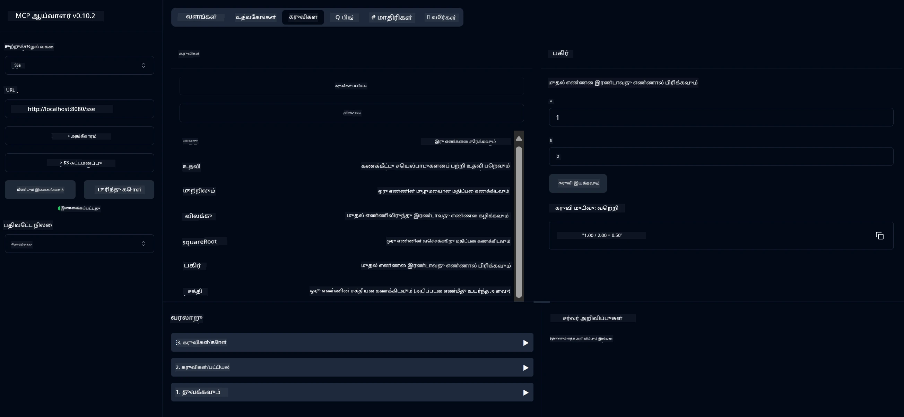

# அடிப்படை கணிகையாளர் MCP சேவை

இந்த சேவை Model Context Protocol (MCP) மூலம் அடிப்படை கணிகையாளர் செயல்பாடுகளை வழங்குகிறது, Spring Boot மற்றும் WebFlux போக்குவரத்துடன். MCP செயல்பாடுகளைப் பற்றி கற்றுக்கொள்வதற்கான தொடக்க நிலை உதாரணமாக இது வடிவமைக்கப்பட்டுள்ளது.

மேலும் தகவலுக்கு, [MCP Server Boot Starter](https://docs.spring.io/spring-ai/reference/api/mcp/mcp-server-boot-starter-docs.html) குறிப்பு ஆவணங்களைப் பார்க்கவும்.

## சேவையைப் பயன்படுத்துவது

இந்த சேவை MCP நெறிமுறையின் மூலம் கீழ்க்காணும் API முடுக்குகளை வெளிப்படுத்துகிறது:

- `add(a, b)`: இரண்டு எண்களை சேர்க்கவும்
- `subtract(a, b)`: முதல் எண்ணிலிருந்து இரண்டாவது எண்ணை கழிக்கவும்
- `multiply(a, b)`: இரண்டு எண்களை பெருக்கவும்
- `divide(a, b)`: முதல் எண்ணை இரண்டாவது எண்ணால் வகுக்கவும் (பூஜ்யத்திற்கான சரிபார்ப்பு உடன்)
- `power(base, exponent)`: ஒரு எண்ணின் சக்தியை கணக்கிடவும்
- `squareRoot(number)`: வேர்ச்சதுரத்தை கணக்கிடவும் (எதிர்மறை எண்ணுக்கான சரிபார்ப்பு உடன்)
- `modulus(a, b)`: வகுத்தபின் மீதமுள்ள மதிப்பை கணக்கிடவும்
- `absolute(number)`: முழுமையான மதிப்பை கணக்கிடவும்

## சார்புகள்

இந்த திட்டத்திற்கு கீழ்க்காணும் முக்கிய சார்புகள் தேவை:

```xml
<dependency>
    <groupId>org.springframework.ai</groupId>
    <artifactId>spring-ai-starter-mcp-server-webflux</artifactId>
</dependency>
```

## திட்டத்தை உருவாக்குவது

Maven பயன்படுத்தி திட்டத்தை உருவாக்கவும்:
```bash
./mvnw clean install -DskipTests
```

## சர்வரை இயக்குவது

### Java பயன்படுத்தி

```bash
java -jar target/calculator-server-0.0.1-SNAPSHOT.jar
```

### MCP Inspector பயன்படுத்தி

MCP Inspector MCP சேவைகளுடன் தொடர்பு கொள்ள உதவும் ஒரு பயனுள்ள கருவியாகும். இந்த கணிகையாளர் சேவையுடன் அதை பயன்படுத்த:

1. **MCP Inspector-ஐ நிறுவி இயக்கவும்** புதிய டெர்மினல் சாளரத்தில்:
   ```bash
   npx @modelcontextprotocol/inspector
   ```

2. **வலை UI-ஐ அணுகவும்**: பயன்பாட்டால் காட்டப்படும் URL-ஐ கிளிக் செய்யவும் (சாதாரணமாக http://localhost:6274)

3. **இணைப்பை அமைக்கவும்**:
   - போக்குவரத்து வகையை "SSE" என அமைக்கவும்
   - உங்கள் இயக்கும் சர்வரின் SSE முடுக்க URL-ஐ அமைக்கவும்: `http://localhost:8080/sse`
   - "Connect" கிளிக் செய்யவும்

4. **கருவிகளைப் பயன்படுத்தவும்**:
   - "List Tools" கிளிக் செய்து கிடைக்கும் கணிகையாளர் செயல்பாடுகளைப் பார்க்கவும்
   - ஒரு கருவியைத் தேர்ந்தெடுத்து "Run Tool" கிளிக் செய்து செயல்பாட்டை இயக்கவும்



---

**குறிப்பு**:  
இந்த ஆவணம் [Co-op Translator](https://github.com/Azure/co-op-translator) என்ற AI மொழிபெயர்ப்பு சேவையைப் பயன்படுத்தி மொழிபெயர்க்கப்பட்டுள்ளது. நாங்கள் துல்லியத்திற்காக முயற்சிக்கிறோம், ஆனால் தானியக்க மொழிபெயர்ப்புகளில் பிழைகள் அல்லது தவறான தகவல்கள் இருக்கக்கூடும் என்பதை தயவுசெய்து கவனத்தில் கொள்ளுங்கள். அதன் தாய்மொழியில் உள்ள மூல ஆவணம் அதிகாரப்பூர்வ ஆதாரமாக கருதப்பட வேண்டும். முக்கியமான தகவல்களுக்கு, தொழில்முறை மனித மொழிபெயர்ப்பு பரிந்துரைக்கப்படுகிறது. இந்த மொழிபெயர்ப்பைப் பயன்படுத்துவதால் ஏற்படும் எந்த தவறான புரிதல்கள் அல்லது தவறான விளக்கங்களுக்கு நாங்கள் பொறுப்பல்ல.