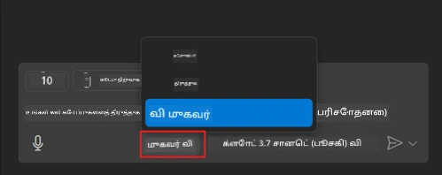
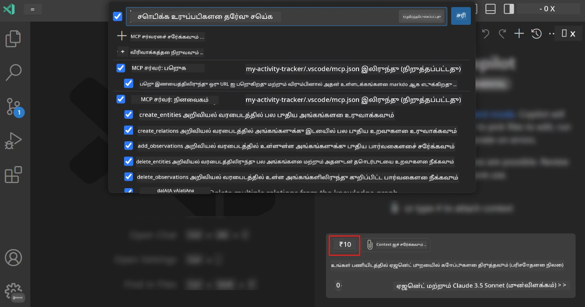
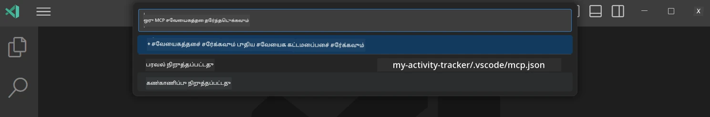
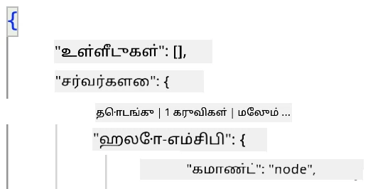
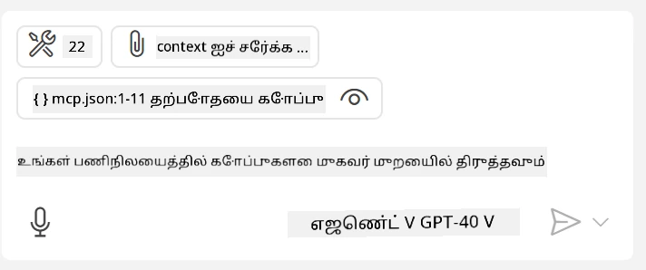

# GitHub Copilot Agent முறையில் சர்வரை பயன்படுத்துதல்

Visual Studio Code மற்றும் GitHub Copilot ஒரு கிளையன்டாக செயல்பட்டு MCP Server-ஐ பயன்படுத்த முடியும். ஏன் இதை செய்ய வேண்டும் என்று நீங்கள் கேட்கலாம். இதன் மூலம் MCP Server-இல் உள்ள அனைத்து அம்சங்களையும் உங்கள் IDE-இல் இருந்து பயன்படுத்த முடியும். உதாரணமாக, GitHub MCP Server-ஐ சேர்த்தால், டெர்மினலில் குறிப்பிட்ட கட்டளைகளை தட்டச்சு செய்வதற்குப் பதிலாக GitHub-ஐ கேள்விகளின் மூலம் கட்டுப்படுத்த முடியும். அல்லது, உங்கள் டெவலப்பர் அனுபவத்தை இயற்கை மொழியின் மூலம் மேம்படுத்தும் ஏதேனும் ஒரு விஷயத்தை கற்பனை செய்யுங்கள். இப்போது நீங்கள் இதன் நன்மையை புரிந்துகொள்கிறீர்களா?

## மேலோட்டம்

இந்த பாடத்தில் Visual Studio Code மற்றும் GitHub Copilot-இன் Agent முறையை MCP Server-க்கு கிளையன்டாக பயன்படுத்துவது பற்றி கற்றுக்கொள்வீர்கள்.

## கற்றல் நோக்கங்கள்

இந்த பாடத்தின் முடிவில், நீங்கள்:

- Visual Studio Code மூலம் MCP Server-ஐ பயன்படுத்த முடியும்.
- GitHub Copilot மூலம் கருவிகளை இயக்க முடியும்.
- MCP Server-ஐ கண்டறிந்து நிர்வகிக்க Visual Studio Code-ஐ அமைக்க முடியும்.

## பயன்பாடு

MCP Server-ஐ நீங்கள் இரண்டு விதங்களில் கட்டுப்படுத்த முடியும்:

- பயனர் இடைமுகம், இது எப்படி செய்யப்படுகிறது என்பதை இந்த அத்தியாயத்தில் பின்னர் காண்பீர்கள்.
- டெர்மினல், `code` செயல்படுத்தல் மூலம் டெர்மினலில் இருந்து MCP Server-ஐ கட்டுப்படுத்த முடியும்:

  MCP Server-ஐ உங்கள் பயனர் சுயவிவரத்தில் சேர்க்க, --add-mcp கட்டளையை பயன்படுத்தவும், மற்றும் JSON Server அமைப்பை {\"name\":\"server-name\",\"command\":...} வடிவத்தில் வழங்கவும்.

  ```
  code --add-mcp "{\"name\":\"my-server\",\"command\": \"uvx\",\"args\": [\"mcp-server-fetch\"]}"
  ```

### ஸ்கிரீன்ஷாட்கள்





விசுவல் இடைமுகத்தை எப்படி பயன்படுத்துவது என்பதை அடுத்த பகுதிகளில் மேலும் பேசுவோம்.

## அணுகுமுறை

இதனை உயர் மட்டத்தில் எப்படி அணுக வேண்டும்:

- MCP Server-ஐ கண்டறிய ஒரு கோப்பை அமைக்கவும்.
- அந்த Server-ஐ தொடங்க/இணைக்கவும், அதன் திறன்களை பட்டியலிடவும்.
- GitHub Copilot Chat இடைமுகத்தின் மூலம் அந்த திறன்களை பயன்படுத்தவும்.

சரி, இப்போது நாங்கள் செயல்முறையை புரிந்துகொண்டோம், Visual Studio Code மூலம் MCP Server-ஐ பயன்படுத்த ஒரு பயிற்சியை முயற்சிக்கலாம்.

## பயிற்சி: சர்வரை பயன்படுத்துதல்

இந்த பயிற்சியில், GitHub Copilot Chat இடைமுகத்தில் MCP Server-ஐ பயன்படுத்த Visual Studio Code-ஐ அமைப்போம்.

### -0- முன்னோட்டம், MCP Server கண்டறிதலை இயக்கவும்

MCP Server-களை கண்டறிதலை இயக்க வேண்டும்.

1. Visual Studio Code-இல் `File -> Preferences -> Settings` செல்லவும்.

1. "MCP" என தேடவும் மற்றும் settings.json கோப்பில் `chat.mcp.discovery.enabled`-ஐ இயக்கவும்.

### -1- கான்பிகரேஷன் கோப்பு உருவாக்கவும்

உங்கள் திட்டத்தின் மூலத்தில் ஒரு கான்பிகரேஷன் கோப்பை உருவாக்கவும், MCP.json எனும் கோப்பை .vscode எனும் கோப்புறையில் வைக்க வேண்டும். இது இவ்வாறு இருக்க வேண்டும்:

```text
.vscode
|-- mcp.json
```

அடுத்ததாக, சர்வர் பதிவை எப்படி சேர்க்கலாம் என்பதை பார்ப்போம்.

### -2- சர்வரை அமைக்கவும்

*mcp.json*-இல் பின்வரும் உள்ளடக்கத்தை சேர்க்கவும்:

```json
{
    "inputs": [],
    "servers": {
       "hello-mcp": {
           "command": "node",
           "args": [
               "build/index.js"
           ]
       }
    }
}
```

Node.js-ல் எழுதப்பட்ட சர்வரை தொடங்க ஒரு எளிய உதாரணம் மேலே உள்ளது, மற்ற ரன்டைம்களுக்கு சர்வரை தொடங்க சரியான கட்டளையை `command` மற்றும் `args` மூலம் குறிப்பிடவும்.

### -3- சர்வரை தொடங்கவும்

நீங்கள் ஒரு பதிவை சேர்த்த பிறகு, சர்வரை தொடங்குவோம்:

1. *mcp.json*-இல் உங்கள் பதிவை கண்டறியவும் மற்றும் "play" ஐகானை கண்டறியவும்:

    

1. "play" ஐகானை கிளிக் செய்யவும், GitHub Copilot Chat கருவி ஐகானில் கிடைக்கும் கருவிகளின் எண்ணிக்கை அதிகரிக்க வேண்டும். அந்த கருவி ஐகானை கிளிக் செய்தால், பதிவு செய்யப்பட்ட கருவிகளின் பட்டியலை காணலாம். GitHub Copilot-ஐ அவற்றை சூழலாக பயன்படுத்த அனுமதிக்க/தடை செய்ய ஒவ்வொரு கருவியையும் தேர்வு செய்யலாம்:

  

1. ஒரு கருவியை இயக்க, உங்கள் கருவிகளின் விளக்கத்திற்கு பொருந்தும் ஒரு கேள்வியை தட்டச்சு செய்யவும், உதாரணமாக "22-ஐ 1-க்கு சேர்க்கவும்" போன்ற கேள்வி:

  

  நீங்கள் 23 என பதிலை காண வேண்டும்.

## பணிக்கட்டளை

*mcp.json* கோப்பில் ஒரு சர்வர் பதிவைச் சேர்க்க முயற்சிக்கவும் மற்றும் சர்வரை தொடங்க/நிறுத்த முடியும் என்பதை உறுதிப்படுத்தவும். GitHub Copilot Chat இடைமுகத்தின் மூலம் உங்கள் சர்வரில் உள்ள கருவிகளுடன் தொடர்பு கொள்ள முடியும் என்பதை உறுதிப்படுத்தவும்.

## தீர்வு

[தீர்வு](./solution/README.md)

## முக்கிய குறிப்புகள்

இந்த அத்தியாயத்தின் முக்கிய குறிப்புகள்:

- Visual Studio Code பல MCP Server-களையும் அவற்றின் கருவிகளையும் பயன்படுத்த ஒரு சிறந்த கிளையன்ட் ஆகும்.
- GitHub Copilot Chat இடைமுகம் சர்வர்களுடன் தொடர்பு கொள்ளும் வழியாகும்.
- *mcp.json* கோப்பில் சர்வர் பதிவை அமைக்கும் போது API கீக்கள் போன்ற உள்ளீடுகளை MCP Server-க்கு அனுப்ப பயனரை கேட்கலாம்.

## மாதிரிகள்

- [Java Calculator](../samples/java/calculator/README.md)
- [.Net Calculator](../../../../03-GettingStarted/samples/csharp)
- [JavaScript Calculator](../samples/javascript/README.md)
- [TypeScript Calculator](../samples/typescript/README.md)
- [Python Calculator](../../../../03-GettingStarted/samples/python)

## கூடுதல் வளங்கள்

- [Visual Studio ஆவணங்கள்](https://code.visualstudio.com/docs/copilot/chat/mcp-servers)

## அடுத்தது என்ன?

- அடுத்தது: [Stdio Server உருவாக்குதல்](../05-stdio-server/README.md)

---

**குறிப்பு**:  
இந்த ஆவணம் [Co-op Translator](https://github.com/Azure/co-op-translator) என்ற AI மொழிபெயர்ப்பு சேவையை பயன்படுத்தி மொழிபெயர்க்கப்பட்டுள்ளது. நாங்கள் துல்லியத்திற்காக முயற்சிக்கின்றோம், ஆனால் தானியங்கி மொழிபெயர்ப்புகளில் பிழைகள் அல்லது தவறான தகவல்கள் இருக்கக்கூடும் என்பதை கவனத்தில் கொள்ளவும். அதன் தாய்மொழியில் உள்ள மூல ஆவணம் அதிகாரப்பூர்வ ஆதாரமாக கருதப்பட வேண்டும். முக்கியமான தகவல்களுக்கு, தொழில்முறை மனித மொழிபெயர்ப்பு பரிந்துரைக்கப்படுகிறது. இந்த மொழிபெயர்ப்பைப் பயன்படுத்துவதால் ஏற்படும் எந்த தவறான புரிதல்கள் அல்லது தவறான விளக்கங்களுக்கு நாங்கள் பொறுப்பல்ல.