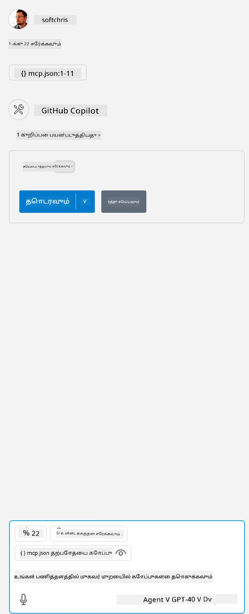

# மாதிரியை இயக்குதல்

இங்கே, நீங்கள் ஏற்கனவே செயல்படும் சர்வர் குறியீடு வைத்திருக்கிறீர்கள் என்று கருதுகிறோம். முந்தைய அத்தியாயங்களில் இருந்து ஒரு சர்வரை கண்டறியவும்.

## mcp.json அமைக்கவும்

உங்கள் குறிப்புக்கு பயன்படுத்தும் கோப்பு இதோ, [mcp.json](../../../../../03-GettingStarted/04-vscode/solution/mcp.json).

சர்வர் உள்ளீட்டை தேவையானபடி மாற்றி, உங்கள் சர்வரின் முழு பாதையைச் சுட்டிக்காட்டவும், அதனை இயக்க தேவையான முழு கட்டளையுடன் சேர்த்து.

மேற்கண்ட உதாரண கோப்பில் சர்வர் உள்ளீடு இவ்வாறு உள்ளது:

<details>
<summary>node.js</summary>
```json
"hello-mcp": {
    "command": "node",
    "args": [
        "build/index.js"
    ]
}
```
</details>

<details>
<summary>.NET</summary>

நீங்கள் GitHub repository root ஐ உள்ளிட வேண்டியிருக்கும், இது `git rev-parse --show-toplevel` என்ற கட்டளையிலிருந்து பெறப்படலாம்.

```jsonc
{
  "inputs": [
    {
      "type": "promptString",
      "id": "repository-root",
      "description": "The absolute path to the repository root"
    }
  ],
  "servers": {
    "calculator-mcp-dotnet": {
      "type": "stdio",
      "command": "dotnet",
      "args": [
        "run",
        "--project",
        "${input:repository-root}/03-GettingStarted/02-client/solution/server/server.csproj"
      ]
    }
  }
}
```

</details>

இது `node build/index.js` போன்ற கட்டளையை இயக்குவதற்கு இணையாக இருக்கும்.

- உங்கள் சர்வர் கோப்பு எங்கு அமைந்துள்ளது அல்லது உங்கள் தேர்ந்தெடுத்த runtime மற்றும் சர்வர் இடம் அடிப்படையில் சர்வரை தொடங்க தேவையானதைப் பொருத்து இந்த சர்வர் உள்ளீட்டை மாற்றவும்.

## சர்வரில் உள்ள அம்சங்களை பயன்படுத்தவும்

- *mcp.json* ஐ *./vscode* கோப்புறையில் சேர்த்த பிறகு, `play` ஐகானை கிளிக் செய்யவும்,

    கிடைக்கும் கருவிகளின் எண்ணிக்கையை அதிகரிக்க டூலிங் ஐகான் மாற்றத்தை கவனிக்கவும். GitHub Copilot இல், டூலிங் ஐகான், உரையாடல் புலத்தின் மேல் உள்ள இடத்தில் உள்ளது.

## ஒரு கருவியை இயக்கவும்

- உங்கள் உரையாடல் சாளரத்தில் உங்கள் கருவியின் விளக்கத்திற்கு பொருந்தும் ஒரு கேள்வியை உள்ளிடவும். உதாரணமாக, `add` கருவியை இயக்க "add 3 to 20" போன்றதை உள்ளிடவும்.

    உங்கள் உரையாடல் உரை பெட்டியின் மேல் ஒரு கருவி இயக்கப்பட வேண்டும் என்று காட்டும் ஒரு கருவி காண்பிக்கப்படும். இது இவ்வாறு இருக்கும்:

    

    கருவியைத் தேர்ந்தெடுப்பது, உங்கள் கேள்வி மேலே குறிப்பிடப்பட்டபடி இருந்தால் "23" என்று ஒரு எண் முடிவை உருவாக்க வேண்டும்.

---

**குறிப்பு**:  
இந்த ஆவணம் [Co-op Translator](https://github.com/Azure/co-op-translator) என்ற AI மொழிபெயர்ப்பு சேவையைப் பயன்படுத்தி மொழிபெயர்க்கப்பட்டுள்ளது. நாங்கள் துல்லியத்திற்காக முயற்சிக்கிறோம், ஆனால் தானியங்கி மொழிபெயர்ப்புகளில் பிழைகள் அல்லது தவறான தகவல்கள் இருக்கக்கூடும் என்பதை கவனத்தில் கொள்ளவும். அதன் தாய்மொழியில் உள்ள மூல ஆவணம் அதிகாரப்பூர்வ ஆதாரமாக கருதப்பட வேண்டும். முக்கியமான தகவல்களுக்கு, தொழில்முறை மனித மொழிபெயர்ப்பு பரிந்துரைக்கப்படுகிறது. இந்த மொழிபெயர்ப்பைப் பயன்படுத்துவதால் ஏற்படும் எந்த தவறான புரிதல்கள் அல்லது தவறான விளக்கங்களுக்கு நாங்கள் பொறுப்பல்ல.