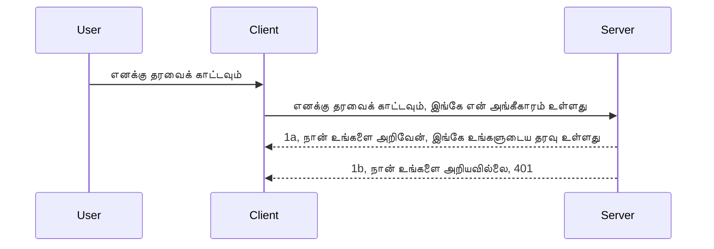

# எளிய அவதாரம்

MCP SDKகள் OAuth 2.1 பயன்பாட்டை ஆதரிக்கின்றன, இது ஒரு சிக்கலான செயல்முறை ஆகும், அதில் அத்தகைகள் சர்வர், வள சர்வர், கடவுச்சொற்களை இடுதல், குறியீட்டை பெறுதல், குறியீட்டை பெயர் டோக்கனுக்காக பரிமாறுதல் போன்ற கருத்துக்கள் அடங்கும், இதனால் நீங்கள் உங்கள் வள தரவைப் பெற முடியும். நீங்கள் OAuthக்கு பழகவில்லை என்றால், இது சிறந்த முறையாக செயல்படுத்த வேண்டிய நல்ல விஷயம் ஆகும், அடிப்படையான கொஞ்சம் அளவுக்கு அவதாரத்தை தொடங்கி, மேலோங்கி வலுவான பாதுகாப்பிற்கு முன்னேறுவது நல்ல யோசனை. அதனால் இந்த அத்தியாயம் உங்களைக் கையாள வைக்கிறது, மேம்பட்ட அவதாரத்திற்கு உங்களை உருவாக்க.

## அவதாரம், அதென்ன?

அவதாரம் என்பது ஆவணப்பிரதிநிதித்துவமும் அங்கீகாரமும் ஆகும். கருத்து என்னவென்றால் நமக்கு இரண்டு விஷயங்களை செய்யவேண்டும்:

- **ஆவணப்பிரதிநிதித்துவம்**: ஒரு நபரை நமது வீட்டில் நுழைய அனுமதிக்க வேண்டுமா என்பதை கண்டறியும் செயல்முறை, அதாவது அந்த நபர் "இங்கே" இருக்க உரிமை உள்ளவரா என்பதைக் கண்டறிதல், அதாவது நமது வள சர்வர் மற்றும் அதன் MCP சர்வர் அம்சங்களுக்கு அணுகல் இருப்பது.
- **அங்கீகாரம்**: ஒரு பயனர் கேட்டுக்கொண்ட குறிப்பிட்ட வளங்களுக்கு அணுகல் வேண்டும் எனும் செயல்முறை, உதாரணமாக இவ்வ注文கள் அல்லது இந்தப் பொருட்கள் அல்லது அவர்கள் உள்ளடக்கத்தை படிக்க அனுமதி உண்டு ஆனால் அழிக்க முடியாது என்பதையும் உள்ளடக்கும்.

## அங்கீகார விவரங்கள்: நம்மைப் பற்றி அமைப்பு எப்படி அறியும்

அனைத்து வலை உருவாக்குநர்கள் பெரும்பாலும் சர்வருக்கு ஒரு அங்கீகாரப் பொருளை அளிப்பதை நினைக்கிறார்கள், பொதுவாக ஒரு ரகசியம், இது அவர்களுக்கு "ஆவணப்பிரதிநிதித்துவம்" கிடைக்காவிட்டால் அனுமதிக்கப்படவில்லை என்பதைக் குறிப்பது. இந்த அங்கீகார பொதுவாக பயன்பாட்டாளர்பெயர் மற்றும் கடவுச்சொல்லின் base64 குறியாக்கப்பட்ட பதிப்பாகும் அல்லது ஒரு API விசையாகும், இது ஒரு தனிப்பட்ட பயனரை அடையாளம் காண்கிறது.

இது "Authorization" என்ற தலைப்பில் அனுப்பப்படுகிறது:

```json
{ "Authorization": "secret123" }
```

இது பொதுவாக அடிப்படைக் அங்கீகாரமாக அழைக்கப்படுகிறது. இப்போது இந்த செயல்முறை எப்படி செயல்படுகிறது என்று பார்ப்போம்:


இப்போது செயல்முறைபடி இது எவ்வாறு செயல்படுகிறது என்பதை புரிந்துகொண்டோம், அதை எவ்வாறு செயல்படுத்துவது? பெரும்பாலான வலை சர்வர்கள் "middleware" என்ற கருத்தை கொண்டுள்ளன, இது கோரிக்கையின் ஒரு பகுதியாக இயக்கப்படும் குறியீடு, இது அங்கீகாரங்களை சரிபார்க்க முடியும், அங்கீகாரம் சரியானதாக இருந்தால் கோரிக்கை கடந்து செல்ல அனுமதிக்கின்றது. அங்கீகாரம் தவறானால், அவதார பிரச்சனையை அனுப்பும். இதை எவ்வாறு செயல்படுத்தலாம் பார்ப்போம்:

**Python**

```python
class AuthMiddleware(BaseHTTPMiddleware):
    async def dispatch(self, request, call_next):

        has_header = request.headers.get("Authorization")
        if not has_header:
            print("-> Missing Authorization header!")
            return Response(status_code=401, content="Unauthorized")

        if not valid_token(has_header):
            print("-> Invalid token!")
            return Response(status_code=403, content="Forbidden")

        print("Valid token, proceeding...")
       
        response = await call_next(request)
        # எந்தவொரு வாடிக்கையாளர் தலைப்புக்களைச் சேர்க்கவும் அல்லது பதிலில் எதாவது மாற்றம் செய்யவும்
        return response


starlette_app.add_middleware(CustomHeaderMiddleware)
```

இதில்:

- `AuthMiddleware` என்ற middlewareவை உருவாக்கினோம், அதன் `dispatch` முறை வலை சர்வரால் அழைக்கப்படுகிறது.
- அந்த middleware உள்ள வலை சர்வரில் சேர்க்கப்பட்டுள்ளது:

    ```python
    starlette_app.add_middleware(AuthMiddleware)
    ```

- `Authorization` தலைப்பு இருக்கிறதா மற்றும் அனுப்பப்பட்ட ரகசி சரிப்பார்க்கப்படுகிறதா எனச் செய்வதற்கான சரிபார்ப்பு முறையை எழுதினோம்:

    ```python
    has_header = request.headers.get("Authorization")
    if not has_header:
        print("-> Missing Authorization header!")
        return Response(status_code=401, content="Unauthorized")

    if not valid_token(has_header):
        print("-> Invalid token!")
        return Response(status_code=403, content="Forbidden")
    ```

    ரகசியம் இருக்குமானால் மற்றும் சரியானதாயின், `call_next` அழைப்பிற்கு அனுமதி தரி, பதிலை மீட்டளிக்கிறோம்.

    ```python
    response = await call_next(request)
    # எந்தவொரு வாடிக்கையாளர் தலைப்புகளையும் சேர்க்கவும் அல்லது பதிலில் எதாவது மாற்றங்களை செய்யவும்
    return response
    ```

இது செயலில் இது ஒரு வலை கோரிக்கை சர்வருக்கு வந்தால் middleware அழைக்கப்படுகிறது, அவரது செயல்பாட்டின்படி கோரிக்கையை அனுமதிக்கவோ இல்லை என்றால் தவறு காட்டிக்கொடுக்கவோ செய்கிறது.

**TypeScript**

இந்த இடத்தில் நாம் பிரபலமான Express கட்டமைப்பைப் பயன்படுத்தி middleware உருவாக்கி, MCP Server-க்கு முன் கோரிக்கையை இடைநிறுத்துகிறோம். கீழே இதற்கான குறியீடு உள்ளது:

```typescript
function isValid(secret) {
    return secret === "secret123";
}

app.use((req, res, next) => {
    // 1. அனுமதி தலைப்பு உள்ளதா?
    if(!req.headers["Authorization"]) {
        res.status(401).send('Unauthorized');
    }
    
    let token = req.headers["Authorization"];

    // 2. செல்லுபடித்தன்மையை சரிபார்க்கவும்.
    if(!isValid(token)) {
        res.status(403).send('Forbidden');
    }

   
    console.log('Middleware executed');
    // 3. கோரிக்கைக் குழாயின் அடுத்த படிக்குச் கோரிக்கையை வழங்குகிறது.
    next();
});
```

இந்த குறியீட்டில்:

1. முதலில் `Authorization` தலைப்பு இருக்கிறதா என்று பார்க்கின்றோம்; இல்லையெனில் 401 தவறு அனுப்புகிறோம்.
2. அங்கீகாரம் செல்லுபடியாகுமா என்று சரிபார்க்கின்றோம்; இல்லையெனில் 403 தவறு அனுப்புகிறோம்.
3. இறுதியில் கோரிக்கை வழிசெயல்நாட்டில் அனுப்பப்பட்டு, கோரப்பட்ட வளத்தை மீட்டளிக்கின்றது.

## பயிற்சி: அவதாரத்தை செயல்படுத்தல்

நாம் இப்போதும் அறிவினை எடுத்துக் கொண்டு செயல்படுத்த முயலுவோம். திட்டம் இதுவாக உள்ளது:

சர்வர்

- ஒரு வலை சர்வர் மற்றும் MCP உருவாக்குக.
- சர்வருக்கு middleware செயல்படுத்துக.

கிளையன்ட்

- அங்கீகாரத்துடன் வலை கோரிக்கை அனுப்புக, தலைப்பின் மூலம்.

### -1- ஒரு வலை சர்வர் மற்றும் MCP உருவாக்குக

முதலாவது படியாக, நாம் வலை சர்வர் இன்ஸ்டன்ஸ் மற்றும் MCP Server உருவாக்க வேண்டும்.

**Python**

இங்கே MCP Server instance உருவாக்கி, starlette வலை செயலியை உருவாக்கி, uvicorn மூலம் ஹோஸ்ட் செய்கிறோம்.

```python
# MCP சர்வர் உருவாக்கப்படுகிறது

app = FastMCP(
    name="MCP Resource Server",
    instructions="Resource Server that validates tokens via Authorization Server introspection",
    host=settings["host"],
    port=settings["port"],
    debug=True
)

# starlette வலை செயலி உருவாக்கப்படுகிறது
starlette_app = app.streamable_http_app()

# uvicorn மூலம் செயலி வழங்கப்படுகிறது
async def run(starlette_app):
    import uvicorn
    config = uvicorn.Config(
            starlette_app,
            host=app.settings.host,
            port=app.settings.port,
            log_level=app.settings.log_level.lower(),
        )
    server = uvicorn.Server(config)
    await server.serve()

run(starlette_app)
```

இந்த குறியீட்டில்:

- MCP Server உருவாக்கி.
- MCP Server இலிருந்து starlette வலை செயலியை கட்டமைத்து `app.streamable_http_app()`.
- uvicorn கொண்டு வலை செயலியை நடத்துகிறோம் `server.serve()`.

**TypeScript**

MCP Server instance இங்கே உருவாக்கப்படுகிறது.

```typescript
const server = new McpServer({
      name: "example-server",
      version: "1.0.0"
    });

    // ... சர்வர் வளங்கள், கருவிகள் மற்றும் கேளிக்கைகள் ஒழுங்கு செய்யவும் ...
```

இந்த MCP Server உருவாக்கல் POST /mcp வழி விளக்கத்தில் இருக்க வேண்டும், அதனால் மேலே குறியீட்டை இப்படிச் செல்லவும் மாற்றுகிறோம்:

```typescript
import express from "express";
import { randomUUID } from "node:crypto";
import { McpServer } from "@modelcontextprotocol/sdk/server/mcp.js";
import { StreamableHTTPServerTransport } from "@modelcontextprotocol/sdk/server/streamableHttp.js";
import { isInitializeRequest } from "@modelcontextprotocol/sdk/types.js"

const app = express();
app.use(express.json());

// செஷன் ஐடியின்படி கப்பல்கள் சேமிக்க வரைபடம்
const transports: { [sessionId: string]: StreamableHTTPServerTransport } = {};

// கிளையன்ட்-தாண்டி-சேவர் தொடர்புக்கான POST கோரிக்கைகளை கையாளவும்
app.post('/mcp', async (req, res) => {
  // ஏற்கனவே உள்ள செஷன் ஐடியை சரிபார்க்கவும்
  const sessionId = req.headers['mcp-session-id'] as string | undefined;
  let transport: StreamableHTTPServerTransport;

  if (sessionId && transports[sessionId]) {
    // ஏற்கனவே உள்ள கப்பலை மறுபயன்படுத்து
    transport = transports[sessionId];
  } else if (!sessionId && isInitializeRequest(req.body)) {
    // புதிய துவக்க கோரிக்கை
    transport = new StreamableHTTPServerTransport({
      sessionIdGenerator: () => randomUUID(),
      onsessioninitialized: (sessionId) => {
        // செஷன் ஐடியின்படி கப்பலை சேமிக்கவும்
        transports[sessionId] = transport;
      },
      // DNS மறுசீரமைப்பு பாதுகாப்பு கள் பாதுகாப்புக்காக இயல்பாக முடக்கப்பட்டுள்ளது. நீங்கள் இந்த சேவையகத்தை
      // உள்ளூரில் இயக்கினால், கீழ்காணும் வசதிகளை அமைக்க வேண்டும்:
      // enableDnsRebindingProtection: true,
      // allowedHosts: ['127.0.0.1'],
    });

    // மூடியபோது கப்பலை சுத்தம் செய்க
    transport.onclose = () => {
      if (transport.sessionId) {
        delete transports[transport.sessionId];
      }
    };
    const server = new McpServer({
      name: "example-server",
      version: "1.0.0"
    });

    // ... சேவையக வளங்கள், கருவிகள் மற்றும் பிரேரணைகள் அமைக்கவும் ...

    // MCP சேவையகத்துடன் இணைக்கவும்
    await server.connect(transport);
  } else {
    // தவறான கோரிக்கை
    res.status(400).json({
      jsonrpc: '2.0',
      error: {
        code: -32000,
        message: 'Bad Request: No valid session ID provided',
      },
      id: null,
    });
    return;
  }

  // கோரிக்கையை கையாளவும்
  await transport.handleRequest(req, res, req.body);
});

// GET மற்றும் DELETE கோரிக்கைகளுக்கான மறுபயன்படுத்தக்கூடிய நிர்வாகி
const handleSessionRequest = async (req: express.Request, res: express.Response) => {
  const sessionId = req.headers['mcp-session-id'] as string | undefined;
  if (!sessionId || !transports[sessionId]) {
    res.status(400).send('Invalid or missing session ID');
    return;
  }
  
  const transport = transports[sessionId];
  await transport.handleRequest(req, res);
};

// SSE மூலம் சேவையகத்திலிருந்து கிளையன்டுக்கு அறிவிப்புகளுக்கு GET கோரிக்கைகளை கையாளவும்
app.get('/mcp', handleSessionRequest);

// செஷன் முடிவுக்கு DELETE கோரிக்கைகளை கையாளவும்
app.delete('/mcp', handleSessionRequest);

app.listen(3000);
```

இதில் MCP Server உருவாக்கல் `app.post("/mcp")` உட்குள் நகர்த்தப்பட்டுள்ளது.

இப்போது middleware உருவாக்க அடுத்த படி போவது.

### -2- சர்வருக்கு middleware செயல்படுத்துக

இப்பொழுது middleware பகுதியை நோக்குவோம். இங்கு `Authorization` தலைப்பில் அங்கீகாரத்தை தேடி சரிபார்க்கும் middleware உருவாக்குவோம். அது ஏற்றுக்கொள்ளப்பட்டால் கோரிக்கை செயல்படுத்தப்படும் (எ.கா., கருவிகள் பட்டியல் காட்டுதல், வளத்தைப் படித்தல் அல்லது கிளையன்ட் கேட்கும் MCP அம்சம்).

**Python**

middleware உருவாக்க `BaseHTTPMiddleware` இருந்து பெறும் வகுப்பை உருவாக்க வேண்டும். இரண்டு முக்கிய கூறுகள் உள்ளன:

- கோரிக்கை `request`, அதிலிருந்து தலைப்பு தகவல் வாசிக்கப்படும்.
- `call_next`, இது அழைக்கப்படும், உண்மையில் மதிப்பாய்வு பட்ட அங்கீகாரம் உள்ளனர் என்றால்.

முதலில், `Authorization` தலைப்பு இல்லையெனில்:

```python
has_header = request.headers.get("Authorization")

# தலைப்பொன்று இல்லை, 401 இல் தோல்வியடையவும், இல்லையெனில் தொடரவும்.
if not has_header:
    print("-> Missing Authorization header!")
    return Response(status_code=401, content="Unauthorized")
```

இங்கு 401 அனுமதி மறுக்கப்பட்டு அனுப்பப்படுகிறது, ஆவண அம்சம் தோல்வியடைந்தது என்பதைக் குறிப்பது.

அடுத்து, அங்கீகாரம் சமர்ப்பிக்கப்பட்டிருந்தால், அதைப் சரிபார்க்க:

```python
 if not valid_token(has_header):
    print("-> Invalid token!")
    return Response(status_code=403, content="Forbidden")
```

இங்கு 403 அனுமதி மறுக்கப்பட்டது அனுப்பப்படுவதை கவனிக்கவும். முழு middleware இங்கே:

```python
class AuthMiddleware(BaseHTTPMiddleware):
    async def dispatch(self, request, call_next):

        has_header = request.headers.get("Authorization")
        if not has_header:
            print("-> Missing Authorization header!")
            return Response(status_code=401, content="Unauthorized")

        if not valid_token(has_header):
            print("-> Invalid token!")
            return Response(status_code=403, content="Forbidden")

        print("Valid token, proceeding...")
        print(f"-> Received {request.method} {request.url}")
        response = await call_next(request)
        response.headers['Custom'] = 'Example'
        return response

```

சிறந்தது, ஆனால் `valid_token` என்ற செயல்பாடு? கீழே உள்ளது:

```python
# உற்பத்திக்காக பயன்படுத்தாதீர்கள் - அதை மேம்படுத்துங்கள் !!
def valid_token(token: str) -> bool:
    # "Bearer " முன்னொட்டியை அகற்றவும்
    if token.startswith("Bearer "):
        token = token[7:]
        return token == "secret-token"
    return False
```

இதனை மேம்படுத்த வேண்டும்.

முக்கியம்: இந்த ரகசியங்களை குறியீட்டில் வைத்துக் கொள்ள கூடாது. அதை தரவுத்தளத்திலோ அல்லது IDP (அடையாள சேவை வழங்குநர்) இலிருந்தோ எடுக்க வேண்டும் அல்லது IDP அது சரிபார்க்க அனுமதிக்க வேண்டும் என்பதில் சிறந்தது.

**TypeScript**

Express உடன் இதை செயல்படுத்த `use` முறையை அழைக்க வேண்டும், இது middleware செயல்பாடுகளை எடுத்துக்கொள்ளும்.

நாம் செய்யவேண்டியது:

- கோரிக்கை மாறியை பயன்படுத்தி `Authorization`தலைப்பில் அனுப்பும் அங்கீகாரத்தை பார்வையிடல்.
- அங்கீகாரத்தை சரிபார்த்து அதை ஏற்றுக்கொண்டு கோரிக்கையை தொடர அனுமதி.

இதோ, `Authorization`தலைப்பு இல்லையெனில் கீழே நிறுத்தப்படுகிறது:

```typescript
if(!req.headers["authorization"]) {
    res.status(401).send('Unauthorized');
    return;
}
```

தலைப்பு இல்லையெனில் 401 பெறுவீர்கள்.

பின்னர், அங்கீகாரம் செல்லுபடியா என்று பார்ப்போம்; இல்லையெனில் 403 தவறு அனுப்பப்படுகிறது:

```typescript
if(!isValid(token)) {
    res.status(403).send('Forbidden');
    return;
} 
```

இப்போது 403 தவறு வந்திருப்பதை கவனிக்கவும்.

முழு குறியீடு கீழே:

```typescript
app.use((req, res, next) => {
    console.log('Request received:', req.method, req.url, req.headers);
    console.log('Headers:', req.headers["authorization"]);
    if(!req.headers["authorization"]) {
        res.status(401).send('Unauthorized');
        return;
    }
    
    let token = req.headers["authorization"];

    if(!isValid(token)) {
        res.status(403).send('Forbidden');
        return;
    }  

    console.log('Middleware executed');
    next();
});
```

கிளையன்ட் தன்னுடைய அங்கீகாரத்தை சர்வர் middleware சரிபார்க்க அமைக்கப்பட்டுள்ளது. அப்படியானால் கிளையன்ட் பக்கம்?

### -3- தலைப்பின் மூலம் அங்கீகாரத்துடன் வலை கோரிக்கை அனுப்பு

பாசாண்டாவை தெளிவாக்க, கிளையன்ட் தலைப்பில் அங்கீகாரத்தை அனுப்ப வேண்டும். MCP கிளையன்ட் பயன்படுத்துவோம் என்றால் அதைக் காணலாம்.

**Python**

கிளையன்ட் பக்கம் இதுபோல் தலைப்பை அனுப்ப வேண்டும்:

```python
# மதிப்பை கடுமையாக குறியாக்கம் செய்ய வேண்டாம், குறைந்தபட்சம் ஒரு சுற்றுச்சூழல் மாறி அல்லது மேலும் பாதுகாப்பான சேமிப்பில் வைத்திருங்கள்
token = "secret-token"

async with streamablehttp_client(
        url = f"http://localhost:{port}/mcp",
        headers = {"Authorization": f"Bearer {token}"}
    ) as (
        read_stream,
        write_stream,
        session_callback,
    ):
        async with ClientSession(
            read_stream,
            write_stream
        ) as session:
            await session.initialize()
      
            # செய்யவேண்டியது, கிளையன்டில் நீங்கள் என்ன செய்ய விரும்புகிறீர்கள், உதா: கருவிகளை பட்டியலிடுங்கள், கருவிகளை அழைக்கவும் போன்றவை.
```

`headers = {"Authorization": f"Bearer {token}"}` இல் தலைப்பை நிரப்புவதை கவனியுங்கள்.

**TypeScript**

இதை இரண்டு படிகளில் செய்யலாம்:

1. அங்கீகாரத்துடன் உள்ள உள்ளமைவு பொருளை நிரப்புக.
2. அந்த உள்ளமைவு பொருளை டிரான்ஸ்போர்ட் க்கு அனுப்புக.

```typescript

// இங்கே காட்டியதைப் போன்ற மதிப்பை கடுமையாக நிரல்பொருளாக்க வேண்டாம். குறைந்தபட்சம் அதை ஒரு சுற்றுச்சூழல் மாறியின் रूपத்தில் வைத்துக்கொண்டு zhv உதவியுடன் பயன்படுத்தவும் (சகாய நிலைப்படி).
let token = "secret123"

// ஒரு கிளையன்ட் போக்குவரத்துக் விருப்ப பொருளை வரையறு
let options: StreamableHTTPClientTransportOptions = {
  sessionId: sessionId,
  requestInit: {
    headers: {
      "Authorization": "secret123"
    }
  }
};

// விருப்ப பொருளை போக்குவரத்திற்கு அனுப்பு
async function main() {
   const transport = new StreamableHTTPClientTransport(
      new URL(serverUrl),
      options
   );
```

மேலே `options` பொருள் உருவாக்கி `requestInit` கீழ் தலைப்புகளை வைத்துள்ளோம்.

முக்கியம்: இதை மேம்படுத்த எப்படி? இப்போதுள்ள நடைமுறை சில சிக்கல்களை கொண்டுள்ளது. முதலாவதாக, இந்தகட்டளையை இப்படிச் அனுப்புவதே அபாயகரம், குறைந்தபட்ச HTTPS இல்லையேல். மேலும் அங்கீகாரத்தை திருடப்படலாம்; ஆகவே டோக்கனை தடுக்கும், எங்கிருந்து வருகிறது என பரிசோதனை செய்யும், கோரிக்கை அதிகமாகவா (bot போல செயல்படு) என்பதை மாதிரிகளுக்கு முன் பாகங்கள் தேவை. 

ஆனால் மிகவும் எளிய API-களுக்கு இது நன்றாக தொடக்கம் ஆகும்.

இதனை மேலும் வலுப்படுத்த JSON Web Token (JWT) என்ற தரநிலை வடிவத்தைப் பயன்படுத்துவோம்.

## JSON Web Token, JWT

எனவே, மிக எளிய அங்கீகாரங்களை விட உயர்ந்த பாதுகாப்பு கொள்கைகள் எங்கே?

- **பாதுகாப்பு மேம்பாடு**: அடிப்படைக் அங்கீகாரத்தில் username மற்றும் password base64 குறியாக்கம் (அல்லது API விசை) முறையே அனுப்பப்படுகிறது; இது அபாயத்தை அதிகரிக்கும். JWT பயன்படுத்தும் போது username, password அனுப்பி, பதிலாக டோக்கனை பெற்று பயன்படுத்துவீர்கள், மேலும் அது கால வரையறுக்கப்பட்டது என்பதாலும் பாதுகாப்பு அதிகரிக்கும். JWT-யில் finely-grained access control (பங்கு, விருப்பங்கள்) எளிதில் செய்யலாம்.
- **Statelessness மற்றும் விரிவாக்கம்**: JWT கள் தானாகவே அனைத்து பயனர் தகவலையும் கொண்டுள்ளன, சர்வர் விளக்கம் தேவை இல்லை. டோக்கன்கள் உள்ளூர் சரிபார்ப்புக்கு வசதியாகும்.
- **இணக்கத்தன்மை மற்றும் கூட்டமைப்பு**: JWT ஆனது Open ID Connect இல் மையம் ஆகும், Entra ID, Google Identity மற்றும் Auth0 போன்ற அடையாள வழங்குநர்களுடன் பயன்படுத்தப்படுகிறது. இது Single Sign On மற்றும் மேலும் பல ஐக்கிய நிறுவனங்களுக்கு ஏற்றதாகும்.
- **தொகுதி மற்றும் திகழ்ப்பு**: JWTகள் Azure API Management, NGINX போன்ற API Gateway களுடன் பயன்படுத்தலாம். இது அழகான அங்கீகார நிலைகள் மற்றும் சர்வர்-சேவை தொடர்புக்களையும் ஆதரிக்கிறது.
- **செயல் திறன் மற்றும் கேச்சிங்**: JWTகளை விஸ்தரிக்காமல் கேச் செய்யலாம், இது மிக அதிக வரவேற்புக்களுடன் செயல்திறனை மேம்படுத்தும்.
- **மேம்பட்ட அம்சங்கள்**: Introspection (சர்வர் valiadtation) மற்றும் revocation (டோக்கன் செல்லாததாக மாற்றுதல்) ஆகியவற்றையும் ஆதரிக்கிறது.

இந்த எல்லா நன்மைகளோடு, நாம் எப்படி நமது செயல்பாட்டை மேம்படுத்தலாம் பார்ப்போம்.

## அடிப்படைக் அங்கீகாரத்தை JWT ஆக மாற்றல்

விஷாலமாக பார்க்க, நாம் செய்யவேண்டியது:

- **JWT டோக்கனைக் கட்டமைக்கறது** மற்றும் கிளையன்ட் சர்வருக்கு அனுப்ப தயாராக செய்ய வேண்டும்.
- **JWT டோக்கன் சரிபார்க்கவும்**, சரியானால் வளங்களை வழங்கவும்.
- **டோக்கன் பாதுகாப்பான சேமிப்பு**.
- **வழிகளை பாதுகாத்தல்**. குறிப்பாக MCP அம்சங்களுக்கு.
- **Refresh tokens சேர்க்கவும்**. குறுகிய ஆயுளுடன் டோக்கன்கள் உருவாக்கி, நீண்ட ஆயுள refresh டோக்கனை அனுமதித்து புதிய டோக்கன்கள் பெறுதல். Refresh முனை மற்றும் மாற்று chiến எSTRATEGY இருக்க வேண்டும்.

### -1- JWT டோக்கன் உருவாக்கல்

JWT டோக்கனுக்கு மூன்று பகுதிகள்:

- **header**: பயன்படுத்தப்பட்ட ஆல்காரிதம் மற்றும் டோக்கன் வகை.
- **payload**: கூறுகள்(sub - பயனர் அல்லது நிறுவனம், exp - காலாவதியான நேரம், role - பங்கு).
- **signature**: ரகசியம் அல்லது தனிப்பட்ட விசை கொண்டு கையொப்பமிடுதல்.

இதற்காக header, payload மற்றும் குறியாக்கம் செய்யப்பட்ட டோக்கன் உருவாக்குவோம்.

**Python**

```python

import jwt
import jwt
from jwt.exceptions import ExpiredSignatureError, InvalidTokenError
import datetime

# JWTக்கு கையெழுத்திட பயன்படுத்தப்படும் ரகசிய விசை
secret_key = 'your-secret-key'

header = {
    "alg": "HS256",
    "typ": "JWT"
}

# பயனர் தகவல் மற்றும் அத accompanies கோரிக்கைகள் மற்றும் காலாவதி நேரம்
payload = {
    "sub": "1234567890",               # பொருள் (பயனர் ஐடி)
    "name": "User Userson",                # தனிப்பயன் கோரிக்கை
    "admin": True,                     # தனிப்பயன் கோரிக்கை
    "iat": datetime.datetime.utcnow(),# வழங்கப்பட்ட தேதி
    "exp": datetime.datetime.utcnow() + datetime.timedelta(hours=1)  # கால அவதி
}

# அதை குறியாக்கம் செய்
encoded_jwt = jwt.encode(payload, secret_key, algorithm="HS256", headers=header)
```

மேலுள்ள குறியீட்டில்:

- HS256 ஆல்காரிதம் மற்றும் JWT வகை header வாக அமைத்தோம்.
- subject/பயனர் ஐடி, பெயர், பங்கு, வெளியீட்டு நேரம் மற்றும் காலாவதி நேரத்துடன் payload உருவாக்கினோம்.

**TypeScript**

JWT டோக்கன் உருவாக்க உதவும் dependency கள்:

```sh

npm install jsonwebtoken
npm install --save-dev @types/jsonwebtoken
```

இதோ இப்போது header, payload உருவாக்கி குறியாக்கப்பட்ட டோக்கன் உருவாக்குவோம்:

```typescript
import jwt from 'jsonwebtoken';

const secretKey = 'your-secret-key'; // உற்பத்தியில் env மாறிகளைக் பயன்படுத்தவும்

// பayload ஐ வரையறுக்கவும்
const payload = {
  sub: '1234567890',
  name: 'User usersson',
  admin: true,
  iat: Math.floor(Date.now() / 1000), // வெளியிட்ட தேதி
  exp: Math.floor(Date.now() / 1000) + 60 * 60 // 1 மணி நேரத்தில் காலாவதி ஆகும்
};

// தலைப்பை வரையறுக்கவும் (விருப்பத்தேர்வு, jsonwebtoken இயல்புநிலைகளை அமைக்கிறது)
const header = {
  alg: 'HS256',
  typ: 'JWT'
};

// டோக்கனை உருவாக்கவும்
const token = jwt.sign(payload, secretKey, {
  algorithm: 'HS256',
  header: header
});

console.log('JWT:', token);
```

இந்த டோக்கன்:

HS256 கொண்டு கையொப்பமிடப்பட்டுள்ளது.
1 மணி நேரத்திற்கு செல்லுபடியாகும்.
sub, name, admin, iat, exp போன்ற கூறுகளை கொண்டுள்ளது.

### -2- டோக்கன் சரிபார்த்தல்

டோக்கனை சரிபார்க்க வேண்டும், இது சர்வரில் செய்யப்படும், கிளையன்ட் அனுப்பும் டோக்கன் செல்லுபடியாகுமா என்பதை உறுதிப்படுத்த.

சரிபார்க்க, டோக்கனை எழுதி அதன் சரிபார்ப்பை தொடங்கவேண்டும்:

**Python**

```python

# JWT ஐ மற்றும் சரிபார்க்க முடிவு செய்யுங்கள்
try:
    decoded = jwt.decode(token, secret_key, algorithms=["HS256"])
    print("✅ Token is valid.")
    print("Decoded claims:")
    for key, value in decoded.items():
        print(f"  {key}: {value}")
except ExpiredSignatureError:
    print("❌ Token has expired.")
except InvalidTokenError as e:
    print(f"❌ Invalid token: {e}")

```

இந்த குறியீட்டில் `jwt.decode` அழைக்கப்படுகிறது, டோக்கன், ரகசிய விசை, ஆல்காரிதம் கொடுத்து. தவறான உரிமை தோன்றினால் தவறை எழுப்ப try-catch பயன்படுத்தப்படுகிறது.

**TypeScript**

இங்கு `jwt.verify` அழைக்கப்படவேண்டும், அது டோக்கனை எழுதி கொடுக்கிறது. தோல்வியாயின் டோக்கன் அமைப்பு தவறானது அல்லது செல்லுபடியாகாது.

```typescript

try {
  const decoded = jwt.verify(token, secretKey);
  console.log('Decoded Payload:', decoded);
} catch (err) {
  console.error('Token verification failed:', err);
}
```

குறிப்பு: மேலே கூறியது போல், பயனரை நம்முடைய கணக்கில் சரிபார்க்கவும், பயனர் உரிமைகளை உறுதிப்படுத்தவும் கூடுதல் சோதனைகள் சேர்க்க வேண்டும்.
அடுத்து, நாம் பாத்திர அடிப்படையினால் அணுகல் கட்டுப்பாடு, இதை RBAC என்னும் பெயராலும் அழைக்கின்றனர், பற்றி பார்ப்போம்.

## பாத்திர அடிப்படையிலான அணுகல் கட்டுப்பாடு சேர்க்குதல்

வாந்தை இந்தக் கருத்து தான், பல்வேறு பாத்திரங்களுக்கு வேறுபட்ட அனுமதிகள் உள்ளன எனக் கூற வேண்டும். உதாரணமாக, ஒரு நிர்வாகி (admin) எல்லாவற்றையும் செய்ய முடியும் என்றும், ஒரு சாதாரண பயனர் படிக்க/எழுதக்கூடும் என்றும், ஒரு விருந்தினர் (guest) மட்டும் படிக்க முடியும் என்றும் நாம் கருதுகிறோம். எனவே, சில சாத்தியமான அனுமதி நிலைகள் இங்கு உள்ளன:

- Admin.Write 
- User.Read
- Guest.Read

இப்படியாக கட்டுப்பாடுகளை எப்படி மிடில்‌வேர் மூலம் செயல்படுத்தலாம் என்று பார்க்கலாம். ஒரு பாதையில் மட்டும் அல்லது அனைத்து பாதைகளுக்கும் மிடில்‌வேர் சேர்க்கலாம்.

**Python**

```python
from starlette.middleware.base import BaseHTTPMiddleware
from starlette.responses import JSONResponse
import jwt

# கோடினுள் ரகசியத்தை வைத்திருக்க வேண்டாம், இது காட்சி நோக்கங்களுக்காக மட்டுமே. பாதுகாப்பான இடத்தில் இருந்து அதை படித்து கொள்ளவும்.
SECRET_KEY = "your-secret-key" # இதை env மாறிலியில் வைக்கவும்
REQUIRED_PERMISSION = "User.Read"

class JWTPermissionMiddleware(BaseHTTPMiddleware):
    async def dispatch(self, request, call_next):
        auth_header = request.headers.get("Authorization")
        if not auth_header or not auth_header.startswith("Bearer "):
            return JSONResponse({"error": "Missing or invalid Authorization header"}, status_code=401)

        token = auth_header.split(" ")[1]
        try:
            decoded = jwt.decode(token, SECRET_KEY, algorithms=["HS256"])
        except jwt.ExpiredSignatureError:
            return JSONResponse({"error": "Token expired"}, status_code=401)
        except jwt.InvalidTokenError:
            return JSONResponse({"error": "Invalid token"}, status_code=401)

        permissions = decoded.get("permissions", [])
        if REQUIRED_PERMISSION not in permissions:
            return JSONResponse({"error": "Permission denied"}, status_code=403)

        request.state.user = decoded
        return await call_next(request)


```

கீழே உள்ள மாதிரி மிடில்‌வேர் சேர்ப்பதற்குப் பல விதிகள் உள்ளன:

```python

# மாற்று 1: ஸ்டார்லெட் பயன்பாட்டை கட்டமைக்கும் போது மிடில்வேர் சேர்க்கவும்
middleware = [
    Middleware(JWTPermissionMiddleware)
]

app = Starlette(routes=routes, middleware=middleware)

# மாற்று 2: ஸ்டார்லெட் பயன்பாடு ஏற்கனவே கட்டமைக்கப்பட்ட பிறகு மிடில்வேர் சேர்க்கவும்
starlette_app.add_middleware(JWTPermissionMiddleware)

# மாற்று 3: ஒவ்வொரு வழித்தடத்திற்கும் மிடில்வேர் சேர்க்கவும்
routes = [
    Route(
        "/mcp",
        endpoint=..., # கையாள்கையாளர்
        middleware=[Middleware(JWTPermissionMiddleware)]
    )
]
```

**TypeScript**

`app.use` மற்றும் அனைத்து கோரிக்கைகளுக்கும் இயங்கும் ஒரு மிடில்‌வேர் பயன்படுத்தலாம். 

```typescript
app.use((req, res, next) => {
    console.log('Request received:', req.method, req.url, req.headers);
    console.log('Headers:', req.headers["authorization"]);

    // 1. அங்கீகாரம் தலைப்பு அனுப்பப்பட்டுள்ளதா என சரிபார்க்கவும்

    if(!req.headers["authorization"]) {
        res.status(401).send('Unauthorized');
        return;
    }
    
    let token = req.headers["authorization"];

    // 2. குறியீடு செல்லுபடியாக உள்ளதா என சரிபார்க்கவும்
    if(!isValid(token)) {
        res.status(403).send('Forbidden');
        return;
    }  

    // 3. குறியீடு பயனர் நமது அமைப்பில் உள்ளதா என சரிபார்க்கவும்
    if(!isExistingUser(token)) {
        res.status(403).send('Forbidden');
        console.log("User does not exist");
        return;
    }
    console.log("User exists");

    // 4. குறியீடுக்கு சரியான அனுமதிகள் உள்ளதா என்று உறுதிசெய்க
    if(!hasScopes(token, ["User.Read"])){
        res.status(403).send('Forbidden - insufficient scopes');
    }

    console.log("User has required scopes");

    console.log('Middleware executed');
    next();
});

```

நமது மிடில்‌வேர் செய்யவேண்டிய, மற்றும் செய்ய *வேண்டும்* என்பதைப்பற்றிய சில முக்கிய அம்சங்கள்:

1. அனுமதி தலைப்பு (authorization header) இருப்பதைச் சரிபார்
2. டோக்கன் (token) செல்லுபடியாக உள்ளதா என பரிசோதிக்க, நாம் எழுதிய `isValid` முறை மூலம் JWT டோக்கன் சரியானது மற்றும் முழுமையா என்பதை பரிசோதிப்போம்.
3. பயனர் எங்கள் முறைமையில் இருக்கிறாரா என்பதை உறுதிப்படுத்துவோம்.

   ```typescript
    // தரவுத்தளத்தில் பயனர்களும்
   const users = [
     "user1",
     "User usersson",
   ]

   function isExistingUser(token) {
     let decodedToken = verifyToken(token);

     // செய்வது, பயனர் தரவுத்தளத்தில் உள்ளதா என்று சரிபார்க்கவும்
     return users.includes(decodedToken?.name || "");
   }
   ```

   மேலே, மிக எளிய `users` பட்டியலை உருவாக்கியுள்ளோம், இது ஒரு தரவுத்தளத்தில் இருக்கவேண்டும் என்பது தெளிவானது.

4. கூடுதலாக, டோக்கனுக்கு சரியான அனுமதிகள் உள்ளதா என்பதைச் சரிபார்.

   ```typescript
   if(!hasScopes(token, ["User.Read"])){
        res.status(403).send('Forbidden - insufficient scopes');
   }
   ```

   மேலே உள்ள மிடில்‌வேர் குறியீட்டில், டோக்கனில் User.Read அனுமதி உள்ளதா என்பதைச் சரிபார்கள், இல்லையெனில் 403 பிழை அனுப்பப்படும். கீழே `hasScopes` உதவியாளர் முறை உள்ளது.

   ```typescript
   function hasScopes(scope: string, requiredScopes: string[]) {
     let decodedToken = verifyToken(scope);
    return requiredScopes.every(scope => decodedToken?.scopes.includes(scope));
  }
   ```

Have a think which additional checks you should be doing, but these are the absolute minimum of checks you should be doing.

Using Express as a web framework is a common choice. There are helpers library when you use JWT so you can write less code.

- `express-jwt`, helper library that provides a middleware that helps decode your token.
- `express-jwt-permissions`, this provides a middleware `guard` that helps check if a certain permission is on the token.

Here's what these libraries can look like when used:

```typescript
const express = require('express');
const jwt = require('express-jwt');
const guard = require('express-jwt-permissions')();

const app = express();
const secretKey = 'your-secret-key'; // put this in env variable

// Decode JWT and attach to req.user
app.use(jwt({ secret: secretKey, algorithms: ['HS256'] }));

// Check for User.Read permission
app.use(guard.check('User.Read'));

// multiple permissions
// app.use(guard.check(['User.Read', 'Admin.Access']));

app.get('/protected', (req, res) => {
  res.json({ message: `Welcome ${req.user.name}` });
});

// Error handler
app.use((err, req, res, next) => {
  if (err.code === 'permission_denied') {
    return res.status(403).send('Forbidden');
  }
  next(err);
});

```

இப்போது நீங்கள் மிடில்‌வேர் அங்கீகரிப்பு மற்றும் அனுமதிக்கு எப்படி பயன்படுத்தப்படலாம் என்பதைப் பார்த்தீர்கள், MCPக்கானது எப்படி, இது எங்கள் அங்கீகரிப்பை மாற்றுமா? அடுத்த பகுதிக்குச் செல்லலாம்.

### -3- MCPக்கு RBAC சேர்த்தல்

வேலை பட்டதற்குப் போதும், நீங்கள் இதுவரை மிடில்‌வேர் மூலம் RBAC சேர்த்தது எப்படி என்று கற்றுக்கொண்டீர்கள், ஆனால் MCPக்கு தனி பாத்திர RBAC சேர்ப்பது எளிதல்ல, அப்பொழுது நாம் என்ன செய்ய வேண்டும்? இங்கே காணப்படுகின்ற குறியீடு அதாவது, ஒரு குறிப்பிட்ட கருவியை அழைக்கும் உரிமையை கிளையன்ட் கொண்டிருக்கிறாரா என்பதைச் சரிபார்க்கும் குறியீடு.

உங்கள் தேவைக்கேற்ப, தனி கருவி RBAC செய்ய சில விருப்பங்கள் உள்ளன, கீழே சில உள்ளன:

- ஒவ்வொரு கருவி, வளம், அல்லது பிராம்ட் இடத்திலும் அனுமதி நிலையைச் சரிபார்க்கும் சரிபார்ப்பு சேர்க்கவும்.

   **python**

   ```python
   @tool()
   def delete_product(id: int):
      try:
          check_permissions(role="Admin.Write", request)
      catch:
        pass # கிளையண்ட் அனுமதியில்முடங்கியது, அனுமதி பிழையை எழுப்புக
   ```

   **typescript**

   ```typescript
   server.registerTool(
    "delete-product",
    {
      title: Delete a product",
      description: "Deletes a product",
      inputSchema: { id: z.number() }
    },
    async ({ id }) => {
      
      try {
        checkPermissions("Admin.Write", request);
        // செய்ய வேண்டியது, productService மற்றும் remote entry க்கு id அனுப்பவும்
      } catch(Exception e) {
        console.log("Authorization error, you're not allowed");  
      }

      return {
        content: [{ type: "text", text: `Deletected product with id ${id}` }]
      };
    }
   );
   ```


- அதிகப்படியான சர்வர் அணுகுமுறை மற்றும் கோரிக்கை கையாளிகள் (request handlers) பயன்படுத்தி சரிபார்க்க வேண்டிய இடங்களை குறைக்கவும்.

   **Python**

   ```python
   
   tool_permission = {
      "create_product": ["User.Write", "Admin.Write"],
      "delete_product": ["Admin.Write"]
   }

   def has_permission(user_permissions, required_permissions) -> bool:
      # user_permissions: பயனருக்கு உள்ள அனுமதிகளின் பட்டியல்
      # required_permissions: கருவிக்கு தேவையான அனுமதிகளின் பட்டியல்
      return any(perm in user_permissions for perm in required_permissions)

   @server.call_tool()
   async def handle_call_tool(
     name: str, arguments: dict[str, str] | None
   ) -> list[types.TextContent]:
    # request.user.permissions என்பது பயனருக்கான அனுமதிகளின் பட்டியலாகக் கருதுங்கள்
     user_permissions = request.user.permissions
     required_permissions = tool_permission.get(name, [])
     if not has_permission(user_permissions, required_permissions):
        # பிழையை எழுப்பு "உங்களுக்கு கருவி {name} ஐ அழைக்க அனுமதி இல்லை"
        raise Exception(f"You don't have permission to call tool {name}")
     # தொடருங்கள் மற்றும் கருவியை அழைக்கவும்
     # ...
   ```   
   

   **TypeScript**

   ```typescript
   function hasPermission(userPermissions: string[], requiredPermissions: string[]): boolean {
       if (!Array.isArray(userPermissions) || !Array.isArray(requiredPermissions)) return false;
       // பயனருக்கு குறைந்த பட்சம் ஒரு தேவையான அனுமதி இருந்தால் உண்மை திருப்பவும்
       
       return requiredPermissions.some(perm => userPermissions.includes(perm));
   }
  
   server.setRequestHandler(CallToolRequestSchema, async (request) => {
      const { params: { name } } = request;
  
      let permissions = request.user.permissions;
  
      if (!hasPermission(permissions, toolPermissions[name])) {
         return new Error(`You don't have permission to call ${name}`);
      }
  
      // தொடருங்கள்..
   });
   ```

   நினைவில் வையுங்கள், உங்கள் மிடில்‌வேர் கோரிக்கையின் user பண்புக்கு டோக்கன் பகுப்பாய்வு செய்து ஒதுக்க வேண்டும், இதனால் மேலே உள்ள குறியீடு எளிதாக இருக்கும்.

### சுருக்கமாக

பொதுவாக, மற்றும் MCPக்காக RBAC சேர்ப்பது எப்படி என்று நாம் விவாதித்துவிட்டோம், இப்போது நீங்கள் பாதுகாப்பை உங்கள் முறையில் செயல்படுத்த முயற்சிக்க நேரம் வந்துவிட்டது, இதனால் நீங்கள் முன்வைக்கப்பட்ட கருத்துக்களைப் புரிந்திருப்பீர்கள் என்று உறுதிசெய்யலாம்.

## பணிகள் 1: அடிப்படையான அங்கீகாரத்தை (basic authentication) பயன்படுத்தி mcp சர்வர் மற்றும் mcp கிளையன்ட் கட்டமைக்கவும்

இங்கே நீங்கள் தலைப்புகளில் அங்கீகார விவரங்களை அனுப்புவது எப்படி என்ற 것을 கற்றுக்கொண்டீர்கள்.

## தீர்வு 1

[Solution 1](./code/basic/README.md)

## பணிகள் 2: பணிகள் 1ல் இருந்து JWTயைப் பயன்படுத்த புதுப்பிப்பு செய்யவும்

முதற் தீர்வைப் பயன்படுத்திக் கொண்டு, இப்போது அதனை மேம்படுத்துவோம்.

அடிப்படையான அங்கீகாரத்தைப் பதிலாக JWT பயன்படுத்துவோம்.

## தீர்வு 2

[Solution 2](./solution/jwt-solution/README.md)

## சவால்

"MCPக்கு RBAC சேர்ப்பது" பகுதிக்குள் விவரிக்கப்பட்டுள்ள ஒவ்வொரு கருவிக்கும் RBAC சேர்க்கவும்.

## சுருக்கம்

இந்த அத்தியாயத்தில், எந்த பாதுகாப்பும் இல்லாதது முதல் அடிப்படையான பாதுகாப்பு மற்றும் JWT மற்றும் அதனை MCPக்கு எப்படி சேர்க்கலாம் என்பதை நீங்கள் கற்றிருப்பீர்கள் என்று நம்புகிறோம்.

நாம் தனிப்பயன் JWTக்களுடன் ஒரு வலுவான அடித்தளத்தை கட்டியுள்ளோம், ஆனால் பரிசரிப்பு வளர்ந்தால், நாம் ஒரு தரநிலை அடிப்படையிலான அடையாள மாதிரிக்கு நகர்ந்துகொண்டிருக்கிறோம். Entra அல்லது Keycloak போன்ற IdPஐ ஏற்றுக்கொள்வதால் டோக்கன் வழங்கல், சரிபார்ப்பு மற்றும் வாழ்க்கைவழி மேலாண்மை நம்பகமான தளத்துக்கு இடமாற்றப்படுகின்றன — இதனால் நாம் பயன்பாட்டின் கூறல் மற்றும் பயனர் அனுபவத்தில் கவனம் செலுத்தலாம்.

அதற்காக, நமக்கு [Entra குறித்த ஒரு மேம்பட்ட அத்தியாயம்](../../05-AdvancedTopics/mcp-security-entra/README.md) உள்ளது.

## அடுத்து என்ன

- அடுத்து: [MCP ஹோஸ்ட்களை அமைக்குதல்](../12-mcp-hosts/README.md)

---

<!-- CO-OP TRANSLATOR DISCLAIMER START -->
**எச்சரிக்கை**:  
இந்த ஆவணம் AI மொழிபெயர்ப்பு சேவை [Co-op Translator](https://github.com/Azure/co-op-translator) பயன்படுத்தி மொழிபெயர்க்கப்பட்டது. நாம் துல்லியத்திற்காகச் சிரமப்படுகிறோம் என்றாலும், தானாக செய்யப்படும் மொழிபெயர்ப்புகளில் தவறுகள் அல்லது பிழைகள் இருக்கக்கூடும் என்பதைக் கருத்தில் கொள்ளவும். பூர்வீக மொழியிலுள்ள முதற் ஆவணம் அதிகாரப்பூர்வ ஆதாரமாக கருதப்பட வேண்டும். முக்கியமான தகவல்களுக்கு, தொழில்முறை மனித மொழிபெயர்ப்பை பரிந்துரைக்கிறோம். இந்த மொழிபெயர்ப்பின் பயன்பாட்டினால் ஏற்பட்ட எந்த தவறுப் புரிதல் அல்லது தவறான விளக்கங்களுக்கு நாம் பொறுப்பானவர்கள் அல்ல.
<!-- CO-OP TRANSLATOR DISCLAIMER END -->