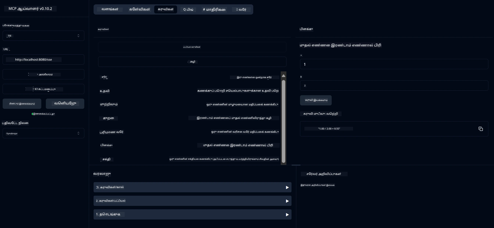

# அடிப்படை கணிகையாளர் MCP சேவை

இந்த சேவை Model Context Protocol (MCP) மூலம் அடிப்படை கணிகையாளர் செயல்பாடுகளை வழங்குகிறது, Spring Boot மற்றும் WebFlux போக்குவரத்து பயன்படுத்தி. MCP செயல்பாடுகளை அறிந்து கொள்ளும் தொடக்க நிலை பயிற்சியாளர்களுக்கு இது ஒரு எளிய உதாரணமாக வடிவமைக்கப்பட்டுள்ளது.

மேலும் தகவலுக்கு, [MCP Server Boot Starter](https://docs.spring.io/spring-ai/reference/api/mcp/mcp-server-boot-starter-docs.html) குறிப்பு ஆவணத்தை பார்க்கவும்.

## மேற்பார்வை

இந்த சேவை பின்வரும் அம்சங்களை வெளிப்படுத்துகிறது:
- SSE (Server-Sent Events) ஆதரவு
- Spring AI இன் `@Tool` அடையாளத்தை பயன்படுத்தி தானியங்கி கருவி பதிவு
- அடிப்படை கணிகையாளர் செயல்பாடுகள்:
  - கூட்டல், கழித்தல், பெருக்கல், வகுத்தல்
  - சக்தி கணக்கீடு மற்றும் சதுர வேர்
  - மீதி (modulus) மற்றும் முழுமையான மதிப்பு
  - செயல்பாடுகளின் விளக்கத்திற்கான உதவி செயல்பாடு

## அம்சங்கள்

இந்த கணிகையாளர் சேவை பின்வரும் திறன்களை வழங்குகிறது:

1. **அடிப்படை கணித செயல்பாடுகள்**:
   - இரண்டு எண்களை கூட்டுதல்
   - ஒரு எண்ணிலிருந்து மற்றொன்றை கழித்தல்
   - இரண்டு எண்களை பெருக்குதல்
   - ஒரு எண்ணை மற்றொன்றால் வகுத்தல் (பூஜ்யம் வகுத்தல் சரிபார்ப்பு உடன்)

2. **மேம்பட்ட செயல்பாடுகள்**:
   - சக்தி கணக்கீடு (ஒரு அடிப்படை எண்ணை ஒரு எக்ஸ்போனெண்ட் வரை உயர்த்துதல்)
   - சதுர வேர் கணக்கீடு (எதிர்மறை எண் சரிபார்ப்பு உடன்)
   - மீதி (modulus) கணக்கீடு
   - முழுமையான மதிப்பு கணக்கீடு

3. **உதவி அமைப்பு**:
   - கிடைக்கும் அனைத்து செயல்பாடுகளின் விளக்கத்தை வழங்கும் உள்ளமைக்கப்பட்ட உதவி செயல்பாடு

## சேவையை பயன்படுத்துதல்

இந்த சேவை MCP நெறிமுறையின் மூலம் பின்வரும் API முடுக்குகளை வெளிப்படுத்துகிறது:

- `add(a, b)`: இரண்டு எண்களை கூட்டுதல்
- `subtract(a, b)`: முதல் எண்ணிலிருந்து இரண்டாவது எண்ணை கழித்தல்
- `multiply(a, b)`: இரண்டு எண்களை பெருக்குதல்
- `divide(a, b)`: முதல் எண்ணை இரண்டாவது எண்ணால் வகுத்தல் (பூஜ்யம் சரிபார்ப்பு உடன்)
- `power(base, exponent)`: ஒரு எண்ணின் சக்தியை கணக்கிடுதல்
- `squareRoot(number)`: சதுர வேர் கணக்கிடுதல் (எதிர்மறை எண் சரிபார்ப்பு உடன்)
- `modulus(a, b)`: வகுத்தல் போது மீதியை கணக்கிடுதல்
- `absolute(number)`: முழுமையான மதிப்பை கணக்கிடுதல்
- `help()`: கிடைக்கும் செயல்பாடுகள் பற்றிய தகவலை பெறுதல்

## சோதனை கிளையன்ட்

`com.microsoft.mcp.sample.client` தொகுப்பில் ஒரு எளிய சோதனை கிளையன்ட் சேர்க்கப்பட்டுள்ளது. `SampleCalculatorClient` வகுப்பு கணிகையாளர் சேவையின் கிடைக்கும் செயல்பாடுகளை விளக்குகிறது.

## LangChain4j கிளையன்டை பயன்படுத்துதல்

இந்த திட்டத்தில் `com.microsoft.mcp.sample.client.LangChain4jClient` என்ற LangChain4j உதாரண கிளையன்ட் சேர்க்கப்பட்டுள்ளது, இது LangChain4j மற்றும் GitHub மாதிரிகளுடன் கணிகையாளர் சேவையை ஒருங்கிணைப்பதை விளக்குகிறது:

### முன்பதிவுகள்

1. **GitHub டோக்கன் அமைப்பு**:
   
   GitHub இன் AI மாதிரிகளை (phi-4 போன்ற) பயன்படுத்த, GitHub தனிப்பட்ட அணுகல் டோக்கன் தேவை:

   a. உங்கள் GitHub கணக்கு அமைப்புகளுக்கு செல்லவும்: https://github.com/settings/tokens
   
   b. "Generate new token" → "Generate new token (classic)" என்பதைக் கிளிக் செய்யவும்
   
   c. உங்கள் டோக்கனுக்கு ஒரு விளக்கமான பெயரை கொடுக்கவும்
   
   d. பின்வரும் அளவுருக்களை தேர்ந்தெடுக்கவும்:
      - `repo` (தனியார் களஞ்சியங்களுக்கு முழு கட்டுப்பாடு)
      - `read:org` (அமைப்பு மற்றும் குழு உறுப்பினர் படிப்பதற்கான அனுமதி, அமைப்பு திட்டங்களை படிக்க)
      - `gist` (gists உருவாக்க)
      - `user:email` (பயனர் மின்னஞ்சல் முகவரிகளை அணுக (படிக்க மட்டும்))
   
   e. "Generate token" என்பதைக் கிளிக் செய்து உங்கள் புதிய டோக்கனை நகலெடுக்கவும்
   
   f. அதை ஒரு சூழல் மாறியாக அமைக்கவும்:
      
      Windows இல்:
      ```
      set GITHUB_TOKEN=your-github-token
      ```
      
      macOS/Linux இல்:
      ```bash
      export GITHUB_TOKEN=your-github-token
      ```

   g. நிரந்தர அமைப்புக்காக, உங்கள் சூழல் மாறிகளில் அமைப்புகளைச் சேர்க்கவும்

2. LangChain4j GitHub சார்பை உங்கள் திட்டத்தில் சேர்க்கவும் (pom.xml இல் ஏற்கனவே சேர்க்கப்பட்டுள்ளது):
   ```xml
   <dependency>
       <groupId>dev.langchain4j</groupId>
       <artifactId>langchain4j-github</artifactId>
       <version>${langchain4j.version}</version>
   </dependency>
   ```

3. கணிகையாளர் சேவையகம் `localhost:8080` இல் இயங்குவதை உறுதிப்படுத்தவும்

### LangChain4j கிளையன்டை இயக்குதல்

இந்த உதாரணம் பின்வருவதை விளக்குகிறது:
- SSE போக்குவரத்து மூலம் கணிகையாளர் MCP சேவையகத்துடன் இணைப்பு
- LangChain4j ஐ பயன்படுத்தி கணிகையாளர் செயல்பாடுகளை பயன்படுத்தும் ஒரு உரையாடல் பாட்டை உருவாக்குதல்
- GitHub AI மாதிரிகளுடன் ஒருங்கிணைத்தல் (இப்போது phi-4 மாதிரியை பயன்படுத்துகிறது)

கிளையன்ட் பின்வரும் மாதிரி கேள்விகளை அனுப்புகிறது செயல்பாடுகளை விளக்க:
1. இரண்டு எண்களின் கூட்டல் கணக்கிடுதல்
2. ஒரு எண்ணின் சதுர வேர் கண்டறிதல்
3. கிடைக்கும் கணிகையாளர் செயல்பாடுகள் பற்றிய உதவி தகவலைப் பெறுதல்

உதாரணத்தை இயக்கி, AI மாதிரி கணிகையாளர் கருவிகளைப் பயன்படுத்தி கேள்விகளுக்கு எப்படி பதிலளிக்கிறது என்பதை கண்டறிய கான்சோல் வெளியீட்டைச் சரிபார்க்கவும்.

### GitHub மாதிரி அமைப்பு

LangChain4j கிளையன்ட் GitHub இன் phi-4 மாதிரியை பின்வரும் அமைப்புகளுடன் பயன்படுத்த வடிவமைக்கப்பட்டுள்ளது:

```java
ChatLanguageModel model = GitHubChatModel.builder()
    .apiKey(System.getenv("GITHUB_TOKEN"))
    .timeout(Duration.ofSeconds(60))
    .modelName("phi-4")
    .logRequests(true)
    .logResponses(true)
    .build();
```

வேறு GitHub மாதிரிகளைப் பயன்படுத்த, `modelName` அளவுருவை மற்றொரு ஆதரிக்கப்பட்ட மாதிரிக்கு மாற்றவும் (எ.கா., "claude-3-haiku-20240307", "llama-3-70b-8192", போன்றவை).

## சார்புகள்

இந்த திட்டத்திற்கு பின்வரும் முக்கிய சார்புகள் தேவை:

```xml
<!-- For MCP Server -->
<dependency>
    <groupId>org.springframework.ai</groupId>
    <artifactId>spring-ai-starter-mcp-server-webflux</artifactId>
</dependency>

<!-- For LangChain4j integration -->
<dependency>
    <groupId>dev.langchain4j</groupId>
    <artifactId>langchain4j-mcp</artifactId>
    <version>${langchain4j.version}</version>
</dependency>

<!-- For GitHub models support -->
<dependency>
    <groupId>dev.langchain4j</groupId>
    <artifactId>langchain4j-github</artifactId>
    <version>${langchain4j.version}</version>
</dependency>
```

## திட்டத்தை கட்டமைத்தல்

Maven பயன்படுத்தி திட்டத்தை கட்டமைக்கவும்:
```bash
./mvnw clean install -DskipTests
```

## சேவையகத்தை இயக்குதல்

### Java பயன்படுத்துதல்

```bash
java -jar target/calculator-server-0.0.1-SNAPSHOT.jar
```

### MCP Inspector பயன்படுத்துதல்

MCP Inspector MCP சேவைகளுடன் தொடர்பு கொள்ள உதவும் ஒரு பயனுள்ள கருவியாகும். இந்த கணிகையாளர் சேவையுடன் அதை பயன்படுத்த:

1. **MCP Inspector ஐ நிறுவி புதிய டெர்மினல் சாளரத்தில் இயக்கவும்**:
   ```bash
   npx @modelcontextprotocol/inspector
   ```

2. **வலை UI ஐ அணுகவும்**: பயன்பாட்டால் காட்டப்படும் URL ஐ கிளிக் செய்யவும் (சாதாரணமாக http://localhost:6274)

3. **இணைப்பை அமைக்கவும்**:
   - போக்குவரத்து வகையை "SSE" ஆக அமைக்கவும்
   - உங்கள் இயங்கும் சேவையகத்தின் SSE முடுக்க URL ஐ அமைக்கவும்: `http://localhost:8080/sse`
   - "Connect" என்பதைக் கிளிக் செய்யவும்

4. **கருவிகளை பயன்படுத்தவும்**:
   - "List Tools" என்பதைக் கிளிக் செய்து கிடைக்கும் கணிகையாளர் செயல்பாடுகளைப் பார்க்கவும்
   - ஒரு கருவியைத் தேர்ந்தெடுத்து "Run Tool" என்பதைக் கிளிக் செய்து ஒரு செயல்பாட்டை இயக்கவும்



### Docker பயன்படுத்துதல்

இந்த திட்டத்தில் கெண்டைனர்மயமாக்கப்பட்ட பிரசுரத்திற்கான Dockerfile சேர்க்கப்பட்டுள்ளது:

1. **Docker படத்தை கட்டமைக்கவும்**:
   ```bash
   docker build -t calculator-mcp-service .
   ```

2. **Docker கெண்டைனரை இயக்கவும்**:
   ```bash
   docker run -p 8080:8080 calculator-mcp-service
   ```

இது:
- Maven 3.9.9 மற்றும் Eclipse Temurin 24 JDK உடன் பல நிலை Docker படத்தை கட்டமைக்கிறது
- மேம்படுத்தப்பட்ட கெண்டைனர் படத்தை உருவாக்குகிறது
- சேவையை 8080 போர்டில் வெளிப்படுத்துகிறது
- கெண்டைனரின் உள்ளே MCP கணிகையாளர் சேவையை தொடங்குகிறது

கெண்டைனர் இயங்கும் போது சேவையை `http://localhost:8080` இல் அணுகலாம்.

## சிக்கல்களை சரிசெய்தல்

### GitHub டோக்கன் தொடர்பான பொதுவான பிரச்சினைகள்

1. **டோக்கன் அனுமதி பிரச்சினைகள்**: 403 Forbidden பிழை வந்தால், உங்கள் டோக்கனுக்கு முன்பதிவுகளில் குறிப்பிடப்பட்ட சரியான அனுமதிகள் உள்ளதா என்பதை சரிபார்க்கவும்.

2. **டோக்கன் காணப்படவில்லை**: "No API key found" பிழை வந்தால், GITHUB_TOKEN சூழல் மாறி சரியாக அமைக்கப்பட்டுள்ளதா என்பதை உறுதிப்படுத்தவும்.

3. **விகித வரம்பு**: GitHub API விகித வரம்புகள் உள்ளன. விகித வரம்பு பிழை (நிலை குறியீடு 429) வந்தால், சில நிமிடங்கள் காத்திருந்து மீண்டும் முயற்சிக்கவும்.

4. **டோக்கன் காலாவதியாகுதல்**: GitHub டோக்கன்கள் காலாவதியாகலாம். சில நேரம் பிழைகள் வந்தால், புதிய டோக்கனை உருவாக்கி உங்கள் சூழல் மாறியைப் புதுப்பிக்கவும்.

மேலும் உதவிக்கு, [LangChain4j ஆவணம்](https://github.com/langchain4j/langchain4j) அல்லது [GitHub API ஆவணம்](https://docs.github.com/en/rest) பார்க்கவும்.

---

**குறிப்பு**:  
இந்த ஆவணம் [Co-op Translator](https://github.com/Azure/co-op-translator) என்ற AI மொழிபெயர்ப்பு சேவையைப் பயன்படுத்தி மொழிபெயர்க்கப்பட்டுள்ளது. நாங்கள் துல்லியத்திற்காக முயற்சிக்கின்றோம், ஆனால் தானியங்கி மொழிபெயர்ப்புகளில் பிழைகள் அல்லது தவறான தகவல்கள் இருக்கக்கூடும் என்பதை கவனத்தில் கொள்ளவும். அதன் தாய்மொழியில் உள்ள மூல ஆவணம் அதிகாரப்பூர்வ ஆதாரமாக கருதப்பட வேண்டும். முக்கியமான தகவல்களுக்கு, தொழில்முறை மனித மொழிபெயர்ப்பு பரிந்துரைக்கப்படுகிறது. இந்த மொழிபெயர்ப்பைப் பயன்படுத்துவதால் ஏற்படும் எந்த தவறான புரிதல்கள் அல்லது தவறான விளக்கங்களுக்கு நாங்கள் பொறுப்பல்ல.