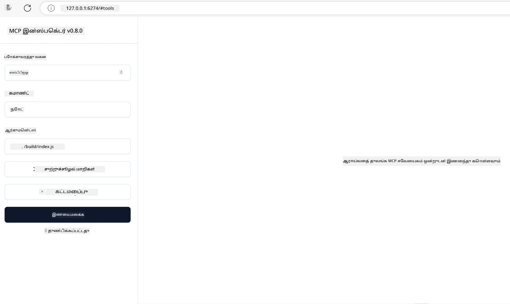

# நடைமுறை அமல்

[](https://youtu.be/vCN9-mKBDfQ)

_(இந்த பாடத்தின் வீடியோவைப் பார்க்க மேலுள்ள படத்தை கிளிக் செய்க)_

நடைமுறை அமல் என்பது மாதிரி சூழல் நெறிமுறை (MCP) சக்தி உணரக்கூடிய இடமாகும். MCP பின்னணியில் உள்ள கருத்தியலும் கட்டமைப்பும் புரிந்து கொள்வது முக்கியமானபோதிலும், உண்மையான மதிப்பு நீங்கள் இந்த கருத்துக்களை பயன்படுத்தி உலகத் தொடர்புடைய பிரச்சனைகளை தீர்க்கும் தீர்வுகளை உருவாக்கி, சோதித்து, வெளியிடும் போது வெளிப்படுகிறது. இந்த அத்தியாயம் கருத்தியல் அறிவையும் பயிற்சி வளர்ச்சியையும் இணைத்து, MCP-அடிப்படையிலான செயலிகளைக் கொண்டு வரும் செயல்முறையை வழிநடத்துகிறது.

நீங்கள் நுண்ணறிவு உதவியாளர்களை உருவாக்கினாலும், AI-ஐ வணிக பணிச்சூழல்களில் இணைத்தாலும், அல்லது தரவு செயலாக்கத்துக்கான தனிப்பயன் கருவிகளை உருவாக்கினாலும், MCP ஒரு நெகிழ்வான அடித்தளத்தை வழங்குகிறது. அதன் மொழியின்மை வடிவமைப்பு மற்றும் பிரபலமான நிரலாக்க மொழிகளுக்கான அதிகாரப்பூர்வ SDKகள் பலவிதமான வரைபட வியாபாரிகளுடனும் பயன்பாட்டுக்குரியதாக்கின்றன. இவற்றைப் பயன்படுத்தி, நீங்கள் விரைவில் மாடல் உருவாக்கி, திருத்தி, மற்றும் உங்கள் தீர்வுகளை பல்வேறு தளங்களிலும் சூழல்களிலும் பரிமாற்றி வெற்றிகரமாக வளர்க்கலாம்.

பின்வரும் பகுதிகளில், MCPஐ C#, Java with Spring, TypeScript, JavaScript, மற்றும் Python ஆகிய மொழிகளில் எப்படி செயல்படுத்துவது என்பது பற்றிய நடைமுறை உதாரணங்கள், மாதிரி குறியீடு, மற்றும் வெளியீடு தந்திரங்கள் காணலாம். MCP சேவையகங்களை தப்பிப்பதையும் சோதிப்பதையும், APIகளை முகாமையிடுவதையும் மற்றும் Azureஐப் பயன்படுத்தி மேகத்தில் தீர்வுகளை வெளியிடுவதையும் நீங்கள் கற்றுக்கொள்ள வேண்டும். இவை உங்களுக்கான பயிற்சியைக் வேகமாக்குகின்றன மற்றும் உறுதியான, தயாராவற்ற MCP செயலிகளை நம்பிக்கையுடன் கட்டுவதற்கு உதவுகின்றன.

## அறிமுகம்

இந்த பாடம் பல நிரலாக்க மொழிகளில் MCP செயலாக்கத்தின் நடைமுறை அம்சங்களைக் குறித்து கவனம் செலுத்துகிறது. C#, Java with Spring, TypeScript, JavaScript மற்றும் Python ஆகியவற்றில் MCP SDKகளைப் பயன்படுத்தி உறுதியான செயலிகளை உருவாக்குவது, MCP சேவையகங்களை தப்பிப்பது மற்றும் சோதிப்பது, மற்றும் மறுபயன்பாடு செய்யக்கூடிய வளங்கள், மூலம் செய்திகள் மற்றும் கருவிகளைக் உருவாக்குவது ஆகியவற்றைக் காண்போம்.

## கற்றல் நோக்கங்கள்

இந்த பாடத்தின் முடிவில் நீங்கள்:

- அதிகாரப்பூர்வ SDKகளைப் பயன்படுத்தி பல நிரலாக்க மொழிகளிலும் MCP தீர்வுகளை செயல்படுத்த முடியும்
- MCP சேவையகங்களை தொகுக்க மற்றும் சோதிக்க திறன்மிக்க முறையில் செயல்பட முடியும்
- சேவை அம்சங்களை (வளங்கள், மூலம் செய்திகள், மற்றும் கருவிகள்) உருவாக்கி பயன்படுத்த முடியும்
- சிக்கலான பணிகளுக்கான MCP பணிச்சூழல்களை வடிவமைக்க முடியும்
- செயல்திறன் மற்றும் நம்பகத்தன்மைக்காக MCP செயலாக்கங்களை மேம்படுத்த முடியும்

## அதிகாரப்பூர்வ SDK வளங்கள்

மாதிரி சூழல் நெறிமுறை பல மொழிக்கான அதிகாரப்பூர்வ SDKகளை வழங்குகிறது ([MCP விவரக்குறிப்பு 2025-11-25](https://spec.modelcontextprotocol.io/specification/2025-11-25/) உடன் இணங்குவதாக):

- [C# SDK](https://github.com/modelcontextprotocol/csharp-sdk)
- [Java with Spring SDK](https://github.com/modelcontextprotocol/java-sdk) **குறிப்பு:** இது [Project Reactor](https://projectreactor.io) மீது சார்ந்திருக்கிறது. (பார்க்கவும் [ஆழ்ந்த பேச்சு 246](https://github.com/orgs/modelcontextprotocol/discussions/246).)
- [TypeScript SDK](https://github.com/modelcontextprotocol/typescript-sdk)
- [Python SDK](https://github.com/modelcontextprotocol/python-sdk)
- [Kotlin SDK](https://github.com/modelcontextprotocol/kotlin-sdk)
- [Go SDK](https://github.com/modelcontextprotocol/go-sdk)

## MCP SDKகளுடன் பணியாற்றுதல்

இந்த பகுதி பல நிரலாக்க மொழிகளில் MCP செயலாக்கத்தின் நடைமுறை உதாரணங்களை வழங்குகிறது. `samples` அடைவு மொழி வாரியான மாதிரி குறியீடுகளை கொண்டுள்ளது.

### கிடைக்கும் மாதிரிகள்

கீழ் உள்ள மொழிகளில் [மாதிரி செயலாக்கங்கள்](../../../04-PracticalImplementation/samples) உள்ளன:

- [C#](./samples/csharp/README.md)
- [Java with Spring](./samples/java/containerapp/README.md)
- [TypeScript](./samples/typescript/README.md)
- [JavaScript](./samples/javascript/README.md)
- [Python](./samples/python/README.md)

ஒவ்வொரு மாதிரியும் அந்த மொழிக்கும் சூழலுக்கும் சார்ந்த MCP அடிப்படைக் கருத்துக்களையும் செயலாக்க முறைகளையும் வெளிப்படுத்துகிறது.

### நடைமுறை வழிகாட்டிகள்

மேல் நடைமுறை MCP செயலாக்கத்திற்கான கூடுதல் வழிகாட்டிகள்:

- [பக்கங்களும் பெரிய முடிவுகளும்](./pagination/README.md) - கருவிகள், வளங்கள் மற்றும் பெரிய தரவுத்தொகுதிகளுக்கான குறிச்சொல் அடிப்படையிலான பக்கமிடல்

## முக்கிய சேவை அம்சங்கள்

MCP சேவையகங்கள் இந்த அம்சங்களில் ஏதாவது கலவையை செயல்படுத்தலாம்:

### வளங்கள்

வளங்கள் பயனர் அல்லது AI மாதிரிக்கு பயன்படுத்தக் கூடிய சூழலும் தரவும் வழங்குகின்றன:

- ஆவணக் கூடங்கள்
- அறிவுத்தளங்கள்
- கட்டமைக்கப்பட்ட தரவுத்தளங்கள்
- கோப்பு முறைமைகள்

### மூலம் செய்திகள்

முழுமையான செய்திகள் மற்றும் பணிச்சூழல்கள் பயனர்களுக்கான முன்கூறப்பட்டவற்றாகும்:

- முன்கூறிய உரையாடல் வடிவங்கள்
- வழிகாட்டிய உரையாடல் முறைகள்
- சிறப்பு உரையாடல் கட்டமைப்புகள்

### கருவிகள்

கருவிகள் AI மாதிரி பயன்படுத்தக் கூடிய செயல்பாடுகள் ஆகும்:

- தரவு செயலாக்க பயன்பாடுகள்
- வெளியான API ஒருங்கிணைப்புக்கள்
- கணினி திறன்கள்
- தேடல் செயல்பாடுகள்

## மாதிரி செயலாக்கங்கள்: C# செயலாக்கம்

அதிகாரப்பூர்வ C# SDK கிடையின் பல மாதிரி செயலாக்கங்களும் MCPவின் வெவ்வேறு அம்சங்களை வெளிக்கொடுக்கும்:

- **அடிப்படையிலான MCP கிளையண்ட்**: MCP கிளையண்டை உருவாக்கி கருவிகளை அழைக்கும் எளிய உதாரணம்
- **அடிப்படையிலான MCP சேவையகங்கள்**: அடிப்படை கருவி பதிவு கொண்ட குறைந்தபட்ச சேவையகம்
- **மேம்பட்ட MCP சேவையகம்**: கருவி பதிவு, அங்கீகாரம் மற்றும் பிழை கையாளுதல் கொண்ட முழுமையான சேவையகம்
- **ASP.NET ஒருங்கிணைப்பு**: ASP.NET Core உடன் ஒருங்கிணைப்பை வெளிப்படுத்தும் உதாரணங்கள்
- **கருவி செயல்படுத்தும் முறைகள்**: விதிவிலக்கான படிகளுடன் கருவிகளை செயல்படுத்தும் பல முறை வடிவங்கள்

MCP C# SDK முன்னோட்டத்தில் உள்ளது மற்றும் APIகள் மாறக்கூடும். SDK வளர்ந்துக்கொண்டிருக்கும் போது இந்த வலைப்பதிவை தொடர்ந்து புதுப்பிப்போம்.

### முக்கிய அம்சங்கள்

- [C# MCP Nuget ModelContextProtocol](https://www.nuget.org/packages/ModelContextProtocol)
- உங்கள் [முதல் MCP சேவையகத்தை கட்டவும்](https://devblogs.microsoft.com/dotnet/build-a-model-context-protocol-mcp-server-in-csharp/).

முழுமையான C# செயலாக்க மாதிரிகளுக்கு, அதிகாரப்பூர்வ [C# SDK மாதிரிகள் கிடை](https://github.com/modelcontextprotocol/csharp-sdk) பார்க்கவும்

## மாதிரி செயலாக்கம்: Java with Spring செயலாக்கம்

Java with Spring SDK நிறுவன தரத்திலான அம்சங்கள் கொண்ட MCP செயலாக்க விருப்பங்களை வழங்குகிறது.

### முக்கிய அம்சங்கள்

- Spring கட்டமைப்பு ஒருங்கிணைப்பு
- வலுவான வகை பாதுகாப்பு
- Reactive நிரலாக்க ஆதரவு
- முழுமையான பிழை கையாளுதல்

முழுமையான Java with Spring செயலாக்க மாதிரிக்கான உதாரணம், மாதிரி அடைவில் உள்ள [Java with Spring மாதிரி](samples/java/containerapp/README.md) பார்க்கவும்.

## மாதிரி செயலாக்கம்: JavaScript செயலாக்கம்

JavaScript SDK உடனடியாக நெகிழ்வான MCP செயலாக்க அணுகுமுறை வழங்குகிறது.

### முக்கிய அம்சங்கள்

- Node.js மற்றும் உலாவல் ஆதரவு
- வாக்குறுதி அடிப்படையிலான API
- Express மற்றும் பிற கட்டமைப்புகளுடன் எளிதான ஒருங்கிணைப்பு
- ஒளிபரப்பு க்கான WebSocket ஆதரவு

JavaScript முழுமையான செயலாக்க மாதிரி மாதிரி அடைவின் [JavaScript மாதிரி](samples/javascript/README.md) காணவும்.

## மாதிரி செயலாக்கம்: Python செயலாக்கம்

Python SDK சிறந்த ML கட்டமைப்புகளுடன் Python பாணியில் MCP செயலாக்கத்தைக் கொடுக்கிறது.

### முக்கிய அம்சங்கள்

- `async/await` ஆதரவு asyncio உடன்
- FastAPI ஒருங்கிணைப்பு``
- எளிய கருவி பதிவு
- பிரபல ML நூலகங்களுடன் உள்ளூர் ஒருங்கிணைப்பு

Python முழுமையான செயலாக்க மாதிரியும் மாதிரி அடைவின் [Python மாதிரி](samples/python/README.md) பார்க்கவும்.

## API முகாமை

Azure API முகாமை MCP சேவையகங்களைப் பாதுகாப்பதற்கான சிறந்த பதிலாகும். MCP சேவையக முன்னிலையில் Azure API முகாமை அமைத்து நீங்கள் விரும்பக்கூடிய அம்சங்களை அதன் கையால் பராமரிக்கலாம்:

- விகிதக் கட்டுப்பாடு
- குறிகள் முகாமை
- கண்காணிப்பு
- சரிவை சமநிலையாக்கல்
- பாதுகாப்பு

### Azure மாதிரி

இது உங்களுக்கு Azure API முகாமைப் பயன்படுத்தி MCP சேவையகத்தை உருவாக்கி பாதுகாப்பதைச் செய்கிறது, அதாவது [MCP சேவையகத்துடன் Azure API முகாமை ஒருங்கிணைக்கும் மாதிரி](https://github.com/Azure-Samples/remote-mcp-apim-functions-python).

கீழே உள்ள படத்தில் அங்கீகாரம் எப்படி நடக்கிறது என்பதை காணலாம்:


மேலுள்ள படத்தில், பின்வரும் நிகழ்வுகள் நிகழ்கின்றன:

- Microsoft Entra மூலம் அங்கீகாரம்/அங்கீகார உறுதிபடுத்தல் நடைபெறுகிறது.
- Azure API முகாமை முனையமாக செயல்பட்டு, கொள்கைகளை பயன்படுத்தி போக்குவரத்தை வழிநடத்துகிறது மற்றும் முகாமை செய்கிறது.
- Azure கண்காணிப்பாளர் அனைத்து கோரிக்கைகளையும் பதிவுசெய்கிறது.

#### அங்கீகாரம் ஓட்டம்

அங்கீகார ஓட்டத்தின் விரிவான விளக்கத்தை பார்ப்போம்:


#### MCP அங்கீகார விவரக்குறிப்பு

[பெருமளவில் MCP அங்கீகார விவரக்குறிப்பை](https://spec.modelcontextprotocol.io/specification/2025-11-25/basic/authorization/) அறியவும்

## தொலை MCP சேவையகத்தை Azureக்கு வெளியிடுதல்

முந்தைய மாதிரியை வெளியிட முடியுமா பார்ப்போம்:

1. களஞ்சியத்தை கிளோன் செய்க

    ```bash
    git clone https://github.com/Azure-Samples/remote-mcp-apim-functions-python.git
    cd remote-mcp-apim-functions-python
    ```

2. `Microsoft.App` வள வழங்குநரை பதிவு செய்க.

   - Azure CLI பயன்படுத்தினால், `az provider register --namespace Microsoft.App --wait` என்ற கட்டளையை இயக்குக.
   - Azure PowerShell பயன்படுத்தினால், `Register-AzResourceProvider -ProviderNamespace Microsoft.App` என்று இயக்கவும். பின்னர், பதிவு முடிந்ததா என்பதை பார்க்க `(Get-AzResourceProvider -ProviderNamespace Microsoft.App).RegistrationState` க்கான விளைவுகளை நேரம் தந்த பின் சோதித்தல் செய்யவும்.

3. இந்த [azd](https://aka.ms/azd) கட்டளை API முகாமை சேவை, செயல்பாடு செயலி(கோடு உடன்) மற்றும் பிற தேவையான அனைத்து Azure வளங்களையும் உருவாக்க இது பயன்படுத்தலாம்

    ```shell
    azd up
    ```

    இந்த கட்டளை Azure மேக வளங்களை அனைவரும் வெளியிட வேண்டியுள்ளது

### MCP ஆய்வாளியுடன் உங்கள் சேவையகத்தை சோதித்தல்

1. **புதிய டெர்மினல் விண்டோவில்**, MCP ஆய்வாளியை நிறுவி இயக்கவும்

    ```shell
    npx @modelcontextprotocol/inspector
    ```

    கீழ் படி போன்ற இடைமுகத்தை நீங்கள் காணலாம்:

    

2. CTRL-கிளிக் செய்து MCP ஆய்வாளி இணைய செயலியை URL மூலம் ஏற்றவும் (எ.கா [http://127.0.0.1:6274/#resources](http://127.0.0.1:6274/#resources))
3. போக்குவரத்து வகையை `SSE` என அமைக்கவும்
4. `azd up` பிறகு காட்டப்படும் உங்கள் இயங்கும் API முகாமை SSE இடைமுகத்தை URL இடுகையை அமைத்து **Connect** செய்யவும்:

    ```shell
    https://<apim-servicename-from-azd-output>.azure-api.net/mcp/sse
    ```

5. **கருவிகள் பட்டியல்**. கருவி ஒன்றை கிளிக் செய்து **கருவி இயக்கம்** செய்யவும் 

எல்லா படிகளும் வெற்றிகரமாக நடந்திருந்தால், நீங்கள் இப்போது MCP சேவையகத்துடன் இணைக்கப்பட்டு ஒரு கருவியைக் கூச்சிட முடிந்துவிட்டது.

## Azureக்கான MCP சேவையகங்கள்

[Remote-mcp-functions](https://github.com/Azure-Samples/remote-mcp-functions-dotnet): இது Python, C# .NET, அல்லது Node/TypeScript பயன்படுத்தி Azure Functions மூலம் தனிப்பயன்படுத்தக்கூடிய தொலை MCP (Model Context Protocol) சேவையகங்களை உருவாக்கும் மற்றும் வெளியிடும் விரைவான தொடக்க மாதிரி.

இந்த மாதிரிகள் உருவாக்குநர்களுக்கு முழுமையான தீர்வை வழங்குகின்றன, அது:

- உள்ளூரில் உருவாக்கி இயக்குதல்: ஒரு உள்ளூர் கணினியில் MCP சேவையகத்தை உருவாக்கி தொகுத்தல்
- Azureக்கு வெளியிடுதல்: `azd up` என்ற எளிய கட்டளையால் மேகத்தில் எளிதாக வெளியிட
- வாடிக்கையாளர்களிலிருந்து இணைக்குதல்: பலவகை வாடிக்கையாளர்களிலிருந்து MCP சேவையகத்துடனான இணைப்பு, VS Code இலுள்ள Copilot முகவர் முறையோ, MCP ஆய்வாளர் கருவியோ உள்ளடக்கப்பட்டு

### முக்கிய அம்சங்கள்

- வடிவமைப்பின் மூலம் பாதுகாப்பு: MCP சேவையகம் விசை மற்றும் HTTPS மூலம் பாதுகாக்கப்பட்டுள்ளது
- அங்கீகாரம் விருப்பங்கள்: நுழைவு அங்கீகாரம் மற்றும்/அல்லது API முகாமைவழி OAuth ஆதரவு
- வலைப்பின்னல் தனிமைப்படுத்தல்: Azure Virtual Networks (VNET) பயன்படுத்தி தனிமைப்படுத்தலை அனுமதிக்கும்
- சேவை இல்லாத கட்டமைப்பு: Azure Functions மூலம் சீரற்ற மற்றும் நிகழ்வுகளால் இயக்கப்படும் முறையை பயன்படுத்துகிறது
- உள்ளூர் வளர்ச்சி: முழுமையான உள்ளூர் வளர்ச்சி மற்றும் தொகுப்பு ஆதரவு
- எளிய வெளியீடு: Azureக்கான சுருக்கப்பட்ட வெளியீட்டு செயல்முறை

களஞ்சியத்தில் அனைத்து தேவையான கட்டமைப்பு கோப்புகள், மூலக் கோடுகள் மற்றும் சொருகமை தெரிவுகள் உள்ளன, தயாரான MCP சேவையக செயலாக்கத்துடன் விரைவில் தொடங்க.

- [Azure தொலை MCP செயலிகள் Python](https://github.com/Azure-Samples/remote-mcp-functions-python) - Python பயன்பாட்டுடன் Azure Functions கொண்டு MCP செயலாக்க மாதிரி

- [Azure தொலை MCP செயலிகள் .NET](https://github.com/Azure-Samples/remote-mcp-functions-dotnet) - C# .NET கொண்டு Azure Functions மூலம் MCP செயலாக்க மாதிரி

- [Azure தொலை MCP செயலிகள் Node/Typescript](https://github.com/Azure-Samples/remote-mcp-functions-typescript) - Node/TypeScript கொண்டு Azure Functions மூலம் MCP செயலாக்க மாதிரி

## முக்கிய எடுத்துக்காட்டுகள்

- MCP SDKகள் பல மொழிகளுக்கான உறுதியான MCP தீர்வுகளைக் செயல்படுத்த கருவிகளை வழங்குகின்றன
- தொகுத்தல் மற்றும் சோதனை செயல்முறை நம்பத்தகுந்த MCP செயலிகளுக்கு அவசியம்
- மறுபயன்பாடு செய்யக்கூடிய மூலம் வடிவமைப்புகள் ஒரே மாதிரியான AI தொடர்புகளை உறுதிசெய்கின்றன
- நன்றாக வடிவமைக்கப்பட்ட பணிச்சூழல்கள் பல கருவிகளைப் பயன்படுத்தி சிக்கலான பணிகளை ஒருங்கிணைக்க முடியும்
- MCP தீர்வுகளை செயல்படுத்தும்போது பாதுகாப்பு, செயல்திறன் மற்றும் பிழை கையாளுதலை கவனிக்க வேண்டும்

## பயிற்சி

உங்கள் துறையில் ஒரு உலகத் தொடர்புடைய பிரச்சனையை எதிர்கொள்ளும் நடைமுறை MCP பணிச்சூழலை வடிவமைக்கவும்:

1. இப் பிரச்சனையை தீர்க்க பயன்படும் 3-4 கருவிகளை அடையாளம் காணவும்
2. இந்த கருவிகள் எவ்வாறு தொடர்பு கொள்ளும் என்பதை காட்டும் பணிச்சூழல் வரைபடத்தை உருவாக்கவும்
3. உங்களுக்கு பிடித்த மொழியில் ஒரு கருவியின் அடிப்படைக் குருப்பை செயல்படுத்தவும்
4. மாதிரி உங்கள் கருவியை பயனுள்ள முறையில் பயன்படுத்த உதவும் மூலம் வடிவத்தை உருவாக்கவும்

## கூடுதல் வளங்கள்

---

## அடுத்தது என்ன

அடுத்தது: [மேம்பட்ட தலைப்புகள்](../05-AdvancedTopics/README.md)

---

<!-- CO-OP TRANSLATOR DISCLAIMER START -->
**கவனிக்கவும்**:  
இந்த ஆவணம் AI மொழிபெயர்ப்பு சேவையான [Co-op Translator](https://github.com/Azure/co-op-translator) மூலம் மொழிபெயர்க்கப்பட்டுள்ளது. நாங்கள் துல்லியத்திற்காக முயலினாலும், தன்னிச்சையான மொழிபெயர்ப்புகள் பிழைகள் அல்லது தவறுகளைக் கொண்டிருக்கலாம் என்பதை தயவுசெய்து கவனத்தில் கொள்ளவும். அதன் சொந்த மொழியில் உள்ள அசலான ஆவணம் தான் அதிகாரபூர்வமான மூலமாகக் கருதப்பட வேண்டும். முக்கியமான தகவல்களுக்கு, தொழில்நுட்பமான மனித மொழிபெயர்ப்பை பரிந்துரைக்கிறோம். இந்த மொழிபெயர்ப்பின் பயன்பாட்டால் ஏற்படும் எந்தவொரு தவறான புரிதலுக்கும் அல்லது தவறான விளக்கங்களுக்கும் நாங்கள் பொறுப்பேற்கமாட்டோம்.
<!-- CO-OP TRANSLATOR DISCLAIMER END -->