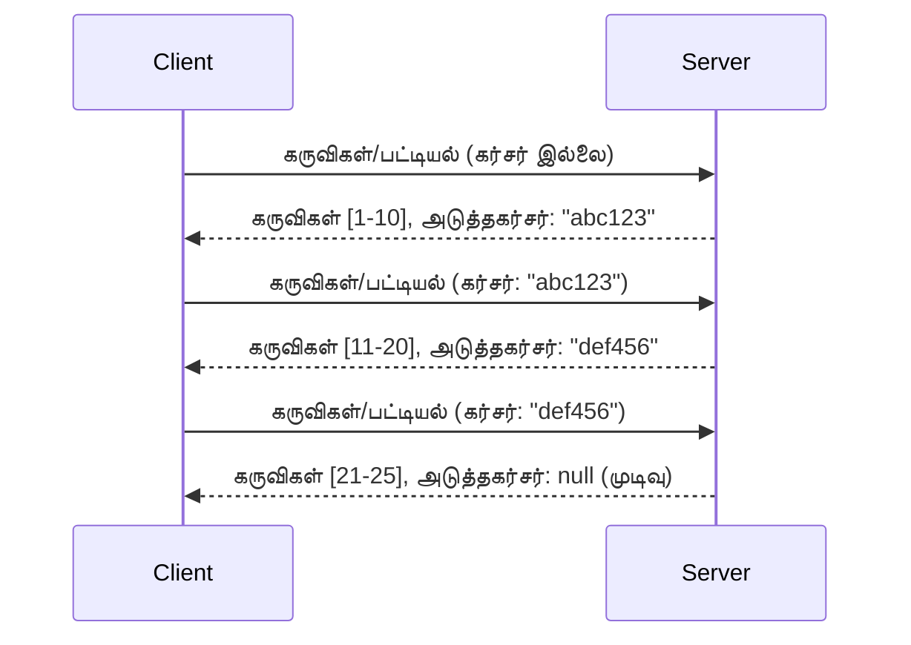

# MCP-இல் பக்கம் மற்றும் பெரிய முடிவுகள் குழுக்கள்

உங்கள் MCP சர்வர் பெரிய தரவுத் தொகுதிகளை கையாளும்போது - ஆயிரக்கணக்கான கோப்புகள், தரவுத்தள பதிவுகள் அல்லது தேடல் முடிவுகள் பட்டியலிடுதல் - நினைவகத்தை திறம்பட நிர்வகிக்கவும் பதிலளிக்கும் kullanıcı அனுபவங்களை வழங்கவும் பக்கம் தேவைப்படுகிறது. இக்கையேடு MCP-ல் பக்கவழிச் செயல்பாட்டை எவ்வாறு அமல்படுத்தி பயன்படுத்துவது என்பதைக் கवर செய்கிறது.

## ஏன் பக்கம் முக்கியம்?

பக்கம் இல்லாமல், பெரிய பதில்கள் ஆகும்:

- **நினைவக எழுமை** - ஒரே நாளில் ஒரு மில்லியன் பதிவுகளை ஏற்றுதல்
- **மெல்லிய பதிலளிப்பு நேரம்** - அனைத்து தரவுகளை ஏற்றும் வரை பயனர்கள் காத்திருக்கின்றனர்
- **காலாவதி (timeout) பிழைகள்** - கோரிக்கைகள் காலாவதி வரம்புகளை மீறுகின்றன
- **சிறிய செயற்கை நுண்ணறிவு செயல்திறன்** - LLMகள் பெரும் சூழலை கையாள முடியாது

கருத்துப்படுத்தல் மற்றும் உறுதிப்பத்திரத்திற்காக MCP **கெர்சர் அடிப்படையிலான பக்கம்** முறையைப் பயன்படுத்துகிறது.

---

## MCP பக்க எப்பொழுது வேலை செய்கிறது

### கெர்சர் கருத்து

ஒரு **கெர்சர்** என்பது உங்கள் முடிவுகள் தொகுதியில் உங்கள் இடத்தை குறிக்கும் ஒரு கடைசியாகக் காணப்படும் சரம். நீண்ட புத்தகத்திற்குள் வைத்த புத்தாண்டு பொறிகையைப் போலவே எண்ணுங்கள்.


### MCP முறைகளில் பக்கம்

இந்த MCP முறைகள் பக்கம் ஆதரிக்கின்றன:

| முறை | திருப்புகிறது | கெர்சர் ஆதரவு |
|--------|---------|----------------|
| `tools/list` | கருவி வரையறைகள் | ✅ |
| `resources/list` | வள வரையறைகள் | ✅ |
| `prompts/list` | தூண்டுகோள் வரையறைகள் | ✅ |
| `resources/templates/list` | வள மாதிரிகள் | ✅ |

---

## சர்வர் அமலாக்கம்

### Python (FastMCP)

```python
from mcp.server import Server
from mcp.types import Tool, ListToolsResult
import math

app = Server("paginated-server")

# போலி பெரிய தரவுத்தளம்
ALL_TOOLS = [
    Tool(name=f"tool_{i}", description=f"Tool number {i}", inputSchema={})
    for i in range(100)
]

PAGE_SIZE = 10

@app.list_tools()
async def list_tools(cursor: str | None = None) -> ListToolsResult:
    """List tools with pagination support."""
    
    # தொடக்க குறியீட்டை பெற கர்சரை பிழையிறக்கவும்
    start_index = 0
    if cursor:
        try:
            start_index = int(cursor)
        except ValueError:
            start_index = 0
    
    # முடிவுகளின் பக்கம் பெறுக
    end_index = min(start_index + PAGE_SIZE, len(ALL_TOOLS))
    page_tools = ALL_TOOLS[start_index:end_index]
    
    # அடுத்த கர்சரை கணக்கிடவும்
    next_cursor = None
    if end_index < len(ALL_TOOLS):
        next_cursor = str(end_index)
    
    return ListToolsResult(
        tools=page_tools,
        nextCursor=next_cursor
    )
```

### TypeScript

```typescript
import { Server } from "@modelcontextprotocol/sdk/server/index.js";
import { ListToolsResultSchema } from "@modelcontextprotocol/sdk/types.js";

const server = new Server({
  name: "paginated-server",
  version: "1.0.0"
});

// மாதிரியாக்கப்பட்ட பெரிய தரவுத்தொகுப்பு
const ALL_TOOLS = Array.from({ length: 100 }, (_, i) => ({
  name: `tool_${i}`,
  description: `Tool number ${i}`,
  inputSchema: { type: "object", properties: {} }
}));

const PAGE_SIZE = 10;

server.setRequestHandler(ListToolsResultSchema, async (request) => {
  // கர்சரை பிழையிழுக்கவும்
  let startIndex = 0;
  if (request.params?.cursor) {
    startIndex = parseInt(request.params.cursor, 10) || 0;
  }
  
  // முடிவுகளின் பக்கத்தை பெறுக
  const endIndex = Math.min(startIndex + PAGE_SIZE, ALL_TOOLS.length);
  const pageTools = ALL_TOOLS.slice(startIndex, endIndex);
  
  // அடுத்த கர்சரை கணக்கிடுக
  const nextCursor = endIndex < ALL_TOOLS.length ? String(endIndex) : undefined;
  
  return {
    tools: pageTools,
    nextCursor
  };
});
```

### Java (Spring MCP)

```java
@Service
public class PaginatedToolService {
    
    private static final int PAGE_SIZE = 10;
    private final List<Tool> allTools;
    
    public PaginatedToolService() {
        // பெரிய தரவுத்தொகுப்பை துவக்கு
        this.allTools = IntStream.range(0, 100)
            .mapToObj(i -> new Tool("tool_" + i, "Tool number " + i, Map.of()))
            .collect(Collectors.toList());
    }
    
    @McpMethod("tools/list")
    public ListToolsResult listTools(@Param("cursor") String cursor) {
        // கர்சரை குறியாக்கம் செய்
        int startIndex = 0;
        if (cursor != null && !cursor.isEmpty()) {
            try {
                startIndex = Integer.parseInt(cursor);
            } catch (NumberFormatException e) {
                startIndex = 0;
            }
        }
        
        // முடிவுகளின் பக்கத்தை பெறு
        int endIndex = Math.min(startIndex + PAGE_SIZE, allTools.size());
        List<Tool> pageTools = allTools.subList(startIndex, endIndex);
        
        // அடுத்த கர்சரை கணக்கிடுக
        String nextCursor = endIndex < allTools.size() ? String.valueOf(endIndex) : null;
        
        return new ListToolsResult(pageTools, nextCursor);
    }
}
```

---

## கிளைண்ட் அமலாக்கம்

### Python கிளைண்ட்

```python
from mcp import ClientSession

async def get_all_tools(session: ClientSession) -> list:
    """Fetch all tools using pagination."""
    all_tools = []
    cursor = None
    
    while True:
        result = await session.list_tools(cursor=cursor)
        all_tools.extend(result.tools)
        
        if result.nextCursor is None:
            break
        cursor = result.nextCursor
    
    return all_tools

# பயன்பாடு
async with client_session as session:
    tools = await get_all_tools(session)
    print(f"Found {len(tools)} tools")
```

### TypeScript கிளைண்ட்

```typescript
import { Client } from "@modelcontextprotocol/sdk/client/index.js";

async function getAllTools(client: Client): Promise<Tool[]> {
  const allTools: Tool[] = [];
  let cursor: string | undefined = undefined;
  
  do {
    const result = await client.listTools({ cursor });
    allTools.push(...result.tools);
    cursor = result.nextCursor;
  } while (cursor);
  
  return allTools;
}

// பயன்பாடு
const tools = await getAllTools(client);
console.log(`Found ${tools.length} tools`);
```

### மந்தமான ஏற்றும் முறை

மிகப்பெரிய தரவுத்தொகுதிகளுக்கு, பக்கங்களை தேவைக்கேற்ப ஏற்று கொள்ளவும்:

```python
class PaginatedToolIterator:
    """Lazily iterate through paginated tools."""
    
    def __init__(self, session: ClientSession):
        self.session = session
        self.cursor = None
        self.buffer = []
        self.exhausted = False
    
    async def __anext__(self):
        # கிடைத்தால் பஃபரில் இருந்து திரும்பவும்
        if self.buffer:
            return self.buffer.pop(0)
        
        # நாங்கள் அனைத்து பக்கங்களையும் கடந்து விட்டோமாகும் என்பதை சரிபார்க்கவும்
        if self.exhausted:
            raise StopAsyncIteration
        
        # அடுத்த பக்கத்தை எடு
        result = await self.session.list_tools(cursor=self.cursor)
        self.buffer = list(result.tools)
        self.cursor = result.nextCursor
        
        if self.cursor is None:
            self.exhausted = True
        
        if not self.buffer:
            raise StopAsyncIteration
        
        return self.buffer.pop(0)
    
    def __aiter__(self):
        return self

# பயன்பாடு - பெரிய தரவுத்தொகைகளுக்கான நினைவக திறம்படையானது
async for tool in PaginatedToolIterator(session):
    process_tool(tool)
```

---

## வளங்களுக்கு பக்கம்

விளைவுகளுக்கு அடிக்கடி அடைக்கalப்படுத்தல்கள் அல்லது பெரிய தரவுத்தொகுதிகள் பக்கத்துடன் தேவைபடுகிறது:

```python
from mcp.server import Server
from mcp.types import Resource, ListResourcesResult
import os

app = Server("file-server")

@app.list_resources()
async def list_resources(cursor: str | None = None) -> ListResourcesResult:
    """List files in directory with pagination."""
    
    directory = "/data/files"
    all_files = sorted(os.listdir(directory))
    
    # குறிச்சொல் (கோப்பு வரிசை) குறியாக்கம் செய்க
    start_index = int(cursor) if cursor else 0
    page_size = 20
    end_index = min(start_index + page_size, len(all_files))
    
    # இந்த பக்கத்திற்கான வள பட்டியலை உருவாக்குக
    resources = []
    for filename in all_files[start_index:end_index]:
        filepath = os.path.join(directory, filename)
        resources.append(Resource(
            uri=f"file://{filepath}",
            name=filename,
            mimeType="application/octet-stream"
        ))
    
    # அடுத்த குறிச்சொல்லை கணக்கிடுக
    next_cursor = str(end_index) if end_index < len(all_files) else None
    
    return ListResourcesResult(
        resources=resources,
        nextCursor=next_cursor
    )
```

---

## கெர்சர் வடிவமைப்பு உத்திகள்

### உத்தி 1: குறியீட்டு அடிப்படையிலானது (எளிதானது)

```python
# குற்சர் என்பது மட்டும் குறியீடு
cursor = "50"  # 50ஆம் பொருளில் தொடங்கு
```

**நன்மைகள்:** எளிதானது, நிலைத்தன்மையற்றது  
**குறை:** பதிவுகள் சேர்க்கப்பட்டால்/muattaippinu kavalai ulla

### உத்தி 2: ID அடிப்படையிலானது (நிலையானது)

```python
# வழிக் குறி கடைசியாக பார்க்கப்பட்ட ஐடி
cursor = "item_abc123"  # இந்த பொருளுக்கு பிறகு தொடங்கு
```

**நன்மைகள்:** பொருட்கள் மாறினாலும் நிலைத்தது  
**குறை:** வரிசைப்படுத்தப்பட்ட IDகள் தேவை

### உத்தி 3: குறியாக்கத் நிலை (சிக்கலானது)

```python
import base64
import json

def encode_cursor(state: dict) -> str:
    return base64.b64encode(json.dumps(state).encode()).decode()

def decode_cursor(cursor: str) -> dict:
    return json.loads(base64.b64decode(cursor).decode())

# கர்சர் பல நிலை களங்களை கொண்டுள்ளது
cursor = encode_cursor({
    "offset": 50,
    "filter": "active",
    "sort": "name"
})
```

**நன்மைகள்:** சிக்கலான நிலையைக் குறியாக்கம் செய்ய முடியும்  
**குறை:** மொத்தமாக சிக்கலானது, பெரிய கெர்சர் சரங்கள்

---

## சிறந்த நடைமுறைகள்

### 1. உரிய பக்க அளவுகளை தேர்வு செய்க

```python
# தரவு அளவு பரிசீலிக்கவும்
PAGE_SIZE_SMALL_ITEMS = 100   # எளிய மெட்டாடேட்டா
PAGE_SIZE_MEDIUM_ITEMS = 20   # செழுமையான பொருட்கள்
PAGE_SIZE_LARGE_ITEMS = 5     # சிக்கலான உள்ளடக்கம்
```

### 2. தவறான கெர்சர்கள் மென்மையாக கையாளுக

```python
@app.list_tools()
async def list_tools(cursor: str | None = None) -> ListToolsResult:
    try:
        start_index = int(cursor) if cursor else 0
        if start_index < 0 or start_index >= len(ALL_TOOLS):
            start_index = 0  # துவக்கத்திற்கு மீட்டமைக்கவும்
    except (ValueError, TypeError):
        start_index = 0  # தவறான வரைபுள்ளி, புதிதாக துவங்கவும்
    # ...
```

### 3. மொத்த எண்ணிக்கையையும் சேர் (விருப்பம்)

```python
return ListToolsResult(
    tools=page_tools,
    nextCursor=next_cursor,
    # சில செயல்பாடுகள் UI முன்னேற்றத்திற்கான மொத்தத்தைச் சேர்க்கின்றன
    _meta={"total": len(ALL_TOOLS)}
)
```

### 4. எல்லை நிலைகளில் சோதனை செய்யவும்

```python
async def test_pagination():
    # வெறுச்செயல்பாட்டு செட்
    result = await session.list_tools()
    assert result.tools == []
    assert result.nextCursor is None
    
    # தனி பக்கம்
    result = await session.list_tools()
    assert len(result.tools) <= PAGE_SIZE
    
    # தவறான கர்சர்
    result = await session.list_tools(cursor="invalid")
    assert result.tools  # முதல் பக்கத்தை திருப்ப வேண்டும்
```

---

## பொதுவான தவறுகள்

### ❌ எல்லா முடிவுகளையும் திருப்பி, பின்னர் கிளைண்ட் பக்கவழி

```python
# மோசம்: எல்லாவற்றையும் நினைவகத்தில் ஏற்றுகிறது
@app.list_tools()
async def list_tools() -> ListToolsResult:
    all_tools = load_all_tools()  # 1 மில்லியன் கருவிகள்!
    return ListToolsResult(tools=all_tools)
```

### ✅ தரவு மூலதனத்தில் பக்கம் செயல்படுத்தவும்

```python
# நல்லது: தேவையானவற்றையே மட்டுமே ஏற்றுகிறது
@app.list_tools()
async def list_tools(cursor: str | None = None) -> ListToolsResult:
    offset = int(cursor) if cursor else 0
    tools = await db.query_tools(offset=offset, limit=PAGE_SIZE)
    return ListToolsResult(tools=tools, nextCursor=...)
```

---

## அடுத்தது என்ன?

- [Module 5.14 - Context Engineering](../../05-AdvancedTopics/mcp-contextengineering/README.md)
- [Module 8 - சிறந்த நடைமுறைகள்](../../08-BestPractices/README.md)
- [3.8 - உங்கள் MCP சர்வரை சோதனை செய்யவும்](../../03-GettingStarted/08-testing/README.md)

---

## கூடுதல் வளங்கள்

- [MCP விவரிப்பு - பக்கம்](https://spec.modelcontextprotocol.io/specification/2025-11-25/)
- [கெர்சர் அடிப்படையிலான பக்கவழிச் செயல்முறை விளக்கம்](https://slack.engineering/evolving-api-pagination-at-slack/)
- [Python SDK பக்கவழி சோதனைகள்](https://github.com/modelcontextprotocol/python-sdk/blob/main/tests/client/test_list_methods_cursor.py)

---

<!-- CO-OP TRANSLATOR DISCLAIMER START -->
**அறிவிப்பு**:  
இந்த ஆவணம் AI மொழி பெயர்ப்பு சேவை [Co-op Translator](https://github.com/Azure/co-op-translator) பயன்படுத்தி மொழிபெயர்க்கப்பட்டுள்ளது. நாங்கள் துல்லியத்திற்காக முயன்றாலும், தானியங்கி மொழி பெயர்ப்பில் பிழைகள் அல்லது தவறுகள் இருக்கக்கூடும் என்பதை தயவுசெய்து கவனிக்கவும். அசல் ஆவணம் அதன் இயல்புநிலை மொழியில் அதிகாரபூர்வ மூலமாக கருதப்பட வேண்டும். முக்கியமான தகவல்களுக்கான பணிப்புரவேறு மனித மொழிபெயர்ப்பை பரிந்துரைக்கிறோம். இந்த மொழிபெயர்ப்பின் பயன்பாட்டின் காரணமாக ஏற்படும் தவறான புரிதல்களுக்கும் தவறான விளக்கங்களுக்கும் நாம் பொறுப்பல்ல.
<!-- CO-OP TRANSLATOR DISCLAIMER END -->