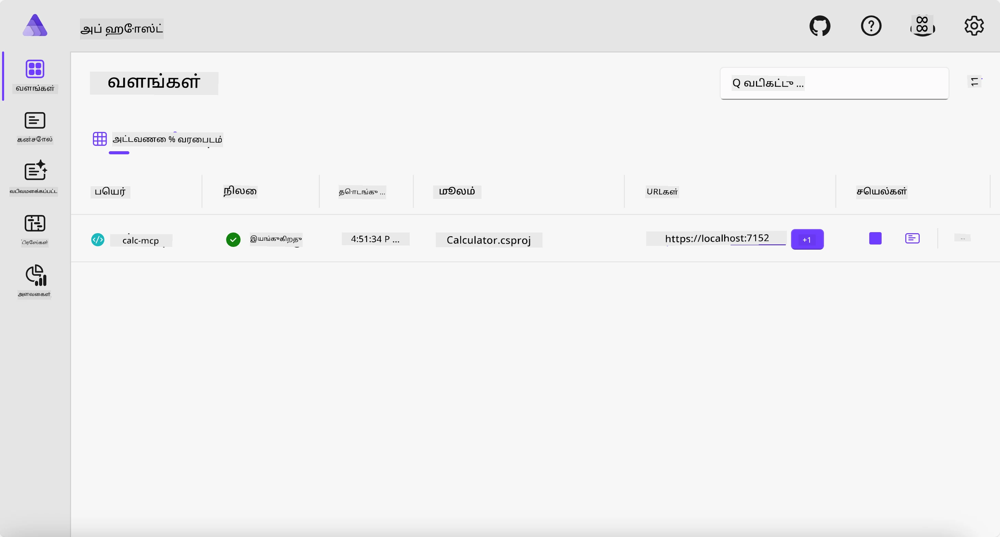
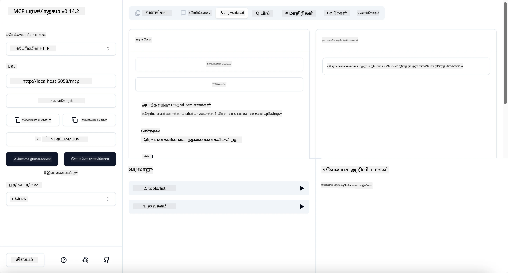
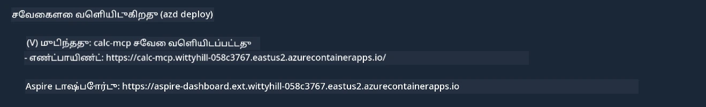

# மாதிரி

முந்தைய உதாரணம் `stdio` வகையைப் பயன்படுத்தி உள்ளூர் .NET திட்டத்தை எப்படி பயன்படுத்துவது மற்றும் சர்வரை ஒரு கன்டெய்னரில் உள்ளூரில் இயக்குவது என்பதை காட்டுகிறது. இது பல சூழல்களில் ஒரு நல்ல தீர்வாகும். ஆனால், சர்வர் மேக சூழலில் போன்ற தொலைவில் இயங்குவது பயனுள்ளதாக இருக்கலாம். இதுவே `http` வகையின் முக்கியத்துவம்.

`04-PracticalImplementation` கோப்பகத்தில் உள்ள தீர்வைப் பார்க்கும்போது, இது முந்தையதை விட மிகவும் சிக்கலாக தோன்றலாம். ஆனால் உண்மையில், அது அப்படியில்லை. `src/Calculator` திட்டத்தை நன்கு கவனித்தால், முந்தைய உதாரணத்தின் கோடுகள் பெரும்பாலும் அதேபோல இருக்கும். ஒரே வேறுபாடு, HTTP கோரிக்கைகளை நிர்வகிக்க `ModelContextProtocol.AspNetCore` என்ற வேறு நூலகத்தைப் பயன்படுத்துகிறோம். மேலும், `IsPrime` முறைமையை தனிப்பட்டதாக மாற்றுகிறோம், உங்கள் கோடில் தனிப்பட்ட முறைமைகள் இருக்க முடியும் என்பதை காட்ட. மீதமுள்ள கோடுகள் முந்தையதைப் போலவே இருக்கும்.

மற்ற திட்டங்கள் [.NET Aspire](https://learn.microsoft.com/dotnet/aspire/get-started/aspire-overview) உடன் தொடர்புடையவை. தீர்வில் .NET Aspire இருப்பது, டெவலப்பர் அனுபவத்தை மேம்படுத்தவும், டெவலப்பிங் மற்றும் டெஸ்டிங் செய்ய உதவவும், மற்றும் கண்காணிப்பில் உதவவும் செய்யும். சர்வரை இயக்க இது தேவையில்லை, ஆனால் உங்கள் தீர்வில் இதைச் சேர்ப்பது நல்ல நடைமுறையாகும்.

## சர்வரை உள்ளூரில் தொடங்குதல்

1. VS Code (C# DevKit நீட்டிப்புடன்) மூலம், `04-PracticalImplementation/samples/csharp` கோப்பகத்திற்குச் செல்லவும்.
1. சர்வரை தொடங்க கீழே உள்ள கட்டளையை இயக்கவும்:

   ```bash
    dotnet watch run --project ./src/AppHost
   ```

1. ஒரு வலை உலாவி .NET Aspire டாஷ்போர்டை திறக்கும்போது, `http` URL-ஐ கவனிக்கவும். இது `http://localhost:5058/` போன்றதாக இருக்க வேண்டும்.

   

## MCP Inspector உடன் Streamable HTTP-ஐ சோதிக்கவும்

உங்களிடம் Node.js 22.7.5 அல்லது அதற்கு மேல் இருந்தால், MCP Inspector-ஐ பயன்படுத்தி உங்கள் சர்வரை சோதிக்கலாம்.

சர்வரை தொடங்கி, கீழே உள்ள கட்டளையை ஒரு டெர்மினலில் இயக்கவும்:

```bash
npx @modelcontextprotocol/inspector http://localhost:5058
```



- `Streamable HTTP` என்பதை போக்குவரத்து வகையாகத் தேர்ந்தெடுக்கவும்.
- URL புலத்தில், முந்தைய URL-ஐ உள்ளீடு செய்து `/mcp` சேர்க்கவும். இது `http` (அல்லது `https` அல்ல) போன்றதாக இருக்க வேண்டும்: `http://localhost:5058/mcp`.
- Connect பொத்தானைத் தேர்ந்தெடுக்கவும்.

Inspector-இன் ஒரு நல்ல அம்சம், என்ன நடக்கிறது என்பதை தெளிவாகக் காட்டுகிறது.

- கிடைக்கக்கூடிய கருவிகளை பட்டியலிட முயற்சிக்கவும்.
- சிலவற்றை முயற்சிக்கவும், இது முந்தையதைப் போலவே வேலை செய்ய வேண்டும்.

## VS Code-இல் GitHub Copilot Chat உடன் MCP சர்வரை சோதிக்கவும்

Streamable HTTP போக்குவரத்தை GitHub Copilot Chat உடன் பயன்படுத்த, முந்தைய `calc-mcp` சர்வரின் கட்டமைப்பை கீழே உள்ளபடி மாற்றவும்:

```jsonc
// .vscode/mcp.json
{
  "servers": {
    "calc-mcp": {
      "type": "http",
      "url": "http://localhost:5058/mcp"
    }
  }
}
```

சில சோதனைகள் செய்யவும்:

- "6780க்கு பிறகு 3 பிரதான எண்களை" கேட்கவும். Copilot புதிய கருவிகளை `NextFivePrimeNumbers` பயன்படுத்தி முதல் 3 பிரதான எண்களை மட்டுமே திருப்புவதை கவனிக்கவும்.
- "111க்கு பிறகு 7 பிரதான எண்களை" கேட்கவும், என்ன நடக்கிறது என்பதைப் பாருங்கள்.
- "ஜான் 24 லாலிபாப் வைத்திருக்கிறார், அவற்றை 3 குழந்தைகளுக்கு சமமாகப் பகிர வேண்டும். ஒவ்வொரு குழந்தைக்கும் எத்தனை லாலிபாப் கிடைக்கும்?" என்று கேட்கவும், என்ன நடக்கிறது என்பதைப் பாருங்கள்.

## சர்வரை Azure-க்கு வெளியிடுதல்

சர்வரை Azure-க்கு வெளியிடுவோம், மேலும் பலர் அதை பயன்படுத்த முடியும்.

ஒரு டெர்மினலில், `04-PracticalImplementation/samples/csharp` கோப்பகத்திற்குச் செல்லவும் மற்றும் கீழே உள்ள கட்டளையை இயக்கவும்:

```bash
azd up
```

வெளியீடு முடிந்தவுடன், நீங்கள் கீழே உள்ள செய்தியைப் பார்க்க வேண்டும்:



URL-ஐ எடுத்துக்கொண்டு MCP Inspector மற்றும் GitHub Copilot Chat-இல் பயன்படுத்தவும்.

```jsonc
// .vscode/mcp.json
{
  "servers": {
    "calc-mcp": {
      "type": "http",
      "url": "https://calc-mcp.gentleriver-3977fbcf.australiaeast.azurecontainerapps.io/mcp"
    }
  }
}
```

## அடுத்தது என்ன?

நாம் பல போக்குவரத்து வகைகள் மற்றும் சோதனை கருவிகளை முயற்சித்தோம். மேலும், உங்கள் MCP சர்வரை Azure-க்கு வெளியிட்டோம். ஆனால், எங்கள் சர்வர் தனிப்பட்ட வளங்களை அணுக வேண்டும் என்றால் என்ன? உதாரணமாக, ஒரு தரவுத்தொகுப்பு அல்லது தனிப்பட்ட API? அடுத்த அத்தியாயத்தில், எங்கள் சர்வரின் பாதுகாப்பை எப்படி மேம்படுத்தலாம் என்பதைப் பார்ப்போம்.

---

**அறிவிப்பு**:  
இந்த ஆவணம் [Co-op Translator](https://github.com/Azure/co-op-translator) என்ற AI மொழிபெயர்ப்பு சேவையை பயன்படுத்தி மொழிபெயர்க்கப்பட்டுள்ளது. நாங்கள் துல்லியத்திற்காக முயற்சிக்கிறோம், ஆனால் தானியங்கி மொழிபெயர்ப்புகளில் பிழைகள் அல்லது தவறுகள் இருக்கக்கூடும் என்பதை கவனத்தில் கொள்ளவும். அதன் சொந்த மொழியில் உள்ள மூல ஆவணம் அதிகாரப்பூர்வ ஆதாரமாக கருதப்பட வேண்டும். முக்கியமான தகவல்களுக்கு, தொழில்முறை மனித மொழிபெயர்ப்பு பரிந்துரைக்கப்படுகிறது. இந்த மொழிபெயர்ப்பைப் பயன்படுத்துவதால் ஏற்படும் எந்த தவறான புரிதல்களுக்கும் அல்லது தவறான விளக்கங்களுக்கும் நாங்கள் பொறுப்பல்ல.