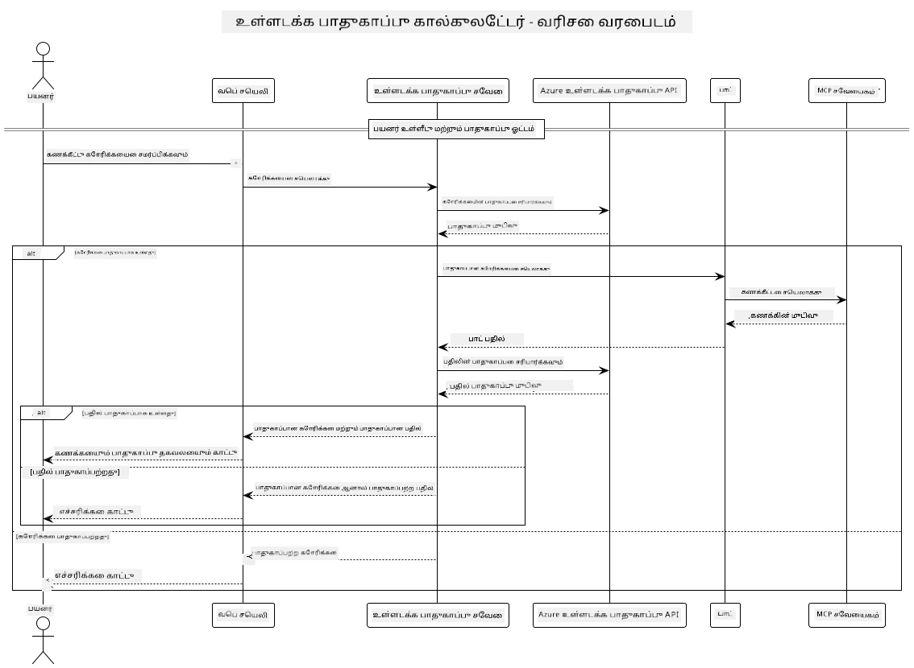

## அமைப்பு கட்டமைப்பு

இந்த திட்டம், Model Context Protocol (MCP) மூலம் கணக்கீட்டு சேவைக்கு பயனர் உத்தரவுகளை அனுப்புவதற்கு முன் உள்ளடக்க பாதுகாப்பு சரிபார்ப்பை பயன்படுத்தும் ஒரு வலை பயன்பாட்டை விளக்குகிறது.



### இது எப்படி செயல்படுகிறது

1. **பயனர் உள்ளீடு**: பயனர் வலை இடைமுகத்தில் ஒரு கணக்கீட்டு உத்தரவை உள்ளிடுகிறார்  
2. **உள்ளடக்க பாதுகாப்பு திரை (உள்ளீடு)**: Azure Content Safety API மூலம் உத்தரவு பகுப்பாய்வு செய்யப்படுகிறது  
3. **பாதுகாப்பு முடிவு (உள்ளீடு)**:
   - உள்ளடக்கம் பாதுகாப்பானதாக இருந்தால் (அனைத்து பிரிவுகளிலும் தீவிரம் < 2), அது கணக்கீட்டுக்கு அனுப்பப்படும்  
   - உள்ளடக்கம் தீங்கு விளைவிக்கக்கூடியதாக குறிக்கப்பட்டால், செயல்முறை நிறுத்தப்பட்டு எச்சரிக்கை திருப்பி அனுப்பப்படும்  
4. **கணக்கீட்டு ஒருங்கிணைப்பு**: பாதுகாப்பான உள்ளடக்கம் LangChain4j மூலம் செயலாக்கப்படுகிறது, இது MCP கணக்கீட்டு சேவையகத்துடன் தொடர்பு கொள்ளும்  
5. **உள்ளடக்க பாதுகாப்பு திரை (வெளியீடு)**: Azure Content Safety API மூலம் பாட்டின் பதில் பகுப்பாய்வு செய்யப்படுகிறது  
6. **பாதுகாப்பு முடிவு (வெளியீடு)**:
   - பாட்டின் பதில் பாதுகாப்பானதாக இருந்தால், அது பயனருக்கு காட்டப்படும்  
   - பாட்டின் பதில் தீங்கு விளைவிக்கக்கூடியதாக குறிக்கப்பட்டால், அது எச்சரிக்கையுடன் மாற்றப்படும்  
7. **பதில்**: முடிவுகள் (பாதுகாப்பானவை என்றால்) பயனருக்கு காட்டப்படும், அதனுடன் இரு பாதுகாப்பு பகுப்பாய்வுகளும் சேர்த்து  

## Model Context Protocol (MCP) மற்றும் கணக்கீட்டு சேவைகளைப் பயன்படுத்துதல்

இந்த திட்டம் LangChain4j மூலம் MCP கணக்கீட்டு சேவைகளை அழைக்க Model Context Protocol (MCP) பயன்படுத்துவதைக் காட்டுகிறது. இது கணக்கீட்டு செயல்பாடுகளை வழங்க 8080 போர்ட்டில் இயங்கும் உள்ளூர் MCP சேவையகத்தை பயன்படுத்துகிறது.

### Azure Content Safety சேவையை அமைத்தல்

உள்ளடக்க பாதுகாப்பு அம்சங்களைப் பயன்படுத்துவதற்கு முன், நீங்கள் Azure Content Safety சேவையை உருவாக்க வேண்டும்:

1. [Azure Portal](https://portal.azure.com) இல் உள்நுழைக  
2. "Create a resource" கிளிக் செய்து "Content Safety" தேடவும்  
3. "Content Safety" தேர்வு செய்து "Create" கிளிக் செய்யவும்  
4. உங்கள் வளத்திற்கு ஒரு தனித்துவமான பெயரை உள்ளிடவும்  
5. உங்கள் சந்தா மற்றும் வளக் குழுவைத் தேர்வு செய்யவும் (அல்லது புதிய ஒன்றை உருவாக்கவும்)  
6. ஆதரிக்கப்படும் பிராந்தியத்தைத் தேர்வு செய்யவும் ([Region availability](https://azure.microsoft.com/en-us/global-infrastructure/services/?products=cognitive-services) விவரங்களுக்கு பார்க்கவும்)  
7. பொருத்தமான விலை நிலையைத் தேர்வு செய்யவும்  
8. "Create" கிளிக் செய்து வளத்தைப் பிரயோகத்தில் கொண்டு வாருங்கள்  
9. பிரயோக முடிந்தவுடன், "Go to resource" கிளிக் செய்யவும்  
10. இடது பக்கத்தில், "Resource Management" கீழ் "Keys and Endpoint" தேர்வு செய்யவும்  
11. இரண்டு விசைகளில் ஏதாவது ஒன்றையும் மற்றும் இறுதிப் URL ஐ நகலெடுக்கவும்  

### சூழல் மாறிகளை அமைத்தல்

GitHub மாதிரிகள் அங்கீகாரத்திற்காக `GITHUB_TOKEN` சூழல் மாறியை அமைக்கவும்:  
```sh
export GITHUB_TOKEN=<your_github_token>
```
  
உள்ளடக்க பாதுகாப்பு அம்சங்களுக்காக, இதை அமைக்கவும்:  
```sh
export CONTENT_SAFETY_ENDPOINT=<your_content_safety_endpoint>
export CONTENT_SAFETY_KEY=<your_content_safety_key>
```
  
இந்த சூழல் மாறிகள் Azure Content Safety சேவையுடன் அங்கீகாரம் செய்ய பயன்படுகின்றன. இந்த மாறிகள் அமைக்கப்படாவிட்டால், பயன்பாடு விளக்க நோக்கங்களுக்காக இடைநிலை மதிப்புகளைப் பயன்படுத்தும், ஆனால் உள்ளடக்க பாதுகாப்பு அம்சங்கள் சரியாக செயல்படாது.

### கணக்கீட்டு MCP சேவையகத்தை தொடங்குதல்

வாடிக்கையாளர் செயல்படுவதற்கு முன், நீங்கள் localhost:8080 இல் SSE முறையில் MCP கணக்கீட்டு சேவையகத்தை தொடங்க வேண்டும்.

## திட்ட விளக்கம்

இந்த திட்டம் LangChain4j உடன் Model Context Protocol (MCP) ஒருங்கிணைப்பை விளக்குகிறது, கணக்கீட்டு சேவைகளை அழைக்க. முக்கிய அம்சங்கள்:

- அடிப்படை கணித செயல்பாடுகளுக்காக MCP மூலம் கணக்கீட்டு சேவையுடன் இணைப்பு  
- பயனர் உத்தரவுகள் மற்றும் பாட்டின் பதில்களுக்கான இரட்டை அடுக்கு உள்ளடக்க பாதுகாப்பு சரிபார்ப்பு  
- LangChain4j மூலம் GitHub இன் gpt-4.1-nano மாதிரியை ஒருங்கிணைத்தல்  
- MCP போக்குவரத்திற்காக Server-Sent Events (SSE) பயன்படுத்துதல்  

## உள்ளடக்க பாதுகாப்பு ஒருங்கிணைப்பு

இந்த திட்டம் பயனர் உள்ளீடுகள் மற்றும் அமைப்பு பதில்கள் இரண்டிலும் தீங்கு விளைவிக்கக்கூடிய உள்ளடக்கத்தை தவிர்க்க விரிவான பாதுகாப்பு அம்சங்களை உள்ளடக்கியது:

1. **உள்ளீடு திரை**: அனைத்து பயனர் உத்தரவுகளும், வெறுப்பு பேச்சு, வன்முறை, தற்கொலை, மற்றும் பாலியல் உள்ளடக்கம் போன்ற தீங்கு விளைவிக்கக்கூடிய பிரிவுகளுக்காக பகுப்பாய்வு செய்யப்படும்.  

2. **வெளியீடு திரை**: சென்சார் செய்யப்படாத மாதிரிகளைப் பயன்படுத்தினாலும் கூட, அமைப்பு உருவாக்கிய அனைத்து பதில்களும் அதே உள்ளடக்க பாதுகாப்பு வடிகட்டிகளின் மூலம் சரிபார்க்கப்படும்.  

இந்த இரட்டை அடுக்கு அணுகுமுறை எந்த AI மாதிரியும் பயன்படுத்தப்பட்டாலும் அமைப்பு பாதுகாப்பாக இருக்கும் என்பதை உறுதிசெய்கிறது, பயனர்களை தீங்கு விளைவிக்கக்கூடிய உள்ளீடுகள் மற்றும் AI உருவாக்கிய பிரச்சனையுள்ள பதில்களிலிருந்து பாதுகாக்கிறது.

## வலை வாடிக்கையாளர்

இந்த பயன்பாடு Content Safety Calculator அமைப்புடன் தொடர்பு கொள்ள பயனர்களுக்கு நட்பான ஒரு வலை இடைமுகத்தை வழங்குகிறது:

### வலை இடைமுக அம்சங்கள்

- கணக்கீட்டு உத்தரவுகளை உள்ளிட எளிய, நேர்த்தியான படிவம்  
- இரட்டை அடுக்கு உள்ளடக்க பாதுகாப்பு சரிபார்ப்பு (உள்ளீடு மற்றும் வெளியீடு)  
- உத்தரவு மற்றும் பதிலின் பாதுகாப்பு நிலைமையை நேரடி கருத்து  
- எளிதில் புரிந்துகொள்ள வண்ண குறியீடு செய்யப்பட்ட பாதுகாப்பு குறிகாட்டிகள்  
- பல சாதனங்களில் வேலை செய்யும் சுத்தமான, பதிலளிக்கும் வடிவமைப்பு  
- பயனர்களுக்கு வழிகாட்ட உதாரண பாதுகாப்பான உத்தரவுகள்  

### வலை வாடிக்கையாளரைப் பயன்படுத்துதல்

1. பயன்பாட்டை தொடங்கவும்:  
   ```sh
   mvn spring-boot:run
   ```
  
2. உலாவியில் `http://localhost:8087` ஐ திறக்கவும்  

3. வழங்கப்பட்ட உரை பகுதியில் ஒரு கணக்கீட்டு உத்தரவை உள்ளிடவும் (எ.கா., "24.5 மற்றும் 17.3 இன் கூட்டுத்தொகையை கணக்கிடவும்")  

4. உங்கள் கோரிக்கையை செயலாக்க "Submit" கிளிக் செய்யவும்  

5. முடிவுகளைப் பார்வையிடவும், இதில் அடங்கும்:  
   - உங்கள் உத்தரவு பற்றிய உள்ளடக்க பாதுகாப்பு பகுப்பாய்வு  
   - கணக்கிடப்பட்ட முடிவு (உத்தரவு பாதுகாப்பானது என்றால்)  
   - பாட்டின் பதிலின் உள்ளடக்க பாதுகாப்பு பகுப்பாய்வு  
   - உள்ளீடு அல்லது வெளியீடு குறிக்கப்பட்டிருந்தால் எந்தவொரு பாதுகாப்பு எச்சரிக்கைகளும்  

வலை வாடிக்கையாளர் இரண்டு உள்ளடக்க பாதுகாப்பு சரிபார்ப்பு செயல்முறைகளையும் தானாகவே கையாள்கிறது, எந்த AI மாதிரியும் பயன்படுத்தப்பட்டாலும் அனைத்து தொடர்புகளும் பாதுகாப்பானவை மற்றும் பொருத்தமானவை என்பதை உறுதிசெய்கிறது.

---

**குறிப்பு**:  
இந்த ஆவணம் [Co-op Translator](https://github.com/Azure/co-op-translator) என்ற AI மொழிபெயர்ப்பு சேவையைப் பயன்படுத்தி மொழிபெயர்க்கப்பட்டுள்ளது. நாங்கள் துல்லியத்திற்காக முயற்சிக்கிறோம், ஆனால் தானியக்க மொழிபெயர்ப்புகளில் பிழைகள் அல்லது தவறான தகவல்கள் இருக்கக்கூடும் என்பதை தயவுசெய்து கவனத்தில் கொள்ளுங்கள். அதன் தாய்மொழியில் உள்ள மூல ஆவணம் அதிகாரப்பூர்வ ஆதாரமாக கருதப்பட வேண்டும். முக்கியமான தகவல்களுக்கு, தொழில்முறை மனித மொழிபெயர்ப்பு பரிந்துரைக்கப்படுகிறது. இந்த மொழிபெயர்ப்பைப் பயன்படுத்துவதால் ஏற்படும் எந்த தவறான புரிதல்கள் அல்லது தவறான விளக்கங்களுக்கு நாங்கள் பொறுப்பல்ல.