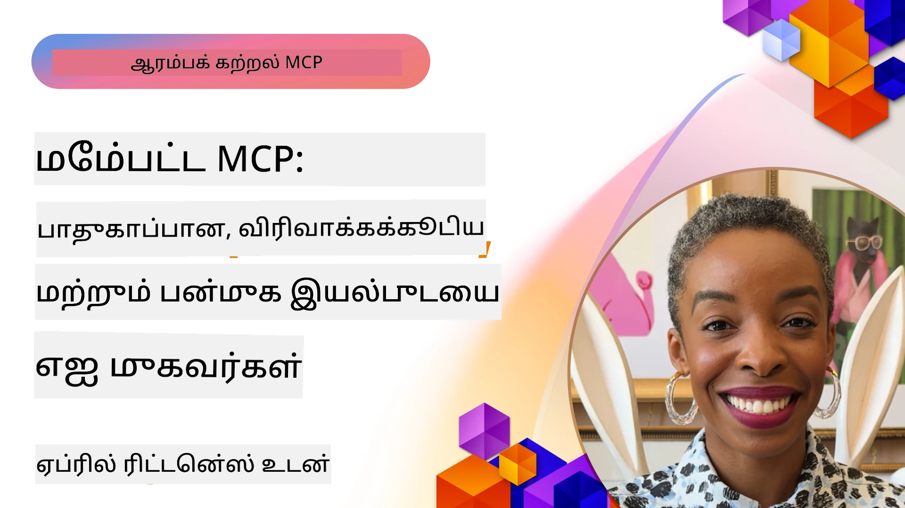

# MCP இல் முன்னேற்றமான தலைப்புகள்

_(இந்த பாடத்தின் வீடியோவை காண, மேலே உள்ள படத்தை கிளிக் செய்யவும்)_

இந்த அத்தியாயம் Model Context Protocol (MCP) செயல்பாட்டில் பல்வேறு முன்னேற்றமான தலைப்புகளை, உட்பட பல்முறை ஒருங்கிணைப்பு, அளவீட்டமைப்பு, பாதுகாப்பு சிறந்த நடைமுறைகள் மற்றும் நிறுவன ஒருங்கிணைப்பு ஆகியவற்றை உள்ளடக்கியது. இந்த தலைப்புகள் நவீன AI அமைப்புகளின் தேவைகளுக்கு ஏற்ப வலுவான மற்றும் தயாரிப்பு தயாரான MCP பயன்பாடுகளை கட்டமைக்க முக்கியமானவை.

## கண்ணோட்டம்

இந்த பாடம் Model Context Protocol செயல்பாட்டின் முன்னேற்றமான கருத்துகள் குறித்து ஆராய்கிறது, முக்கியமாக பல்முறை ஒருங்கிணைப்பு, அளவீட்டமைப்பு, பாதுகாப்பு சிறந்த நடைமுறைகள் மற்றும் நிறுவன ஒருங்கிணைப்பு மீது கவனம் செலுத்துகிறது. இந்த தலைப்புகள் நிறுவன சூழல்களில் சிக்கலான தேவைகளை கையாளக்கூடிய தயாரிப்பு தரமான MCP பயன்பாடுகளை உருவாக்க அவசியமானவை.

## கற்றல் குறிக்கோள்கள்

இந்த பாடத்தினை முடித்த பிறகு, நீங்கள் செய்தீர்கள்:

- MCP கட்டமைப்புகளுக்குள் பல்முறை திறன்களை செயல்படுத்தல்
- உயர்-தேவை நிலைகளுக்கான அளவீட்டுக்கான MCP கட்டமைப்புகளை வடிவமைத்தல்
- MCP பாதுகாப்பு கோட்பாடுகளுக்கு ஏற்ப சிறந்த பாதுகாப்பு நடைமுறைகளை பயன்படுத்துதல்
- MCP ஐ நிறுவன AI அமைப்புகள் மற்றும் கட்டமைப்புகளுடன் ஒருங்கிணைத்தல்
- தயாரிப்பு சூழல்களில் செயல்திறன் மற்றும் நம்பகத்தன்மையை மேம்படுத்துதல்

## பாடங்கள் மற்றும் மாதிரிப் திட்டங்கள்

| இணைப்பு | தலைப்பு | விளக்கம் |
|------|-------|-------------|
| [5.1 Azure உடன் ஒருங்கிணைப்பு](./mcp-integration/README.md) | Azure உடன் ஒருங்கிணைக்கவும் | உங்கள் MCP சேவையகத்தை Azure இல் எப்படி ஒருங்கிணைக்குவது என்பதை கற்றுக்கொள் |
| [5.2 பல்முறை மாதிரி](./mcp-multi-modality/README.md) | MCP பல்முறை மாதிரிகள் | ஒலி, படம் மற்றும் பல்முறை பதில்களுக்கான மாதிரிகள் |
| [5.3 MCP OAuth2 மாதிரி](../../../05-AdvancedTopics/mcp-oauth2-demo) | MCP OAuth2 டெமோ | MCP உடன் OAuth2 க்கு குறைந்தபட்ச Spring Boot பயன்பாடு, ஒத்துழைப்பு மற்றும் வள சேவையகமாக இரண்டும். பாதுகாப்பான டோக்கன் பிரிவு, பாதுகாக்கப்பட்ட முடிச்சுகள், Azure Container Apps போட்டி, மற்றும் API நிர்வாகம் ஒருங்கிணைப்பு. |
| [5.4 ரூட் இணைப்புகள்](./mcp-root-contexts/README.md) | ரூட் இணைப்புகள் | ரூட் இணைப்புகள் மற்றும் அவற்றை செயல்படுத்துவது பற்றி மேலும் அறிக |
| [5.5 வழிமாற்றல்](./mcp-routing/README.md) | வழிமாற்றல் | வெவ்வேறு வகையான வழிமாற்றலை கற்றுக்கொள்ளவும் |
| [5.6 மாதிரிப்பது](./mcp-sampling/README.md) | மாதிரிப்பது | மாதிரிப் பணி எப்படி செய்வது என்பதை கற்றுக்கொள்ளவும் |
| [5.7 அளவீடு](./mcp-scaling/README.md) | அளவீடு | அளவீடு பற்றி கற்றுக்கொள்ளவும் |
| [5.8 பாதுகாப்பு](./mcp-security/README.md) | பாதுகாப்பு | உங்கள் MCP சேவையகத்தை பாதுகாப்பாக காக்கவும் |
| [5.9 வலை தேடல் மாதிரி](./web-search-mcp/README.md) | வலை தேடல் MCP | Python MCP சேவையகமும் கிளையண்டும் SerpAPI உடன் ஒருங்கிணைப்பு, நேரடி வலை, செய்திகள், பொருள் தேடல் மற்றும் கேள்வி-பதில். பல கருவி ஒருங்கிணைப்பு, வெளிப்புற API ஒருங்கிணைப்பு மற்றும் நம்பகமான பிழை கையாளல் காட்டுகிறது. |
| [5.10 நேரடி ஸ்ட்ரீமிங்](./mcp-realtimestreaming/README.md) | ஸ்ட்ரீமிங் | நேரடி தரவு ஸ்ட்ரீமிங் இன்றைய தரவு சார்ந்த உலகில் அவசியமாக உள்ளது, வணிகங்கள் மற்றும் பயன்பாடுகள் தகவலை உடனுக்குடன் அணுக வேண்டியதற்காக.|
| [5.11 நேரடி வலை தேடல்](./mcp-realtimesearch/README.md) | வலை தேடல் | MCP எப்படி நேரடி வலை தேடலை மாற்றுகிறது என்பதை கற்றுக்கொள்ளவும், AI மாடல்கள், தேடல் இயந்திரங்கள் மற்றும் பயன்பாடுகள் இடையே ஒருங்கிணைந்த பதிவறிதல் அணுகுமுறையை வழங்குகிறது. | 
| [5.12 Model Context Protocol சேவையகங்களுக்கு Entra ID அங்கீகாரம்](./mcp-security-entra/README.md) | Entra ID அங்கீகாரம் | Microsoft Entra ID ஒரு வலுவான மேக அடிப்படையிலான அடையாள மற்றும் அணுகல் மேலாண்மை தீர்வை வழங்குகிறது, இது உங்கள் MCP சேவையகத்துடன் அனுமதிக்கப்பட்ட பயனர்கள் மற்றும் பயன்பாடுகள் மட்டுமே தொடர்பு கொள்ளுவதை உறுதிப்படுத்துகிறது.|
| [5.13 Azure AI Foundry முகவர் ஒருங்கிணைப்பு](./mcp-foundry-agent-integration/README.md) | Azure AI Foundry ஒருங்கிணைப்பு | Model Context Protocol சேவையகங்களை Azure AI Foundry முகவர்களுடன் எப்படி ஒருங்கிணைப்பது, சக்திவாய்ந்த கருவி ஒருங்கிணைப்பு மற்றும் நிறுவன AI திறன்களை நிலையான வெளிப்புற தரவு மூல இணைப்புகளுடன் செய்வது.|
| [5.14 இணைப்பு பொறியியல்](./mcp-contextengineering/README.md) | இணைப்பு பொறியியல் | MCP சேவையகங்களுக்கு இணைப்பு பொறியியல் தொழில்நுட்பங்களின் எதிர்கால வாய்ப்பு, இணைப்பு மேம்படுத்தல், गतிசీల இணைப்பு மேலாண்மை மற்றும் MCP கட்டமைப்புகளில் வெற்றிகரமான கேள்விப்படுத்தல் பொறியியல் முறைகள்.|
| [5.15 MCP தனிப்பயன் போக்குவரத்து](./mcp-transport/README.md) | தனிப்பயன் போக்குவரத்து | சிறப்பான MCP தொடர்பு சூழல்களுக்கு தனிப்பயன் போக்குவரத்து முறைகளை செயல்படுத்துவது எப்படி என்பதை கற்றுக்கொள்ளவும்.|
| [5.16 நடைமுறை அம்சங்களின் ஆழ்ந்த ஆய்வு](./mcp-protocol-features/README.md) | நடைமுறை அம்சங்கள் | முன்னேற்றமான நடைமுறை அம்சங்களை தனிநபர் அறிவிப்புகள், கோரிக்கை ரத்து, வள மாதிரிகள் மற்றும் பிழை கையாளல் வடிவமைப்புகளை உட்பட கற்றுக்கொள்ளவும்.|

> **MCP கட்டமைப்பு 2025-11-25 இல் புதியது**: தற்போது கட்டமைப்பில் **Tasks** (நீண்ட நேர செயல்கள் உடன் முன்னேற்ற கண்காணிப்பு), **Tool Annotations** (பாதுகாப்புக்கான கருவி நடத்தை மீதான மெட்டா தகவல்), **URL Mode Elicitation** (கிளையண்ட்களில் இருந்து குறிப்பிட்ட URL உள்ளடக்கம் கோருதல்), மற்றும் மேம்பட்ட **Roots** (வேலைப்புள்ளி இணைப்பு மேலாண்மை) ஆகியவற்றுக்கான பரிசோதனைக் கையகப்படுத்தல்கள் உள்ளன. முழு விவரங்களுக்கு [MCP கட்டமைப்பு மாற்றவியல்](https://spec.modelcontextprotocol.io/) பார்க்கவும்.

## கூடுதல் குறிப்புகள்

முன்னேற்றமான MCP தலைப்புகளில் நவீன தகவல்களுக்கு, குறிப்பு செய்யவும்:  
- [MCP ஆவணம்](https://modelcontextprotocol.io/)  
- [MCP கட்டமைப்பு (2025-11-25)](https://spec.modelcontextprotocol.io/specification/2025-11-25/)  
- [GitHub रिपோசிடரி](https://github.com/modelcontextprotocol)  
- [OWASP MCP Top 10](https://microsoft.github.io/mcp-azure-security-guide/mcp/) - பாதுகாப்பு அபாயங்கள் மற்றும் குறைக்குமுறை  
- [MCP பாதுகாப்பு சந்திப்பு பணிமனை (Sherpa)](https://azure-samples.github.io/sherpa/) - நடைமுறை பாதுகாப்பு பயிற்சி

## முக்கிய எடுத்துக்காட்டுகள்

- பல்முறை MCP செயல்பாடுகள் உரை செயலாக்கத்தை தாண்டி AI திறன்களை விரிவடையச் செய்கின்றன  
- அளவீடு நிறுவன அமைப்புகளுக்கு அவசியமானது, இது செங்குத்து மற்றும் அடுக்கு அளவீடு வழியாக தீர்வு காணப்படுகிறது  
- பரபரப்பான பாதுகாப்பு நடவடிக்கைகள் தரவை காப்பாற்றியும் சரியான அணுகல் கட்டுப்பாட்டையும் உறுதிப்படுத்துகின்றன  
- Azure OpenAI மற்றும் Microsoft AI Foundry போன்ற தளங்களுடன் நிறுவன ஒருங்கிணைப்பு MCP திறன்களை மேம்படுத்துகிறது  
- முன்னேற்றமான MCP செயல்பாடுகள் மிகச்சிறந்த கட்டமைப்பு மற்றும் கவனமாக வள மேலாண்மை மூலம் பலனடைகின்றன

## பயிற்சி

ஒரு குறிப்பிட்ட பயன்பாட்டுக்கான நிறுவன தர MCP செயல்பாட்டை வடிவமைக்கவும்:  

1. உங்கள் பயன்பாட்டின் பல்முறை தேவைகளை அடையாளம் காணவும்  
2. ப حساس தரவை பாதுகாக்க தேவையான பாதுகாப்பு கட்டுப்பாடுகளை வரைபடம் செய்யவும்  
3. மாறும் சுமையை கையாளக்கூடிய அளவீட்டுக்கான கட்டமைப்பை வடிவமைக்கவும்  
4. நிறுவன AI அமைப்புகளுடன் ஒருங்கிணைப்பு புள்ளிகளை திட்டமிடவும்  
5. செயல்திறன் குறைபாடுகள் மற்றும் குறைப்புக்கான முறைகளை ஆவணப்படுத்தவும்

## கூடுதல் வளங்கள்

- [Azure OpenAI ஆவணம்](https://learn.microsoft.com/en-us/azure/ai-services/openai/)  
- [Microsoft AI Foundry ஆவணம்](https://learn.microsoft.com/en-us/ai-services/)

---

## அடுத்தது என்ன

இந்த தொகுப்பில் உள்ள பாடங்களை ஆராய ஆரம்பிக்கவும்: [5.1 MCP ஒருங்கிணைப்பு](./mcp-integration/README.md)

இந்த தொகுப்பை முடித்தவுடன், தொடரவும்: [தொகுப்பு 6: சமூக நன்கொடை](../06-CommunityContributions/README.md)

---

<!-- CO-OP TRANSLATOR DISCLAIMER START -->
**எச்சரிக்கை**:
இந்த ஆவணம் AI மொழிபெயர்ப்பு சேவை [Co-op Translator](https://github.com/Azure/co-op-translator) பயன்படுத்தி மொழிபெயர்க்கப்பட்டது. நாங்கள் துல்லியத்திற்காக முயலுகிறோம், ஆனால் தானியங்கி மொழிபெயர்ப்புகளில் பிழைகள் அல்லது துல்லியக்குறைவுகள் இருக்கலாம் என்பதை தயவுசெய்து கவனிக்கவும். அதன் சொந்த மொழியிலுள்ள அசல் ஆவணம் அதிகாரப்பூர்வ மூலமாக கருதப்பட வேண்டும். முக்கியத் தகவல்களுக்கு, தொழில்முறை மனித மொழிபெயர்ப்பு பரிந்துரைக்கப்படுகிறது. இந்த மொழிபெயர்ப்பின் பயன்பாட்டினால் ஏற்படும் எந்த தவறான புரிதலோ அல்லது தவறான அர்த்தங்களோக்கு நாங்கள் பொறுப்பேற்கமாட்டோம்.
<!-- CO-OP TRANSLATOR DISCLAIMER END -->