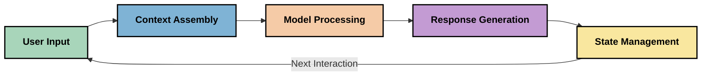
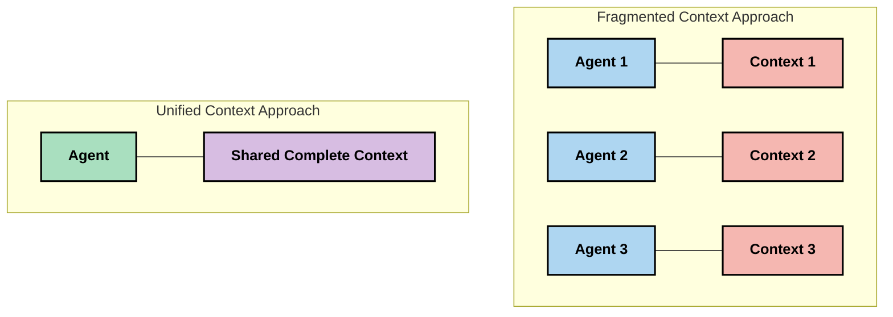
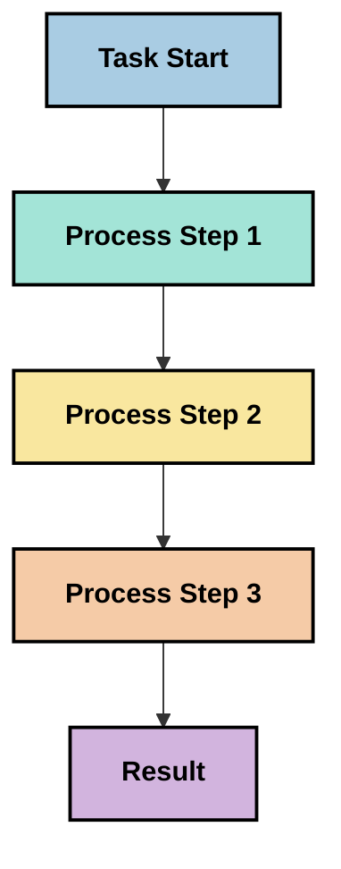
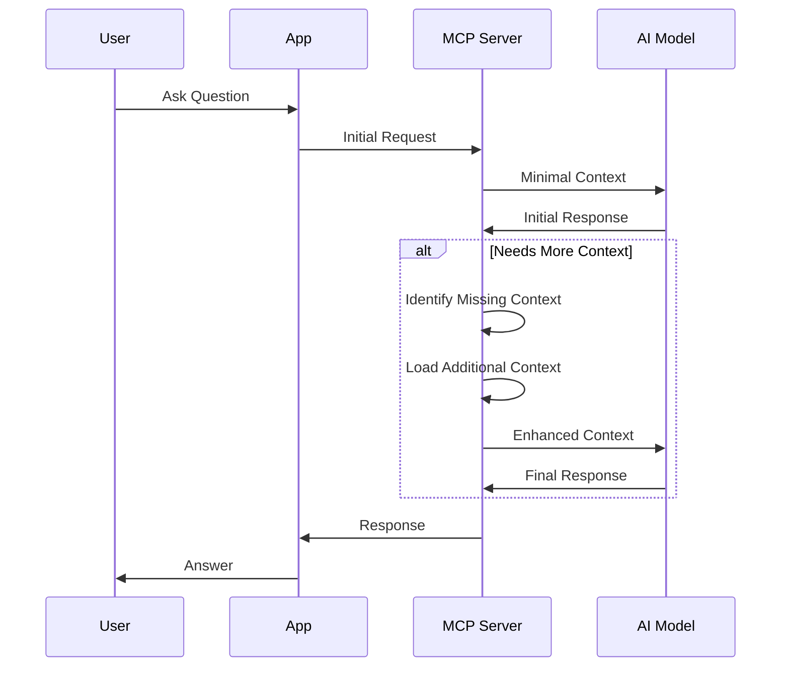
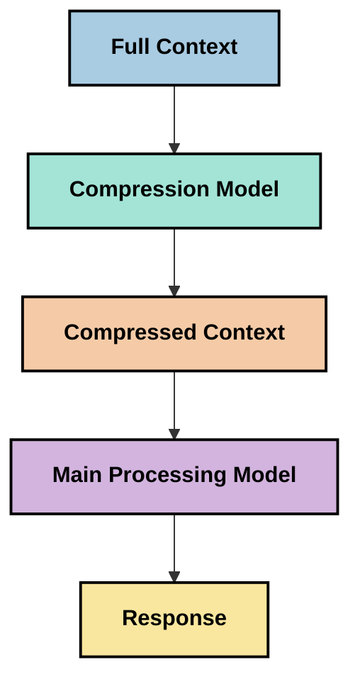

# சூழல் பொறியியல்: MCP சூழலமைப்பில் உருவாகும் ஒரு கருத்து

## கண்ணோட்டம்

சூழல் பொறியியல் என்பது AI துறையில் உருவாகும் ஒரு புதிய கருத்தாகும், இது தகவல் எவ்வாறு அமைக்கப்படுகிறது, வழங்கப்படுகிறது மற்றும் பராமரிக்கப்படுகிறது என்பதை ஆராய்கிறது, குறிப்பாக வாடிக்கையாளர்கள் மற்றும் AI சேவைகளுக்கிடையிலான தொடர்புகளில். மாடல் சூழல் நெறிமுறை (MCP) சூழலமைப்பு வளர்ந்துவரும் நிலையில், சூழலை திறமையாக நிர்வகிக்க எப்படி என்பதைப் புரிந்துகொள்வது மிகவும் முக்கியமாகிறது. இந்த தொகுதி சூழல் பொறியியல் என்ற கருத்தை அறிமுகப்படுத்துகிறது மற்றும் MCP செயல்பாடுகளில் அதன் சாத்தியமான பயன்பாடுகளை ஆராய்கிறது.

## கற்றல் நோக்கங்கள்

இந்த தொகுதியின் முடிவில், நீங்கள்:

- சூழல் பொறியியல் என்ற உருவாகும் கருத்தை MCP பயன்பாடுகளில் அதன் சாத்தியமான பங்கு குறித்து புரிந்துகொள்ளலாம்
- MCP நெறிமுறை வடிவமைப்பு தீர்மானிக்கும் முக்கிய சவால்களை அடையாளம் காணலாம்
- சிறந்த சூழல் கையாளுதலின் மூலம் மாடல் செயல்திறனை மேம்படுத்தும் தொழில்நுட்பங்களை ஆராயலாம்
- சூழல் செயல்திறனை அளவிடும் மற்றும் மதிப்பீடு செய்யும் அணுகுமுறைகளை பரிசீலிக்கலாம்
- MCP கட்டமைப்பின் மூலம் AI அனுபவங்களை மேம்படுத்த இந்த உருவாகும் கருத்துகளைப் பயன்படுத்தலாம்

## சூழல் பொறியியல் அறிமுகம்

சூழல் பொறியியல் என்பது பயனர்கள், பயன்பாடுகள் மற்றும் AI மாடல்களுக்கிடையிலான தகவல் ஓட்டத்தை திட்டமிட்டு வடிவமைப்பதற்கும் நிர்வகிப்பதற்கும் மையமாகக் கொண்ட உருவாகும் ஒரு கருத்தாகும். ப்ராம்ட் பொறியியல் போன்ற நிலைநிறுத்தப்பட்ட துறைகளுக்கு மாறாக, சூழல் பொறியியல் இன்னும் நடைமுறையாளர்களால் வரையறுக்கப்படுகிறது, அவர்கள் AI மாடல்களுக்கு சரியான தகவலை சரியான நேரத்தில் வழங்குவதற்கான தனித்துவமான சவால்களைத் தீர்க்க முயற்சிக்கின்றனர்.

பெரிய மொழி மாடல்கள் (LLMs) வளர்ந்துள்ள நிலையில், சூழலின் முக்கியத்துவம் அதிகமாக வெளிப்படுகிறது. நாம் வழங்கும் சூழலின் தரம், தொடர்பு மற்றும் அமைப்பு நேரடியாக மாடல் வெளியீடுகளைப் பாதிக்கிறது. சூழல் பொறியியல் இந்த உறவை ஆராய்கிறது மற்றும் திறமையான சூழல் நிர்வகிப்பதற்கான கொள்கைகளை உருவாக்க முயற்சிக்கிறது.

> "2025 ஆம் ஆண்டில், அங்கு உள்ள மாடல்கள் மிகவும் புத்திசாலி. ஆனால், அவர்கள் கேட்கப்பட்டதைச் செய்ய எந்த புத்திசாலி மனிதனும் தன் வேலை செய்ய முடியாது... 'சூழல் பொறியியல்' என்பது ப்ராம்ட் பொறியியலின் அடுத்த நிலை. இது ஒரு மாறும் அமைப்பில் தானாகவே இதைச் செய்வதற்கானது." — வால்டன் யான், Cognition AI

சூழல் பொறியியல் கீழ்கண்டவற்றை உள்ளடக்கலாம்:

1. **சூழல் தேர்வு**: குறிப்பிட்ட பணிக்கான தொடர்புடைய தகவலைத் தீர்மானித்தல்
2. **சூழல் அமைப்பு**: மாடல் புரிதலை அதிகரிக்க தகவலை ஒழுங்குபடுத்துதல்
3. **சூழல் வழங்கல்**: தகவல் எப்போது மற்றும் எவ்வாறு மாடல்களுக்கு அனுப்பப்படுகிறது என்பதை மேம்படுத்துதல்
4. **சூழல் பராமரிப்பு**: காலப்போக்கில் சூழலின் நிலை மற்றும் பரிணாமத்தை நிர்வகித்தல்
5. **சூழல் மதிப்பீடு**: சூழலின் செயல்திறனை அளவிடுதல் மற்றும் மேம்படுத்துதல்

இந்த கவனம் செலுத்தும் பகுதிகள் MCP சூழலமைப்பிற்கு மிகவும் தொடர்புடையவை, இது LLMக்களுக்கு பயன்பாடுகள் சூழலை வழங்குவதற்கான ஒரு நிலையான வழியை வழங்குகிறது.

## சூழல் பயணத்தின் பார்வை

MCP அமைப்பின் மூலம் தகவல் எவ்வாறு பயணிக்கிறது என்பதை கண்காணிப்பதன் மூலம் சூழல் பொறியியலை கற்பனை செய்யலாம்:



### சூழல் பயணத்தின் முக்கிய கட்டங்கள்:

1. **பயனர் உள்ளீடு**: பயனரிடமிருந்து பெறப்படும் மூல தகவல் (உரை, படங்கள், ஆவணங்கள்)
2. **சூழல் தொகுப்பு**: பயனர் உள்ளீட்டை அமைப்பு சூழல், உரையாடல் வரலாறு மற்றும் பிற மீட்ட தகவலுடன் இணைத்தல்
3. **மாடல் செயலாக்கம்**: AI மாடல் தொகுக்கப்பட்ட சூழலை செயலாக்குகிறது
4. **பதில் உருவாக்கம்**: வழங்கப்பட்ட சூழலின் அடிப்படையில் மாடல் வெளியீடுகளை உருவாக்குகிறது
5. **நிலை மேலாண்மை**: தொடர்பின் அடிப்படையில் அமைப்பு அதன் உள் நிலையைப் புதுப்பிக்கிறது

இந்த பார்வை AI அமைப்புகளில் சூழலின் மாறும் தன்மையை வெளிப்படுத்துகிறது மற்றும் ஒவ்வொரு கட்டத்திலும் தகவலை சிறப்பாக நிர்வகிக்க எப்படி என்பதைப் பற்றிய முக்கிய கேள்விகளை எழுப்புகிறது.

## சூழல் பொறியியலில் உருவாகும் கொள்கைகள்

சூழல் பொறியியல் துறை உருவாகும் நிலையில், சில ஆரம்ப கொள்கைகள் நடைமுறையாளர்களிடமிருந்து உருவாகத் தொடங்குகின்றன. இந்த கொள்கைகள் MCP செயல்பாடுகளுக்கான தேர்வுகளைத் தகவமைக்க உதவலாம்:

### கொள்கை 1: சூழலை முழுமையாக பகிர்ந்து கொள்ளுங்கள்

சூழல் ஒரு அமைப்பின் அனைத்து கூறுகளுக்கிடையே முழுமையாக பகிரப்பட்டிருக்க வேண்டும், பல முகவர்களோ அல்லது செயல்முறைகளோ மூலம் சிதறியிருக்கக் கூடாது. சூழல் பகிர்ந்தளிக்கப்படும் போது, அமைப்பின் ஒரு பகுதியில் எடுக்கப்படும் முடிவுகள் மற்ற இடங்களில் எடுக்கப்படும் முடிவுகளுடன் முரண்படலாம்.



MCP பயன்பாடுகளில், இது சூழல் முழு குழாய்வழியாக சீராக பாயும் அமைப்புகளை வடிவமைப்பதைப் பரிந்துரைக்கிறது, compartmentalized ஆக இருக்காமல்.

### கொள்கை 2: செயல்கள் மறைமுக முடிவுகளை கொண்டிருப்பதை உணருங்கள்

மாடல் எடுக்கும் ஒவ்வொரு நடவடிக்கையும் சூழலை எப்படி விளக்குவது என்பதைப் பற்றிய மறைமுக முடிவுகளை உள்ளடக்கியது. பல கூறுகள் வெவ்வேறு சூழல்களில் செயல்படும்போது, இந்த மறைமுக முடிவுகள் முரண்படலாம், இது முரண்பட்ட முடிவுகளை உருவாக்கும்.

இந்த கொள்கை MCP பயன்பாடுகளுக்கு முக்கியமான விளைவுகளை கொண்டுள்ளது:
- சிக்கலான பணிகளை பிளவுபட்ட சூழலுடன் இணைந்த செயல்முறையை விட நேரியல் செயலாக்கத்தை விரும்புங்கள்
- அனைத்து முடிவு புள்ளிகளும் ஒரே சூழல் தகவலுக்கு அணுகுமுறை கொண்டிருக்க வேண்டும் என்பதை உறுதிப்படுத்துங்கள்
- முந்தைய முடிவுகளின் முழு சூழலை பின்னர் படிகள் காணக்கூடிய அமைப்புகளை வடிவமைக்கவும்

### கொள்கை 3: சூழல் ஆழத்தை சாளர வரம்புகளுடன் சமநிலைப்படுத்துங்கள்

உரையாடல்கள் மற்றும் செயல்முறைகள் நீண்டதாக வளரும்போது, சூழல் சாளரங்கள் இறுதியில் நிரம்பிவிடும். திறமையான சூழல் பொறியியல் விரிவான சூழல் மற்றும் தொழில்நுட்ப வரம்புகளுக்கு இடையிலான இந்த மோதலை நிர்வகிக்கும் அணுகுமுறைகளை ஆராய்கிறது.

ஆராயப்படும் சாத்தியமான அணுகுமுறைகள்:
- முக்கிய தகவலை பராமரிக்க, டோக்கன் பயன்பாட்டை குறைக்கும் சூழல் சுருக்கம்
- தற்போதைய தேவைகளுக்கு தொடர்புடையதை அடிப்படையாகக் கொண்ட சூழலின் முன்னேற்றமான ஏற்றுதல்
- முக்கிய முடிவுகள் மற்றும் உண்மைகளைப் பாதுகாத்து முந்தைய தொடர்புகளை சுருக்குதல்

## சூழல் சவால்கள் மற்றும் MCP நெறிமுறை வடிவமைப்பு

மாடல் சூழல் நெறிமுறை (MCP) சூழல் மேலாண்மையின் தனித்துவமான சவால்களை உணர்ந்து வடிவமைக்கப்பட்டது. இந்த சவால்களைப் புரிந்துகொள்வது MCP நெறிமுறை வடிவமைப்பின் முக்கிய அம்சங்களை விளக்க உதவுகிறது:

### சவால் 1: சூழல் சாளர வரம்புகள்
பெரும்பாலான AI மாடல்களுக்கு நிலையான சூழல் சாளர அளவுகள் உள்ளன, இது ஒரே நேரத்தில் எவ்வளவு தகவலை செயலாக்க முடியும் என்பதை வரையறுக்கிறது.

**MCP வடிவமைப்பு பதில்:** 
- நெறிமுறை அமைக்கப்பட்ட, வள அடிப்படையிலான சூழலை ஆதரிக்கிறது, இது திறமையாக குறிப்பிடப்படலாம்
- வளங்கள் பக்கமாக்கப்பட்டு முன்னேற்றமாக ஏற்றப்படலாம்

### சவால் 2: தொடர்புடையதைத் தீர்மானித்தல்
சூழலில் சேர்க்க மிகவும் தொடர்புடைய தகவலைத் தீர்மானிப்பது கடினம்.

**MCP வடிவமைப்பு பதில்:**
- தேவைக்கேற்ப தகவலை மாறுபடும் முறையில் மீட்டெடுக்கும் நெகிழ்வான கருவிகள்
- சீரான சூழல் அமைப்பை இயக்க அமைக்கப்பட்ட ப்ராம்ட்கள்

### சவால் 3: சூழல் நிலைத்தன்மை
தொடர்புகளுக்கு இடையே நிலையை நிர்வகிப்பது சூழலின் கவனமாக கண்காணிப்பை தேவைப்படுகிறது.

**MCP வடிவமைப்பு பதில்:**
- நிலையான அமர்வு மேலாண்மை
- சூழல் பரிணாமத்திற்கான தெளிவான தொடர்பு முறை

### சவால் 4: பலவகை சூழல்
வெவ்வேறு வகையான தரவுகள் (உரை, படங்கள், அமைக்கப்பட்ட தரவுகள்) வெவ்வேறு கையாளுதலை தேவைப்படும்.

**MCP வடிவமைப்பு பதில்:**
- பலவகை உள்ளடக்க வகைகளை ஏற்க நெறிமுறை வடிவமைப்பு
- பலவகை தகவலின் நிலையான பிரதிநிதித்துவம்

### சவால் 5: பாதுகாப்பு மற்றும் தனியுரிமை
சூழல் பெரும்பாலும் பாதுகாக்க வேண்டிய நுணுக்கமான தகவல்களை உள்ளடக்கியது.

**MCP வடிவமைப்பு பதில்:**
- வாடிக்கையாளர் மற்றும் சேவையக பொறுப்புகளுக்கு இடையிலான தெளிவான எல்லைகள்
- தரவின் வெளிப்பாட்டை குறைக்க உள்ளூர் செயலாக்க விருப்பங்கள்

இந்த சவால்களை MCP எப்படி தீர்க்கிறது என்பதைப் புரிந்துகொள்வது மேம்பட்ட சூழல் பொறியியல் தொழில்நுட்பங்களை ஆராய்வதற்கான அடித்தளத்தை வழங்குகிறது.

## உருவாகும் சூழல் பொறியியல் அணுகுமுறைகள்

சூழல் பொறியியல் துறை வளர்ந்துவரும் நிலையில், பல வாக்குறுதியான அணுகுமுறைகள் உருவாகின்றன. இவை தற்போதைய சிந்தனையை பிரதிநிதித்துவப்படுத்துகின்றன, நிலைநிறுத்தப்பட்ட சிறந்த நடைமுறைகள் அல்ல, மேலும் MCP செயல்பாடுகளுடன் அதிக அனுபவம் பெறும்போது மாறக்கூடும்.

### 1. ஒற்றை-தோராய செயல்முறை

சூழலைப் பகிர்ந்தளிக்கும் பல முகவர் கட்டமைப்புகளுக்கு மாறாக, சில நடைமுறையாளர்கள் ஒற்றை-தோராய செயல்முறை மேலும் சீரான முடிவுகளை உருவாக்குகிறது என்று கண்டறிகின்றனர். இது ஒருங்கிணைந்த சூழலை பராமரிக்கும் கொள்கையுடன் ஒத்துப்போகிறது.



இந்த அணுகுமுறை பிளவுபட்ட செயல்முறையை விட குறைவான திறமையானதாக தோன்றினாலும், ஒவ்வொரு படியும் முந்தைய முடிவுகளின் முழுமையான புரிதலின் அடிப்படையில் உருவாக்கப்படுவதால் இது மேலும் தெளிவான மற்றும் நம்பகமான முடிவுகளை உருவாக்குகிறது.

### 2. சூழல் துண்டாக்கல் மற்றும் முன்னுரிமை

பெரிய சூழல்களை நிர்வகிக்கக்கூடிய துண்டுகளாக உடைத்து, மிகவும் முக்கியமானவற்றுக்கு முன்னுரிமை அளித்தல்.

```python
# Conceptual Example: Context Chunking and Prioritization
def process_with_chunked_context(documents, query):
    # 1. Break documents into smaller chunks
    chunks = chunk_documents(documents)
    
    # 2. Calculate relevance scores for each chunk
    scored_chunks = [(chunk, calculate_relevance(chunk, query)) for chunk in chunks]
    
    # 3. Sort chunks by relevance score
    sorted_chunks = sorted(scored_chunks, key=lambda x: x[1], reverse=True)
    
    # 4. Use the most relevant chunks as context
    context = create_context_from_chunks([chunk for chunk, score in sorted_chunks[:5]])
    
    # 5. Process with the prioritized context
    return generate_response(context, query)
```

மேலே உள்ள கருத்து பெரிய ஆவணங்களை நிர்வகிக்கக்கூடிய துண்டுகளாக உடைத்து, சூழலுக்கு மிகவும் தொடர்புடைய பகுதிகளை மட்டுமே தேர்ந்தெடுப்பது எப்படி என்பதை விளக்குகிறது. இந்த அணுகுமுறை சூழல் சாளர வரம்புகளுக்குள் வேலை செய்ய உதவுகிறது, மேலும் பெரிய அறிவு அடிப்படைகளைப் பயன்படுத்துகிறது.

### 3. முன்னேற்றமான சூழல் ஏற்றுதல்

சூழலை ஒரே நேரத்தில் முழுமையாக ஏற்றாமல் தேவைக்கேற்ப முன்னேற்றமாக ஏற்றுதல்.



முன்னேற்றமான சூழல் ஏற்றுதல் குறைந்தபட்ச சூழலுடன் தொடங்குகிறது மற்றும் தேவையான போது மட்டுமே விரிவடைகிறது. இது எளிய கேள்விகளுக்கு டோக்கன் பயன்பாட்டை குறிப்பிடத்தக்க அளவு குறைக்க முடியும், மேலும் சிக்கலான கேள்விகளை கையாளும் திறனை பராமரிக்கிறது.

### 4. சூழல் சுருக்கம் மற்றும் சுருக்கம்

முக்கிய தகவலைப் பாதுகாத்து சூழல் அளவைக் குறைத்தல்.



சூழல் சுருக்கம் கவனம் செலுத்துகிறது:
- மீண்டும் மீண்டும் வரும் தகவலை நீக்குதல்
- நீண்ட உள்ளடக்கத்தை சுருக்குதல்
- முக்கிய உண்மைகள் மற்றும் விவரங்களை எடுப்பது
- முக்கிய சூழல் கூறுகளைப் பாதுகாத்தல்
- டோக்கன் திறமைக்காக மேம்படுத்துதல்

இந்த அணுகுமுறை நீண்ட உரையாடல்களை சூழல் சாளரங்களுக்குள் பராமரிக்க அல்லது பெரிய ஆவணங்களை திறமையாக செயலாக்க மிகவும் மதிப்புமிக்கதாக இருக்கலாம். சில நடைமுறையாளர்கள் உரையாடல் வரலாற்றின் சூழல் சுருக்கம் மற்றும் சுருக்கத்திற்காக சிறப்பு மாடல்களைப் பயன்படுத்துகின்றனர்.

## ஆராய்ச்சியான சூழல் பொறியியல் பரிசீலனைகள்

MCP செயல்பாடுகளுடன் வேலை செய்யும்போது, சில பரிசீலனைகள் உங்கள் குறிப்பிட்ட பயன்பாட்டில் மேம்பாடுகளை உருவாக்கக்கூடும். இவை கட்டாயமான சிறந்த நடைமுறைகள் அல்ல, மாறாக ஆராய்ச்சியின் பகுதிகள்.

### உங்கள் சூழல் இலக்குகளைப் பரிசீலிக்கவும்

சிக்கலான சூழல் மேலாண்மை தீர்வுகளை செயல்படுத்துவதற்கு முன், நீங்கள் எதை அடைய முயற்சிக்கிறீர்கள் என்பதை தெளிவாகக் கூறுங்கள்:
- மாடல் வெற்றிகரமாக இருக்க எந்த குறிப்பிட்ட தகவல் தேவை?
- எந்த தகவல் முக்கியமானது,เส
- [மாடல் கான்டெக்ஸ்ட் புரோட்டோகால் வலைத்தளம்](https://modelcontextprotocol.io/)
- [மாடல் கான்டெக்ஸ்ட் புரோட்டோகால் விவரக்குறிப்பு](https://github.com/modelcontextprotocol/modelcontextprotocol)
- [MCP ஆவணங்கள்](https://modelcontextprotocol.io/docs)
- [MCP C# SDK](https://github.com/modelcontextprotocol/csharp-sdk)
- [MCP Python SDK](https://github.com/modelcontextprotocol/python-sdk)
- [MCP TypeScript SDK](https://github.com/modelcontextprotocol/typescript-sdk)
- [MCP Inspector](https://github.com/modelcontextprotocol/inspector) - MCP சர்வர்களுக்கான காட்சி சோதனை கருவி

### கான்டெக்ஸ்ட் இன்ஜினியரிங் கட்டுரைகள்
- [பல முகவர்களை உருவாக்க வேண்டாம்: கான்டெக்ஸ்ட் இன்ஜினியரிங் கொள்கைகள்](https://cognition.ai/blog/dont-build-multi-agents) - வால்டன் யான் வழங்கிய கான்டெக்ஸ்ட் இன்ஜினியரிங் கொள்கைகள் பற்றிய பார்வைகள்
- [முகவர்களை உருவாக்குவதற்கான நடைமுறை வழிகாட்டி](https://cdn.openai.com/business-guides-and-resources/a-practical-guide-to-building-agents.pdf) - திறமையான முகவர்களை வடிவமைப்பதற்கான OpenAI வழிகாட்டி
- [திறமையான முகவர்களை உருவாக்குதல்](https://www.anthropic.com/engineering/building-effective-agents) - Anthropic வழங்கிய முகவர் மேம்பாட்டு அணுகுமுறை

### தொடர்புடைய ஆராய்ச்சிகள்
- [பெரிய மொழி மாடல்களுக்கு மாறும் தேடல் மேம்பாடு](https://arxiv.org/abs/2310.01487) - மாறும் தேடல் அணுகுமுறைகள் பற்றிய ஆராய்ச்சி
- [நடுத்தரத்தில் தொலைந்தது: மொழி மாடல்கள் நீண்ட கான்டெக்ஸ்ட்களை எப்படி பயன்படுத்துகின்றன](https://arxiv.org/abs/2307.03172) - கான்டெக்ஸ்ட் செயலாக்க முறைகள் பற்றிய முக்கிய ஆராய்ச்சி
- [CLIP லேட்டன்ட்களுடன் அடுக்குமுறை உரை-நிபந்தனையுள்ள பட உருவாக்கம்](https://arxiv.org/abs/2204.06125) - DALL-E 2 காகிதம், கான்டெக்ஸ்ட் அமைப்பின் பார்வைகள்
- [பெரிய மொழி மாடல் கட்டமைப்புகளில் கான்டெக்ஸ்டின் பங்கு ஆராய்வு](https://aclanthology.org/2023.findings-emnlp.124/) - சமீபத்திய கான்டெக்ஸ்ட் கையாளல் ஆராய்ச்சி
- [பல முகவர் ஒத்துழைப்பு: ஒரு ஆய்வு](https://arxiv.org/abs/2304.03442) - பல முகவர் அமைப்புகள் மற்றும் அவற்றின் சவால்கள் பற்றிய ஆராய்ச்சி

### கூடுதல் வளங்கள்
- [கான்டெக்ஸ்ட் விண்டோ மேம்பாட்டு தொழில்நுட்பங்கள்](https://learn.microsoft.com/en-us/azure/ai-services/openai/concepts/context-window)
- [மேம்பட்ட RAG தொழில்நுட்பங்கள்](https://www.microsoft.com/en-us/research/blog/retrieval-augmented-generation-rag-and-frontier-models/)
- [செமாண்டிக் கர்னல் ஆவணங்கள்](https://github.com/microsoft/semantic-kernel)
- [AI கருவிகள் கான்டெக்ஸ்ட் மேலாண்மைக்காக](https://github.com/microsoft/aitoolkit)

## அடுத்தது என்ன 

- [5.15 MCP தனிப்பயன் போக்குவரத்து](../mcp-transport/README.md)

---

**அறிவிப்பு**:  
இந்த ஆவணம் [Co-op Translator](https://github.com/Azure/co-op-translator) என்ற AI மொழிபெயர்ப்பு சேவையை பயன்படுத்தி மொழிபெயர்க்கப்பட்டுள்ளது. நாங்கள் துல்லியத்திற்காக முயற்சிக்கிறோம், ஆனால் தானியங்கி மொழிபெயர்ப்புகளில் பிழைகள் அல்லது தவறுகள் இருக்கக்கூடும் என்பதை தயவுசெய்து கவனத்தில் கொள்ளவும். அதன் சொந்த மொழியில் உள்ள மூல ஆவணம் அதிகாரப்பூர்வ ஆதாரமாக கருதப்பட வேண்டும். முக்கியமான தகவல்களுக்கு, தொழில்முறை மனித மொழிபெயர்ப்பு பரிந்துரைக்கப்படுகிறது. இந்த மொழிபெயர்ப்பைப் பயன்படுத்துவதால் ஏற்படும் எந்த தவறான புரிதல்களுக்கும் அல்லது தவறான விளக்கங்களுக்கும் நாங்கள் பொறுப்பல்ல.