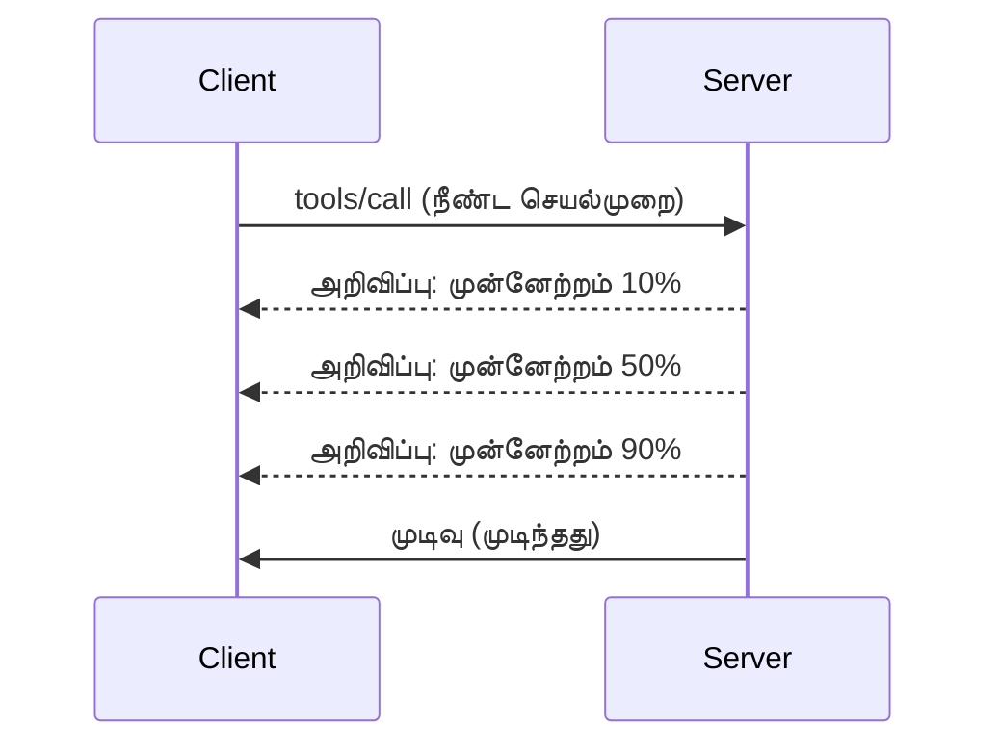

# MCP புரொட்டோகால் அம்சங்களின் ஆழ்ந்த ஆய்வு

இந்த வழிகாட்டு MCP புரொட்டோகால் அம்சங்களை அடிப்படைக் கருவி மற்றும் வள மேலாண்மையை மீறும் முறையில் ஆராய்கிறது. இவை புரிதல் மூலம் நீங்கள் மிக வலுவான, பயனர் நட்பு மற்றும் உற்பத்தி தயாரான MCP சர்வர்களை உருவாக்க முடியும்.

## கையாளப்பட்ட அம்சங்கள்

1. **செயல்பாட்டுத் தகவல்கள்** - நீண்டநாள் இயங்கும் செயல்களுக்கு முன்னேற்றம் அறிவிப்பு
2. **கோரிக்கை நிறுத்தல்** - கிளையன்ட்கள் நடுவே செல்லும் கோரிக்கைகளை நிறுத்த அனுமதிக்கவும்
3. **வள வார்ப்புருக்கள்** - வரிவிதிகளுடன் இயக்கக்கூடிய வள URIகள்
4. **சர்வர் வாழ்க்கைச் சுழற்சி நிகழ்வுகள்** - சரியான துவக்கம் மற்றும் மூடல்
5. **பதில் பதிவு கட்டுப்பாடு** - சர்வர் பக்க பதிலியல் கட்டமைப்பு
6. **பிழை கைமுறை முறைமைகள்** - ஒரே மாதிரியான பிழை பதில்கள்

---

## 1. செயல்பாட்டுத் தகவல்கள்

நேரம் گیرும் செயல்கள் (தரவு செயலாக்கம், கோப்பு பதிவிறக்கம், API அழைப்புகள்) பயன்பாட்டாளர்களை அறிய வைத்திருக்கும் முன்னேற்ற அறிவிப்புகள்.

### அது எப்படி செயல்படுகிறது


### பைதான் நடைமுறை

```python
from mcp.server import Server, NotificationOptions
from mcp.types import ProgressNotification
import asyncio

app = Server("progress-server")

@app.tool()
async def process_large_file(file_path: str, ctx) -> str:
    """Process a large file with progress updates."""
    
    # முன்னேற்ற கணக்கீட்டிற்கான கோப்பு அளவை பெறவும்
    file_size = os.path.getsize(file_path)
    processed = 0
    
    with open(file_path, 'rb') as f:
        while chunk := f.read(8192):
            # துண்டை செயலாக்கவும்
            await process_chunk(chunk)
            processed += len(chunk)
            
            # முன்னேற்ற அறிவிப்பை அனுப்பவும்
            progress = (processed / file_size) * 100
            await ctx.send_notification(
                ProgressNotification(
                    progressToken=ctx.request_id,
                    progress=progress,
                    total=100,
                    message=f"Processing: {progress:.1f}%"
                )
            )
    
    return f"Processed {file_size} bytes"

@app.tool()
async def batch_operation(items: list[str], ctx) -> str:
    """Process multiple items with progress."""
    
    results = []
    total = len(items)
    
    for i, item in enumerate(items):
        result = await process_item(item)
        results.append(result)
        
        # ஒவ்வொரு உருப்படியின் பின்னரும் முன்னேற்றத்தை அளிக்கவும்
        await ctx.send_notification(
            ProgressNotification(
                progressToken=ctx.request_id,
                progress=i + 1,
                total=total,
                message=f"Processed {i + 1}/{total}: {item}"
            )
        )
    
    return f"Completed {total} items"
```

### டைப்ஸ்கிரிப்ட் நடைமுறை

```typescript
import { Server } from "@modelcontextprotocol/sdk/server/index.js";

server.setRequestHandler(CallToolSchema, async (request, extra) => {
  const { name, arguments: args } = request.params;
  
  if (name === "process_data") {
    const items = args.items as string[];
    const results = [];
    
    for (let i = 0; i < items.length; i++) {
      const result = await processItem(items[i]);
      results.push(result);
      
      // முன்னேற்ற அறிவிப்பு அனுப்பு
      await extra.sendNotification({
        method: "notifications/progress",
        params: {
          progressToken: request.id,
          progress: i + 1,
          total: items.length,
          message: `Processing item ${i + 1}/${items.length}`
        }
      });
    }
    
    return { content: [{ type: "text", text: JSON.stringify(results) }] };
  }
});
```

### கிளையன்ட் கைமுறை (பைதான்)

```python
async def handle_progress(notification):
    """Handle progress notifications from server."""
    params = notification.params
    print(f"Progress: {params.progress}/{params.total} - {params.message}")

# ஹேண்ட்லரை பதிவு செய்க
session.on_notification("notifications/progress", handle_progress)

# கருவியை அழைப்பு செய்க (முன்னேற்றத் தகவல்கள் ஹேண்ட்லரின் மூலம் வருவார்கள்)
result = await session.call_tool("process_large_file", {"file_path": "/data/large.csv"})
```

---

## 2. கோரிக்கை நிறுத்தல்

கிளையன்ட்கள் தேவை இல்லாமல் போன அல்லது அதிக நேரம் எடுத்துக்கொள்ளும் கோரிக்கைகளை நிறுத்த அனுமதிக்கவும்.

### பைதான் நடைமுறை

```python
from mcp.server import Server
from mcp.types import CancelledError
import asyncio

app = Server("cancellable-server")

@app.tool()
async def long_running_search(query: str, ctx) -> str:
    """Search that can be cancelled."""
    
    results = []
    
    try:
        for page in range(100):  # பல பக்கங்களைத் தேடுதல்
            # ரத்து செய்யுமாறு கேட்டுக்கொண்டாரா என்பதைச் சரிபார்க்கவும்
            if ctx.is_cancelled:
                raise CancelledError("Search cancelled by user")
            
            # பக்கத் தேடலை நகலெடுக்கவும்
            page_results = await search_page(query, page)
            results.extend(page_results)
            
            # சிறிய தாமதம் ரத்து பரிசோதனைகளை அனுமதிக்கிறது
            await asyncio.sleep(0.1)
            
    except CancelledError:
        # பகுதி முடிவுகளைத் திருப்பி அனுப்புக
        return f"Cancelled. Found {len(results)} results before cancellation."
    
    return f"Found {len(results)} total results"

@app.tool()
async def download_file(url: str, ctx) -> str:
    """Download with cancellation support."""
    
    async with aiohttp.ClientSession() as session:
        async with session.get(url) as response:
            total_size = int(response.headers.get('content-length', 0))
            downloaded = 0
            chunks = []
            
            async for chunk in response.content.iter_chunked(8192):
                if ctx.is_cancelled:
                    return f"Download cancelled at {downloaded}/{total_size} bytes"
                
                chunks.append(chunk)
                downloaded += len(chunk)
            
            return f"Downloaded {downloaded} bytes"
```

### நிறுத்தல் சூழல் செயல்படுத்தல்

```python
class CancellableContext:
    """Context object that tracks cancellation state."""
    
    def __init__(self, request_id: str):
        self.request_id = request_id
        self._cancelled = asyncio.Event()
        self._cancel_reason = None
    
    @property
    def is_cancelled(self) -> bool:
        return self._cancelled.is_set()
    
    def cancel(self, reason: str = "Cancelled"):
        self._cancel_reason = reason
        self._cancelled.set()
    
    async def check_cancelled(self):
        """Raise if cancelled, otherwise continue."""
        if self.is_cancelled:
            raise CancelledError(self._cancel_reason)
    
    async def sleep_or_cancel(self, seconds: float):
        """Sleep that can be interrupted by cancellation."""
        try:
            await asyncio.wait_for(
                self._cancelled.wait(),
                timeout=seconds
            )
            raise CancelledError(self._cancel_reason)
        except asyncio.TimeoutError:
            pass  # சாதாரண நேர அவகாசம், தொடரவும்
```

### கிளையன்ட் பக்க நிறுத்தல்

```python
import asyncio

async def search_with_timeout(session, query, timeout=30):
    """Search with automatic cancellation on timeout."""
    
    task = asyncio.create_task(
        session.call_tool("long_running_search", {"query": query})
    )
    
    try:
        result = await asyncio.wait_for(task, timeout=timeout)
        return result
    except asyncio.TimeoutError:
        # கோரிக்கை ரத்து செய்யப்பட்டது
        await session.send_notification({
            "method": "notifications/cancelled",
            "params": {"requestId": task.request_id, "reason": "Timeout"}
        })
        return "Search timed out"
```

---

## 3. வள வார்ப்புருக்கள்

வள வார்ப்புருக்கள் இயக்கற்ற URI கட்டமைப்புக்கு பரிமாணங்களுடன் அனுமதி தருகின்றன, APIகள் மற்றும் தரவுத்தளங்களுக்கு பயனுள்ளதாக உள்ளது.

### வார்ப்புருக்கள் வரையறுத்தல்

```python
from mcp.server import Server
from mcp.types import ResourceTemplate

app = Server("template-server")

@app.list_resource_templates()
async def list_templates() -> list[ResourceTemplate]:
    """Return available resource templates."""
    return [
        ResourceTemplate(
            uriTemplate="db://users/{user_id}",
            name="User Profile",
            description="Fetch user profile by ID",
            mimeType="application/json"
        ),
        ResourceTemplate(
            uriTemplate="api://weather/{city}/{date}",
            name="Weather Data",
            description="Historical weather for city and date",
            mimeType="application/json"
        ),
        ResourceTemplate(
            uriTemplate="file://{path}",
            name="File Content",
            description="Read file at given path",
            mimeType="text/plain"
        )
    ]

@app.read_resource()
async def read_resource(uri: str) -> str:
    """Read resource, expanding template parameters."""
    
    # URI ஐ பகுத்தறிந்து அளவுருக்களை எடுத்து வைக்க வேண்டும்
    if uri.startswith("db://users/"):
        user_id = uri.split("/")[-1]
        return await fetch_user(user_id)
    
    elif uri.startswith("api://weather/"):
        parts = uri.replace("api://weather/", "").split("/")
        city, date = parts[0], parts[1]
        return await fetch_weather(city, date)
    
    elif uri.startswith("file://"):
        path = uri.replace("file://", "")
        return await read_file(path)
    
    raise ValueError(f"Unknown resource URI: {uri}")
```

### டைப்ஸ்கிரிப்ட் நடைமுறை

```typescript
server.setRequestHandler(ListResourceTemplatesSchema, async () => {
  return {
    resourceTemplates: [
      {
        uriTemplate: "github://repos/{owner}/{repo}/issues/{issue_number}",
        name: "GitHub Issue",
        description: "Fetch a specific GitHub issue",
        mimeType: "application/json"
      },
      {
        uriTemplate: "db://tables/{table}/rows/{id}",
        name: "Database Row",
        description: "Fetch a row from a database table",
        mimeType: "application/json"
      }
    ]
  };
});

server.setRequestHandler(ReadResourceSchema, async (request) => {
  const uri = request.params.uri;
  
  // GitHub பிரச்சனை URI-ஐ பகுப்பாய்வு செய்க
  const githubMatch = uri.match(/^github:\/\/repos\/([^/]+)\/([^/]+)\/issues\/(\d+)$/);
  if (githubMatch) {
    const [_, owner, repo, issueNumber] = githubMatch;
    const issue = await fetchGitHubIssue(owner, repo, parseInt(issueNumber));
    return {
      contents: [{
        uri,
        mimeType: "application/json",
        text: JSON.stringify(issue, null, 2)
      }]
    };
  }
  
  throw new Error(`Unknown resource URI: ${uri}`);
});
```

---

## 4. சர்வர் வாழ்க்கைச் சுழற்சி நிகழ்வுகள்

சரியான துவக்கம் மற்றும் மூடல் கையாளுதல் வள மேலாண்மையை சுத்தமாக உறுதி செய்கிறது.

### பைதான் வாழ்க்கைச் சுழற்சி மேலாண்மை

```python
from mcp.server import Server
from contextlib import asynccontextmanager

app = Server("lifecycle-server")

# பகிர்ந்த நிலை
db_connection = None
cache = None

@asynccontextmanager
async def lifespan(server: Server):
    """Manage server lifecycle."""
    global db_connection, cache
    
    # துவக்கம்
    print("🚀 Server starting...")
    db_connection = await create_database_connection()
    cache = await create_cache_client()
    print("✅ Resources initialized")
    
    yield  # ச сервер இங்கு இயக்கப்படுகிறது
    
    # அணைப்பு
    print("🛑 Server shutting down...")
    await db_connection.close()
    await cache.close()
    print("✅ Resources cleaned up")

app = Server("lifecycle-server", lifespan=lifespan)

@app.tool()
async def query_database(sql: str) -> str:
    """Use the shared database connection."""
    result = await db_connection.execute(sql)
    return str(result)
```

### டைப்ஸ்கிரிப்ட் வாழ்க்கைச் சுழற்சி

```typescript
import { Server } from "@modelcontextprotocol/sdk/server/index.js";

class ManagedServer {
  private server: Server;
  private dbConnection: DatabaseConnection | null = null;
  
  constructor() {
    this.server = new Server({
      name: "lifecycle-server",
      version: "1.0.0"
    });
    
    this.setupHandlers();
  }
  
  async start() {
    // வளங்களை துவக்கு
    console.log("🚀 Server starting...");
    this.dbConnection = await createDatabaseConnection();
    console.log("✅ Database connected");
    
    // சர்வரை துவக்கு
    await this.server.connect(transport);
  }
  
  async stop() {
    // வளங்களை சுத்தம் செய்
    console.log("🛑 Server shutting down...");
    if (this.dbConnection) {
      await this.dbConnection.close();
    }
    await this.server.close();
    console.log("✅ Cleanup complete");
  }
  
  private setupHandlers() {
    this.server.setRequestHandler(CallToolSchema, async (request) => {
      // இதை this.dbConnectionி பாதுகாப்பாக பயன்படுத்தவும்
      // ...
    });
  }
}

// மென்மையான நிறுத்தத்துடன் பயன்பாடு
const server = new ManagedServer();

process.on('SIGINT', async () => {
  await server.stop();
  process.exit(0);
});

await server.start();
```

---

## 5. பதில் பதிவு கட்டுப்பாடு

MCP சர்வர் பக்க பதில் பதிவு நிலைகள் கிளையன்ட்கள் கட்டுப்படுத்தக்கூடியதாகும்.

### பதில் பதிவு நிலைகள் செயல்படுத்தல்

```python
from mcp.server import Server
from mcp.types import LoggingLevel
import logging

app = Server("logging-server")

# MCP மட்டங்களை Python பதிவேற்று மட்டங்களுடன் இணைக்கவும்
LEVEL_MAP = {
    LoggingLevel.DEBUG: logging.DEBUG,
    LoggingLevel.INFO: logging.INFO,
    LoggingLevel.WARNING: logging.WARNING,
    LoggingLevel.ERROR: logging.ERROR,
}

logger = logging.getLogger("mcp-server")

@app.set_logging_level()
async def set_logging_level(level: LoggingLevel) -> None:
    """Handle client request to change logging level."""
    python_level = LEVEL_MAP.get(level, logging.INFO)
    logger.setLevel(python_level)
    logger.info(f"Logging level set to {level}")

@app.tool()
async def debug_operation(data: str) -> str:
    """Tool with various logging levels."""
    logger.debug(f"Processing data: {data}")
    
    try:
        result = process(data)
        logger.info(f"Successfully processed: {result}")
        return result
    except Exception as e:
        logger.error(f"Processing failed: {e}")
        raise
```

### கிளையன்டுக்கு பதிவு செய்தி அனுப்புதல்

```python
@app.tool()
async def complex_operation(input: str, ctx) -> str:
    """Operation that logs to client."""
    
    # கிளையנטிற்கு பதிவு அறிவிப்பை அனுப்பவும்
    await ctx.send_log(
        level="info",
        message=f"Starting complex operation with input: {input}"
    )
    
    # வேலை செய்க...
    result = await do_work(input)
    
    await ctx.send_log(
        level="debug",
        message=f"Operation complete, result size: {len(result)}"
    )
    
    return result
```

---

## 6. பிழை கைமுறை முறைமைகள்

ஒற்றுமையான பிழை கையாளுதல் பிழைத் தீர்வையும் பயன்பாட்டாளர் அனுபவத்தையும் மேம்படுத்துகிறது.

### MCP பிழை குறியீடுகள்

```python
from mcp.types import McpError, ErrorCode

class ToolError(McpError):
    """Base class for tool errors."""
    pass

class ValidationError(ToolError):
    """Invalid input parameters."""
    def __init__(self, message: str):
        super().__init__(ErrorCode.INVALID_PARAMS, message)

class NotFoundError(ToolError):
    """Requested resource not found."""
    def __init__(self, resource: str):
        super().__init__(ErrorCode.INVALID_REQUEST, f"Not found: {resource}")

class PermissionError(ToolError):
    """Access denied."""
    def __init__(self, action: str):
        super().__init__(ErrorCode.INVALID_REQUEST, f"Permission denied: {action}")

class InternalError(ToolError):
    """Internal server error."""
    def __init__(self, message: str):
        super().__init__(ErrorCode.INTERNAL_ERROR, message)
```

### கட்டமைக்கப்பட்ட பிழை பதில்கள்

```python
@app.tool()
async def safe_operation(input: str) -> str:
    """Tool with comprehensive error handling."""
    
    # உள்ளீட்டை சரிபார்க்கவும்
    if not input:
        raise ValidationError("Input cannot be empty")
    
    if len(input) > 10000:
        raise ValidationError(f"Input too large: {len(input)} chars (max 10000)")
    
    try:
        # அனுமதிகளை சரிபார்க்கவும்
        if not await check_permission(input):
            raise PermissionError(f"read {input}")
        
        # செயல்பாட்டை நடத்தவும்
        result = await perform_operation(input)
        
        if result is None:
            raise NotFoundError(input)
        
        return result
        
    except ConnectionError as e:
        raise InternalError(f"Database connection failed: {e}")
    except TimeoutError as e:
        raise InternalError(f"Operation timed out: {e}")
    except Exception as e:
        # எதிர்மறை பிழைகளை பதிவு செய்யவும்
        logger.exception(f"Unexpected error in safe_operation")
        raise InternalError(f"Unexpected error: {type(e).__name__}")
```

### டைப்ஸ்கிரிப்ட் பிழை கையாளுதல்

```typescript
import { McpError, ErrorCode } from "@modelcontextprotocol/sdk/types.js";

function validateInput(data: unknown): asserts data is ValidInput {
  if (typeof data !== "object" || data === null) {
    throw new McpError(
      ErrorCode.InvalidParams,
      "Input must be an object"
    );
  }
  // மேலும் சரிபார்க்கப்படுகிறது...
}

server.setRequestHandler(CallToolSchema, async (request) => {
  try {
    validateInput(request.params.arguments);
    
    const result = await performOperation(request.params.arguments);
    
    return {
      content: [{ type: "text", text: JSON.stringify(result) }]
    };
    
  } catch (error) {
    if (error instanceof McpError) {
      throw error;  // ஏற்கனவே ஒரு MCP பிழை
    }
    
    // மற்ற பிழைகளை மாற்றவும்
    if (error instanceof NotFoundError) {
      throw new McpError(ErrorCode.InvalidRequest, error.message);
    }
    
    // தெரியாத பிழை
    console.error("Unexpected error:", error);
    throw new McpError(
      ErrorCode.InternalError,
      "An unexpected error occurred"
    );
  }
});
```

---

## பரிசோதனை அம்சங்கள் (MCP 2025-11-25)

இந்த அம்சங்கள் சோதனைக்குரியவை என குறிப்பிடப்பட்டுள்ளன:

### பணிகள் (நீண்டநாள் செயல்பாடுகள்)

```python
# பணிகள் நிலை உடைய நீண்ட நேரம் ஓடும் செயல்களைக் கண்காணிக்க அனுமதிக்கின்றன
@app.task()
async def training_task(model_id: str, data_path: str, ctx) -> str:
    """Long-running ML training task."""
    
    # பணி தொடங்கியதை அறிக்கை செய்க
    await ctx.report_status("running", "Initializing training...")
    
    # பயிற்சி வட்டம்
    for epoch in range(100):
        await train_epoch(model_id, data_path, epoch)
        await ctx.report_status(
            "running",
            f"Training epoch {epoch + 1}/100",
            progress=epoch + 1,
            total=100
        )
    
    await ctx.report_status("completed", "Training finished")
    return f"Model {model_id} trained successfully"
```

### கருவி குறிச்சொற்கள்

```python
# கருவி நடத்தமுறை பற்றிய மேட்டா தகவல்களை அனுட்களங்கள் வழங்குகின்றன
@app.tool(
    annotations={
        "destructive": False,      # தரவை மாற்றாது
        "idempotent": True,        # மீண்டும் முயற்சிக்க பாதுகாப்பானது
        "timeout_seconds": 30,     # எதிர்பார்க்கப்படும் அதிகபட்ச காலம்
        "requires_approval": False # பயனர் அங்கீகாரம் தேவையில்லை
    }
)
async def safe_query(query: str) -> str:
    """A read-only database query tool."""
    return await execute_read_query(query)
```

---

## அடுத்தது என்ன

- [Module 8 - சிறந்த நடைமுறைகள்](../../08-BestPractices/README.md)
- [5.14 - சூழல் பொறியியல்](../mcp-contextengineering/README.md)
- [MCP விவரக்குறிப்பு மாற்றலரைக்குறிப்பு](https://spec.modelcontextprotocol.io/)

---

## கூடுதல் வளங்கள்

- [MCP விவரக்குறிப்பு 2025-11-25](https://spec.modelcontextprotocol.io/specification/2025-11-25/)
- [JSON-RPC 2.0 பிழை குறியீடுகள்](https://www.jsonrpc.org/specification#error_object)
- [பைதான் SDK உதாரணங்கள்](https://github.com/modelcontextprotocol/python-sdk/tree/main/examples)
- [டைப்ஸ்கிரிப்ட் SDK உதாரணங்கள்](https://github.com/modelcontextprotocol/typescript-sdk/tree/main/examples)

---

<!-- CO-OP TRANSLATOR DISCLAIMER START -->
**கவனிக்கவும்**:  
இந்த ஆவணம் AI மொழிபெயர்ப்பு சேவை [Co-op Translator](https://github.com/Azure/co-op-translator) பயன்படுத்தி மொழிபெயர்க்கப்பட்டுள்ளது. நாங்கள் துல்லியத்திற்காக முயலினாலும், தானியங்கி மொழிபெயர்ப்புகளில் பிழைகள் அல்லது தவறுகள் இருக்கலாம் என்பதை கவனிக்கவும். முதன்மை ஆதாரமாக அதன் சொந்த மொழியில் உள்ள அசல் ஆவணம் கருதப்பட வேண்டும். முக்கியமான தகவல்களுக்கு, தொழில்முறை மனித மொழிபெயர்ப்பை பரிந்துரைக்கிறோம். இந்த மொழிபெயர்ப்பின் பயன்பாட்டினால் ஏற்படக்கூடிய தவறான புரிதல்கள் அல்லது தவறான விலக்குகளுக்க 우리는 பொறுப்பல்ல.
<!-- CO-OP TRANSLATOR DISCLAIMER END -->