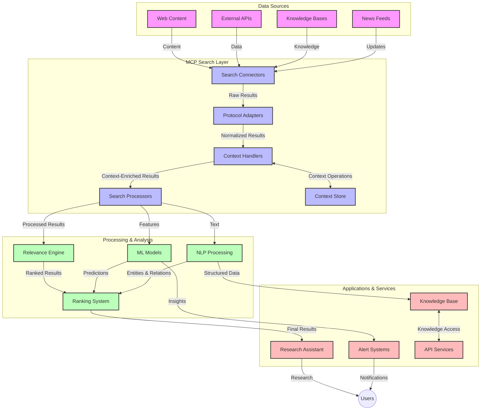

# நேரடி வலைத் தேடலுக்கான மாடல் சூழல் நெறிமுறை

## மேலோட்டம்

இன்றைய தகவல் சார்ந்த சூழலில், பயன்பாடுகள் இணையத்தில் உள்ள சமீபத்திய தகவல்களை உடனுக்குடன் அணுகி பொருத்தமான மற்றும் நேரத்திற்கேற்ப பதில்களை வழங்க வேண்டும். நேரடி வலைத் தேடல் இன்றைய தேவை. மாடல் சூழல் நெறிமுறை (MCP) இந்த நேரடி தேடல் செயல்முறைகளை மேம்படுத்துவதில் முக்கிய முன்னேற்றமாக விளங்குகிறது. இது தேடல் திறனை மேம்படுத்தி, சூழல் ஒருமைப்பாட்டை பராமரித்து, மொத்த அமைப்பு செயல்திறனை உயர்த்துகிறது.

இந்த தொகுப்பு MCP எவ்வாறு நேரடி வலைத் தேடலை மாற்றுகிறது என்பதை ஆராய்கிறது. இது AI மாடல்கள், தேடல் இயந்திரங்கள் மற்றும் பயன்பாடுகளுக்கிடையே ஒரு தரநிலையான சூழல் மேலாண்மை அணுகுமுறையை வழங்குகிறது.

### நீங்கள் என்ன கற்றுக்கொள்வீர்கள்

இந்த விரிவான வழிகாட்டியில், நீங்கள் கற்றுக்கொள்வீர்கள்:

- MCP எவ்வாறு AI மாடல்கள் மற்றும் நேரடி வலைத் தேடல் திறன்களுக்கு இடையே ஒரு தடையற்ற பாலமாக செயல்படுகிறது
- MCP உடன் திறமையான மற்றும் அளவிடக்கூடிய தேடல் தீர்வுகளை செயல்படுத்துவதற்கான கட்டமைப்பு முறைமைகள்
- பல கேள்விகள் மற்றும் தொடர்புகளில் தேடல் சூழலை பராமரிக்கும் தொழில்நுட்பங்கள்
- Python மற்றும் JavaScript-ல் பல்வேறு தேடல் சூழல்களுக்கு நடைமுறை குறியீட்டு செயல்பாடுகள்
- MCP இயக்கப்படும் தேடல் அமைப்புகளில் பொருத்தம், சமீபத்திய தன்மை மற்றும் செயல்திறனை சமநிலைப்படுத்தும் முறைகள்

## நேரடி வலைத் தேடலுக்கான அறிமுகம்

நேரடி வலைத் தேடல் என்பது இணையத்தில் வெளியிடப்படும் அல்லது புதுப்பிக்கப்படும் தகவல்களை தொடர்ந்து கேள்வி கேட்க, செயலாக்க, மற்றும் பகுப்பாய்வு செய்யும் தொழில்நுட்ப அணுகுமுறையாகும். இது குறைந்த தாமதத்துடன் புதிய மற்றும் பொருத்தமான தகவல்களை வழங்குவதற்கு அமைப்புகளை அனுமதிக்கிறது. பாரம்பரிய தேடல் அமைப்புகள் சில மணி நேரங்கள் அல்லது நாட்கள் பழமையான குறியீட்டமைக்கப்பட்ட தரவுகளில் செயல்படுவதால் மாறாக, நேரடி தேடல் இணையத்திலிருந்து நேரடி தரவுகளை செயலாக்குகிறது.

### நேரடி வலைத் தேடலின் முக்கிய கருத்துக்கள்:

- **தொடர்ச்சியான கேள்வி செயலாக்கம்**: தேடல் கேள்விகள் தொடர்ந்து புதுப்பிக்கப்படும் தரவுகளுக்கு எதிராக செயலாக்கப்படுகின்றன
- **சமீபத்திய முன்னுரிமை**: புதிய தகவல்களுக்கு முன்னுரிமை அளிக்க வடிவமைக்கப்பட்ட அமைப்புகள்
- **பொருத்தம் சமநிலை**: பொருத்தம் மற்றும் சமீபத்திய தன்மைக்கு இடையே சமநிலையை பராமரித்தல்
- **அளவிடக்கூடிய கட்டமைப்பு**: மாறுபட்ட கேள்வி சுமைகள் மற்றும் தரவுத் தொகுதிகளை கையாளும் திறன்
- **சூழல் புரிதல்**: பயனர் சூழலை தேடல் மீளுருவாக்கங்களில் பராமரிப்பது முக்கியம்
- **மாறும் கேள்வி மறுவடிவமைப்பு**: முந்தைய முடிவுகள் மற்றும் சூழலின் அடிப்படையில் கேள்விகளை தற்காலிகமாக மாற்றுதல்
- **பல மூல ஒருங்கிணைப்பு**: பல தேடல் வழங்குநர்கள் மற்றும் வலை மூலங்களிலிருந்து முடிவுகளை இணைத்தல்
- **அர்த்தபூர்வமான புரிதல்**: வெறும் முக்கிய வார்த்தைகளின் அடிப்படையில் அல்லாமல் அர்த்தத்தின் அடிப்படையில் கேள்விகள் மற்றும் உள்ளடக்கத்தை செயலாக்குதல்
- **நேரடி தரவரிசை**: புதிய தகவல்கள் கிடைக்கும் போது தொடர்ந்து முடிவுகளின் தரவரிசையை சரிசெய்தல்

### மாடல் சூழல் நெறிமுறை மற்றும் நேரடி வலைத் தேடல்

மாடல் சூழல் நெறிமுறை (MCP) நேரடி வலைத் தேடல் சூழல்களில் பல முக்கிய சவால்களை தீர்க்கிறது:

1. **தேடல் சூழல் பராமரிப்பு**: MCP, AI மாடல்கள் மற்றும் செயலாக்கக் கோடுகள் தொடர்பான கேள்வி வரலாறு மற்றும் பயனர் விருப்பங்களை பராமரிக்க, தேடல் கூறுகளுக்கு இடையே சூழலை ஒரே மாதிரியான முறையில் பராமரிக்கிறது.

2. **திறமையான கேள்வி மேலாண்மை**: சூழல் பரிமாற்றத்திற்கான அமைக்கப்பட்ட முறைமைகளை வழங்குவதன் மூலம், MCP ஒவ்வொரு தேடல் மீளுருவாக்கத்திலும் சூழலை மீண்டும் மீண்டும் வழங்கும் சுமையை குறைக்கிறது.

3. **இணக்கத்தன்மை**: MCP, பல்வேறு தேடல் தொழில்நுட்பங்கள் மற்றும் AI மாடல்களுக்கு இடையே சூழல் பகிர்வதற்கான பொதுவான மொழியை உருவாக்குகிறது, மேலும் நெகிழ்வான மற்றும் விரிவாக்கக்கூடிய கட்டமைப்புகளை உருவாக்குகிறது.

4. **தேடலுக்கேற்ப சூழல்**: MCP செயல்பாடுகள், செயல்திறன் மற்றும் துல்லியத்திற்காக மிகவும் பொருத்தமான சூழல் கூறுகளை முன்னுரிமை அளிக்க முடியும்.

5. **தற்காலிக தேடல் செயலாக்கம்**: MCP மூலம் சரியான சூழல் மேலாண்மையுடன், தேடல் அமைப்புகள் பயனர் தேவைகள் மற்றும் தகவல் சூழலின் அடிப்படையில் செயலாக்கத்தை தற்காலிகமாக சரிசெய்ய முடியும்.

செய்தி தொகுப்புகள் முதல் ஆராய்ச்சி உதவியாளர்கள் வரை பல்வேறு பயன்பாடுகளில், MCP மற்றும் வலைத் தேடல் தொழில்நுட்பங்களின் ஒருங்கிணைப்பு மேலும் புத்திசாலித்தனமான, சூழல்-அறிந்த தேடலை இயக்குகிறது. இது பயனர் தொடர்புகள் தொடர்ந்தும் அதிக பொருத்தமான முடிவுகளை வழங்க உதவுகிறது.

## கற்றல் நோக்கங்கள்

இந்த பாடத்தின் முடிவில், நீங்கள்:

- நேரடி வலைத் தேடலின் அடிப்படைகளை மற்றும் நவீன பயன்பாடுகளில் அதன் சவால்களை புரிந்து கொள்ள
- மாடல் சூழல் நெறிமுறை (MCP) எவ்வாறு நேரடி வலைத் தேடல் திறன்களை மேம்படுத்துகிறது என்பதை விளக்க
- பிரபலமான கட்டமைப்புகள் மற்றும் APIகளைப் பயன்படுத்தி MCP அடிப்படையிலான தேடல் தீர்வுகளை செயல்படுத்த
- MCP உடன் அளவிடக்கூடிய, உயர் செயல்திறன் தேடல் கட்டமைப்புகளை வடிவமைத்து செயல்படுத்த
- அர்த்த தேடல், ஆராய்ச்சி உதவி, மற்றும் AI-ஆதரித்த உலாவல் போன்ற பல்வேறு பயன்பாடுகளில் MCP கருத்துக்களைப் பயன்படுத்த
- MCP அடிப்படையிலான தேடல் தொழில்நுட்பங்களில் உருவாகும் போக்குகள் மற்றும் எதிர்கால புதுமைகளை மதிப்பீடு
- பயனர் தொடர்புகளிலிருந்து கற்றுக்கொள்ளும் சூழல்-அறிந்த தேடல் அமைப்புகளை உருவாக்க
- தரநிலையான MCP நெறிமுறைகளைப் பயன்படுத்தி AI உதவியாளர்களில் வலைத் தேடல் திறன்களை ஒருங்கிணைக்க
- சூழலின் அடிப்படையில் முடிவுகளை முறையே மேம்படுத்தும் பல நிலை தேடல் குழாய்களை உருவாக்க
- முழுமையான சூழல் விழிப்புணர்வை பராமரிக்கும்போது தேடல் செயல்திறனை மேம்படுத்த

### வரையறை மற்றும் முக்கியத்துவம்

நேரடி வலைத் தேடல் என்பது குறைந்த தாமதத்துடன் இணையத் தகவல்களை தொடர்ந்து கேள்வி கேட்க, பெற, மற்றும் வழங்கும் செயல்முறையாகும். பாரம்பரிய தேடல் இயந்திரங்கள் இணையத்தை காலகாலமாகச் செதுக்கி குறியீட்டமைக்கின்றன. ஆனால் நேரடி தேடல் தகவல் கிடைக்கும் உடனே அதை மேற்பரப்புகிறது, சமீபத்திய உள்ளடக்கத்தை உடனுக்குடன் அணுக அனுமதிக்கிறது.

நேரடி வலைத் தேடலின் முக்கிய அம்சங்கள்:

- **புதிய தன்மை**: சமீபத்திய உள்ளடக்கத்திற்கும் புதுப்பிப்புகளுக்கும் முன்னுரிமை
- **தொடர்ச்சியான செயலாக்கம்**: புதிய தகவல்களை தொடர்ந்து கண்காணித்தல்
- **கேள்வி மாற்றம்**: சூழல் மற்றும் பின்னூட்டத்தின் அடிப்படையில் தேடல் கேள்விகளை மேம்படுத்துதல்
- **உடனடி வழங்கல்**: குறைந்த தாமதத்துடன் தேடல் முடிவுகளை வழங்குதல்
- **சூழல் பராமரிப்பு**: மேம்பட்ட பொருத்தத்திற்காக முந்தைய கேள்விகளை அடிப்படையாகக் கொண்டு செயல்படுதல்

### பாரம்பரிய வலைத் தேடலின் சவால்கள்

பாரம்பரிய வலைத் தேடல் அணுகுமுறைகள் நேரடி சூழல்களில் பல வரம்புகளை எதிர்கொள்கின்றன:

1. **சூழல் சிதறல்**: பல கேள்விகளுக்கு இடையே தேடல் சூழலை பராமரிக்க முடியாத நிலை
2. **தகவல் புதிய தன்மை**: சமீபத்திய தகவல்களை அணுகுவதிலும் முன்னுரிமை அளிப்பதிலும் சவால்கள்
3. **ஒருங்கிணைப்பு சிக்கல்**: தேடல் அமைப்புகள் மற்றும் பயன்பாடுகளுக்கு இடையே இணக்கத்தன்மை சிக்கல்கள்
4. **தாமத சிக்கல்கள்**: விரிவான தேடலுக்கும் பதில் நேர தேவைகளுக்கும் இடையே சமநிலை
5. **பொருத்தம் சீரமைப்பு**: சமீபத்திய தன்மைக்கு முன்னுரிமை அளிக்கும்போது துல்லியத்தையும் பொருத்தத்தையும் உறுதிப்படுத்துதல்

## தேடலுக்கான மாடல் சூழல் நெறிமுறையை (MCP) புரிந்துகொள்வது

### தேடல் சூழல்களில் MCP என்றால் என்ன?

மாடல் சூழல் நெறிமுறை (MCP) என்பது AI மாடல்கள் மற்றும் பயன்பாடுகளுக்கு இடையே திறமையான தொடர்பை எளிதாக்க வடிவமைக்கப்பட்ட ஒரு தரநிலையான தொடர்பு நெறிமுறையாகும். நேரடி வலைத் தேடலின் சூழலில், MCP ஒரு கட்டமைப்பை வழங்குகிறது:

- தேடல் கேள்வி வரிசைகளின் முழு நீளத்திலும் தேடல் சூழலை பராமரிக்க
- தேடல் கேள்வி மற்றும் முடிவு வடிவங்களை தரநிலைப்படுத்த
- தேடல் அளவுருக்கள் மற்றும் முடிவுகளின் பரிமாற்றத்தை மேம்படுத்த
- மாடல்-தேடல் இயந்திர தொடர்பை மேம்படுத்த

### முக்கிய கூறுகள் மற்றும் கட்டமைப்பு

நேரடி வலைத் தேடலுக்கான MCP கட்டமைப்பு பல முக்கிய கூறுகளை கொண்டுள்ளது:

1. **கேள்வி சூழல் கையாளிகள்**: பல கேள்விகளுக்கு இடையே தேடல் சூழலை பராமரிக்கவும் மேலாண்மை செய்யவும்
2. **தேடல் செயலாக்கிகள்**: சூழல்-அறிந்த தொழில்நுட்பங்களைப் பயன்படுத்தி வரும் தேடல் கோரிக்கைகளை செயலாக்க
3. **நெறிமுறை மாற்றிகள்**: சூழலை பராமரிக்கும்போது பல்வேறு தேடல் APIகளுக்கு இடையே மாற்றம் செய்ய
4. **சூழல் சேமிப்பு**: தேடல் வரலாறு மற்றும் விருப்பங்களை திறமையாக சேமித்து மீட்டெடுக்க
5. **தேடல் இணைப்பிகள்**: பல தேடல் இயந்திரங்கள் மற்றும் வலை APIகளுடன் இணைக்க




### MCP எவ்வாறு நேரடி வலைத் தேடலை மேம்படுத்துகிறது

MCP பாரம்பரிய வலைத் தேடல் சவால்களைத் தீர்க்கிறது:

- **சூழல் தொடர்ச்சி**: முழு தேடல் அமர்வின் போது கேள்விகளுக்கு இடையிலான உறவுகளை பராமரித்தல்
- **மேம்பட்ட பரிமாற்றம்**: சூழல் மேலாண்மையின் மூலம் தேடல் அளவுருக்களில் மீளுருவாக்கத்தை குறைத்தல்
- **தரநிலையான இடைமுகங்கள்**: தேடல் கூறுகளுக்கு ஒரே மாதிரியான APIகளை வழங்குதல்
- **தாமத குறைப்பு**: திறமையான சூழல் கையாளுதலின் மூலம் செயலாக்க சுமையை குறைத்தல்
- **பொருத்தம் மேம்பாடு**: பல கேள்விகளுக்கு இடையே பயனர் நோக்கத்தை பராமரிப்பதன் மூலம் தேடல் பொருத்தத்தை மேம்படுத்துதல்

## ஒருங்கிணைப்பு மற்றும் செயல்படுத்தல்

நேரடி வலைத் தேடல் அமைப்புகள் செயல்திறனையும் சூழல் ஒருமைப்பாட்டையும் பராமரிக்க கவனமாக கட்டமைப்பு வடிவமைப்பு மற்றும் செயல்பாட்டை தேவைப்படுத்துகின்றன. மாடல் சூழல் நெறிமுறை AI மாடல்கள் மற்றும் தேடல் தொழில்நுட்பங்களை ஒருங்கிணைக்க ஒரு தரநிலையான அணுகுமுறையை வழங்குகிறது. இது மேலும் மேம்பட்ட, சூழல்-அறிந்த தேடல் குழாய்களை உருவாக்க அனுமதிக்கிறது.

### தேடல் கட்டமைப்புகளில் MCP ஒருங்கிணைப்பின் மேலோட்டம்

நேரடி வலைத் தேடல் சூழல்களில் MCP ஐ செயல்படுத்த பல முக்கிய கருத்துக்களை உள்ளடக்கியது:

1. **தேடல் சூழல் சீரியல் செய்யுதல்**: MCP தேடல் கோரிக்கைகளுக்குள் சூழல் தகவலை குறியாக்குவதற்கான திறமையான முறைகளை வழங்குகிறது. இது தேடல் தொடர்பான மெட்டாடேட்டாவுக்கு சிறப்பாக சீரியல் செய்யப்பட்ட வடிவங்களை உள்ளடக்கியது.

2. **நிலையான தேடல் செயலாக்கம்**: MCP தேடல் மீளுருவாக்கங்களில் நிலையான சூழல் பிரதிநிதித்துவத்தை பராமரிப்பதன் மூலம் மேலும் புத்திசாலித்தனமான நிலையான செயலாக்கத்தை இயக்குகிறது. இது குறிப்பாக பல நிலை தேடல் குழாய்களில் மதிப்புமிக்கது.

3. **கேள்வி விரிவாக்கம் மற்றும் மேம்பாடு**: தேடல் அமைப்புகளில் MCP செயல்பாடுகள் தேடல் அமர்வு முன்னேறும்போது அதிக பொருத்தமான முடிவுகளை அனுமதிக்கும் சூழல் அடிப்படையிலான கேள்வி விரிவாக்கம் மற்றும் மேம்பாட்டை எளிதாக்க முடியும்.

4. **முடிவுகளை காட்சிப்படுத்தல் மற்றும் முன்னுரிமை**: சூழல் கையாளுதலை தரநிலைப்படுத்துவதன் மூலம், MCP முடிவுகளை காட்சிப்படுத்தல் மற்றும் முன்னுரிமையை மேலாண்மை செய்ய உதவுகிறது. இது தேடல் சூழல் மாறுபடுவதன் அடிப்படையில் கூறுகளை சரிசெய்ய அனுமதிக்கிறது.

5. **தேடல் கூட்டமைப்பு மற்றும் ஒருங்கிணைப்பு**: MCP தேடல் சூழலின் அமைக்கப்பட்ட பிரதிநிதித்துவங்களை வழங்குவதன் மூலம் பல பின்புலங்களில் தேடலின் மேலும் மேம்பட்ட கூட்டமைப்பை எளிதாக்குகிறது. இது பல்வேறு மூலங்களிலிருந்து முடிவுகளை பொருத்தமாக ஒருங்கிணைக்க அனுமதிக்கிறது.

MCP ஐ பல்வேறு தேடல் தொழில்நுட்பங்களில் செயல்படுத்துவதன் மூலம், தேடல் கேள்விகள் மாறும்போது அர்த்தமுள்ள சூழலை பராமரிக்க அமைப்பின் திறனை மேம்படுத்தி, தனிப்பயன் ஒருங்கிணைப்பு குறியீட்டின் தேவையை குறைக்கிறது.

### MCP பல்வேறு வலைத் தேடல் செயல்பாடுகளில்

இந்த எடுத்துக்காட்டுகள் தற்போதைய MCP விவரக்குறிப்பைப் பின்பற்றுகின்றன. இது தனித்துவமான போக்குவரத்து முறைகளுடன் JSON-RPC அடிப்படையிலான நெறிமுறையை மையமாகக் கொண்டுள்ளது. MCP நெறிமுறையுடன் முழுமையான இணக்கத்தன்மையை பராமரிக்க தனிப்பயன் தேடல் ஒருங்கிணைப்புகளை நீங்கள் எவ்வாறு செயல்படுத்தலாம் என்பதை குறியீடு விளக்குகிறது.

<details>
<summary>Python மூலம் பொதுவான தேடல் API செயல்பாடு</summary>

```python
import asyncio
import json
import aiohttp
from typing import Dict, Any, Optional, List
from contextlib import asynccontextmanager
from collections.abc import AsyncIterator

# Import standard MCP libraries
from mcp.client.session import ClientSession
from mcp.client.streamable_http import streamablehttp_client
from mcp.types import TextContent, CreateMessageRequestParams, CreateMessageResult
from mcp.server.fastmcp import FastMCP

# Create a FastMCP server for web search
search_server = FastMCP("WebSearch")

# Class to handle web search operations
class WebSearchHandler:
    def __init__(self, api_endpoint: str, api_key: str):
        self.api_endpoint = api_endpoint
        self.api_key = api_key
        self.session = None
        
    async def initialize(self):
        """Initialize the HTTP session"""
        self.session = aiohttp.ClientSession(
            headers={"Authorization": f"Bearer {self.api_key}"}
        )
    
    async def close(self):
        """Close the HTTP session"""
        if self.session:
            await self.session.close()
            
    async def perform_search(self, query: str, max_results: int = 5, 
                           include_domains: List[str] = None, 
                           exclude_domains: List[str] = None,
                           time_period: str = "any") -> Dict[str, Any]:
        """Perform web search using the search API"""
        # Construct search parameters
        search_params = {
            "q": query,
            "limit": max_results,
            "time": time_period
        }
        
        if include_domains:
            search_params["site"] = ",".join(include_domains)
            
        if exclude_domains:
            search_params["exclude_site"] = ",".join(exclude_domains)
        
        # Perform the search request
        try:
            async with self.session.get(
                self.api_endpoint,
                params=search_params
            ) as response:
                if response.status != 200:
                    error_text = await response.text()
                    raise Exception(f"Search API error: {response.status} - {error_text}")
                
                search_data = await response.json()
                
                # Transform API-specific response to a standard format
                results = []
                for item in search_data.get("results", []):
                    results.append({
                        "title": item.get("title", ""),
                        "url": item.get("url", ""),
                        "snippet": item.get("snippet", ""),
                        "date": item.get("published_date", ""),
                        "source": item.get("source", "")
                    })
                
                return {
                    "query": query,
                    "totalResults": len(results),
                    "results": results
                }
        except Exception as e:
            print(f"Search API request error: {e}")
            raise

# Initialize the search handler
search_handler = WebSearchHandler(
    api_endpoint="https://api.search-service.example/search",
    api_key="your-api-key-here"
)

# Setup lifespan to manage the search handler
@asyncio.asynccontextmanager
async def app_lifespan(server: FastMCP):
    """Manage application lifecycle"""
    await search_handler.initialize()
    try:
        yield {"search_handler": search_handler}
    finally:
        await search_handler.close()

# Set lifespan for the server
search_server = FastMCP("WebSearch", lifespan=app_lifespan)

# Register a web search tool
@search_server.tool()
async def web_search(query: str, max_results: int = 5, 
                   include_domains: List[str] = None,
                   exclude_domains: List[str] = None,
                   time_period: str = "any") -> Dict[str, Any]:
    """
    Search the web for information
    
    Args:
        query: The search query
        max_results: Maximum number of results to return (default: 5)
        include_domains: List of domains to include in search results
        exclude_domains: List of domains to exclude from search results
        time_period: Time period for results ("day", "week", "month", "any")
        
    Returns:
        Dictionary containing search results
    """
    ctx = search_server.get_context()
    search_handler = ctx.request_context.lifespan_context["search_handler"]
    
    results = await search_handler.perform_search(
        query=query,
        max_results=max_results,
        include_domains=include_domains,
        exclude_domains=exclude_domains,
        time_period=time_period
    )
    
    return results

# Example client usage
async def client_example():
    # Connect to the search server using Streamable HTTP transport
    async with streamablehttp_client("http://localhost:8000/mcp") as (read, write, _):
        async with ClientSession(read, write) as session:
            # Initialize the connection
            await session.initialize()
            
            # Call the web_search tool
            search_results = await session.call_tool(
                "web_search", 
                {
                    "query": "latest developments in AI and Model Context Protocol",
                    "max_results": 5,
                    "time_period": "day",
                    "include_domains": ["github.com", "microsoft.com"]
                }
            )
            
            print(f"Search results: {search_results}")

# Server execution example
if __name__ == "__main__":
    # Run the server with Streamable HTTP transport
    search_server.run(transport="streamable-http")
```
</details> 

<details>
<summary>உலாவி அடிப்படையிலான தேடலுக்கான JavaScript செயல்பாடு</summary>

```javascript
// MCP server implementation for web search
import { McpServer, ResourceTemplate } from '@modelcontextprotocol/sdk/server/mcp.js';
import { StreamableHTTPServerTransport } from '@modelcontextprotocol/sdk/server/streamableHttp.js';
import { z } from 'zod';

// Create an MCP server for web search
const searchServer = new McpServer({
    name: "BrowserSearch",
    description: "A server that provides web search capabilities"
});

// Search service class
class SearchService {
    constructor(searchApiUrl, apiKey) {
        this.searchApiUrl = searchApiUrl;
        this.apiKey = apiKey;
    }

    async performSearch(parameters) {
        const {
            query = '',
            maxResults = 5,
            includeDomains = [],
            excludeDomains = [],
            timePeriod = 'any'
        } = parameters;
        
        // Construct search URL with parameters
        const url = new URL(this.searchApiUrl);
        url.searchParams.append('q', query);
        url.searchParams.append('limit', maxResults);
        url.searchParams.append('time', timePeriod);
        
        if (includeDomains.length > 0) {
            url.searchParams.append('site', includeDomains.join(','));
        }
        
        if (excludeDomains.length > 0) {
            url.searchParams.append('exclude_site', excludeDomains.join(','));
        }
        
        try {
            const response = await fetch(url.toString(), {
                method: 'GET',
                headers: {
                    'Authorization': `Bearer ${this.apiKey}`,
                    'Content-Type': 'application/json'
                }
            });
            
            if (!response.ok) {
                const errorText = await response.text();
                throw new Error(`Search API error: ${response.status} - ${errorText}`);
            }
            
            const searchData = await response.json();
            
            // Transform API-specific response to a standard format
            const results = searchData.results?.map(item => ({
                title: item.title || '',
                url: item.url || '',
                snippet: item.snippet || '',
                date: item.published_date || '',
                source: item.source || ''
            })) || [];
            
            return {
                query,
                totalResults: results.length,
                results
            };
        } catch (error) {
            console.error('Search API request error:', error);
            throw error;
        }
    }
}

// Initialize the search service
const searchService = new SearchService(
    'https://api.search-service.example/search',
    'your-api-key-here'
);

// Setup the context provider for the server
searchServer.setContextProvider(() => {
    return {
        searchService
    };
});

// Register web search tool
searchServer.tool({
    name: 'web_search',
    description: 'Search the web for information',
    parameters: {
        type: 'object',
        properties: {
            query: {
                type: 'string',
                description: 'The search query'
            },
            maxResults: {
                type: 'integer',
                description: 'Maximum number of results to return',
                default: 5
            },
            includeDomains: {
                type: 'array',
                items: { type: 'string' },
                description: 'List of domains to include in search results'
            },
            excludeDomains: {
                type: 'array',
                items: { type: 'string' },
                description: 'List of domains to exclude from search results'
            },
            timePeriod: {
                type: 'string',
                description: 'Time period for results',
                enum: ['day', 'week', 'month', 'any'],
                default: 'any'
            }
        },
        required: ['query']
    },
    handler: async (params, context) => {
        const { searchService } = context;
        return await searchService.performSearch(params);
    }
});

// Example client code to connect to the search server
import { Client } from '@modelcontextprotocol/sdk/client/index.js';
import { StreamableHTTPClientTransport } from '@modelcontextprotocol/sdk/client/streamableHttp.js';

async function connectToSearchServer() {
    // Connect to the search server
    const transport = new StreamableHTTPClientTransport(
        new URL('http://localhost:8000/mcp')
    );
    
    const client = new Client({
        name: 'search-client',
        version: '1.0.0'
    });
    
    await client.connect(transport);
    
    // Execute the search tool
    const searchResults = await client.callTool({
        name: 'web_search',
        arguments: {
            query: 'Model Context Protocol implementation examples',
            maxResults: 10,
            timePeriod: 'week',
            includeDomains: ['github.com', 'docs.microsoft.com']
        }
    });
    
    console.log('Search results:', searchResults);
    
    // Cleanup
    await client.disconnect();
}

// Start the server
const transport = new StreamableHTTPServerTransport();
await searchServer.connect(transport);
console.log('Search server running at http://localhost:8000/mcp');

// In a separate process or after server is started
// connectToSearchServer().catch(console.error);
```
</details> 

## குறியீட்டு எடுத்துக்காட்டுகளுக்கான மறுப்பு

> **முக்கிய குறிப்பு**: கீழே உள்ள குறியீட்டு எடுத்துக்காட்டுகள் மாடல் சூழல் நெறிமுறையை (MCP) வலைத் தேடல் செயல்பாட்டுடன் ஒருங்கிணைப்பதை விளக்குகின்றன. அவை அதிகாரப்பூர்வ MCP SDKகளின் வடிவமைப்புகளையும் அமைப்புகளையும் பின்பற்றினாலும், கல்வி நோக்கங்களுக்காக எளிமைப்படுத்தப்பட்டுள்ளன.
> 
> இந்த எடுத்துக்காட்டுகள்:
> 
> 1. **Python செயல்பாடு**: ஒரு FastMCP சேவையக செயல்பாடு. இது ஒரு வலைத் தேடல் கருவியை வழங்கி, வெளிப்புற தேடல் APIயுடன் இணைக்கிறது. இது [அதிகாரப்பூர்வ MCP Python SDK](https://github.com/modelcontextprotocol/python-sdk) வடிவமைப்புகளின் முறைமைகளைப் பின்பற்றுகிறது. 
> 
> 2. **JavaScript செயல்பாடு**: MCP TypeScript SDK மூலம் தேடல் சேவையகத்தை உருவாக்கும் ஒரு TypeScript/JavaScript செயல்பாடு. 
> 
> முழுமையான செயல்பாட்டு விவரங்களுக்கு, [அதிகாரப்பூர்வ MCP விவரக்குறிப்பு](https://spec.modelcontextprotocol.io/) மற்றும் SDK ஆவணங்களைப் பார்க்கவும்.

## முக்கிய கருத்துக்கள்

### மாடல் சூழல் நெறிமுறை (MCP) கட்டமைப்பு

MCP, AI மாடல்கள், பயன்பாடுகள் மற்றும் சேவைகளுக்கு இடையே சூழலை பரிமாறுவதற்கான தரநிலையான வழியை வழங்குகிறது.
எதிர்காலத்தை நோக்கி, MCP பின்வரும் அம்சங்களைச் சமாளிக்க வளர்ச்சி பெறும் என எதிர்பார்க்கிறோம்:

- **பலமுக தேடல்**: உரை, படம், ஒலி மற்றும் வீடியோ தேடல்களைச் சேர்த்து, சூழலியலை (context) பாதுகாப்புடன் ஒருங்கிணைத்தல்
- **மையமற்ற தேடல்**: பகிர்ந்த மற்றும் கூட்டமைப்பு தேடல் சூழல்களை ஆதரித்தல்
- **தேடல் தனியுரிமை**: சூழலுக்கு பொருந்தக்கூடிய தனியுரிமை பாதுகாப்பு தேடல் முறைகள்
- **கேள்வி புரிதல்**: இயற்கை மொழி தேடல் கேள்விகளை ஆழமான அர்த்தப்பார்வையுடன் பகுப்பாய்வு செய்தல்

### தொழில்நுட்பத்தில் சாத்தியமான முன்னேற்றங்கள்

MCP தேடலின் எதிர்காலத்தை வடிவமைக்கும் புதிய தொழில்நுட்பங்கள்:

1. **நியூரல் தேடல் கட்டமைப்புகள்**: MCP-க்கு சிறப்பாக வடிவமைக்கப்பட்ட எம்பெட்டிங் அடிப்படையிலான தேடல் அமைப்புகள்
2. **தனிப்பட்ட தேடல் சூழல்**: தனிநபர் தேடல் பழக்கங்களை காலப்போக்கில் கற்றல்
3. **அறிவியல் வரைபட ஒருங்கிணைப்பு**: துறைக்கு பொருந்தக்கூடிய அறிவியல் வரைபடங்களால் மேம்படுத்தப்பட்ட சூழலியல் தேடல்
4. **குறுக்குமுக சூழல்**: பல தேடல் முறைகளில் சூழலியலை பராமரித்தல்

## நடைமுறை பயிற்சிகள்

### பயிற்சி 1: அடிப்படை MCP தேடல் குழாயமைப்பை அமைத்தல்

இந்த பயிற்சியில், நீங்கள் கற்றுக்கொள்வீர்கள்:
- அடிப்படை MCP தேடல் சூழலை அமைத்தல்
- வலை தேடலுக்கான சூழல் கையாளிகளை செயல்படுத்தல்
- தேடல் மீள்நிகழ்வுகளில் சூழலியலை பரிசோதித்து சரிபார்த்தல்

### பயிற்சி 2: MCP தேடலுடன் ஒரு ஆராய்ச்சி உதவியாளரை உருவாக்குதல்

முழுமையான பயன்பாட்டை உருவாக்குங்கள்:
- இயற்கை மொழி ஆராய்ச்சி கேள்விகளை செயலாக்குதல்
- சூழலுக்கு பொருந்தக்கூடிய வலை தேடல்களைச் செயல்படுத்தல்
- பல மூலங்களிலிருந்து தகவல்களை ஒருங்கிணைத்தல்
- ஒழுங்கமைக்கப்பட்ட ஆராய்ச்சி முடிவுகளை வழங்குதல்

### பயிற்சி 3: MCP மூலம் பலமூல தேடல் கூட்டமைப்பை செயல்படுத்துதல்

மேம்பட்ட பயிற்சி:
- பல தேடல் இயந்திரங்களுக்கு சூழலுக்கு பொருந்தக்கூடிய கேள்விகளை அனுப்புதல்
- முடிவுகளை தரவரிசைப்படுத்தல் மற்றும் தொகுத்தல்
- தேடல் முடிவுகளின் சூழலியல் மறுபிரதி நீக்கம்
- மூலத்திற்கேற்ப குறிப்பிட்ட மெட்டாடேட்டாவை கையாளுதல்

## கூடுதல் வளங்கள்

- [மாதிரி சூழல் நெறிமுறை விவரக்குறிப்பு](https://spec.modelcontextprotocol.io/) - MCP-யின் அதிகாரப்பூர்வ விவரக்குறிப்பு மற்றும் விரிவான நெறிமுறை ஆவணம்
- [மாதிரி சூழல் நெறிமுறை ஆவணம்](https://modelcontextprotocol.io/) - விரிவான பயிற்சிகள் மற்றும் செயல்படுத்தல் வழிகாட்டிகள்
- [MCP Python SDK](https://github.com/modelcontextprotocol/python-sdk) - MCP நெறிமுறையின் அதிகாரப்பூர்வ Python செயல்பாடு
- [MCP TypeScript SDK](https://github.com/modelcontextprotocol/typescript-sdk) - MCP நெறிமுறையின் அதிகாரப்பூர்வ TypeScript செயல்பாடு
- [MCP குறிப்பு சேவையகங்கள்](https://github.com/modelcontextprotocol/servers) - MCP சேவையகங்களின் குறிப்பு செயல்பாடுகள்
- [Bing வலை தேடல் API ஆவணம்](https://learn.microsoft.com/en-us/bing/search-apis/bing-web-search/overview) - Microsoft-இன் வலை தேடல் API
- [Google Custom Search JSON API](https://developers.google.com/custom-search/v1/overview) - Google-இன் திட்டமிடக்கூடிய தேடல் இயந்திரம்
- [SerpAPI ஆவணம்](https://serpapi.com/search-api) - தேடல் இயந்திர முடிவுகள் பக்கம் API
- [Meilisearch ஆவணம்](https://www.meilisearch.com/docs) - திறந்த மூல தேடல் இயந்திரம்
- [Elasticsearch ஆவணம்](https://www.elastic.co/guide/index.html) - பகிர்ந்த தேடல் மற்றும் பகுப்பாய்வு இயந்திரம்
- [LangChain ஆவணம்](https://python.langchain.com/docs/get_started/introduction) - LLM-க்களுடன் பயன்பாடுகளை உருவாக்குதல்

## கற்றல் முடிவுகள்

இந்த தொகுதியை முடித்ததன் மூலம், நீங்கள்:

- நேரடி வலை தேடலின் அடிப்படைகள் மற்றும் அதன் சவால்களைப் புரிந்துகொள்வீர்கள்
- Model Context Protocol (MCP) நேரடி வலை தேடல் திறன்களை எவ்வாறு மேம்படுத்துகிறது என்பதை விளக்குவீர்கள்
- பிரபலமான கட்டமைப்புகள் மற்றும் API-களைப் பயன்படுத்தி MCP அடிப்படையிலான தேடல் தீர்வுகளை செயல்படுத்துவீர்கள்
- MCP-யுடன் மாறுபட்ட பயன்பாடுகளுக்கு பொருந்தக்கூடிய தேடல் கட்டமைப்புகளை வடிவமைத்து, பரப்புவீர்கள்
- அர்த்த தேடல், ஆராய்ச்சி உதவி மற்றும் AI-ஆக்செயல்படுத்தப்பட்ட உலாவல் போன்ற பயன்பாடுகளுக்கு MCP கருத்துக்களைப் பயன்படுத்துவீர்கள்
- MCP அடிப்படையிலான தேடல் தொழில்நுட்பங்களில் உருவாகும் போக்குகள் மற்றும் எதிர்கால புதுமைகளை மதிப்பீடு செய்வீர்கள்

### நம்பகத்தன்மை மற்றும் பாதுகாப்பு கருத்துக்கள்

MCP அடிப்படையிலான வலை தேடல் தீர்வுகளை செயல்படுத்தும்போது, MCP விவரக்குறிப்பில் உள்ள முக்கியமான கொள்கைகளை நினைவில் கொள்ளுங்கள்:

1. **பயனர் ஒப்புதல் மற்றும் கட்டுப்பாடு**: அனைத்து தரவுகளின் அணுகல் மற்றும் செயல்பாடுகளைப் பயனர்கள் தெளிவாக ஒப்புக்கொண்டு புரிந்துகொள்ள வேண்டும். இது வெளிப்புற தரவூற்று அணுகக்கூடிய வலை தேடல் செயல்பாடுகளுக்கு மிகவும் முக்கியமானது.

2. **தரவு தனியுரிமை**: தேடல் கேள்விகள் மற்றும் முடிவுகளை சரியான முறையில் கையாளுங்கள், குறிப்பாக அவை நுணுக்கமான தகவல்களை உள்ளடக்கக்கூடிய போது. பயனர் தரவுகளைப் பாதுகாக்க உரிய அணுகல் கட்டுப்பாடுகளை செயல்படுத்துங்கள்.

3. **கருவி பாதுகாப்பு**: தேடல் கருவிகளுக்கு உரிய அங்கீகாரம் மற்றும் சரிபார்ப்புகளை செயல்படுத்துங்கள், ஏனெனில் அவை 任யமான குறியீடு செயல்படுத்துவதன் மூலம் பாதுகாப்பு ஆபத்துகளை உருவாக்கக்கூடியவை. கருவி நடத்தை விவரங்கள் நம்பகமான சேவையகத்திலிருந்து பெறப்படாத வரை நம்பகமற்றவை எனக் கருதப்பட வேண்டும்.

4. **தெளிவான ஆவணம்**: உங்கள் MCP அடிப்படையிலான தேடல் செயல்பாட்டின் திறன்கள், வரம்புகள் மற்றும் பாதுகாப்பு கருத்துக்களை MCP விவரக்குறிப்பின் செயல்பாட்டு வழிகாட்டிகளைப் பின்பற்றி தெளிவாக ஆவணப்படுத்துங்கள்.

5. **வலுவான ஒப்புதல் ஓட்டங்கள்**: வெளிப்புற வலை வளங்களுடன் தொடர்புடைய கருவிகளுக்கு அனுமதி வழங்குவதற்கு முன் ஒவ்வொரு கருவி என்ன செய்கிறது என்பதை தெளிவாக விளக்கும் வலுவான ஒப்புதல் மற்றும் அங்கீகார ஓட்டங்களை உருவாக்குங்கள்.

MCP பாதுகாப்பு மற்றும் நம்பகத்தன்மை கருத்துக்களின் முழு விவரங்களுக்கு, [அதிகாரப்பூர்வ ஆவணத்தை](https://modelcontextprotocol.io/specification/2025-03-26#security-and-trust-%26-safety) பார்க்கவும்.

## அடுத்தது என்ன

- [5.12 Model Context Protocol சேவையகங்களுக்கு Entra ID அங்கீகாரம்](../mcp-security-entra/README.md)

---

**அறிவிப்பு**:  
இந்த ஆவணம் [Co-op Translator](https://github.com/Azure/co-op-translator) என்ற AI மொழிபெயர்ப்பு சேவையை பயன்படுத்தி மொழிபெயர்க்கப்பட்டுள்ளது. நாங்கள் துல்லியத்திற்காக முயற்சிக்கிறோம், ஆனால் தானியங்கி மொழிபெயர்ப்புகளில் பிழைகள் அல்லது தவறுகள் இருக்கக்கூடும் என்பதை கவனத்தில் கொள்ளவும். அதன் சொந்த மொழியில் உள்ள மூல ஆவணம் அதிகாரப்பூர்வ ஆதாரமாக கருதப்பட வேண்டும். முக்கியமான தகவல்களுக்கு, தொழில்முறை மனித மொழிபெயர்ப்பு பரிந்துரைக்கப்படுகிறது. இந்த மொழிபெயர்ப்பைப் பயன்படுத்துவதால் ஏற்படும் எந்த தவறான புரிதல்களுக்கும் அல்லது தவறான விளக்கங்களுக்கும் நாங்கள் பொறுப்பல்ல.