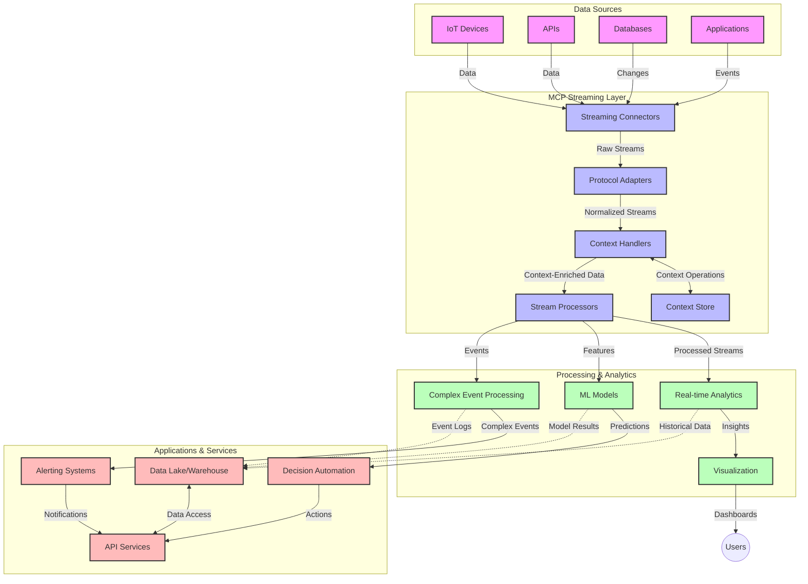

# மாடல் சூழல் நெறிமுறை (MCP) - நேரடி தரவோட்டம்

## கண்ணோட்டம்

இன்றைய தரவின் முக்கியத்துவம் அதிகரித்த உலகில், நேரடி தரவோட்டம் முக்கியமானதாக மாறியுள்ளது. தொழில்கள் மற்றும் பயன்பாடுகள் உடனடி தகவல்களைப் பெறுவதன் மூலம் சரியான நேரத்தில் முடிவுகளை எடுக்க வேண்டும். மாடல் சூழல் நெறிமுறை (MCP) இந்த நேரடி தரவோட்ட செயல்முறைகளை மேம்படுத்துவதில் முக்கிய முன்னேற்றமாகும். இது தரவின் செயல்திறனை மேம்படுத்தி, சூழல் ஒருமைப்பாட்டை பராமரித்து, மொத்த அமைப்பு செயல்திறனை உயர்த்துகிறது.

இந்த தொகுதி MCP எப்படி AI மாடல்கள், தரவோட்ட தளங்கள் மற்றும் பயன்பாடுகளுக்கு ஒரு நிலையான சூழல் மேலாண்மை அணுகுமுறையை வழங்குவதன் மூலம் நேரடி தரவோட்டத்தை மாற்றுகிறது என்பதை ஆராய்கிறது.

## நேரடி தரவோட்டத்தின் அறிமுகம்

நேரடி தரவோட்டம் என்பது ஒரு தொழில்நுட்ப முறைமையாகும், இது தரவின் தொடர்ச்சியான பரிமாற்றம், செயலாக்கம் மற்றும் பகுப்பாய்வை இயக்குகிறது. இது புதிய தகவல்களுக்கு உடனடியாக பதிலளிக்க அமைப்புகளை அனுமதிக்கிறது. பாரம்பரிய தொகுதி செயலாக்கம் நிலையான தரவுத்தொகுப்புகளில் செயல்படுவதால், தரவோட்டம் இயக்கத்தில் உள்ள தரவுகளை செயலாக்குகிறது, குறைந்த தாமதத்துடன் உள்ளடக்கங்களை மற்றும் நடவடிக்கைகளை வழங்குகிறது.

### நேரடி தரவோட்டத்தின் முக்கிய கருத்துக்கள்:

- **தொடர்ச்சியான தரவோட்டம்**: தரவுகள் தொடர்ச்சியான, முடிவில்லாத நிகழ்வுகள் அல்லது பதிவுகளாக செயலாக்கப்படுகின்றன.
- **குறைந்த தாமத செயலாக்கம்**: தரவின் உருவாக்கம் மற்றும் செயலாக்கத்திற்கிடையிலான நேரத்தை குறைக்க அமைப்புகள் வடிவமைக்கப்படுகின்றன.
- **மிகைப்படுத்தல்**: தரவின் அளவு மற்றும் வேகத்தை கையாள தரவோட்ட அமைப்புகள் விரிவாக்கத்திற்குத் தயாராக இருக்க வேண்டும்.
- **தவறுகளுக்கு எதிரான பொறுப்புத்தன்மை**: தரவோட்டம் இடையீடு இல்லாமல் தொடர்வதை உறுதிப்படுத்த அமைப்புகள் தோல்விகளுக்கு எதிராக உறுதியானதாக இருக்க வேண்டும்.
- **நிலையான செயலாக்கம்**: நிகழ்வுகளுக்கு இடையே சூழலை பராமரிப்பது பொருத்தமான பகுப்பாய்வுக்கு முக்கியமானது.

### மாடல் சூழல் நெறிமுறை (MCP) மற்றும் நேரடி தரவோட்டம்

மாடல் சூழல் நெறிமுறை (MCP) நேரடி தரவோட்ட சூழல்களில் பல முக்கிய சவால்களை தீர்க்கிறது:

1. **சூழல் தொடர்ச்சி**: MCP பரந்த தரவோட்ட கூறுகளுக்கு இடையே சூழலை பராமரிக்க ஒரு நிலையான முறையை வழங்குகிறது, AI மாடல்கள் மற்றும் செயலாக்கக் கோடுகள் தொடர்புடைய வரலாற்று மற்றும் சுற்றுச்சூழல் தகவல்களை அணுக அனுமதிக்கிறது.

2. **சூழல் மேலாண்மை திறன்**: சூழல் பரிமாற்றத்திற்கான அமைப்பான முறைகளை வழங்குவதன் மூலம், MCP தரவோட்ட குழாய்களில் நிலை மேலாண்மையின் மேலதிகச் செலவைக் குறைக்கிறது.

3. **இணக்கத்தன்மை**: MCP பல்வேறு தரவோட்ட தொழில்நுட்பங்கள் மற்றும் AI மாடல்களுக்கு இடையே சூழல் பகிர்வதற்கான பொதுவான மொழியை உருவாக்குகிறது, மேலும் நெகிழ்வான மற்றும் விரிவாக்கக்கூடிய அமைப்புகளை உருவாக்குகிறது.

4. **தரவோட்டத்திற்கேற்ப சூழல்**: MCP செயல்பாடுகள் நேரடி முடிவெடுப்புக்கு மிகவும் தொடர்புடைய சூழல் கூறுகளை முன்னுரிமை அளிக்க முடியும், செயல்திறன் மற்றும் துல்லியத்திற்காக மேம்படுத்துகிறது.

5. **செயல்முறை தழுவல்**: MCP மூலம் சரியான சூழல் மேலாண்மையுடன், தரவோட்ட அமைப்புகள் தரவின் மாறும் நிலைகள் மற்றும் முறைமைகளின் அடிப்படையில் செயலாக்கத்தை தன்னிச்சையாக சரிசெய்ய முடியும்.

IoT சென்சார் நெட்வொர்க்குகள் முதல் நிதி வர்த்தக தளங்கள் வரை, MCP மற்றும் தரவோட்ட தொழில்நுட்பங்களின் ஒருங்கிணைப்பு சிக்கலான, மாறும் சூழல்களுக்கு நேரடி பதிலளிக்க முடியும்.

## கற்றல் நோக்கங்கள்

இந்த பாடத்தை முடிக்கும்போது, நீங்கள்:

- நேரடி தரவோட்டத்தின் அடிப்படைகள் மற்றும் அதன் சவால்களைப் புரிந்துகொள்ள
- மாடல் சூழல் நெறிமுறை (MCP) நேரடி தரவோட்டத்தை எப்படி மேம்படுத்துகிறது என்பதை விளக்க
- Kafka மற்றும் Pulsar போன்ற பிரபலமான கட்டமைப்புகளைப் பயன்படுத்தி MCP அடிப்படையிலான தரவோட்ட தீர்வுகளை செயல்படுத்த
- MCP உடன் தவறுகளுக்கு எதிரான, உயர் செயல்திறன் தரவோட்ட அமைப்புகளை வடிவமைத்து, நிறுவ
- IoT, நிதி வர்த்தகம் மற்றும் AI-இயக்கப்பட்ட பகுப்பாய்வு பயன்பாடுகளில் MCP கருத்துக்களைப் பயன்படுத்த
- MCP அடிப்படையிலான தரவோட்ட தொழில்நுட்பங்களில் உருவாகும் போக்குகள் மற்றும் எதிர்கால புதுமைகளை மதிப்பீடு செய்ய

### வரையறை மற்றும் முக்கியத்துவம்

நேரடி தரவோட்டம் குறைந்த தாமதத்துடன் தரவின் தொடர்ச்சியான உருவாக்கம், செயலாக்கம் மற்றும் விநியோகத்தை உள்ளடக்கியது. தொகுதி செயலாக்கத்தில், தரவுகள் குழுக்களாக சேகரிக்கப்பட்டு செயலாக்கப்படுகின்றன, ஆனால் தரவோட்டத்தில், தரவுகள் வரும்போது உடனடியாக செயலாக்கப்படுகின்றன, உடனடி உள்ளடக்கங்கள் மற்றும் நடவடிக்கைகளை இயக்குகிறது.

நேரடி தரவோட்டத்தின் முக்கிய அம்சங்கள்:

- **குறைந்த தாமதம்**: தரவுகளை மில்லி விநாடிகள் முதல் விநாடிகளில் செயலாக்கி பகுப்பாய்வு
- **தொடர்ச்சியான ஓட்டம்**: பல்வேறு மூலங்களிலிருந்து இடையீடு இல்லாத தரவோட்டங்கள்
- **உடனடி செயலாக்கம்**: தொகுதிகளாக அல்லாமல் வரும்போது தரவுகளை பகுப்பாய்வு
- **நிகழ்வு சார்ந்த அமைப்பு**: நிகழ்வுகள் நிகழும் போது பதிலளிக்க

### பாரம்பரிய தரவோட்டத்தின் சவால்கள்

பாரம்பரிய தரவோட்ட அணுகுமுறைகள் பல கட்டுப்பாடுகளை எதிர்கொள்கின்றன:

1. **சூழல் இழப்பு**: பரந்த அமைப்புகளில் சூழலை பராமரிக்க சிரமம்
2. **மிகைப்படுத்தல் சிக்கல்கள்**: அதிக அளவு, அதிக வேக தரவுகளை கையாள சவால்கள்
3. **ஒருங்கிணைப்பு சிக்கல்**: பல்வேறு அமைப்புகளுக்கு இடையே இணக்கத்தன்மை சிக்கல்கள்
4. **தாமத மேலாண்மை**: செயல்திறனுடன் செயலாக்க நேரத்தை சமநிலைப்படுத்தல்
5. **தரவு ஒருமைப்பாடு**: தரவோட்டத்தில் தரவின் துல்லியத்தையும் முழுமையையும் உறுதிப்படுத்தல்

## மாடல் சூழல் நெறிமுறையை (MCP) புரிந்துகொள்வது

### MCP என்றால் என்ன?

மாடல் சூழல் நெறிமுறை (MCP) என்பது AI மாடல்கள் மற்றும் பயன்பாடுகளுக்கு இடையே திறமையான தொடர்பை எளிதாக்க வடிவமைக்கப்பட்ட ஒரு நிலையான தொடர்பு நெறிமுறையாகும். நேரடி தரவோட்டத்தின் சூழலில், MCP ஒரு கட்டமைப்பை வழங்குகிறது:

- தரவோட்ட குழாயத்தில் சூழலைப் பாதுகாப்பது
- தரவுப் பரிமாற்ற வடிவங்களை நிலைப்படுத்துதல்
- பெரிய தரவுத்தொகுப்புகளின் பரிமாற்றத்தை மேம்படுத்துதல்
- மாடல்-மாடல் மற்றும் மாடல்-பயன்பாடு தொடர்பை மேம்படுத்துதல்

### முக்கிய கூறுகள் மற்றும் அமைப்பு

நேரடி தரவோட்டத்திற்கான MCP அமைப்பு பல முக்கிய கூறுகளை உள்ளடக்கியது:

1. **சூழல் கையாளிகள்**: தரவோட்ட குழாயத்தில் சூழல் தகவலை நிர்வகித்து பராமரிக்க
2. **தரவோட்ட செயலாக்கிகள்**: சூழல் சார்ந்த தொழில்நுட்பங்களைப் பயன்படுத்தி வரும் தரவோட்டங்களை செயலாக்க
3. **நெறிமுறை மாற்றிகள்**: சூழலைப் பாதுகாப்பதுடன், பல்வேறு தரவோட்ட நெறிமுறைகளுக்கு இடையே மாற்றம் செய்ய
4. **சூழல் சேமிப்பு**: சூழல் தகவலை திறமையாக சேமித்து மீட்டெடுக்க
5. **தரவோட்ட இணைப்பிகள்**: Kafka, Pulsar, Kinesis போன்ற பல்வேறு தரவோட்ட தளங்களுடன் இணைக்க



### MCP நேரடி தரவோட்ட மேலாண்மையை எப்படி மேம்படுத்துகிறது

MCP பாரம்பரிய தரவோட்ட சவால்களைத் தீர்க்கிறது:

- **சூழல் ஒருமைப்பாடு**: தரவோட்ட குழாயத்தின் முழுவதும் தரவுகளுக்கு இடையிலான உறவுகளை பராமரிக்க
- **மேம்படுத்தப்பட்ட பரிமாற்றம்**: சூழல் மேலாண்மையின் மூலம் தரவுப் பரிமாற்றத்தில் மீளுமை குறைக்க
- **நிலையான இடைமுகங்கள்**: தரவோட்ட கூறுகளுக்கு ஒரே மாதிரியான API-களை வழங்க
- **குறைந்த தாமதம்**: திறமையான சூழல் கையாளுதலின் மூலம் செயலாக்கச் செலவை குறைக்க
- **மேம்படுத்தப்பட்ட மிகைப்படுத்தல்**: சூழலைப் பாதுகாப்பதுடன், குவிவடிவ விரிவாக்கத்தை ஆதரிக்க

## ஒருங்கிணைப்பு மற்றும் செயல்படுத்தல்

நேரடி தரவோட்ட அமைப்புகள் செயல்திறனையும் சூழல் ஒருமைப்பாட்டையும் பராமரிக்க கவனமாக வடிவமைக்கப்பட்டு செயல்படுத்தப்பட வேண்டும். மாடல் சூழல் நெறிமுறை AI மாடல்கள் மற்றும் தரவோட்ட தொழில்நுட்பங்களை ஒருங்கிணைக்க ஒரு நிலையான அணுகுமுறையை வழங்குகிறது, மேலும் நுண்ணறிவு, சூழல் சார்ந்த செயலாக்க குழாயங்களை உருவாக்க அனுமதிக்கிறது.

### தரவோட்ட அமைப்புகளில் MCP ஒருங்கிணைப்பின் கண்ணோட்டம்

நேரடி தரவோட்ட சூழல்களில் MCP-ஐ செயல்படுத்த சில முக்கிய கருத்துகளை உள்ளடக்கியது:

1. **சூழல் சீரியல் மற்றும் பரிமாற்றம்**: MCP தரவோட்ட தரவுப் பொதிகளுக்குள் சூழல் தகவலை குறியாக்குவதற்கான திறமையான முறைகளை வழங்குகிறது. இது தரவோட்ட குழாயத்தின் முழுவதும் முக்கியமான சூழல் தரவுகளைப் பின்தொடர்வதை உறுதிப்படுத்துகிறது. தரவோட்ட பரிமாற்றத்திற்காக மேம்படுத்தப்பட்ட சீரியல் வடிவங்களை இது உள்ளடக்கியது.

2. **நிலையான தரவோட்ட செயலாக்கம்**: MCP பரந்த செயலாக்கக் கோடுகளில் நிலையான சூழல் பிரதிநிதித்துவத்தை பராமரிப்பதன் மூலம் நுண்ணறிவு நிலையான செயலாக்கத்தை இயக்குகிறது. இது பாரம்பரியமாக சவாலாக இருக்கும் பரந்த தரவோட்ட அமைப்புகளில் நிலை மேலாண்மைக்கு மிகவும் மதிப்புமிக்கது.

3. **நிகழ்வு நேரம் மற்றும் செயலாக்க நேரம்**: தரவோட்ட அமைப்புகளில் நிகழ்வுகள் எப்போது நிகழ்ந்தன மற்றும் அவை எப்போது செயலாக்கப்படுகின்றன என்பதை வேறுபடுத்தும் பொதுவான சவால்களை MCP தீர்க்க வேண்டும். நிகழ்வு நேர அர்த்தங்களைப் பாதுகாக்கும் நேர சூழலை MCP உள்ளடக்க முடியும்.

4. **பின்செலுத்தல் மேலாண்மை**: MCP சூழல் கையாளுதலை நிலைப்படுத்துவதன் மூலம், தரவோட்ட அமைப்புகளில் பின்செலுத்தலை நிர்வகிக்க உதவுகிறது. இது கூறுகள் தங்கள் செயலாக்க திறன்களை தொடர்பு கொள்ளவும், ஓட்டத்தை சரிசெய்யவும் அனுமதிக்கிறது.

5. **சூழல் சாளரமிடல் மற்றும் தொகுப்பு**: MCP நிகழ்வு தரவோட்டங்களில் பொருத்தமான தொகுப்புகளை இயக்குவதற்கான நேர மற்றும் உறவுச் சூழலின் அமைப்பான பிரதிநிதித்துவங்களை வழங்குகிறது.

6. **சரியாக ஒருமுறை செயலாக்கம்**: சரியாக ஒருமுறை அர்த்தங்களை தேவைப்படும் தரவோட்ட அமைப்புகளில், MCP பரந்த கூறுகளில் செயலாக்க நிலையைப் பின்தொடரவும் சரிபார்க்கவும் உதவும் செயலாக்க மெட்டாடேட்டாவை உள்ளடக்க முடியும்.

MCP-ஐ பல்வேறு தரவோட்ட தொழில்நுட்பங்களில் செயல்படுத்துவதன் மூலம், தரவோட்ட குழாயத்தில் பொருத்தமான சூழலை பராமரிக்க அமைப்பின் திறனை மேம்படுத்தி, தனிப்பயன் ஒருங்கிணைப்பு குறியீட்டின் தேவையை குறைக்கும் ஒருங்கிணைந்த சூழல் மேலாண்மையை உருவாக்குகிறது.

### பல்வேறு தரவோட்ட கட்டமைப்புகளில் MCP

இந்த எடுத்துக்காட்டுகள் MCP-இன் தற்போதைய விவரக்குறிப்பைப் பின்பற்றுகின்றன, இது தனித்துவமான பரிமாற்ற முறைகளுடன் JSON-RPC அடிப்படையிலான நெறிமுறையை மையமாகக் கொண்டது. இந்த குறியீடு, MCP நெறிமுறையுடன் முழுமையான இணக்கத்தன்மையை பராமரிக்க, Kafka மற்றும் Pulsar போன்ற தரவோட்ட தளங்களை ஒருங்கிணைக்கும் தனிப்பயன் பரிமாற்றங்களை நீங்கள் எப்படி செயல்படுத்தலாம் என்பதை விளக்குகிறது.

இந்த அணுகுமுறை, தரவோட்ட தளங்கள் MCP உடன் ஒருங்கிணைக்கப்பட்டு, தரவோட்டத்தை நேரடியாக செயல்படுத்துவதுடன் MCP-இன் மையமாக உள்ள சூழல் விழிப்புணர்வை பராமரிக்க உதவுகிறது. இந்த குறியீடு 2025 ஜூன் நிலவரப்படி MCP விவரக்குறிப்பின் தற்போதைய நிலையை துல்லியமாக பிரதிபலிக்கிறது.

MCP பிரபலமான தரவோட்ட கட்டமைப்புகளுடன் ஒருங்கிணைக்க முடியும், அவற்றில்:

#### Apache Kafka ஒருங்கிணைப்பு

```python
import asyncio
import json
from typing import Dict, Any, Optional
from confluent_kafka import Consumer, Producer, KafkaError
from mcp.client import Client, ClientCapabilities
from mcp.core.message import JsonRpcMessage
from mcp.core.transports import Transport

# Custom transport class to bridge MCP with Kafka
class KafkaMCPTransport(Transport):
    def __init__(self, bootstrap_servers: str, input_topic: str, output_topic: str):
        self.bootstrap_servers = bootstrap_servers
        self.input_topic = input_topic
        self.output_topic = output_topic
        self.producer = Producer({'bootstrap.servers': bootstrap_servers})
        self.consumer = Consumer({
            'bootstrap.servers': bootstrap_servers,
            'group.id': 'mcp-client-group',
            'auto.offset.reset': 'earliest'
        })
        self.message_queue = asyncio.Queue()
        self.running = False
        self.consumer_task = None
        
    async def connect(self):
        """Connect to Kafka and start consuming messages"""
        self.consumer.subscribe([self.input_topic])
        self.running = True
        self.consumer_task = asyncio.create_task(self._consume_messages())
        return self
        
    async def _consume_messages(self):
        """Background task to consume messages from Kafka and queue them for processing"""
        while self.running:
            try:
                msg = self.consumer.poll(1.0)
                if msg is None:
                    await asyncio.sleep(0.1)
                    continue
                
                if msg.error():
                    if msg.error().code() == KafkaError._PARTITION_EOF:
                        continue
                    print(f"Consumer error: {msg.error()}")
                    continue
                
                # Parse the message value as JSON-RPC
                try:
                    message_str = msg.value().decode('utf-8')
                    message_data = json.loads(message_str)
                    mcp_message = JsonRpcMessage.from_dict(message_data)
                    await self.message_queue.put(mcp_message)
                except Exception as e:
                    print(f"Error parsing message: {e}")
            except Exception as e:
                print(f"Error in consumer loop: {e}")
                await asyncio.sleep(1)
    
    async def read(self) -> Optional[JsonRpcMessage]:
        """Read the next message from the queue"""
        try:
            message = await self.message_queue.get()
            return message
        except Exception as e:
            print(f"Error reading message: {e}")
            return None
    
    async def write(self, message: JsonRpcMessage) -> None:
        """Write a message to the Kafka output topic"""
        try:
            message_json = json.dumps(message.to_dict())
            self.producer.produce(
                self.output_topic,
                message_json.encode('utf-8'),
                callback=self._delivery_report
            )
            self.producer.poll(0)  # Trigger callbacks
        except Exception as e:
            print(f"Error writing message: {e}")
    
    def _delivery_report(self, err, msg):
        """Kafka producer delivery callback"""
        if err is not None:
            print(f'Message delivery failed: {err}')
        else:
            print(f'Message delivered to {msg.topic()} [{msg.partition()}]')
    
    async def close(self) -> None:
        """Close the transport"""
        self.running = False
        if self.consumer_task:
            self.consumer_task.cancel()
            try:
                await self.consumer_task
            except asyncio.CancelledError:
                pass
        self.consumer.close()
        self.producer.flush()

# Example usage of the Kafka MCP transport
async def kafka_mcp_example():
    # Create MCP client with Kafka transport
    client = Client(
        {"name": "kafka-mcp-client", "version": "1.0.0"},
        ClientCapabilities({})
    )
    
    # Create and connect the Kafka transport
    transport = KafkaMCPTransport(
        bootstrap_servers="localhost:9092",
        input_topic="mcp-responses",
        output_topic="mcp-requests"
    )
    
    await client.connect(transport)
    
    try:
        # Initialize the MCP session
        await client.initialize()
        
        # Example of executing a tool via MCP
        response = await client.execute_tool(
            "process_data",
            {
                "data": "sample data",
                "metadata": {
                    "source": "sensor-1",
                    "timestamp": "2025-06-12T10:30:00Z"
                }
            }
        )
        
        print(f"Tool execution response: {response}")
        
        # Clean shutdown
        await client.shutdown()
    finally:
        await transport.close()

# Run the example
if __name__ == "__main__":
    asyncio.run(kafka_mcp_example())
```

#### Apache Pulsar செயல்படுத்தல்

```python
import asyncio
import json
import pulsar
from typing import Dict, Any, Optional
from mcp.core.message import JsonRpcMessage
from mcp.core.transports import Transport
from mcp.server import Server, ServerOptions
from mcp.server.tools import Tool, ToolExecutionContext, ToolMetadata

# Create a custom MCP transport that uses Pulsar
class PulsarMCPTransport(Transport):
    def __init__(self, service_url: str, request_topic: str, response_topic: str):
        self.service_url = service_url
        self.request_topic = request_topic
        self.response_topic = response_topic
        self.client = pulsar.Client(service_url)
        self.producer = self.client.create_producer(response_topic)
        self.consumer = self.client.subscribe(
            request_topic,
            "mcp-server-subscription",
            consumer_type=pulsar.ConsumerType.Shared
        )
        self.message_queue = asyncio.Queue()
        self.running = False
        self.consumer_task = None
    
    async def connect(self):
        """Connect to Pulsar and start consuming messages"""
        self.running = True
        self.consumer_task = asyncio.create_task(self._consume_messages())
        return self
    
    async def _consume_messages(self):
        """Background task to consume messages from Pulsar and queue them for processing"""
        while self.running:
            try:
                # Non-blocking receive with timeout
                msg = self.consumer.receive(timeout_millis=500)
                
                # Process the message
                try:
                    message_str = msg.data().decode('utf-8')
                    message_data = json.loads(message_str)
                    mcp_message = JsonRpcMessage.from_dict(message_data)
                    await self.message_queue.put(mcp_message)
                    
                    # Acknowledge the message
                    self.consumer.acknowledge(msg)
                except Exception as e:
                    print(f"Error processing message: {e}")
                    # Negative acknowledge if there was an error
                    self.consumer.negative_acknowledge(msg)
            except Exception as e:
                # Handle timeout or other exceptions
                await asyncio.sleep(0.1)
    
    async def read(self) -> Optional[JsonRpcMessage]:
        """Read the next message from the queue"""
        try:
            message = await self.message_queue.get()
            return message
        except Exception as e:
            print(f"Error reading message: {e}")
            return None
    
    async def write(self, message: JsonRpcMessage) -> None:
        """Write a message to the Pulsar output topic"""
        try:
            message_json = json.dumps(message.to_dict())
            self.producer.send(message_json.encode('utf-8'))
        except Exception as e:
            print(f"Error writing message: {e}")
    
    async def close(self) -> None:
        """Close the transport"""
        self.running = False
        if self.consumer_task:
            self.consumer_task.cancel()
            try:
                await self.consumer_task
            except asyncio.CancelledError:
                pass
        self.consumer.close()
        self.producer.close()
        self.client.close()

# Define a sample MCP tool that processes streaming data
@Tool(
    name="process_streaming_data",
    description="Process streaming data with context preservation",
    metadata=ToolMetadata(
        required_capabilities=["streaming"]
    )
)
async def process_streaming_data(
    ctx: ToolExecutionContext,
    data: str,
    source: str,
    priority: str = "medium"
) -> Dict[str, Any]:
    """
    Process streaming data while preserving context
    
    Args:
        ctx: Tool execution context
        data: The data to process
        source: The source of the data
        priority: Priority level (low, medium, high)
        
    Returns:
        Dict containing processed results and context information
    """
    # Example processing that leverages MCP context
    print(f"Processing data from {source} with priority {priority}")
    
    # Access conversation context from MCP
    conversation_id = ctx.conversation_id if hasattr(ctx, 'conversation_id') else "unknown"
    
    # Return results with enhanced context
    return {
        "processed_data": f"Processed: {data}",
        "context": {
            "conversation_id": conversation_id,
            "source": source,
            "priority": priority,
            "processing_timestamp": ctx.get_current_time_iso()
        }
    }

# Example MCP server implementation using Pulsar transport
async def run_mcp_server_with_pulsar():
    # Create MCP server
    server = Server(
        {"name": "pulsar-mcp-server", "version": "1.0.0"},
        ServerOptions(
            capabilities={"streaming": True}
        )
    )
    
    # Register our tool
    server.register_tool(process_streaming_data)
    
    # Create and connect Pulsar transport
    transport = PulsarMCPTransport(
        service_url="pulsar://localhost:6650",
        request_topic="mcp-requests",
        response_topic="mcp-responses"
    )
    
    try:
        # Start the server with the Pulsar transport
        await server.run(transport)
    finally:
        await transport.close()

# Run the server
if __name__ == "__main__":
    asyncio.run(run_mcp_server_with_pulsar())
```

### நிறுவலுக்கான சிறந்த நடைமுறைகள்

நேரடி தரவோட்டத்திற்கான MCP-ஐ செயல்படுத்தும்போது:

1. **தவறுகளுக்கு எதிரான வடிவமைப்பு**:
   - சரியான பிழை கையாளுதலை செயல்படுத்தவும்
   - தோல்வியுற்ற செய்திகளுக்கான dead-letter queues பயன்படுத்தவும்
   - idempotent செயலாக்கிகளை வடிவமைக்கவும்

2. **செயல்திறனை மேம்படுத்தவும்**:
   - பொருத்தமான buffer அளவுகளை அமைக்கவும்
   - தேவையான இடங்களில் batching பயன்படுத்தவும்
   - பின்செலுத்தல் முறைகளை செயல்படுத்தவும்

3. **கண்காணித்து கவனிக்கவும்**:
   - தரவோட்ட செயலாக்க அளவுகோள்களை கண்காணிக்கவும்
   - சூழல் பரவலை கண்காணிக்கவும்
   - சீர்கேடுகளுக்கான எச்சரிக்கைகளை அமைக்கவும்

4. **உங்கள் தரவோட்டங்களை பாதுகாக்கவும்**:
   - முக்கியமான தரவுகளுக்கு குறியாக்கத்தை செயல்படுத்தவும்
   - அங்கீகாரம் மற்றும் அனுமதி பயன்படுத்தவும்
   - சரியான அணுகல் கட்டுப்பாடுகளைப் பயன்படுத்தவும்

### IoT மற்றும் Edge Computing-இல் MCP

MCP IoT தரவோட்டத்தை மேம்படுத்துகிறது:

- செயலாக்க குழாயத்தில் சாதன சூழலைப் பாதுகாப்பது
- Edge-இல் இருந்து Cloud-க்கு திறமையான தரவோட்டத்தை இயக்குவது
- IoT தரவோட்டங்களில் நேரடி பகுப்பாய்வுகளை ஆதரிக்க
- சூழலுடன் சாதனம்-சாதனம் தொடர்பை எளிதாக்க

எடுத்துக்காட்டு: Smart City சென்சார் நெட்வொர்க்குகள்
```
Sensors → Edge Gateways → MCP Stream Processors → Real-time Analytics → Automated Responses
```

### நிதி பரிவர்த்தனைகள் மற்றும் உயர்-அதிக வேக வர்த்தகத்தில் பங்கு

MCP நிதி தரவோட்டத்திற்கு முக்கியமான நன்மைகளை வழங்குகிறது:

- வர்த்தக முடிவுகளுக்கான மிகக் குறைந்த தாமத செயலாக்கம்
- செயலாக்கத்தின் முழுவதும் பரிவர்த்தனை சூழலை பராமரிக்க
- சூழல் விழிப்புணர்வுடன் சிக்கலான நிகழ்வு செயலாக்கத்தை ஆதரிக்க
- பரந்த வர்த்தக அமைப்புகளில் தரவின் ஒருமைப்பாட்டை உறுதிப்படுத்த

### AI-இயக்கப்பட்ட தரவுப் பகுப்பாய்வை மேம்படுத்துதல்

MCP தரவோட்ட பகுப்பாய்வுக்கு புதிய சாத்தியங்களை உருவாக்குகிறது:

- நேரடி மாடல் பயிற்சி மற்றும் தீர்மானம்
- தரவோட்டத்திலிருந்து தொடர்ச்சியான கற்றல்
- சூழல் சார்ந்த அம்சங்களைப் பிரித்தெடுக்கும்
- சூழலைப் பாதுகாக்கும் பல மாடல் தீர்மான குழாயங்கள்

## எதிர்கால போக்குகள் மற்றும் புதுமைகள்

### நேரடி சூழல்களில் MCP-இன் மேம்பாடு

எதிர்காலத்தை நோக்கி, MCP பின்வரும் அம்சங்களைத் தீர்க்க மேம்படுவதாக எதிர்பார்க்கப்படுகிறது:

- **குவாண்டம் கணினி ஒருங்கிணைப்பு**: குவாண்டம் அடிப்படையிலான தரவோட்ட அமைப்புகளுக்கு தயாராக
- **Edge-இல் இயற்கையான செயலாக்கம்**: Edge சாதனங்களில் மேலும் சூழல் சார்ந்த செயலாக்கத்தை நகர்த்துதல்
- **தன்னாட்சி தரவோட்ட மேலாண்மை**: தானாகவே மேம்படுத்தும் தரவோட்ட குழாயங்கள்
- **ஒன்றிணைந்த தரவோட்டம்**: தனியுர

---

**குறிப்பு**:  
இந்த ஆவணம் [Co-op Translator](https://github.com/Azure/co-op-translator) என்ற AI மொழிபெயர்ப்பு சேவையை பயன்படுத்தி மொழிபெயர்க்கப்பட்டுள்ளது. எங்கள் நோக்கம் துல்லியமாக மொழிபெயர்ப்பை வழங்குவது என்றாலும், தானியங்கி மொழிபெயர்ப்புகளில் பிழைகள் அல்லது துல்லியமற்ற தகவல்கள் இருக்கக்கூடும் என்பதை தயவுசெய்து கவனத்தில் கொள்ளவும். அதன் இயல்பான மொழியில் உள்ள மூல ஆவணம் அதிகாரப்பூர்வமான ஆதாரமாக கருதப்பட வேண்டும். முக்கியமான தகவல்களுக்கு, தொழில்முறை மனித மொழிபெயர்ப்பு பரிந்துரைக்கப்படுகிறது. இந்த மொழிபெயர்ப்பைப் பயன்படுத்துவதால் ஏற்படும் எந்த தவறான புரிதல்கள் அல்லது தவறான விளக்கங்களுக்கு நாங்கள் பொறுப்பல்ல.