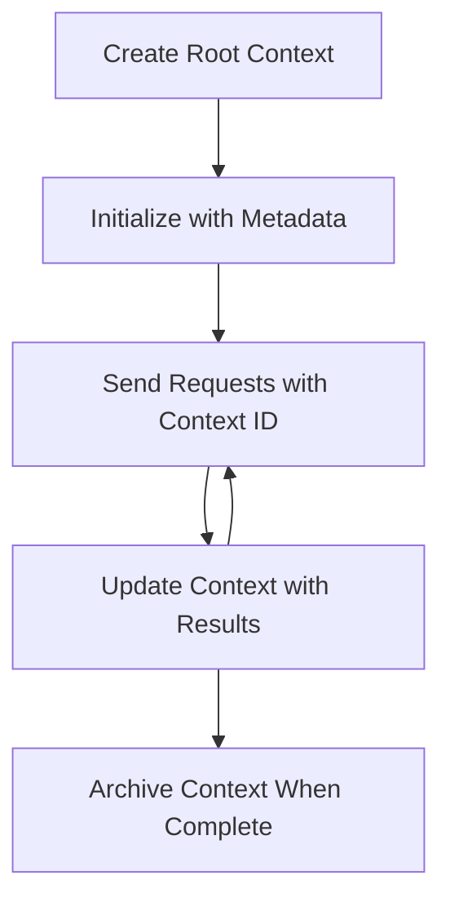

# MCP Root Contexts

Root contexts என்பது மாடல் கான்டெக்ஸ்ட் புரோட்டோகோலில் அடிப்படை கருத்தாகும், இது பல கோரிக்கைகள் மற்றும் அமர்வுகளுக்கு இடையில் உரையாடல் வரலாறு மற்றும் பகிரப்பட்ட நிலையை பராமரிக்க ஒரு நிலையான அடுக்கு வழங்குகிறது.

## அறிமுகம்

இந்த பாடத்தில், MCP-இல் root contexts-ஐ உருவாக்குவது, நிர்வகிப்பது மற்றும் பயன்படுத்துவது எப்படி என்பதை ஆராய்வோம்.

## கற்றல் நோக்கங்கள்

இந்த பாடத்தின் முடிவில், நீங்கள்:

- Root contexts-இன் நோக்கம் மற்றும் அமைப்பை புரிந்துகொள்ள முடியும்
- MCP client libraries-ஐப் பயன்படுத்தி root contexts-ஐ உருவாக்கவும் நிர்வகிக்கவும் முடியும்
- .NET, Java, JavaScript மற்றும் Python பயன்பாடுகளில் root contexts-ஐ செயல்படுத்த முடியும்
- பல முறை உரையாடல்களுக்கும் நிலை மேலாண்மைக்கும் root contexts-ஐ பயன்படுத்த முடியும்
- Root context மேலாண்மைக்கான சிறந்த நடைமுறைகளை செயல்படுத்த முடியும்

## Root Contexts-ஐப் புரிந்துகொள்வது

Root contexts என்பது தொடர்புடைய தொடர்புகளின் வரலாறு மற்றும் நிலையை வைத்திருக்கும் கொண்டெய்னர்களாக செயல்படுகிறது. இது கீழ்க்கண்டவற்றை சாத்தியமாக்குகிறது:

- **உரையாடல் நிலைத்தன்மை**: பல முறை உரையாடல்களை தெளிவாக பராமரிக்க
- **நினைவக மேலாண்மை**: தொடர்புகளுக்கு இடையில் தகவலை சேமிக்கவும் மீட்டெடுக்கவும்
- **நிலை மேலாண்மை**: சிக்கலான வேலைப்பாடுகளில் முன்னேற்றத்தை கண்காணிக்க
- **கான்டெக்ஸ்ட் பகிர்வு**: பல கிளையண்ட்கள் ஒரே உரையாடல் நிலையை அணுக அனுமதிக்க

MCP-இல், root contexts-க்கு முக்கியமான பண்புகள் உள்ளன:

- ஒவ்வொரு root context-க்கும் தனித்துவமான அடையாளம் உள்ளது.
- இது உரையாடல் வரலாறு, பயனர் விருப்பங்கள் மற்றும் பிற மெட்டாடேட்டாவை கொண்டிருக்க முடியும்.
- தேவையானபோது உருவாக்க, அணுக மற்றும் காப்பாற்ற முடியும்.
- நுணுக்கமான அணுகல் கட்டுப்பாடு மற்றும் அனுமதிகளை ஆதரிக்கிறது.

## Root Context Lifecycle



## Root Contexts-ஐப் பயன்படுத்துவது

Root contexts-ஐ உருவாக்கவும் நிர்வகிக்கவும் உதாரணம் இங்கே உள்ளது.

### C# செயல்பாடு

```csharp
// .NET Example: Root Context Management
using Microsoft.Mcp.Client;
using System;
using System.Threading.Tasks;
using System.Collections.Generic;

public class RootContextExample
{
    private readonly IMcpClient _client;
    private readonly IRootContextManager _contextManager;
    
    public RootContextExample(IMcpClient client, IRootContextManager contextManager)
    {
        _client = client;
        _contextManager = contextManager;
    }
    
    public async Task DemonstrateRootContextAsync()
    {
        // 1. Create a new root context
        var contextResult = await _contextManager.CreateRootContextAsync(new RootContextCreateOptions
        {
            Name = "Customer Support Session",
            Metadata = new Dictionary<string, string>
            {
                ["CustomerName"] = "Acme Corporation",
                ["PriorityLevel"] = "High",
                ["Domain"] = "Cloud Services"
            }
        });
        
        string contextId = contextResult.ContextId;
        Console.WriteLine($"Created root context with ID: {contextId}");
        
        // 2. First interaction using the context
        var response1 = await _client.SendPromptAsync(
            "I'm having issues scaling my web service deployment in the cloud.", 
            new SendPromptOptions { RootContextId = contextId }
        );
        
        Console.WriteLine($"First response: {response1.GeneratedText}");
        
        // Second interaction - the model will have access to the previous conversation
        var response2 = await _client.SendPromptAsync(
            "Yes, we're using containerized deployments with Kubernetes.", 
            new SendPromptOptions { RootContextId = contextId }
        );
        
        Console.WriteLine($"Second response: {response2.GeneratedText}");
        
        // 3. Add metadata to the context based on conversation
        await _contextManager.UpdateContextMetadataAsync(contextId, new Dictionary<string, string>
        {
            ["TechnicalEnvironment"] = "Kubernetes",
            ["IssueType"] = "Scaling"
        });
        
        // 4. Get context information
        var contextInfo = await _contextManager.GetRootContextInfoAsync(contextId);
        
        Console.WriteLine("Context Information:");
        Console.WriteLine($"- Name: {contextInfo.Name}");
        Console.WriteLine($"- Created: {contextInfo.CreatedAt}");
        Console.WriteLine($"- Messages: {contextInfo.MessageCount}");
        
        // 5. When the conversation is complete, archive the context
        await _contextManager.ArchiveRootContextAsync(contextId);
        Console.WriteLine($"Archived context {contextId}");
    }
}
```

மேலே உள்ள குறியீட்டில், நாம்:

1. வாடிக்கையாளர் ஆதரவு அமர்வுக்கான root context-ஐ உருவாக்கியுள்ளோம்.
1. அந்த context-இல் பல செய்திகளை அனுப்பியுள்ளோம், இது மாடலுக்கு நிலையை பராமரிக்க அனுமதிக்கிறது.
1. உரையாடலின் அடிப்படையில் தொடர்புடைய மெட்டாடேட்டாவுடன் context-ஐ புதுப்பித்துள்ளோம்.
1. உரையாடல் வரலாற்றை புரிந்துகொள்ள context தகவலை மீட்டுள்ளோம்.
1. உரையாடல் முடிந்தபோது context-ஐ காப்பாற்றியுள்ளோம்.

## உதாரணம்: நிதி பகுப்பாய்வுக்கான Root Context செயல்பாடு

இந்த உதாரணத்தில், நிதி பகுப்பாய்வு அமர்வுக்கான root context-ஐ உருவாக்கி, பல தொடர்புகளுக்கு இடையில் நிலையை பராமரிக்க எப்படி என்பதை விளக்குகிறோம்.

### Java செயல்பாடு

```java
// Java Example: Root Context Implementation
package com.example.mcp.contexts;

import com.mcp.client.McpClient;
import com.mcp.client.ContextManager;
import com.mcp.models.RootContext;
import com.mcp.models.McpResponse;

import java.util.HashMap;
import java.util.Map;
import java.util.UUID;

public class RootContextsDemo {
    private final McpClient client;
    private final ContextManager contextManager;
    
    public RootContextsDemo(String serverUrl) {
        this.client = new McpClient.Builder()
            .setServerUrl(serverUrl)
            .build();
            
        this.contextManager = new ContextManager(client);
    }
    
    public void demonstrateRootContext() throws Exception {
        // Create context metadata
        Map<String, String> metadata = new HashMap<>();
        metadata.put("projectName", "Financial Analysis");
        metadata.put("userRole", "Financial Analyst");
        metadata.put("dataSource", "Q1 2025 Financial Reports");
        
        // 1. Create a new root context
        RootContext context = contextManager.createRootContext("Financial Analysis Session", metadata);
        String contextId = context.getId();
        
        System.out.println("Created context: " + contextId);
        
        // 2. First interaction
        McpResponse response1 = client.sendPrompt(
            "Analyze the trends in Q1 financial data for our technology division",
            contextId
        );
        
        System.out.println("First response: " + response1.getGeneratedText());
        
        // 3. Update context with important information gained from response
        contextManager.addContextMetadata(contextId, 
            Map.of("identifiedTrend", "Increasing cloud infrastructure costs"));
        
        // Second interaction - using the same context
        McpResponse response2 = client.sendPrompt(
            "What's driving the increase in cloud infrastructure costs?",
            contextId
        );
        
        System.out.println("Second response: " + response2.getGeneratedText());
        
        // 4. Generate a summary of the analysis session
        McpResponse summaryResponse = client.sendPrompt(
            "Summarize our analysis of the technology division financials in 3-5 key points",
            contextId
        );
        
        // Store the summary in context metadata
        contextManager.addContextMetadata(contextId, 
            Map.of("analysisSummary", summaryResponse.getGeneratedText()));
            
        // Get updated context information
        RootContext updatedContext = contextManager.getRootContext(contextId);
        
        System.out.println("Context Information:");
        System.out.println("- Created: " + updatedContext.getCreatedAt());
        System.out.println("- Last Updated: " + updatedContext.getLastUpdatedAt());
        System.out.println("- Analysis Summary: " + 
            updatedContext.getMetadata().get("analysisSummary"));
            
        // 5. Archive context when done
        contextManager.archiveContext(contextId);
        System.out.println("Context archived");
    }
}
```

மேலே உள்ள குறியீட்டில், நாம்:

1. நிதி பகுப்பாய்வு அமர்வுக்கான root context-ஐ உருவாக்கியுள்ளோம்.
2. அந்த context-இல் பல செய்திகளை அனுப்பியுள்ளோம், இது மாடலுக்கு நிலையை பராமரிக்க அனுமதிக்கிறது.
3. உரையாடலின் அடிப்படையில் தொடர்புடைய மெட்டாடேட்டாவுடன் context-ஐ புதுப்பித்துள்ளோம்.
4. பகுப்பாய்வு அமர்வின் சுருக்கத்தை உருவாக்கி context மெட்டாடேட்டாவில் சேமித்துள்ளோம்.
5. உரையாடல் முடிந்தபோது context-ஐ காப்பாற்றியுள்ளோம்.

## Root Context மேலாண்மை உதாரணம்

Root contexts-ஐ திறமையாக நிர்வகிப்பது உரையாடல் வரலாறு மற்றும் நிலையை பராமரிக்க முக்கியமானது. கீழே root context மேலாண்மையை செயல்படுத்த உதாரணம் உள்ளது.

### JavaScript செயல்பாடு

```javascript
// JavaScript Example: Managing MCP Root Contexts
const { McpClient, RootContextManager } = require('@mcp/client');

class ContextSession {
  constructor(serverUrl, apiKey = null) {
    // Initialize the MCP client
    this.client = new McpClient({
      serverUrl,
      apiKey
    });
    
    // Initialize context manager
    this.contextManager = new RootContextManager(this.client);
  }
  
  /**
   * Create a new conversation context
   * @param {string} sessionName - Name of the conversation session
   * @param {Object} metadata - Additional metadata for the context
   * @returns {Promise<string>} - Context ID
   */
  async createConversationContext(sessionName, metadata = {}) {
    try {
      const contextResult = await this.contextManager.createRootContext({
        name: sessionName,
        metadata: {
          ...metadata,
          createdAt: new Date().toISOString(),
          status: 'active'
        }
      });
      
      console.log(`Created root context '${sessionName}' with ID: ${contextResult.id}`);
      return contextResult.id;
    } catch (error) {
      console.error('Error creating root context:', error);
      throw error;
    }
  }
  
  /**
   * Send a message in an existing context
   * @param {string} contextId - The root context ID
   * @param {string} message - The user's message
   * @param {Object} options - Additional options
   * @returns {Promise<Object>} - Response data
   */
  async sendMessage(contextId, message, options = {}) {
    try {
      // Send the message using the specified context
      const response = await this.client.sendPrompt(message, {
        rootContextId: contextId,
        temperature: options.temperature || 0.7,
        allowedTools: options.allowedTools || []
      });
      
      // Optionally store important insights from the conversation
      if (options.storeInsights) {
        await this.storeConversationInsights(contextId, message, response.generatedText);
      }
      
      return {
        message: response.generatedText,
        toolCalls: response.toolCalls || [],
        contextId
      };
    } catch (error) {
      console.error(`Error sending message in context ${contextId}:`, error);
      throw error;
    }
  }
  
  /**
   * Store important insights from a conversation
   * @param {string} contextId - The root context ID
   * @param {string} userMessage - User's message
   * @param {string} aiResponse - AI's response
   */
  async storeConversationInsights(contextId, userMessage, aiResponse) {
    try {
      // Extract potential insights (in a real app, this would be more sophisticated)
      const combinedText = userMessage + "\n" + aiResponse;
      
      // Simple heuristic to identify potential insights
      const insightWords = ["important", "key point", "remember", "significant", "crucial"];
      
      const potentialInsights = combinedText
        .split(".")
        .filter(sentence => 
          insightWords.some(word => sentence.toLowerCase().includes(word))
        )
        .map(sentence => sentence.trim())
        .filter(sentence => sentence.length > 10);
      
      // Store insights in context metadata
      if (potentialInsights.length > 0) {
        const insights = {};
        potentialInsights.forEach((insight, index) => {
          insights[`insight_${Date.now()}_${index}`] = insight;
        });
        
        await this.contextManager.updateContextMetadata(contextId, insights);
        console.log(`Stored ${potentialInsights.length} insights in context ${contextId}`);
      }
    } catch (error) {
      console.warn('Error storing conversation insights:', error);
      // Non-critical error, so just log warning
    }
  }
  
  /**
   * Get summary information about a context
   * @param {string} contextId - The root context ID
   * @returns {Promise<Object>} - Context information
   */
  async getContextInfo(contextId) {
    try {
      const contextInfo = await this.contextManager.getContextInfo(contextId);
      
      return {
        id: contextInfo.id,
        name: contextInfo.name,
        created: new Date(contextInfo.createdAt).toLocaleString(),
        lastUpdated: new Date(contextInfo.lastUpdatedAt).toLocaleString(),
        messageCount: contextInfo.messageCount,
        metadata: contextInfo.metadata,
        status: contextInfo.status
      };
    } catch (error) {
      console.error(`Error getting context info for ${contextId}:`, error);
      throw error;
    }
  }
  
  /**
   * Generate a summary of the conversation in a context
   * @param {string} contextId - The root context ID
   * @returns {Promise<string>} - Generated summary
   */
  async generateContextSummary(contextId) {
    try {
      // Ask the model to generate a summary of the conversation so far
      const response = await this.client.sendPrompt(
        "Please summarize our conversation so far in 3-4 sentences, highlighting the main points discussed.",
        { rootContextId: contextId, temperature: 0.3 }
      );
      
      // Store the summary in context metadata
      await this.contextManager.updateContextMetadata(contextId, {
        conversationSummary: response.generatedText,
        summarizedAt: new Date().toISOString()
      });
      
      return response.generatedText;
    } catch (error) {
      console.error(`Error generating context summary for ${contextId}:`, error);
      throw error;
    }
  }
  
  /**
   * Archive a context when it's no longer needed
   * @param {string} contextId - The root context ID
   * @returns {Promise<Object>} - Result of the archive operation
   */
  async archiveContext(contextId) {
    try {
      // Generate a final summary before archiving
      const summary = await this.generateContextSummary(contextId);
      
      // Archive the context
      await this.contextManager.archiveContext(contextId);
      
      return {
        status: "archived",
        contextId,
        summary
      };
    } catch (error) {
      console.error(`Error archiving context ${contextId}:`, error);
      throw error;
    }
  }
}

// Example usage
async function demonstrateContextSession() {
  const session = new ContextSession('https://mcp-server-example.com');
  
  try {
    // 1. Create a new context for a product support conversation
    const contextId = await session.createConversationContext(
      'Product Support - Database Performance',
      {
        customer: 'Globex Corporation',
        product: 'Enterprise Database',
        severity: 'Medium',
        supportAgent: 'AI Assistant'
      }
    );
    
    // 2. First message in the conversation
    const response1 = await session.sendMessage(
      contextId,
      "I'm experiencing slow query performance on our database cluster after the latest update.",
      { storeInsights: true }
    );
    console.log('Response 1:', response1.message);
    
    // Follow-up message in the same context
    const response2 = await session.sendMessage(
      contextId,
      "Yes, we've already checked the indexes and they seem to be properly configured.",
      { storeInsights: true }
    );
    console.log('Response 2:', response2.message);
    
    // 3. Get information about the context
    const contextInfo = await session.getContextInfo(contextId);
    console.log('Context Information:', contextInfo);
    
    // 4. Generate and display conversation summary
    const summary = await session.generateContextSummary(contextId);
    console.log('Conversation Summary:', summary);
    
    // 5. Archive the context when done
    const archiveResult = await session.archiveContext(contextId);
    console.log('Archive Result:', archiveResult);
    
    // 6. Handle any errors gracefully
  } catch (error) {
    console.error('Error in context session demonstration:', error);
  }
}

demonstrateContextSession();
```

மேலே உள்ள குறியீட்டில், நாம்:

1. `createConversationContext` என்ற செயல்பாட்டைப் பயன்படுத்தி ஒரு தயாரிப்பு ஆதரவு உரையாடலுக்கான root context-ஐ உருவாக்கியுள்ளோம். இந்த context தரவுத்தொகை செயல்திறன் பிரச்சினைகள் பற்றியது.

1. `sendMessage` என்ற செயல்பாட்டைப் பயன்படுத்தி அந்த context-இல் பல செய்திகளை அனுப்பியுள்ளோம், இது மாடலுக்கு நிலையை பராமரிக்க அனுமதிக்கிறது. அனுப்பப்படும் செய்திகள் மெதுவான கேள்வி செயல்திறன் மற்றும் குறியீட்டு கட்டமைப்பைப் பற்றியது.

1. உரையாடலின் அடிப்படையில் தொடர்புடைய மெட்டாடேட்டாவுடன் context-ஐ புதுப்பித்துள்ளோம்.

1. `generateContextSummary` என்ற செயல்பாட்டைப் பயன்படுத்தி உரையாடலின் சுருக்கத்தை உருவாக்கி context மெட்டாடேட்டாவில் சேமித்துள்ளோம்.

1. `archiveContext` என்ற செயல்பாட்டைப் பயன்படுத்தி உரையாடல் முடிந்தபோது context-ஐ காப்பாற்றியுள்ளோம்.

1. robustness-ஐ உறுதிப்படுத்த பிழைகளை திறமையாக கையாள்ந்துள்ளோம்.

## பல முறை உதவிக்கான Root Context

இந்த உதாரணத்தில், பல முறை உதவி அமர்வுக்கான root context-ஐ உருவாக்கி, பல தொடர்புகளுக்கு இடையில் நிலையை பராமரிக்க எப்படி என்பதை விளக்குகிறோம்.

### Python செயல்பாடு

```python
# Python Example: Root Context for Multi-Turn Assistance
import asyncio
from datetime import datetime
from mcp_client import McpClient, RootContextManager

class AssistantSession:
    def __init__(self, server_url, api_key=None):
        self.client = McpClient(server_url=server_url, api_key=api_key)
        self.context_manager = RootContextManager(self.client)
    
    async def create_session(self, name, user_info=None):
        """Create a new root context for an assistant session"""
        metadata = {
            "session_type": "assistant",
            "created_at": datetime.now().isoformat(),
        }
        
        # Add user information if provided
        if user_info:
            metadata.update({f"user_{k}": v for k, v in user_info.items()})
            
        # Create the root context
        context = await self.context_manager.create_root_context(name, metadata)
        return context.id
    
    async def send_message(self, context_id, message, tools=None):
        """Send a message within a root context"""
        # Create options with context ID
        options = {
            "root_context_id": context_id
        }
        
        # Add tools if specified
        if tools:
            options["allowed_tools"] = tools
        
        # Send the prompt within the context
        response = await self.client.send_prompt(message, options)
        
        # Update context metadata with conversation progress
        await self.context_manager.update_context_metadata(
            context_id,
            {
                f"message_{datetime.now().timestamp()}": message[:50] + "...",
                "last_interaction": datetime.now().isoformat()
            }
        )
        
        return response
    
    async def get_conversation_history(self, context_id):
        """Retrieve conversation history from a context"""
        context_info = await self.context_manager.get_context_info(context_id)
        messages = await self.client.get_context_messages(context_id)
        
        return {
            "context_info": context_info,
            "messages": messages
        }
    
    async def end_session(self, context_id):
        """End an assistant session by archiving the context"""
        # Generate a summary prompt first
        summary_response = await self.client.send_prompt(
            "Please summarize our conversation and any key points or decisions made.",
            {"root_context_id": context_id}
        )
        
        # Store summary in metadata
        await self.context_manager.update_context_metadata(
            context_id,
            {
                "summary": summary_response.generated_text,
                "ended_at": datetime.now().isoformat(),
                "status": "completed"
            }
        )
        
        # Archive the context
        await self.context_manager.archive_context(context_id)
        
        return {
            "status": "completed",
            "summary": summary_response.generated_text
        }

# Example usage
async def demo_assistant_session():
    assistant = AssistantSession("https://mcp-server-example.com")
    
    # 1. Create session
    context_id = await assistant.create_session(
        "Technical Support Session",
        {"name": "Alex", "technical_level": "advanced", "product": "Cloud Services"}
    )
    print(f"Created session with context ID: {context_id}")
    
    # 2. First interaction
    response1 = await assistant.send_message(
        context_id, 
        "I'm having trouble with the auto-scaling feature in your cloud platform.",
        ["documentation_search", "diagnostic_tool"]
    )
    print(f"Response 1: {response1.generated_text}")
    
    # Second interaction in the same context
    response2 = await assistant.send_message(
        context_id,
        "Yes, I've already checked the configuration settings you mentioned, but it's still not working."
    )
    print(f"Response 2: {response2.generated_text}")
    
    # 3. Get history
    history = await assistant.get_conversation_history(context_id)
    print(f"Session has {len(history['messages'])} messages")
    
    # 4. End session
    end_result = await assistant.end_session(context_id)
    print(f"Session ended with summary: {end_result['summary']}")

if __name__ == "__main__":
    asyncio.run(demo_assistant_session())
```

மேலே உள்ள குறியீட்டில், நாம்:

1. `create_session` என்ற செயல்பாட்டைப் பயன்படுத்தி ஒரு தொழில்நுட்ப ஆதரவு அமர்வுக்கான root context-ஐ உருவாக்கியுள்ளோம். context-இல் பயனர் தகவல், பெயர் மற்றும் தொழில்நுட்ப நிலை போன்றவை அடங்கும்.

1. `send_message` என்ற செயல்பாட்டைப் பயன்படுத்தி அந்த context-இல் பல செய்திகளை அனுப்பியுள்ளோம், இது மாடலுக்கு நிலையை பராமரிக்க அனுமதிக்கிறது. அனுப்பப்படும் செய்திகள் auto-scaling அம்சத்தின் பிரச்சினைகள் பற்றியது.

1. `get_conversation_history` என்ற செயல்பாட்டைப் பயன்படுத்தி உரையாடல் வரலாற்றை மீட்டுள்ளோம், இது context தகவல் மற்றும் செய்திகளை வழங்குகிறது.

1. `end_session` என்ற செயல்பாட்டைப் பயன்படுத்தி context-ஐ காப்பாற்றி சுருக்கத்தை உருவாக்கி அமர்வை முடித்துள்ளோம். சுருக்கம் உரையாடலின் முக்கிய அம்சங்களைப் பதிவு செய்கிறது.

## Root Context சிறந்த நடைமுறைகள்

Root contexts-ஐ திறமையாக நிர்வகிக்க சில சிறந்த நடைமுறைகள் இங்கே உள்ளன:

- **தெளிவான Contexts உருவாக்கவும்**: தெளிவை பராமரிக்க, வெவ்வேறு உரையாடல் நோக்கங்கள் அல்லது துறைகளுக்கான தனித்துவமான root contexts-ஐ உருவாக்கவும்.

- **காலாவதி கொள்கைகளை அமைக்கவும்**: சேமிப்பு மற்றும் தரவுகளை பராமரிக்க கொள்கைகளை செயல்படுத்தவும்.

- **தொடர்புடைய மெட்டாடேட்டாவை சேமிக்கவும்**: உரையாடலின் முக்கிய தகவல்களை context மெட்டாடேட்டாவில் சேமிக்கவும்.

- **Context IDs-ஐ தொடர்ந்து பயன்படுத்தவும்**: ஒரு context உருவாக்கப்பட்ட பிறகு, தொடர்புடைய கோரிக்கைகளுக்கு அதன் ID-ஐ தொடர்ந்து பயன்படுத்தவும்.

- **சுருக்கங்களை உருவாக்கவும்**: context மிகப்பெரியதாக வளரும்போது, முக்கிய தகவல்களைப் பதிவு செய்ய சுருக்கங்களை உருவாக்கவும்.

- **அணுகல் கட்டுப்பாட்டை செயல்படுத்தவும்**: பல பயனர் அமைப்புகளுக்கு, உரையாடல் contexts-ஐ தனியுரிமை மற்றும் பாதுகாப்புடன் பராமரிக்க சரியான அணுகல் கட்டுப்பாட்டை செயல்படுத்தவும்.

- **Context வரம்புகளை கையாளவும்**: context அளவு வரம்புகளை அறிந்து, நீண்ட உரையாடல்களை நிர்வகிக்க உத்திகள் செயல்படுத்தவும்.

- **முடிந்தபோது காப்பாற்றவும்**: உரையாடல்கள் முடிந்தபோது contexts-ஐ காப்பாற்றி, உரையாடல் வரலாற்றை பாதுகாத்து வளங்களை விடுவிக்கவும்.

## அடுத்தது என்ன

- [5.5 Routing](../mcp-routing/README.md)

---

**குறிப்பு**:  
இந்த ஆவணம் [Co-op Translator](https://github.com/Azure/co-op-translator) என்ற AI மொழிபெயர்ப்பு சேவையைப் பயன்படுத்தி மொழிபெயர்க்கப்பட்டுள்ளது. நாங்கள் துல்லியத்திற்காக முயற்சிக்கிறோம், ஆனால் தானியக்க மொழிபெயர்ப்புகளில் பிழைகள் அல்லது தவறான தகவல்கள் இருக்கக்கூடும் என்பதை தயவுசெய்து கவனத்தில் கொள்ளவும். அதன் தாய்மொழியில் உள்ள மூல ஆவணம் அதிகாரப்பூர்வ ஆதாரமாக கருதப்பட வேண்டும். முக்கியமான தகவல்களுக்கு, தொழில்முறை மனித மொழிபெயர்ப்பு பரிந்துரைக்கப்படுகிறது. இந்த மொழிபெயர்ப்பைப் பயன்படுத்துவதால் ஏற்படும் எந்த தவறான புரிதல்கள் அல்லது தவறான விளக்கங்களுக்கு நாங்கள் பொறுப்பல்ல.