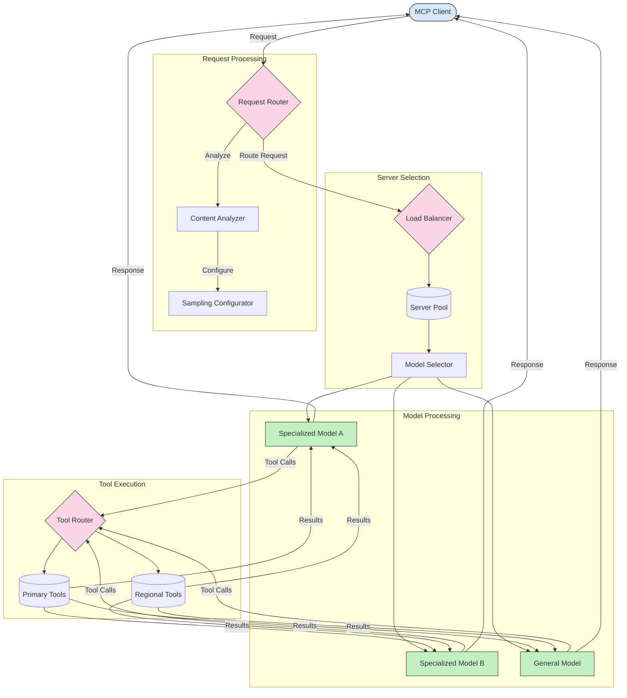

# மாடல் சூழல் நெறிமுறை (MCP) இல் வழிமாற்றல்

MCP சூழலில் கோரிக்கைகளை சரியான மாடல்கள், கருவிகள் அல்லது சேவைகளுக்கு வழிமாற்றுவது முக்கியமானது.

## அறிமுகம்

மாடல் சூழல் நெறிமுறையில் (MCP) வழிமாற்றல் என்பது உள்ளடக்க வகை, பயனர் சூழல் மற்றும் அமைப்பு சுமை போன்ற பல காரணிகளை அடிப்படையாகக் கொண்டு கோரிக்கைகளை சரியான மாடல்கள் அல்லது சேவைகளுக்கு வழிமாற்றுவதை உள்ளடக்கியது. இது திறமையான செயலாக்கத்தையும், வளங்களை சிறப்பாக பயன்படுத்துவதையும் உறுதிசெய்கிறது.

## கற்றல் நோக்கங்கள்

இந்த பாடத்தை முடிக்கும்போது, நீங்கள்:

- MCP இல் வழிமாற்றல் கொள்கைகளை புரிந்துகொள்ள முடியும்.
- உள்ளடக்க அடிப்படையிலான வழிமாற்றலை செயல்படுத்தி, கோரிக்கைகளை சிறப்பு சேவைகளுக்கு வழிமாற்ற முடியும்.
- வளங்களை சிறப்பாக பயன்படுத்துவதற்கான புத்திசாலி சுமை சமநிலைப்படுத்தல் உத்திகளை பயன்படுத்த முடியும்.
- கோரிக்கை சூழலின் அடிப்படையில் மாறும் கருவி வழிமாற்றலை செயல்படுத்த முடியும்.

## உள்ளடக்க அடிப்படையிலான வழிமாற்றல்

உள்ளடக்க அடிப்படையிலான வழிமாற்றல் என்பது கோரிக்கையின் உள்ளடக்கத்தை அடிப்படையாகக் கொண்டு சிறப்பு சேவைகளுக்கு கோரிக்கைகளை வழிமாற்றுவதாகும். உதாரணமாக, குறியீடு உருவாக்கம் தொடர்பான கோரிக்கைகள் சிறப்பு குறியீடு மாடலுக்கு வழிமாற்றப்படலாம், அதேசமயம் படைப்பாற்றல் எழுத்து கோரிக்கைகள் படைப்பாற்றல் மாடலுக்கு அனுப்பப்படலாம்.

விரிவான செயல்பாட்டை கீழே உள்ள பல நிரலாக்க மொழிகளில் காணலாம்.

<details>
<summary>.NET</summary>

```csharp
// .NET Example: Content-based routing in MCP
public class ContentBasedRouter
{
    private readonly Dictionary<string, McpClient> _specializedClients;
    private readonly RoutingClassifier _classifier;
    
    public ContentBasedRouter()
    {
        // Initialize specialized clients for different domains
        _specializedClients = new Dictionary<string, McpClient>
        {
            ["code"] = new McpClient("https://code-specialized-mcp.com"),
            ["creative"] = new McpClient("https://creative-specialized-mcp.com"),
            ["scientific"] = new McpClient("https://scientific-specialized-mcp.com"),
            ["general"] = new McpClient("https://general-mcp.com")
        };
        
        // Initialize content classifier
        _classifier = new RoutingClassifier();
    }
    
    public async Task<McpResponse> RouteAndProcessAsync(string prompt, IDictionary<string, object> parameters = null)
    {
        // Classify the prompt to determine the best specialized service
        string category = await _classifier.ClassifyPromptAsync(prompt);
        
        // Get the appropriate client or fall back to general
        var client = _specializedClients.ContainsKey(category) 
            ? _specializedClients[category] 
            : _specializedClients["general"];
            
        Console.WriteLine($"Routing request to {category} specialized service");
        
        // Send request to the selected service
        return await client.SendPromptAsync(prompt, parameters);
    }
    
    // Simple classifier for routing decisions
    private class RoutingClassifier
    {
        public Task<string> ClassifyPromptAsync(string prompt)
        {
            prompt = prompt.ToLowerInvariant();
            
            if (prompt.Contains("code") || prompt.Contains("function") || 
                prompt.Contains("program") || prompt.Contains("algorithm"))
            {
                return Task.FromResult("code");
            }
            
            if (prompt.Contains("story") || prompt.Contains("creative") || 
                prompt.Contains("imagine") || prompt.Contains("design"))
            {
                return Task.FromResult("creative");
            }
            
            if (prompt.Contains("science") || prompt.Contains("research") || 
                prompt.Contains("analyze") || prompt.Contains("study"))
            {
                return Task.FromResult("scientific");
            }
            
            return Task.FromResult("general");
        }
    }
}
```

மேலே உள்ள குறியீட்டில், நாம்:

- `ContentBasedRouter` வகுப்பை உருவாக்கி, கோரிக்கையின் உள்ளடக்கத்தின் அடிப்படையில் கோரிக்கைகளை வழிமாற்றியுள்ளோம்.
- பல துறைகளுக்கான (குறியீடு, படைப்பாற்றல், அறிவியல், பொதுவான) சிறப்பு கிளையன்ட்களை தொடங்கியுள்ளோம்.
- கோரிக்கையின் வகையைத் தீர்மானிக்கும் எளிய வகைப்பாட்டாளரை செயல்படுத்தி, அதை சரியான சிறப்பு சேவைக்கு வழிமாற்றியுள்ளோம்.
- எந்த சிறப்பு சேவையும் கிடைக்காதபோது, பொதுவான சேவைக்கு வழிமாற்றும் பின்தங்கல் முறைமையை பயன்படுத்தியுள்ளோம்.
- கோரிக்கைகளை திறமையாகச் செயலாக்க அசிங்க்ரோனஸ் செயல்பாட்டை செயல்படுத்தியுள்ளோம்.
- உள்ளடக்க வகைகளை சிறப்பு MCP கிளையன்ட்களுடன் இணைக்கும் அகராதியை பயன்படுத்தியுள்ளோம்.
- கோரிக்கையின் வகையைப் பகுப்பாய்வு செய்து சரியான வகையைத் திருப்பும் எளிய வகைப்பாட்டாளரை செயல்படுத்தியுள்ளோம்.
- சிறப்பு கிளையன்டைப் பயன்படுத்தி கோரிக்கையை அனுப்பி பதிலைப் பெற்றுள்ளோம்.
- எந்த சிறப்பு வகைக்கும் பொருந்தாத கோரிக்கைகளை பொதுவான சேவைக்கு வழிமாற்றியுள்ளோம்.

</details>

## புத்திசாலி சுமை சமநிலைப்படுத்தல்

சுமை சமநிலைப்படுத்தல் MCP சேவைகளுக்கான வளங்களை சிறப்பாக பயன்படுத்தவும், அதிக கிடைப்பை உறுதிசெய்யவும் உதவுகிறது. சுமை சமநிலைப்படுத்தலை செயல்படுத்த பல வழிகள் உள்ளன, உதாரணமாக ரவுண்ட்-ரோபின், எடைப்பட்ட பதில் நேரம், அல்லது உள்ளடக்கத்தை அடிப்படையாகக் கொண்ட உத்திகள்.

கீழே உள்ள செயல்பாட்டில் பின்வரும் உத்திகள் பயன்படுத்தப்பட்டுள்ளன:

- **ரவுண்ட் ரோபின்**: கிடைக்கும் சேவையகங்களில் கோரிக்கைகளை சமமாகப் பகிர்ந்தளிக்கிறது.
- **எடைப்பட்ட பதில் நேரம்**: சேவையகத்தின் சராசரி பதில் நேரத்தின் அடிப்படையில் கோரிக்கைகளை வழிமாற்றுகிறது.
- **உள்ளடக்கத்தை அடிப்படையாகக் கொண்டது**: கோரிக்கையின் உள்ளடக்கத்தின் அடிப்படையில் சிறப்பு சேவையகங்களுக்கு கோரிக்கைகளை வழிமாற்றுகிறது.

<details>
<summary>Java</summary>

```java
// Java Example: Intelligent load balancing for MCP servers
public class McpLoadBalancer {
    private final List<McpServerNode> serverNodes;
    private final LoadBalancingStrategy strategy;
    
    public McpLoadBalancer(List<McpServerNode> nodes, LoadBalancingStrategy strategy) {
        this.serverNodes = new ArrayList<>(nodes);
        this.strategy = strategy;
    }
    
    public McpResponse processRequest(McpRequest request) {
        // Select the best server based on strategy
        McpServerNode selectedNode = strategy.selectNode(serverNodes, request);
        
        try {
            // Route the request to the selected node
            return selectedNode.processRequest(request);
        } catch (Exception e) {
            // Handle failure - implement retry or fallback logic
            System.err.println("Error processing request on node " + selectedNode.getId() + ": " + e.getMessage());
            
            // Mark node as potentially unhealthy
            selectedNode.recordFailure();
            
            // Try next best node as fallback
            List<McpServerNode> remainingNodes = new ArrayList<>(serverNodes);
            remainingNodes.remove(selectedNode);
            
            if (!remainingNodes.isEmpty()) {
                McpServerNode fallbackNode = strategy.selectNode(remainingNodes, request);
                return fallbackNode.processRequest(request);
            } else {
                throw new RuntimeException("All MCP server nodes failed to process the request");
            }
        }
    }
    
    // Node health check task
    public void startHealthChecks(Duration interval) {
        ScheduledExecutorService scheduler = Executors.newScheduledThreadPool(1);
        scheduler.scheduleAtFixedRate(() -> {
            for (McpServerNode node : serverNodes) {
                try {
                    boolean isHealthy = node.checkHealth();
                    System.out.println("Node " + node.getId() + " health status: " + 
                                      (isHealthy ? "HEALTHY" : "UNHEALTHY"));
                } catch (Exception e) {
                    System.err.println("Health check failed for node " + node.getId());
                    node.setHealthy(false);
                }
            }
        }, 0, interval.toMillis(), TimeUnit.MILLISECONDS);
    }
    
    // Interface for load balancing strategies
    public interface LoadBalancingStrategy {
        McpServerNode selectNode(List<McpServerNode> nodes, McpRequest request);
    }
    
    // Round-robin strategy
    public static class RoundRobinStrategy implements LoadBalancingStrategy {
        private AtomicInteger counter = new AtomicInteger(0);
        
        @Override
        public McpServerNode selectNode(List<McpServerNode> nodes, McpRequest request) {
            List<McpServerNode> healthyNodes = nodes.stream()
                .filter(McpServerNode::isHealthy)
                .collect(Collectors.toList());
            
            if (healthyNodes.isEmpty()) {
                throw new RuntimeException("No healthy nodes available");
            }
            
            int index = counter.getAndIncrement() % healthyNodes.size();
            return healthyNodes.get(index);
        }
    }
    
    // Weighted response time strategy
    public static class ResponseTimeStrategy implements LoadBalancingStrategy {
        @Override
        public McpServerNode selectNode(List<McpServerNode> nodes, McpRequest request) {
            return nodes.stream()
                .filter(McpServerNode::isHealthy)
                .min(Comparator.comparing(McpServerNode::getAverageResponseTime))
                .orElseThrow(() -> new RuntimeException("No healthy nodes available"));
        }
    }
    
    // Content-aware strategy
    public static class ContentAwareStrategy implements LoadBalancingStrategy {
        @Override
        public McpServerNode selectNode(List<McpServerNode> nodes, McpRequest request) {
            // Determine request characteristics
            boolean isCodeRequest = request.getPrompt().contains("code") || 
                                   request.getAllowedTools().contains("codeInterpreter");
            
            boolean isCreativeRequest = request.getPrompt().contains("creative") || 
                                       request.getPrompt().contains("story");
            
            // Find specialized nodes
            Optional<McpServerNode> specializedNode = nodes.stream()
                .filter(McpServerNode::isHealthy)
                .filter(node -> {
                    if (isCodeRequest && node.getSpecialization().equals("code")) {
                        return true;
                    }
                    if (isCreativeRequest && node.getSpecialization().equals("creative")) {
                        return true;
                    }
                    return false;
                })
                .findFirst();
            
            // Return specialized node or least loaded node
            return specializedNode.orElse(
                nodes.stream()
                    .filter(McpServerNode::isHealthy)
                    .min(Comparator.comparing(McpServerNode::getCurrentLoad))
                    .orElseThrow(() -> new RuntimeException("No healthy nodes available"))
            );
        }
    }
}
```

மேலே உள்ள குறியீட்டில், நாம்:

- MCP சேவையகக் கோடுகளின் பட்டியலை நிர்வகித்து, தேர்ந்தெடுக்கப்பட்ட சுமை சமநிலைப்படுத்தல் உத்தியின் அடிப்படையில் கோரிக்கைகளை வழிமாற்றும் `McpLoadBalancer` வகுப்பை உருவாக்கியுள்ளோம்.
- `RoundRobinStrategy`, `ResponseTimeStrategy`, மற்றும் `ContentAwareStrategy` ஆகிய சுமை சமநிலைப்படுத்தல் உத்திகளை செயல்படுத்தியுள்ளோம்.
- சேவையகக் கோடுகளின் ஆரோக்கியத்தை பரிசோதிக்க காலம்தோறும் செயல்படும் `ScheduledExecutorService` ஐ பயன்படுத்தியுள்ளோம்.
- ஆரோக்கியச் சோதனைகளுக்கு பதிலளிப்பின் அடிப்படையில் சேவையகக் கோடுகளை ஆரோக்கியமானவை அல்லது ஆரோக்கியமற்றவை எனக் குறிக்கும் ஆரோக்கியச் சோதனை முறைமையை செயல்படுத்தியுள்ளோம்.
- அதிக கிடைப்பை உறுதிசெய்ய பிழை கையாளல் மற்றும் பின்தங்கல் தருக்கத்துடன் கோரிக்கை செயலாக்கத்தை நிர்வகித்துள்ளோம்.
- MCP சேவையகக் கோடுகளை பிரதிநிதித்துவப்படுத்த `McpServerNode` வகுப்பை உருவாக்கியுள்ளோம், இதில் ஆரோக்கிய நிலை, சராசரி பதில் நேரம் மற்றும் தற்போதைய சுமை ஆகியவை அடங்கும்.
- கோரிக்கையின் விவரங்களை உள்ளடக்கிய `McpRequest` வகுப்பை உருவாக்கியுள்ளோம், இதில் ப்ராம்ப்ட் மற்றும் அனுமதிக்கப்பட்ட கருவிகள் அடங்கும்.
- ஆரோக்கிய நிலை மற்றும் சிறப்பு அடிப்படையில் சேவையகக் கோடுகளை வடிகட்ட Java Streams ஐ பயன்படுத்தியுள்ளோம்.

</details>

## மாறும் கருவி வழிமாற்றல்

கருவி வழிமாற்றல் என்பது கருவி அழைப்புகளை சூழலின் அடிப்படையில் சரியான சேவைக்கு வழிமாற்றுவதை உறுதிசெய்கிறது. உதாரணமாக, வானிலை கருவி அழைப்புகள் பயனர் இருப்பிடத்தின் அடிப்படையில் பிராந்திய முடுக்கத்திற்கு வழிமாற்றப்படலாம், அல்லது கணக்கீடு கருவி ஒரு குறிப்பிட்ட API பதிப்பைப் பயன்படுத்த வேண்டும்.

கோரிக்கை பகுப்பாய்வு, பிராந்திய முடுக்கங்கள் மற்றும் பதிப்பு ஆதரவை அடிப்படையாகக் கொண்ட மாறும் கருவி வழிமாற்றலை விளக்கும் செயல்பாட்டை கீழே காணலாம்.

<details>
<summary>Python</summary>

```python
# Python Example: Dynamic tool routing based on request analysis
class McpToolRouter:
    def __init__(self):
        # Register available tool endpoints
        self.tool_endpoints = {
            "weatherTool": "https://weather-service.example.com/api",
            "calculatorTool": "https://calculator-service.example.com/compute",
            "databaseTool": "https://database-service.example.com/query",
            "searchTool": "https://search-service.example.com/search"
        }
        
        # Regional endpoints for global distribution
        self.regional_endpoints = {
            "us": {
                "weatherTool": "https://us-west.weather-service.example.com/api",
                "searchTool": "https://us.search-service.example.com/search"
            },
            "europe": {
                "weatherTool": "https://eu.weather-service.example.com/api",
                "searchTool": "https://eu.search-service.example.com/search"
            },
            "asia": {
                "weatherTool": "https://asia.weather-service.example.com/api",
                "searchTool": "https://asia.search-service.example.com/search"
            }
        }
        
        # Tool versioning support
        self.tool_versions = {
            "weatherTool": {
                "default": "v2",
                "v1": "https://weather-service.example.com/api/v1",
                "v2": "https://weather-service.example.com/api/v2",
                "beta": "https://weather-service.example.com/api/beta"
            }
        }
    
    async def route_tool_request(self, tool_name, parameters, user_context=None):
        """Route a tool request to the appropriate endpoint based on context"""
        endpoint = self._select_endpoint(tool_name, parameters, user_context)
        
        if not endpoint:
            raise ValueError(f"No endpoint available for tool: {tool_name}")
        
        # Perform the actual request to the selected endpoint
        return await self._execute_tool_request(endpoint, tool_name, parameters)
    
    def _select_endpoint(self, tool_name, parameters, user_context=None):
        """Select the most appropriate endpoint based on context"""
        # Base endpoint from registry
        if tool_name not in self.tool_endpoints:
            return None
            
        base_endpoint = self.tool_endpoints[tool_name]
        
        # Check if we need to use a specific tool version
        if tool_name in self.tool_versions:
            version_info = self.tool_versions[tool_name]
            
            # Use specified version or default
            requested_version = parameters.get("_version", version_info["default"])
            if requested_version in version_info:
                base_endpoint = version_info[requested_version]
        
        # Check for regional routing if user region is known
        if user_context and "region" in user_context:
            user_region = user_context["region"]
            
            if user_region in self.regional_endpoints:
                regional_tools = self.regional_endpoints[user_region]
                
                if tool_name in regional_tools:
                    # Use region-specific endpoint
                    return regional_tools[tool_name]
        
        # Check for data residency requirements
        if user_context and "data_residency" in user_context:
            # This would implement logic to ensure data remains in specified jurisdiction
            pass
        
        # Check for latency-based routing
        if user_context and "latency_sensitive" in user_context and user_context["latency_sensitive"]:
            # This would implement logic to select lowest-latency endpoint
            pass
            
        return base_endpoint
        
    async def _execute_tool_request(self, endpoint, tool_name, parameters):
        """Execute the actual tool request to the selected endpoint"""
        try:
            async with aiohttp.ClientSession() as session:
                async with session.post(
                    endpoint,
                    json={"toolName": tool_name, "parameters": parameters},
                    headers={"Content-Type": "application/json"}
                ) as response:
                    if response.status == 200:
                        result = await response.json()
                        return result
                    else:
                        error_text = await response.text()
                        raise Exception(f"Tool execution failed: {error_text}")
        except Exception as e:
            # Implement retry logic or fallback strategy
            print(f"Error executing tool {tool_name} at {endpoint}: {str(e)}")
            raise
```

மேலே உள்ள குறியீட்டில், நாம்:

- கோரிக்கை பகுப்பாய்வு, பிராந்திய முடுக்கங்கள் மற்றும் பதிப்பு ஆதரவை அடிப்படையாகக் கொண்ட கருவி வழிமாற்றலை நிர்வகிக்கும் `McpToolRouter` வகுப்பை உருவாக்கியுள்ளோம்.
- உலகளாவிய விநியோகத்திற்கான கிடைக்கும் கருவி முடுக்கங்கள் மற்றும் பிராந்திய முடுக்கங்களை பதிவு செய்துள்ளோம்.
- பயனர் சூழல், பிராந்திய மற்றும் தரவின் இருப்பிட தேவைகள் போன்றவற்றின் அடிப்படையில் சரியான முடுக்கத்தைத் தேர்ந்தெடுக்கும் மாறும் வழிமாற்றல் தருக்கத்தை செயல்படுத்தியுள்ளோம்.
- கருவிகளுக்கான பதிப்பு ஆதரவை செயல்படுத்தியுள்ளோம், பயனர்கள் எந்த பதிப்பை பயன்படுத்த வேண்டும் என்பதை குறிப்பிட அனுமதித்துள்ளோம்.
- கருவி அழைப்புகளை செயல்படுத்த மற்றும் பதில்களை நிர்வகிக்க அசிங்க்ரோனஸ் HTTP கோரிக்கைகளை பயன்படுத்தியுள்ளோம்.

</details>

## MCP இல் மாதிரி மற்றும் வழிமாற்றல் கட்டமைப்பு

மாதிரி என்பது மாடல் சூழல் நெறிமுறையின் (MCP) முக்கியமான கூறாகும், இது கோரிக்கைகளை திறமையாகச் செயலாக்கவும் வழிமாற்றவும் உதவுகிறது. இது வரும் கோரிக்கைகளைப் பகுப்பாய்வு செய்து, உள்ளடக்க வகை, பயனர் சூழல் மற்றும் அமைப்பு சுமை போன்ற பல காரணிகளை அடிப்படையாகக் கொண்டு அவற்றைச் செயல்படுத்த சரியான மாடல் அல்லது சேவையைத் தேர்ந்தெடுக்கும்.

மாதிரி மற்றும் வழிமாற்றலை இணைத்து வளங்களை சிறப்பாக பயன்படுத்தவும், அதிக கிடைப்பை உறுதிசெய்யவும் ஒரு வலுவான கட்டமைப்பை உருவாக்கலாம். மாதிரி செயல்முறை கோரிக்கைகளை வகைப்படுத்த பயன்படுத்தப்படலாம், அதேசமயம் வழிமாற்றல் அவற்றை சரியான மாடல்கள் அல்லது சேவைகளுக்கு வழிமாற்றுகிறது.

கீழே உள்ள வரைபடம் மாதிரி மற்றும் வழிமாற்றல் MCP கட்டமைப்பில் எப்படி இணைந்து செயல்படுகிறது என்பதை விளக்குகிறது:



## அடுத்தது என்ன

- [5.6 மாதிரி](../mcp-sampling/README.md)

---

**குறிப்பு**:  
இந்த ஆவணம் [Co-op Translator](https://github.com/Azure/co-op-translator) என்ற AI மொழிபெயர்ப்பு சேவையை பயன்படுத்தி மொழிபெயர்க்கப்பட்டுள்ளது. எங்கள் தரச்செயல்முறையை உறுதிப்படுத்த முயற்சிக்கிறோம், ஆனால் தானியக்க மொழிபெயர்ப்புகளில் பிழைகள் அல்லது தவறுகள் இருக்கக்கூடும் என்பதை தயவுசெய்து கவனத்தில் கொள்ளவும். அதன் தாய்மொழியில் உள்ள மூல ஆவணம் அதிகாரப்பூர்வ ஆதாரமாக கருதப்பட வேண்டும். முக்கியமான தகவல்களுக்கு, தொழில்முறை மனித மொழிபெயர்ப்பு பரிந்துரைக்கப்படுகிறது. இந்த மொழிபெயர்ப்பைப் பயன்படுத்துவதால் ஏற்படும் எந்த தவறான புரிதல்கள் அல்லது தவறான விளக்கங்களுக்கு நாங்கள் பொறுப்பல்ல.