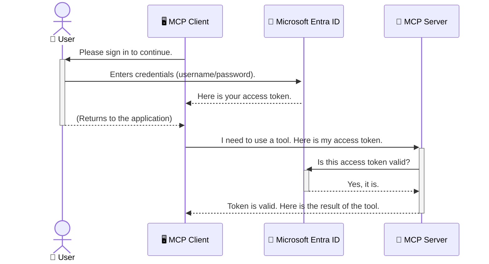

# AI வேலைப்பாடுகளை பாதுகாக்குதல்: மாடல் சூழல் நெறிமுறை சேவையகங்களுக்கு Entra ID அங்கீகாரம்

## அறிமுகம்
உங்கள் மாடல் சூழல் நெறிமுறை (MCP) சேவையகத்தை பாதுகாப்பது உங்கள் வீட்டின் முன்பக்க கதவை பூட்டுவது போல முக்கியமானது. MCP சேவையகத்தை திறந்தவிடுவது உங்கள் கருவிகள் மற்றும் தரவுகளை அனுமதியற்ற அணுகலுக்கு வெளிப்படுத்துகிறது, இது பாதுகாப்பு மீறல்களுக்கு வழிவகுக்கும். Microsoft Entra ID ஒரு வலுவான மேக அடிப்படையிலான அடையாளம் மற்றும் அணுகல் மேலாண்மை தீர்வை வழங்குகிறது, உங்கள் MCP சேவையகத்துடன் தொடர்பு கொள்ள அனுமதியளிக்கப்பட்ட பயனர்கள் மற்றும் பயன்பாடுகள் மட்டுமே உறுதிப்படுத்த உதவுகிறது. இந்த பிரிவில், Entra ID அங்கீகாரத்தைப் பயன்படுத்தி உங்கள் AI வேலைப்பாடுகளை எப்படி பாதுகாக்கலாம் என்பதை நீங்கள் கற்றுக்கொள்வீர்கள்.

## கற்றல் நோக்கங்கள்
இந்த பிரிவின் முடிவில், நீங்கள்:

- MCP சேவையகங்களை பாதுகாப்பதின் முக்கியத்துவத்தை புரிந்துகொள்ளலாம்.
- Microsoft Entra ID மற்றும் OAuth 2.0 அங்கீகாரத்தின் அடிப்படைகளை விளக்கலாம்.
- பொதுவான மற்றும் ரகசியமான கிளையன்டுகளுக்கு இடையிலான வேறுபாட்டை அறியலாம்.
- உள்ளூர் (பொது கிளையன்ட்) மற்றும் தொலைதூர (ரகசிய கிளையன்ட்) MCP சேவையக சூழல்களில் Entra ID அங்கீகாரத்தை செயல்படுத்தலாம்.
- AI வேலைப்பாடுகளை உருவாக்கும்போது பாதுகாப்பு சிறந்த நடைமுறைகளைப் பயன்படுத்தலாம்.

## பாதுகாப்பு மற்றும் MCP

நீங்கள் உங்கள் வீட்டின் முன்பக்க கதவை திறந்தவிட மாட்டீர்கள் போல, உங்கள் MCP சேவையகத்தை யாரும் அணுக முடியாதவாறு திறந்தவிட கூடாது. உங்கள் AI வேலைப்பாடுகளை பாதுகாப்பது வலுவான, நம்பகமான மற்றும் பாதுகாப்பான பயன்பாடுகளை உருவாக்குவதற்கு அவசியமானது. இந்த அத்தியாயம் Microsoft Entra ID ஐ MCP சேவையகங்களை பாதுகாக்க பயன்படுத்துவது பற்றி அறிமுகப்படுத்தும், உங்கள் கருவிகள் மற்றும் தரவுகளுடன் தொடர்பு கொள்ள அனுமதியளிக்கப்பட்ட பயனர்கள் மற்றும் பயன்பாடுகள் மட்டுமே உறுதிப்படுத்தும்.

## MCP சேவையகங்களுக்கு பாதுகாப்பு ஏன் முக்கியம்

உங்கள் MCP சேவையகத்தில் மின்னஞ்சல்களை அனுப்ப அல்லது வாடிக்கையாளர் தரவுத்தொகுப்பை அணுக ஒரு கருவி உள்ளது என்று கற்பனை செய்யுங்கள். பாதுகாக்கப்படாத சேவையகம் என்றால் யாரும் அந்த கருவியை பயன்படுத்த முடியும், இது அனுமதியற்ற தரவினை அணுகல், ஸ்பாம் அல்லது பிற தீவிர செயல்பாடுகளுக்கு வழிவகுக்கும்.

அங்கீகாரத்தை செயல்படுத்துவதன் மூலம், உங்கள் சேவையகத்திற்கு வரும் ஒவ்வொரு கோரிக்கையும் சரிபார்க்கப்படுகிறது, கோரிக்கையைச் செய்யும் பயனர் அல்லது பயன்பாட்டின் அடையாளத்தை உறுதிப்படுத்துகிறது. இது உங்கள் AI வேலைப்பாடுகளை பாதுகாக்கும் முதல் மற்றும் மிக முக்கியமான படியாகும்.

## Microsoft Entra ID அறிமுகம்

[**Microsoft Entra ID**](https://adoption.microsoft.com/microsoft-security/entra/) என்பது மேக அடிப்படையிலான அடையாளம் மற்றும் அணுகல் மேலாண்மை சேவை. உங்கள் பயன்பாடுகளுக்கு ஒரு உலகளாவிய பாதுகாப்பு காவலாளி போல இதை நினைக்கலாம். இது பயனர் அடையாளங்களை (அங்கீகாரம்) சரிபார்ப்பதற்கும் அவர்கள் என்ன செய்ய அனுமதிக்கப்படுகிறார்கள் என்பதை (அங்கீகாரம்) தீர்மானிப்பதற்கும் சிக்கலான செயல்முறையை கையாளுகிறது.

Entra ID ஐப் பயன்படுத்துவதன் மூலம், நீங்கள்:

- பயனர்களுக்கு பாதுகாப்பான உள்நுழைவை செயல்படுத்தலாம்.
- APIக்கள் மற்றும் சேவைகளை பாதுகாக்கலாம்.
- மைய இடத்தில் அணுகல் கொள்கைகளை நிர்வகிக்கலாம்.

MCP சேவையகங்களுக்கு, Entra ID உங்கள் சேவையகத்தின் திறன்களை யார் அணுக முடியும் என்பதை நிர்வகிக்க ஒரு வலுவான மற்றும் பரவலாக நம்பகமான தீர்வை வழங்குகிறது.

---

## மந்திரத்தைப் புரிந்துகொள்ளுதல்: Entra ID அங்கீகாரம் எப்படி வேலை செய்கிறது

Entra ID **OAuth 2.0** போன்ற திறந்த தரநிலைகளைப் பயன்படுத்தி அங்கீகாரத்தை கையாளுகிறது. விவரங்கள் சிக்கலாக இருக்கலாம், ஆனால் முக்கிய கருத்து எளிமையானது மற்றும் ஒரு ஒப்புமையுடன் புரிந்துகொள்ளலாம்.

### OAuth 2.0 க்கு ஒரு மென்மையான அறிமுகம்: வாலெட் கீ

OAuth 2.0 ஐ உங்கள் காருக்கான வாலெட் சேவையாக நினைக்கவும். நீங்கள் ஒரு உணவகத்திற்கு வரும்போது, வாலெட்டுக்கு உங்கள் மாஸ்டர் கீயை கொடுக்க மாட்டீர்கள். அதற்கு பதிலாக, நீங்கள் ஒரு **வாலெட் கீ** கொடுக்கிறீர்கள், இது வரையறுக்கப்பட்ட அனுமதிகளை கொண்டுள்ளது—இது காரை தொடங்கவும் கதவுகளை பூட்டவும் முடியும், ஆனால் டிரங்க் அல்லது க்ளவ் கம்பார்ட்மெண்ட்டை திறக்க முடியாது.

இந்த ஒப்புமையில்:

- **நீங்கள்** **பயனர்**.
- **உங்கள் கார்** **MCP சேவையகம்** அதன் மதிப்புமிக்க கருவிகள் மற்றும் தரவுகளுடன்.
- **வாலெட்** **Microsoft Entra ID**.
- **பார்க்கிங் அடெண்டன்ட்** **MCP கிளையன்ட்** (சேவையகத்தை அணுக முயற்சிக்கும் பயன்பாடு).
- **வாலெட் கீ** **அணுகல் டோக்கன்**.

அணுகல் டோக்கன் என்பது Entra ID உள்நுழைந்த பிறகு MCP கிளையன்ட் பெறும் ஒரு பாதுகாப்பான உரை. கிளையன்ட் இந்த டோக்கனை MCP சேவையகத்துக்கு ஒவ்வொரு கோரிக்கையிலும் வழங்குகிறது. சேவையகம் டோக்கனை சரிபார்த்து கோரிக்கை சட்டபூர்வமானது மற்றும் கிளையன்டுக்கு தேவையான அனுமதிகள் உள்ளன என்பதை உறுதிப்படுத்த முடியும், உங்கள் உண்மையான சான்றுகளை (உங்கள் கடவுச்சொல் போன்றவை) கையாளாமல்.

### அங்கீகாரத்தின் ஓட்டம்

இது நடைமுறையில் எப்படி வேலை செய்கிறது:



### Microsoft Authentication Library (MSAL) அறிமுகம்

குறியீட்டில் செல்லும் முன், முக்கியமான ஒரு கூறை அறிமுகப்படுத்துவது முக்கியம்: **Microsoft Authentication Library (MSAL)**.

MSAL என்பது Microsoft உருவாக்கிய ஒரு நூலகம், இது டெவலப்பர்களுக்கு அங்கீகாரத்தை கையாள மிகவும் எளிதாக்குகிறது. பாதுகாப்பு டோக்கன்களை கையாளுதல், உள்நுழைவை நிர்வகித்தல் மற்றும் அமர்வுகளை புதுப்பித்தல் போன்ற சிக்கலான குறியீட்டை நீங்கள் எழுத வேண்டிய அவசியமில்லாமல் MSAL இந்த சுமையை கையாளுகிறது.

MSAL ஐப் பயன்படுத்துவது மிகவும் பரிந்துரைக்கப்படுகிறது, ஏனெனில்:

- **இது பாதுகாப்பானது:** இது தொழில்துறை தரநிலைகள் மற்றும் பாதுகாப்பு சிறந்த நடைமுறைகளை செயல்படுத்துகிறது, உங்கள் குறியீட்டில் பாதிப்பு ஏற்படும் அபாயத்தை குறைக்கிறது.
- **இது வளர்ச்சியை எளிதாக்குகிறது:** இது OAuth 2.0 மற்றும் OpenID Connect நெறிமுறைகளின் சிக்கல்களை அகற்றுகிறது, உங்கள் பயன்பாட்டில் வலுவான அங்கீகாரத்தை சில வரிகளின் குறியீட்டுடன் சேர்க்க அனுமதிக்கிறது.
- **இது பராமரிக்கப்படுகிறது:** Microsoft புதிய பாதுகாப்பு அச்சுறுத்தல்கள் மற்றும் தள மாற்றங்களைத் தீர்க்க MSAL ஐச் செயல்படுத்துகிறது மற்றும் புதுப்பிக்கிறது.

MSAL பல்வேறு மொழிகள் மற்றும் பயன்பாட்டு கட்டமைப்புகளை ஆதரிக்கிறது, .NET, JavaScript/TypeScript, Python, Java, Go மற்றும் iOS மற்றும் Android போன்ற மொபைல் தளங்களை உள்ளடக்கியது. இது உங்கள் முழு தொழில்நுட்ப அடுக்கில் ஒரே நிலையான அங்கீகார முறைகளைப் பயன்படுத்த அனுமதிக்கிறது.

MSAL பற்றி மேலும் அறிய, அதிகாரப்பூர்வ [MSAL கண்ணோட்ட ஆவணத்தை](https://learn.microsoft.com/entra/identity-platform/msal-overview) பார்க்கலாம்.

---

## உங்கள் MCP சேவையகத்தை Entra ID மூலம் பாதுகாக்குதல்: படிப்படியாக வழிகாட்டுதல்

இப்போது, Entra ID ஐப் பயன்படுத்தி உள்ளூர் MCP சேவையகத்தை (`stdio` மூலம் தொடர்பு கொள்ளும்) எப்படி பாதுகாக்கலாம் என்பதைப் பார்ப்போம். இந்த எடுத்துக்காட்டில் **பொது கிளையன்ட்** பயன்படுத்தப்படுகிறது, இது பயனரின் கணினியில் இயங்கும் பயன்பாடுகளுக்கு, டெஸ்க்டாப் பயன்பாடு அல்லது உள்ளூர் மேம்பாட்டு சேவையகம் போன்றவற்றுக்கு பொருத்தமானது.

### சூழல் 1: உள்ளூர் MCP சேவையகத்தை பாதுகாக்குதல் (பொது கிளையன்டுடன்)

இந்த சூழலில், `stdio` மூலம் உள்ளூர் MCP சேவையகம் இயங்குகிறது, மற்றும் Microsoft Graph API இல் இருந்து பயனரின் சுயவிவரத் தகவலை பெறும் ஒரு கருவி மட்டுமே உள்ளது.

#### 1. Entra ID இல் பயன்பாட்டை அமைத்தல்

குறியீட்டை எழுதுவதற்கு முன், Microsoft Entra ID இல் உங்கள் பயன்பாட்டை பதிவு செய்ய வேண்டும். இது Entra ID க்கு உங்கள் பயன்பாட்டைப் பற்றி தெரிவிக்கிறது மற்றும் அங்கீகார சேவையைப் பயன்படுத்த அனுமதி அளிக்கிறது.

1. **[Microsoft Entra போர்டல்](https://entra.microsoft.com/)**க்கு செல்லவும்.
2. **App registrations**க்கு சென்று **New registration** ஐ கிளிக் செய்யவும்.
3. உங்கள் பயன்பாட்டிற்கு ஒரு பெயரை கொடுக்கவும் (எ.கா., "My Local MCP Server").
4. **Supported account types**க்கு **Accounts in this organizational directory only** ஐ தேர்ந்தெடுக்கவும்.
5. இந்த எடுத்துக்காட்டுக்கு **Redirect URI** ஐ காலியாக விடலாம்.
6. **Register** ஐ கிளிக் செய்யவும்.

பதிவு செய்யப்பட்ட பிறகு, **Application (client) ID** மற்றும் **Directory (tenant) ID** ஐ கவனிக்கவும். இவை உங்கள் குறியீட்டில் தேவைப்படும்.

#### 2. குறியீடு: ஒரு பகுப்பாய்வு

அங்கீகாரத்தை கையாளும் குறியீட்டின் முக்கிய பகுதிகளைப் பார்ப்போம். இந்த எடுத்துக்காட்டின் முழு குறியீடு [Entra ID - Local - WAM](https://github.com/Azure-Samples/mcp-auth-servers/tree/main/src/entra-id-local-wam) கோப்பகத்தில் [mcp-auth-servers GitHub repository](https://github.com/Azure-Samples/mcp-auth-servers) இல் கிடைக்கிறது.

**`AuthenticationService.cs`**

இந்த வகுப்பு Entra ID உடன் தொடர்பை கையாள பொறுப்பாக உள்ளது.

- **`CreateAsync`**: இது MSAL (Microsoft Authentication Library) இல் இருந்து `PublicClientApplication` ஐ ஆரம்பிக்கிறது. இது உங்கள் பயன்பாட்டின் `clientId` மற்றும் `tenantId` உடன் அமைக்கப்படுகிறது.
- **`WithBroker`**: இது ஒரு broker ஐ (Windows Web Account Manager போன்ற) பயன்படுத்த அனுமதிக்கிறது, இது பாதுகாப்பான மற்றும் எளிதான single sign-on அனுபவத்தை வழங்குகிறது.
- **`AcquireTokenAsync`**: இது முக்கியமான முறை. இது முதலில் ஒரு டோக்கனை அமைதியாக பெற முயற்சிக்கிறது (பயனருக்கு ஏற்கனவே செல்லுபடியாகும் அமர்வு இருந்தால் மீண்டும் உள்நுழைய வேண்டிய அவசியமில்லை). அமைதியான டோக்கனைப் பெற முடியாவிட்டால், பயனரை இடைமுகமாக உள்நுழையுமாறு கேட்கும்.

```csharp
// Simplified for clarity
public static async Task<AuthenticationService> CreateAsync(ILogger<AuthenticationService> logger)
{
    var msalClient = PublicClientApplicationBuilder
        .Create(_clientId) // Your Application (client) ID
        .WithAuthority(AadAuthorityAudience.AzureAdMyOrg)
        .WithTenantId(_tenantId) // Your Directory (tenant) ID
        .WithBroker(new BrokerOptions(BrokerOptions.OperatingSystems.Windows))
        .Build();

    // ... cache registration ...

    return new AuthenticationService(logger, msalClient);
}

public async Task<string> AcquireTokenAsync()
{
    try
    {
        // Try silent authentication first
        var accounts = await _msalClient.GetAccountsAsync();
        var account = accounts.FirstOrDefault();

        AuthenticationResult? result = null;

        if (account != null)
        {
            result = await _msalClient.AcquireTokenSilent(_scopes, account).ExecuteAsync();
        }
        else
        {
            // If no account, or silent fails, go interactive
            result = await _msalClient.AcquireTokenInteractive(_scopes).ExecuteAsync();
        }

        return result.AccessToken;
    }
    catch (Exception ex)
    {
        _logger.LogError(ex, "An error occurred while acquiring the token.");
        throw; // Optionally rethrow the exception for higher-level handling
    }
}
```

**`Program.cs`**

இது MCP சேவையகத்தை அமைக்கிறது மற்றும் அங்கீகார சேவையை ஒருங்கிணைக்கிறது.

- **`AddSingleton<AuthenticationService>`**: இது `AuthenticationService` ஐ dependency injection container உடன் பதிவு செய்கிறது, இது பயன்பாட்டின் பிற பகுதிகளால் (எ.கா., எங்கள் கருவி) பயன்படுத்தப்படலாம்.
- **`GetUserDetailsFromGraph` tool**: இந்த கருவி `AuthenticationService` இன் ஒரு உதாரணத்தை தேவைப்படுகிறது. இது எதையும் செய்யும் முன், `authService.AcquireTokenAsync()` ஐ அழைக்கிறது செல்லுபடியாகும் அணுகல் டோக்கனைப் பெற. அங்கீகாரம் வெற்றிகரமாக இருந்தால், Microsoft Graph API ஐ அழைக்க டோக்கனைப் பயன்படுத்தி பயனரின் விவரங்களை MCP கிளையன்டுக்கு திருப்பி அனுப்புகிறது.

```csharp
// Simplified for clarity
[McpServerTool(Name = "GetUserDetailsFromGraph")]
public static async Task<string> GetUserDetailsFromGraph(
    AuthenticationService authService)
{
    try
    {
        // This will trigger the authentication flow
        var accessToken = await authService.AcquireTokenAsync();

        // Use the token to create a GraphServiceClient
        var graphClient = new GraphServiceClient(
            new BaseBearerTokenAuthenticationProvider(new TokenProvider(authService)));

        var user = await graphClient.Me.GetAsync();

        return System.Text.Json.JsonSerializer.Serialize(user);
    }
    catch (Exception ex)
    {
        return $"Error: {ex.Message}";
    }
}
```

#### 3. இது அனைத்தும் ஒன்றாக எப்படி வேலை செய்கிறது

1. MCP கிளையன்ட் `GetUserDetailsFromGraph` கருவியைப் பயன்படுத்த முயற்சிக்கும்போது, கருவி முதலில் `AcquireTokenAsync` ஐ அழைக்கிறது.
2. `AcquireTokenAsync` MSAL நூலகத்தை செல்லுபடியாகும் டோக்கனைச் சரிபார்க்கத் தூண்டுகிறது.
3. டோக்கன் கிடைக்கவில்லை என்றால், MSAL, broker மூலம், பயனரை Entra ID கணக்குடன் உள்நுழையுமாறு கேட்கும்.
4. பயனர் உள்நுழைந்த பிறகு, Entra ID ஒரு அணுகல் டோக்கனை வழங்குகிறது.
5. கருவி டோக்கனைப் பெறுகிறது மற்றும் Microsoft Graph API ஐ அழைக்க பாதுகாப்பான அழைப்பைச் செய்கிறது.
6. பயனரின் விவரங்கள் MCP கிளையன்டுக்கு திருப்பி அனுப்பப்படுகிறது.

இந்த செயல்முறை, அங்கீகாரம் செய்யப்பட்ட பயனர்கள் மட்டுமே கருவியைப் பயன்படுத்த முடியும் என்பதை உறுதிப்படுத்துகிறது, உங்கள் உள்ளூர் MCP சேவையகத்தை திறம்பட பாதுகாக்கிறது.

### சூழல் 2: தொலைதூர MCP சேவையகத்தை பாதுகாக்குதல் (ரகசிய கிளையன்டுடன்)

உங்கள் MCP சேவையகம் ஒரு தொலைதூர இயந்திரத்தில் (மேக சேவையகம் போன்ற) இயங்கும்போது மற்றும் HTTP Streaming போன்ற நெறிமுறையின் மூலம் தொடர்பு கொள்ளும்போது, பாதுகாப்பு தேவைகள் வேறுபடுகின்றன. இந்த சூழலில், **ரகசிய கிளையன்ட்** மற்றும் **Authorization Code Flow** ஐ பயன்படுத்த வேண்டும். இது ஒரு பாதுகாப்பான முறை, ஏனெனில் பயன்பாட்டின் ரகசியங்கள் உலாவியில் வெளிப்படுத்தப்படுவதில்லை.

இந்த எடுத்துக்காட்டில் TypeScript அடிப்படையிலான MCP சேவையகம் பயன்படுத்தப்படுகிறது, இது HTTP கோரிக்கைகளை கையாள Express.js ஐ பயன்படுத்துகிறது.

#### 1. Entra ID இல் பயன்பாட்டை அமைத்தல்

பொது கிளையன்டில் உள்ள அமைப்பு போன்றது, ஆனால் ஒரு முக்கிய வேறுபாடு உள்ளது: நீங்கள் ஒரு **client secret** உருவாக்க வேண்டும்.

1. **[Microsoft Entra போர்டல்](https://entra.microsoft.com/)**க்கு செல்லவும்.
2. உங்கள் பயன்பாட்டு பதிவில் **Certificates & secrets** தாவலுக்கு செல்லவும்.
3. **New client secret** ஐ கிளிக் செய்து, ஒரு விளக்கத்தை கொடுத்து **Add** ஐ கிளிக் செய்யவும்.
4. **முக்கியம்:** ரகசிய மதிப்பை உடனடியாக நகலெடுக்கவும். அதை மீண்டும் பார்க்க முடியாது.
5. நீங்கள் ஒரு **Redirect URI** ஐ அமைக்கவும் வேண்டும். **Authentication** தாவலுக்கு செல்லவும், **Add a platform** ஐ கிளிக் செய்யவும், **Web** ஐ தேர்ந்தெடுக்கவும், மற்றும் உங்கள் பயன்பாட்டிற்கான redirect URI ஐ உள்ளிடவும் (எ.கா., `http://localhost:3001/auth/callback`).

> **⚠️ முக்கிய பாதுகாப்பு குறிப்புகள்:** உற்பத்தி பயன்பாடுகளுக்கு, Microsoft **Managed Identity** அல்லது **Workload Identity Federation** போன்ற **secretless authentication** முறைகளை client secrets ஐ விட மிகவும் பரிந்துரைக்கிறது. Client secrets பாதுகாப்பு அபாயங்களை ஏற்படுத்தும், ஏனெனில் அவை வெளிப்படுத்தப்படவோ அல்லது ஆபத்துக்குள்ளாகவோ இருக்கலாம். Managed identities உங்கள் குறியீடு அல்லது கட்டமைப்பில் சான்றுகளை சேமிக்க தேவையில்லாமல் பாதுகாப்பான அணுகலை வழங்குகிறது.
>
> Managed identities மற்றும் அவற்றை எப்படி செயல்படுத்துவது பற்றி மேலும் தகவலுக்கு, [Managed identities for Azure resources overview](https://learn.microsoft.com/entra/identity/managed-identities-azure-resources/overview) ஐ பார்க்கவும்.

#### 2. குறியீடு: ஒரு பகுப்பாய்வு

இந்த எடுத்துக்காட்டில் அமர்வு அடிப்படையிலான அணுகுமுறை பயன்படுத்தப்படுகிறது. பயனர் அங்கீகரிக்கும்போது, சேவையகம் அணுகல் டோக்கன் மற்றும் refresh token ஐ ஒரு session இல் சேமிக்கிறது மற்றும் பயனருக்கு session token ஐ வழங்குகிறது. இந்த session token பின்னர் தொடர்ந்து கோரிக்கைகளுக்கு பயன்படுத்தப்படுகிறது. இந்த எடுத்துக்காட்டின் முழு குறியீடு [Entra ID - Confidential client](https://github.com/Azure-Samples/mcp-auth-servers/tree/main/src/entra-id-cca-session) கோப்பகத்தில் [mcp-auth-servers GitHub repository](https://github.com/Azure-Samples/mcp-auth-servers) இல் கிடைக்கிறது.

**`Server.ts`**

இந்த கோப்பு Express சேவையகத்தை மற்றும் MCP போக்குவரத்து அடுக்கு அமைக்கிறது.

- **`requireBearerAuth`**: இது `/sse` மற்றும் `/message` முடுக்கங்களை பாதுகாக்கும் middleware ஆகும். இது கோரிக்கையின் `Authorization` தலைப்பில் செல்லுபடியாகும் bearer token ஐ சரிபார்க்கிறது.
- **`EntraIdServerAuthProvider`**: இது `McpServerAuthorizationProvider` இடைமுகத்தை செயல்படுத்தும் தனிப்பயன் வகுப்பு. இது OAuth 2.0 ஓட்டத்தை கையாள பொறுப்பாக உள்ளது.
- **`/auth/callback`**: இந்த முடுக்கம் பயனர் அங்கீகரித்த பிறகு Entra ID இல் இருந்து redirect ஐ கையாளுகிறது. இது authorization code ஐ access token மற்றும் refresh token க்கு மாற்றுகிறது.

```typescript
// Simplified for clarity
const app = express();
const { server } = createServer();
const provider = new EntraIdServerAuthProvider();

// Protect the SSE endpoint
app.get("/sse", requireBearerAuth({
  provider,
  requiredScopes: ["User.Read"]
}), async (req, res) => {
  // ... connect to the transport ...
});

// Protect the message endpoint
app.post("/message", requireBearerAuth({
  provider,
  requiredScopes: ["User.Read"]
}), async (req, res) => {
  // ... handle the message ...
});

// Handle the OAuth 2.0 callback
app.get("/auth/callback", (req, res) => {
  provider.handleCallback(req.query.code, req.query.state)
    .then(result => {
      // ... handle success or failure ...
    });
});
```

**`Tools.ts`**

இந்த கோப்பு MCP சேவையகம் வழங்கும் கருவிகளை வரையறுக்கிறது.
2. பயனர் தங்கள் Entra ID கணக்குடன் உள்நுழைகிறார்.  
3. Entra ID பயனரை `/auth/callback` முடுக்கத்தில் அனுமதி குறியீடு (authorization code) உடன் திருப்பி அனுப்புகிறது.  
4. சர்வர் குறியீட்டை அணுகல் டோக்கன் மற்றும் புதுப்பிப்பு டோக்கனாக மாற்றி, அவற்றை சேமித்து, ஒரு அமர்வு டோக்கனை உருவாக்கி, அதை கிளையண்டுக்கு அனுப்புகிறது.  
5. கிளையண்ட் இப்போது இந்த அமர்வு டோக்கனை `Authorization` தலைப்பில் MCP சர்வருக்கு எதிர்கால கோரிக்கைகளுக்கு பயன்படுத்தலாம்.  
6. `getUserDetails` கருவி அழைக்கப்படும் போது, அது அமர்வு டோக்கனை பயன்படுத்தி Entra ID அணுகல் டோக்கனை தேடி, Microsoft Graph API-யை அழைக்கிறது.  

இந்த செயல்முறை பொதுவான கிளையண்ட் செயல்முறையை விட சிக்கலானது, ஆனால் இணையத்துடன் தொடர்புடைய முடுக்கங்களுக்கு அவசியமானது. தொலை MCP சர்வர்கள் பொதுவான இணையத்தில் அணுகக்கூடியவை என்பதால், அனுமதியில்லாத அணுகல் மற்றும் சாத்தியமான தாக்குதல்களைத் தடுக்க வலுவான பாதுகாப்பு நடவடிக்கைகள் தேவைப்படுகிறது.  

## பாதுகாப்பு சிறந்த நடைமுறைகள்  

- **எப்போதும் HTTPS பயன்படுத்தவும்**: கிளையண்ட் மற்றும் சர்வருக்கு இடையிலான தொடர்பை குறியாக்கம் செய்து, டோக்கன்கள் மடக்கப்படுவதைத் தடுக்கவும்.  
- **பாத்திர அடிப்படையிலான அணுகல் கட்டுப்பாடு (RBAC) செயல்படுத்தவும்**: பயனர் அங்கீகரிக்கப்பட்டவரா என்பதை மட்டும் சரிபார்க்காமல், அவர்கள் என்ன செய்ய அனுமதிக்கப்பட்டுள்ளனர் என்பதை சரிபார்க்கவும். Entra ID-ல் பாத்திரங்களை வரையறுத்து, MCP சர்வரில் அவற்றைச் சரிபார்க்கலாம்.  
- **கண்காணித்து, ஆய்வு செய்யவும்**: அனைத்து அங்கீகார நிகழ்வுகளையும் பதிவு செய்து, சந்தேகத்திற்கிடமான செயல்பாடுகளை கண்டறிந்து பதிலளிக்கவும்.  
- **விகித வரம்பு மற்றும் தடைசெய்தல் கையாளவும்**: Microsoft Graph மற்றும் பிற API-க்கள் தவறாக பயன்படுத்துவதைத் தடுக்க விகித வரம்புகளை செயல்படுத்துகின்றன. MCP சர்வரில் HTTP 429 (மிகவும் அதிகமான கோரிக்கைகள்) பதில்களை நன்கு கையாள, பரந்த பின்னடைவுகள் மற்றும் மீண்டும் முயற்சி செய்யும் தார்மீகத்தை செயல்படுத்தவும். API அழைப்புகளை குறைக்க, அடிக்கடி அணுகப்படும் தரவுகளை காட்சியிடவும்.  
- **டோக்கன் சேமிப்பை பாதுகாக்கவும்**: அணுகல் டோக்கன்கள் மற்றும் புதுப்பிப்பு டோக்கன்களை பாதுகாப்பாக சேமிக்கவும். உள்ளூர் பயன்பாடுகளுக்கு, அமைப்பின் பாதுகாப்பான சேமிப்பு முறைகளைப் பயன்படுத்தவும். சர்வர் பயன்பாடுகளுக்கு, குறியாக்கப்பட்ட சேமிப்பு அல்லது Azure Key Vault போன்ற பாதுகாப்பான முக்கிய மேலாண்மை சேவைகளைப் பயன்படுத்தவும்.  
- **டோக்கன் காலாவதியானதை கையாளவும்**: அணுகல் டோக்கன்களுக்கு வரையறுக்கப்பட்ட ஆயுள் உள்ளது. மீண்டும் அங்கீகாரம் செய்யாமல், பயனர் அனுபவத்தைத் தொடர, புதுப்பிப்பு டோக்கன்களைப் பயன்படுத்தி தானியங்கி டோக்கன் புதுப்பிப்பை செயல்படுத்தவும்.  
- **Azure API Management பயன்படுத்துவது பற்றி யோசிக்கவும்**: MCP சர்வரில் நேரடியாக பாதுகாப்பை செயல்படுத்துவது நுணுக்கமான கட்டுப்பாட்டை வழங்கினாலும், Azure API Management போன்ற API Gateway-க்கள் அங்கீகாரம், அனுமதி, விகித வரம்பு மற்றும் கண்காணிப்பு போன்ற பல பாதுகாப்பு கவலைகளை தானாக கையாள முடியும். இவை உங்கள் கிளையண்ட்கள் மற்றும் MCP சர்வர்களுக்கு இடையே மையப்படுத்தப்பட்ட பாதுகாப்பு அடுக்கு வழங்குகின்றன. MCP-க்கு API Gateway-க்களைப் பயன்படுத்துவது பற்றிய மேலும் விவரங்களுக்கு, [Azure API Management Your Auth Gateway For MCP Servers](https://techcommunity.microsoft.com/blog/integrationsonazureblog/azure-api-management-your-auth-gateway-for-mcp-servers/4402690) பார்க்கவும்.  

## முக்கிய குறிப்புகள்  

- உங்கள் MCP சர்வரை பாதுகாப்பாக வைத்திருப்பது உங்கள் தரவுகள் மற்றும் கருவிகளைப் பாதுகாக்க முக்கியமானது.  
- Microsoft Entra ID அங்கீகாரம் மற்றும் அனுமதிக்கான வலுவான மற்றும் அளவளாவிய தீர்வை வழங்குகிறது.  
- உள்ளூர் பயன்பாடுகளுக்கு **பொது கிளையண்ட்** மற்றும் தொலை சர்வர்களுக்கு **கடவுச்சொற்களுடன் கூடிய கிளையண்ட்** பயன்படுத்தவும்.  
- **Authorization Code Flow** என்பது வலை பயன்பாடுகளுக்கு மிகவும் பாதுகாப்பான விருப்பம்.  

## பயிற்சி  

1. நீங்கள் உருவாக்கக்கூடிய MCP சர்வரை பற்றி யோசிக்கவும். அது உள்ளூர் சர்வரா அல்லது தொலை சர்வரா?  
2. உங்கள் பதிலின் அடிப்படையில், நீங்கள் பொதுவான அல்லது கடவுச்சொற்களுடன் கூடிய கிளையண்ட் பயன்படுத்துவீர்களா?  
3. Microsoft Graph-க்கு எதிராக செயல்பாடுகளைச் செய்ய உங்கள் MCP சர்வர் எந்த அனுமதியை கோரும்?  

## செயல்முறை பயிற்சிகள்  

### பயிற்சி 1: Entra ID-ல் ஒரு பயன்பாட்டை பதிவு செய்யவும்  
Microsoft Entra போர்டலுக்கு செல்லவும்.  
உங்கள் MCP சர்வருக்கான புதிய பயன்பாட்டை பதிவு செய்யவும்.  
Application (client) ID மற்றும் Directory (tenant) ID-ஐ பதிவு செய்யவும்.  

### பயிற்சி 2: உள்ளூர் MCP சர்வரை பாதுகாக்கவும் (பொது கிளையண்ட்)  
- பயனர் அங்கீகாரத்திற்கான MSAL (Microsoft Authentication Library) ஐ ஒருங்கிணைக்க குறியீட்டு உதாரணத்தைப் பின்பற்றவும்.  
- Microsoft Graph-ல் இருந்து பயனர் விவரங்களை பெறும் MCP கருவியை அழைத்து அங்கீகார செயல்முறையை சோதிக்கவும்.  

### பயிற்சி 3: தொலை MCP சர்வரை பாதுகாக்கவும் (கடவுச்சொற்களுடன் கூடிய கிளையண்ட்)  
- Entra ID-ல் ஒரு Confidential Client-ஐ பதிவு செய்து, ஒரு Client Secret உருவாக்கவும்.  
- Authorization Code Flow ஐ பயன்படுத்த உங்கள் Express.js MCP சர்வரை அமைக்கவும்.  
- பாதுகாக்கப்பட்ட முடுக்கங்களை சோதித்து, டோக்கன் அடிப்படையிலான அணுகலை உறுதிப்படுத்தவும்.  

### பயிற்சி 4: பாதுகாப்பு சிறந்த நடைமுறைகளைப் பயன்படுத்தவும்  
- உங்கள் உள்ளூர் அல்லது தொலை சர்வருக்கு HTTPS-ஐ இயக்கவும்.  
- உங்கள் சர்வர் லாஜிக்கில் பாத்திர அடிப்படையிலான அணுகல் கட்டுப்பாட்டை (RBAC) செயல்படுத்தவும்.  
- டோக்கன் காலாவதியானதை கையாளவும் மற்றும் டோக்கன் சேமிப்பை பாதுகாக்கவும்.  

## வளங்கள்  

1. **MSAL கண்ணோட்ட ஆவணங்கள்**  
   Microsoft Authentication Library (MSAL) பல தளங்களில் பாதுகாப்பான டோக்கன் பெறுதலை எவ்வாறு செயல்படுத்துகிறது என்பதை அறிக:  
   [MSAL Overview on Microsoft Learn](https://learn.microsoft.com/en-gb/entra/msal/overview)  

2. **Azure-Samples/mcp-auth-servers GitHub Repository**  
   அங்கீகார செயல்முறைகளை விளக்கும் MCP சர்வர்களின் குறியீட்டு செயல்பாடுகள்:  
   [Azure-Samples/mcp-auth-servers on GitHub](https://github.com/Azure-Samples/mcp-auth-servers)  

3. **Azure வளங்களுக்கான மேலாண்மை அடையாளங்கள் கண்ணோட்டம்**  
   அமைப்பு அல்லது பயனர் ஒதுக்கப்பட்ட மேலாண்மை அடையாளங்களைப் பயன்படுத்தி ரகசியங்களை நீக்குவது எப்படி என்பதைப் புரிந்துகொள்ளவும்:  
   [Managed Identities Overview on Microsoft Learn](https://learn.microsoft.com/en-us/entra/identity/managed-identities-azure-resources/)  

4. **Azure API Management: MCP சர்வர்களுக்கான உங்கள் அங்கீகார வாயில்**  
   MCP சர்வர்களுக்கான பாதுகாப்பான OAuth2 வாயிலாக APIM ஐ பயன்படுத்துவது பற்றிய விரிவான விளக்கம்:  
   [Azure API Management Your Auth Gateway For MCP Servers](https://techcommunity.microsoft.com/blog/integrationsonazureblog/azure-api-management-your-auth-gateway-for-mcp-servers/4402690)  

5. **Microsoft Graph அனுமதிகள் குறிப்பு**  
   Microsoft Graph-க்கு ஒதுக்கப்பட்ட மற்றும் பயன்பாட்டு அனுமதிகளின் விரிவான பட்டியல்:  
   [Microsoft Graph Permissions Reference](https://learn.microsoft.com/zh-tw/graph/permissions-reference)  

## கற்றல் முடிவுகள்  
இந்த பிரிவை முடித்த பிறகு, நீங்கள்:  

- MCP சர்வர்கள் மற்றும் AI வேலைப்பாடுகளுக்கு அங்கீகாரம் ஏன் முக்கியமானது என்பதை விளக்க முடியும்.  
- உள்ளூர் மற்றும் தொலை MCP சர்வர் சூழல்களுக்கு Entra ID அங்கீகாரத்தை அமைத்து, கட்டமைக்க முடியும்.  
- உங்கள் சர்வரின் பிரசாரத்தின் அடிப்படையில் சரியான கிளையண்ட் வகையை (பொது அல்லது Confidential) தேர்வு செய்ய முடியும்.  
- டோக்கன் சேமிப்பு மற்றும் பாத்திர அடிப்படையிலான அங்கீகாரம் போன்ற பாதுகாப்பான குறியீட்டு நடைமுறைகளை செயல்படுத்த முடியும்.  
- MCP சர்வர் மற்றும் அதன் கருவிகளை அனுமதியில்லாத அணுகலிலிருந்து தன்னம்பிக்கையுடன் பாதுகாக்க முடியும்.  

## அடுத்தது  

- [5.13 மாடல் சூழல் நெறிமுறை (MCP) Azure AI Foundry உடன் ஒருங்கிணைப்பு](../mcp-foundry-agent-integration/README.md)  

---

**அறிவிப்பு**:  
இந்த ஆவணம் [Co-op Translator](https://github.com/Azure/co-op-translator) என்ற AI மொழிபெயர்ப்பு சேவையை பயன்படுத்தி மொழிபெயர்க்கப்பட்டுள்ளது. நாங்கள் துல்லியத்திற்காக முயற்சிக்கிறோம், ஆனால் தானியங்கி மொழிபெயர்ப்புகளில் பிழைகள் அல்லது தவறுகள் இருக்கக்கூடும் என்பதை கவனத்தில் கொள்ளவும். அதன் சொந்த மொழியில் உள்ள மூல ஆவணம் அதிகாரப்பூர்வ ஆதாரமாக கருதப்பட வேண்டும். முக்கியமான தகவல்களுக்கு, தொழில்முறை மனித மொழிபெயர்ப்பு பரிந்துரைக்கப்படுகிறது. இந்த மொழிபெயர்ப்பைப் பயன்படுத்துவதால் ஏற்படும் எந்த தவறான புரிதல்களுக்கும் அல்லது தவறான விளக்கங்களுக்கும் நாங்கள் பொறுப்பல்ல.