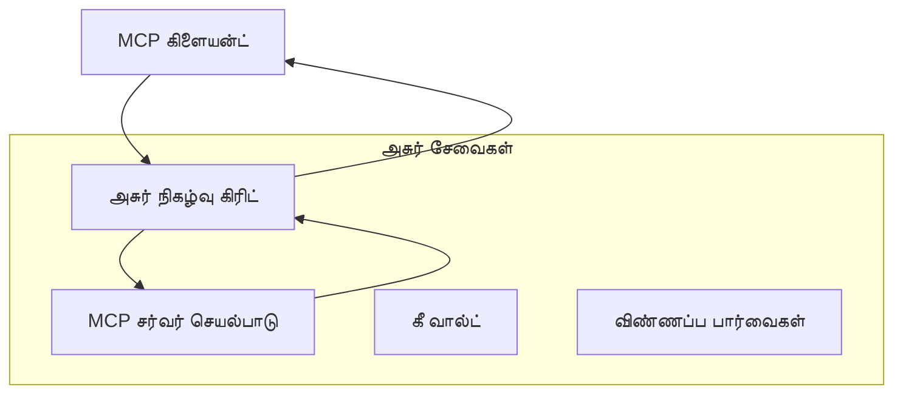
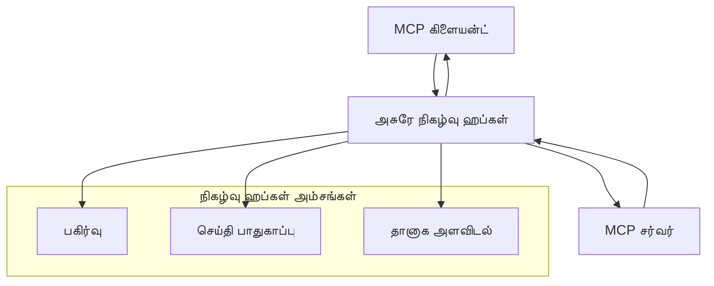

# MCP தனிப்பயன் போக்குவரத்துகள் - மேம்பட்ட செயலாக்க வழிகாட்டி

மாடல் சூழல் நெறிமுறை (MCP) போக்குவரத்து முறைகளில் நெகிழ்வுத்தன்மையை வழங்குகிறது, சிறப்பு நிறுவன சூழல்களுக்கு தனிப்பயன் செயலாக்கங்களை அனுமதிக்கிறது. இந்த மேம்பட்ட வழிகாட்டி, Azure Event Grid மற்றும் Azure Event Hubs ஆகியவற்றைப் பயன்படுத்தி தனிப்பயன் போக்குவரத்து செயலாக்கங்களை ஆராய்கிறது, அளவிடக்கூடிய, மேக-நேட்டிவ் MCP தீர்வுகளை உருவாக்குவதற்கான நடைமுறை உதாரணங்களாக.

## அறிமுகம்

MCP இன் நிலையான போக்குவரத்துகள் (stdio மற்றும் HTTP ஸ்ட்ரீமிங்) பெரும்பாலான பயன்பாடுகளுக்கு சேவை அளித்தாலும், நிறுவன சூழல்கள் பெரும்பாலும் மேம்பட்ட அளவிடல், நம்பகத்தன்மை மற்றும் உள்ளமைவான மேக கட்டமைப்புடன் ஒருங்கிணைப்புக்காக சிறப்பு போக்குவரத்து முறைகளை தேவைப்படுத்துகின்றன. தனிப்பயன் போக்குவரத்துகள் MCP க்கு மேக-நேட்டிவ் செய்தி சேவைகளை பயன்படுத்தி அசிங்க்ரோனஸ் தொடர்பு, நிகழ்வு இயக்கப்பட்ட கட்டமைப்புகள் மற்றும் பகிர்ந்த செயலாக்கத்திற்கான வாய்ப்புகளை வழங்குகின்றன.

இந்த பாடம் சமீபத்திய MCP விவரக்குறிப்பின் (2025-11-25) அடிப்படையில், Azure செய்தி சேவைகள் மற்றும் நிறுவனம் ஒருங்கிணைப்பு மாதிரிகள் ஆகியவற்றை பயன்படுத்தி மேம்பட்ட போக்குவரத்து செயலாக்கங்களை ஆராய்கிறது.

### **MCP போக்குவரத்து கட்டமைப்பு**

**MCP விவரக்குறிப்பில் இருந்து (2025-11-25):**

- **நிலையான போக்குவரத்துகள்**: stdio (பரிந்துரைக்கப்பட்டது), HTTP ஸ்ட்ரீமிங் (தொலைநிலை சூழல்களுக்கு)
- **தனிப்பயன் போக்குவரத்துகள்**: MCP செய்தி பரிமாற்ற நெறிமுறையை செயல்படுத்தும் எந்த போக்குவரத்தும்
- **செய்தி வடிவம்**: JSON-RPC 2.0 MCP-சிறப்பு நீட்டிப்புகளுடன்
- **இரு திசை தொடர்பு**: அறிவிப்புகள் மற்றும் பதில்களுக்கு முழு இருமுக தொடர்பு தேவை

## கற்றல் குறிக்கோள்கள்

இந்த மேம்பட்ட பாடத்தின் முடிவில், நீங்கள்:

- **தனிப்பயன் போக்குவரத்து தேவைகளை புரிந்துகொள்ளுதல்**: MCP நெறிமுறையை எந்த போக்குவரத்திலும் அமல்படுத்தி ஒத்துழைப்பை பராமரிக்க முடியும்
- **Azure Event Grid போக்குவரத்தை உருவாக்குதல்**: சேவையற்ற அளவிடலுக்காக Azure Event Grid பயன்படுத்தி நிகழ்வு இயக்க MCP சேவையகங்களை உருவாக்குதல்
- **Azure Event Hubs போக்குவரத்தை செயல்படுத்துதல்**: நேரடி ஸ்ட்ரீமிங்கிற்கான Azure Event Hubs பயன்படுத்தி உயர் திறன் MCP தீர்வுகளை வடிவமைத்தல்
- **நிறுவனம் மாதிரிகளை பயன்படுத்துதல்**: உள்ளமைவான Azure கட்டமைப்பு மற்றும் பாதுகாப்பு மாதிரிகளுடன் தனிப்பயன் போக்குவரத்துகளை ஒருங்கிணைத்தல்
- **போக்குவரத்து நம்பகத்தன்மையை கையாளுதல்**: நிறுவன சூழல்களுக்கு செய்தி நிலைத்தன்மை, வரிசை மற்றும் பிழை கையாளுதலை செயல்படுத்துதல்
- **செயல்திறனை மேம்படுத்துதல்**: அளவு, தாமதம் மற்றும் திறன் தேவைகளுக்கான போக்குவரத்து தீர்வுகளை வடிவமைத்தல்

## **போக்குவரத்து தேவைகள்**

### **MCP விவரக்குறிப்பில் இருந்து முக்கிய தேவைகள் (2025-11-25):**

```yaml
Message Protocol:
  format: "JSON-RPC 2.0 with MCP extensions"
  bidirectional: "Full duplex communication required"
  ordering: "Message ordering must be preserved per session"
  
Transport Layer:
  reliability: "Transport MUST handle connection failures gracefully"
  security: "Transport MUST support secure communication"
  identification: "Each session MUST have unique identifier"
  
Custom Transport:
  compliance: "MUST implement complete MCP message exchange"
  extensibility: "MAY add transport-specific features"
  interoperability: "MUST maintain protocol compatibility"
```

## **Azure Event Grid போக்குவரத்து செயலாக்கம்**

Azure Event Grid நிகழ்வு இயக்க MCP கட்டமைப்புகளுக்கான சேவையற்ற நிகழ்வு வழிமாற்று சேவையை வழங்குகிறது. இந்த செயலாக்கம் அளவிடக்கூடிய, சுருக்கமான MCP அமைப்புகளை உருவாக்கும் முறையை காட்டுகிறது.

### **கட்டமைப்பு கண்ணோட்டம்**


### **C# செயலாக்கம் - Event Grid போக்குவரத்து**

```csharp
using Azure.Messaging.EventGrid;
using Microsoft.Extensions.Azure;
using System.Text.Json;

public class EventGridMcpTransport : IMcpTransport
{
    private readonly EventGridPublisherClient _publisher;
    private readonly string _topicEndpoint;
    private readonly string _clientId;
    
    public EventGridMcpTransport(string topicEndpoint, string accessKey, string clientId)
    {
        _publisher = new EventGridPublisherClient(
            new Uri(topicEndpoint), 
            new AzureKeyCredential(accessKey));
        _topicEndpoint = topicEndpoint;
        _clientId = clientId;
    }
    
    public async Task SendMessageAsync(McpMessage message)
    {
        var eventGridEvent = new EventGridEvent(
            subject: $"mcp/{_clientId}",
            eventType: "MCP.MessageReceived",
            dataVersion: "1.0",
            data: JsonSerializer.Serialize(message))
        {
            Id = Guid.NewGuid().ToString(),
            EventTime = DateTimeOffset.UtcNow
        };
        
        await _publisher.SendEventAsync(eventGridEvent);
    }
    
    public async Task<McpMessage> ReceiveMessageAsync(CancellationToken cancellationToken)
    {
        // Event Grid is push-based, so implement webhook receiver
        // This would typically be handled by Azure Functions trigger
        throw new NotImplementedException("Use EventGridTrigger in Azure Functions");
    }
}

// Azure Function for receiving Event Grid events
[FunctionName("McpEventGridReceiver")]
public async Task<IActionResult> HandleEventGridMessage(
    [EventGridTrigger] EventGridEvent eventGridEvent,
    ILogger log)
{
    try
    {
        var mcpMessage = JsonSerializer.Deserialize<McpMessage>(
            eventGridEvent.Data.ToString());
        
        // Process MCP message
        var response = await _mcpServer.ProcessMessageAsync(mcpMessage);
        
        // Send response back via Event Grid
        await _transport.SendMessageAsync(response);
        
        return new OkResult();
    }
    catch (Exception ex)
    {
        log.LogError(ex, "Error processing Event Grid MCP message");
        return new BadRequestResult();
    }
}
```

### **TypeScript செயலாக்கம் - Event Grid போக்குவரத்து**

```typescript
import { EventGridPublisherClient, AzureKeyCredential } from "@azure/eventgrid";
import { McpTransport, McpMessage } from "./mcp-types";

export class EventGridMcpTransport implements McpTransport {
    private publisher: EventGridPublisherClient;
    private clientId: string;
    
    constructor(
        private topicEndpoint: string,
        private accessKey: string,
        clientId: string
    ) {
        this.publisher = new EventGridPublisherClient(
            topicEndpoint,
            new AzureKeyCredential(accessKey)
        );
        this.clientId = clientId;
    }
    
    async sendMessage(message: McpMessage): Promise<void> {
        const event = {
            id: crypto.randomUUID(),
            source: `mcp-client-${this.clientId}`,
            type: "MCP.MessageReceived",
            time: new Date(),
            data: message
        };
        
        await this.publisher.sendEvents([event]);
    }
    
    // Azure Functions மூலம் நிகழ்வு இயக்கப்பட்ட பெறுதல்
    onMessage(handler: (message: McpMessage) => Promise<void>): void {
        // அமலாக்கம் Azure Functions Event Grid தூண்டுதலை பயன்படுத்தும்
        // இது webhook பெறுநருக்கான கருத்து இடைமுகம்
    }
}

// Azure Functions அமலாக்கம்
import { app, InvocationContext, EventGridEvent } from "@azure/functions";

app.eventGrid("mcpEventGridHandler", {
    handler: async (event: EventGridEvent, context: InvocationContext) => {
        try {
            const mcpMessage = event.data as McpMessage;
            
            // MCP செய்தியை செயலாக்கு
            const response = await mcpServer.processMessage(mcpMessage);
            
            // Event Grid மூலம் பதிலை அனுப்பு
            await transport.sendMessage(response);
            
        } catch (error) {
            context.error("Error processing MCP message:", error);
            throw error;
        }
    }
});
```

### **Python செயலாக்கம் - Event Grid போக்குவரத்து**

```python
from azure.eventgrid import EventGridPublisherClient, EventGridEvent
from azure.core.credentials import AzureKeyCredential
import asyncio
import json
from typing import Callable, Optional
import uuid
from datetime import datetime

class EventGridMcpTransport:
    def __init__(self, topic_endpoint: str, access_key: str, client_id: str):
        self.client = EventGridPublisherClient(
            topic_endpoint, 
            AzureKeyCredential(access_key)
        )
        self.client_id = client_id
        self.message_handler: Optional[Callable] = None
    
    async def send_message(self, message: dict) -> None:
        """Send MCP message via Event Grid"""
        event = EventGridEvent(
            data=message,
            subject=f"mcp/{self.client_id}",
            event_type="MCP.MessageReceived",
            data_version="1.0"
        )
        
        await self.client.send(event)
    
    def on_message(self, handler: Callable[[dict], None]) -> None:
        """Register message handler for incoming events"""
        self.message_handler = handler

# அசூர் செயல்பாடுகள் செயலாக்கம்
import azure.functions as func
import logging

def main(event: func.EventGridEvent) -> None:
    """Azure Functions Event Grid trigger for MCP messages"""
    try:
        # ஈவென்ட் கிரிட் நிகழ்விலிருந்து MCP செய்தியை பகுப்பாய்வு செய்க
        mcp_message = json.loads(event.get_body().decode('utf-8'))
        
        # MCP செய்தியை செயலாக்குக
        response = process_mcp_message(mcp_message)
        
        # ஈவென்ட் கிரிட் மூலம் பதிலை திருப்பி அனுப்புக
        # (செயலாக்கம் புதிய ஈவென்ட் கிரிட் கிளையண்டை உருவாக்கும்)
        
    except Exception as e:
        logging.error(f"Error processing MCP Event Grid message: {e}")
        raise
```

## **Azure Event Hubs போக்குவரத்து செயலாக்கம்**

Azure Event Hubs குறைந்த தாமதம் மற்றும் அதிக செய்தி அளவுக்கு தேவையான MCP சூழல்களுக்கு உயர் திறன், நேரடி ஸ்ட்ரீமிங் திறன்களை வழங்குகிறது.

### **கட்டமைப்பு கண்ணோட்டம்**


### **C# செயலாக்கம் - Event Hubs போக்குவரத்து**

```csharp
using Azure.Messaging.EventHubs;
using Azure.Messaging.EventHubs.Producer;
using Azure.Messaging.EventHubs.Consumer;
using System.Text;

public class EventHubsMcpTransport : IMcpTransport, IDisposable
{
    private readonly EventHubProducerClient _producer;
    private readonly EventHubConsumerClient _consumer;
    private readonly string _consumerGroup;
    private readonly CancellationTokenSource _cancellationTokenSource;
    
    public EventHubsMcpTransport(
        string connectionString, 
        string eventHubName,
        string consumerGroup = "$Default")
    {
        _producer = new EventHubProducerClient(connectionString, eventHubName);
        _consumer = new EventHubConsumerClient(
            consumerGroup, 
            connectionString, 
            eventHubName);
        _consumerGroup = consumerGroup;
        _cancellationTokenSource = new CancellationTokenSource();
    }
    
    public async Task SendMessageAsync(McpMessage message)
    {
        var messageBody = JsonSerializer.Serialize(message);
        var eventData = new EventData(Encoding.UTF8.GetBytes(messageBody));
        
        // Add MCP-specific properties
        eventData.Properties.Add("MessageType", message.Method ?? "response");
        eventData.Properties.Add("MessageId", message.Id);
        eventData.Properties.Add("Timestamp", DateTimeOffset.UtcNow);
        
        await _producer.SendAsync(new[] { eventData });
    }
    
    public async Task StartReceivingAsync(
        Func<McpMessage, Task> messageHandler)
    {
        await foreach (PartitionEvent partitionEvent in _consumer.ReadEventsAsync(
            _cancellationTokenSource.Token))
        {
            try
            {
                var messageBody = Encoding.UTF8.GetString(
                    partitionEvent.Data.EventBody.ToArray());
                var mcpMessage = JsonSerializer.Deserialize<McpMessage>(messageBody);
                
                await messageHandler(mcpMessage);
            }
            catch (Exception ex)
            {
                // Handle deserialization or processing errors
                Console.WriteLine($"Error processing message: {ex.Message}");
            }
        }
    }
    
    public void Dispose()
    {
        _cancellationTokenSource?.Cancel();
        _producer?.DisposeAsync().AsTask().Wait();
        _consumer?.DisposeAsync().AsTask().Wait();
        _cancellationTokenSource?.Dispose();
    }
}
```

### **TypeScript செயலாக்கம் - Event Hubs போக்குவரத்து**

```typescript
import { 
    EventHubProducerClient, 
    EventHubConsumerClient, 
    EventData 
} from "@azure/event-hubs";

export class EventHubsMcpTransport implements McpTransport {
    private producer: EventHubProducerClient;
    private consumer: EventHubConsumerClient;
    private isReceiving = false;
    
    constructor(
        private connectionString: string,
        private eventHubName: string,
        private consumerGroup: string = "$Default"
    ) {
        this.producer = new EventHubProducerClient(
            connectionString, 
            eventHubName
        );
        this.consumer = new EventHubConsumerClient(
            consumerGroup,
            connectionString,
            eventHubName
        );
    }
    
    async sendMessage(message: McpMessage): Promise<void> {
        const eventData: EventData = {
            body: JSON.stringify(message),
            properties: {
                messageType: message.method || "response",
                messageId: message.id,
                timestamp: new Date().toISOString()
            }
        };
        
        await this.producer.sendBatch([eventData]);
    }
    
    async startReceiving(
        messageHandler: (message: McpMessage) => Promise<void>
    ): Promise<void> {
        if (this.isReceiving) return;
        
        this.isReceiving = true;
        
        const subscription = this.consumer.subscribe({
            processEvents: async (events, context) => {
                for (const event of events) {
                    try {
                        const messageBody = event.body as string;
                        const mcpMessage: McpMessage = JSON.parse(messageBody);
                        
                        await messageHandler(mcpMessage);
                        
                        // குறைந்தது ஒருமுறை விநியோகத்திற்கான சேமிப்புக் குறியீட்டை புதுப்பிக்கவும்
                        await context.updateCheckpoint(event);
                    } catch (error) {
                        console.error("Error processing Event Hubs message:", error);
                    }
                }
            },
            processError: async (err, context) => {
                console.error("Event Hubs error:", err);
            }
        });
    }
    
    async close(): Promise<void> {
        this.isReceiving = false;
        await this.producer.close();
        await this.consumer.close();
    }
}
```

### **Python செயலாக்கம் - Event Hubs போக்குவரத்து**

```python
from azure.eventhub import EventHubProducerClient, EventHubConsumerClient
from azure.eventhub import EventData
import json
import asyncio
from typing import Callable, Dict, Any
import logging

class EventHubsMcpTransport:
    def __init__(
        self, 
        connection_string: str, 
        eventhub_name: str,
        consumer_group: str = "$Default"
    ):
        self.producer = EventHubProducerClient.from_connection_string(
            connection_string, 
            eventhub_name=eventhub_name
        )
        self.consumer = EventHubConsumerClient.from_connection_string(
            connection_string,
            consumer_group=consumer_group,
            eventhub_name=eventhub_name
        )
        self.is_receiving = False
    
    async def send_message(self, message: Dict[str, Any]) -> None:
        """Send MCP message via Event Hubs"""
        event_data = EventData(json.dumps(message))
        
        # MCP-க்கு தனித்துவமான பண்புகளைச் சேர்க்கவும்
        event_data.properties = {
            "messageType": message.get("method", "response"),
            "messageId": message.get("id"),
            "timestamp": "2025-01-14T10:30:00Z"  # உண்மையான நேரத்தைப் பயன்படுத்தவும்
        }
        
        async with self.producer:
            event_data_batch = await self.producer.create_batch()
            event_data_batch.add(event_data)
            await self.producer.send_batch(event_data_batch)
    
    async def start_receiving(
        self, 
        message_handler: Callable[[Dict[str, Any]], None]
    ) -> None:
        """Start receiving MCP messages from Event Hubs"""
        if self.is_receiving:
            return
        
        self.is_receiving = True
        
        async with self.consumer:
            await self.consumer.receive(
                on_event=self._on_event_received(message_handler),
                starting_position="-1"  # தொடக்கம் முதல் தொடங்கவும்
            )
    
    def _on_event_received(self, handler: Callable):
        """Internal event handler wrapper"""
        async def handle_event(partition_context, event):
            try:
                # Event Hubs நிகழ்விலிருந்து MCP செய்தியை பகுப்பாய்வு செய்யவும்
                message_body = event.body_as_str(encoding='UTF-8')
                mcp_message = json.loads(message_body)
                
                # MCP செய்தியை செயலாக்கவும்
                await handler(mcp_message)
                
                # குறைந்தபட்சம் ஒருமுறை விநியோகத்திற்கான செக் பாயிண்டை புதுப்பிக்கவும்
                await partition_context.update_checkpoint(event)
                
            except Exception as e:
                logging.error(f"Error processing Event Hubs message: {e}")
        
        return handle_event
    
    async def close(self) -> None:
        """Clean up transport resources"""
        self.is_receiving = False
        await self.producer.close()
        await self.consumer.close()
```

## **மேம்பட்ட போக்குவரத்து மாதிரிகள்**

### **செய்தி நிலைத்தன்மை மற்றும் நம்பகத்தன்மை**

```csharp
// Implementing message durability with retry logic
public class ReliableTransportWrapper : IMcpTransport
{
    private readonly IMcpTransport _innerTransport;
    private readonly RetryPolicy _retryPolicy;
    
    public async Task SendMessageAsync(McpMessage message)
    {
        await _retryPolicy.ExecuteAsync(async () =>
        {
            try
            {
                await _innerTransport.SendMessageAsync(message);
            }
            catch (TransportException ex) when (ex.IsRetryable)
            {
                // Log and retry
                throw;
            }
        });
    }
}
```

### **போக்குவரத்து பாதுகாப்பு ஒருங்கிணைப்பு**

```csharp
// Integrating Azure Key Vault for transport security
public class SecureTransportFactory
{
    private readonly SecretClient _keyVaultClient;
    
    public async Task<IMcpTransport> CreateEventGridTransportAsync()
    {
        var accessKey = await _keyVaultClient.GetSecretAsync("EventGridAccessKey");
        var topicEndpoint = await _keyVaultClient.GetSecretAsync("EventGridTopic");
        
        return new EventGridMcpTransport(
            topicEndpoint.Value.Value,
            accessKey.Value.Value,
            Environment.MachineName
        );
    }
}
```

### **போக்குவரத்து கண்காணிப்பு மற்றும் பார்வை**

```csharp
// Adding telemetry to custom transports
public class ObservableTransport : IMcpTransport
{
    private readonly IMcpTransport _transport;
    private readonly ILogger _logger;
    private readonly TelemetryClient _telemetryClient;
    
    public async Task SendMessageAsync(McpMessage message)
    {
        using var activity = Activity.StartActivity("MCP.Transport.Send");
        activity?.SetTag("transport.type", "EventGrid");
        activity?.SetTag("message.method", message.Method);
        
        var stopwatch = Stopwatch.StartNew();
        
        try
        {
            await _transport.SendMessageAsync(message);
            
            _telemetryClient.TrackDependency(
                "EventGrid",
                "SendMessage",
                DateTime.UtcNow.Subtract(stopwatch.Elapsed),
                stopwatch.Elapsed,
                true
            );
        }
        catch (Exception ex)
        {
            _telemetryClient.TrackException(ex);
            throw;
        }
    }
}
```

## **நிறுவனம் ஒருங்கிணைப்பு சூழல்கள்**

### **சூழல் 1: பகிர்ந்த MCP செயலாக்கம்**

பல செயலாக்க முனைகளுக்கு MCP கோரிக்கைகளை பகிர்வதற்காக Azure Event Grid பயன்படுத்துதல்:

```yaml
Architecture:
  - MCP Client sends requests to Event Grid topic
  - Multiple Azure Functions subscribe to process different tool types
  - Results aggregated and returned via separate response topic
  
Benefits:
  - Horizontal scaling based on message volume
  - Fault tolerance through redundant processors
  - Cost optimization with serverless compute
```

### **சூழல் 2: நேரடி MCP ஸ்ட்ரீமிங்**

உயர் அதிர்வெண் MCP தொடர்புகளுக்காக Azure Event Hubs பயன்படுத்துதல்:

```yaml
Architecture:
  - MCP Client streams continuous requests via Event Hubs
  - Stream Analytics processes and routes messages
  - Multiple consumers handle different aspect of processing
  
Benefits:
  - Low latency for real-time scenarios
  - High throughput for batch processing
  - Built-in partitioning for parallel processing
```

### **சூழல் 3: கலவை போக்குவரத்து கட்டமைப்பு**

வித்தியாசமான பயன்பாடுகளுக்காக பல போக்குவரத்துகளை இணைத்தல்:

```csharp
public class HybridMcpTransport : IMcpTransport
{
    private readonly IMcpTransport _realtimeTransport; // Event Hubs
    private readonly IMcpTransport _batchTransport;    // Event Grid
    private readonly IMcpTransport _fallbackTransport; // HTTP Streaming
    
    public async Task SendMessageAsync(McpMessage message)
    {
        // Route based on message characteristics
        var transport = message.Method switch
        {
            "tools/call" when IsRealtime(message) => _realtimeTransport,
            "resources/read" when IsBatch(message) => _batchTransport,
            _ => _fallbackTransport
        };
        
        await transport.SendMessageAsync(message);
    }
}
```

## **செயல்திறன் மேம்பாடு**

### **Event Grid க்கான செய்தி தொகுப்பு**

```csharp
public class BatchingEventGridTransport : IMcpTransport
{
    private readonly List<McpMessage> _messageBuffer = new();
    private readonly Timer _flushTimer;
    private const int MaxBatchSize = 100;
    
    public async Task SendMessageAsync(McpMessage message)
    {
        lock (_messageBuffer)
        {
            _messageBuffer.Add(message);
            
            if (_messageBuffer.Count >= MaxBatchSize)
            {
                _ = Task.Run(FlushMessages);
            }
        }
    }
    
    private async Task FlushMessages()
    {
        List<McpMessage> toSend;
        lock (_messageBuffer)
        {
            toSend = new List<McpMessage>(_messageBuffer);
            _messageBuffer.Clear();
        }
        
        if (toSend.Any())
        {
            var events = toSend.Select(CreateEventGridEvent);
            await _publisher.SendEventsAsync(events);
        }
    }
}
```

### **Event Hubs க்கான பகிர்வு தந்திரம்**

```csharp
public class PartitionedEventHubsTransport : IMcpTransport
{
    public async Task SendMessageAsync(McpMessage message)
    {
        // Partition by client ID for session affinity
        var partitionKey = ExtractClientId(message);
        
        var eventData = new EventData(JsonSerializer.SerializeToUtf8Bytes(message))
        {
            PartitionKey = partitionKey
        };
        
        await _producer.SendAsync(new[] { eventData });
    }
}
```

## **தனிப்பயன் போக்குவரத்துகளுக்கான சோதனை**

### **சோதனை இரட்டைகள் மூலம் அலகு சோதனை**

```csharp
[Test]
public async Task EventGridTransport_SendMessage_PublishesCorrectEvent()
{
    // Arrange
    var mockPublisher = new Mock<EventGridPublisherClient>();
    var transport = new EventGridMcpTransport(mockPublisher.Object);
    var message = new McpMessage { Method = "tools/list", Id = "test-123" };
    
    // Act
    await transport.SendMessageAsync(message);
    
    // Assert
    mockPublisher.Verify(
        x => x.SendEventAsync(
            It.Is<EventGridEvent>(e => 
                e.EventType == "MCP.MessageReceived" &&
                e.Subject == "mcp/test-client"
            )
        ),
        Times.Once
    );
}
```

### **Azure சோதனை கன்டெய்னர்களுடன் ஒருங்கிணைப்பு சோதனை**

```csharp
[Test]
public async Task EventHubsTransport_IntegrationTest()
{
    // Using Testcontainers for integration testing
    var eventHubsContainer = new EventHubsContainer()
        .WithEventHub("test-hub");
    
    await eventHubsContainer.StartAsync();
    
    var transport = new EventHubsMcpTransport(
        eventHubsContainer.GetConnectionString(),
        "test-hub"
    );
    
    // Test message round-trip
    var sentMessage = new McpMessage { Method = "test", Id = "123" };
    McpMessage receivedMessage = null;
    
    await transport.StartReceivingAsync(msg => {
        receivedMessage = msg;
        return Task.CompletedTask;
    });
    
    await transport.SendMessageAsync(sentMessage);
    await Task.Delay(1000); // Allow for message processing
    
    Assert.That(receivedMessage?.Id, Is.EqualTo("123"));
}
```

## **சிறந்த நடைமுறைகள் மற்றும் வழிகாட்டிகள்**

### **போக்குவரத்து வடிவமைப்பு கொள்கைகள்**

1. **இடமாற்றமற்ற தன்மை**: நகல்களை கையாள idempotent செய்தி செயலாக்கத்தை உறுதி செய்யவும்
2. **பிழை கையாளுதல்**: விரிவான பிழை கையாளுதல் மற்றும் டெட் லெட்டர் கியூகளை செயல்படுத்தவும்
3. **கண்காணிப்பு**: விரிவான தொலைநோக்கு மற்றும் ஆரோக்கியச் சோதனைகளை சேர்க்கவும்
4. **பாதுகாப்பு**: நிர்வகிக்கப்பட்ட அடையாளங்கள் மற்றும் குறைந்த அனுமதி அணுகலை பயன்படுத்தவும்
5. **செயல்திறன்**: உங்கள் குறிப்பிட்ட தாமதம் மற்றும் திறன் தேவைகளுக்காக வடிவமைக்கவும்

### **Azure-சிறப்பு பரிந்துரைகள்**

1. **நிர்வகிக்கப்பட்ட அடையாளத்தை பயன்படுத்தவும்**: உற்பத்தியில் இணைப்பு சரங்களை தவிர்க்கவும்
2. **சர்க்யூட் பிரேக்கர்களை செயல்படுத்தவும்**: Azure சேவை இடைநீக்கம் எதிரொலிக்க பாதுகாப்பு
3. **செலவுகளை கண்காணிக்கவும்**: செய்தி அளவு மற்றும் செயலாக்க செலவுகளை பின்தொடரவும்
4. **அளவிடலை திட்டமிடவும்**: பகிர்வு மற்றும் அளவிடல் தந்திரங்களை முன்கூட்டியே வடிவமைக்கவும்
5. **முழுமையாக சோதிக்கவும்**: விரிவான சோதனைக்காக Azure DevTest Labs ஐ பயன்படுத்தவும்

## **தீர்மானம்**

தனிப்பயன் MCP போக்குவரத்துகள் Azure இன் செய்தி சேவைகளை பயன்படுத்தி சக்திவாய்ந்த நிறுவன சூழல்களை இயல்பாக்குகின்றன. Event Grid அல்லது Event Hubs போக்குவரத்துகளை செயல்படுத்துவதன் மூலம், நீங்கள் உள்ளமைவான Azure கட்டமைப்புடன் ஒருங்கிணைந்த அளவிடக்கூடிய, நம்பகமான MCP தீர்வுகளை உருவாக்க முடியும்.

கொடுக்கப்பட்ட உதாரணங்கள் MCP நெறிமுறை ஒத்துழைப்பையும் Azure சிறந்த நடைமுறைகளையும் பராமரிக்கும்போது தனிப்பயன் போக்குவரத்துகளை செயல்படுத்துவதற்கான தயாரிப்பு-தயார் மாதிரிகளை காட்டுகின்றன.

## **கூடுதல் வளங்கள்**

- [MCP Specification 2025-06-18](https://spec.modelcontextprotocol.io/specification/2025-06-18/)
- [Azure Event Grid Documentation](https://docs.microsoft.com/azure/event-grid/)
- [Azure Event Hubs Documentation](https://docs.microsoft.com/azure/event-hubs/)
- [Azure Functions Event Grid Trigger](https://docs.microsoft.com/azure/azure-functions/functions-bindings-event-grid)
- [Azure SDK for .NET](https://github.com/Azure/azure-sdk-for-net)
- [Azure SDK for TypeScript](https://github.com/Azure/azure-sdk-for-js)
- [Azure SDK for Python](https://github.com/Azure/azure-sdk-for-python)

---

> *இந்த வழிகாட்டி உற்பத்தி MCP அமைப்புகளுக்கான நடைமுறை செயலாக்க மாதிரிகளுக்கு கவனம் செலுத்துகிறது. உங்கள் குறிப்பிட்ட தேவைகள் மற்றும் Azure சேவை வரம்புகளுக்கு எதிராக போக்குவரத்து செயலாக்கங்களை எப்போதும் சரிபார்க்கவும்.*
> **தற்போதைய நிலை**: இந்த வழிகாட்டி [MCP Specification 2025-06-18](https://spec.modelcontextprotocol.io/specification/2025-06-18/) போக்குவரத்து தேவைகள் மற்றும் நிறுவன சூழல்களுக்கு மேம்பட்ட போக்குவரத்து மாதிரிகளை பிரதிபலிக்கிறது.


## அடுத்தது என்ன
- [6. சமூகம் பங்களிப்புகள்](../../06-CommunityContributions/README.md)

---

<!-- CO-OP TRANSLATOR DISCLAIMER START -->
**குறிப்பு**:  
இந்த ஆவணம் AI மொழிபெயர்ப்பு சேவை [Co-op Translator](https://github.com/Azure/co-op-translator) மூலம் மொழிபெயர்க்கப்பட்டுள்ளது. நாங்கள் துல்லியத்திற்காக முயற்சித்தாலும், தானாக செய்யப்பட்ட மொழிபெயர்ப்புகளில் பிழைகள் அல்லது தவறுகள் இருக்கக்கூடும் என்பதை தயவுசெய்து கவனிக்கவும். அசல் ஆவணம் அதன் சொந்த மொழியில் அதிகாரப்பூர்வ மூலமாக கருதப்பட வேண்டும். முக்கியமான தகவல்களுக்கு, தொழில்முறை மனித மொழிபெயர்ப்பை பரிந்துரைக்கிறோம். இந்த மொழிபெயர்ப்பின் பயன்பாட்டால் ஏற்படும் எந்தவொரு தவறான புரிதலுக்கும் அல்லது தவறான விளக்கங்களுக்கும் நாங்கள் பொறுப்பேற்கமாட்டோம்.
<!-- CO-OP TRANSLATOR DISCLAIMER END -->