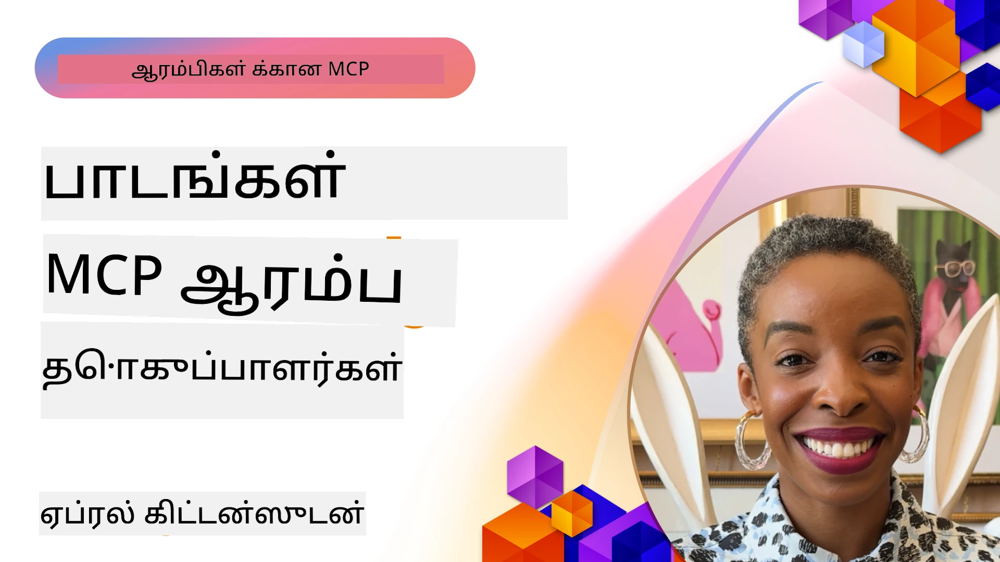

# 🌟 முன்னோடி முன்னேற்றங்களிலிருந்து பாடங்கள்

[](https://youtu.be/jds7dSmNptE)

_(இந்த பாடத்தின் வீடியோவைப் பார்க்க மேலே உள்ள படத்தை கிளிக் செய்யவும்)_

## 🎯 இந்த பகுதியில் என்ன உள்ளது

இந்த பகுதி உண்மையான நிறுவனங்களும் டெவலப்பர்களும் Model Context Protocol (MCP) யைப் பயன்படுத்தி எவ்வாறு உண்மையான சவால்களைத் தீர்க்கவும், புதுமையை ஊக்குவிக்கவும் செய்து கொண்டிருக்கிறார்கள் என்பதை ஆராய்கிறது. விரிவான வழக்கறிஞர் ஆய்வுகள், செயல்திறன் திட்டங்கள் மற்றும் பயிற்சி உதாரணங்கள் மூலம், நீங்கள் MCP எப்படி பாதுகாப்பான, அளவிடக்கூடிய AI ஒருங்கிணைப்பை ஏற்படுத்தி மொழி மாதிரிகள், கருவிகள் மற்றும் நிறுவன தரவை இணைக்க உதவுகிறது என்பதைக் கண்டுபிடிப்பீர்கள்.

### 📚 MCP செயல்பாட்டில் பார்க்க

இந்தக் கொள்கைகள் தயாரிப்புக்கு தயார் கருவிகளில் பயன்படுத்தப்படுவதை காண விரும்புகிறீர்களா? நமது [**10 Microsoft MCP சேவைகள் டெவலப்பர் செயல்திறனை மாற்றி அமைக்கின்றன**](microsoft-mcp-servers.md) என்பதை பாருங்கள்; இவை நீங்கள் இன்று பயன்படுத்தக்கூடிய உண்மையான Microsoft MCP சேவைகளை காட்டுகின்றன.

## காட்சி

இந்த பாடம் முன் பயன்படுத்தி வந்தவர்கள் Model Context Protocol (MCP) யைப் பயன்படுத்தி உண்மையான உலக சவால்களை எவ்வாறு தீர்க்கின்றனர் மற்றும் தொழிற்துறைகள் முழுவதும் புதுமையை எவ்வாறு முன்னெடுக்கின்றனர் என்பதைக் கற்றுக்கொள்ளச் செய்கிறது. விரிவான வழக்கறிஞர் ஆய்வுகள் மற்றும் செயல்திறனில் கைகொள்வதன் மூலம், MCP இணையற்ற, பாதுகாப்பான, அளவிடக்கூடிய AI ஒருங்கிணைப்பை எவ்வாறு செயல் படுத்துகிறது என்பதைப் பார்வையிடுவீர்கள் — பெரிய மொழி மாதிரிகள், கருவிகள் மற்றும் நிறுவனத் தரவுகளை ஒற்றை கட்டமைப்பில் இணைக்கிறது. MCP அடிப்படையுடைய தீர்வுகளை வடிவமைத்து உருவாக்குவதில் நீங்கள் நடைப்பயிற்சியை பெறுவீர்கள், நிரூபிக்கப்பட்ட நடைமுறை உதாரணங்களிலிருந்து கற்றுக்கொள்வீர்கள், மற்றும் உற்பத்தி சூழலில் MCP ஐ உருவாக்க சிறந்த நடைமுறைகளை ஆராய்வீர்கள். பாடம் தோன்றும் போக்கு, எதிர்கால திசைகள் மற்றும் திறந்த மூல வளங்கள் போன்றவற்றையும் வலியுறுத்துகிறது, இதனால் நீங்கள் MCP தொழில்நுட்பத்திலும் அதன் வளரும் சூழலிலும் முன்னிலை வகிக்க உதவும்.

## கற்றல் நோக்கங்கள்

- பல தொழிற்துறைகளில் உள்ள உண்மையான MCP செயலாக்கங்களை பகுப்பாய்வு செய்வது
- முழுமையான MCP அடிப்படையிலான பயன்பாடுகளை வடிவமைத்து உருவாக்குதல்
- MCP தொழில்நுட்பத்தில் தோன்றும் போக்குகள் மற்றும் எதிர்கால திசைகளை ஆராய்தல்
- உண்மையான மேம்பாட்டு சூழலில் சிறந்த நடைமுறைகளை பயன்படுத்து

## உண்மையான MCP செயலாக்கங்கள்

### வழக்கறிஞர் ஆய்வு 1: நிறுவன வாடிக்கை ஆதரவு தானியங்கி

ஒரு பன்முகக் கொள்ளை நிறுவனமானது, வாடிக்கை ஆதரவு அமைப்புகளுக்கு MCP அடிப்படையிலான தீர்வை நடைமுறைப்படுத்தி AI தொடர்புகளை ஒருங்கிணைத்தது. இது அவர்களுக்கு உதவியது:

- பல LLM சேவை வழங்குநர்களுக்கு ஒரே உட்பிரவேச முகப்பை உருவாக்க
- துறைகள் முழுவதும் ஒரே மாதிரியில் விருப்பப்படுத்தலை நிர்வகிக்க
- வலுவான பாதுகாப்பு மற்றும் ஒழுங்குபடுத்தல் கட்டுப்பாடுகளை நிறுவ
- தேவையானபடி வெவ்வேறு AI மாதிரிகளுக்கு எளிதில் மாறும் வகையில்

**தொழில்நுட்ப நடைமுறை:**

```python
# வாடிக்கையாளர் ஆதரவுக்கான Python MCP சேவையக செயலாக்கம்
import logging
import asyncio
from modelcontextprotocol import create_server, ServerConfig
from modelcontextprotocol.server import MCPServer
from modelcontextprotocol.transports import create_http_transport
from modelcontextprotocol.resources import ResourceDefinition
from modelcontextprotocol.prompts import PromptDefinition
from modelcontextprotocol.tool import ToolDefinition

# பதிவு செய்வதை அமைக்கவும்
logging.basicConfig(level=logging.INFO)

async def main():
    # சேவையக கட்டமைப்பை உருவாக்கவும்
    config = ServerConfig(
        name="Enterprise Customer Support Server",
        version="1.0.0",
        description="MCP server for handling customer support inquiries"
    )
    
    # MCP சேவையகத்தை ஆரம்பிக்கவும்
    server = create_server(config)
    
    # அறிவுத்தள வளங்களை பதிவு செய்யவும்
    server.resources.register(
        ResourceDefinition(
            name="customer_kb",
            description="Customer knowledge base documentation"
        ),
        lambda params: get_customer_documentation(params)
    )
    
    # முன்மொழிவு வடிவங்களை பதிவு செய்யவும்
    server.prompts.register(
        PromptDefinition(
            name="support_template",
            description="Templates for customer support responses"
        ),
        lambda params: get_support_templates(params)
    )
    
    # ஆதரவு கருவிகளை பதிவு செய்யவும்
    server.tools.register(
        ToolDefinition(
            name="ticketing",
            description="Create and update support tickets"
        ),
        handle_ticketing_operations
    )
    
    # HTTP கடத்தலுடன் சேவையகத்தை தொடங்கவும்
    transport = create_http_transport(port=8080)
    await server.run(transport)

if __name__ == "__main__":
    asyncio.run(main())
```
  
**விளைவுகள்:** மாதிரி செலவுகளில் 30% குறைப்பு, பதில் ஒருங்கிணைப்பு 45% மேம்பாடு மற்றும் உலகளாவிய செயல்பாடுகளில் மேம்பட்ட ஒழுங்குபடுத்தல்.

### வழக்கறிஞர் ஆய்வு 2: மருத்துவ التشخيص உதவி

ஒரு மருத்துவ சேவை வழங்குநர் பல சிறப்பு மருத்துவ AI மாதிரிகளையும் இணைக்கும் MCP அட்நதாகத்துடன் ஒரு அமைப்பை உருவாக்கினர் மேலும், நோயாளி தரவு பாதுகாப்பை உறுதிசெய்தனர்:

- பொதுவான மற்றும் சிறப்பு மருத்துவ மாதிரிகளுக்கு இடையே மென்மையான மாறுதல்  
- கடுமையான தனியுரிமைக் கட்டுப்பாடு மற்றும் ஆய்வரக்கடத்தல்கள்  
- நடப்புக் கொள்ளப்பட்ட மின்னணு மருத்துவ பதிவேற்ற அமைப்புகளுடன் ஒருங்கிணைப்பு  
- மருத்துவர்கான மருத்துவ 용어மைப்பு திருப்பக் கூட்டமைப்பு

**தொழில்நுட்ப நடைமுறை:**

```csharp
// C# MCP host application implementation in healthcare application
using Microsoft.Extensions.DependencyInjection;
using ModelContextProtocol.SDK.Client;
using ModelContextProtocol.SDK.Security;
using ModelContextProtocol.SDK.Resources;

public class DiagnosticAssistant
{
    private readonly MCPHostClient _mcpClient;
    private readonly PatientContext _patientContext;
    
    public DiagnosticAssistant(PatientContext patientContext)
    {
        _patientContext = patientContext;
        
        // Configure MCP client with healthcare-specific settings
        var clientOptions = new ClientOptions
        {
            Name = "Healthcare Diagnostic Assistant",
            Version = "1.0.0",
            Security = new SecurityOptions
            {
                Encryption = EncryptionLevel.Medical,
                AuditEnabled = true
            }
        };
        
        _mcpClient = new MCPHostClientBuilder()
            .WithOptions(clientOptions)
            .WithTransport(new HttpTransport("https://healthcare-mcp.example.org"))
            .WithAuthentication(new HIPAACompliantAuthProvider())
            .Build();
    }
    
    public async Task<DiagnosticSuggestion> GetDiagnosticAssistance(
        string symptoms, string patientHistory)
    {
        // Create request with appropriate resources and tool access
        var resourceRequest = new ResourceRequest
        {
            Name = "patient_records",
            Parameters = new Dictionary<string, object>
            {
                ["patientId"] = _patientContext.PatientId,
                ["requestingProvider"] = _patientContext.ProviderId
            }
        };
        
        // Request diagnostic assistance using appropriate prompt
        var response = await _mcpClient.SendPromptRequestAsync(
            promptName: "diagnostic_assistance",
            parameters: new Dictionary<string, object>
            {
                ["symptoms"] = symptoms,
                patientHistory = patientHistory,
                relevantGuidelines = _patientContext.GetRelevantGuidelines()
            });
            
        return DiagnosticSuggestion.FromMCPResponse(response);
    }
}
```
  
**விளைவுகள்:** மருத்துவ பரிந்துரைகளில் மேம்பாடு, முழு HIPAA ஒத்துழைப்பு, மற்றும் அமைப்புகளுக்கு இடையிலான மீண்டும் மாற்றத்தில் குறைவு.

### வழக்கறிஞர் ஆய்வு 3: நிதி சேவைகள் அபாயத் பகுப்பாய்வு

ஒரு நிதி நிறுவனம் MCP இனை பயன்படுத்தி துறைகள் முழுவதும் அபாயத் பகுப்பாய்வு செயல்முறைகளை ஒருங்கிணைத்து தரவரிசை செய்தது:

- கடன் அபாயம், மோசடி கண்டறிதல் மற்றும் முதலீட்டு அபாய மாதிரிகளுக்கு ஒருங்கிணைந்த முகப்பு  
- கடுமையான அணுகல் கட்டுப்பாடுகள் மற்றும் மாதிரி பதிப்பு மேலாண்மை  
- அனைத்து AI பரிந்துரைகளின் ஆய்வு சாத்தியமாய் அமைதல்  
- வேறுபட்ட அமைப்புகளில் தரவு வடிவமைப்பின் சீரான பராமரிப்பு

**தொழில்நுட்ப நடைமுறை:**

```java
// நிதி ஆபத்து மதிப்பீட்டிற்கு ஜாவா MCP சேவையகம்
import org.mcp.server.*;
import org.mcp.security.*;

public class FinancialRiskMCPServer {
    public static void main(String[] args) {
        // நிதி விதிமுறைகளை பின்பற்றும் அம்சங்களுடன் MCP சேவையகம் உருவாக்கவும்
        MCPServer server = new MCPServerBuilder()
            .withModelProviders(
                new ModelProvider("risk-assessment-primary", new AzureOpenAIProvider()),
                new ModelProvider("risk-assessment-audit", new LocalLlamaProvider())
            )
            .withPromptTemplateDirectory("./compliance/templates")
            .withAccessControls(new SOCCompliantAccessControl())
            .withDataEncryption(EncryptionStandard.FINANCIAL_GRADE)
            .withVersionControl(true)
            .withAuditLogging(new DatabaseAuditLogger())
            .build();
            
        server.addRequestValidator(new FinancialDataValidator());
        server.addResponseFilter(new PII_RedactionFilter());
        
        server.start(9000);
        
        System.out.println("Financial Risk MCP Server running on port 9000");
    }
}
```
  
**விளைவுகள்:** மேம்பட்ட ஒழுங்குப்பூர்வ ஒத்தியாக்கம், 40% வேகமான மாதிரி இடைநிலைகள், மற்றும் அபாய மதிப்பீடுகளின் ஒருங்கிணைந்த நிலைத்தன்மை.

### வழக்கறிஞர் ஆய்வு 4: Microsoft Playwright MCP சேவை - உலாவி தானியங்கி

Microsoft [Playwright MCP சேவையை](https://github.com/microsoft/playwright-mcp) உருவாக்கியது, Model Context Protocol மூலம் பாதுகாப்பான, ஒழுங்கமைக்கப்பட்ட உலாவி தானியங்கி செயல்பாடுகள் வழங்குவதற்காக. இந்த உற்பத்திக்கு தயார் சேவை AI முகவர்கள் மற்றும் LLM கள் வலை உலாவிகளை கட்டுப்பாட்டுடன், கண்காணிக்கக்கூடிய முறையில் தொடர்பு கொள்ள உதவுகிறது — தானாகும் வலை பரிசோதனை, தரவு எடுக்கும் மற்றும் முழுமையான வேலைப்பாடுகள் போன்ற பயன்பாடுகள் சாத்தியமாக்குகிறது.

> **🎯 உற்பத்திக்கு தயார் கருவி**  
> இக்கேஸ் ஸ்டடி நீங்கள் இன்று பயன்படுத்தக்கூடிய உண்மையான MCP சேவையை காட்டுகிறது! Playwright MCP சேவை பற்றி மற்றும் மற்ற 9 Microsoft MCP சேவைகள் பற்றி நமது [**Microsoft MCP சேவைகள் கையேடு**](microsoft-mcp-servers.md#8--playwright-mcp-server) இல் அறியவும்.

**முக்கிய அம்சங்கள்:**  
- உலாவி தானியங்கி திறன்களை (நெவிகேஷன், படிவ நிரப்புதல், திரைபட சேகரிப்பு போன்றவை) MCP கருவிகளாக வெளிப்படுத்துகிறது  
- அனுமதி இன்றி செயல்களை தடுக்கும் கடுமையான அணுகல் கட்டுப்பாடுகள் மற்றும் சாந்தைக்கான sandboxing  
- அனைத்து உலாவி தொடர்புகளுக்குமான விரிவான ஆய்வு பதிவுகளை வழங்குகிறது  
- Azure OpenAI மற்றும் பிற LLM வழங்குநர்களுடன் ஒருங்கிணைப்பு ஆதரவு  
- GitHub Copilot இன் Coding Agent இற்கு வலை உலாவி திறன்களை சக்தியூட்டுகிறது

**தொழில்நுட்ப நடைமுறை:**

```typescript
// TypeScript: MCP சேவையகத்தில் Playwright ப்ரௌசர் தானியக்க கருவிகளை பதிவு செய்தல்
import { createServer, ToolDefinition } from 'modelcontextprotocol';
import { launch } from 'playwright';

const server = createServer({
  name: 'Playwright MCP Server',
  version: '1.0.0',
  description: 'MCP server for browser automation using Playwright'
});

// URL க்கு செல்லவும் ஒரு திரைநகலைப் பிடிக்கவும் ஒரு கருவியை பதிவு செய்யவும்
server.tools.register(
  new ToolDefinition({
    name: 'navigate_and_screenshot',
    description: 'Navigate to a URL and capture a screenshot',
    parameters: {
      url: { type: 'string', description: 'The URL to visit' }
    }
  }),
  async ({ url }) => {
    const browser = await launch();
    const page = await browser.newPage();
    await page.goto(url);
    const screenshot = await page.screenshot();
    await browser.close();
    return { screenshot };
  }
);

// MCP சேவையகத்தை துவங்கு
server.listen(8080);
```
  
**விளைவுகள்:**

- AI முகவர்கள் மற்றும் LLM க்கான பாதுகாப்பான, நிரலாக்கப்பட்ட உலாவி தானியங்கியமை சேவை செயல்படுத்தல்  
- கையேடு பரிசோதனை மற்றும் வலை பயன்பாடுகளுக்கான பரிசோதனை பரப்பை மேம்படுத்தியது  
- நிறுவன சூழலில் உலாவி அடிப்படையிலான கருவி ஒருங்கிணைப்பிற்கான மீண்டும் பயன்பாட்டுக்கூடிய, விரிவுபடுத்தக்கூடிய கட்டமைப்பை வழங்கியது  
- GitHub Copilot இன் வலை உலாவி திறன்களை சக்தியூட்டுகிறது

**குறிப்புகள்:**

- [Playwright MCP சேவை GitHub களஞ்சியம்](https://github.com/microsoft/playwright-mcp)  
- [Microsoft AI மற்றும் தானியக்க தீர்வுகள்](https://azure.microsoft.com/en-us/products/ai-services/)

### வழக்கறிஞர் ஆய்வு 5: Azure MCP – நிறுவன தரநிலை Model Context Protocol சேவை

Azure MCP Server ([https://aka.ms/azmcp](https://aka.ms/azmcp)) என்பது Model Context Protocol ஐ அளவிடக்கூடிய, பாதுகாப்பான மற்றும் ஒழுங்குப்படுத்தப்பட்ட MCP சேவை திறன்களோடு மேற்பார்வை செய்தும், நிர்வகிப்பதும், நிறுவுவதுமான Microsoft இன் நிறுவனம் தரமான செயலாக்கம் ஆகும். Azure MCP நிறுவனங்களுக்கு MCP சேவைகளை Azure AI, தரவு மற்றும் பாதுகாப்பு சேவைகளுடன் விரைவில் நிர்வகித்து ஒருங்கிணைக்க உதவுகிறது, இயக்கச் செலவுகளை குறைக்கும் மற்றும் AI பயன்படுத்துவதை விரைவுபடுத்தும்.

> **🎯 உற்பத்திக்கு தயார் கருவி**  
> இது நீங்கள் இன்றே பயன்படுத்தக்கூடிய உண்மையான MCP சேவையாகும்! Azure AI Foundry MCP சேவை பற்றி நமது [**Microsoft MCP சேவைகள் கையேடு**](microsoft-mcp-servers.md) இல் அறியவும்.

- முழுமையாக நிர்வகிக்கப்படும் MCP சேவை காளனம் அளவிடுதல், கண்காணிப்பு மற்றும் பாதுகாப்புடன்  
- Azure OpenAI, Azure AI Search மற்றும் பிற Azure சேவைகளுடன் மூல ஒருங்கிணைப்பு  
- Microsoft Entra ID மூலம் நிறுவன அங்கீகாரம் மற்றும் அனுமதி  
- தனிப்பயன் கருவிகள், விருப்பப்பட்டிகள் மற்றும் வள இணைப்பாளிகளுக்கு ஆதரவு  
- நிறுவன பாதுகாப்பு மற்றும் ஒழுங்குப்படுத்துதல் தேவைகளுக்கு ஒத்துழைப்பு

**தொழில்நுட்ப நடைமுறை:**

```yaml
# Example: Azure MCP server deployment configuration (YAML)
apiVersion: mcp.microsoft.com/v1
kind: McpServer
metadata:
  name: enterprise-mcp-server
spec:
  modelProviders:
    - name: azure-openai
      type: AzureOpenAI
      endpoint: https://<your-openai-resource>.openai.azure.com/
      apiKeySecret: <your-azure-keyvault-secret>
  tools:
    - name: document_search
      type: AzureAISearch
      endpoint: https://<your-search-resource>.search.windows.net/
      apiKeySecret: <your-azure-keyvault-secret>
  authentication:
    type: EntraID
    tenantId: <your-tenant-id>
  monitoring:
    enabled: true
    logAnalyticsWorkspace: <your-log-analytics-id>
```
  
**விளைவுகள்:**  
- நிறுவனர் AI திட்டங்களுக்கு பயன்படுத்தத் தயார், ஒழுங்குபடுத்தப்பட்ட MCP சேவை தளத்தை அளித்து மதிப்பை குறைத்தது  
- LLM களும், கருவிகளும், நிறுவன தரவுமுனைகளும் ஒருங்கிணைத்தல் எளிதாக்கப்பட்டது  
- MCP பணிச் சறுகைகளுக்கான பாதுகாப்பு, கண்ணோட்டம் மற்றும் செயல்திறனை மேம்படுத்தியது  
- Azure SDK சிறந்த நடைமுறைகள் மற்றும் தற்போது ஏற்ற அனுமதி மாதிரிகளுடன் குறியீடின் தரத்தை மேம்படுத்தியது

**குறிப்புகள்:**  
- [Azure MCP ஆவணம்](https://aka.ms/azmcp)  
- [Azure MCP சேவை GitHub களஞ்சியம்](https://github.com/Azure/azure-mcp)  
- [Azure AI சேவைகள்](https://azure.microsoft.com/en-us/products/ai-services/)  
- [Microsoft MCP மையம்](https://mcp.azure.com)

## வழக்கறிஞர் ஆய்வு 6: NLWeb  
MCP (Model Context Protocol) என்பது பொதுவான மொழியில் வலைத்தளங்களை கேள்வி செய்ய மற்றும் கருவிகளுடன் ஏஜென்ட்கள் தொடர்பு கொள்ள Chatbots மற்றும் AI உதவியாளர்களுக்கான தோன்றும் ஒரு நெறிமுறை ஆகும். ஒவ்வொரு NLWeb உதாரணமும் MCP சேவையாகும், இது முதன்மையான "ask" முறையை ஆதரிக்கிறது, இது பக்கத்திற்கு இயல்பான மொழியில் கேள்வி கேட்க பயன்படுத்தப்படுகிறது. திருப்பி வழங்கப்படும் பதில் schema.org என்ற பரவலாக பயன்படுத்தப்படும் வலை தரவைக் குறிக்கும் சொற்களைக் கொண்டுள்ளது. பொது ஆய்வாக, MCP என்பது NLWeb Http மற்றும் HTML உடன் தொடர்புடையது. NLWeb நெறிமுறைகள், Schema.org வடிவங்கள் மற்றும் மாதிரிக் குறியீடுகளை இணைத்து, தளங்களை விரைவில் இக்கட்டமைப்புகளை உருவாக்க தேவையானதாகும், இதனால் மனிதர்களுக்கு உரையாடல் இடைமுகம் மற்றும் இயந்திரங்களுக்கு இயல்பான முகவர் இடைமுகம் கிடைக்கும்.

NLWebக்கான இரண்டு வெவ்வேறு கூறுகள் உள்ளன:  
- அவ்வளவு எளிமையான நெறிமுறை, இயல்பான மொழியில் தளத்துடன் தொடர்பு கொள்ள json மற்றும் schema.org சரிபார்பு பதில்களுடன். மேலதிக விவரங்களுக்கு REST API ஆவணத்தை பார்க்கவும்.  
- (1) ஐ எளிமையான செயல்படுத்தல், பொருட்களைப் பட்டியல்களாக (தயாரிப்புகள், சமையல் முறைகள், சுற்றுலா இடங்கள், விமர்சனங்கள் முதலியவை) கோரியது மற்றும் பயனர் இடைமுகக் கருவிகளுடன் சேர்த்து உரையாடல் இடைமுகங்களை தளங்களுக்குக் கொடுக்கவும் உதவுகிறது. Life of a chat query ஆவணத்தில் மேலதிக விவரங்கள் உள்ளன.

**குறிப்புகள்:**  
- [Azure MCP ஆவணம்](https://aka.ms/azmcp)  
- [NLWeb](https://github.com/microsoft/NlWeb)

### வழக்கறிஞர் ஆய்வு 7: Azure AI Foundry MCP சேவை – நிறுவன AI முகவர் ஒருங்கிணைப்பு

Azure AI Foundry MCP சேவைகள் MCP ஐ எவ்வாறு அமைவை மற்றும் முகவர் வேலைப்பாடுகளை நிறுவும் சூழல்களில் ஒருங்கிணைக்க பயன்படுத்துவது என்பதை வெளிப்படுத்துகிறது. MCP ஐ Azure AI Foundry உடன் ஒருங்கிணைத்து, நிறுவனங்கள் முகவர் தொடர்புகளை ஒருங்கிணைக்க, Foundry இன் வேலை மேலாண்மையை பயன்படுத்த, மற்றும் பாதுகாப்பான மற்றும் அளவிடக்கூடிய இடுகையில் உறுதிசெய்ய முடியும்.

> **🎯 உற்பத்திக்கு தயார் கருவி**  
> இது நீங்கள் இன்றே பயன்படுத்தக்கூடிய உண்மையான MCP சேவையாகும்! Azure AI Foundry MCP சேவை பற்றி நமது [**Microsoft MCP சேவைகள் கையேடு**](microsoft-mcp-servers.md#9--azure-ai-foundry-mcp-server) இல் அறியவும்.

**முக்கிய அம்சங்கள்:**  
- Azure இன் AI சூழலுக்கு விரிவான அணுகல், மாதிரி பட்டியல்கள் மற்றும் இடுகை மேலாண்மை உட்பட  
- RAG பயன்பாடுகளுக்கான Azure AI Search உடன் அறிவுசார் வகையீடு  
- AI மாதிரி செயல்திறன் மற்றும் தர உறுதிப்படுத்தலுக்கான மதிப்பீடு கருவிகள்  
- Azure AI Foundry பட்டியல் மற்றும் ஆய்வகங்களுடன் ஒருங்கிணைப்பு புதிய ஆய்வுக் மாதிரிகளுக்காக  
- உற்பத்தி சூழல்களுக்கு முகவர் மேலாண்மை மற்றும் மதிப்பீடு திறன்கள்

**விளைவுகள்:**  
- AI முகவர் வேலைப்பாடுகளை விரைவில் வடிவமைத்து வலுவான கண்காணிப்பு  
- Azure AI சேவைகளுடன் தடையில்லாத ஒருங்கிணைப்பு  
- முகவர் குழாய்களை கட்டமைக்க, நிறுவ மற்றும் கண்காணிக்க ஒருங்கிணைந்த முகப்பு  
- நிறுவனங்களுக்கு பாதுகாப்பு, ஒத்துழைப்பு மற்றும் செயல்திறன் மேம்பாடு  
- சிக்கலான முகவர் இயக்கங்களை கட்டுப்பாட்டுடன் AI எண்ணிக்கை விரைவாக்கம்

**குறிப்புகள்:**  
- [Azure AI Foundry MCP சேவை GitHub களஞ்சியம்](https://github.com/azure-ai-foundry/mcp-foundry)  
- [Azure AI முகவர்களை MCP உடன் ஒருங்கிணைத்தல் (Microsoft Foundry ப்ளாக்)](https://devblogs.microsoft.com/foundry/integrating-azure-ai-agents-mcp/)

### வழக்கறிஞர் ஆய்வு 8: Foundry MCP விளையாட்டுத் தளம் – பரிசோதனை மற்றும் முன்மாதிரிகை

Foundry MCP விளையாட்டுத் தளம் MCP சேவைகள் மற்றும் Azure AI Foundry ஒருங்கிணைப்புகளை பரிசோதனை செய்யத் தயார் சூழலை வழங்குகிறது. டெவலப்பர்கள் விரைவில் முன்மாதிரி தயாரித்து, சோதனை செய்து, Azure AI Foundry பட்டியல் மற்றும் ஆய்வக வளங்களை பயன்படுத்தி AI மாதிரிகள் மற்றும் முகவர் வேலைப்பாடுகளை மதிப்பீடு செய்ய முடியும். இந்த விளையாட்டுத் தளம் அமைப்பை எளிதாக்கி உதாரண திட்டங்களை வழங்குகிறது மற்றும் இணைந்து மேம்பாட்டு ஆதரவை வழங்குகிறது; இந்த முறையில் சிறந்த நடைமுறைகள் மற்றும் புதிய சூழல்களை குறைந்த செலவோடு ஆராய்வது எளிதாகிறது. குழுக்களுக்கு யோசனைகளை சரிபார்க்கவும், பரிசோதனைகளை பகிரவும் மற்றும் பயிற்சியை விரைவுபடுத்தவும் இது மிகவும் பயனுள்ளதாகும். தடைகளை குறைத்துக் கொள்வதன் மூலம், இந்த விளையாட்டுத் தளம் MCP மற்றும் Azure AI Foundry சூழலில் புதுமையும் சமூக பங்களிப்புக்களையும் ஊக்குவிக்கிறது.

**குறிப்புகள்:**

- [Foundry MCP விளையாட்டுத் தளம் GitHub களஞ்சியம்](https://github.com/azure-ai-foundry/foundry-mcp-playground)

### வழக்கறிஞர் ஆய்வு 9: Microsoft Learn Docs MCP சேவை – AI அதிகாரப்பூர்வ ஆவணம் அணுகல்

Microsoft Learn Docs MCP சேவை ஒரு மேகத்தில் நடத்தப்படும் சேவை ஆகும், இது Model Context Protocol மூலம் AI உதவியாளர்களுக்கு Microsoft அதிகாரப்பூர்வ ஆவணங்களுக்கு நேரடி அணுகலை வழங்குகிறது. இந்த உற்பத்தி-தயார் சேவை Microsoft Learn சூழலை இணைத்து அனைத்து அதிகாரப்பூர்வ Microsoft ஆதாரங்களின் கருத்துப்பிரிவு தேடலை இயல்பாக்குகிறது.

> **🎯 உற்பத்திக்கு தயார் கருவி**  
> இது நீங்கள் இன்றே பயன்படுத்தக்கூடிய உண்மையான MCP சேவையாகும்! Microsoft Learn Docs MCP சேவை பற்றி நமது [**Microsoft MCP சேவைகள் கையேடு**](microsoft-mcp-servers.md#1--microsoft-learn-docs-mcp-server) இல் அறியவும்.

**முக்கிய அம்சங்கள்:**  
- அதிகாரப்பூர்வ Microsoft ஆவணங்கள், Azure ஆவணங்கள் மற்றும் Microsoft 365 ஆவணங்களுக்கு நேரடி அணுகல்  
- சூழல் மற்றும் நோக்கத்தை புரிந்துகொள்ளும் முன்முனைவு கருத்துப்பிரிவு தேடல் திறன்கள்  
- Microsoft Learn உள்ளடக்கம் வெளியாடும் போது எப்போதும் புதுப்பிக்கப்படும் தகவல்  
- Microsoft Learn, Azure ஆவணங்கள் மற்றும் Microsoft 365 ஆதாரங்களை முழுமையாக பரிசுப்படுத்தல்  
- கட்டுரைத்தலைப்புகளும் URL களும் உட்பட, 10 உயர்தர உள்ளடக்க துண்டுக்களை வழங்குகிறது

**எதனால் இது அவசியம்:**  
- Microsoft தொழில்நுட்பங்களுக்கு தொடர்பான "பழைய AI அறிவு" பிரச்சனை ஒன்றையும் தீர்க்கிறது  
- AI உதவியாளர்கள் புதிய .NET, C#, Azure மற்றும் Microsoft 365 அம்சங்களை அணுகக் கூடியவாறு செய்கிறது  
- துல்லியமான குறியீடு உருவாக்க அதிகாரப்பூர்வ முதன்மை தகவலை வழங்குகிறது  
- விரைவாக மாறும் Microsoft தொழில்நுட்பங்களைப் பொருந்திய டெவலப்பர்களுக்கு அவசியம்

**விளைவுகள்:**  
- Microsoft தொழில்நுட்பங்களுக்கு AI உருவாக்கிய குறியீடு துல்லியமாக மேம்பட்டது  
- தற்போதைய ஆவணங்களும் சிறந்த நடைமுறைகளையும் தேடும் நேரம் குறைந்தது  
- சூழல் உணர்ந்த ஆவண மீட்டுரையை கொண்டு டெவலப்பர் செயல்திறன் உயர்வு  
- IDE விட்டு வெளியேறாமலேயே மேம்பாட்டு பணிகளுடன் சேர்ந்த ஒருங்கிணைப்பு

**குறிப்புகள்:**  
- [Microsoft Learn Docs MCP சேவை GitHub களஞ்சியம்](https://github.com/MicrosoftDocs/mcp)  
- [Microsoft Learn ஆவணங்கள்](https://learn.microsoft.com/)

## கைகலா திட்டங்கள்

### திட்டம் 1: பல வழங்குநர்களுக்கான MCP சேவை உருவாக்குதல்

**நோக்கம்:** குறிப்பிட்ட அளவுருக்களுக்கு அடிப்படையாக AI மாதிரி வழங்குநர்களின் பலருக்கும் கோரிக்கைகளை வழிநடத்தக்கூடிய MCP சேவையை உருவாக்குதல்.

**தேவைகள்:**

- குறைந்தது மூன்று விதமான மாதிரி வழங்குநர்களுக்கு ஆதரவு (எ.கா., OpenAI, Anthropic, உள்ளூர் மாதிரிகள்)  
- கோரிக்கை மெட்டா தரவு அடிப்படையிலான வழி காணும் இயந்திரம் செயல்படுத்தல்  
- வழங்குநர் அங்கீகார தகவல்களை நிர்வகிக்கும் கட்டமைப்பை உருவாக்கல்  
- செயல்திறன் மற்றும் செலவைக் கையாள கाचிங் சேர்க்கல்  
- பயன்பாட்டை கண்காணிக்க எளிய டாஷ்போர்டை உருவாக்கல்

**நடைமுறை படிகள்:**

1. MCP சேவை அடித்தளம் அமைத்தல்  
2. ஒவ்வொரு AI மாதிரி சேவைக்கும் வழங்குநர் இணைப்புக் கருவிகளை உருவாக்குதல்  
3. கோரிக்கை பண்புகளின் அடிப்படையில் வழி காணும் லாஜிக் உருவாக்குதல்  
4. அடிக்கடி வரும் கோரிக்கைகளுக்கான காட்சிங் செயல்படுத்துதல்  
5. கண்காணிப்பு டாஷ்போர்டை உருவாக்குதல்  
6. வெவ்வேறு கோரிக்கை வடிவங்களில் சோதனை செய்தல்

**தொழில்நுட்பங்கள்:** Python (.NET/Java/Python உங்களது விருப்பത്തിനു ஏற்ப), Redis காட்சிங், மற்றும் எளிய வலை வடிவமைப்பு டாஷ்போர்டு.

### திட்டம் 2: நிறுவன விருப்ப இயக்குதல் அமைப்பு
**உறுப்புமுறை:** ஒரு நிறுவத்திலேயே கருத்துப்பாட்டு வடிவங்களை நிர்வகிக்க, பதிப்புகளை உருவாக்க மற்றும் வழங்க MCP அடிப்படையிலான ஒரு அமைப்பை உருவாக்குதல்.

**தேவைகள்:**

- கருத்துப்பாட்டு வடிவங்களுக்கு மையமாக்கப்பட்ட சேமிப்பகம் உருவாக்குதல்
- பதிப்பு மற்றும் அனுமதி பணிகளை செயல்படுத்துதல்
- மாதிரி உள்ளீடுகளுடன் வடிவ சோதனை திறன்களை உருவாக்குதல்
- வேடமுறை அடிப்படையிலான அணுகல் கட்டுப்பாடுகள் உருவாக்குதல்
- வடிவங்களை பெற்றுக் கொள்ளவும் வழங்கவும் API உருவாக்குதல்

**வினைத்தடிகள்:**

1. வடிவ சேமிப்புக்கான தரவுத்தளம் வடிவமைத்தல்
2. வடிவ CRUD செயல்பாடுகளுக்கான முக்கிய API உருவாக்குதல்
3. பதிப்பு அமைப்பை செயல்படுத்துதல்
4. அனுமதி பணியைக் கட்டமைக்குதல்
5. சோதனை தொழில்நுட்பத்தை உருவாக்குதல்
6. மேலாண்மைக்கு எளிய வலை இடைமுகம் உருவாக்குதல்
7. MCP சர்வருடன் ஒட்டுதல்

**தொழில்நுட்பங்கள்:** உங்கள் தேர்வான பின்புல வடிவமைப்பு, SQL அல்லது NoSQL தரவுத்தளம் மற்றும் மேலாண்மை இடைமுகத்திற்கான முன்னணி கருவிகள்.

### திட்டம் 3: MCP அடிப்படையிலான உள்ளடக்க உருவாக்கத் தளம்

**உறுப்புமுறை:** வெவ்வேறு உள்ளடக்க வகைகளுக்குள் ஒருமைப்பாட்டுடன் கிளைகள் வழங்க MCP-ஐ பயன்படுத்தி உள்ளடக்க உருவாக்க தளத்தை கட்டமைத்தல்.

**தேவைகள்:**

- பல உள்ளடக்க வடிவமைப்புகளுக்கு ஆதரவு (பொருத்துக்களை, சமூக ஊடகம், சந்தை விளம்பரங்கள்)
- உள்ளடக்கத்தை தளவமைப்பை பயன்படுத்தி தனிப்பயனாக்க விருப்பங்களுடன் உருவாக்குதல்
- உள்ளடக்க மதிப்பாய்வு மற்றும் கருத்து திரட்டி அமைப்பு
- உள்ளடக்க செயல்திறன் அளவுகோல்கள் கண்காணிப்பு
- உள்ளடக்க பதிப்பு மற்றும் மீள்திருத்த ஆதரவு

**வினைத்தடிகள்:**

1. MCP கிளையன்ட் அடித்தளம் அமைத்தல்
2. பல உள்ளடக்க வகைகளுக்கான வடிவங்களை உருவாக்குதல்
3. உள்ளடக்க உருவாக்க வரிசையை கட்டமைத்தல்
4. மதிப்பாய்வு அமைப்பை செயல்படுத்துதல்
5. செயல்திறன் கண்காணிப்பு அமைப்பை உருவாக்குதல்
6. வடிவ மேலாண்மை மற்றும் உள்ளடக்க உருவாக்க இடைமுகம் உருவாக்குதல்

**தொழில்நுட்பங்கள்:** உங்கள் விருப்பமான நிரலாக்க மொழி, வலை வடிவமைப்பு, மற்றும் தரவுத்தளம் அமைப்பு.

## MCP தொழில்நுட்பத்திற்கான எதிர்கால திசைகள்

### வளர்ந்து வரும் போக்குகள்

1. **பல முறைமைகள் MCP**
   - படங்கள், ஒலி, மற்றும் வீடியோ மாதிரிகளுடன் MCP தொடர்புகளை 표준மிடுதல் விரிவு
   - அக்கரைவழி எண்ணுப்பார்வை திறன்கள் வளர்ச்சி
   - வெவ்வேறு முறைமைகளுக்கான நிலையான அறிவுறுத்தல்கள் வடிவங்கள்

2. **ஒற்றுமைப்படைந்த MCP அடித்தளம்**
   - நிறுவனங்களுக்கு இடையேயும் வளங்களை பகிரும் சீரிய MCP வலைப்பின்னல்கள்
   - பாதுகாப்பான மாதிரி பகிர்வதற்கான நிலையான நெறிமுறைகள்
   - தனியுரிமை பாதுகாக்கும் கணக்கிடல் தொழில்நுட்பங்கள்

3. **MCP சந்தைகள்**
   - MCP வடிவங்கள் மற்றும் பிளக்கின்களை பகிரவும் வருமானம் பெறவும் சூழல்கள்
   - தர நிரூபண மற்றும் சான்று செயல்முறைகள்
   - மாதிரி சந்தைகளுடன் இணைத்தல்

4. **ஏய்ட் கணினியுக்கான MCP**
   - வளமற்ற நுட்பங்களை கொண்ட வெளி சாதனங்களுக்கு MCP தரநிலைகளை மாற்றல்
   - குறைவான பரப்பளவு சூழலுக்கான சிறந்த நெறிமுறைகள்
   - IoT சூழல்களுக்கு சிறப்பு MCP அமல்பாடுகள்

5. **வரி கட்டுப்பாட்டு அமைப்புகள்**
   - விதிமுறைக்கு ஏற்ப MCP நீடிப்புகளை உருவாக்கல்
   - நிலையான கணக்கோட்ட முகவரிகள் மற்றும் விளக்கமளிக்கும் இடைமுகங்கள்
   - வளர்தல் எதிர்கொள்ளும் AI ஆட்சி கட்டமைப்புகளுடன் இணைத்தல்

### Microsoft வழங்கும் MCP தீர்வுகள்

Microsoft மற்றும் Azure பல திறமையான திறந்த மூல சேமிப்பகங்களை உருவாக்கி, MCP-ஐ பல சூழல்களில் செயல்படுத்த சுலபமாக்கியுள்ளன:

#### Microsoft அமைப்பு

1. [playwright-mcp](https://github.com/microsoft/playwright-mcp) - உலாவி தானாக இயக்கவும் சோதனையிடவும் பயன்படும் Playwright MCP சர்வர்
2. [files-mcp-server](https://github.com/microsoft/files-mcp-server) - உள்ளூர் சோதனை மற்றும் சமூகவாழ்வு பங்களிப்பிற்கு OneDrive MCP சர்வர் செயலாக்கம்
3. [NLWeb](https://github.com/microsoft/NlWeb) - திறந்த நெறிமுறைகள் மற்றும் கருவிகள் தொகுப்பு; AI வலைக்கு அடித்தளத்தை கட்டமைப்பது முக்கிய குறிக்கோள்

#### Azure-Samples அமைப்பு

1. [mcp](https://github.com/Azure-Samples/mcp) - Azure-ல் பல மொழிகள் கொண்டு MCP சர்வர்கள் கட்டமைக்க மற்றும் இணைக்க உதவும் மாதிரிகள், கருவிகள், வளங்கள் இணைப்புகள்
2. [mcp-auth-servers](https://github.com/Azure-Samples/mcp-auth-servers) - தற்போதைய Model Context Protocol விவரிப்புடன் அங்கீகாரம் காட்டு MCP சர்வர் மாதிரிகள்
3. [remote-mcp-functions](https://github.com/Azure-Samples/remote-mcp-functions) - Azure Functions இல் தொலை MCP சர்வர் செயலாக்கங்களுக்கான முகப்பு பக்கம் மற்றும் மொழி-சார்ந்த சேமிப்பக இணைப்புகள்
4. [remote-mcp-functions-python](https://github.com/Azure-Samples/remote-mcp-functions-python) - Python கொண்டு Azure Functions பயன்படுத்தி தனிப்பயன் தொலை MCP சர்வர்களை உருவாக்கக் மற்றும் வழங்கக் கூடிய விரைவு துவக்க மாதிரி
5. [remote-mcp-functions-dotnet](https://github.com/Azure-Samples/remote-mcp-functions-dotnet) - .NET/C# கொண்டு Azure Functions கொண்டு தனிப்பயன் தொலை MCP சர்வர்கள் உருவாக்க விரைவு துவக்க மாதிரி
6. [remote-mcp-functions-typescript](https://github.com/Azure-Samples/remote-mcp-functions-typescript) - TypeScript கொண்டு Azure Functions கொண்டு தனிப்பயன் தொலை MCP சர்வர்கள் உருவாக்க விரைவு துவக்க மாதிரி
7. [remote-mcp-apim-functions-python](https://github.com/Azure-Samples/remote-mcp-apim-functions-python) - Python கொண்டு Azure API மேலாண்மையை AI வாயிலாக MCP தொலை சர்வர்களுடன் இணைத்தல்
8. [AI-Gateway](https://github.com/Azure-Samples/AI-Gateway) - APIM மற்றும் AI பரிசோதனைகள் MCP திறன்களுடன், Azure OpenAI மற்றும் AI Foundry-வை இணைக்கும்

இவை Microsoft Model Context Protocol-க்கு பல நிரலாக்க மொழிகள் மற்றும் Azure சேவைகளுடன் வேலை செய்யும் செயலாக்கங்களின், மாதிரிகள் மற்றும் வளங்களின் சேகரிப்பு. அத்துடன் அடிப்படையிலான சர்வர் செயலாக்கங்களிலிருந்து அங்கீகாரம், மேகத்தில் வழங்கல் மற்றும் நிறுவன ஒருங்கிணைப்பு பயன்பாடுகளுக்கு உதவும்.

#### MCP வளங்களின் கோப்புறை

அதிகாரப்பூர்வ Microsoft MCP சேமிப்பகத்தில் உள்ள [MCP Resources directory](https://github.com/microsoft/mcp/tree/main/Resources) என்பதைப் பயன்படுத்தி, Model Context Protocol சர்வர்களுடன் வேலை செய்ய தேவையான மாதிரி வளங்கள், கருத்துப்பாட்டு வடிவங்கள் மற்றும் கருவி வரையறைகள் வழங்கப்படுகின்றன. இது விரைவாக MCP-இல் துவக்க உதவுவதற்கான மீண்டும் பயன்படுத்தக்கூடிய கட்டமைப்புகள் மற்றும் சிறந்த நடைமுறை உதாரணங்கள் கொண்டுள்ளது:

- **கருத்துப்பாட்டு வடிவங்கள்:** பொதுவான AI பணிகளுக்கும் சூழல்களுக்கும் அதிரடியான கருத்துப்பாட்டு வடிவங்கள், உங்கள் MCP சர்வர் செயல்களுக்காக விரைவில் சரி பண்ணக்கூடியவை.
- **கருவி வரையறைகள்:** கருவி ஒருங்கிணைப்பு மற்றும் அழைப்புக்கு மாதிரியாக விளக்கம் மற்றும் உரையாடல் தரவு.
- **வளம் மாதிரிகள்:** MCP கட்டமைப்பில் தரவுவளம், API மற்றும் வெளிப்புற சேவைகளை இணைக்கும் மாதிரிகள்.
- **குறிப்புச்சான்று செயலாக்கங்கள்:** MCP திட்டங்களில் வளங்கள், கருத்துப்பாடுகள், கருவிகள் எப்படி ஒழுங்குபடுத்தப்பட வேண்டும் என்பதனை காட்டும் நடைமுறை மாதிரிகள்.

இந்த வளங்கள் மேம்பாட்டை விரைவுப்படுத்தி, நிலைத்தன்மைக்கு ஊக்குவிப்பதுடன் MCP அடிப்படையிலான தீர்வுகளை கட்டமைத்து வழங்க சிறந்த நடைமுறைகளை உறுதிப்படுத்த உதவுகின்றன.

#### MCP வளங்களின் கோப்புறை

- [MCP Resources (Sample Prompts, Tools, and Resource Definitions)](https://github.com/microsoft/mcp/tree/main/Resources)

### ஆராய்ச்சி வாய்ப்புகள்

- MCP கட்டமைப்புகளில் திறமையான கருத்துப்பாட்டு மேம்பாடு
- பல வாடிக்கையாளர்களுக்கான MCP பாதுகாப்பு மாதிரிகள்
- வெவ்வேறு MCP செயலாக்கங்களின் செயல்திறன் மதிப்பீடு
- MCP சர்வர்களுக்கான படிப்பறிதல் பரிசோதனை முறைகள்

## முடிவு

Model Context Protocol (MCP) என்பது தொழில்துறைகளுக்கு இடையே ஒரே மாதிரியான, பாதுகாப்பான மற்றும் ஒருங்கிணைக்கக்கூடிய AI ஒருங்கிணைப்பை விரைவாக வடிவமைக்கும் முக்கிய கருவியாக மாறி வருகிறது. இந்த பாடத்தில் உள்ள வழக்கு ஆய்வுகள் மற்றும் நடைமுறை திட்டங்கள் மூலம், Microsoft மற்றும் Azure போன்ற முன்னோடிகள் MCP-ஐ எவ்வாறு பயன்படுத்தி நிஜ உலக சவால்களை தீர்க்கின்றனர், AI விருத்தியை வேகப்படுத்துகின்றனர், மற்றும் கட்டுப்பாடு, பாதுகாப்பு மற்றும் அளவுகோல் உறுதி செய்கின்றனர் என்பதை அறிந்திருக்கின்றீர்கள். MCP-வின் தொகுகை நோக்கு பெரிய மொழி மாதிரிகள், கருவிகள் மற்றும் நிறுவன தரவுகளை ஒருங்கிணைக்கின்றது, ஒரு ஒருங்கிணைந்த மற்றும் கண்காணிக்கக்கூடிய கட்டமைப்பில். MCP தொடர்ந்து மேம்படும் போது, சமூகவுடன் தொடர்பில் இருத்தல், திறந்த முறை வளங்களை ஆராய்தல், சிறந்த நடைமுறைகளை பின்பற்றுதல் வலுவான, எதிர்காலத்துக்கான AI தீர்வுகளை உருவாக்க முக்கிய விடயமாக இருக்கும்.

## கூடுதல் வளங்கள்

- [MCP Foundry GitHub Repository](https://github.com/azure-ai-foundry/mcp-foundry)
- [Foundry MCP Playground](https://github.com/azure-ai-foundry/foundry-mcp-playground)
- [Integrating Azure AI Agents with MCP (Microsoft Foundry Blog)](https://devblogs.microsoft.com/foundry/integrating-azure-ai-agents-mcp/)
- [MCP GitHub Repository (Microsoft)](https://github.com/microsoft/mcp)
- [MCP Resources Directory (Sample Prompts, Tools, and Resource Definitions)](https://github.com/microsoft/mcp/tree/main/Resources)
- [MCP Community & Documentation](https://modelcontextprotocol.io/introduction)
- [MCP Specification (2025-11-25)](https://spec.modelcontextprotocol.io/specification/2025-11-25/)
- [Azure MCP Documentation](https://aka.ms/azmcp)
- [OWASP MCP Top 10](https://microsoft.github.io/mcp-azure-security-guide/mcp/) - பாதுகாப்பு சிறந்த நடைமுறைகள்
- [Playwright MCP Server GitHub Repository](https://github.com/microsoft/playwright-mcp)
- [Files MCP Server (OneDrive)](https://github.com/microsoft/files-mcp-server)
- [Azure-Samples MCP](https://github.com/Azure-Samples/mcp)
- [MCP Auth Servers (Azure-Samples)](https://github.com/Azure-Samples/mcp-auth-servers)
- [Remote MCP Functions (Azure-Samples)](https://github.com/Azure-Samples/remote-mcp-functions)
- [Remote MCP Functions Python (Azure-Samples)](https://github.com/Azure-Samples/remote-mcp-functions-python)
- [Remote MCP Functions .NET (Azure-Samples)](https://github.com/Azure-Samples/remote-mcp-functions-dotnet)
- [Remote MCP Functions TypeScript (Azure-Samples)](https://github.com/Azure-Samples/remote-mcp-functions-typescript)
- [Remote MCP APIM Functions Python (Azure-Samples)](https://github.com/Azure-Samples/remote-mcp-apim-functions-python)
- [AI-Gateway (Azure-Samples)](https://github.com/Azure-Samples/AI-Gateway)
- [Microsoft AI and Automation Solutions](https://azure.microsoft.com/en-us/products/ai-services/)

## பயிற்சிகள்

1. வழக்கு ஆய்வுகளில் ஒன்றை பகுப்பாய்வு செய்து மாறுபட்ட செயல்படுத்தல் முறையை முன்மொழியவும்.
2. ஒரு திட்டக் குறிக்கோளை தேர்ந்தெடுத்து விரிவான தொழில்நுட்ப குறிப்பை உருவாக்கவும்.
3. வழக்கு ஆய்வுகளில் இல்லாத ஒரு தொழிற்துறையை ஆராய்ந்து MCP எப்படி அதற்குரிய சவால்களை தீர்க்கும் என்பதை வரைபடமாக தயாரிக்கவும்.
4. எதிர்கால திசைகளில் ஒன்றை ஆராய்ந்து அதற்கான புதிய MCP நீட்டிப்புக்கான கருத்தை உருவாக்கவும்.

## அடுத்து என்ன

மேலும் அறிய: [Microsoft MCP Servers](./microsoft-mcp-servers.md)

தொடரவும்: [Module 8: Best Practices](../08-BestPractices/README.md)

---

<!-- CO-OP TRANSLATOR DISCLAIMER START -->
**எச்சரிக்கை**:  
இந்த ஆவணம் AI மொழிபெயர்ப்பு சேவையான [Co-op Translator](https://github.com/Azure/co-op-translator) இன் மூலம் மொழிபெயர்க்கப்பட்டுள்ளது. நாங்கள் துல்லியத்திற்காக முயற்சி செய்கிறோம் என்றாலும், தானியங்கி மொழிபெயர்ப்புகளில் பிழைகள் அல்லது தவறுகள் இருக்கலாம் என்பதை கவனத்தில் கொள்ளுங்கள். தகுந்த மொழியில் உள்ள அசல் ஆவணம் அங்கீகாரம் பெறும் மூலமாகக் கருதப்பட வேண்டும். முக்கியமான தகவல்களுக்கு, தொழில்முறை மனித மொழிபெயர்ப்பை பரிந்துரைக்கின்றோம். இந்த மொழிபெயர்ப்பின் பயன்பாட்டின் காரணமாக ஏற்படக்கூடிய எந்த தவறுதல்களுக்காகவோ தவறான புரிதல்களுக்கு நாங்கள் பொறுப்பு ஏற்க மாட்டோம்.
<!-- CO-OP TRANSLATOR DISCLAIMER END -->