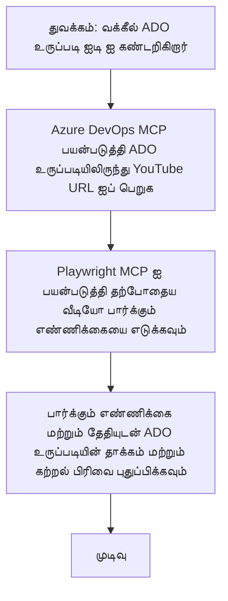

# வழக்கு ஆய்வு: YouTube தரவிலிருந்து MCP உடன் Azure DevOps பொருட்களைப் புதுப்பித்தல்

> **எச்சரிக்கை:** YouTube போன்ற தளங்களிலிருந்து தரவுகளைப் பெற்று Azure DevOps பொருட்களைத் தானியங்கி முறையில் புதுப்பிக்கக்கூடிய ஏராளமான ஆன்லைன் கருவிகள் மற்றும் அறிக்கைகள் ஏற்கனவே உள்ளன. பின்வரும் சூழ்நிலை MCP கருவிகள் தானியக்கமாக மற்றும் ஒருங்கிணைப்பு பணிகளில் எவ்வாறு பயன்படுத்தப்படலாம் என்பதைக் காட்ட ஒரு மாதிரி பயன்பாட்டாக வழங்கப்பட்டுள்ளது.

## மேம்பார்வை

இந்த வழக்கு ஆய்வு Model Context Protocol (MCP) மற்றும் அதன் கருவிகள் Azure DevOps (ADO) பணியாளர்கள், YouTube போன்ற ஆன்லைன் தளங்களிலிருந்து பெறப்பட்ட தகவல்களுடன் தானியங்கி முறையில் புதுப்பிக்க எவ்வாறு பயன்படுகின்றன என்பதன் ஒரு உதாரணத்தை காட்டுகிறது. விவரிக்கப்பட்ட சூழ்நிலை இந்த கருவிகளின் பரந்த திறன்களின் ஒரு மாதிரியாகும், மேலும் இதை பல இணையான தானியக்க தேவைகளுக்கு மாற்றிக்கொள்ளலாம்.

இந்த உதாரணத்தில், ஒரு ஆதரவாளர் ADO பொருட்களைப் பயன்படுத்தி ஆன்லைன் அமர்வுகளை கண்காணிக்கிறார், ஒவ்வொரு பொருளும் ஒரு YouTube வீடியோ URL ஐ கொண்டுள்ளது. MCP கருவிகளை பயன்படுத்தி, ஆதரவாளர் ADO பொருட்களை தற்போது கிடைக்கும் வீடியோ அளவுகோல்கள், போலி பார்வை எண்ணிக்கை போன்றவற்றுடன் திரும்ப வாக்கியமாகவும் தானியங்கி முறையிலும் புதுப்பிக்க முடியும். இந்த அணுகுமுறை ஆன்லைன் மூலத் தகவல்களை ADO அல்லது பிற அமைப்புகளில் ஒருங்கிணைக்க தேவையான பிற பயன்பாடுகளுக்கும் பொதுவாக்கப்படலாம்.

## சூழ்நிலை

ஒரு ஆதரவாளர் ஆன்லைன் அமர்வுகள் மற்றும் சமூக ஈடுபாடுகளின் தாக்கத்தை கண்காணிப்பதற்குப் பொறுப்பாளராக இருப்பார். ஒவ்வொரு அமர்வும் 'DevRel' திட்டத்தில் ADO பணிப் பொருளாக பதிவு செய்யப்படுகிறது, பணிப் பொருள் YouTube வீடியோ URL க்கான புலத்தை கொண்டுள்ளது. அமர்வின் பரவலான தாக்கத்தை துல்லியமாக அறிக்கையிட ஆதரவாளர் அந்த ADO பொருளை தற்போது இருக்கும் வீடியோ பார்வை எண்ணிக்கை மற்றும் இந்த தகவல் எப்போது பெறப்பட்டது என்ற தேதியுடன் புதுப்பிக்க வேண்டும்.

## பயன்படும் கருவிகள்

- [Azure DevOps MCP](https://github.com/microsoft/azure-devops-mcp): MCP மூலம் ADO பணிப் பொருட்களில் நிரல்முறை அணுகலையும் புதுப்பிப்புகளையும் கூடுதலாக்குகிறது.
- [Playwright MCP](https://github.com/microsoft/playwright-mcp): YouTube வீடியோ புள்ளிவிவரங்கள் போன்ற இணையப் பக்கங்களில் தற்சமயம் தரவுகளை எடுத்துக்கொள்ள உலாவியிலான நடவடிக்கைகளை தானியக்கமாக செய்கிறது.

## படி படி பணிவழி

1. **ADO பொருளை அடையாளம் காண்க**: 'DevRel' திட்டத்தில் உள்ள ADO பணிப் பொருள் ஐடி (எ.கா., 1234) கொண்டு தொடங்கவும்.
2. **YouTube URL ஐ பெறுக**: Azure DevOps MCP கருவியைப் பயன்படுத்தி பணிப் பொருள் ஆயிலிருந்து YouTube URL ஐப் பெறுக.
3. **வீடியோ பார்வைகளைக் காண்க**: Playwright MCP கருவியைப் பயன்படுத்தி YouTube URL க்கு செல்லவும் மற்றும் தற்போது உள்ள பார்வை எண்ணிக்கையை எடுக்கவும்.
4. **ADO பொருளை புதுப்பிக்கவும்**: Azure DevOps MCP கருவி மூலம் 'Impact and Learnings' பிரிவில் நவீனமான பார்வை எண்ணிக்கை மற்றும் பெறப்பட்ட தேதியை எழுதவும்.

## உதாரண ஊக்குரை

```bash
- Work with the ADO Item ID: 1234
- The project is '2025-Awesome'
- Get the YouTube URL for the ADO item
- Use Playwright to get the current views from the YouTube video
- Update the ADO item with the current video views and the updated date of the information
```

## Mermaid Flowchart


## தொழில்நுட்ப நடைமுறை

- **MCP ஒருங்கிணைவு**: Azure DevOps MCP மற்றும் Playwright MCP கருவிகளின் பயன்பாட்டை ஒருங்கிணைக்கும் MCP சேவையகம் இந்த பணிவழியை ஒழுங்குபடுத்துகிறது.
- **தானியக்கம்**: பணிவழியை கையால் தூண்டலாம் அல்லது தேவையான இடைவெளிகளில் இயங்கச் செய்ய திட்டமிடலாம், இதனால் ADO பொருட்கள் சமீபத்திய நிலையில் இருக்கும்.
- **பரிந்துரை**: ஒரே மாதிரியை அனுகுமுறைப் படி மாற்றி, ADO பொருட்களை பிற ஆன்லைன் அளவுகோல்கள் (எ.கா., பிடிகள், கருத்துக்கள்) அல்லது பிற தளங்களிலிருந்து பெறப்பட்ட தகவல்களுடன் புதுப்பிக்கவும் முடியும்.

## பெறுபேறுகள் மற்றும் தாக்கம்

- **திறன்**: ஆதரவாளர்களின் கையால் செய்யும் முயற்சியை வீடியோ அளவுகோல்களை பெற்று புதுப்பிப்பதைக் கூட்டித் தானியக்கமாகக் குறைக்கிறது.
- **துல்லியம்**: ADO பொருட்கள் ஆன்லைன் மூலங்களிலிருந்து கிடைக்கும் மிகவும் சமீபத்திய தரவை பிரதிபலிக்க உறுதி செய்கிறது.
- **மீண்டும் பயன்படுத்தக்கூடிய தன்மை**: பிற தரவுத் தளங்கள் அல்லது அளவுகோல்கள் தொடர்பான இணையான சூழ்நிலைகளுக்கு மீண்டும் பயன்படுத்தக்கூடிய பணிவழியை வழங்குகிறது.

## குறிப்பு

- [Azure DevOps MCP](https://github.com/microsoft/azure-devops-mcp)
- [Playwright MCP](https://github.com/microsoft/playwright-mcp)
- [Model Context Protocol (MCP)](https://modelcontextprotocol.io/)

## அடுத்தது என்ன

- இதற்கு முந்தியவர்: [Case Studies Overview](./README.md)
- அடுத்தது: [Real-Time Documentation Retrieval with MCP](./docs-mcp/README.md)

---

<!-- CO-OP TRANSLATOR DISCLAIMER START -->
**கட்டுப்பாடு**:
இந்த ஆவணம் AI மொழிபெயர்ப்பு சேவை [Co-op Translator](https://github.com/Azure/co-op-translator) பயன்படுத்தி மொழிபெயர்க்கப்பட்டுள்ளது. நாம் துல்லியத்திற்காக முயற்சித்தாலும், தானாக செய்யப்பட்ட மொழிபெயர்ப்புகளில் பிழைகள் அல்லது தவறுகள் இருக்கலாம் என்பதை தயவுசெய்து கவனிக்கவும். உள்ளூர் மொழியில் உள்ள ஆரம்ப ஆவணம் அதிகாரப்பூர்வ மூலமாக கருதப்பட வேண்டும். தேவையான முக்கியமான தகவல்களுக்கு, தொழில்முறை மனித மொழிபெயர்ப்பு பரிந்துரைக்கப்படுகிறது. இந்த மொழிபெயர்ப்பின் பயன்படுத்தலால் ஏற்படும் எந்தவொரு தவறான புரிதலுக்கும் அல்லது தவறான விளக்கத்திற்கும் நாங்கள் பொறுப்புக் கொள்ளம фарடுக்கின்றோம்.
<!-- CO-OP TRANSLATOR DISCLAIMER END -->