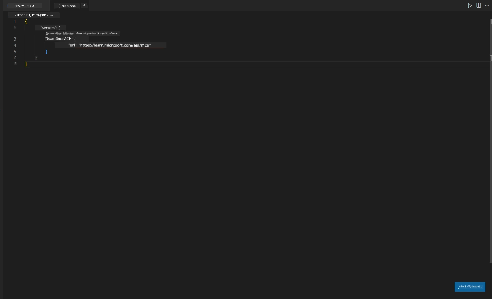
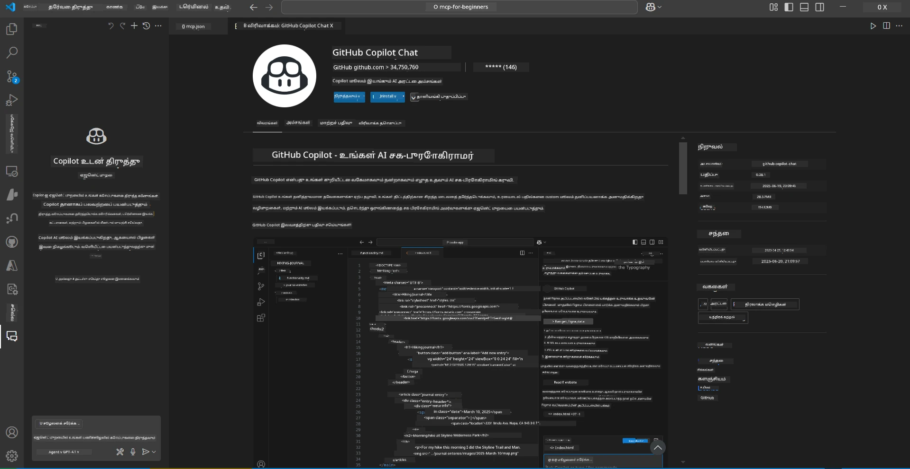
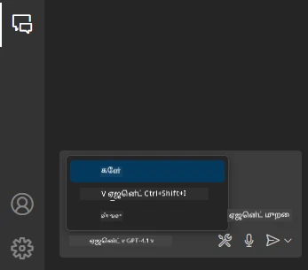
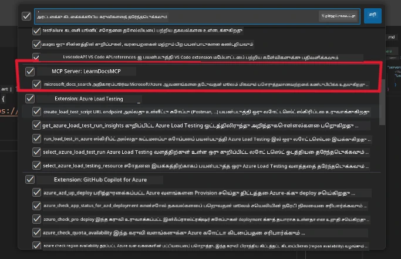
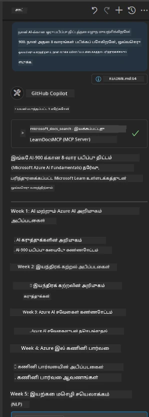

# நிலை 3: VS Code-இல் MCP சர்வருடன் உள்ள ஆசிரியர் ஆவணங்கள்

## கண்ணோட்டம்

இந்த நிலையில், Microsoft Learn ஆவணங்களை MCP சர்வரைப் பயன்படுத்தி நேரடியாக உங்கள் Visual Studio Code சூழலில் கொண்டு வருவது எப்படி என்பதை நீங்கள் கற்றுக்கொள்வீர்கள். ஆவணங்களைத் தேடுவதற்காக உலாவி தாவல்கள் இடையே தொடர்ந்து மாறுவதற்கு பதிலாக, நீங்கள் உங்கள் ஆசிரியர் சூழலிலேயே அதிகாரப்பூர்வ ஆவணங்களை அணுக, தேட மற்றும் மேற்கோள் கொடுக்கலாம். இந்த அணுகுமுறை உங்கள் பணிச்சூழலை எளிமையாக்கி, உங்களை கவனமாக வைத்துக்கொண்டு, GitHub Copilot போன்ற கருவிகளுடன் ஒருங்கிணைப்பை எளிதாக்குகிறது.

- உங்கள் குறியீட்டு சூழலை விட்டு வெளியேறாமல் VS Code-இல் ஆவணங்களை தேடவும் படிக்கவும்.
- README அல்லது பாடநெறி கோப்புகளில் ஆவணங்களை மேற்கோள் கொடுத்து இணைப்புகளை நேரடியாக சேர்க்கவும்.
- GitHub Copilot மற்றும் MCP-ஐ ஒருங்கிணைத்து AI-ஆதாரமான ஆவண பணிச்சூழலை எளிதாக்கவும்.

## கற்றல் நோக்கங்கள்

இந்த அத்தியாயத்தின் முடிவில், MCP சர்வரை VS Code-இல் அமைத்து பயன்படுத்துவது எப்படி என்பதை நீங்கள் புரிந்துகொள்வீர்கள், இது உங்கள் ஆவண மற்றும் மேம்பாட்டு பணிச்சூழலை மேம்படுத்த உதவும். நீங்கள்:

- MCP சர்வரை ஆவண தேடலுக்காக பயன்படுத்த உங்கள் பணிச்சூழலை அமைக்கவும்.
- VS Code-இல் இருந்து நேரடியாக ஆவணங்களை தேடவும் சேர்க்கவும்.
- GitHub Copilot மற்றும் MCP-ஐ இணைத்து AI-ஆதாரமான, உற்பத்தி திறன் அதிகரித்த பணிச்சூழலை உருவாக்கவும்.

இந்த திறன்கள் உங்களை கவனமாக வைத்துக்கொண்டு, ஆவண தரத்தை மேம்படுத்தி, ஒரு மேம்பாட்டாளர் அல்லது தொழில்நுட்ப எழுத்தாளராக உற்பத்தி திறனை அதிகரிக்க உதவும்.

## தீர்வு

உள்ள ஆசிரியர் ஆவண அணுகலை அடைய, MCP சர்வரை VS Code மற்றும் GitHub Copilot உடன் ஒருங்கிணைக்கும் ஒரு தொடர் நடவடிக்கைகளை நீங்கள் பின்பற்றுவீர்கள். இந்த தீர்வு பாட ஆசிரியர்கள், ஆவண எழுத்தாளர்கள் மற்றும் ஆவணங்களுடன் Copilot-ஐ பயன்படுத்தி ஆசிரியர் சூழலில் கவனம் செலுத்த விரும்பும் மேம்பாட்டாளர்களுக்கு சிறந்தது.

- ஒரு README-க்கு மேற்கோள் இணைப்புகளை விரைவாக சேர்க்கவும், ஒரு பாடநெறி அல்லது திட்ட ஆவணங்களை எழுதும் போது.
- Copilot-ஐ பயன்படுத்தி குறியீட்டை உருவாக்கவும், MCP-ஐ உடனடியாக தொடர்புடைய ஆவணங்களை கண்டறிந்து மேற்கோள் கொடுக்கவும்.
- உங்கள் ஆசிரியர் சூழலில் கவனம் செலுத்தி உற்பத்தி திறனை அதிகரிக்கவும்.

### படிப்படியாக வழிகாட்டுதல்

தொடங்க, இந்த படிகளை பின்பற்றவும். ஒவ்வொரு படத்திற்கும், செயல்முறையை காட்சிப்படுத்த ஒரு ஸ்கிரீன்ஷாட்டை assets கோப்பகத்திலிருந்து சேர்க்கலாம்.

1. **MCP அமைப்பைச் சேர்க்கவும்:**
   உங்கள் திட்டத்தின் மூலத்தில் `.vscode/mcp.json` கோப்பை உருவாக்கி, பின்வரும் அமைப்பைச் சேர்க்கவும்:
   ```json
   {
     "servers": {
       "LearnDocsMCP": {
         "url": "https://learn.microsoft.com/api/mcp"
       }
     }
   }
   ```
   இந்த அமைப்பு [`Microsoft Learn Docs MCP server`](https://github.com/MicrosoftDocs/mcp) உடன் இணைக்க VS Code-ஐ எப்படி அமைக்க வேண்டும் என்பதை தெரிவிக்கிறது.
   
   
    
2. **GitHub Copilot Chat குழு தாளைத் திறக்கவும்:**
   GitHub Copilot நீட்டிப்பு நிறுவப்படவில்லை என்றால், VS Code-இல் Extensions பார்வைக்கு சென்று அதை நிறுவவும். [Visual Studio Code Marketplace](https://marketplace.visualstudio.com/items?itemName=GitHub.copilot-chat) மூலம் நேரடியாக பதிவிறக்கலாம். பின்னர், Copilot Chat குழு தாளை பக்கப்பட்டியில் இருந்து திறக்கவும்.

   

3. **Agent mode-ஐ இயக்கி கருவிகளை சரிபார்க்கவும்:**
   Copilot Chat குழு தாளில் agent mode-ஐ இயக்கவும்.

   

   Agent mode-ஐ இயக்கிய பிறகு, MCP சர்வர் கிடைக்கக்கூடிய கருவிகளில் ஒன்றாக பட்டியலிடப்பட்டுள்ளதா என்பதை சரிபார்க்கவும். இது Copilot agent ஆவண சர்வரை அணுகி தொடர்புடைய தகவல்களை பெற உதவுகிறது என்பதை உறுதிப்படுத்துகிறது.
   
   
4. **புதிய உரையாடலைத் தொடங்கி agent-ஐ கேள்வி கேட்கவும்:**
   Copilot Chat குழு தாளில் புதிய உரையாடலைத் தொடங்கவும். இப்போது உங்கள் ஆவண கேள்விகளுடன் agent-ஐ கேட்கலாம். MCP சர்வரை பயன்படுத்தி agent Microsoft Learn ஆவணங்களை நேரடியாக உங்கள் ஆசிரியர் சூழலில் காட்சிப்படுத்தும்.

   - *"நான் X தலைப்புக்கான ஒரு படிப்பு திட்டத்தை எழுத முயற்சிக்கிறேன். நான் அதை 8 வாரங்களுக்கு படிக்கப் போகிறேன், ஒவ்வொரு வாரத்திற்கும், நான் எவ்வகையான உள்ளடக்கத்தை எடுத்துக்கொள்ள வேண்டும் என்று பரிந்துரைக்கவும்."*

   

5. **நேரடி கேள்வி:**

   > Azure AI Foundry Discord-இல் [#get-help](https://discord.gg/D6cRhjHWSC) பிரிவிலிருந்து ஒரு நேரடி கேள்வியை எடுத்துக்கொள்வோம் ([அசல் செய்தியைப் பார்க்கவும்](https://discord.com/channels/1113626258182504448/1385498306720829572)):
   
   *"Azure AI Foundry-ல் உருவாக்கப்பட்ட AI agent-களைப் பயன்படுத்தி ஒரு பல-agent தீர்வை எப்படி பிரயோகிக்க வேண்டும் என்பதைப் பற்றி நான் பதில்களைத் தேடுகிறேன். Copilot Studio சேனல்கள் போன்ற நேரடி பிரயோக முறை இல்லை என்று நான் பார்க்கிறேன். எனவே, நிறுவன பயனர்கள் தொடர்பு கொண்டு வேலை முடிக்க இந்த பிரயோகத்தை செய்ய பல்வேறு வழிகள் என்ன?
Azure Bot சேவை இந்த வேலை செய்ய உதவ முடியும் என்று கூறும் பல கட்டுரைகள்/வலைப்பதிவுகள் உள்ளன, இது MS Teams மற்றும் Azure AI Foundry Agents இடையே ஒரு பாலமாக செயல்பட முடியும், சரி, Azure AI Foundry-ல் Orchestrator Agent-ஐ Azure function மூலம் இணைக்கும் Azure bot-ஐ அமைத்தால் இது வேலை செய்யுமா அல்லது Bot framework-இல் orchestration செய்ய பல-agent தீர்வின் ஒரு பகுதியாக உள்ள ஒவ்வொரு AI agent-க்கும் Azure function உருவாக்க வேண்டும்? ஏதேனும் பிற பரிந்துரைகள் வரவேற்கப்படுகின்றன.
"*

   

   Agent தொடர்புடைய ஆவண இணைப்புகள் மற்றும் சுருக்கங்களை பதிலளிக்கும், இதை நீங்கள் நேரடியாக உங்கள் markdown கோப்புகளில் சேர்க்கலாம் அல்லது உங்கள் குறியீட்டில் மேற்கோள்களாக பயன்படுத்தலாம்.
   
### மாதிரி கேள்விகள்

இங்கே சில மாதிரி கேள்விகள் உள்ளன. MCP சர்வர் மற்றும் Copilot VS Code-ஐ விட்டு வெளியேறாமல் உடனடி, சூழல்-அறிந்த ஆவணங்கள் மற்றும் மேற்கோள்களை வழங்க எப்படி ஒருங்கிணைக்க முடியும் என்பதை இவை விளக்கும்:

- "Azure Functions triggers-ஐ எப்படி பயன்படுத்துவது என்பதை காட்டவும்."
- "Azure Key Vault-க்கு அதிகாரப்பூர்வ ஆவணத்திற்கான இணைப்பைச் சேர்க்கவும்."
- "Azure வளங்களை பாதுகாப்பதற்கான சிறந்த நடைமுறைகள் என்ன?"
- "Azure AI சேவைகளுக்கான ஒரு quickstart கண்டுபிடிக்கவும்."

இந்த கேள்விகள் MCP சர்வர் மற்றும் Copilot VS Code-ஐ விட்டு வெளியேறாமல் உடனடி, சூழல்-அறிந்த ஆவணங்கள் மற்றும் மேற்கோள்களை வழங்க எப்படி ஒருங்கிணைக்க முடியும் என்பதை விளக்கும்.

---

---

**குறிப்பு**:  
இந்த ஆவணம் [Co-op Translator](https://github.com/Azure/co-op-translator) என்ற AI மொழிபெயர்ப்பு சேவையை பயன்படுத்தி மொழிபெயர்க்கப்பட்டுள்ளது. எங்கள் நோக்கம் துல்லியமாக இருக்க வேண்டும் என்பதுதான், ஆனால் தானியங்கி மொழிபெயர்ப்புகளில் பிழைகள் அல்லது துல்லியமின்மைகள் இருக்கக்கூடும் என்பதை தயவுசெய்து கவனத்தில் கொள்ளவும். அதன் தாய்மொழியில் உள்ள மூல ஆவணம் அதிகாரப்பூர்வ ஆதாரமாக கருதப்பட வேண்டும். முக்கியமான தகவல்களுக்கு, தொழில்முறை மனித மொழிபெயர்ப்பு பரிந்துரைக்கப்படுகிறது. இந்த மொழிபெயர்ப்பைப் பயன்படுத்துவதால் ஏற்படும் எந்த தவறான புரிதல்கள் அல்லது தவறான விளக்கங்களுக்கு நாங்கள் பொறுப்பல்ல.