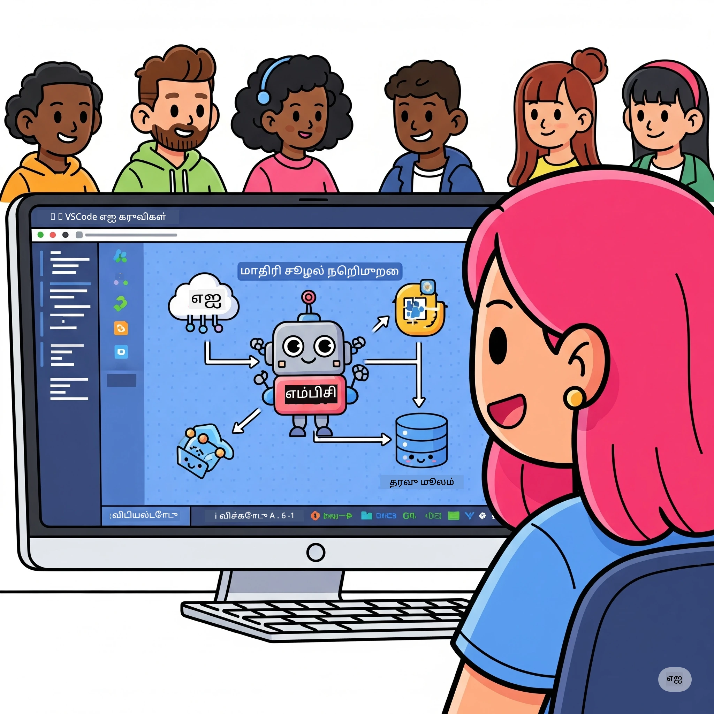
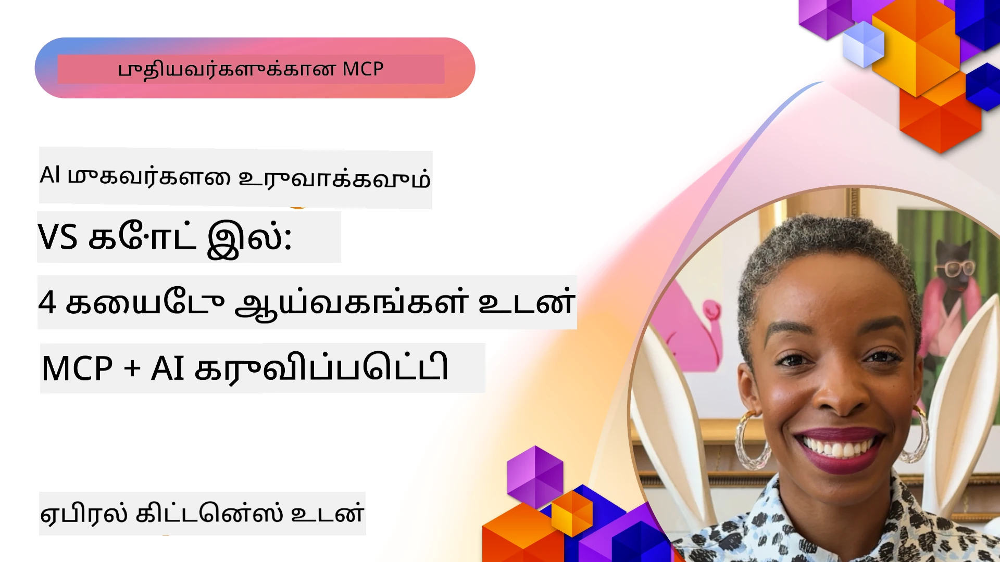

# எய்மெயிலி வேலை காட்சிகளை எளிதாக்கல்: AI கருவிச் சிலையைப் பயன்படுத்தி MCP சேவையகம் உருவாக்குதல்

## 🎯 கண்ணோட்டம்

_(இந்த பாடத்திட்ட வீடியோவைப் பார்க்க மேலே உள்ள படத்தை கிளிக் செய்யவும்)_

**மாடல் கான்டெக்ஸ் புரோட்டோக்கோல் (MCP) பணிமனையில்** உங்களை வரவேற்கிறோம்! இந்த விரிவான கைத்தொழில்நுட்ப பணிமனை இரண்டு முன்னணி தொழில்நுட்பங்களை ஒருங்கிணைத்து AI பயன்பாட்டு மேம்பாட்டை மாற்றுகிறது:

- **🔗 மாடல் கான்டெக்ஸ் புரோட்டோக்கோல் (MCP)**: சீரான AI-கருவி ஒருங்கிணைப்புக்கான திறந்த தரநிலை
- **🛠️ Visual Studio Codeக்கான AI கருவிச் சிலை (AITK)**: மைக்ரோசாஃப்டின் சக்திவாய்ந்த AI மேம்பாட்டு நீட்டிப்பு

### 🎓 நீங்கள் கற்கப்போகும் விஷயங்கள்

இந்த பணிமனை முடிந்தவுடன், AI மாதிரிகள் மற்றும் உண்மையான கருவிகளுக்கும் சேவைகளுக்கும் இடையேயான குறுக்கு தொடர்புகளை உருவாக்கி, புத்திசாலி பயன்பாடுகளை உருவாக்கும் கலை பற்றி முழுமையாக அறிந்து கொள்வீர்கள். தானியங்கி பரிசோதனையிலிருந்து தனிப்பயன் API ஒருங்கிணைப்புகளுக்கு, கடுமையான வணிக சவால்களை தீர்க்க உங்களுக்கு நடைமுறை திறன்கள் கிடைக்கும்.

## 🏗️ தொழில்நுட்ப தொகுதி

### 🔌 மாடல் கான்டெக்ஸ் புரோட்டோக்கோல் (MCP)

MCP என்பது **"USB-C போன்றது"** - AI மாதிரிகளை வெளி கருவிகள் மற்றும் தரவுத் தளங்களுடன் இணைக்கும் ஒரு உலகளாவிய தரநிலை.

**✨ முக்கிய அம்சங்கள்:**

- 🔄 **சீரமைக்கப்பட்ட ஒருங்கிணைப்பு**: AI-கருவி இணைப்புகளுக்கான உலகளாவிய இடைமுகம்
- 🏛️ **விருப்பமான கட்டமைப்பு**: stdio/SSE போக்குவரத்துக்கான உள்ளூர் மற்றும் தொலை நிலை சேவையகங்கள்
- 🧰 **பண்பட்டச் சுற்றுச்சூழல்**: கருவிகள், ஊக்கவசதிகள் மற்றும் வளங்கள் ஒரேயொரு புரோட்டோக்கோலில்
- 🔒 **நிறுவனத்திற்கு பொருத்தமானது**: உட்புகுந்த பாதுகாப்பு மற்றும் நம்பகத்தன்மை

**🎯 MCP ஏன் முக்கியம்:**
USB-C கேபிள் குழப்பத்தை நீக்கியது போல, MCP AI ஒருங்கிணைப்புகளின் ஜட்டையை நீக்குகிறது. ஒரே புரோட்டோக்கோல், முடிவில்லா சாத்தியங்கள்.

### 🤖 Visual Studio Codeக்கான AI கருவிச் சிலை (AITK)

மைக்ரோசாஃப்டின் முன்னணி AI மேம்பாட்டு நீட்டிப்பு, VS Codeஐ AI சக்திமிகு மேடை ஆக்கும்.

**🚀 மைய திறன்கள்:**

- 📦 **மாதிரி பட்டியல்**: Azure AI, GitHub, Hugging Face, Ollama மாதிரிகளை அணுகல்
- ⚡ **உள்ளூர் முன்னறிதல்**: ONNX ஊக்கமிட்ட CPU/GPU/NPU செயலாக்கம்
- 🏗️ **ఏஜென்ட் கட்டமைப்பாளர்**: MCP ஒருங்கிணைப்புடன் காணொளி AI ஏஜென்ட் மேம்பாடு
- 🎭 **பலவகை வடிவமைப்பு**: உரை, பார்வை மற்றும் கட்டமைக்கப்பட்ட வெளியீடு ஆதரவு

**💡 மேம்பாட்டு நன்மைகள்:**

- சூட் உள்ளமைவின்றி மாதிரி பரப்பல்
- காட்சி ஊக்கவசதி பொறியியல்
- நேரடி பரிசோதனை மைதானம்
- இலக்குமில்லா MCP சேவையகம் ஒருங்கிணைப்பு

## 📚 கற்றல் பயணம்

### [🚀 மாடல் 1: AI கருவிச் சிலை அடிப்படைகள்](./lab1/README.md)

**காலம்**: 15 நிமிடங்கள்

- 🛠️ VS Codeக்கான AI கருவிச் சிலை நிறுவல் மற்றும் கட்டமைத்தல்
- 🗂️ மாதிரி பட்டியலை ஆராய்தல் (GitHub, ONNX, OpenAI, Anthropic, Google இல் இருந்து 100+ மாதிரிகள்)
- 🎮 நேரடி மாதிரி சோதனைக்கான இயற்று மைதானத்தை கையாளுதல்
- 🤖 உங்கள் முதலாம் AI ஏஜெண்டை Agent Builder மூலம் உருவாக்குதல்
- 📊 உள்ளமைக்கப்பட்ட அளவுகோல்கள் மூலம் மாதிரி செயல்திறனை மதிப்பீடு செய்தல் (F1, தொடர்பு, ஒத்திசைவு, ஒத்திசைவு)
- ⚡ தொகுப்பு செயலாக்கம் மற்றும் பல வடிவ ஆதரவை கற்றல்

**🎯 கற்றி வரும் முடிவு**: AITK திறன்களை முழுமையாகப் புரிந்து கொண்ட புதுமையான AI ஏஜெண்டை உருவாக்குதல்

### [🌐 மாடல் 2: MCP மற்றும் AI கருவிச் சிலை அடிப்படைகள்](./lab2/README.md)

**காலம்**: 20 நிமிடங்கள்

- 🧠 மாடல் கான்டெக்ஸ் புரோட்டோக்கோல் (MCP) கட்டமைப்பு மற்றும் கருத்துக்களை ஆற்றல் பெறுதல்
- 🌐 மைக்ரோசாஃப்ட் MCP சேவையகம் சுற்றுச்சூழலை ஆராய்தல்
- 🤖 Playwright MCP சேவையகத்தைப் பயன்படுத்தி உலாவிக் கட்டுப்பாட்டுக்கான ஏஜெண்ட் உருவாக்குதல்
- 🔧 MCP சேவையகங்களை AI கருவிச் சிலை Agent Builder உடன் ஒருங்கிணைத்தல்
- 📊 உங்கள் ஏஜெண்டுகளில் MCP கருவிகளை கட்டமைத்து சோதனை செய்தல்
- 🚀 MCP சக்தி வாய்ந்த ஏஜெண்ட்களை உள்ளீடு செய்து உற்பத்திக்கு பயன்படுத்தல்

**🎯 கற்று வரும் முடிவு**: MCP மூலமாக வெளி கருவிகளுடன் சக்திவாய்ந்த AI ஏஜெண்டை உருவாக்கி பயன்பாட்டிற்கு கொண்டு வருதல்

### [🔧 மாடல் 3: AI கருவிச் சிலையுடன் உயர்ந்த MCP மேம்பாடு](./lab3/README.md)

**காலம்**: 20 நிமிடங்கள்

- 💻 AI கருவிச் சிலை உதவியுடன் தனிப்பயன் MCP சேவையகங்களை உருவாக்குதல்
- 🐍 சமீபத்திய MCP Python SDK (v1.9.3) ஐ கட்டமைத்து பயன்படுத்துதல்
- 🔍 பிழைதிருத்தத்துக்கான MCP எளிய பரிசோதகரை அமைத்தல் மற்றும் பயன்படுத்தல்
- 🛠️ தொழில்முனைவர் பிழைதிருத்த வேலைப்பாடுகளுடன் காலநிலை MCP சேவையகத்தை உருவாக்கல்
- 🧪 Agent Builder மற்றும் பரிசோதகர் சூழல்களில் MCP சேவையகங்களை பிழைத்திருத்துதல்

**🎯 கற்றல் முடிவு**: நவீன கருவிகள் மூலம் தனிப்பயன் MCP சேவையகங்களை உருவாக்கி பிழைத்திருத்துதல்

### [🐙 மாடல் 4: நடைமுறை MCP மேம்பாடு - தனிப்பயன் GitHub கிளோன் சேவையகம்](./lab4/README.md)

**காலம்**: 30 நிமிடங்கள்

- 🏗️ வளர்ச்சித் தொழில்நுட்ப செயல்முறைகளுக்காக உண்மையான GitHub கிளோன் MCP சேவையகத்தை உருவாக்குதல்
- 🔄 சரிபார்ப்பு மற்றும் பிழை கையாளல் உடன் புத்திசாலி சேமிப்பக கிளோனிங் பயன்படுத்தல்
- 📁 புத்திசாலி கோப்புறை மேலாண்மை மற்றும் VS Code ஒருங்கிணைப்பு உருவாக்குதல்
- 🤖 தனிப்பயன் MCP கருவிகளுடன் GitHub Copilot ஏஜெண்ட் முறையை பயன்படுத்துதல்
- 🛡️ உற்பத்திக்கு பொருத்தமான நம்பகத்தன்மை மற்றும் பல சுற்றுச்சூழல் பொருந்துதல்

**🎯 கற்றல் முடிவு**: உண்மையான வளர்ச்சி வேலைகளை எளிதாக்கும் உற்பத்தி தகுதியான MCP சேவையகத்தை செயல்படுத்துதல்

## 💡 உண்மையான உலகப் பயன்பாடுகள் மற்றும் தாக்கம்

### 🏢 நிறுவன பயன்பாடுகள்

#### 🔄 DevOps தானியங்கம்

உங்கள் வளர்ச்சி வேலைப்பாட்டை புத்திசாலி தானியங்கத்துடன் மாற்றுங்கள்:

- **புத்திசாலி சேமிப்பக மேலாண்மை**: AI இயக்கப்படும் குறியீடு மதிப்பாய்வு மற்றும் இணைப்பு முடிவுகள்
- **புத்திசாலி CI/CD**: குறியீடு மாற்றங்களுக்கு தானாக குழாய் மேம்பாடு
- **சிக்கல் வகைப்பாடு**: தானாக பிழை வகைப்படுத்தல் மற்றும் பொறுப்பளிப்பு

#### 🧪 தர உயர்வு புரட்சியியல்

AI இயக்கப்படும் தானியங்கத்துடன் சோதனையை மேம்படுத்துங்கள்:

- **புத்திசாலி சோதனை உருவாக்கல்**: தானாக விரிவான சோதனை தொகுப்புகள் உருவாக்கல்
- **காட்சி மீட்பு சோதனை**: UI மாற்றங்களை AI இயக்கி கண்டறிதல்
- **செயல்திறன் கண்காணிப்பு**: முன்கூட்டியே பிரச்சனைகளை கண்டறிதல் மற்றும் தீர்வு

#### 📊 தரவு குழாய் அறிவு

அழகான தரவு செயலாக்க வேலைப்பாடுகளை உருவாக்குங்கள்:

- **தானாக சரிசெய்யக்கூடிய ETL செயல்முறைகள்**: தானாக மேம்படுத்தக்கூடிய தரவு மாற்றங்கள்
- **அசாதாரணக் கண்டறிதல்**: நேரடி தரவு தர கண்காணிப்பு
- **புத்திசாலி வழிநடத்தல்**: புத்திசாலியான தரவு ஓட்ட மேலாண்மை

#### 🎧 வாடிக்கையாளர் அனுபவ மேம்பாடு

முழுமையான வாடிக்கையாளர் தொடர்புகளை உருவாக்குங்கள்:

- **அமைப்போற்றும் ஆதரவு**: வாடிக்கையாளர் வரலாறுக்கு அணுகல் கொண்ட AI ஏஜெண்ட்கள்
- **முன்கூட்டியே பிரச்சனைகள் தீர்வு**: கணிப்பு வாய்ந்த வாடிக்கையாளர் சேவை
- **பல சேனல் ஒருங்கிணைப்பு**: பல தளங்களிலும் இணைந்த AI அனுபவம்

## 🛠️ தேவைகள் மற்றும் கட்டமைப்பு

### 💻 அமைப்பு தேவைகள்

| கூறு | தேவைகள் | குறிப்புகள் |
|-----------|-------------|-------|
| **செயலாக்க அமைப்பு** | Windows 10+, macOS 10.15+, Linux | எந்த நவீன OSயும் |
| **Visual Studio Code** | சமீபத்திய நிலைத்த பதிப்பு | AITKக்குப் தேவையானது |
| **Node.js** | v18.0+ மற்றும் npm | MCP சேவையகம் மேம்பாட்டிற்கு |
| **Python** | 3.10+ | விருப்பமானது Python MCP சேவையகங்களுக்கு |
| **நினைவகம்** | குறைந்தது 8GB RAM | உள்ளூர் மாதிரிகளுக்காக 16GB பரிந்துரைக்கப்படுகிறது |

### 🔧 மேம்பாட்டு சூழல்

#### பரிந்துரைக்கப்படும் VS Code நீட்டிப்புகள்

- **AI கருவிச் சிலை** (ms-windows-ai-studio.windows-ai-studio)
- **Python** (ms-python.python)
- **Python பிழைத்திருத்தி** (ms-python.debugpy)
- **GitHub Copilot** (GitHub.copilot) - விருப்பமானது ஆனால் உதவித் தரும்

#### விருப்பமான கருவிகள்

- **uv**: நவீன Python தொகுப்பு மேலாளர்
- **MCP எண்செக்டர்**: MCP சேவையகங்களுக்கான காட்சிப் பிழைத்திருத்தக் கருவி
- **Playwright**: இணைய தளம் தானியங்கி உதாரணங்களுக்கு

## 🎖️ கற்றல் முடிவுகள் மற்றும் சான்றிதழ் பாதை

### 🏆 திறன் நிபுணத்துவ சரிபார்க்கை

இந்த பணிமனையை முடிப்பதன் மூலம், நீங்கள் கீழ்வரும் திறன்களில் நிபுணத்துவத்தை அடைவீர்கள்:

#### 🎯 மைய திறன்கள்

- [ ] **MCP புரோட்டோக்கோல் நிபுணத்துவம்**: கட்டமைப்பும் அமல்படுத்தும் முறைமைகளின் ஆழமான புரிதல்
- [ ] **AITK வல்லுநர்**: AI கருவிச் சிலையின் வேகமான மேம்பாட்டில் நிபுணத்துவம்
- [ ] **தனிப்பயன் சேவையக மேம்பாடு**: உற்பத்தி MCP சேவையகங்களை கட்டமைத்து பராமரித்தல்
- [ ] **கருவிக் இணைப்பு சிறந்தது**: AIயை இருப்பு மேம்பாட்டு வேலையாடுகளுடன் இணைத்தல்
- [ ] **சிக்கல் தீர்க்கும் பயன்பாடு**: கற்றுக் கொண்ட திறன்களை உண்மையான வணிக சவால்களுக்கு பயன்படுத்தல்

#### 🔧 தொழில்துறை திறன்கள்

- [ ] VS Codeல் AI கருவிச் சிலையை அமைத்தல் மற்றும் கட்டமைத்தல்
- [ ] தனிப்பயன் MCP சேவையகங்களை வடிவமைப்பு மற்றும் உருவாக்கல்
- [ ] MCP கட்டமைப்புடன் GitHub மாதிரிகளை இணைத்தல்
- [ ] Playwright உடன் தானியங்கி பரிசோதனை வேலைப்பாடுகளை உருவாக்கல்
- [ ] உற்பத்திக்கு AI ஏஜெண்ட்களை பரப்புதல்
- [ ] MCP சேவையக செயல்திறன் பிழைத்திருத்தல் மற்றும் மேம்பாடு

#### 🚀 முன்னேற்ற திறன்கள்

- [ ] நிறுவன அளவிலான AI ஒருங்கிணைப்புகளை வடிவமைத்தல்
- [ ] AI பயன்பாடுகளுக்கான பாதுகாப்பு சிறந்த நடைமுறைகளை அமல்படுத்துதல்
- [ ] масштабக்கொள்க MCP சேவையக கட்டமைப்புகளை வடிவமைத்தல்
- [ ] குறிப்பிட்ட துறைகளுக்கான தனிப்பயன் கருவிச்சட்டங்களை உருவாக்குதல்
- [ ] AI வடிவமைப் படுதலில் பிறரை வழிநடத்துதல்

## 📖 கூடுதல் வளங்கள்

- [MCP விவரம் (2025-11-25)](https://spec.modelcontextprotocol.io/specification/2025-11-25/)
- [AI கருவிச் சிலை GitHub களஞ்சியம்](https://github.com/microsoft/vscode-ai-toolkit)
- [மாதிரி MCP சேவையகங்கள் சேகரிப்பு](https://github.com/modelcontextprotocol/servers)
- [சிறந்த நடைமுறைகள் வழிகாட்டி](https://modelcontextprotocol.io/docs/best-practices)
- [OWASP MCP முதன்மையான 10](https://microsoft.github.io/mcp-azure-security-guide/mcp/) - பாதுகாப்பு சிறந்த நடைமுறைகள்

---

**🚀 உங்கள் AI மேம்பாட்டு வேலைப்பாட்டை உருவாக்கத் தயாரா?**

MCP மற்றும் AI கருவிச் சிலையுடன் புத்திசாலி பயன்பாடுகளின் எதிர்காலத்தை ஒன்றாக உருவாக்குவோம்!

## அடுத்தது என்ன

 தொடரவும்: [மாடல் 11: MCP சேவையக கைக்கல்வி பணிமனைகள்](../11-MCPServerHandsOnLabs/README.md)

---

<!-- CO-OP TRANSLATOR DISCLAIMER START -->
**மறுப்புரை**:
இந்த ஆவணம் AI மொழிபெயர்ப்பு சேவை [Co-op Translator](https://github.com/Azure/co-op-translator) பயன்படுத்தி மொழிபெயர்க்கப்பட்டது. நாங்கள் துல்லியத்திற்காக முயற்சித்தாலும், தன்னியக்க மொழிபெயர்ப்புகளில் பிழைகள் அல்லது தவறுகள் இருக்கக்கூடும் என்பதை கவிர்க்கவும். உள்ளோரின் மொழியில் உள்ள அசல் ஆவணம் அதிகாரபூர்வ மூலமாக கருத வேண்டும். முக்கியமான தகவலுக்கு, தொழில்முறை மனித மொழிபெயர்ப்பு பரிந்துரைக்கப்படுகிறது. இந்த மொழிபெயர்ப்பின் பயன்பாட்டினால் ஏற்படலாம் போன்ற எந்த தவறுக்களுக்கும் அல்லது தவறான புரிதல்களுக்கும் நாங்கள் பொறுப்பு ஏற்கவில்லை.
<!-- CO-OP TRANSLATOR DISCLAIMER END -->