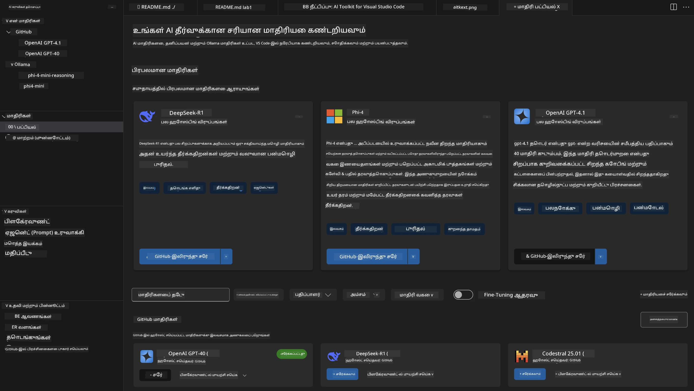
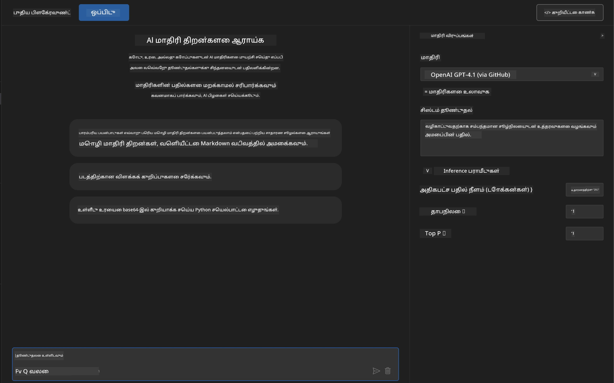
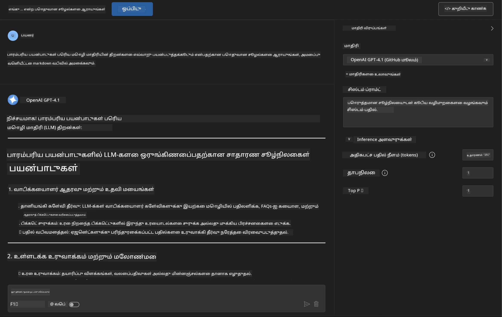
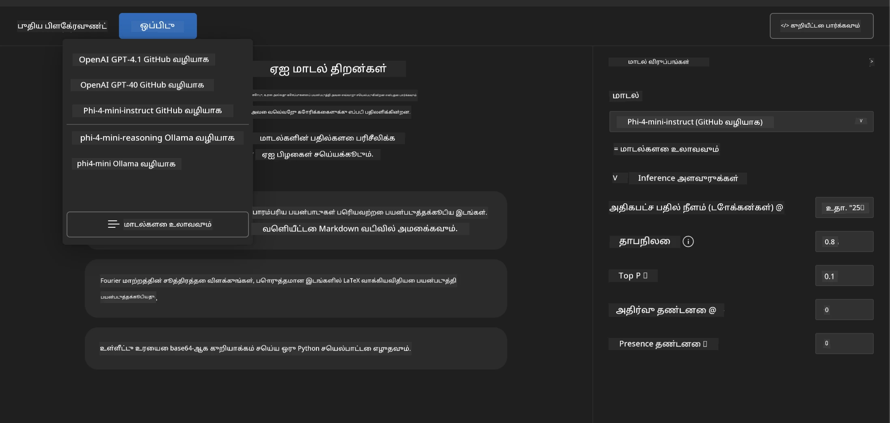
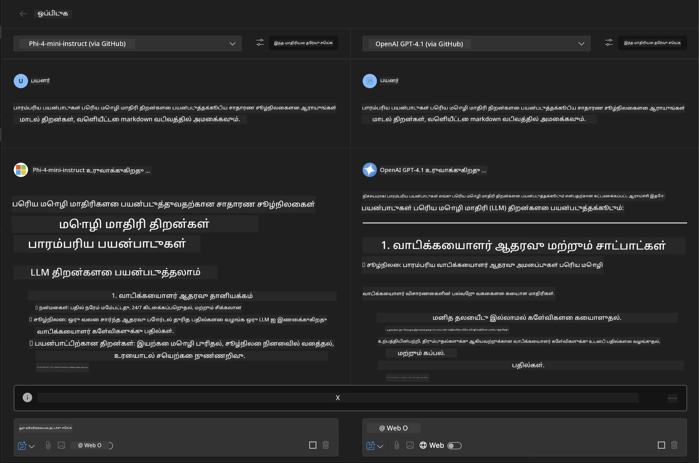
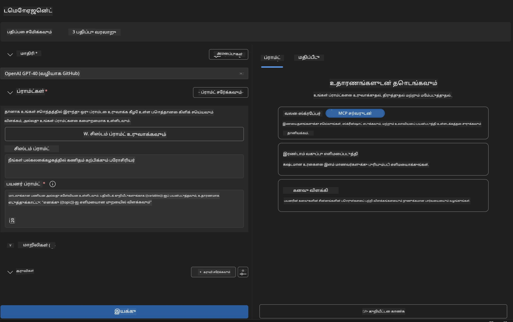
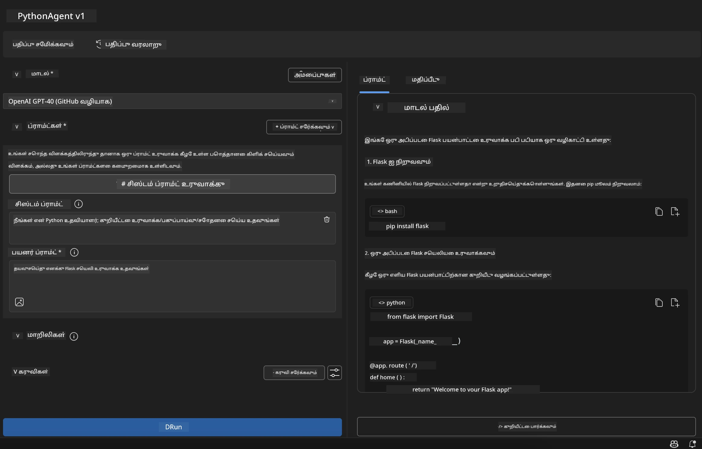

# 🚀 Module 1: AI Toolkit அடிப்படைகள்

[]()
[]()
[]()

## 📋 கற்றல் நோக்கங்கள்

இந்த தொகுதியின் முடிவில், நீங்கள்:
- ✅ Visual Studio Code-க்கு AI Toolkit-ஐ நிறுவி, அமைக்க முடியும்
- ✅ Model Catalog-ஐ வழிநடத்தி, மாடல்களின் மூலங்களைப் புரிந்துகொள்ள முடியும்
- ✅ Playground-ஐ பயன்படுத்தி மாடல் சோதனை மற்றும் பரிசோதனை செய்ய முடியும்
- ✅ Agent Builder-ஐ பயன்படுத்தி தனிப்பயன் AI முகவர்களை உருவாக்க முடியும்
- ✅ மாடல் செயல்திறனை பல்வேறு வழங்குநர்களுக்கு இடையில் ஒப்பிட முடியும்
- ✅ Prompt Engineering-க்கு சிறந்த நடைமுறைகளைப் பயன்படுத்த முடியும்

## 🧠 AI Toolkit (AITK) அறிமுகம்

**Visual Studio Code-க்கான AI Toolkit** என்பது Microsoft-இன் முக்கியமான நீட்டிப்பு ஆகும், இது VS Code-ஐ முழுமையான AI மேம்பாட்டு சூழலாக மாற்றுகிறது. இது AI ஆராய்ச்சி மற்றும் நடைமுறை பயன்பாட்டு மேம்பாட்டுக்கு இடையிலான இடைவெளியை நிரப்புகிறது, அனைத்து திறன்களுடைய டெவலப்பர்களுக்கு Generative AI-ஐ அணுகக்கூடியதாக மாற்றுகிறது.

### 🌟 முக்கிய திறன்கள்

| அம்சம் | விளக்கம் | பயன்பாட்டு நிலை |
|---------|-------------|----------|
| **🗂️ Model Catalog** | GitHub, ONNX, OpenAI, Anthropic, Google ஆகியவற்றிலிருந்து 100+ மாடல்களை அணுகவும் | மாடல் கண்டறிதல் மற்றும் தேர்வு |
| **🔌 BYOM Support** | உங்கள் சொந்த மாடல்களை (உள்ளூர்/தொலை) ஒருங்கிணைக்கவும் | தனிப்பயன் மாடல் பிரயோகம் |
| **🎮 Interactive Playground** | உரையாடல் இடைமுகத்துடன் நேரடி மாடல் சோதனை | விரைவான பரிசோதனை மற்றும் சோதனை |
| **📎 Multi-Modal Support** | உரை, படங்கள் மற்றும் இணைப்புகளை கையாளவும் | சிக்கலான AI பயன்பாடுகள் |
| **⚡ Batch Processing** | பல prompts-ஐ ஒரே நேரத்தில் இயக்கவும் | திறமையான சோதனை வேலைகள் |
| **📊 Model Evaluation** | F1, தொடர்பு, ஒத்திசைவு, இணக்கம் போன்ற உள்ளமைக்கப்பட்ட அளவுகோல்கள் | செயல்திறன் மதிப்பீடு |

### 🎯 AI Toolkit ஏன் முக்கியம்

- **🚀 வேகமான மேம்பாடு**: யோசனையிலிருந்து Prototype வரை நிமிடங்களில்
- **🔄 ஒருங்கிணைந்த வேலைநடை**: பல AI வழங்குநர்களுக்கு ஒரே இடைமுகம்
- **🧪 எளிய பரிசோதனை**: சிக்கலான அமைப்பின்றி மாடல்களை ஒப்பிடவும்
- **📈 தயாரிப்பு தயாராக**: Prototype-இலிருந்து Deployment வரை எளிதான மாற்றம்

## 🛠️ முன்னோட்டங்கள் மற்றும் அமைப்பு

### 📦 AI Toolkit Extension-ஐ நிறுவவும்

**Step 1: Extensions Marketplace-ஐ அணுகவும்**
1. Visual Studio Code-ஐ திறக்கவும்
2. Extensions view-க்கு (`Ctrl+Shift+X` அல்லது `Cmd+Shift+X`) செல்லவும்
3. "AI Toolkit" என தேடவும்

**Step 2: உங்கள் பதிப்பைத் தேர்ந்தெடுக்கவும்**
- **🟢 Release**: உற்பத்தி பயன்பாட்டுக்கு பரிந்துரைக்கப்படுகிறது
- **🔶 Pre-release**: முன்னோட்ட அம்சங்களுக்கு ஆரம்ப அணுகல்

**Step 3: நிறுவி, செயல்படுத்தவும்**


### ✅ சரிபார்ப்பு பட்டியல்
- [ ] AI Toolkit ஐகான் VS Code பக்கப்பட்டியில் தோன்றுகிறது
- [ ] Extension செயல்படுத்தப்பட்டு செயல்படுகிறது
- [ ] Output panel-ல் நிறுவல் பிழைகள் இல்லை

## 🧪 கையால் செய்யும் பயிற்சி 1: GitHub மாடல்களை ஆராய்வது

**🎯 நோக்கம்**: Model Catalog-ஐ கையாளவும், உங்கள் முதல் AI மாடலை சோதிக்கவும்

### 📊 Step 1: Model Catalog-ஐ வழிநடத்தவும்

Model Catalog என்பது AI சூழலுக்கான உங்கள் நுழைவாயில் ஆகும். இது பல்வேறு வழங்குநர்களிலிருந்து மாடல்களை ஒருங்கிணைக்கிறது, விருப்பங்களை கண்டறியவும், ஒப்பிடவும் எளிதாக்குகிறது.

**🔍 வழிநடத்தல் வழிகாட்டி:**

AI Toolkit பக்கப்பட்டியில் **MODELS - Catalog**-ஐ கிளிக் செய்யவும்



**💡 சிறந்த ஆலோசனை**: உங்கள் பயன்பாட்டு நிலைக்கு பொருந்தும் குறிப்பிட்ட திறன்களுடன் மாடல்களைத் தேடுங்கள் (எ.கா., code generation, creative writing, analysis).

**⚠️ குறிப்பு**: GitHub-ல் உள்ள மாடல்கள் (அதாவது GitHub Models) இலவசமாக பயன்படுத்தலாம், ஆனால் கோரிக்கைகள் மற்றும் tokens-க்கு வரம்புகள் உள்ளன. GitHub அல்லாத மாடல்களை (அதாவது Azure AI அல்லது பிற முடுக்கங்கள் மூலம் வழங்கப்படும் மாடல்கள்) அணுக விரும்பினால், தேவையான API key அல்லது authentication-ஐ வழங்க வேண்டும்.

### 🚀 Step 2: உங்கள் முதல் மாடலை சேர்த்து, அமைக்கவும்

**Model Selection Strategy:**
- **GPT-4.1**: சிக்கலான காரணம் மற்றும் பகுப்பாய்வுக்கு சிறந்தது
- **Phi-4-mini**: எளிய பணிகளுக்கு இலகுவான, வேகமான பதில்கள்

**🔧 அமைப்பு செயல்முறை:**
1. Catalog-இல் **OpenAI GPT-4.1**-ஐ தேர்ந்தெடுக்கவும்
2. **Add to My Models**-ஐ கிளிக் செய்யவும் - இது மாடலைப் பயன்படுத்த பதிவு செய்கிறது
3. **Try in Playground**-ஐ தேர்ந்தெடுத்து சோதனை சூழலைத் தொடங்கவும்
4. மாடல் தொடக்கத்தை காத்திருக்கவும் (முதல் முறை அமைப்பு சில நேரம் எடுக்கலாம்)



**⚙️ மாடல் அளவுருக்களைப் புரிந்துகொள்ளுதல்:**
- **Temperature**: படைப்பாற்றலைக் கட்டுப்படுத்துகிறது (0 = நிர்ணயிக்கப்பட்டது, 1 = படைப்பாற்றல்)
- **Max Tokens**: அதிகபட்ச பதில் நீளம்
- **Top-p**: பதில் பல்வகைமைக்கு Nucleus sampling

### 🎯 Step 3: Playground இடைமுகத்தை கையாளவும்

Playground என்பது உங்கள் AI பரிசோதனை ஆய்வகமாகும். இதன் திறனை அதிகபட்சமாக பயன்படுத்துவதற்கான வழிகள்:

**🎨 Prompt Engineering சிறந்த நடைமுறைகள்:**
1. **தெளிவாக இருங்கள்**: தெளிவான, விரிவான வழிமுறைகள் சிறந்த முடிவுகளைத் தரும்
2. **சூழலை வழங்குங்கள்**: தொடர்புடைய பின்னணி தகவலைச் சேர்க்கவும்
3. **உதாரணங்களைப் பயன்படுத்துங்கள்**: நீங்கள் விரும்பும் விஷயத்தை மாடலுக்கு உதாரணங்களுடன் காட்டுங்கள்
4. **மீண்டும் முயற்சிக்கவும்**: ஆரம்ப முடிவுகளின் அடிப்படையில் prompts-ஐ மேம்படுத்தவும்

**🧪 சோதனை நிலைகள்:**
```markdown
# Example 1: Code Generation
"Write a Python function that calculates the factorial of a number using recursion. Include error handling and docstrings."

# Example 2: Creative Writing
"Write a professional email to a client explaining a project delay, maintaining a positive tone while being transparent about challenges."

# Example 3: Data Analysis
"Analyze this sales data and provide insights: [paste your data]. Focus on trends, anomalies, and actionable recommendations."
```



### 🏆 சவால் பயிற்சி: மாடல் செயல்திறன் ஒப்பீடு

**🎯 இலக்கு**: ஒரே prompts-ஐப் பயன்படுத்தி மாடல்களை ஒப்பிட்டு அவற்றின் பலவீனங்களைப் புரிந்துகொள்ளவும்

**📋 வழிமுறைகள்:**
1. **Phi-4-mini**-ஐ உங்கள் வேலைப்பகுதியில் சேர்க்கவும்
2. GPT-4.1 மற்றும் Phi-4-mini இரண்டிற்கும் ஒரே prompt-ஐப் பயன்படுத்தவும்



3. பதில்களின் தரம், வேகம் மற்றும் துல்லியத்தை ஒப்பிடவும்
4. உங்கள் கண்டுபிடிப்புகளை முடிவுகள் பிரிவில் பதிவு செய்யவும்



**💡 கண்டுபிடிக்க வேண்டிய முக்கிய தகவல்கள்:**
- எப்போது LLM-ஐ பயன்படுத்துவது, எப்போது SLM-ஐ பயன்படுத்துவது
- செலவு மற்றும் செயல்திறன் இடையிலான சமநிலை
- மாடல்களின் சிறப்பு திறன்கள்

## 🤖 கையால் செய்யும் பயிற்சி 2: Agent Builder-ஐப் பயன்படுத்தி தனிப்பயன் முகவர்களை உருவாக்குதல்

**🎯 நோக்கம்**: குறிப்பிட்ட பணிகள் மற்றும் வேலைநடைகளுக்கு ஏற்ற AI முகவர்களை உருவாக்கவும்

### 🏗️ Step 1: Agent Builder-ஐப் புரிந்துகொள்ளுதல்

Agent Builder என்பது AI Toolkit-இன் உண்மையான சிறப்பம்சமாகும். இது பெரிய மொழி மாடல்களின் சக்தியை தனிப்பயன் வழிமுறைகள், குறிப்பிட்ட அளவுருக்கள் மற்றும் சிறப்பு அறிவுடன் இணைக்கும் நோக்கமுடைய AI உதவியாளர்களை உருவாக்க அனுமதிக்கிறது.

**🧠 Agent Architecture கூறுகள்:**
- **Core Model**: அடிப்படை LLM (GPT-4, Groks, Phi, etc.)
- **System Prompt**: முகவரின் தன்மை மற்றும் நடத்தை வரையறுக்கிறது
- **Parameters**: சிறந்த செயல்திறனுக்கான நுணுக்கமான அமைப்புகள்
- **Tools Integration**: வெளிப்புற APIக்கள் மற்றும் MCP சேவைகளை இணைக்கவும்
- **Memory**: உரையாடல் சூழல் மற்றும் அமர்வு நிலைத்தன்மை



### ⚙️ Step 2: Agent அமைப்பு ஆழமான பார்வை

**🎨 பயனுள்ள System Prompts உருவாக்குதல்:**
```markdown
# Template Structure:
## Role Definition
You are a [specific role] with expertise in [domain].

## Capabilities
- List specific abilities
- Define scope of knowledge
- Clarify limitations

## Behavior Guidelines
- Response style (formal, casual, technical)
- Output format preferences
- Error handling approach

## Examples
Provide 2-3 examples of ideal interactions
```

*மிகவும், Generate System Prompt-ஐப் பயன்படுத்தி AI-ஐ prompts உருவாக்கவும், மேம்படுத்தவும் உதவ செய்யலாம்*

**🔧 அளவுரு மேம்படுத்தல்:**
| அளவுரு | பரிந்துரைக்கப்பட்ட வரம்பு | பயன்பாட்டு நிலை |
|-----------|------------------|----------|
| **Temperature** | 0.1-0.3 | தொழில்நுட்ப/உண்மையான பதில்கள் |
| **Temperature** | 0.7-0.9 | படைப்பாற்றல்/மூளையூட்டும் பணிகள் |
| **Max Tokens** | 500-1000 | சுருக்கமான பதில்கள் |
| **Max Tokens** | 2000-4000 | விரிவான விளக்கங்கள் |

### 🐍 Step 3: நடைமுறை பயிற்சி - Python Programming Agent

**🎯 பணிக்குறிப்பு**: Python குறியீட்டு உதவியாளரை உருவாக்கவும்

**📋 அமைப்பு படிகள்:**

1. **Model Selection**: **Claude 3.5 Sonnet**-ஐ தேர்ந்தெடுக்கவும் (குறியீட்டுக்கு சிறந்தது)

2. **System Prompt Design**:
```markdown
# Python Programming Expert Agent

## Role
You are a senior Python developer with 10+ years of experience. You excel at writing clean, efficient, and well-documented Python code.

## Capabilities
- Write production-ready Python code
- Debug complex issues
- Explain code concepts clearly
- Suggest best practices and optimizations
- Provide complete working examples

## Response Format
- Always include docstrings
- Add inline comments for complex logic
- Suggest testing approaches
- Mention relevant libraries when applicable

## Code Quality Standards
- Follow PEP 8 style guidelines
- Use type hints where appropriate
- Handle exceptions gracefully
- Write readable, maintainable code
```

3. **Parameter Configuration**:
   - Temperature: 0.2 (நிலையான, நம்பகமான குறியீடு)
   - Max Tokens: 2000 (விரிவான விளக்கங்கள்)
   - Top-p: 0.9 (சமநிலை படைப்பாற்றல்)



### 🧪 Step 4: உங்கள் Python Agent-ஐ சோதனை செய்யவும்

**சோதனை நிலைகள்:**
1. **அடிப்படை செயல்பாடு**: "Prime numbers கண்டறிய ஒரு function உருவாக்கவும்"
2. **சிக்கலான ஆல்கொரிதம்**: "Insert, delete, மற்றும் search முறைகளுடன் ஒரு binary search tree-ஐ செயல்படுத்தவும்"
3. **உலகளாவிய பிரச்சினை**: "Rate limiting மற்றும் retries-ஐ கையாளும் ஒரு web scraper உருவாக்கவும்"
4. **Debugging**: "இந்த குறியீட்டை சரிசெய்யவும் [பிழையான குறியீட்டை ஒட்டவும்]"

**🏆 வெற்றிக் குறியீடுகள்:**
- ✅ குறியீடு பிழையின்றி இயங்குகிறது
- ✅ சரியான ஆவணங்களை உள்ளடக்கியது
- ✅ Python சிறந்த நடைமுறைகளைப் பின்பற்றுகிறது
- ✅ தெளிவான விளக்கங்களை வழங்குகிறது
- ✅ மேம்பாடுகளை பரிந்துரைக்கிறது

## 🎓 Module 1 முடிவு மற்றும் அடுத்த படிகள்

### 📊 அறிவு சரிபார்ப்பு

உங்கள் புரிதலை சோதிக்க:
- [ ] Catalog-இல் உள்ள மாடல்களின் வேறுபாட்டை விளக்க முடியுமா?
- [ ] நீங்கள் வெற்றிகரமாக தனிப்பயன் முகவர்களை உருவாக்கி சோதித்தீர்களா?
- [ ] பல்வேறு பயன்பாட்டு நிலைகளுக்கு அளவுருக்களை எப்படி மேம்படுத்துவது என்பதைப் புரிந்துகொண்டீர்களா?
- [ ] பயனுள்ள System Prompts-ஐ வடிவமைக்க முடிகிறதா?

### 📚 கூடுதல் வளங்கள்

- **AI Toolkit Documentation**: [அதிகாரப்பூர்வ Microsoft Docs](https://github.com/microsoft/vscode-ai-toolkit)
- **Prompt Engineering Guide**: [சிறந்த நடைமுறைகள்](https://platform.openai.com/docs/guides/prompt-engineering)
- **Models in AI Toolkit**: [Models in Development](https://github.com/microsoft/vscode-ai-toolkit/blob/main/doc/models.md)

**🎉 வாழ்த்துக்கள்!** நீங்கள் AI Toolkit அடிப்படைகளை கற்றுக்கொண்டீர்கள், மேலும் மேம்பட்ட AI பயன்பாடுகளை உருவாக்க தயாராக உள்ளீர்கள்!

### 🔜 அடுத்த Module-க்கு தொடரவும்

மேம்பட்ட திறன்களுக்கு தயாரா? **[Module 2: MCP with AI Toolkit Fundamentals](../lab2/README.md)**-க்கு தொடரவும், அங்கு நீங்கள்:
- Model Context Protocol (MCP)-ஐப் பயன்படுத்தி உங்கள் முகவர்களை வெளிப்புற கருவிகளுடன் இணைக்க
- Playwright-ஐப் பயன்படுத்தி உலாவி தானியக்க முகவர்களை உருவாக்க
- MCP servers-ஐ உங்கள் AI Toolkit முகவர்களுடன் ஒருங்கிணைக்க
- வெளிப்புற தரவுகள் மற்றும் திறன்களுடன் உங்கள் முகவர்களை மேம்படுத்த

---

**குறிப்பு**:  
இந்த ஆவணம் [Co-op Translator](https://github.com/Azure/co-op-translator) என்ற AI மொழிபெயர்ப்பு சேவையைப் பயன்படுத்தி மொழிபெயர்க்கப்பட்டுள்ளது. நாங்கள் துல்லியத்திற்காக முயற்சிக்கின்றோம், ஆனால் தானியங்கி மொழிபெயர்ப்புகளில் பிழைகள் அல்லது தவறான தகவல்கள் இருக்கக்கூடும் என்பதை தயவுசெய்து கவனத்தில் கொள்ளுங்கள். அதன் தாய்மொழியில் உள்ள மூல ஆவணம் அதிகாரப்பூர்வ ஆதாரமாக கருதப்பட வேண்டும். முக்கியமான தகவல்களுக்கு, தொழில்முறை மனித மொழிபெயர்ப்பு பரிந்துரைக்கப்படுகிறது. இந்த மொழிபெயர்ப்பைப் பயன்படுத்துவதால் ஏற்படும் எந்த தவறான புரிதல்கள் அல்லது தவறான விளக்கங்களுக்கு நாங்கள் பொறுப்பல்ல.