# 🌐 Module 2: MCP மற்றும் AI Toolkit அடிப்படைகள்

[]()
[]()
[]()

## 📋 கற்றல் நோக்கங்கள்

இந்த தொகுதியின் முடிவில், நீங்கள் பின்வருவனவற்றை செய்ய முடியும்:
- ✅ Model Context Protocol (MCP) கட்டமைப்பு மற்றும் அதன் நன்மைகளைப் புரிந்துகொள்வது
- ✅ Microsoft இன் MCP சர்வர் சூழலை ஆராய்வது
- ✅ MCP சர்வர்களை AI Toolkit Agent Builder உடன் ஒருங்கிணைப்பது
- ✅ Playwright MCP ஐப் பயன்படுத்தி ஒரு செயல்படும் உலாவி தானியங்கும் முகவரியை உருவாக்குவது
- ✅ உங்கள் முகவரிகளில் MCP கருவிகளை அமைத்து சோதிப்பது
- ✅ MCP மூலம் இயக்கப்படும் முகவரிகளை உற்பத்தி பயன்பாட்டிற்காக ஏற்றுமதி செய்து வெளியிடுவது

## 🎯 Module 1 இல் அடிப்படைகளை மேம்படுத்துதல்

Module 1 இல், AI Toolkit அடிப்படைகளை கற்றோம் மற்றும் முதல் Python Agent ஐ உருவாக்கினோம். இப்போது உங்கள் முகவரிகளை **மேம்படுத்த** MCP (Model Context Protocol) மூலம் வெளிப்புற கருவிகள் மற்றும் சேவைகளுடன் இணைப்பதன் மூலம்.

இதனை ஒரு அடிப்படை கணிப்பொறியில் இருந்து முழுமையான கணினியாக மேம்படுத்துவது போலக் கருதுங்கள் - உங்கள் AI முகவரிகள் பின்வருவனவற்றை செய்யும் திறனை பெறும்:
- 🌐 இணையதளங்களை உலாவி தொடர்பு கொள்ளுதல்
- 📁 கோப்புகளை அணுகி மாற்றுதல்
- 🔧 நிறுவன அமைப்புகளுடன் ஒருங்கிணைத்தல்
- 📊 API களிலிருந்து நேரடி தரவுகளை செயலாக்குதல்

## 🧠 Model Context Protocol (MCP) ஐப் புரிந்துகொள்வது

### 🔍 MCP என்றால் என்ன?

Model Context Protocol (MCP) என்பது **"AI பயன்பாடுகளுக்கான USB-C"** - ஒரு புரட்சிகரமான திறந்த தரநிலை, இது பெரிய மொழி மாதிரிகளை (LLMs) வெளிப்புற கருவிகள், தரவுத் தரவுகள் மற்றும் சேவைகளுடன் இணைக்கிறது. USB-C பல்வேறு கேபிள் குழப்பங்களைத் தவிர்த்து ஒரு பொதுவான இணைப்பை வழங்கியது போல, MCP AI ஒருங்கிணைப்பு சிக்கல்களை ஒரு தரநிலைமிக்க நெறிமுறையுடன் நீக்குகிறது.

### 🎯 MCP தீர்க்கும் பிரச்சினை

**MCP க்கு முன்:**
- 🔧 ஒவ்வொரு கருவிக்கும் தனிப்பயன் ஒருங்கிணைப்புகள்
- 🔄 தனியுரிம தீர்வுகளுடன் விற்பனையாளர் கட்டுப்பாடு  
- 🔒 சீரற்ற இணைப்புகளிலிருந்து பாதுகாப்பு பாதிப்புகள்
- ⏱️ அடிப்படை ஒருங்கிணைப்புகளுக்கு மாதங்கள் தேவை

**MCP உடன்:**
- ⚡ Plug-and-play கருவி ஒருங்கிணைப்பு
- 🔄 விற்பனையாளர்-அக்னோஸ்டிக் கட்டமைப்பு
- 🛡️ பாதுகாப்பு சிறந்த நடைமுறைகள்
- 🚀 புதிய திறன்களைச் சேர்க்க சில நிமிடங்கள்

### 🏗️ MCP கட்டமைப்பின் ஆழமான பார்வை

MCP ஒரு **client-server architecture** ஐப் பின்பற்றுகிறது, இது ஒரு பாதுகாப்பான, அளவிடக்கூடிய சூழலை உருவாக்குகிறது:

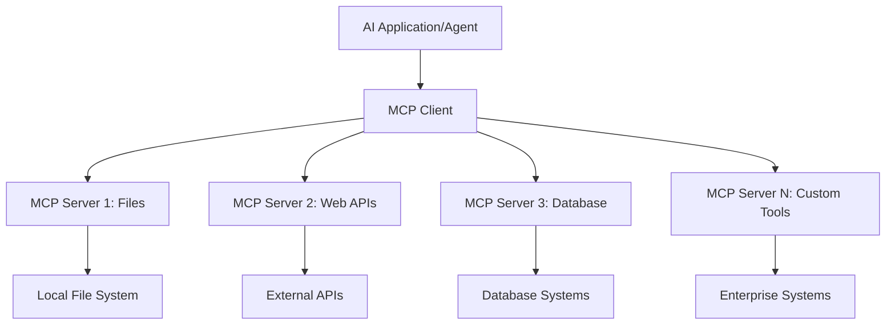

**🔧 முக்கிய கூறுகள்:**

| கூறு | பங்கு | உதாரணங்கள் |
|------|------|----------|
| **MCP Hosts** | MCP சேவைகளைப் பயன்படுத்தும் பயன்பாடுகள் | Claude Desktop, VS Code, AI Toolkit |
| **MCP Clients** | நெறிமுறை கையாளிகள் (சர்வர்களுடன் 1:1) | Host பயன்பாடுகளில் உள்ளடக்கப்பட்டுள்ளது |
| **MCP Servers** | தரநிலை நெறிமுறையின் மூலம் திறன்களை வெளிப்படுத்துதல் | Playwright, Files, Azure, GitHub |
| **Transport Layer** | தொடர்பு முறைகள் | stdio, HTTP, WebSockets |

## 🏢 Microsoft இன் MCP சர்வர் சூழல்

Microsoft MCP சூழலை ஒரு விரிவான நிறுவன தர சர்வர்களின் தொகுப்புடன் வழிநடத்துகிறது, இது உண்மையான வணிக தேவைகளைத் தீர்க்கிறது.

### 🌟 Microsoft MCP சர்வர்களின் சிறப்பம்சங்கள்

#### 1. ☁️ Azure MCP Server
**🔗 Repository**: [azure/azure-mcp](https://github.com/azure/azure-mcp)
**🎯 நோக்கம்**: AI ஒருங்கிணைப்புடன் விரிவான Azure வள மேலாண்மை

**✨ முக்கிய அம்சங்கள்:**
- அறிவுரையுடன் கட்டமைப்பு வழங்கல்
- நேரடி வள கண்காணிப்பு
- செலவுக் குறைப்பு பரிந்துரைகள்
- பாதுகாப்பு இணக்கத்தன்மை சோதனை

**🚀 பயன்பாடுகள்:**
- AI உதவியுடன் Infrastructure-as-Code
- தானியங்கும் வள அளவீடு
- மேக செலவுக் குறைப்பு
- DevOps வேலைப்போக்கு தானியக்கம்

#### 2. 📊 Microsoft Dataverse MCP
**📚 ஆவணங்கள்**: [Microsoft Dataverse Integration](https://go.microsoft.com/fwlink/?linkid=2320176)
**🎯 நோக்கம்**: வணிக தரவுகளுக்கான இயற்கை மொழி இடைமுகம்

**✨ முக்கிய அம்சங்கள்:**
- இயற்கை மொழி தரவுத்தொகுப்பு கேள்விகள்
- வணிக சூழல் புரிதல்
- தனிப்பயன் உந்துதல் வார்ப்புருக்கள்
- நிறுவன தரவுகள் ஆளுமை

**🚀 பயன்பாடுகள்:**
- வணிக நுண்ணறிவு அறிக்கைகள்
- வாடிக்கையாளர் தரவுகள் பகுப்பாய்வு
- விற்பனை குழாய் பார்வைகள்
- இணக்கத்தன்மை தரவுக் கேள்விகள்

#### 3. 🌐 Playwright MCP Server
**🔗 Repository**: [microsoft/playwright-mcp](https://github.com/microsoft/playwright-mcp)
**🎯 நோக்கம்**: உலாவி தானியக்கம் மற்றும் இணைய தொடர்பு திறன்கள்

**✨ முக்கிய அம்சங்கள்:**
- பல உலாவி தானியக்கம் (Chrome, Firefox, Safari)
- புத்திசாலி கூறு கண்டறிதல்
- ஸ்கிரீன்ஷாட் மற்றும் PDF உருவாக்கம்
- நெட்வொர்க் போக்குவரத்து கண்காணிப்பு

**🚀 பயன்பாடுகள்:**
- தானியங்கும் சோதனை வேலைப்போக்குகள்
- இணையத் தேடல் மற்றும் தரவுத் தொகுப்பு
- UI/UX கண்காணிப்பு
- போட்டி பகுப்பாய்வு தானியக்கம்

#### 4. 📁 Files MCP Server
**🔗 Repository**: [microsoft/files-mcp-server](https://github.com/microsoft/files-mcp-server)
**🎯 நோக்கம்**: புத்திசாலி கோப்பு அமைப்பு செயல்பாடுகள்

**✨ முக்கிய அம்சங்கள்:**
- அறிவுரையுடன் கோப்பு மேலாண்மை
- உள்ளடக்க ஒத்திசைவு
- பதிப்பு கட்டுப்பாடு ஒருங்கிணைப்பு
- மெட்டாடேட்டா எடுக்கும்

**🚀 பயன்பாடுகள்:**
- ஆவண மேலாண்மை
- குறியீட்டு தொகுப்பு அமைப்பு
- உள்ளடக்க வெளியீட்டு வேலைப்போக்குகள்
- தரவுப் குழாய் கோப்பு கையாளுதல்

#### 5. 📝 MarkItDown MCP Server
**🔗 Repository**: [microsoft/markitdown](https://github.com/microsoft/markitdown)
**🎯 நோக்கம்**: மேம்பட்ட Markdown செயலாக்கம் மற்றும் மாற்றம்

**✨ முக்கிய அம்சங்கள்:**
- செறிவான Markdown பகுப்பாய்வு
- வடிவ மாற்றம் (MD ↔ HTML ↔ PDF)
- உள்ளடக்க அமைப்பு பகுப்பாய்வு
- வார்ப்புரு செயலாக்கம்

**🚀 பயன்பாடுகள்:**
- தொழில்நுட்ப ஆவண வேலைப்போக்குகள்
- உள்ளடக்க மேலாண்மை அமைப்புகள்
- அறிக்கை உருவாக்கம்
- அறிவு அடுக்குகள் தானியக்கம்

#### 6. 📈 Clarity MCP Server
**📦 Package**: [@microsoft/clarity-mcp-server](https://www.npmjs.com/package/@microsoft/clarity-mcp-server)
**🎯 நோக்கம்**: இணைய பகுப்பாய்வு மற்றும் பயனர் நடத்தை பார்வைகள்

**✨ முக்கிய அம்சங்கள்:**
- ஹீட்மாப் தரவுப் பகுப்பாய்வு
- பயனர் அமர்வு பதிவுகள்
- செயல்திறன் அளவுகள்
- மாற்றம் குழாய் பகுப்பாய்வு

**🚀 பயன்பாடுகள்:**
- இணையதள மேம்பாடு
- பயனர் அனுபவ ஆராய்ச்சி
- A/B சோதனை பகுப்பாய்வு
- வணிக நுண்ணறிவு டாஷ்போர்டுகள்

### 🌍 சமூக சூழல்

Microsoft சர்வர்களைத் தவிர, MCP சூழல் பின்வருவனவற்றை உள்ளடக்கியது:
- **🐙 GitHub MCP**: Repository மேலாண்மை மற்றும் குறியீட்டு பகுப்பாய்வு
- **🗄️ தரவுத்தொகுப்பு MCPs**: PostgreSQL, MySQL, MongoDB ஒருங்கிணைப்புகள்
- **☁️ மேக வழங்குநர் MCPs**: AWS, GCP, Digital Ocean கருவிகள்
- **📧 தொடர்பு MCPs**: Slack, Teams, Email ஒருங்கிணைப்புகள்

## 🛠️ கைக்கூலி ஆய்வகம்: உலாவி தானியங்கும் முகவரியை உருவாக்குதல்

**🎯 திட்ட நோக்கம்**: Playwright MCP சர்வரைப் பயன்படுத்தி ஒரு புத்திசாலி உலாவி தானியங்கும் முகவரியை உருவாக்குவது, இது இணையதளங்களை உலாவி தகவல்களை எடுக்கவும், சிக்கலான இணைய தொடர்புகளைச் செய்யவும் முடியும்.

### 🚀 கட்டம் 1: முகவர் அடிப்படை அமைப்பு

#### படி 1: உங்கள் முகவரியை ஆரம்பிக்கவும்
1. **AI Toolkit Agent Builder ஐ திறக்கவும்**
2. பின்வரும் அமைப்புடன் **புதிய முகவரியை உருவாக்கவும்**:
   - **பெயர்**: `BrowserAgent`
   - **மாதிரி**: GPT-4o ஐத் தேர்ந்தெடுக்கவும் 

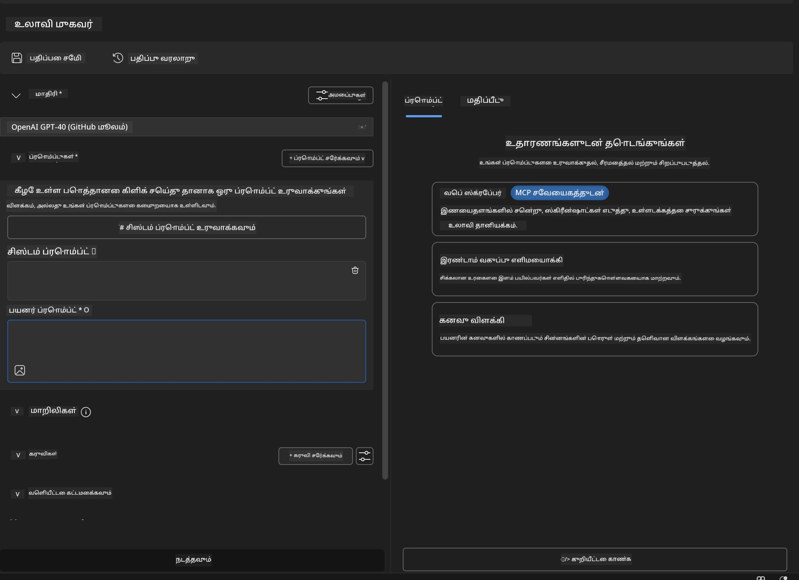

### 🔧 கட்டம் 2: MCP ஒருங்கிணைப்பு வேலைப்போக்கு

#### படி 3: MCP சர்வர் ஒருங்கிணைப்பைச் சேர்க்கவும்
1. **Agent Builder இல் Tools பிரிவுக்கு செல்லவும்**
2. **"Add Tool" ஐ கிளிக் செய்யவும்** ஒருங்கிணைப்பு மெனுவைத் திறக்க
3. **"MCP Server" ஐத் தேர்ந்தெடுக்கவும்** கிடைக்கக்கூடிய விருப்பங்களில் இருந்து

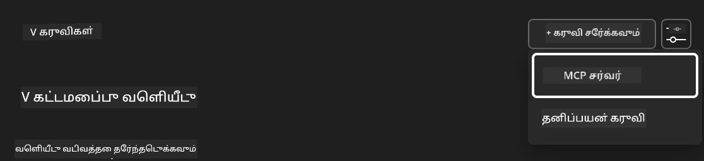

**🔍 கருவி வகைகளைப் புரிந்துகொள்வது:**
- **Built-in Tools**: முன்பே உள்ளமைக்கப்பட்ட AI Toolkit செயல்பாடுகள்
- **MCP Servers**: வெளிப்புற சேவை ஒருங்கிணைப்புகள்
- **Custom APIs**: உங்கள் சொந்த சேவை முடிவுகள்
- **Function Calling**: நேரடி மாதிரி செயல்பாடு அணுகல்

#### படி 4: MCP சர்வர் தேர்வு
1. **"MCP Server" விருப்பத்தைத் தேர்ந்தெடுக்கவும்** தொடர
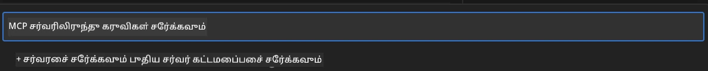

2. **MCP Catalog ஐ உலாவவும்** கிடைக்கக்கூடிய ஒருங்கிணைப்புகளை ஆராய
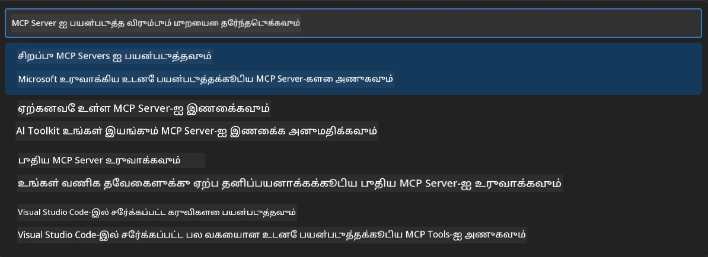

### 🎮 கட்டம் 3: Playwright MCP அமைப்பு

#### படி 5: Playwright ஐத் தேர்ந்தெடுத்து அமைக்கவும்
1. **"Use Featured MCP Servers" ஐ கிளிக் செய்யவும்** Microsoft இன் சரிபார்க்கப்பட்ட சர்வர்களை அணுக
2. **"Playwright" ஐத் தேர்ந்தெடுக்கவும்** சிறப்பம்ச பட்டியலில் இருந்து
3. **Default MCP ID ஐ ஏற்கவும்** அல்லது உங்கள் சூழலுக்கு தனிப்பயனாக்கவும்

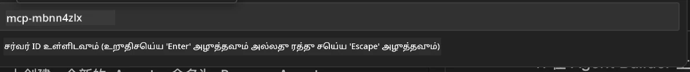

#### படி 6: Playwright திறன்களை இயக்கவும்
**🔑 முக்கிய படி**: Playwright இன் **அனைத்து** கிடைக்கக்கூடிய முறைகளை அதிகபட்ச செயல்பாட்டிற்காகத் தேர்ந்தெடுக்கவும்

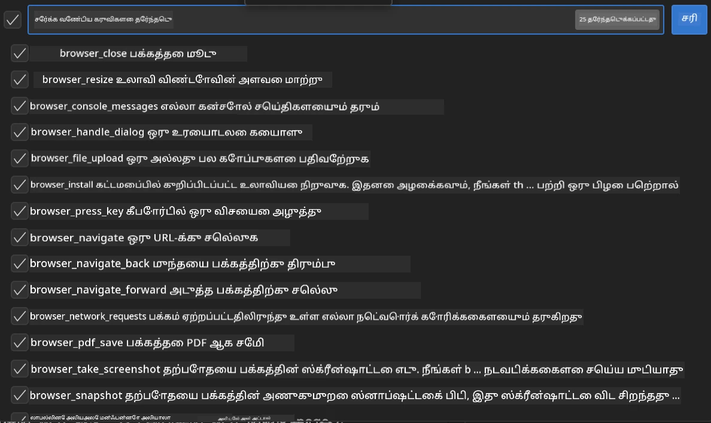

**🛠️ Playwright இன் முக்கிய கருவிகள்:**
- **Navigation**: `goto`, `goBack`, `goForward`, `reload`
- **Interaction**: `click`, `fill`, `press`, `hover`, `drag`
- **Extraction**: `textContent`, `innerHTML`, `getAttribute`
- **Validation**: `isVisible`, `isEnabled`, `waitForSelector`
- **Capture**: `screenshot`, `pdf`, `video`
- **Network**: `setExtraHTTPHeaders`, `route`, `waitForResponse`

#### படி 7: ஒருங்கிணைப்பு வெற்றியை உறுதிப்படுத்தவும்
**✅ வெற்றி குறியீடுகள்:**
- அனைத்து கருவிகளும் Agent Builder இடைமுகத்தில் தோன்றும்
- ஒருங்கிணைப்பு குழுவில் எந்தவிதமான பிழை செய்திகளும் இல்லை
- Playwright சர்வர் நிலை "Connected" எனக் காட்டுகிறது

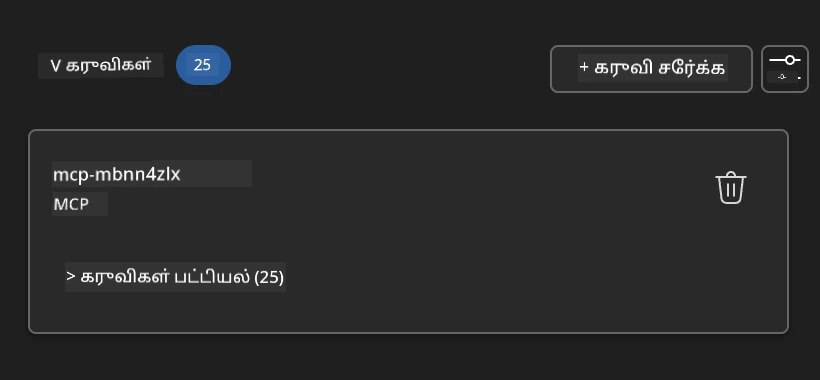

**🔧 பொதுவான பிரச்சினைகளைத் தீர்க்க:**
- **Connection Failed**: இணைய இணைப்பு மற்றும் firewall அமைப்புகளைச் சரிபார்க்கவும்
- **Missing Tools**: அமைப்பின் போது அனைத்து திறன்களும் தேர்ந்தெடுக்கப்பட்டுள்ளதா என்பதை உறுதிப்படுத்தவும்
- **Permission Errors**: VS Code இற்கு தேவையான அமைப்பு அனுமதிகள் உள்ளதா என்பதைச் சரிபார்க்கவும்

### 🎯 கட்டம் 4: மேம்பட்ட உந்துதல் பொறியியல்

#### படி 8: புத்திசாலி அமைப்பு உந்துதல்களை வடிவமைக்கவும்
Playwright இன் முழு திறன்களைப் பயன்படுத்தும் சிக்கலான உந்துதல்களை உருவாக்கவும்:

```markdown
# Web Automation Expert System Prompt

## Core Identity
You are an advanced web automation specialist with deep expertise in browser automation, web scraping, and user experience analysis. You have access to Playwright tools for comprehensive browser control.

## Capabilities & Approach
### Navigation Strategy
- Always start with screenshots to understand page layout
- Use semantic selectors (text content, labels) when possible
- Implement wait strategies for dynamic content
- Handle single-page applications (SPAs) effectively

### Error Handling
- Retry failed operations with exponential backoff
- Provide clear error descriptions and solutions
- Suggest alternative approaches when primary methods fail
- Always capture diagnostic screenshots on errors

### Data Extraction
- Extract structured data in JSON format when possible
- Provide confidence scores for extracted information
- Validate data completeness and accuracy
- Handle pagination and infinite scroll scenarios

### Reporting
- Include step-by-step execution logs
- Provide before/after screenshots for verification
- Suggest optimizations and alternative approaches
- Document any limitations or edge cases encountered

## Ethical Guidelines
- Respect robots.txt and rate limiting
- Avoid overloading target servers
- Only extract publicly available information
- Follow website terms of service
```

#### படி 9: மாறும் பயனர் உந்துதல்களை உருவாக்கவும்
பல்வேறு திறன்களை வெளிப்படுத்தும் உந்துதல்களை வடிவமைக்கவும்:

**🌐 இணைய பகுப்பாய்வு உதாரணம்:**
```markdown
Navigate to github.com/kinfey and provide a comprehensive analysis including:
1. Repository structure and organization
2. Recent activity and contribution patterns  
3. Documentation quality assessment
4. Technology stack identification
5. Community engagement metrics
6. Notable projects and their purposes

Include screenshots at key steps and provide actionable insights.
```

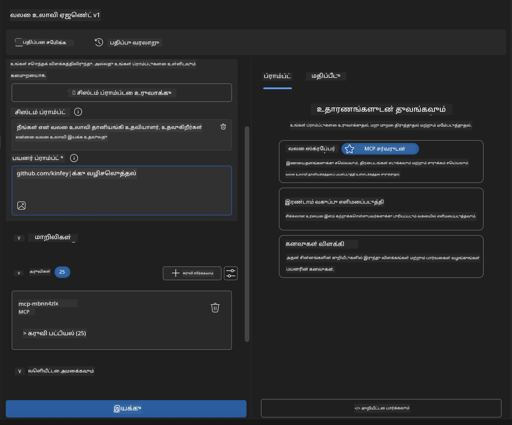

### 🚀 கட்டம் 5: செயல்படுத்தல் மற்றும் சோதனை

#### படி 10: உங்கள் முதல் தானியக்கத்தை இயக்கவும்
1. **"Run" ஐ கிளிக் செய்யவும்** தானியக்க வரிசையைத் தொடங்க
2. **நேரடி செயல்பாட்டை கண்காணிக்கவும்**:
   - Chrome உலாவி தானாகவே தொடங்கும்
   - முகவர் இலக்கு இணையதளத்திற்கு செல்கிறது
   - ஒவ்வொரு முக்கிய படியையும் ஸ்கிரீன்ஷாட் எடுக்கிறது
   - பகுப்பாய்வு முடிவுகள் நேரடியாக ஒலிக்கின்றன

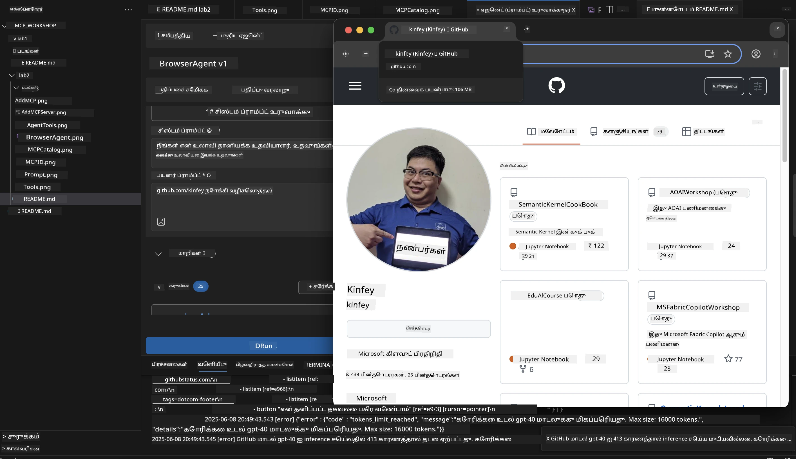

#### படி 11: முடிவுகள் மற்றும் பார்வைகளை பகுப்பாய்வு செய்யவும்
Agent Builder இன் இடைமுகத்தில் விரிவான பகுப்பாய்வை மதிப்பீடு செய்யவும்:

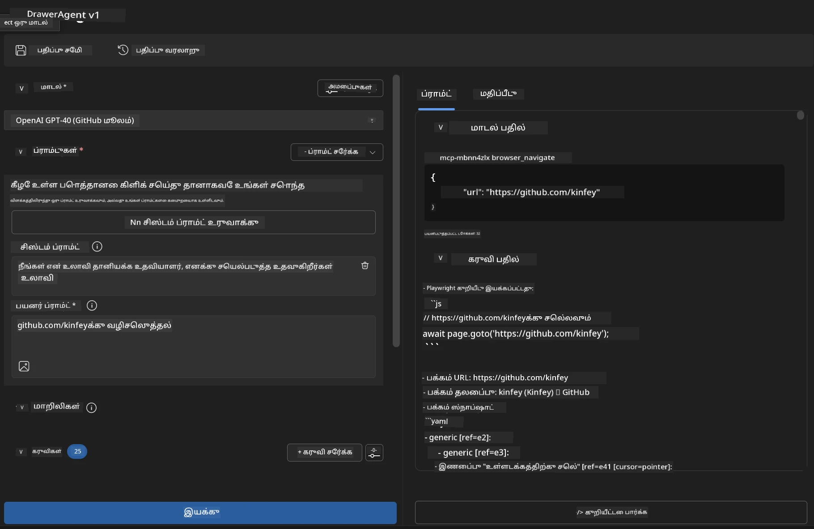

### 🌟 கட்டம் 6: மேம்பட்ட திறன்கள் மற்றும் வெளியீடு

#### படி 12: ஏற்றுமதி மற்றும் உற்பத்தி வெளியீடு
Agent Builder பல வெளியீட்டு விருப்பங்களை ஆதரிக்கிறது:

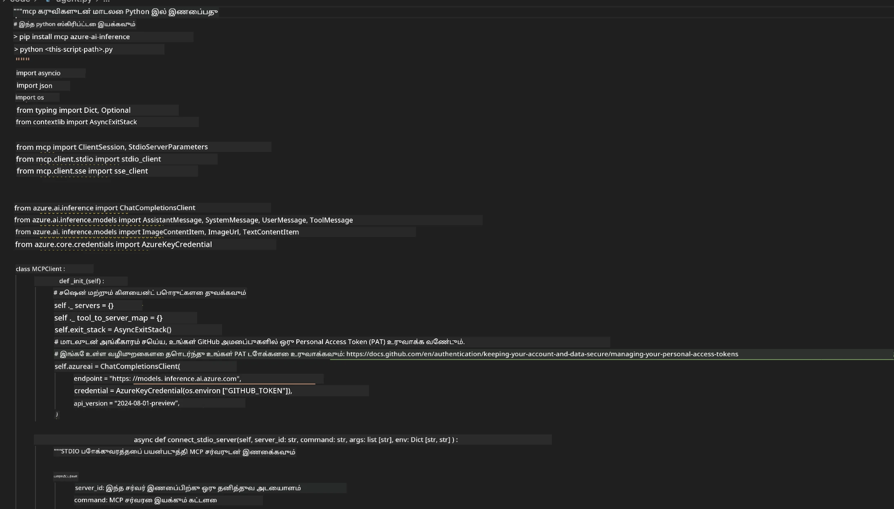

## 🎓 Module 2 சுருக்கம் மற்றும் அடுத்த படிகள்

### 🏆 சாதனை அடைந்தது: MCP ஒருங்கிணைப்பு நிபுணர்

**✅ கற்ற திறன்கள்:**
- [ ] MCP கட்டமைப்பு மற்றும் நன்மைகளைப் புரிந்துகொள்வது
- [ ] Microsoft இன் MCP சர்வர் சூழலை உலாவுதல்
- [ ] Playwright MCP ஐ AI Toolkit உடன் ஒருங்கிணைத்தல்
- [ ] மேம்பட்ட உலாவி தானியங்கும் முகவரிகளை உருவாக்குதல்
- [ ] இணைய தானியக்கத்திற்கான மேம்பட்ட உந்துதல் பொறியியல்

### 📚 கூடுதல் வளங்கள்

- **🔗 MCP Specification**: [அதிகாரப்பூர்வ நெறிமுறை ஆவணங்கள்](https://modelcontextprotocol.io/)
- **🛠️ Playwright API**: [முழுமையான முறை குறிப்பு](https://playwright.dev/docs/api/class-playwright)
- **🏢 Microsoft MCP Servers**: [நிறுவன ஒருங்கிணைப்பு வழிகாட்டி](https://github.com/microsoft/mcp-servers)
- **🌍 சமூக உதாரணங்கள்**: [MCP Server Gallery](https://github.com/modelcontextprotocol/servers)

**🎉 வாழ்த்துக்கள்!** MCP ஒர
- அடிப்படையிலிருந்து ஒரு வானிலை MCP சர்வரை உருவாக்கவும்

---

**குறிப்பு**:  
இந்த ஆவணம் [Co-op Translator](https://github.com/Azure/co-op-translator) என்ற AI மொழிபெயர்ப்பு சேவையைப் பயன்படுத்தி மொழிபெயர்க்கப்பட்டுள்ளது. நாங்கள் துல்லியத்திற்காக முயற்சிக்கின்றோம், ஆனால் தானியங்கி மொழிபெயர்ப்புகளில் பிழைகள் அல்லது தவறான தகவல்கள் இருக்கக்கூடும் என்பதை தயவுசெய்து கவனத்தில் கொள்ளுங்கள். அதன் தாய்மொழியில் உள்ள மூல ஆவணம் அதிகாரப்பூர்வ ஆதாரமாக கருதப்பட வேண்டும். முக்கியமான தகவல்களுக்கு, தொழில்முறை மனித மொழிபெயர்ப்பு பரிந்துரைக்கப்படுகிறது. இந்த மொழிபெயர்ப்பைப் பயன்படுத்துவதால் ஏற்படும் எந்த தவறான புரிதல்கள் அல்லது தவறான விளக்கங்களுக்கு நாங்கள் பொறுப்பல்ல.