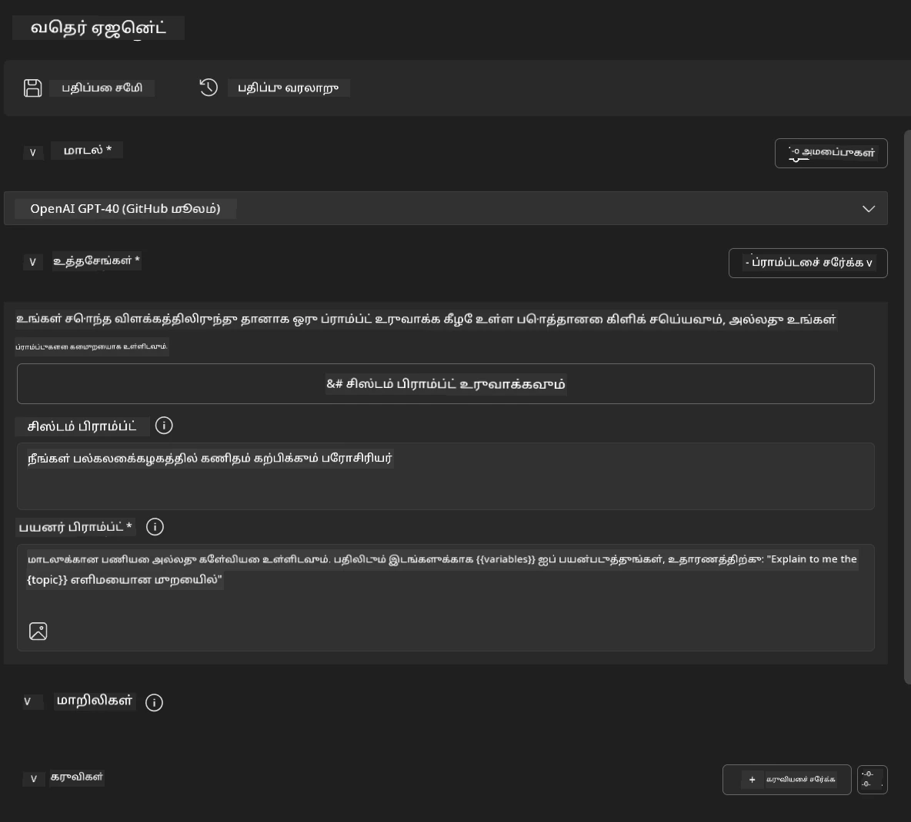
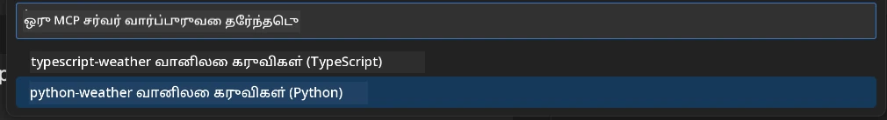
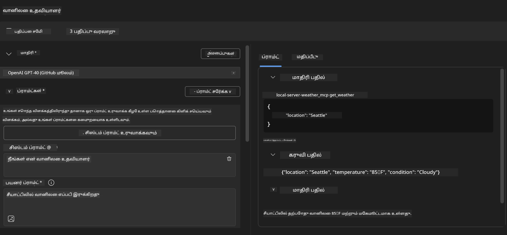
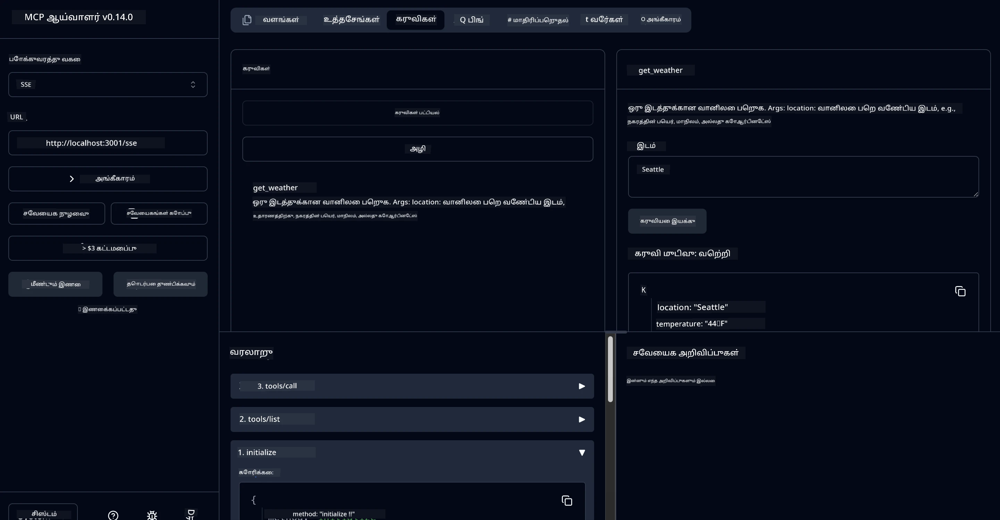

# 🔧 Module 3: AI கருவிகளுடன் மேம்பட்ட MCP மேம்பாடு


## 🎯 கற்றல் நோக்கங்கள்

இந்த பயிற்சியை முடிக்கும்போது, நீங்கள்:

- ✅ AI கருவிகளைப் பயன்படுத்தி தனிப்பயன் MCP சர்வர்களை உருவாக்க முடியும்
- ✅ MCP Python SDK (v1.9.3) ஐ அமைத்து பயன்படுத்த முடியும்
- ✅ MCP Inspector ஐ அமைத்து பிழைதிருத்தம் செய்ய பயன்படுத்த முடியும்
- ✅ Agent Builder மற்றும் Inspector சூழல்களில் MCP சர்வர்களை பிழைதிருத்த முடியும்
- ✅ மேம்பட்ட MCP சர்வர் மேம்பாட்டு பணிச்சூழல்களைப் புரிந்துகொள்ள முடியும்

## 📋 முன் தேவைகள்

- Lab 2 (MCP அடிப்படைகள்) முடித்திருக்க வேண்டும்
- AI கருவி நீட்டிப்புடன் VS Code நிறுவப்பட்டிருக்க வேண்டும்
- Python 3.10+ சூழல்
- Inspector அமைப்புக்காக Node.js மற்றும் npm

## 🏗️ நீங்கள் உருவாக்கப்போகிறீர்கள்

இந்த பயிற்சியில், நீங்கள் **வானிலை MCP சர்வர்** உருவாக்கப் போகிறீர்கள், இது:

- தனிப்பயன் MCP சர்வர் செயல்பாட்டை
- AI கருவி Agent Builder உடன் ஒருங்கிணைப்பை
- தொழில்முறை பிழைதிருத்த பணிச்சூழல்களை
- நவீன MCP SDK பயன்பாட்டு முறைகளை விளக்குகிறது

---

## 🔧 முக்கிய கூறுகள்

### 🐍 MCP Python SDK
Model Context Protocol Python SDK MCP சர்வர்களை உருவாக்க அடிப்படையாக செயல்படுகிறது. நீங்கள் பிழைதிருத்த திறன்களை மேம்படுத்திய v1.9.3 ஐப் பயன்படுத்தப் போகிறீர்கள்.

### 🔍 MCP Inspector
ஒரு சக்திவாய்ந்த பிழைதிருத்த கருவி, இது:

- நேரடி சர்வர் கண்காணிப்பு
- கருவி செயல்பாட்டு காட்சிப்படுத்தல்
- நெட்வொர்க் கோரிக்கை/பதில் ஆய்வு
- இடைமுக சோதனை சூழல்

---

## 📖 படிப்படியாக செயல்படுத்தல்

### படி 1: Agent Builder இல் WeatherAgent ஐ உருவாக்கவும்

1. **Agent Builder ஐ** VS Code இல் AI கருவி நீட்டிப்பின் மூலம் தொடங்கவும்
2. **புதிய ஏஜென்ட்டை உருவாக்கவும்** கீழ்க்காணும் அமைப்புடன்:
   - Agent Name: `WeatherAgent`



### படி 2: MCP சர்வர் திட்டத்தை தொடங்கவும்

1. **Tools** → **Add Tool** ஐ Agent Builder இல் செல்லவும்
2. **"MCP Server" ஐத் தேர்ந்தெடுக்கவும்**
3. **"Create A new MCP Server" ஐத் தேர்ந்தெடுக்கவும்**
4. **`python-weather` டெம்ப்ளேட்டைத் தேர்ந்தெடுக்கவும்**
5. **உங்கள் சர்வருக்கு பெயர் கொடுக்கவும்:** `weather_mcp`



### படி 3: திட்டத்தை திறந்து ஆய்வு செய்யவும்

1. **உருவாக்கப்பட்ட திட்டத்தை** VS Code இல் திறக்கவும்
2. **திட்ட அமைப்பை ஆய்வு செய்யவும்:**
   ```
   weather_mcp/
   ├── src/
   │   ├── __init__.py
   │   └── server.py
   ├── inspector/
   │   ├── package.json
   │   └── package-lock.json
   ├── .vscode/
   │   ├── launch.json
   │   └── tasks.json
   ├── pyproject.toml
   └── README.md
   ```


### படி 4: MCP SDK ஐ சமீபத்திய பதிப்புக்கு மேம்படுத்தவும்

> **🔍 ஏன் மேம்படுத்த வேண்டும்?** மேம்பட்ட அம்சங்கள் மற்றும் சிறந்த பிழைதிருத்த திறன்களுக்காக MCP SDK (v1.9.3) மற்றும் Inspector சேவையை (0.14.0) பயன்படுத்த விரும்புகிறோம்.

#### 4a. Python சார்ந்த பொருட்களை மேம்படுத்தவும்

**`pyproject.toml` ஐத் திருத்தவும்:** [./code/weather_mcp/pyproject.toml](../../../../10-StreamliningAIWorkflowsBuildingAnMCPServerWithAIToolkit/lab3/code/weather_mcp/pyproject.toml)

#### 4b. Inspector அமைப்பை மேம்படுத்தவும்

**`inspector/package.json` ஐத் திருத்தவும்:** [./code/weather_mcp/inspector/package.json](../../../../10-StreamliningAIWorkflowsBuildingAnMCPServerWithAIToolkit/lab3/code/weather_mcp/inspector/package.json)

#### 4c. Inspector சார்ந்த பொருட்களை மேம்படுத்தவும்

**`inspector/package-lock.json` ஐத் திருத்தவும்:** [./code/weather_mcp/inspector/package-lock.json](../../../../10-StreamliningAIWorkflowsBuildingAnMCPServerWithAIToolkit/lab3/code/weather_mcp/inspector/package-lock.json)

> **📝 குறிப்பு:** இந்த கோப்பு விரிவான சார்ந்த பொருட்களின் வரையறைகளை கொண்டுள்ளது. கீழே முக்கிய அமைப்பு கொடுக்கப்பட்டுள்ளது - முழு உள்ளடக்கம் சரியான சார்ந்த பொருட்களின் தீர்வை உறுதிசெய்கிறது.

> **⚡ முழு Package Lock:** முழு package-lock.json ~3000 வரிகளின் சார்ந்த பொருட்களின் வரையறைகளை கொண்டுள்ளது. மேலே முக்கிய அமைப்பு கொடுக்கப்பட்டுள்ளது - முழு தீர்வுக்கான கொடுக்கப்பட்ட கோப்பைப் பயன்படுத்தவும்.

### படி 5: VS Code பிழைதிருத்தத்தை அமைக்கவும்

*குறிப்பு: குறிப்பிட்ட பாதையில் உள்ள கோப்பை நகலெடுத்து, உள்ளூர் கோப்பை மாற்றவும்*

#### 5a. Launch Configuration ஐ மேம்படுத்தவும்

**`.vscode/launch.json` ஐத் திருத்தவும்:**

```json
{
  "version": "0.2.0",
  "configurations": [
    {
      "name": "Attach to Local MCP",
      "type": "debugpy",
      "request": "attach",
      "connect": {
        "host": "localhost",
        "port": 5678
      },
      "presentation": {
        "hidden": true
      },
      "internalConsoleOptions": "neverOpen",
      "postDebugTask": "Terminate All Tasks"
    },
    {
      "name": "Launch Inspector (Edge)",
      "type": "msedge",
      "request": "launch",
      "url": "http://localhost:6274?timeout=60000&serverUrl=http://localhost:3001/sse#tools",
      "cascadeTerminateToConfigurations": [
        "Attach to Local MCP"
      ],
      "presentation": {
        "hidden": true
      },
      "internalConsoleOptions": "neverOpen"
    },
    {
      "name": "Launch Inspector (Chrome)",
      "type": "chrome",
      "request": "launch",
      "url": "http://localhost:6274?timeout=60000&serverUrl=http://localhost:3001/sse#tools",
      "cascadeTerminateToConfigurations": [
        "Attach to Local MCP"
      ],
      "presentation": {
        "hidden": true
      },
      "internalConsoleOptions": "neverOpen"
    }
  ],
  "compounds": [
    {
      "name": "Debug in Agent Builder",
      "configurations": [
        "Attach to Local MCP"
      ],
      "preLaunchTask": "Open Agent Builder",
    },
    {
      "name": "Debug in Inspector (Edge)",
      "configurations": [
        "Launch Inspector (Edge)",
        "Attach to Local MCP"
      ],
      "preLaunchTask": "Start MCP Inspector",
      "stopAll": true
    },
    {
      "name": "Debug in Inspector (Chrome)",
      "configurations": [
        "Launch Inspector (Chrome)",
        "Attach to Local MCP"
      ],
      "preLaunchTask": "Start MCP Inspector",
      "stopAll": true
    }
  ]
}
```


**`.vscode/tasks.json` ஐத் திருத்தவும்:**

```
{
  "version": "2.0.0",
  "tasks": [
    {
      "label": "Start MCP Server",
      "type": "shell",
      "command": "python -m debugpy --listen 127.0.0.1:5678 src/__init__.py sse",
      "isBackground": true,
      "options": {
        "cwd": "${workspaceFolder}",
        "env": {
          "PORT": "3001"
        }
      },
      "problemMatcher": {
        "pattern": [
          {
            "regexp": "^.*$",
            "file": 0,
            "location": 1,
            "message": 2
          }
        ],
        "background": {
          "activeOnStart": true,
          "beginsPattern": ".*",
          "endsPattern": "Application startup complete|running"
        }
      }
    },
    {
      "label": "Start MCP Inspector",
      "type": "shell",
      "command": "npm run dev:inspector",
      "isBackground": true,
      "options": {
        "cwd": "${workspaceFolder}/inspector",
        "env": {
          "CLIENT_PORT": "6274",
          "SERVER_PORT": "6277",
        }
      },
      "problemMatcher": {
        "pattern": [
          {
            "regexp": "^.*$",
            "file": 0,
            "location": 1,
            "message": 2
          }
        ],
        "background": {
          "activeOnStart": true,
          "beginsPattern": "Starting MCP inspector",
          "endsPattern": "Proxy server listening on port"
        }
      },
      "dependsOn": [
        "Start MCP Server"
      ]
    },
    {
      "label": "Open Agent Builder",
      "type": "shell",
      "command": "echo ${input:openAgentBuilder}",
      "presentation": {
        "reveal": "never"
      },
      "dependsOn": [
        "Start MCP Server"
      ],
    },
    {
      "label": "Terminate All Tasks",
      "command": "echo ${input:terminate}",
      "type": "shell",
      "problemMatcher": []
    }
  ],
  "inputs": [
    {
      "id": "openAgentBuilder",
      "type": "command",
      "command": "ai-mlstudio.agentBuilder",
      "args": {
        "initialMCPs": [ "local-server-weather_mcp" ],
        "triggeredFrom": "vsc-tasks"
      }
    },
    {
      "id": "terminate",
      "type": "command",
      "command": "workbench.action.tasks.terminate",
      "args": "terminateAll"
    }
  ]
}
```


---

## 🚀 MCP சர்வரை இயக்கி சோதனை செய்யவும்

### படி 6: சார்ந்த பொருட்களை நிறுவவும்

அமைப்பில் மாற்றங்களைச் செய்த பிறகு, கீழ்க்காணும் கட்டளைகளை இயக்கவும்:

**Python சார்ந்த பொருட்களை நிறுவவும்:**
```bash
uv sync
```


**Inspector சார்ந்த பொருட்களை நிறுவவும்:**
```bash
cd inspector
npm install
```


### படி 7: Agent Builder உடன் பிழைதிருத்தம் செய்யவும்

1. **F5 அழுத்தவும்** அல்லது **"Debug in Agent Builder"** அமைப்பைப் பயன்படுத்தவும்
2. **Debug panel இல் compound configuration ஐத் தேர்ந்தெடுக்கவும்**
3. **சர்வர் தொடங்க காத்திருக்கவும்** மற்றும் Agent Builder திறக்கவும்
4. **உங்கள் Weather MCP சர்வரை** இயற்கை மொழி கேள்விகளுடன் சோதிக்கவும்

கீழே உள்ளவாறு உள்ளீட்டு உத்தரவை பயன்படுத்தவும்

SYSTEM_PROMPT

```
You are my weather assistant
```


USER_PROMPT

```
How's the weather like in Seattle
```




### படி 8: MCP Inspector உடன் பிழைதிருத்தம் செய்யவும்

1. **"Debug in Inspector"** அமைப்பைப் பயன்படுத்தவும் (Edge அல்லது Chrome)
2. **Inspector இடைமுகத்தை** `http://localhost:6274` இல் திறக்கவும்
3. **இடைமுக சோதனை சூழலை ஆராயவும்:**
   - கிடைக்கும் கருவிகளைப் பார்வையிடவும்
   - கருவி செயல்பாட்டைச் சோதிக்கவும்
   - நெட்வொர்க் கோரிக்கைகளை கண்காணிக்கவும்
   - சர்வர் பதில்களை பிழைதிருத்தம் செய்யவும்



---

## 🎯 முக்கிய கற்றல் முடிவுகள்

இந்த பயிற்சியை முடித்ததன் மூலம், நீங்கள்:

- [x] **AI கருவி டெம்ப்ளேட்டுகளைப் பயன்படுத்தி தனிப்பயன் MCP சர்வரை உருவாக்கியுள்ளீர்கள்**
- [x] **சமீபத்திய MCP SDK (v1.9.3) ஐ மேம்படுத்தியுள்ளீர்கள்** மேம்பட்ட செயல்பாட்டிற்காக
- [x] **Agent Builder மற்றும் Inspector ஆகியவற்றுக்கான தொழில்முறை பிழைதிருத்த பணிச்சூழல்களை அமைத்துள்ளீர்கள்**
- [x] **MCP Inspector ஐ அமைத்துள்ளீர்கள்** இடைமுக சர்வர் சோதனைக்காக
- [x] **MCP மேம்பாட்டுக்கான VS Code பிழைதிருத்த அமைப்புகளை கையாள்வதில் திறமை பெற்றுள்ளீர்கள்**

## 🔧 ஆராய்ந்த மேம்பட்ட அம்சங்கள்

| அம்சம் | விளக்கம் | பயன்பாட்டு நிலை |
|---------|-------------|----------|
| **MCP Python SDK v1.9.3** | சமீபத்திய நெறிமுறை செயல்பாடு | நவீன சர்வர் மேம்பாடு |
| **MCP Inspector 0.14.0** | இடைமுக பிழைதிருத்த கருவி | நேரடி சர்வர் சோதனை |
| **VS Code Debugging** | ஒருங்கிணைந்த மேம்பாட்டு சூழல் | தொழில்முறை பிழைதிருத்த பணிச்சூழல் |
| **Agent Builder Integration** | நேரடி AI கருவி இணைப்பு | முழுமையான ஏஜென்ட் சோதனை |

## 📚 கூடுதல் வளங்கள்

- [MCP Python SDK Documentation](https://modelcontextprotocol.io/docs/sdk/python)
- [AI Toolkit Extension Guide](https://code.visualstudio.com/docs/ai/ai-toolkit)
- [VS Code Debugging Documentation](https://code.visualstudio.com/docs/editor/debugging)
- [Model Context Protocol Specification](https://modelcontextprotocol.io/docs/concepts/architecture)

---

**🎉 வாழ்த்துக்கள்!** நீங்கள் Lab 3 ஐ வெற்றிகரமாக முடித்துள்ளீர்கள், மேலும் தொழில்முறை மேம்பாட்டு பணிச்சூழல்களைப் பயன்படுத்தி தனிப்பயன் MCP சர்வர்களை உருவாக்க, பிழைதிருத்தம் செய்ய மற்றும் வெளியிட முடியும்.

### 🔜 அடுத்த மாடுலுக்கு தொடருங்கள்

உங்கள் MCP திறன்களை ஒரு உண்மையான மேம்பாட்டு பணிச்சூழலில் பயன்படுத்த தயாரா? **[Module 4: Practical MCP Development - Custom GitHub Clone Server](../lab4/README.md)** ஐத் தொடருங்கள், இதில் நீங்கள்:

- GitHub repository செயல்பாடுகளை தானியங்கமாக்கும் ஒரு தயாரிப்பு MCP சர்வரை உருவாக்குவீர்கள்
- MCP மூலம் GitHub repository cloning செயல்பாட்டை செயல்படுத்துவீர்கள்
- VS Code மற்றும் GitHub Copilot Agent Mode உடன் தனிப்பயன் MCP சர்வர்களை ஒருங்கிணைப்பீர்கள்
- தயாரிப்பு சூழல்களில் MCP சர்வர்களை சோதித்து வெளியிடுவீர்கள்
- மேம்பட்ட பணிச்சூழல் தானியங்கத்திற்கான நடைமுறை வழிமுறைகளை கற்றுக்கொள்வீர்கள்

---

**அறிவிப்பு**:  
இந்த ஆவணம் [Co-op Translator](https://github.com/Azure/co-op-translator) என்ற AI மொழிபெயர்ப்பு சேவையை பயன்படுத்தி மொழிபெயர்க்கப்பட்டுள்ளது. நாங்கள் துல்லியத்திற்காக முயற்சிக்கிறோம், ஆனால் தானியங்கி மொழிபெயர்ப்புகளில் பிழைகள் அல்லது தவறுகள் இருக்கக்கூடும் என்பதை தயவுசெய்து கவனத்தில் கொள்ளவும். அதன் சொந்த மொழியில் உள்ள மூல ஆவணம் அதிகாரப்பூர்வ ஆதாரமாக கருதப்பட வேண்டும். முக்கியமான தகவல்களுக்கு, தொழில்முறை மனித மொழிபெயர்ப்பு பரிந்துரைக்கப்படுகிறது. இந்த மொழிபெயர்ப்பைப் பயன்படுத்துவதால் ஏற்படும் எந்த தவறான புரிதல்களுக்கும் அல்லது தவறான விளக்கங்களுக்கும் நாங்கள் பொறுப்பல்ல.