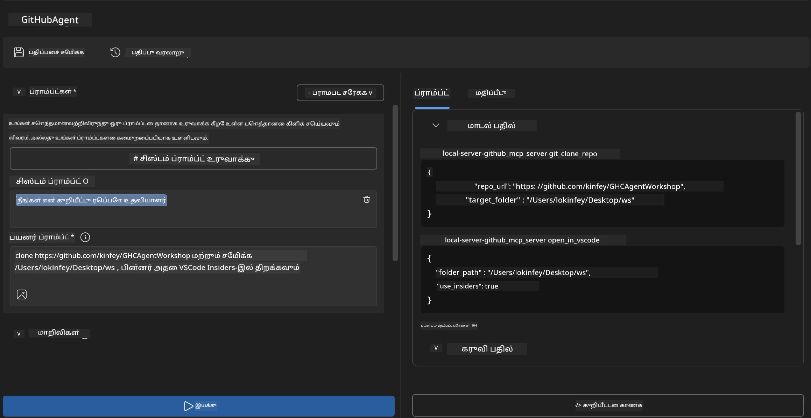
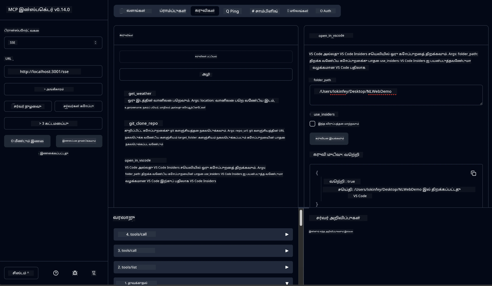

# 🐙 Module 4: செயல்முறை MCP மேம்பாடு - தனிப்பயன் GitHub கிளோன் சேவையகம்


> **⚡ விரைவான துவக்கம்:** GitHub வேர் கிளோனிங் மற்றும் VS Code ஒருங்கிணைப்பை தானாகச் செயற்கூறும், தயாரிப்புக்குத் தயாரான MCP சேவையகத்தை வெறும் 30 நிமிடங்களில் உருவாக்குங்கள்!

## 🎯 கற்றல் இலக்குகள்

இந்த பயிற்சி முடிவில், நீங்கள்:

- ✅ நிஜ உலக மேம்பாட்டு பணித் திரைகளுக்கான தனிப்பயன் MCP சேவையகத்தை உருவாக்க முடியும்
- ✅ MCP மூலம் GitHub வேர் கிளோனிங் செயல்பாட்டை நடைமுறைப்படுத்த முடியும்
- ✅ தனிப்பயன் MCP சேவையகங்களை VS Code மற்றும் Agent Builder- உடன் ஒருங்கிணைக்க முடியும்
- ✅ GitHub Copilot Agent Mode ஐ தனிப்பயன் MCP கருவிகளுடன் பயன்படுத்த முடியும்
- ✅ தயாரிப்பு சூழல்களில் தனிப்பயன் MCP சேவையகங்களை சோதித்து орналுத்த முடியும்

## 📋 முன் தேவைகள்

- லேப்கள் 1-3 (MCP அடிப்படைகள் மற்றும் மேம்பட்ட மேம்பாடு) முடித்திருக்க வேண்டும்
- GitHub Copilot சந்தா ([இலவச பதிவு கிடைக்கும்](https://github.com/github-copilot/signup))
- VS Code உடன் AI Toolkit மற்றும் GitHub Copilot விரிவீடுகள்
- Git CLI நிறுவப்பட்டு அமைக்கப்பட்டிருப்பது

## 🏗️ திட்டத்தின் கண்ணோட்டம்

### **நிஜ உலக மேம்பாட்டு சவால்**
மேம்பாட்டாளர்களாக, நாங்கள் அடிக்கடி GitHub இல் இருந்து வேர் கிளோன் செய்து அதை VS Code அல்லது VS Code Insiders-ல் திறக்கிறோம். இந்த கைக்குழந்தை செயல்முறை கீழே உள்ளது:
1. டெர்மினல்/கமாண்ட் ப்ராம்ப்ட் திறக்கவும்
2. தேவையான கோப்புறைக்குள் செல்லவும்
3. `git clone` கட்டளை இயக்கவும்
4. கிளோன் செய்யப்பட்ட கோப்புறையில் VS Code திறக்கவும்

**எங்கள் MCP தீர்வு இதை ஒரு அறிவுசார் கட்டளையாக்கிறது!**

### **நீங்கள் உருவாக்கப்போகும்து**
**GitHub Clone MCP சேவையகம்** (`git_mcp_server`) வழங்கும் வசதிகள்:

| அம்சம் | விளக்கம் | நன்மை |
|---------|-------------|---------|
| 🔄 **புத்துணர்வு கொண்ட வேர் கிளோனிங்** | GitHub வேர்களை சரிபார்ப்புடன் கிளோன் செய்கிறது | தானாகச் சிழல் சந்தைளிப்பு |
| 📁 **அறிவுசார் கோப்புறை மேலாண்மை** | கோப்புறைகளை பாதுகாப்பாக சரிபார்த்து உருவாக்குகிறது | மேல் எழுதுவதைத் தடுக்கும் |
| 🚀 **குறுக்கு தளம் VS Code ஒருங்கிணைப்பு** | திட்டங்களை VS Code/Insiders இல் திறக்கும் | வேலைப்பாட்டு ஒருங்கிணைப்பு சுலபம் |
| 🛡️ **வலுவான சிழல் கையாளல்** | நெட்வொர்க், அனுமதி மற்றும் பாதை சிக்கல்களை கையாளும் | தயாரிப்புக்குத் தக்க நம்பகத்தன்மை |

---

## 📖 படி படியாக நடைமுறை

### படி 1: Agent Builder இல் GitHub ஏஜென்டை உருவாக்குதல்

1. AI Toolkit விரிவீடு மூலம் **Agent Builder** ஐத் திறக்கவும்
2. பின்வரும் அமைப்புடன் **புதிய ஏஜென்டை உருவாக்கவும்**:
   ```
   Agent Name: GitHubAgent
   ```

3. **தனிப்பயன் MCP சேவையகத்தை துவக்கம் செய்யவும்:**
   - **கருவிகள்** → **கருவி சேர்க்கவும்** → **MCP சேவையகம்** செல்லவும்
   - **"புதிய MCP சேவையகத்தை உருவாக்கவும்"** தேர்வு செய்யவும்
   - அதிகத் தகுதிக்கான **Python வடிவமைப்பை** தேர்ந்தெடுக்கவும்
   - **சேவையக பெயர்:** `git_mcp_server`

### படி 2: GitHub Copilot Agent Mode ஐ அமைக்கவும்

1. VS Code இல் **GitHub Copilot** திறக்கவும் (Ctrl/Cmd + Shift + P → "GitHub Copilot: Open")
2. Copilot இடைமுகத்தில் **Agent மாதிரியை** தேர்ந்தெடுக்கவும்
3. மேம்பட்ட பகுத்தறிவுக்கு **Claude 3.7 மாதிரியை** தேர்வு செய்யவும்
4. கருவி அணுகலுக்காக **MCP ஒருங்கிணைப்பை** செயல்படுத்தவும்

> **💡 நுட்பக் குறிப்பு:** Claude 3.7 மேம்பட்ட மேம்பாட்டு பணித்திட்டங்களையும் சிழல் கையாளும் முறைகளையும் சிறப்பாகப் புரிந்து கொள்கிறது.

### படி 3: MCP சேவையகத்தின் முதன்மை செயல்பாட்டை நடைமுறைப்படுத்துதல்

**GitHub Copilot Agent Mode உடன் கீழ்காணும் விரிவான வாயிலுரை பயன்படுத்தவும்:**

```
Create two MCP tools with the following comprehensive requirements:

🔧 TOOL A: clone_repository
Requirements:
- Clone any GitHub repository to a specified local folder
- Return the absolute path of the successfully cloned project
- Implement comprehensive validation:
  ✓ Check if target directory already exists (return error if exists)
  ✓ Validate GitHub URL format (https://github.com/user/repo)
  ✓ Verify git command availability (prompt installation if missing)
  ✓ Handle network connectivity issues
  ✓ Provide clear error messages for all failure scenarios

🚀 TOOL B: open_in_vscode
Requirements:
- Open specified folder in VS Code or VS Code Insiders
- Cross-platform compatibility (Windows/Linux/macOS)
- Use direct application launch (not terminal commands)
- Auto-detect available VS Code installations
- Handle cases where VS Code is not installed
- Provide user-friendly error messages

Additional Requirements:
- Follow MCP 1.9.3 best practices
- Include proper type hints and documentation
- Implement logging for debugging purposes
- Add input validation for all parameters
- Include comprehensive error handling
```

### படி 4: உங்கள் MCP சேவையகத்தை சோதிக்கவும்

#### 4a. Agent Builder இல் சோதனை

1. Agent Builder இல் **டீபக் அமைப்பை** துவங்கவும்
2. உங்கள் ஏஜென்டை கீழ்காணும் சிக்கலான வாயிலுரையுடன் அமைக்கவும்:

```
SYSTEM_PROMPT:
You are my intelligent coding repository assistant. You help developers efficiently clone GitHub repositories and set up their development environment. Always provide clear feedback about operations and handle errors gracefully.
```

3. நம்பகமான பயனர் நிலைகளுடன் சோதனை செய்யவும்:

```
USER_PROMPT EXAMPLES:

Scenario : Basic Clone and Open
"Clone {Your GitHub Repo link such as https://github.com/kinfey/GHCAgentWorkshop
 } and save to {The global path you specify}, then open it with VS Code Insiders"
```



**எதிர்பார்க்கப்படும் முடிவுகள்:**
- ✅ பாதை உறுதிப்படுத்தல் உடன் வெற்றிகரமான கிளோனிங்
- ✅ தானாக VS Code துவக்கம்
- ✅ தவறான நிலைகளுக்கான தெளிவான சிழல் செய்திகள்
- ✅ கடைசி நிலை பிரச்சினைகள் சரியான கையாளல்

#### 4b. MCP Inspector இல் சோதனை




---


**🎉 வாழ்த்துக்கள்!** நீங்கள் நிஜ உலக மேம்பாட்டு பணித் திரைகள் சிக்கல்களைத் தீர்க்கும், செயல்திறன் மிகுந்த, தயாரிப்புக்குத் தயாரான MCP சேவையகத்தை வெற்றிகரமாக உருவாக்கியுள்ளீர்கள். உங்கள் தனிப்பயன் GitHub கிளோன் சேவையகம் MCP வின் சக்தியை மேம்பாடாளர்களின் உற்பத்தித்திறனை தானாகச் செய்ய மற்றும் மேம்படுத்தக் காட்டுகிறது.

### 🏆 சாதனை கைப்பற்றி:
- ✅ **MCP மேம்பாட்டு நிபுணர்** - தனிப்பயன் MCP சேவையகத்தை உருவாக்கியது
- ✅ **வேலைப்பாடுகள் தானாகச் செயலாக்கி** - மேம்பாட்டு செயல்முறைகளை எளிதாக்கியது  
- ✅ **ஒருங்கிணைப்பு நிபுணர்** - பல மேம்பாட்டு கருவிகளை இணைத்தது
- ✅ **தயாரிப்பு தயாரான** - பயன்பாட்டுக்கு உட்பட்ட தீர்வுகளை கட்டமைத்தது

---

## 🎓 பணிமன்றம் நிறைவு: Model Context Protocol உடன் உங்கள் பயணம்

**அன்புள்ள பணிமன்ற பங்கேற்பாளர்,**

Model Context Protocol பணிமன்றத்தின் அனைத்து நான்கு தொகுதிகளையும் முடித்தமைக்கு வாழ்த்துக்கள்! அடிப்படை AI Toolkit கருத்துக்களைக் கற்றிருந்து, நிஜ உலக மேம்பாட்டு சிக்கல்களைத் தீர்க்கும் தயாரிப்புக்குத் தயாரான MCP சேவையகங்களை உருவாக்குவதுவரை நீங்களும் நீண்ட பயணமாக வந்துள்ளீர்கள்.

### 🚀 உங்கள் கற்றல் பாதை சுருக்கம்:

**[தொகுதி 1](../lab1/README.md)**: நீங்கள் AI Toolkit அடிப்படைகள், மாதிரி சோதனை மற்றும் முதல் AI ஏஜென்டை உருவாக்குதல் என்பவற்றை ஆராய்ந்தீர்கள்.

**[தொகுதி 2](../lab2/README.md)**: MCP கட்டமைப்பை கற்றுக் கொண்டு Playwright MCP ஐ ஒருங்கிணைத்து, முதல் உலாவி தானாக செயலாக்க ஏஜென்டை உருவாக்கினீர்கள்.

**[தொகுதி 3](../lab3/README.md)**: Weather MCP சேவையகத்துடன் தனிப்பயன் MCP சேவையக மேம்பாட்டை மேம்படுத்தினீர்கள் மற்றும் டீபக்கிங் கருவிகளை புரிந்துகொண்டீர்கள்.

**[தொகுதி 4](../lab4/README.md)**: இப்போது நிஜ உலக GitHub வேர் பணிமுறைகளை தானாகச் செயற்கூறும் கருவியைக் கட்டமைத்துவிட்டீர்கள்.

### 🌟 நீங்கள் கற்றுக்கொண்டீர்கள்:

- ✅ **AI Toolkit பரிணாமம்**: மாதிரிகள், ஏஜென்ட்கள் மற்றும் ஒருங்கிணைப்பு முறைகள்
- ✅ **MCP கட்டமைப்பு**: கிளையன்ட்-சேவையகம் வடிவு, போக்குவரத்து நெறிமுறைகள் மற்றும் பாதுகாப்பு
- ✅ **மேம்பாட்டு கருவிகள்**: Playground இருந்து Inspector மற்றும் தயாரிப்பு வினியோகம் வரை
- ✅ **தனிப்பயன் மேம்பாடு**: உங்கள் சொந்த MCP சேவையகங்களை உருவாக்கி, சோதித்து, தயாரிப்புக்கு தயாராக்கல்
- ✅ **செயல்திறன் பயன்பாடுகள்**: AI கொண்டு நிஜ உலக பணிதுறை சிக்கல்களை தீர்ப்பது

### 🔮 அடுத்து செய்ய வேண்டியது:

1. **உங்கள் சொந்த MCP சேவையகத்தை கட்டமைக்கவும்**: உங்கள் தனிப்பட்ட பணித்துறைகளுக்கு தானாகச் செய்ய இந்த திறமைகளைப் பயன்படுத்துங்கள்
2. **MCP சமுதாயத்தில் சேரவும்**: உங்கள் படைப்புக்களை பகிர்ந்து மற்றவர்களிடையிருந்து கற்றுக்கொள்ளுங்கள்
3. **மேம்பட்ட ஒருங்கிணைப்பை ஆராயவும்**: MCP சேவையகங்களை நிறுவன அமைப்புகளுடன் இணைக்கும் பணிகள்
4. **திறந்த மூலத்தில் பங்களிக்கவும்**: MCP கருவியும் ஆவணங்களும் மேம்படுத்த உதவும்

இந்த பணிமன்றம் என்றென்றும் ஒரு தொடக்கம் मात्र. Model Context Protocol பரிணாமம் விரைவில் முன்னேறும், AI சக்தி வாய்ந்த மேம்பாட்டு கருவிகளின் முன்னணியிலேயே நீங்கள் இருக்கின்றீர்கள்.

**உங்கள் பங்களிப்புக்கும் கற்றுக் கொள்ளும் முயற்சிக்கும் நன்றி!**

இந்த பணிமன்றம் உங்கள் AI கருவிகளுடன் இணைந்து, உங்கள் மேம்பாட்டுப் பயணத்தை எப்படி மாற்றக்கூடுமென எண்ணங்களையும் விழிப்புணர்வையும் ஊட்டியிருக்கவேண்டும் என்று நம்புகிறோம்.

**உற்சாகமான குறியாக்கம்!**

---

## அடுத்து என்ன

தொகுதி 10 இல் உள்ள அனைத்து பயிற்சிகளையும் முடித்தமைக்கு வாழ்த்துக்கள்!

- மேல் செல்ல: [தொகுதி 10 கண்ணோட்டம்](../README.md)
- தொடரவும்: [தொகுதி 11: MCP சேவையக கையாண்டு பயிற்சிகள்](../../11-MCPServerHandsOnLabs/README.md)

---

<!-- CO-OP TRANSLATOR DISCLAIMER START -->
**மறுப்புரை**:  
இந்த ஆவணம் AI மொழி பெயர்ப்பு சேவையாகிய [Co-op Translator](https://github.com/Azure/co-op-translator) மூலம் மொழி பெயர்க்கப்பட்டுள்ளது. நாங்கள் துல்லியத்திற்காக முயற்சித்தாலும், தானியங்கி மொழிபெயர்ப்புகளில் பிழைகள் அல்லது தவறுகள் இருக்கக்கூடும் என்பதை கவனத்தில் கொள்ளவும். உரை நாட்டின் சொந்த மொழியிலுள்ள அசல் ஆவணம் அதிகாரப்பூர்வ மூலமாகக் கருதப்பட வேண்டும். முக்கியமான தகவல்களுக்கு, திறமையான மனித மொழிபெயர்ப்பை பரிந்துரைக்கின்றோம். இந்த மொழிபெயர்ப்பை பயன்படுத்துவதன் மூலம் ஏற்படும் எந்த தவறான புரிதல்கள் அல்லது தவறான விளக்கங்களுக்கு நாம் பொறுப்பு ஏற்கவில்லை.
<!-- CO-OP TRANSLATOR DISCLAIMER END -->