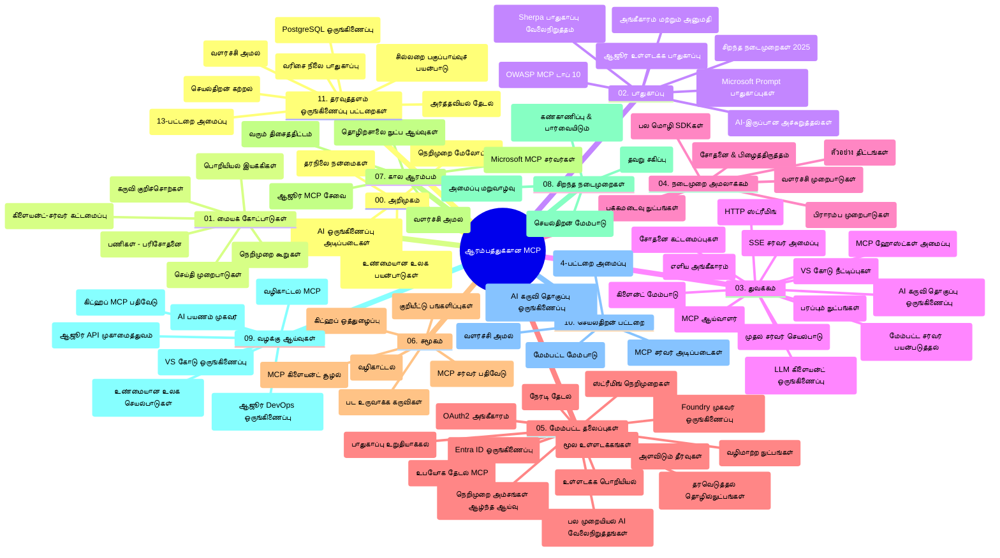

# ஆரம்பர்களுக்கான மாடல் சூழல் நெறிமுறை (MCP) - படிப்பு கையேடு

இந்த படிப்பு கையேடு "அரம்பர்களுக்கான மாடல் சூழல் நெறிமுறை (MCP)" பாடத்திட்டத்தின் அருங்காட்சியமாகும் மற்றும் ரெப்போசிடரி அமைப்பு மற்றும் உள்ளடக்கம் பற்றி ஒரு சுருக்கத்தை வழங்குகிறது. இந்த கையேடினைப் பயன்படுத்தி ரெப்போசிடரியை திறம்படச் சேகரித்து கிடைக்கக்கூடிய வளங்களினைப் பயன்படுத்துங்கள்.

## ரெப்போசிடரி சுருக்கம்

மாடல் சூழல் நெறிமுறை (MCP) என்பது AI மாதிரிகள் மற்றும் கிளையண்ட் அப் லிகேஷன்களுக்கு இடையேயான தொடர்புக்கு ஒரு சீரான தலைமை அமைப்பாகும். முதலில்Anthropic உருவாக்கிய MCP, தற்போது அதிகாரப்பூர்வ GitHub நிறுவனத்தின் மூலம் MCP சமூகத்தால் பராமரிக்கப்படுகிறது. இந்த ரெப்போசிடரி, C#, Java, JavaScript, Python மற்றும் TypeScript போன்ற மொழிகளில் நடைமுறை குறியீட்டு உதாரணங்களுடன் கூடிய விரிவான பாடத்திட்டத்தை வழங்குகிறது, இது AI மேம்பாட்டு இளைஞர்கள், அமைப்பு வடிவமைப்பாளர்கள் மற்றும் மென்பொருள் பொறியாளர்கள் ஆகியோருக்கானது.

## காட்சி பாடத்திட்ட வரைபடம்

## ரெப்போசிடரி அமைப்பு

இதன் அமைப்பு மொத்தம் பதினொன்று பிரதான பகுதிகளாக ஒழுங்குபடுத்தப்பட்டுள்ளது, ஒவ்வொன்றும் MCP இன் வெவ்வேறு அம்சங்களை கவனத்தில் எடுத்து:

1. **அறிமுகம் (00-Introduction/)**
   - மாடல் சூழல் நெறிமுறை அறிமுகம்
   - AI பைப்லைன்களில் மரபுரிமை ஏன் маңызды
   - நடைமுறை பயன்பாடுகள் மற்றும் நன்மைகள்

2. **அடிப்படை கருத்துக்கள் (01-CoreConcepts/)**
   - கிளையண்ட்-சேவையகம் கட்டமைப்பு
   - முக்கிய நெறிமுறை கூறுகள்
   - MCP இல் செய்தி பரிமாற்ற வடிவங்கள்

3. **பாதுகாப்பு (02-Security/)**
   - MCP அடிப்படையிலான அமைப்புகளில் பாதுகாப்பு அச்சுறுத்தல்கள்
   - செயல்பாடுகளை பாதுகாக்க சிறந்த நடைமுறைகள்
   - அங்கீகாரம் மற்றும் அங்கீகார திறன்கள்
   - **சுருக்கமான பாதுகாப்பு ஆவணங்கள்**:
     - MCP பாதுகாப்பு சிறந்த நடைமுறைகள் 2025
     - Azure உள்ளடக்கம் பாதுகாப்பு நடைமுறை கையேடு
     - MCP பாதுகாப்பு கட்டுப்பாடுகள் மற்றும் தொழில்நுட்பங்கள்
     - MCP சிறந்த நடைமுறைகள் விரைவு குறிப்புகள்
   - **சிறந்த பாதுகாப்பு தலைப்பு நுணுக்கங்கள்**:
     - விரைவு குறியீட்டு தாக்குதல்கள் மற்றும் கருவி நொறுக் குறைகள்
     - அமர்வு கைப்பற்றுதல் மற்றும் குழப்பப்பட்ட மேற்பார்வை பிரச்சினைகள்
     - டோக்கன் கடத்தல் பாதுகாப்பழிவு
     - அதிகபட்ச அனுமதிகள் மற்றும் அணுகல் கட்டுப்பாடு
     - AI கூறுகளுக்கான வழங்கல் சங்கிலி பாதுகாப்பு
     - Microsoft விரைவு காப்புகளுடன் ஒருங்கிணைப்பு

4. **துவக்கம் (03-GettingStarted/)**
   - சுற்றுச்சூழல் அமைப்பு மற்றும் கட்டமைப்பு
   - அடிப்படைக் MCP சேவையகம் மற்றும் கிளையண்ட் உருவாக்குதல்
   - ஏற்கனவே உள்ள செயலிகளுடன் ஒருங்கிணைப்பு
   - பாகங்கள்:
     - முதல் சேவையகம் நடைமுறை
     - கிளையண்ட் மேம்பாடு
     - LLM கிளையண்ட் ஒருங்கிணைப்பு
     - VS கோட் ஒருங்கிணைப்பு
     - சேவை அனுப்பும் நிகழ்வுகள் (SSE) சேவையகம்
     - முன்னேற்றப்பட்ட சேவையகம் பயன்பாடு
     - HTTP ஸ்ட்ரீமிங்
     - AI கருவி தொகுப்பு ஒருங்கிணைப்பு
     - சோதனை முறைகள்
     - பிரசார வழிகாட்டுதல்

5. **நடைமுறை செயலாக்கம் (04-PracticalImplementation/)**
   - பல மொழிகளில் SDK களைப் பயன்படுத்துதல்
   - பிழை சுட்டல், சோதனை மற்றும் சரிபார்ப்பு முறைகள்
   - மீண்டும் பயன்படுத்தக்கூடிய விரைவு வடிவங்கள் மற்றும் பணிநிரல் வடிவமைத்தல்
   - செயலாக்க உதாரணங்களுடன் மாதிரி திட்டங்கள்

6. **முன்னேற்றப்பட்ட தலைப்புகள் (05-AdvancedTopics/)**
   - சூழல் பொறியியல் தொழில்நுட்பங்கள்
   - Foundry முகவர் ஒருங்கிணைப்பு
   - பன்மொழி AI பணிநிரல்
   - OAuth2 அங்கீகாரம் டெமோக்கள்
   - நேரடி தேடல் திறன்கள்
   - நேரடி ஸ்ட்ரீமிங்
   - மூல சூழல்கள் செயலாக்கம்
   - வழித்தோன்றல் தந்திரங்கள்
   - மாதிரித்திருத்தம்
   - அளவு விரிவாக்கம்
   - பாதுகாப்பு கவனங்கள்
   - Entra ID பாதுகாப்பு ஒருங்கிணைப்பு
   - வலை தேடல் ஒருங்கிணைப்பு

7. **சமூக பங்களிப்புகள் (06-CommunityContributions/)**
   - குறியீடு மற்றும் ஆவணங்களை பங்களிக்கும் முறைகள்
   - GitHub மூலம் ஒத்துழைப்பு
   - சமூக சார்ந்த மேம்பாடுகள் மற்றும் கருத்துக்கள்
   - பல MCP கிளையண்டுகளைப் பயன்படுத்துதல் (Claude டெஸ்க்டோப், Cline, VSCode)
   - புகழ்பெற்ற MCP சேவைகளுடன் பணியாற்றுதல் மற்றும் பட உருவாக்கம்

8. **ஆரம்பம் எடுத்துக்கொண்ட பாடங்களிலிருந்து கற்றுக்கொள்ளல் (07-LessonsfromEarlyAdoption/)**
   - முன்னேற்றச் செய்முறைகளும் வெற்றிக் கதைகளும்
   - MCP அடிப்படையிலான தீர்வுகளை கட்டியமைத்து பிரசாரம் செய்தல்
   - போக்குகள் மற்றும் எதிர்கால திட்டமேற்பாடு
   - **Microsoft MCP சேவைகள் வழிகாட்டி**: 10 தயாரிப்பு தயாரான Microsoft MCP சேவைகள் பற்றிய விரிவான கையேடு:
     - Microsoft Learn Docs MCP சேவையகம்
     - Azure MCP சேவையகம் (15+ சிறப்பு இணைப்புகள்)
     - GitHub MCP சேவையகம்
     - Azure DevOps MCP சேவையகம்
     - MarkItDown MCP சேவையகம்
     - SQL Server MCP சேவையகம்
     - Playwright MCP சேவையகம்
     - Dev Box MCP சேவையகம்
     - Azure AI Foundry MCP சேவையகம்
     - Microsoft 365 முகவர்கள் கருவி தொகுப்பு MCP சேவையகம்

9. **சிறந்த நடைமுறைகள் (08-BestPractices/)**
   - செயல்திறன் சரிசெய்தல் மற்றும் மேம்படுத்தல்
   - MCP அமைப்புகளை பிழையில்லாதவையாக வடிவமைத்தல்
   - சோதனை மற்றும் நிலைத்தன்மை நுட்பங்கள்

10. **கேஸ் ஸ்டடீஸ் (09-CaseStudy/)**
    - **நாடாளுமன்ற தொழில்நுட்பங்களின் பல்வேறு வகைகளில் MCP நுணுக்கத்தைக் காட்டும் ஏழு விரிவான கேஸ் ஸ்டடீஸ்**:
    - **Azure AI பயண முகவர்கள்**: Azure OpenAI மற்றும் AI தேடலுடன் பயண முகவர்களின் ஒருங்கிணைப்பு
    - **Azure DevOps ஒருங்கிணைப்பு**: YouTube தரவு புதுப்பிப்புகளுடன் பணிநிரல் தானாக இயங்குதல்
    - **நேரடி ஆவண மீட்டெடுப்பு**: Python கன்சோல் கிளையண்ட் HTTP ஸ்ட்ரீமிங் உடன்
    - **இணையத் திட்டப்படம் உருவாக்கி**: Chainlit வலை செயலி உரையாடல் AI உடன்
    - **உள்ளுரையாக ஆவணங்கள்**: VS Code ஒருங்கிணைப்பு GitHub Copilot பணிநிரல்கள்
    - **Azure API மேலாண்மை**: MCP சேவையகம் உருவாக்கிய நிறுவன API ஒருங்கிணைப்பு
    - **GitHub MCP பதிவு**: சூழ்நிலைய மேம்பாடு மற்றும் முகவர் ஒருங்கிணைப்பு முனைவடிவம்
    - நிறுவன ஒருங்கிணைப்பு, மேம்படுத்துனர் விளைவுக்கும் சூழ்நிலை மேம்பாட்டிற்கான நடைமுறை உதாரணங்கள்

11. **கைமுறை தொழிற்சாலை (10-StreamliningAIWorkflowsBuildingAnMCPServerWithAIToolkit/)**
    - MCP மற்றும் AI கருவி தொகுப்பை இணைத்த முழுமையான கைமுறை தொழிற்சாலை
    - உண்மையான கருவிகளுடன் AI மாதிரிகளை இணைக்கும் அறிவார்ந்த செயலிகள் உருவாக்குதல்
    - அடிப்படை, தனிப்பயன் சேவையகம் மேம்பாடு மற்றும் தயாரிப்பு பிரசார வழிமுறைகள் ஆகிய பரிசோதனைகளும்
    - **லாப் அமைப்பு**:
      - லாப் 1: MCP சேவையகம் அடிப்படைகள்
      - லாப் 2: முன்னேற்ற MCP சேவை மேம்பாடு
      - லாப் 3: AI கருவி தொகுப்பு ஒருங்கிணைப்பு
      - லாப் 4: தயாரிப்பு பிரசாரம் மற்றும் அளவுரு
    - படிப்பறிந்துகொள்ளும் முறையில் படி படியாக ஆவணப்படுத்தல்

12. **MCP சேவையகம் தரவுத்தளம் ஒருங்கிணைப்பு லாப்கள் (11-MCPServerHandsOnLabs/)**
    - PostgreSQL ஒருங்கிணைப்புடன் தயாரிப்பு தயாரான MCP சேவைகளை கட்டும் 13-லாப் கற்றல் பாதை
    - Zava Retail பயன்பாடு மூலம் நிஜ உலக வர்த்தக பகுப்பாய்வு செயல்பாடு
    - நிறுவன தரமான வடிவமைப்புகள்: வரிசை நிலை பாதுகாப்பு (RLS), பொருள் சார்ந்த தேடல் மற்றும் பன்முக வாடிக்கையாளர் தரவு அணுகல்
    - முழு லாப் அமைப்பு:
      - லாப்கள் 00-03: அடித்தளம் - அறிமுகம், கட்டமைப்பு, பாதுகாப்பு, சுற்றுச்சூழல் அமைப்பு
      - லாப்கள் 04-06: MCP சேவையகம் கட்டமைப்பு - தரவுத்தளம் வடிவமைப்பு, MCP சேவையகம் செயல்பாடு, கருவி மேம்பாடு
      - லாப்கள் 07-09: முன்னேற்ற அம்சங்கள் - பொருள் சார்ந்த தேடல், சோதனை மற்றும் பிழையீடு, VS Code ஒருங்கிணைப்பு
      - லாப்கள் 10-12: தயாரிப்பு & சிறந்த நடைமுறைகள் - பிரசாரம், கண்காணிப்பு, மேம்படுத்தல்
    - தொழில்நுட்பங்கள்: FastMCP கட்டமைப்பு, PostgreSQL, Azure OpenAI, Azure Container Apps, Application Insights
    - கற்றல் முடிவுகள்: தயாரிப்பு தயாரான MCP சேவைகள், தரவுத்தள ஒருங்கிணைப்பு மாதிரிகள், AI இயக்கப்பட்ட பகுப்பாய்வுகள், நிறுவன பாதுகாப்பு

## கூடுதல் வளங்கள்

இந்த ரெப்போசிடரியில் ஆதரவு வளங்கள் அடக்கம்:

- **படங்கள் அடைவு**: பாடத்திட்டத்தில் பயன்படுத்தப்பட்ட வரைபடங்கள் மற்றும் விளக்கங்கள்
- **மொழிபெயர்ப்புகள்**: ஆவணங்களின் தானாக மொழிபெயர்ப்பு முறை மூலம் பல மொழித் ஆதரவு
- **அதிகாரப்பூர்வ MCP வளங்கள்**:
  - [MCP ஆவணம்](https://modelcontextprotocol.io/)
  - [MCP நெறிமுறை விவரம்](https://spec.modelcontextprotocol.io/)
  - [MCP GitHub ரெப்போசிடரி](https://github.com/modelcontextprotocol)

## இந்த ரெப்போசிடரியை எப்படி பயன்படுத்துவது

1. **வரிசையாக கற்றல்**: கட்டுரைகளை 00 முதல் 11 வரை வரிசைப்படி பின்பற்றி அமைதியான கற்றல் அனுபவம் பெறுதல்
2. **மொழி-அனைந்து கவனம்**: நீங்கள் விரும்பும் குறிப்பிட்ட மொழியில் செயலாக்கங்கள் இருக்கலாம், அவற்றைப் பார்க்கவேண்டும்
3. **நடைமுறை செயலாக்கம்**: "துவக்கம்" பகுதியில் சுற்றுச்சூழலை அமைத்து முதல் MCP சேவையகம் மற்றும் கிளையண்ட் உருவாக்க தொடங்குங்கள்
4. **முன்னேற்ற ஆய்வு**: அடிப்படைகளை நன்கு அறிந்த பிறகு முன்னேற்ற தலைப்புகளில் நுழைந்து அறிவை விரிவாக்குங்கள்
5. **சமூக ஈடுபாடு**: GitHub விவாதங்கள் மற்றும் Discord சேனல்களில் MCP சமூகத்தில் சேர்ந்து நிபுணர்களுடன் மற்றும் பிற மேம்பாட்டாளர்களுடன் தொடர்புகொள்

## MCP கிளையண்டுகள் மற்றும் கருவிகள்

பாடத்திட்டத்தில் பல MCP கிளையண்டுகள் மற்றும் கருவிகள் முன்னிலைப்படுத்தப்பட்டுள்ளன:

1. **அதிகாரப்பூர்வ கிளையண்டுகள்**:
   - Visual Studio Code
   - Visual Studio Code இல் MCP
   - Claude டெஸ்க்டோப்
   - VSCode இல் Claude
   - Claude API

2. **சமூக கிளையண்டுகள்**:
   - Cline (டெர்மினல் அடிப்படையிலானது)
   - Cursor (குறியீடு ஆசிரியர்)
   - ChatMCP
   - Windsurf

3. **MCP மேலாண்மை கருவிகள்**:
   - MCP CLI
   - MCP மேலாளர்
   - MCP இணைப்பாளி
   - MCP வழிசெலுத்தி

## பிரபல MCP சேவையகங்கள்

இந்த ரெப்போசிடரி பல MCP சேவையகங்களை அறிமுகப்படுத்துகிறது:

1. **அதிகாரப்பூர்வ Microsoft MCP சேவையகங்கள்**:
   - Microsoft Learn Docs MCP சேவையகம்
   - Azure MCP சேவையகம் (15+ சிறப்பு இணைப்புகள்)
   - GitHub MCP சேவையகம்
   - Azure DevOps MCP சேவையகம்
   - MarkItDown MCP சேவையகம்
   - SQL Server MCP சேவையகம்
   - Playwright MCP சேவையகம்
   - Dev Box MCP சேவையகம்
   - Azure AI Foundry MCP சேவையகம்
   - Microsoft 365 முகவர்கள் கருவி தொகுப்பு MCP சேவையகம்

2. **அதிகாரப்பூர்வ குறிப்பு சேவையகங்கள்**:
   - கோப்பு அமைப்பு
   - பெறுதல்
   - நினைவகம்
   - தொடர்ச்சியான சிந்தனை

3. **பட உருவாக்கம்**:
   - Azure OpenAI DALL-E 3
   - Stable Diffusion WebUI
   - Replicate

4. **மேம்பாட்டு கருவிகள்**:
   - Git MCP
   - டெர்மினல் கட்டுப்பாடு
   - குறியீடு உதவியாளர்

5. **சிறப்பு சேவையகங்கள்**:
   - Salesforce
   - Microsoft Teams
   - Jira & Confluence

## பங்களிப்பு

இந்த ரெப்போசிடரி சமூகத்திலிருந்து பங்களிப்புகளை வரவேற்கிறது. MCP சூழ்நிலைமாற்க்கான பங்களிப்பு முறைகளைத் தெரிந்து கொள்ள சமூக பங்களிப்புகள் பகுதியில் பாருங்கள்.

----

*இந்த படிப்பு கையேடு 2026 பிப் 5-ஆம் திகதி புதுப்பிக்கப்பட்டது, MCP நெறிமுறை 2025-11-25 இன் சமீபத்திய பதிப்பை பிரதிபலிக்கிறது மற்றும் அதே நாளில் உள்ள ரெப்போசிடரி மேலதிகங்கள் பற்றிய சுருக்கத்தைக் கொண்டுள்ளது. ரெப்போசிடரி உள்ளடக்கம் அந்நாளுக்குப் பிறகு புதுப்பிக்கப்படக்கூடும்.*

---

<!-- CO-OP TRANSLATOR DISCLAIMER START -->
**உறுதிப்பத்திரம்**:  
இந்தக் கோப்பு [Co-op Translator](https://github.com/Azure/co-op-translator) என்ற செயற்கை நுண்ணறிவு மொழிபெயர்ப்பு சேவையை பயன்படுத்தி மொழிபெயர்க்கப்பட்டுள்ளது. நாங்கள் துல்லியத்திற்கு முயற்சி செய்கிறோம் என்றாலும், தானியங்கி மொழிபெயர்ப்புகளில் பிழைகள் அல்லது தவறுகள் இருக்கக்கூடும் என்பதை தயவுசெய்து கவனிக்கவும். அசல் நூல் அதன் தாய்மொழியில் அதிகாரப்பூர்வ ஆதாரமாக கருதப்பட வேண்டும். முக்கியமான தகவல்களுக்கு, மனுஷன் பரிசோதனையுடன் கூடிய மொழிபெயர்ப்பை பரிந்துரைக்கிறோம். இந்த மொழிபெயர்ப்பைப் பயன்படுத்துவதில் ஏற்படும் எந்தவொரு தவிர்க்க முடியாத தவறுகள் அல்லது தவறான புரிதல்களுக்கு நாங்கள் பொறுப்புக் கொள்ளமாட்டோம்.
<!-- CO-OP TRANSLATOR DISCLAIMER END -->