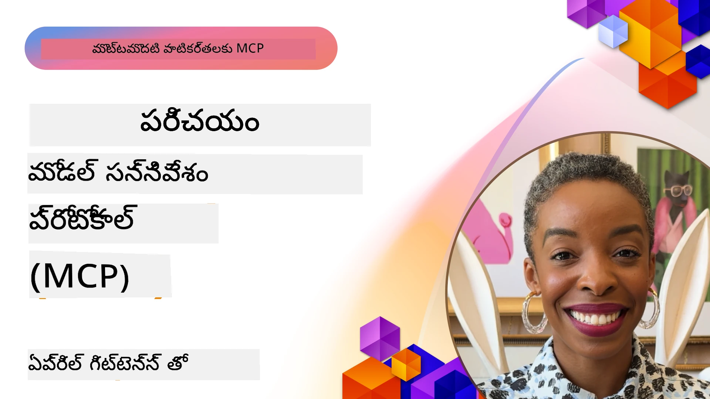
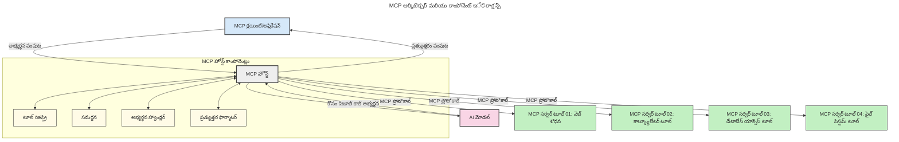
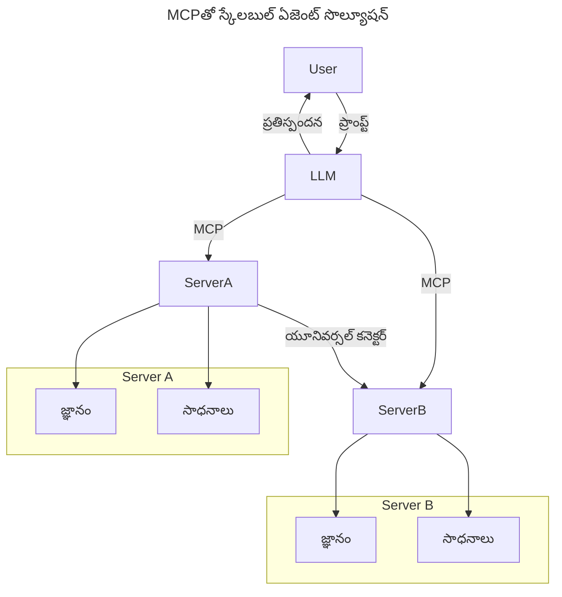
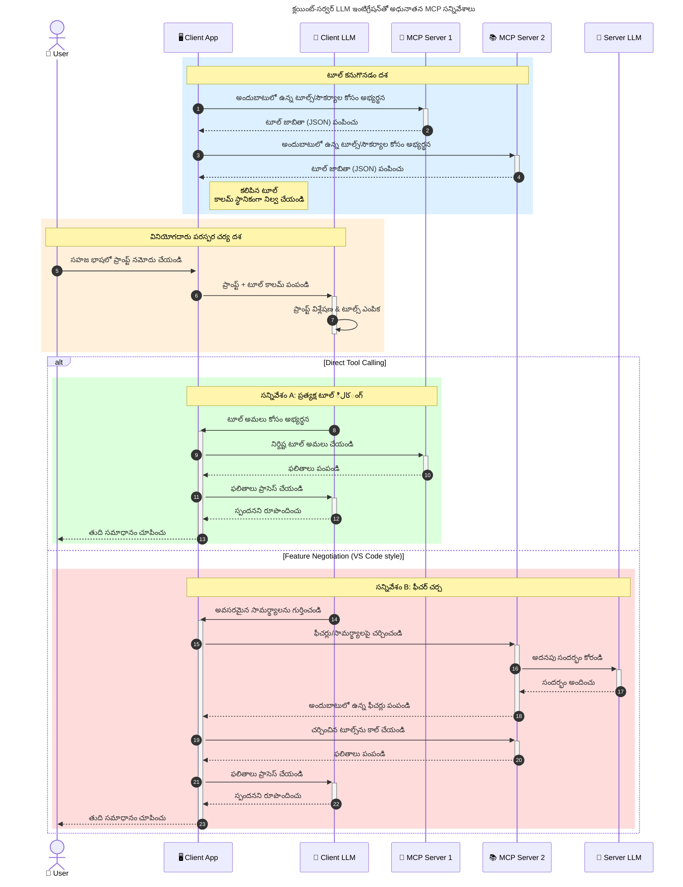

# మోడల్ కాన్టెక్స్ట్ ప్రోటోకాల్ (MCP) పరిచయం: స్కేలబుల్ AI అప్లికేషన్ల కోసం ఇది ఎందుకు ముఖ్యమైనది

_(ఈ పాఠం వీడియోను చూడడానికి పై చిత్రం క్లిక్ చేయండి)_

జెనరేటివ్ AI అప్లికేషన్లు ఉపయోగకర్తకు సహజ భాషా ప్రాంప్ట్లతో యాప్‌తో పరస్పరం చేయడానికి అవకాశం ఇస్తూ మంచి అభివృద్ధి అడుగు వేస్తున్నాయి. అయినప్పటికీ, అలాంటి యాప్‌లలో ఎక్కువ సమయం మరియు వనరులు పెట్టుబడి పెడుతున్నప్పుడు, మీరు ఫంక్షనాలిటీలను మరియు వనరులను సులభంగా కలపగలరని నిర్ధారించుకోవాలి, తద్వారా దాన్ని విస్తరించడం సులభం అవుతుంది, మీ యాప్ ఒక కంటే ఎక్కువ మోడల్ ఉపయోగించబడే అవకాశాన్ని నిర్వహించగలదు మరియు వివిధ మోడల్ జటిలతలను ఎదుర్కొనే సామర్థ్యం కలిగి ఉంటుంది. సంక్షిప్తంగా, జెన్ AI యాప్‌ల నిర్మాణం ప్రారంభంలో సులభమైనదే కానీ అవి పెరుగుతున్న కొద్దీ మరియు క్లిష్టంగా మారుతున్న కొద్దీ, మీరు ఆర్కిటెక్చర్ను నిర్వచించడం ప్రారంభించాలి మరియు మీ యాప్‌లు సుస్పష్టంగా నిర్మించబడేందుకు సాధారణ ప్రమాణంపై ఆధారపడవలసి ఉంటుంది. ఇక్కడ MCP వస్తుంది దాన్ని సమర్ధవంతంగా వ్యూహీకరించి ఒక ప్రమాణాన్ని అందిస్తుంది.

---

## **🔍 మోడల్ కాన్టెక్స్ట్ ప్రోటోకాల్ (MCP) ఏమిటి?**

**మోడల్ కాన్టెక్స్ట్ ప్రోటోకాల్ (MCP)** అనేది భారీ భాషా నమూనాలు (LLMs) బాహ్య టూల్స్, APIs, మరియు డేటా మూలాలతో సజావుగా పరస్పరం చేయడానికి అనుమతించే ఒక **స్వతంత్ర, ప్రమాణమైన ఇంటర్‌ఫేస్**. ఇది AI మోడల్ ఫంక్షనాలిటీని వారి శిక్షణ డేటా కంటే ఎక్కువగా పెంపొందించడానికి సతత వాస్తవిక ఆర్కిటెక్చర్‌ని అందిస్తోంది, తద్వారా అవి తెలివైన, స్కేలబుల్ మరియు ప్రతిస్పందన ఘనత కలిగిన AI వ్యవస్థలుగా మారుతాయి.

---

## **🎯 AI లో ప్రమాణీకరణ ఎందుకు కీలకం?**

జెనరేటివ్ AI అప్లికేషన్లు మరింత క్లిష్టంగా మారుతున్నందున, **స్కేలబిలిటీ, విస్తరణ సామర్థ్యం, పర్యవేక్షణ,** మరియు **వెండర్ లాక్-ఇన్ నివారణ** వంటి విషయాల్లో ప్రమాణాలు అవలంభించడం అవసరం. MCP ఈ అవసరాలను ఈ క్రింద వాటితో తీన్చుతుంది:

- మోడల్-టూల్ ఇంటిగ్రేషన్లని ఏకీకరించడం  
- ఒకసారి నిర్మించిన గొలుసు పద్ధతుల తగ్గింపు  
- వివిధ వెండర్ల నుండి ఉన్న మోడల్స్ ఒకే వీధిలో కలిసి ఉండటం

**గమనిక:** MCP ను ఓపెన్ స్టాండర్డ్ గా ప్రకటించినప్పటికీ, IEEE, IETF, W3C, ISO లేదా ఇతర ఏ సంప్రదింపుల సంస్థ ద్వారా ప్రమాణీకరించాలి అన్న యాజమాన్యం లేదు.

---

## **📚 నేర్చుకునే లక్ష్యాలు**

ఈ వ్యాసం చివరికి మీరు చేయగలుగుతారు:

- **మోడల్ కాన్టెక్స్ట్ ప్రోటోకాల్ (MCP)** ను నిర్వచించడం మరియు దాని వినియోగాలపై అవగాహన పొందడం  
- MCP ఎలా మోడల్-టూల్ కమ్యూనికేషన్‌ ను ప్రమాణీకరించిందో అర్థం చేసుకోవడం  
- MCP ఆర్కిటెక్చర్ యొక్క ప్రధాన భాగాలను గుర్తించడం  
- MCPని ఎంటర్ప్రైజ్ మరియు డెవలప్‌మెంట్ సందర్భాలలో ఎలా ఉపయోగిస్తారో అన్వేషించడం  

---

## **💡 మోడల్ కాన్టెక్స్ట్ ప్రోటోకాల్ (MCP) ద్వారా చోటు మారింది**

### **🔗 MCP AI పరస్పరక్రియల లో విభజనను పరిష్కరిస్తుంది**

MCP వచ్చిన ముందు, మోడల్స్ తో టూల్స్ ని కలపడమే అంటే:

- ప్రతీ టూల్-మోడల్ జంటకి ప్రత్యేక కోడ్  
- ప్రతి వెండర్ కి అనన్య APIs  
- తరచూ అప్‌డేట్ల వల్ల విఘ్నాలు కలగటం  
- మరిన్ని టూల్స్ తో స్కేలబిలిటీ తక్కువగా ఉండటం  

### **✅ MCP ప్రమాణీకరణ లాభాలు**

| **లాభం**                  | **వివరణ**                                                                 |
|----------------------------|---------------------------------------------------------------------------|
| అంతర్‌ప్రచురణ (Interoperability) | వివిధ వెండర్ల టూల్స్ తో LLMs సజావుగా పని చేయగలగడం                     |
| సుదృఢత (Consistency)               | ప్లాట్‌ఫామ్‌లు మరియు టూల్స్ అంతటా సాదృశ్య ప్రవర్తన                         |
| పునర్వినియోగం (Reusability)         | ఒక్కసారి టూల్ నిర్మించి ప్రాజెక్టులు మరియు సిస్టమ్స్ అంతటా ఉపయోగించడం     |
| అభివృద్ధి వేగవంతం (Accelerated Development) | ప్రమాణీకృత, ప్లగ్-అండ్-ప్లే ఇంటర్‌ఫేసుల వలన డెవ్ సమయం తగ్గించడం         |

---

## **🧱 MCP సమగ్ర ఆర్కిటెక్చర్ అవలోకనం**

MCP ఒక **క్లయింట్-సర్వర్ మోడల్** పై పనిచేస్తుంది, ఇందులో:

- **MCP హోస్ట్స్** AI మోడల్స్ నడిపిస్తారు  
- **MCP క్లయింట్స్** అభ్యర్థనలు ప్రారంభిస్తారు  
- **MCP సర్వర్లు** కాన్టెక్స్ట్, టూల్స్ మరియు సామర్థ్యాలు అందిస్తాయి  

### **ముఖ్య భాగాలు:**

- **వనరులు (Resources)** – మోడల్స్ కోసం స్థిర లేదా డైనమిక్ డేటా  
- **ప్రాంప్ట్స్ (Prompts)** – గైడ్ చేసిన జనరేషన్ కోసం ప్రీడిఫైండ్ వర్క్‌ఫ్లోలు  
- **టూల్స్ (Tools)** – శోధన, గణనల వంటి అమలు ఫంక్షన్లు  
- **నమూనా (Sampling)** – పునరావృత పరస్పర చర్యల ద్వారా ఏజెన్సీ ప్రవర్తన  
- **అభ్యర్థన (Elicitation)** – వినియోగదారుల నుండి డేటా సేకరణకు సర్వర్-ప్రారంభిత అభ్యర్థనలు  
- **రూట్స్ (Roots)** – సర్వర్ యాక్సెస్ నియంత్రణ కోసం ఫైల్ సిస్టమ్ సరిహద్దులు  

### **ప్రోటోకాల్ ఆర్కిటెక్చర్:**

MCP రెండు-పట్టాల ఆర్కిటెక్చర్ ఉపయోగిస్తుంది:  
- **డేటా లేయర్**: JSON-RPC 2.0 ఆధారిత కమ్యూనికేషన్, లైఫ్‌సైకిల్ నిర్వహణతో మరియు ప్రిమిటివ్స్‌తో  
- **ట్రాన్స్పోర్ట్ లేయర్**: STDIO (స్థానికంగా) మరియు Streamable HTTP తో SSE (దూరంగా) కమ్యూనికేషన్ ఛానెల్స్  

---

## MCP సర్వర్లు ఎలా పనిచేస్తాయి

MCP సర్వర్లు ఈ విధంగా పనిచేస్తాయి:

- **అభ్యర్థన ప్రవాహం**:  
    1. చివరిదిన వినియోగదారు లేదా వారి తరఫున పనిచేసే సాఫ్ట్‌వేర్ అభ్యర్థన ప్రారంభిస్తుంది.  
    2. **MCP క్లయింట్** అభ్యర్థనను **MCP హోస్ట్** కు పంపిస్తుంది, ఇది AI మోడల్ రంటైమ్ నిర్వహిస్తుంది.  
    3. **AI మోడల్** వినియోగదారు ప్రాంప్ట్ అందుకొని ఒకటి లేదా అధిక టూల్ కాల్ల్స్ ద్వారా బాహ్య టూల్స్ లేదా డేటా యాక్సెస్ కోరవచ్చు.  
    4. **MCP హోస్ట్**, మోడల్ కదిలిపోయేలా కాకుండా, సార్వత్రిక ప్రమాణాలను ఉపయోగించి సరైన **MCP సర్వర్(లు)** తో కమ్యూనికేట్ చేస్తుంది.  
- **MCP హోస్ట్ ఫంక్షనాలిటీ**:  
    - **టూల్ రిజిస్ట్రి**: అందుబాటు టూల్స్ మరియు అవగాహనలను నిర్వహిస్తుంది.  
    - **ఆథెంటికేషన్**: టూల్ యాక్సెస్ అనుమతులను ధృవీకరిస్తుంది.  
    - **అభ్యర్థన హ్యాండ్లర్**: మోడల్ నుండే వచ్చిన టూల్ అభ్యర్థనలను ప్రాసెస్ చేస్తుంది.  
    - **ప్రతిస్పందన ఫార్మాటర్**: మోడల్ అర్థం చేసుకునే ఫార్మాట్ లో టూల్ అవుట్‌పుట్‌ను నిర్మిస్తుంది.  
- **MCP సర్వర్ ఎగ్జిక్యూషన్**:  
    - **MCP హోస్ట్** టూల్ కాల్లను ఒకటి లేదా ఎక్కువ **MCP సర్వర్(లు)** కు రూట్ చేస్తుంది, వీరిలో ప్రత్యేక పనులున్నట్లు (ఉదా: శోధన, గణనలు, డేటాబేస్ ప్రశ్నలు).  
    - **MCP సర్వర్లు** తమ సంబంధిత ఆపరేషన్‌లను నిర్వహించి ఫలితాలను ఒకే ఫార్మాట్ లో MCP హోస్ట్ కు తిరిగి పంపుతాయి.  
    - **MCP హోస్ట్** ఫలితాలను ఫార్మాట్ చేసి AI మోడల్ కు రీలే చేస్తుంది.  
- **ప్రతిస్పందన పూర్తి**:  
    - **AI మోడల్** టూల్ అవుట్‌పుట్‌లను ఒక తుది ప్రతిస్పందనగా జత చేస్తుంది.  
    - **MCP హోస్ట్** ఈ ప్రతిస్పందనను **MCP క్లయింట్** కు పంపించి, అది చివరి వినియోగదారు లేదా కాలింగ్ సాఫ్ట్‌వేర్ కు అందిస్తుంది.  

## 👨‍💻 MCP సర్వర్ ఎలా నిర్మించాలి (ఉదాహరణలతో)

MCP సర్వర్లు LLM సామర్థ్యాలను డేటా మరియు ఫంక్షనాలిటీ అందించడం ద్వారా విస్తరించడానికి అనుమతిస్తాయి.

ఇప్పుడే ప్రయత్నించాలనుకున్తున్నారా? వివిధ భాషల/స్టాక్‌లలో సాదా MCP సర్వర్లు సృష్టించే ఉదాహరణలతో భాషా మరియు/లేదా స్టాక్ నిర్దిష్ట SDKలు ఇక్కడ ఉన్నాయి:

- **Python SDK**: https://github.com/modelcontextprotocol/python-sdk

- **TypeScript SDK**: https://github.com/modelcontextprotocol/typescript-sdk

- **Java SDK**: https://github.com/modelcontextprotocol/java-sdk

- **C#/.NET SDK**: https://github.com/modelcontextprotocol/csharp-sdk

## 🌍 MCP వినియోగాల్లో నిజ-ప్రపంచ ఉదాహరణలు

MCP వివిధ AI సామర్థ్యాలను విస్తరించడం ద్వారా అనేక అప్లికేషన్లకు అనుమతిస్తుంది:

| **అప్లికేషన్**               | **వివరణ**                                                                 |
|------------------------------|---------------------------------------------------------------------------|
| ఎంటర్ప్రైజ్ డేటా ఇంటిగ్రేషన్ | LLMs ను డేటాబేసులు, CRMలు లేదా అంతర్గత టూల్స్ తో కలపడం                  |
| ఏజెంటిక్ AI వ్యవస్థలు          | టూల్ యాక్సెస్ మరియు నిర్ణయ-తయారీ వర్క్‌ఫ్లోలతో స్వయంచాలక ఏజెంట్లను సృజించడం  |
| బహుముఖ అప్లికేషన్లు          | ఒకే ఐక్య AI యాప్‌లో టెక్ట్స్, ఇమేజ్, ఆడియో టూల్స్ కలపడం                   |
| రియల్-టైమ్ డేటా ఇంటిగ్రేషన్    | AI పరస్పర చర్యలలో తాజా డేటా చేరవేసుకొని మరింత ఖచ్చితమైన, ప్రస్తుత అవుట్‌పుట్‌లు పొందడం|

### 🧠 MCP = AI పరస్పర క్రియల సర్వత్ర ప్రామాణికం

మోడల్ కాన్టెక్స్ట్ ప్రోటోకాల్ (MCP) AI పరస్పర చర్యల కోసం సర్వత్ర ప్రామాణికంగా మారింది, USB-C ఫిజికల్ కనెక్షన్ల కోసం చేసినలా. AI ప్రపంచంలో MCP సజావుగా ఇంటర్‌ఫేస్ అందిస్తుంది, మోడల్స్ (క్లయింట్లు) ను బాహ్య టూల్స్, డేటా ప్రొవైడర్స్ (సర్వర్లు) తో చక్కగా కలుపుతుంది. అందువల్ల ప్రతి API లేదా డేటా మూలం కోసం విభిన్న, వ్యక్తిగత ప్రోటోకాల్స్ అవసరం ఉండదు.

MCP లో, MCP సపోర్ట్ చేసే టూల్ (MCP సర్వర్ అనబడుతుంది) ఏకీకృత ప్రమాణం అనుసరిస్తుంది. వీటి ద్వారా టూల్స్ లేదా చర్యలను జాబితా చేసి అవి అవసరమైనప్పుడు ఏఐ ఏజెంట్ ద్వారా అమలు చేయబడతాయి. MCP ని మద్దతు ఇచ్చే AI ఏజెంట్ ప్లాట్‌ఫామ్లు అందుబాటు టూల్స్ ను కనుగొని ప్రోటోకాల్ ద్వారా వాటిని ప్రేరేపించగలవు.

### 💡 జ్ఞానాన్ని సులభంగా యాక్సెస్ చేస్తుంది

టూల్స్ మాత్రమే కాకుండా, MCP జ్ఞానాన్ని యాక్సెస్ చేయడానికీ సహకరిస్తుంది. ఇది పెద్ద భాషా నమూనాలకు (LLMs) వివిధ డేటా మూలాలని లింక్ చేసి సందర్భాన్ని అందించగలదు. ఉదాహరణకు, ఒక MCP సర్వర్ కంపెనీ డాక్యుమెంట్ల రిపాజిటరీని సూచించవచ్చు, ఏజెంట్లు అవసరమైన సమాచారం అవతలికి తీసుకొనేటప్పుడు. మరొక సర్వర్ ప్రత్యేక చర్యలు అర్థం చేస్తున్నది: ఇమెయిల్స్ పంపడం లేదా రికార్డులను నవీకరించడం. ఏజెంట్ దృష్టిలో వీటివి వాడుకునే టూల్స్ మాత్రమే—ఇంకొన్ని టూల్స్ డేటాను (జ్ఞాన పరిచయం) అందిస్తాయి, మరికొన్ని చర్యలను నిర్వహిస్తాయి. MCP రెండింటినీ సమర్థవంతంగా నిర్వహిస్తుంది.

ఏజెంట్ MCP సర్వర్ కి కనెక్ట్ అయ్యేంతలోనే సర్వర్ అందుబాటులో ఉన్న సామర్థ్యాలు మరియు డేటాను ప్రమాణ ఫార్మాట్ ద్వారా నేర్చుకుంటుంది. ఈ ప్రమాణీకరణ డైనమిక్ టూల్ అందుబాటును అందిస్తుంది. ఉదాహరణకు, ఏజెంట్ సిస్టమ్ లో కొత్త MCP సర్వర్ జత చేయడం ద్వారా దాని ఫంక్షన్లు వెంటనే ఉపయోగించుకోవచ్చు, ఏ ఎడపొయిన అనుకూలీకరణ అవసరం లేదు.

ఈ సులభతర సమగ్రత క్రింది చిత్రంలో చూపిన విధంగా సరళమైన సంయోగాన్ని కలిగి, సర్వర్లు టూల్స్ మరియు జ్ఞానాన్ని అందించడం ద్వారా సిస్టమ్స్ మధ్య సహజమైన మైలుబద్ధత కలిగిస్తుంది.

### 👉 ఉదాహరణ: స్కేలబుల్ ఏజెంట్ సొల్యూషన్

యూనివర్సల్ కనెక్టర్ MCP సర్వర్లు ఒకదానితో ఒకటి కమ్యూనికేట్ చేసి సామర్థ్యాలను పంచుకోవడానికి అనుమతిస్తుంది, దీని వల్ల ServerA ServerB కి పనులు అప్పగించి వాటి టూల్స్ మరియు జ్ఞానాన్ని యాక్సెస్ చేయవచ్చు. ఇది సర్వర్ల మధ్య టూల్స్ మరియు డేటాను ఫెడరేట్ చేస్తుంది, స్కేలబుల్ మరియు మాడ్యులర్ ఏజెంట్ ఆర్కిటెక్చర్లకు మద్దతు ఇస్తుంది. MCP టూల్ ఎక్స్‌పోజర్‌ను ప్రమాణీకరించినందున, ఏజెంట్లు సర్వర్ల మధ్య డైనమిక్‌గా టూల్స్ కనుగొని రూట్ చేయగలవు, హార్డ్‌కోడ్ చేసిన ఇంటిగ్రేషన్ల అవసరం లేదు.

టూల్ మరియు జ్ఞాన ఫెడరేషన్: సర్వర్ల అంతర్లీనంగా టూల్స్ మరియు డేటా యాక్సెస్ చేయడం, మరింత స్కేలబుల్ మరియు మాడ్యులర్ ఏజెంటిక్ ఆర్కిటెక్చర్లను సాధ్యముగా చేస్తుంది.

### 🔄 క్లయింట్-సైడ్ LLM ఇంటిగ్రేషన్ తో అధునాతన MCP పరిస్థలు

బేసిక్ MCP ఆర్కిటెక్చర్ దాటి, క్లయింట్ మరియు సర్వర్ ఇద్దరిలో LLMలు ఉంటే మరింత అభివృద్ధి అయిన పరిస్థలు ఉంటాయి, ఇవి మరింత సొఫిస్టికేటెడ్ పరస్పర కరుటలకు అనుమతిస్తాయి. క్రింది డయాగ్రామ్‌లో, **క్లయింట్ యాప్** ఒక IDE అవుతూ, అక్కడ LLM ఉపయోగించుకునే బహుళ MCP టూల్స్ అందుబాటులో ఉంటాయి:

## 🔐 MCP ప్రయోజనాల ప్రాక్టికల్ ఉపయోగాలు

ఇక్కడ MCP ఉపయోగంతో ప్రాక్టికల్ లాభాలు ఉన్నాయి:

- **తాజా సమాచారం:** మోడల్స్ తమ శిక్షణ డేటా కంటే క్రొత్త సమాచారం యాక్సెస్ చేసుకోగలవు  
- **సామర్థ్యం విస్తరణ:** మోడల్స్ శిక్షణ పొందని ప్రత్యేక టాస్కులకు టూల్స్ వాడుకోవచ్చు  
- **తప్పుదోవల తగ్గింపు:** బాహ్య డేటా మూలాలు వాస్తవిక పునాదిని అందిస్తాయి  
- **గోప్యత:** సున్నితమైన డేటా ప్రాంప్ట్‌లలో నింపకుండా సురక్షిత వాతావరణాల్లో ఉంచవచ్చు  

## 📌 ముఖ్యమైన సారాంశాలు

MCP ఉపయోగించడంలో ముఖ్యమైన అంశాలు:

- **MCP** AI మోడల్స్ టూల్స్ మరియు డేటాతో ఎలా పరస్పరం అయ్యేవి అనేదే ప్రమాణీకరించబడింది  
- విస్తరణ, సుదృఢత మరియు అంతర్‌ప్రచురణను ప్రోత్సహిస్తుంది  
- MCP అభివృద్ధి సమయాన్ని తగ్గించి విశ్వసనీయతను మెరుగుపరుస్తుంది మరియు మోడల్ సామర్థ్యాలను విస్తరించడంలో సహాయపడుతుంది  
- క్లయింట్-సర్వర్ ఆర్కిటెక్చర్ సౌకర్యవంతమైన, విస్తరించగల AI అప్లికేషన్లను సృష్టించడానికి వీలు కల్పిస్తుంది  

## 🧠 వ్యాయామం

మీరు అభివృద్ధి చేయాలని భావిస్తున్న AI అప్లికేషన్ గురించి ఆలోచించండి.

- దాని సామర్థ్యాలను పెంచడానికి ఏ **బాహ్య టూల్స్ లేదా డేటా** ఉపయోగపడతాయి?  
- MCP ఇంటిగ్రేషన్‌ను ఎలా **సులభతరం మరియు విశ్వసనీయంగా** మార్చగలదు?  

## అదనపు వనరులు

- [MCP GitHub రిపోజిటరీ](https://github.com/modelcontextprotocol)

## తదుపరి

తరువాత: [అధ్యాయం 1: ప్రధాన భావనలు](../01-CoreConcepts/README.md)

---

<!-- CO-OP TRANSLATOR DISCLAIMER START -->
**తప్పుడు వివరణ**:
ఈ డాక్యుమెంట్‌ను AI అనువాద సేవ [Co-op Translator](https://github.com/Azure/co-op-translator) ఉపయోగించి అనువదించబడింది. మేము ఖచ్చితత్వాన్ని సాధించేందుకు ప్రయత్నిస్తున్నప్పటికీ, ఆటోమేటెడ్ అనువాదాల్లో భూలోపాలు లేదా అపరచేసిన అంశాలు ఉండవచ్చును. స్థానిక భాషలో ఉన్న అసలు డాక్యుమెంట్‌ను అధికారం కలిగిన మూలం గా పరిగణించాలి. ముఖ్యమైన సమాచారానికి, వృత్తిపరమైన మానవ అనువాదం సిఫారసు చేయబడుతుంది. ఈ అనువాదం వాడకం వల్ల కలిగే అవగాహన లేకపోవడం లేదా తప్పుగా అర్థం చేసుకోవడంలో మేము బాధ్యత వహించడం లేదు.
<!-- CO-OP TRANSLATOR DISCLAIMER END -->