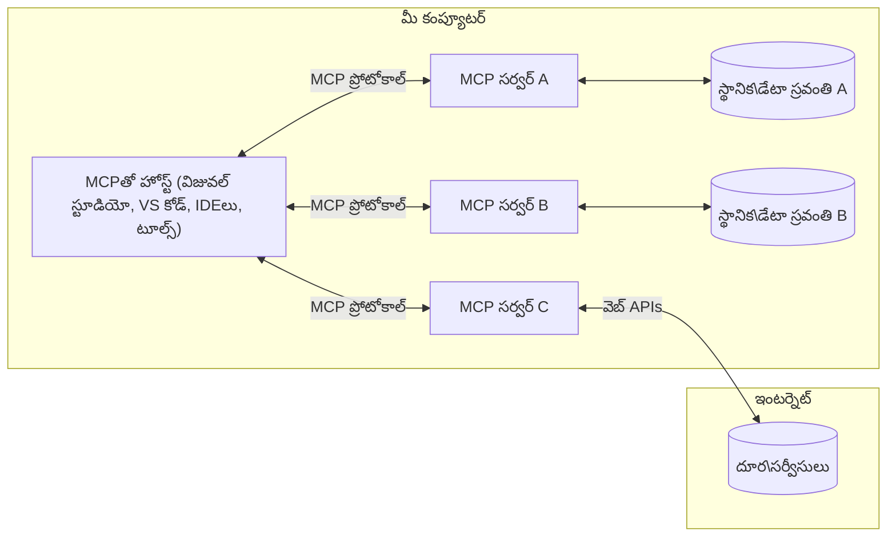

# MCP కోర్ కాన్సెప్ట్స్: AI ఇంటిగ్రేషన్ కోసం మోడల్ కాంటెక్స్ట్ ప్రోటోకాల్ నేర్పుకోవడం

[](https://youtu.be/earDzWGtE84)

_(ఈ పాఠం వీడియోను చూడడానికి పై చిత్రంపై క్లిక్ చేయండి)_

[Model Context Protocol (MCP)](https://github.com/modelcontextprotocol) అనేది పెద్ద భాషా మోడల్స్ (LLMs) మరియు బాహ్య సాధనాలు, అనువర్తనాలు, డేటా మూలాల మధ్య కమ్యూనికేషన్‌ను గరిష్టముగా చేయడానికి రూపొందించబడిన శక్తివంతమైన, ప్రమాణీకృత సాందర్భ వేదిక.  
ఈ మార్గదర్శిని MCP యొక్క ప్రాథమిక కాన్సెప్ట్స్‌ను మీకు చూపిస్తుంది. మీరు దీని క్లయింట్-సర్వర్ నిర్మాణం, ముఖ్య భాగాలు, కమ్యూనికేషన్ భావనలు, మరియు అమలు ఉత్తమ పద్ధతులను నేర్చుకుంటారు.

- **స్పష్టమైన వినియోగదారుని అనుమతి**: అన్ని డేటా యాక్సెస్ మరియు ఆపరేషన్లు అమలు చేసేముందు వినియోగదారుని స్పష్టమైన అంగీకారం అవసరం. వినియోగదారులు ఏ డేటా యాక్సెస్కు వస్తుందో మరియు ఏ చర్యలు చేపడతారో అర్థం చేసుకోవాలి, అనుమతులు మరియు అధికారాలపై సూక్ష్మ నియంత్రణ కలిగి ఉండాలి.

- **డేటా గోప్యత రక్షణ**: వినియోగదారు డేటా స్పష్టమైన అనుమతి తో మాత్రమే గ్రహించబడాలి మరియు అంతటా బలమైన యాక్సెస్ నియంత్రణలతో రక్షించబడాలి. అమలు చేయడం అనధికార డేటా ప్రసారం నివారించాలి మరియు కఠినమైన గోప్యత సరిహద్దులను ఉంచాలి.

- **సాధన అమ‌ల‌త సుర‌క్షిత‌త**: ప్రతి సాధన ఆహ్వానం స్పష్టమైన వినియోగదారుని అంగీకారంతో ఉండాలి, సాధన పని విధానం, పారామితులు మరియు ప్రభావం స్పష్టంగా అర్థమవుతుంది. బలమైన భద్రతా సరిహద్దులు అనుకోని, అపక్షేపణీయమైన లేదా దుర్భావనతో కూడిన సాధన అమలును నివారించాలి.

- **ట్రాన్స్‌పోర్ట్ లేయర్ సెక్యూరిటీ**: అన్ని కమ్యూనికేషన్ ఛానెల్లు సరైన గుట్టుచెప్పు మరియు ధృవీకరణ పద్ధతులు ఉపయోగించాలి. రిమోట్ కనెక్షన్లు భద్రతా ట్రాన్స్‌పోర్ట్ ప్రోటోకాల్‌లు మరియు సరిగ్గా గుర్తింపు నిర్వహణ అమలు చేయాలి.

#### అమలు మార్గదర్శకాలు:

- **అనుమతి నిర్వహణ**: యూజర్లు ఎవరెవరికి, ఏ సాధనాలు, వనరులు యాక్సెస్ వసులో నియంత్రించగలిగే సూక్ష్మ అనుమతి వ్యవస్థలను అమలు చేయండి  
- **ధృవీకరణ & అధికారీకరణ**: భద్రత గల ధృవీకరణ పద్ధతులు (OAuth, API కీస్) గాను సరైన టోకెన్ నిర్వహణ మరియు వివరమైన కాలపరిమితితో ఉపయోగించండి  
- **ఇన్‌పుట్ ధ్రువీకరణ**: అన్ని పారామితులు మరియు డేటా ఇన్పుట్లు నిర్వచించిన స్కీమాల ప్రకారం ధృవీకరించండి, ఇంజెక్షన్ దాడుల నివారణకు  
- **ఆడిట్ లాగింగ్**: భద్రతా పర్యవేక్షణ మరియు అనుగమనం కోసం అన్ని ఆపరేషన్ల సమగ్రమైన లాగులను నిర్వహించండి

## సమీక్ష

ఈ పాఠం Model Context Protocol (MCP) నైమిషిక నిర్మాణం మరియు భాగాలను విశ్లేషిస్తుంది. మీరు MCP కస్టమ్-సర్వర్ నిర్మాణం, ముఖ్య భాగాలు, మరియు కమ్యూనికేషన్ ప్రక్రియలను నేర్చుకుంటారు.

## ముఖ్యమైన నేర్చుకోవలసిన విషయాలు

ఈ పాఠం చివరికి మీరు:

- MCP క్లయింట్-సర్వర్ నిర్మాణాన్ని అర్థం చేసుకోవడం  
- హోస్ట్‌లు, క్లయింట్లు, సర్వర్ల పాత్రలు, బాధ్యతలు గుర్తించడం  
- MCP ను ఒక అనుకూల ఇంటిగ్రేషన్ లేయర్‌గా తయారుచేసే ప్రాథమిక లక్షణాలు విశ్లేషించడం  
- MCP వ్యవస్థలో సమాచార ప్రవాహం ఎలా జరుగుతుందో తెలుసుకోవడం  
- .NET, జావా, పైథాన్, మరియు జావాస్క్రిప్ట్ కోడ్ ఉదాహరణల ద్వారా అనుభవ సాధించడం

## MCP నిర్మాణం: లోతుగా అవలోకనం

MCP సిస్టమ్ ఒక క్లయింట్-సర్వర్ మోడల్‌పై నిర్మించబడింది. ఈ మాడ్యులర్ నిర్మాణం AI అనువర్తనాలకు సాధనాలు, డేటాబేస్లు, APIs, మరియు సాందర్భ వనరులతో సమర్థవంతంగా ఇంటరాక్ట్ చేయడానికి అనుమతిస్తుంది. ఈ నిర్మాణాన్ని ప్రధాన భాగాలుగా విడదీస్తే:

మూలస్తంభంగా, MCP ఒక క్లయింట్-సర్వర్ నిర్మాణాన్ని అనుసరిస్తుంది, ఇందులో హోస్ట్ అనువర్తనం అనేక సర్వర్లకు కనెక్ట్ అవుతుంది:


- **MCP హోస్ట్‌లు**: VSCode, Claude Desktop, IDEలు లేదా MCP ద్వారా డేటాను పొందాలనుకునే AI సాధనాలు  
- **MCP క్లయింట్లు**: సర్వర్‌లతో 1:1 కనెక్షన్లను నిర్వహించే ప్రోటోకాల్ క్లయింట్లు  
- **MCP సర్వర్లు**: ప్రతి ఒక్కటి ప్రత్యేక సామర్థ్యాలను Model Context Protocol ద్వారా అందించే తేలికపాటి ప్రోగ్రామ్స్  
- **లోకల్ డేటా వనరులు**: మీ కంప్యూటర్ ఫైళ్ల, డేటాబేస్‌లు, సేవలు, MCP సర్వర్లు భద్రంగా ప్రాప్తి చేయగలవు  
- **రిమోట్ సర్వీసులు**: ఇంటర్నెట్ ద్వారా అందుబాటులో ఉండే బాహ్య సిస్టమ్స్, MCP సర్వర్లు APIల ద్వారా కనెక్ట్ అయ్యే

MCP ప్రోటోకాల్ ఒక అభివృద్ధి చెందుతున్న ప్రమాణం, దానిలో తేదీ ఆధారిత వెర్షనింగ్ (YYYY-MM-DD ఫార్మాట్) ఉపయోగిస్తారు. ప్రస్తుత ప్రోటోకాల్ వెర్షన్ **2025-11-25**. తాజా అప్‌డేట్లను చూడండి [protocol specification](https://modelcontextprotocol.io/specification/2025-11-25/)

### 1. హోస్ట్‌లు

Model Context Protocol (MCP) లో, **హోస్ట్‌లు** అనేవి వినియోగదారులు ప్రోటోకాల్‌తో ఇంటరాక్ట్ అయ్యే ప్రాధమిక ఇంటర్ఫేస్‌లుగా పనిచేసే AI అనువర్తనాలు. హోస్ట్‌లు అనేక MCP సర్వర్లకు కనెక్షన్లను సమన్వయపరచి నిర్వహిస్తాయి, ప్రతి సర్వర్ కనెక్షన్‌కు ప్రత్యేక MCP క్లయింట్లను సృష్టిస్తూ. హోస్ట్‌ల ఉదాహరణలు:

- **AI అనువర్తనాలు**: Claude Desktop, Visual Studio Code, Claude Code  
- **డెవలప్‌మెంట్ ఎన్‌విరాన్‌మెంట్‌లు**: MCP ఇంటిగ్రేషన్‌తో IDEలు మరియు కోడ్ ఎడిటర్లు  
- **అనుకూల అనువర్తనాలు**: లక్ష్యంతో రూపొందించిన AI ఏజెంట్లు మరియు సాధనాలు

**హోస్ట్‌లు** AI మోడల్ ఇంటరాక్షన్లను సమన్వయపరుస్తాయి. అవి:

- **AI మోడల్స్‌ను స్మర్యపరచడం**: LLMలను అమలు చేయడం లేదా సహకరించి సమాధానాలను రూపొందించడం, AI వర్క్‌ఫ్లోలను సమన్వయించడం  
- **క్లయింట్ కనెక్షన్లను నిర్వహించడం**: ప్రతి MCP సర్వర్ కనెక్షన్‌కు ఒక MCP క్లయింట్ సృష్టించడం, నిర్వహించడం  
- **వినియోగదారు ఇంటర్ఫేస్ నియంత్రణ**: సంభాషణ ప్రవాహం, వినియోగదారు ఇంటరాక్షన్లు, సమాధాన ప్రదర్శనను నిర్వహించడం  
- **భద్రత అమలు**: అనుమతులు, భద్రత పరిమితులు, ధృవీకరణను నియంత్రించడం  
- **వినియోగదారుని అనుమతి నిర్వహణ**: డేటా భాగస్వామ్యం మరియు సాధన అమలుకు వినియోగదారుని అంగీకారాన్ని నిర్వహించడం

### 2. క్లయింట్లు

**క్లయింట్లు** అనేవి హోస్ట్ మరియు MCP సర్వర్ల మధ్య ప్రత్యేక 1:1 కనెక్షన్లను నిర్వహించే ముఖ్య భాగాలు. ప్రతి MCP క్లయింట్, హోస్ట్ ద్వారా ఒక నిర్దిష్ట MCP సర్వర్‌కు కనెక్ట్ అవుతుంది, సమర్థవంతమైన భద్రీకృత కమ్యూనికేషన్ ఛానెల్‌లను సృష్టిస్తుంది. ఒక హోస్ట్ అనేక క్లయింట్ల ద్వారా అనేక సర్వర్లతో స 동시에 కనెక్ట్ కావచ్చు.

**క్లయింట్లు** అనేవి హోస్ట్ అనువర్తనంలో కనెక్టర్ భాగాలు. అవి:

- **ప్రోటోకాల్ కమ్యూనికేషన్**: ప్రాంప్ట్లు మరియు సూచనలతో JSON-RPC 2.0 అభ్యర్థనలను సర్వర్లకు పంపడం  
- **సామర్థ్య చర్చలు**: ప్రారంభ దశలో సర్వర్లతో మద్దతు ఉన్న లక్షణాలు, ప్రోటోకాల్ వెర్షన్లను చర్చించడం  
- **సాధన అమలును నిర్వహించడం**: మోడల్స్ నుండి సాధన అమలుకు ఆహ్వానాలు నిర్వహించి ప్రతిస్పందనలను ప్రాసెస్ చేయడం  
- **నిజసమయ నవీకరణలు**: సర్వర్ల నుండి నోటిఫికేషన్‌లు మరియు నిజసమయ నవీకరణలను నిర్వహించడం  
- **ప్రతిస్పందన ప్రాసెసింగ్**: సర్వర్ ప్రతిస్పందనలను ప్రాసెస్ చేసి వినియోగదారు కంటెంట్ కోసం ఫార్మాట్ చేయడం

### 3. సర్వర్లు

**సర్వర్లు** MCP క్లయింట్లకు కాంటెక్స్ట్, సాధనాలు, సామర్థ్యాలను అందించే ప్రోగ్రాములు. అవి లోకల్ (హోస్ట్‌తో ఒకే యంత్రంలో) లేదా రిమోట్ (బాహ్య ప్లాట్‌ఫారమ్‌లపై) అమలవ్వచ్చు. సర్వర్లు క్లయింట్ల అభ్యర్థనలను నిర్వహించి క్రమబద్ధీకరించిన ప్రతిస్పందనలను అందిస్తాయి. సర్వర్లు ప్రమాణీకృత Model Context Protocol ద్వారా నిర్దిష్ట ఫంక్షనాలిటీలను విడుదల చేస్తాయి.

**సర్వర్లు** కాంటెక్స్ట్ మరియు సామర్థ్యాలు అందించే సేవలు. అవి:

- **లక్షణం నమోదు**: అందుబాటులో ఉన్న ప్రిమిటివ్‌లను (వనరులు, ప్రాంప్ట్లు, సాధనాలు) క్లయింట్లకు నమోదు చేసి ప్రకటించడం  
- **అభ్యర్థన ప్రాసెసింగ్**: సాధన కాల్స్, వనరు అభ్యర్థనలు, ప్రాంప్ట్ అభ్యర్థనలను స్వీకరించి అమలు చేయడం  
- **కాంటెక్స్ట్ అందించటం**: కాంటెక్స్టు సమాచారంతో మోడల్ ప్రతిస్పందనలను మెరుగుపరచడం  
- **స్టేట్ నిర్వహణ**: సెషన్ స్టేట్‌ను నిర్వహించడం మరియు అవసరమైతే స్థితిసంబంధ సంభాషణలను చేయడం  
- **నిజసమయ నోటిఫికేషన్‌లు**: సామర్థ్య మార్పులు మరియు నవీకరణల గురించిన నోటిఫికేషన్‌లను కనెక్ట్ అయిన క్లయింట్లకు పంపడం

సర్వర్లను ఎవరికైనా ప్రత్యేక ఫంక్షనాలిటీతో మోడల్ సామర్థ్యాలను విస్తరించడానికి అభివృద్ధి చేయవచ్చు, మరియు అవి లోకల్ మరియు రిమోట్ డిప్లాయ్‌మెంట్ సన్నివేశాలను మద్దతు ఇస్తాయి.

### 4. సర్వర్ ప్రిమిటివ్స్

Model Context Protocol (MCP) సర్వర్లు క్లయింట్లు, హోస్ట్‌లు, భాషా మోడల్స్ మధ్య స‌మృద్ధ ఇన్టראక్షన్‌ల కొరకు ప్రాథమిక నిర్మాణ బ్లాక్‌లుగా మూడు ప్రిమిటివ్స్‌ను అందిస్తాయి. ఈ ప్రిమిటివ్స్ ప్రోటోకాల్ ద్వారా అందుబాటులో ఉన్న సమాచార కాంటెక్స్ట్ మరియు చర్యల రకాలను నిర్వచిస్తాయి.

MCP సర్వర్లు క్రింది మూడు ప్రిమిటివ్స్ ఏ తప్పకుండా అందించవచ్చు:

#### వనరులు (Resources)

**వనరులు** అనేవి AI అనువర్తనాలకు కాంటెక్స్ట్ సమాచారాన్ని అందించే డేటా మూలాలు. ఇవి స్థిర లేదా గమనించే కంటెంట్‌ను ప్రతినిధ్యం చేస్తాయి, ఇది మోడల్ అర్థవ్యయం, నిర్ణయాలు తీసుకునేటప్పుడు సహాయం చేస్తుంది:

- **సాందర్భ డేటా**: క్రమబద్ధీకరించిన సమాచారం మరియు AI మోడల్ వినియోగం కొరకు సాందర్భం  
- **జ్ఞాన సંગ્રహాలు**: డాక్యుమెంట్ రిపాజిటరీలు, వ్యాసాలు, మాన్యుయల్స్, పరిశోధన పత్రాలు  
- **లోకల్ డేటా వనరులు**: ఫైళ్లు, డేటాబేస్‌లు, లోకల్ సిస్టమ్ సమాచారం  
- **బాహ్య డేటా**: API ప్రతిస్పందనలు, వెబ్ సర్వీసులు, రిమోట్ సిస్టమ్ డేటా  
- **డైనమిక్ కంటెంట్**: బాహ్య పరిస్థితుల ఆధారంగా నవీకరించబడే నిజసమయ డేటా

వనరులను URIs ద్వారా గుర్తిస్తారు, అవి `resources/list` ద్వారా కనుగొనబడతాయి మరియు `resources/read` ద్వారా పొందవచ్చు:

```text
file://documents/project-spec.md
database://production/users/schema
api://weather/current
```
  
#### ప్రాంప్ట్లు (Prompts)

**ప్రాంప్ట్లు** అనేవి పునర్వినియోగ కాంపోజింగ్ టెంప్లేట్లు, ఇవి భాషా మోడల్స్‌తో సంకల్పనను నిర్మించడంలో సహాయం చేస్తాయి. అవి ప్రమాణీకృత మంత్రి మరియు టెంప్లేటెడ్ వర్క్‌ఫ్లోలను అందిస్తాయి:

- **టెంప్లేట్-ఆధారిత ఇంటరాక్షన్లు**: ముందుగా నిర్మించబడిన సందేశాలు మరియు సంభాషణ ప్రారంభికలు  
- **వర్క్‌ఫ్లో టెంప్లేట్లు**: సాధారణ పనుల కొరకు ప్రమాణీకృత క్రమాలు  
- **ఫ్యూషాట్ ఉదాహరణలు**: మోడల్ సూచనల కోసం ఉదాహరణ-ఆధారిత టెంప్లేట్లు  
- **సిస్టమ్ ప్రాంప్ట్లు**: మోడల్ ప్రవర్తన మరియు కాంటెక్స్ట్ నిర్వచించే ప్రాథమిక ప్రాంప్ట్లు  
- **డైనమిక్ టెంప్లేట్లు**: నిర్దిష్ట కాంటెక్స్ట్‌కు అనుగుణంగా మారే పారామెటరైజ్డ్ ప్రాంప్ట్లు

ప్రాంప్ట్లు వేరియబుల్ స్థానార్పణను మద్దతు ఇస్తాయి; అవి `prompts/list` ద్వారా కనుగొనవచ్చు మరియు `prompts/get` తో పొందవచ్చు:

```markdown
Generate a {{task_type}} for {{product}} targeting {{audience}} with the following requirements: {{requirements}}
```
  
#### సాధనాలు (Tools)

**సాధనాలు** అనేవి అమలు చేయగల ఫంక్షన్లు, ఇవి AI మోడల్స్ నిర్దిష్ట చర్యలను చేయడానికి పిలవవచ్చు. అవి MCP పర్యావరణంలో "క్రియలు"ని సూచిస్తాయి, ఇవి మోడల్స్‌ను బాహ్య సిస్టమ్స్‌తో ఇంటరాక్ట్ చేయనివ్వగలవు:

- **అమల 가능한 ఫంక్షన్లు**: మోడల్స్ ప్రత్యేక పారామితులతో పిలవగల ప్రాథమిక ఆపరేషన్లు  
- **బాహ్య సిస్టమ్ ఇంటిగ్రేషన్**: API కాల్స్, డేటాబేస్ క్వెరీస్, ఫైల్ ఆపరేషన్లు, లెక్కింపు  
- **అద్వితీయ గుర్తింపు**: ప్రతి సాధనకు ప్రత్యేక పేరు, వివరణ, పారామితి స్కీము  
- **సంరచించే I/O**: సాధనాలు ధృవీకరించిన పారామితులు స్వీకరించి, సంరచించిన, టైప్ చేయబడిన ప్రతిస్పందనలు ఇవ్వగలవు  
- **చర్య సామర్థ్యాలు**: మోడల్స్‌కి వాస్తవ ప్రపంచ చర్యలు చేయగలిగే, ప్రత్యక్ష డేటా తీసుకురావడానికి సహాయం

సాధనాలు పారామితి ధృవీకరణ కొరకు JSON స్కీమాతో నిర్వచించబడి, అవి `tools/list` ద్వారా కనుగొనబడ్డాయి మరియు `tools/call` ద్వారా అమలు చేయబడ్డాయి. మెరుగైన UI ప్రదర్శన కోసం సాధనాలకు **ఐకాన్లు** (icons) కూడా ఇవ్వవచ్చు.

**సాధన వ్యాఖ్యానాలు**: సాధనాలు ఓ పద్ధతి సూచన (ఉదా. `readOnlyHint`, `destructiveHint`)లను మద్దతు ఇస్తాయి, ఇవి సాధనం చదవడానికి మాత్రమే లేదా వధించినటువంటి చర్యలైనదిగా సూచించటం చేసి, క్లయింట్లు సాదన అమలుని తెలివిగా నిర్ణయించగలవును.

ఉదాహరణ సాధన నిర్వచనం:

```typescript
server.tool(
  "search_products", 
  {
    query: z.string().describe("Search query for products"),
    category: z.string().optional().describe("Product category filter"),
    max_results: z.number().default(10).describe("Maximum results to return")
  }, 
  async (params) => {
    // శోధనను అమలు చేసి నిర్మాణమైన ఫలితాలను తిరిగి ఇవ్వండి
    return await productService.search(params);
  }
);
```
  
## క్లయింట్ ప్రిమిటివ్స్

Model Context Protocol (MCP)లో **క్లయింట్లు** హోస్ట్ అనువర్తనం నుంచి అదనపు సామర్థ్యాల కోసం సర్వర్‌ల అభ్యర్థనలు చేయడానికి ప్రిమిటివ్‌లు అందించగలవు. ఈ క్లయింట్-వైపు ప్రిమిటివ్స్ సర్వర్ అమలు కోసం పూర్తిగా ఇంటరాక్టివ్, ఎక్కువ సంపన్నమైన పరిష్కారాలను కలపడానికి సహాయపడతాయి, అవి AI మోడల్ సామర్థ్యాలు మరియు వినియోగదారు ఇంటరాక్షన్లను యాక్సెస్ చేయగలవు.

### శాంప్లింగ్ (Sampling)

**శాంప్లింగ్** ద్వారా సర్వర్లు కస్టమర్ AI అనువర్తనం నుండి భాషా మోడల్ పూర్తి‌లను అభ్యర్థించగలవు. ఈ ప్రిమిటివ్ సర్వర్లకు తమ స్వంత మోడల్ ఆధారితత లేకుండా LLM సామర్థ్యాలను యాక్సెస్ చేయడానికి వీలు కల్పిస్తుంది:

- **మోడల్-స్వతంత్ర యాక్సెస్**: LLM SDKలను చేర్చకుండానే లేదా మోడల్ యాక్సెస్ నిర్వహించకుండానే పూర్తి‌లను అభ్యర్థించవచ్చు  
- **సర్వర్-ప్రారంభ AI**: సర్వర్లు కస్టమర్ AI మోడల్ ఉపయోగించి స్వతంత్రంగా కంటెంట్ సృష్టించవచ్చు  
- **పునర్విన్యాస LLM ఇంటరాక్షన్లు**: సర్వర్లు AI సహాయంతో ప్రాసెసింగ్ కొరకు క్లిష్ట సందర్భాలను మద్దతు ఇస్తాయి  
- **డైనమిక్ కంటెంట్ రూపొందింపు**: సర్వర్లు హోస్ట్ యొక్క మోడల్ ఉపయోగించి కాంటెక్స్ట్‌కు అనుగుణంగా ప్రతిస్పందనలు తయారుచేస్తాయి  
- **సాధన ఆహ్వానం మద్దతు**: సర్వర్లు `tools` మరియు `toolChoice` పారామితులతో కస్టమర్ మోడల్ ద్వారా సాధనాలను పిలవవేయగలవు

శాంప్లింగ్ `sampling/complete` పద్ధతితో ప్రారంభం అవుతుంది, ఇక్కడ సర్వర్లు పూర్తి అభ్యర్థనలను క్లయింట్లకు పంపుతాయి.

### రూట్స్ (Roots)

**రూట్స్** అనేవి క్లయింట్లు సర్వర్లకు ఫైల్ సిస్టమ్ పరిమితులను ప్రమాణీకృత రూపంలో తెలిపే విధానం, సర్వర్లు ఏ డైరెక్టరీలు, ఫైళ్ళకు యాక్సెస్ కలిగి ఉన్నారో అర్థం చేసుకునేందుకు సహాయపడతాయి:

- **ఫైల్ సిస్టమ్ సరిహద్దులు**: సర్వర్లు ఫైల్ సిస్టమ్ లో ఏ ప్రాంతాల్లో ఆపరేట్ చేయగలరో నిర్ధారించడం  
- **యాక్సెస్ నియంత్రణ**: సర్వర్లు ఏ డైరెక్టరీలు, ఫైళ్ళకు వీలు ఉందో అర్థం చేసుకోవడం  
- **డైనమిక్ నవీకరణలు**: రూట్స్ జాబితా మారినప్పుడు క్లయింట్లు సర్వర్లకు తెలియజేయగలవు  
- **URI-ఆధారిత గుర్తింపు**: రూట్స్ `file://` URIs ద్వారా స్పష్టం చేయబడతాయి

రూట్స్ `roots/list` ద్వారా కనుగొనబడి, మార్పులపై క్లయింట్లు `notifications/roots/list_changed` పంపుతాయి.

### ఎలిసిటేషన్ (Elicitation)

**ఎలిసిటేషన్** ద్వారా సర్వర్లు కస్టమర్ ఇంటర్ఫేస్ ద్వారా వినియోగదారులు నుండి అదనపు సమాచారం లేదా నిర్ధారణ అడగగలవు:

- **వినియోగదారుడు ఇన్‌పుట్ అభ్యర్థనలు**: సాధన అమలుకు అవసరమైన అదనపు సమాచారం అడగడం  
- **నిర్ధారణ సంభాషణలు**: సున్నితమైన లేదా ప్రభావవంతమైన చర్యలకు వినియోగదారుని అనుమతి కోరడం  
- **ఇంటరాక్టివ్ వర్క్‌ఫ్లోలు**: దశల వారీగా వినియోగదారుల ఇంటరాక్షన్‌లు సృష్టించడం  
- **డైనమిక్ పారామితి సేకరణ**: సాధన అమలులో లేని లేదా ఐచ్ఛిక పారామితులను సమీకరించడం

ఎలిసిటేషన్ అభ్యర్థనలు `elicitation/request` పద్ధతితో క్లయింట్ ఇంటర్‌ఫేస్ ద్వారా వినియోగదారుతో కమ్యూనికేట్ చేస్తాయి.

**URL మోడ్ ఎలిసిటేషన్**: సర్వర్లు URL ఆధారిత వినియోగదారు ఇంటరాక్షన్లు కూడా కోరవచ్చు, వీటితో వినియోగదారులను ధృవీకరణ, నిర్ధారణ లేదా డేటా ఎంట్రీ కొరకు బాహ్య వెబ్ పేజీలకు నడిపించవచ్చు.

### లాగింగ్ (Logging)

**లాగింగ్** ద్వారా సర్వర్లు క్లయింట్లకు రేఖాబద్దమైన లాగ్ సందేశాలను(debugging, monitoring, operational visibility కోసం) పంపవచ్చు:

- **డీబగ్గింగ్ మద్దతు**: సమస్యల పరిష్కారానికి పూర్తి అమలు లాగులను అందించడం  
- **ఆపరేషనల్ పర్యవేక్షణ**: క్లయింట్లకు స్థితిగతులు, పనితీరు మెట్రిక్స్ పంపడం  
- **పొరపాటుల నివేదిక**: లోతైన లోప వ్యాసంగం మరియు విచారణ సమాచారం అందించడం  
- **ఆడిట్ ట్రైల్స్**: సర్వర్ ఆపరేషన్లు మరియు నిర్ణయాల సమగ్ర లాగులను సృష్టించడం

లాగ్ సందేశాలు సర్వర్ ఆపరేషన్ల లోపాలను స్పష్టం చేయడానికి మరియు డీబగ్గింగ్ సౌకర్యానికి క్లయింట్లకు పంపబడతాయి.

## MCP లో సమాచార ప్రవాహం

Model Context Protocol (MCP) హోస్ట్‌లు, క్లయింట్లు, సర్వర్లు, మోడల్స్ మధ్య నిర్మాణబద్ధమైన సమాచార ప్రవాహాన్ని నిర్వచిస్తుంది. ఈ ప్రవాహం వినియోగదారు అభ్యర్థనల ఎలా ప్రాసెస్ అవుతాయో, బాహ్య సాధనాలు మరియు డేటా ఎలా మోడల్ ప్రతిస్పందనలలో ఏకీకృతమవుతాయో స్పష్టంగా చెప్తుంది.

- **హోస్ట్ కనెక్ట్ ప్రారంభిస్తుంది**  
  హోస్ట్ అనువర్తనం (IDE లేదా చాట్ ఇంటర్ఫేస్ వంటి) సాధారణంగా STDIO, WebSocket లేదా మద్దతు ఉన్న మరో ఉపయోగా medium ద్వారా MCP సర్వర్‌తో కనెక్షన్ ఏర్పాటు చేస్తుంది.

- **సామర్థ్య చర్చలు**  
  హోస్ట్ లోని క్లయింట్ మరియు సర్వర్ తమ మద్దతు ఉన్న లక్షణాలు, సాధనాలు, వనరులు, ప్రోటోకాల్ వెర్షన్లపై సమాచారాన్ని బదిలీ చేస్తారు. ఇది ఇద్దరు వైపులా సెషన్ లో ఎలాంటి సామర్థ్యాలు అందుబాటులో ఉంటాయో అర్థం చేసుకోవడాన్ని ఖచ్చితంగా చేస్తుంది.

- **వినియోగదారు అభ్యర్థన**  
  వినియోగదారు హోస్ట్‌తో ఇంటరాక్ట్ చేస్తారు (ఉదా: ఒక ప్రాంప్ట్ లేదా కమాండ్ ఎంటర్ చేస్తారు). హోస్ట్ ఈ ఇన్‌పుట్‌ను సేకరించి క్లయింట్‌కు పంపుతుంది ప్రాసెసింగ్ కొరకు.

- **వనరు లేదా సాధన ఉపయోగం**  
  - క్లయింట్ సర్వర్ నుండి అదనపు కాంటెక్స్ట్ లేదా వనరులు (ఫైళ్లు, డేటాబేస్ ఎంట్రీలు, జ్ఞాన సేకరణ ఆర్టికల్స్) ని అభ్యర్థించి మోడల్ అర్థాన్ని సమృద్ధి చేస్తుంది.  
  - మోడల్ ఒక సాధన అవసరమని నిర్ణయిస్తే (ఉదా: డేటా తీసుకోవడం, లెక్కింపు చేయడం, API పిలవడం), క్లయింట్ సాధనం పేరును మరియు పారామితులను స్పస్టపరచి సాధన కాల్ అభ్యర్థనను సర్వర్‌కు పంపుతుంది.

- **సర్వర్ అమలు**  

సర్వర్ రీసోర్స్ లేదా టూల్ రిక్వెస్ట్ పొందుతుంది, అవసరమైన ఆపరేషన్లు (ఫంక్షన్ నడపడం, డేటాబేస్‌ను క్వెరీ చేయడం, ఫైల్‌ను రిట్రీవ్ చేయడం లాంటివి) నిర్వహించి, ఫలితాలను క్లయింట్‌కు నిర్మిత ఫార్మాట్లో తిరిగి ఇస్తుంది.

- **రిస్పాన్స్ ఉత్పత్తి**  
  క్లయింట్ సర్వర్ యొక్క స్పందనలను (రీసోర్స్ డేటా, టూల్ అవుట్పుట్‌లు, మొదలైనవి) lauferende మోడల్ ఇంటరాక్షన్‌లో సమీకరిస్తుంది. మోడల్ ఈ సమాచారం ద్వారా సమగ్ర మరియు సందర్భానుకూల ప్రతిస్పందనను ఉత్పత్తి చేస్తుంది.

- **ఫలిత ప్రదర్శన**  
  హోస్ట్ క్లయింట్ నుండి తుది అవుట్పుట్‌ను అందుకొని, మోడల్ ద్వారా ఉత్పత్తి చేసిన టెక్స్ట్ మరియు టూల్ ఎగ్జిక్యూషన్ లేదా రీసోర్స్ లుక్-అప్ ఫలితాలను వినియోగదారికి ప్రదర్శిస్తుంది.

ఈ ఫ్లో MCP కి ఆధునిక, ఇంటరాక్టివ్ మరియు సందర్భ-సున్నిత AI అప్లికేషన్స్‌ను మోడల్స్ ను బాహ్య టూల్స్ మరియు డేటా సోర్స్‌లతో సజావుగా కలుపుకోవడానికి అనుమతిస్తుంది.

## ప్రోటోకాల్ ఆర్కిటెక్చర్ & లేయర్స్

MCP రెండు ప్రత్యేకమైన ఆర్కిటెక్చర్అ లేయర్లతో కూడి, పూర్తిగా కమ్యూనికేషన్ ఫ్రేమ్‌వర్క్‌ను అందిస్తుంది:

### డేటా లేయర్

**డేటా లేయర్** ప్రాథమిక MCP ప్రోటోకాల్‌ను **JSON-RPC 2.0** ఆధారంగా అమలు చేస్తుంది. ఈ లేయర్ సందేశ నిర్మాణం, అర్ధం మరియు ఇంటరాక్షన్ నమూనాలను నిర్వచిస్తుంది:

#### ముఖ్య భాగాలు:

- **JSON-RPC 2.0 ప్రోటోకాల్**: అన్ని కమ్యూనికేషన్ మేతడ్ కాల్స్, రెస్పాన్స్‌లు మరియు నోటిఫికేషన్స్ కోసం స్థిరమైన JSON-RPC 2.0 మెసేజ్ ఫార్మాట్ ఉపయోగిస్తుంది  
- **లైఫ్సైకిల్ మేనేజ్‌మెంట్**: క్లయింట్ మరియు సర్వర్‌ల మధ్య కనెక్షన్ ప్రారంభం, సామర్థ్యాల చర్చ, సెషన్ ముగింపు నిర్వహిస్తుంది  
- **సర్వర్ ప్రిమిటివ్స్**: సర్వర్‌లు టూల్స్, రీసోర్ల్స్, ప్రాంప్ట్‌ల ద్వారా కోర్ ఫంక్షనాలిటీ అందించగలుగుతాయి  
- **క్లయింట్ ప్రిమిటివ్స్**: సర్వర్‌లు LLMల నుండి సాంప్లింగ్ కోరడం, యూజర్ ఇన్‌పుట్ elicitation చేయడం, లాగ్ సందేశాలు పంపడం నాకు సహకరించును  
- **రియల్-టైం నోటిఫికేషన్స్**: పోలింగ్ లేకుండా డైనమిక్ అప్డేట్స్ కోసం అసింక్రోనస్ నోటిఫికేషన్లను మద్దతు చేస్తుంది

#### ముఖ్య లక్షణాలు:

- **ప్రోటోకాల్ వెర్షన్ నెగోషియేషన్**: YYYY-MM-DD ఆధారంగా వెర్షన్ నెగోషియేషన్ ఉపయోగించి అనుకూలత నిర్ధారిస్తుంది  
- **సామర్థ్య కనుగొన్నారు**: ప్రారంభ సమయంలో క్లయింట్, సర్వర్‌ల మధ్య మద్దతు లభ్యమైన ఫీచర్ల మార్పిడి  
- **స్టేట్ఫుల్ సెషన్స్**: అనేక ఇంటరాక్షన్‌లలో కనెక్షన్ స్థితిని కొనసాగించి విషయం నిరంతరం ఉంచుతుంది

### ట్రాన్స్‌పోర్ట్ లేయర్

**ట్రాన్స్‌పోర్ట్ లేయర్** MCP పాల్గొనేవారిపై కమ్యూనికేషన్ ఛానల్స్, సందేశ ఫ్రేమింగ్ మరియు ఆటోమెషన్ నిర్వహిస్తుంది:

#### మద్దతు ట్రాన్స్‌పోర్ట్ విధానాలు:

1. **STDIO ట్రాన్స్‌పోర్ట్**:  
   - డైరెక్ట్ ప్రాసెస్ కమ్యూనికేషన్ కోసం స్టాండర్డ్ ఇన్‌పుట్/అవుట్‌పుట్ స్ట్రీమ్స్ ఉపయోగిస్తుంది  
   - ఒకే మెషీన్‌లో స్థానిక ప్రాసెస్‌లకు ఉత్తమం, నెట్‌వర్క్ ఓవర్‌హెడ్ లేదు  
   - స్థానిక MCP సర్వర్ అమలుకు సాధారణంగా ఉపయోగిస్తారు  

2. **స్ట్రీమబుల్ HTTP ట్రాన్స్‌పోర్ట్**:  
   - క్లయింట్-టు-సర్వర్ సందేశాల కోసం HTTP POST వాడుతుంది  
   - సర్వర్-టు-క్లయింట్ స్ట్రీమింగ్ కోసం ఎంపికైన Server-Sent Events (SSE) మద్దతు  
   - నెట్‌వర్క్‌ల మధ్య రిమోట్ సర్వర్ కమ్యూనికేషన్‌ను సులభతరం చేస్తుంది  
   - Bearer టోకెన్స్, API కీలు, కస్టమ్ హెడ్డర్లు వంటి సాధారణ HTTP ఆథెంటికేషన్ మద్దతు  
   - టోకెన్-ఆధారిత భద్రత కోసం MCP OAuth నుricaful సిఫార్సు చేస్తుంది

#### ట్రాన్స్‌పోర్ట్ అభిసారం:

ట్రాన్స్‌పోర్ట్ లేయర్ కమ్యూనికేషన్ వివరాలను డేటా లేయర్ నుండి వేరుచేస్తుంది, అందువల్ల అన్ని ట్రాన్స్‌పోర్ట్ విధానాలలో ఒకే JSON-RPC 2.0 మెసేజ్ ఫార్మాట్ ఉపయోగించబడుతుంది. ఇది స్థానిక మరియు రిమోట్ సర్వర్స్ మధ్య సాఫీగా మార్పిడిని సులభతరం చేస్తుంది.

### సెక్యూరిటీ పరిగణనలు

MCP అమలు చాలా కీలక భద్రతా సూత్రాలను పాటించాలి, అన్ని ప్రోటోకాల్ ఆపరేషన్లలో సురక్షిత, నమ్మకమైన, రక్షిత ఇంటరాక్షన్లు నిర్ధారించేందుకు:

- **ఉపయోగదారు సమ్మతి మరియు నియంత్రణ**: ఏదైనా డేటా యాక్సెస్ లేదా ఆపరేషన్లు చేయడానికి ముందు యూజర్ స్పష్టమైన సమ్మతి ఇవ్వాలి. వారు పంచుకునే డేటా మరియు అనుమతించబడ్డ చర్యలపై స్పష్టమైన నియంత్రణ కలిగి ఉండాలి, సమగ్ర యూజర్ ఇంటర్‌ఫేస్ ద్వారా చర్యలను సమీక్షించి అనుమతించగలగాలి.

- **డేటా గోప్యత**: యూజర్ డేటా స్పష్టమైన సమ్మతితో మాత్రమే పంచుకోవాలి మరియు తగిన యాక్సెస్ కంట్రోల్స్ చేత రక్షించబడాలి. MCP అమలులు అనధికార డేటా ట్రాన్స్మిషన్ నిరోధించాలి మరియు అంతర్భాగాలందా గోప్యతను ఉంచాలనిపిస్తోంది.

- **టూల్ సేఫ్టీ**: ఏ టూల్‌ను కూడా పిలవడానికి ముందు యూజర్ స్పష్టమైన సమ్మతి అవసరం. ప్రతి టూల్ యొక్క ఫంక్షనాలిటీపై యూజర్ స్ఫుర్తితో అవగాహన కలిగి ఉండాలి, అనుకున్న విధంగా లేక భద్రతా పరంగా ప్రమాదకరం కానిచర్యలు జరగకుండా బలమైన భద్రతా సరిహద్దులు అమలు చేయాలి.

ఈ భద్రతా సూత్రాలను అనుసరించడం ద్వారా MCP యూజర్ విశ్వాసం, గోప్యత మరియు సురక్షతను అన్ని ఇంటరాక్షన్లలో కాపాడుతుంది, అదే సమయంలో శక్తివంతమైన AI ఇంటిగ్రేషన్స్‌ను సక్రమంగా ప్రోత్సహిస్తుంది.

## కోడ్ ఉదాహరణలు: ముఖ్య భాగాలు

కீழ్లో MCP సర్వర్ ముఖ్య భాగాలు మరియు టూల్స్ ఎలా అమలు చేసుకోవచ్చో అనేక ప్రముఖ ప్రోగ్రామింగ్ భాషలలో కోడ్ ఉదాహరణలు ఉన్నాయి.

### .NET ఉదాహరణ: టూల్స్‌తో సరళమైన MCP సర్వర్ సృష్టించడం

ఇది కస్టమ్ టూల్స్‌తో సరళమైన MCP సర్వర్ ఎలా సృష్టించాలో ప్రాక్టికల్ .NET కోడ్ ఉదాహరణ. ఈ ఉదాహరణ టూల్స్ నిర్వచించడం, రిజిస్టర్ చేయడం, అభ్యర్థనలను హ్యాండిల్ చేయడం, మోడల్ కాంటెక్స్ట్ ప్రోటోకాల్ ద్వారా సర్వర్ కనెక్ట్ చేయడం చూపిస్తుంది.

```csharp
using System;
using System.Threading.Tasks;
using ModelContextProtocol.Server;
using ModelContextProtocol.Server.Transport;
using ModelContextProtocol.Server.Tools;

public class WeatherServer
{
    public static async Task Main(string[] args)
    {
        // Create an MCP server
        var server = new McpServer(
            name: "Weather MCP Server",
            version: "1.0.0"
        );
        
        // Register our custom weather tool
        server.AddTool<string, WeatherData>("weatherTool", 
            description: "Gets current weather for a location",
            execute: async (location) => {
                // Call weather API (simplified)
                var weatherData = await GetWeatherDataAsync(location);
                return weatherData;
            });
        
        // Connect the server using stdio transport
        var transport = new StdioServerTransport();
        await server.ConnectAsync(transport);
        
        Console.WriteLine("Weather MCP Server started");
        
        // Keep the server running until process is terminated
        await Task.Delay(-1);
    }
    
    private static async Task<WeatherData> GetWeatherDataAsync(string location)
    {
        // This would normally call a weather API
        // Simplified for demonstration
        await Task.Delay(100); // Simulate API call
        return new WeatherData { 
            Temperature = 72.5,
            Conditions = "Sunny",
            Location = location
        };
    }
}

public class WeatherData
{
    public double Temperature { get; set; }
    public string Conditions { get; set; }
    public string Location { get; set; }
}
```

### జావా ఉదాహరణ: MCP సర్వర్ భాగాలు

.NET ఉదాహరణలో చూపించిన అదే MCP సర్వర్, టూల్ రిజిస్ట్రేషన్‌ని ఈ ఉదాహరణ జావాలో అమలు చేస్తుంది.

```java
import io.modelcontextprotocol.server.McpServer;
import io.modelcontextprotocol.server.McpToolDefinition;
import io.modelcontextprotocol.server.transport.StdioServerTransport;
import io.modelcontextprotocol.server.tool.ToolExecutionContext;
import io.modelcontextprotocol.server.tool.ToolResponse;

public class WeatherMcpServer {
    public static void main(String[] args) throws Exception {
        // ఒక MCP సర్వర్‌ని సృష్టించండి
        McpServer server = McpServer.builder()
            .name("Weather MCP Server")
            .version("1.0.0")
            .build();
            
        // వాతావరణ సాధనాన్ని నమోదు చేసుకోండి
        server.registerTool(McpToolDefinition.builder("weatherTool")
            .description("Gets current weather for a location")
            .parameter("location", String.class)
            .execute((ToolExecutionContext ctx) -> {
                String location = ctx.getParameter("location", String.class);
                
                // వాతావరణ డేటా పొందండి (సరళీకృతం)
                WeatherData data = getWeatherData(location);
                
                // ఫార్మాటెడ్ స్పందనను తిరిగి ఇవ్వండి
                return ToolResponse.content(
                    String.format("Temperature: %.1f°F, Conditions: %s, Location: %s", 
                    data.getTemperature(), 
                    data.getConditions(), 
                    data.getLocation())
                );
            })
            .build());
        
        // stdio ట్రాన్స్‌పోర్ట్ ద్వారా సర్వర్ కనెక్ట్ చేయండి
        try (StdioServerTransport transport = new StdioServerTransport()) {
            server.connect(transport);
            System.out.println("Weather MCP Server started");
            // ప్రాసెస్ ముగియేవరకు సర్వర్ నడిపించండి
            Thread.currentThread().join();
        }
    }
    
    private static WeatherData getWeatherData(String location) {
        // అమలు వాతావరణ API పిలుస్తుంది
        // ఉదాహరణ కోసం సరళీకృతం చేశారు
        return new WeatherData(72.5, "Sunny", location);
    }
}

class WeatherData {
    private double temperature;
    private String conditions;
    private String location;
    
    public WeatherData(double temperature, String conditions, String location) {
        this.temperature = temperature;
        this.conditions = conditions;
        this.location = location;
    }
    
    public double getTemperature() {
        return temperature;
    }
    
    public String getConditions() {
        return conditions;
    }
    
    public String getLocation() {
        return location;
    }
}
```

### పైథాన్ ఉదాహరణ: MCP సర్వర్ నిర్మాణం

ఈ ఉదాహరణ fastmcp ఉపయోగిస్తుంది, కావున ముందుగా దాన్ని ఇన్‌స్టాల్ చేయండి:

```python
pip install fastmcp
```
కోడ్ నమూనా:

```python
#!/usr/bin/env python3
import asyncio
from fastmcp import FastMCP
from fastmcp.transports.stdio import serve_stdio

# FastMCP సర్వర్ సృష్టించండి
mcp = FastMCP(
    name="Weather MCP Server",
    version="1.0.0"
)

@mcp.tool()
def get_weather(location: str) -> dict:
    """Gets current weather for a location."""
    return {
        "temperature": 72.5,
        "conditions": "Sunny",
        "location": location
    }

# ఒక క్లాస్ ఉపయోగించే ప్రత్యామ్నాయ విధానం
class WeatherTools:
    @mcp.tool()
    def forecast(self, location: str, days: int = 1) -> dict:
        """Gets weather forecast for a location for the specified number of days."""
        return {
            "location": location,
            "forecast": [
                {"day": i+1, "temperature": 70 + i, "conditions": "Partly Cloudy"}
                for i in range(days)
            ]
        }

# క్లాస్ టూల్స్‌ను నమోదు చేయండి
weather_tools = WeatherTools()

# సర్వర్‌ను ప్రారంభించండి
if __name__ == "__main__":
    asyncio.run(serve_stdio(mcp))
```

### జావాస్క్రిప్ట్ ఉదాహరణ: MCP సర్వర్ సృష్టించడం

ఈ ఉదాహరణ జావాస్క్రిప్ట్‌లో MCP సర్వర్ సృష్టించడం మరియు రెండు వాతావరణ-సంబంధిత టూల్స్ రిజిస్టర్ చేయడం చూపిస్తుంది.

```javascript
// అధికారిక మోడల్ కాంటెక్స్ట్ ప్రోటోకాల్ SDK వినియోగించడం
import { McpServer } from "@modelcontextprotocol/sdk/server/mcp.js";
import { StdioServerTransport } from "@modelcontextprotocol/sdk/server/stdio.js";
import { z } from "zod"; // పారామితి సరైనతను నిర్ధారించడం కోసం

// ఒక MCP సర్వర్ సృష్టించండి
const server = new McpServer({
  name: "Weather MCP Server",
  version: "1.0.0"
});

// వాతావరణ పరికరాన్ని నిర్వచించండి
server.tool(
  "weatherTool",
  {
    location: z.string().describe("The location to get weather for")
  },
  async ({ location }) => {
    // ఇది సాధారణంగా వాతావరణ APIని పిలుస్తుంది
    // ప్రదర్శన కోసం సరళీకృతం చేయబడింది
    const weatherData = await getWeatherData(location);
    
    return {
      content: [
        { 
          type: "text", 
          text: `Temperature: ${weatherData.temperature}°F, Conditions: ${weatherData.conditions}, Location: ${weatherData.location}` 
        }
      ]
    };
  }
);

// ఒక ముందస్తు వాతావరణ పరికరాన్ని నిర్వచించండి
server.tool(
  "forecastTool",
  {
    location: z.string(),
    days: z.number().default(3).describe("Number of days for forecast")
  },
  async ({ location, days }) => {
    // ఇది సాధారణంగా వాతావరణ APIని పిలుస్తుంది
    // ప్రదర్శన కోసం సరళీకృతం చేయబడింది
    const forecast = await getForecastData(location, days);
    
    return {
      content: [
        { 
          type: "text", 
          text: `${days}-day forecast for ${location}: ${JSON.stringify(forecast)}` 
        }
      ]
    };
  }
);

// సహాయక ఫంక్షన్లు
async function getWeatherData(location) {
  // API కాల్ ను అనుకృతి చేయండి
  return {
    temperature: 72.5,
    conditions: "Sunny",
    location: location
  };
}

async function getForecastData(location, days) {
  // API కాల్ ను అనుకృతి చేయండి
  return Array.from({ length: days }, (_, i) => ({
    day: i + 1,
    temperature: 70 + Math.floor(Math.random() * 10),
    conditions: i % 2 === 0 ? "Sunny" : "Partly Cloudy"
  }));
}

// stdio ట్రాన్స్పోర్ట్ ఉపయోగించి సర్వర్ ను కనెక్ట్ చేయండి
const transport = new StdioServerTransport();
server.connect(transport).catch(console.error);

console.log("Weather MCP Server started");
```
  
ఈ జావాస్క్రిప్ట్ ఉదాహరణ MCP క్లయింట్‌ను సర్వర్‌కు కనెక్ట్ చేయడం, ప్రాంప్ట్ పంపించడం, మరియు చేసిన టూల్ కాల్స్ సహా స్పందనలను ప్రాసెస్ చేయడం చూపిస్తుంది.

## భద్రత మరియు అనుమతి

MCP మొత్తం ప్రోటోకాల్‌లో భద్రత మరియు అనుమతిని నిర్వహించే పలు నిర్మిత సూత్రాలు మరియు యంత్రాంగాలను కలిగి ఉంది:

1. **టూల్ అనుమతుల నియంత్రణ**:  
  సెషన్ సమయంలో మోడల్ ఉపయోగించగల టూల్స్‌ను క్లయింట్లు స్పష్టంగా పేర్కొనవచ్చు. ఇది అనధికార లేదా ప్రమాదకర ఆపరేషన్ల ప్రమాదాన్ని తగ్గించి, కేవలం అనుమతించబడిన టూల్స్ మాత్రమే యాక్సెస్ చేయబడుతాయని నిర్ధారిస్తుంది. అనుమతులను యూజర్ ప్రాధాన్యతలు, సంస్థా విధానాలు లేదా ఇంటరాక్షన్ సందర్భం ఆధారంగా డైనమిక్గా అమర్చవచ్చు.

2. **ఆథెంటికేషన్**:  
  టూల్స్, రీసోర్స్‌లు లేదా సున్నిత ఆపరేషన్ల యాక్సెస్ ముందు సర్వర్లు ఆథెంటికేషన్ కోరవచ్చు. ఇది API కీలు, OAuth టోకెన్లు లేదా ఇతర ఆథెంటికేషన్ పద్ధతుల ద్వారా కావచ్చు. సరైన ఆథెంటికేషన్ ద్వారా కేవలం నమ్మదగిన క్లయింట్లు మరియు యూజర్లకే సర్వర్ సైడ్ సామర్థ్యాలు పిలవడం సాధ్యమే.

3. **వాలిడేషన్**:  
  అన్ని టూల్ పిలుపుల పరిమాణాలపై ప్యారామీటర్ వాలిడేషన్ తప్పనిసరి. ప్రతి టూల్ తన ప్యారామీటర్‌ల అంచనా రకాలు, ఫార్మాట్లు, పరిమితులను నిర్వచించి, సర్వర్ అందిన అభ్యర్థనలు వాటి ప్రకారం పరీక్షిస్తుంది. ఇది తప్పు లేదా హానికరమైన ఇన్‌పుట్‌లు టూల్ అమలుల వరకు చేరకుండా నిలిపి, ఆపరేషన్ల సమగ్రతను కాపాడుతుంది.

4. **రేట్ లిమిటింగ్**:  
  దుర్వినియోగం నివారించడానికి మరియు సర్వర్ వనరుల యథార్థ వినియోగానికి MCP సర్వర్‌లు టూల్ కాల్స్ మరియు రీసోర్స్ యాక్సెస్‌లకు రేట్ లిమిట్స్ అమలు చేయవచ్చు. రేట్ లిమిట్స్ యూజర్, సెషన్, లేదా గ్లోబల్ స్థాయిలపై అమలు చేయబడుతాయి, డినయల్-ఆఫ్-సర్వీస్ దాడులు లేదా అధిక వనరుల వినియోగం నుండి రక్షణ కలిగిస్తాయి.

ఈ యంత్రాంగాల సమాహారం MCP భద్రమైన పర్యావరణాన్ని అందిస్తుంది, భాషా మోడల్స్‌ను బాహ్య టూల్స్ మరియు డేటా సోర్సులతో సురక్షితంగా కలుపుకోవడానికి, అలాగే యూజర్లకు మరియు డెవలపర్లకు సుదీర్ఘ నియంత్రణను ఇస్తుంది.

## ప్రోటోకాల్ సందేశాలు & కమ్యూనికేషన్ ఫ్లో

MCP కమ్యూనికేషన్ స్పష్టమైన మరియు నమ్మదగిన ఇంటరాక్షన్లను అందించేందుకు నిర్మితమైన **JSON-RPC 2.0** సందేశాలు ఉపయోగిస్తుంది. వివిధ ఆపరేషన్ల కోసం ప్రత్యేక సందేశ నమూనాలను నిర్వచిస్తుంది:

### కోర్ మెసేజ్ రకాలు:

#### **ఇనిషియలైజేషన్ సందేశాలు**
- **`initialize` అభ్యర్థన**: కనెక్షన్ స్థాపించి ప్రోటోకాల్ వెర్షన్, సామర్థ్యాలు చర్చిస్తుంది  
- **`initialize` స్పందన**: మద్దతు ఫీచర్లు మరియు సర్వర్ సమాచారం నిర్ధారిస్తుంది  
- **`notifications/initialized`**: ప్రారంభం పూర్తయినది, సెషన్ సిద్ధమైంది అనే సంకేతం పంపుతుంది

#### **డిస్కవరీ సందేశాలు**
- **`tools/list` అభ్యర్థన**: సర్వర్ నుండి అందుబాటులో ఉన్న టూల్స్ కనుగొంటుంది  
- **`resources/list` అభ్యర్థన**: అందుబాటులో ఉన్న రీసోర్స్‌ల జాబితాను పొందుతుంది  
- **`prompts/list` అభ్యర్థన**: అందుబాటులో ఉన్న ప్రాంప్ట్ టెంప్లేట్‌లను రిట్రీవ్ చేస్తుంది

#### **ఎగ్జిక్యూషన్ సందేశాలు**  
- **`tools/call` అభ్యర్థన**: క్రమం చూపిన టూల్‌ను అమలు చేస్తుంది  
- **`resources/read` అభ్యర్థన**: ఒక నిర్దిష్ట రీసోర్స్ నుండి కంటెంట్ రిట్రివ్ చేస్తుంది  
- **`prompts/get` అభ్యర్థన**: ఐచ్ఛిక ప్యారామిటర్లతో ప్రాంప్ట్ టెంప్లేట్ తీసుకొస్తుంది

#### **క్లయింట్-సైడ్ సందేశాలు**
- **`sampling/complete` అభ్యర్థన**: సర్వర్ క్లయింట్ నుండి LLM పూర్తీకరణ కోరుతుంది  
- **`elicitation/request`**: సర్వర్ యూజర్ ఇన్‌పుట్ కోసం క్లయింట్ ఇంటర్ఫేస్ ద్వారా అభ్యర్థిస్తుంది  
- **లాగ్ సందేశాలు**: సర్వర్ క్లయింట్‌కు నిర్మిత లాగ్ సందేశాలు పంపుతుంది

#### **నోటిఫికేషన్ సందేశాలు**
- **`notifications/tools/list_changed`**: సర్వర్ క్లయింట్‌కు టూల్ మార్పుల విషయాలను తెలియజేస్తుంది  
- **`notifications/resources/list_changed`**: సర్వర్ రీసోర్స్ మార్పుల సమాచారాన్ని క్లయింట్‌కు అందిస్తుంది  
- **`notifications/prompts/list_changed`**: సర్వర్ ప్రాంప్ట్ మార్పుల నేపథ్యంలో క్లయింట్‌కు నోటిఫై చేస్తుంది

### సందేశ నిర్మాణం:

అన్ని MCP సందేశాలు JSON-RPC 2.0 ఫార్మాట్‌ను అనుసరిస్తాయి:
- **అభ్యర్థన సందేశాలు**: `id`, `method`, ఐచ్ఛిక `params` కలిగి ఉంటాయి  
- **స్పందన సందేశాలు**: `id` మరియు `result` లేదా `error` కలవు  
- **నోటిఫికేషన్ సందేశాలు**: `method` మరియు ఐచ్ఛిక `params`, ఎలాంటి `id` లేకుండా ప్రతిస్పందన అవసరం లేదు

ఈ నిర్మిత కమ్యూనికేషన్ రియల్బుల్, ట్రేసబుల్, మరియు విస్తరించదగిన ఇంటరాక్షన్లకు అనుకూలంగా ఉంటుంది, రియల్-టైమ్ అప్డేట్స్, టూల్ చైనింగ్, మరియు దృఢమైన లోపాల నిర్వహణ వంటి విశిష్ట అవకాశాలను ఇచ్చేలా ఉంటుంది.

### టాస్కులు ( ప్రయోగాత్మక)

**టాస్కులు** అనేవి ఒక ప్రయోగాత్మక ఫీచర్, అవి MCP అభ్యర్థనలకు డ్యూయరబుల్ ఎగ్జిక్యూషన్ ర్యాపర్‌లను అందిస్తూ, వాయిదా వేయబడిన ఫలిత రిట్రీవల్ మరియు స్థితి ట్రాకింగ్ను సులభం చేస్తాయి:

- **దీర్ఘకాలిక ఆపరేషన్లు**: ఖర్చైన గణనలు, వర్క్‌ఫ్లో ఆటోమేషన్, బ్యాచ్ ప్రాసెసింగ్ ట్రాక్‌ చేస్తాయి  
- **వాయిదా వేయబడిన ఫలితాలు**: టాస్క్ స్థితి కోసం పోలింగ్ చేసి ఆపరేషన్ పూర్తయినప్పుడు ఫలితాలు రిట్రీవ్ చేస్తుంది  
- **స్థితి ట్రాకింగ్**: నిర్వచిత లైఫ్సైకిల్ స్టేట్స్ ద్వారా టాస్క్ పురోగతిని పర్యవేక్షిస్తుంది  
- **బహుళ దశ ఆపరేషన్‌లు**: అనేక ఇంటరాక్షన్లు అధిగమించే సంక్లిష్ట వర్క్‌ఫ్లోలను మద్దతు చేస్తుంది

టాస్కులు సాధారణ MCP అభ్యర్థనలను ర్యాప్ చేసి, తక్షణ ముగింపున్కు అందుబాటులో లేని ఆపరేషన్ల కోసం అసింక్రోనస్ ఎగ్జిక్యూషన్ నమూనాలను అమలు చేస్తాయి.

## ముఖ్యాంశాలు

- **ఆర్కిటెక్చర్**: MCP క్లయింట్-సర్వర్ ఆర్కిటెక్చర్‌ని ఉపయోగించి హోస్ట్లు సర్వర్లకు అనేక క్లయింట్ కనెక్షన్లను నిర్వహిస్తాయి  
- **పాల్గొనేవారు**: ఈ పరిసరంలో హోస్ట్లు (AI అప్లికేషన్లు), క్లయింట్లు (ప్రోటోకాల్ కనెక్టర్‌లు), సర్వర్లు (సామర్థ్య ప్రదాతలు) ఉంటారు  
- **ట్రాన్స్‌పోర్ట్ విధానాలు**: కమ్యూనికేషన్ STDIO (స్థానిక) మరియు స్ట్రీమబుల్ HTTP తో ఐచ్ఛిక SSE (దూర) మద్దతు ఇస్తుంది  
- **కోర్ ప్రిమిటివ్స్**: సర్వర్లు టూల్స్ (నడవగల ఫంక్షన్లు), రీసోర్స్‌లు (డేటా సోర్సులు), ప్రాంప్ట్‌లు (టెంప్లేట్లు) ఇచ్చేస్తాయి  
- **క్లయింట్ ప్రిమిటివ్స్**: సర్వర్లు క్లయింట్ల నుండి సాంప్లింగ్ (టూల్ కాలింగ్ మద్దతుతో LLM పూర్తీకరణలు), elicitation (URL మోడ్ సహా యూజర్ ఇన్‌పుట్), రూట్స్ (ఫైల్‌సిస్టమ్ సరిహద్దులు), లాగింగ్ కోరగలవు  
- **ప్రయోగాత్మక ఫీచర్లు**: టాస్కులు దీర్ఘకాలిక ఆపరేషన్ల కోసం డ్యూయరబుల్ ఎగ్జిక్యూషన్ ర్యాపర్లను అందిస్తాయి  
- **ప్రోటోకాల్ పునాదులు**: తేదీ ఆధారిత వెర్షనింగ్ (ప్రస్తుత: 2025-11-25) తో JSON-RPC 2.0 ఆధారంగా నిర్మితం  
- **రియల్-టైం సామర్థ్యాలు**: డైనమిక్ అప్డేట్స్ మరియు రియల్-టైం సమకాలీకరణ కోసం నోటిఫికేషన్స్ మద్దతు  
- **భద్రతా ప్రాధాన్యత**: స్పష్టమైన యూజర్ సమ్మతి, డేటా గోప్యతా రక్షణ, భద్రతా ట్రాన్స్‌పోర్ట్ ప్రధాన అవసరాలు

## వ్యాయామం

మీ డొమైన్‌లో ఉపయోగంలో ఉండే సులభమైన MCP టూల్ డిజైన్ చేయండి. నిర్వచించండి:
1. ఆ టూల్ పేరేమిటి  
2. అది ఏ పవామితులను స్వీకరించగలదు  
3. అది ఏ రకమైన అవుట్పుట్ ఇస్తుంది  
4. యూజర్ సమస్యలను పరిష్కరించడానికి మోడల్ ఎలా ఈ టూల్‌ను ఉపయోగించవచ్చు

---

## తరువాత ఏమిటి

తదుపరి: [అధ్యాయం 2: భద్రత](../02-Security/README.md)

---

<!-- CO-OP TRANSLATOR DISCLAIMER START -->
**హెచ్చరిక**:
ఈ పత్రాన్ని AI అనువాద సేవ [Co-op Translator](https://github.com/Azure/co-op-translator) ద్వారా అనువదించబడింది. మేము ఖచ్చితత్వానికి ప్రయత్నించినప్పటికీ, ఆటోమేటెడ్ అనువాదాలలో తప్పిదాలు లేదా అసత్యతలు ఉండవచ్చు. మౌలిక పత్రం దాని స్వదేశీ భాషలోనే అధికారిక మూలమని భావించాలి. కీలక సమాచారానికోసం, ప్రొఫెషనల్ మానవ అనువాదం చేయించుకోవటం ఉత్తమం. ఈ అనువాదం వాడుట వల్ల వచ్చిన ఏవైనా అపార్థాలు లేదా తప్పుగా అర్థం చేసుకోవడంలో మా బాధ్యత ఉండదు.
<!-- CO-OP TRANSLATOR DISCLAIMER END -->