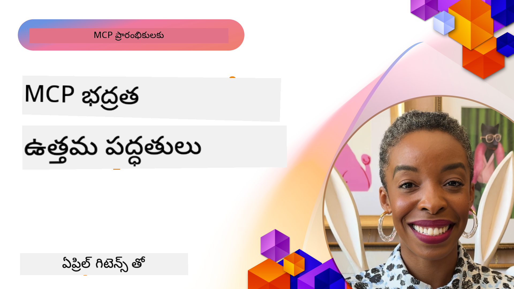

<!--
CO_OP_TRANSLATOR_METADATA:
{
  "original_hash": "1c767a35642f753127dc08545c25a290",
  "translation_date": "2025-12-11T11:18:08+00:00",
  "source_file": "02-Security/README.md",
  "language_code": "te"
}
-->
# MCP భద్రత: AI వ్యవస్థల కోసం సమగ్ర రక్షణ

_(ఈ పాఠం వీడియోను చూడడానికి పై చిత్రాన్ని క్లిక్ చేయండి)_

భద్రత AI వ్యవస్థ రూపకల్పనకు మౌలికమైనది, అందుకే మేము దీన్ని మా రెండవ విభాగంగా ప్రాధాన్యం ఇస్తున్నాము. ఇది Microsoft యొక్క [Secure Future Initiative](https://www.microsoft.com/security/blog/2025/04/17/microsofts-secure-by-design-journey-one-year-of-success/) నుండి **Secure by Design** సూత్రంతో అనుసంధానమవుతుంది.

మోడల్ కాంటెక్స్ట్ ప్రోటోకాల్ (MCP) AI-చాలిత అనువర్తనాలకు శక్తివంతమైన కొత్త సామర్థ్యాలను తీసుకువస్తుంది, అయితే ఇది సాంప్రదాయ సాఫ్ట్‌వేర్ ప్రమాదాలను మించి ప్రత్యేక భద్రతా సవాళ్లను పరిచయం చేస్తుంది. MCP వ్యవస్థలు స్థాపిత భద్రతా సమస్యలు (భద్రతా కోడింగ్, కనిష్ట హక్కులు, సరఫరా గొలుసు భద్రత) మరియు కొత్త AI-స్పెసిఫిక్ ముప్పులు, ఉదాహరణకు ప్రాంప్ట్ ఇంజెక్షన్, టూల్ విషపూరణ, సెషన్ హైజాకింగ్, కన్ఫ్యూజ్డ్ డెప్యూటీ దాడులు, టోకెన్ పాస్త్రూ లోపాలు, మరియు డైనమిక్ సామర్థ్య మార్పులను ఎదుర్కొంటాయి.

ఈ పాఠం MCP అమలులో అత్యంత కీలక భద్రతా ప్రమాదాలను పరిశీలిస్తుంది—ప్రామాణీకరణ, అనుమతి, అధిక హక్కులు, పరోక్ష ప్రాంప్ట్ ఇంజెక్షన్, సెషన్ భద్రత, కన్ఫ్యూజ్డ్ డెప్యూటీ సమస్యలు, టోకెన్ నిర్వహణ, మరియు సరఫరా గొలుసు లోపాలను కవర్ చేస్తుంది. మీరు Microsoft పరిష్కారాలు వంటి Prompt Shields, Azure Content Safety, మరియు GitHub Advanced Security ఉపయోగించి ఈ ప్రమాదాలను తగ్గించే చర్యలు మరియు ఉత్తమ ఆచారాలను నేర్చుకుంటారు.

## నేర్చుకునే లక్ష్యాలు

ఈ పాఠం ముగిసిన తర్వాత, మీరు చేయగలుగుతారు:

- **MCP-స్పెసిఫిక్ ముప్పులను గుర్తించడం**: MCP వ్యవస్థలలో ప్రత్యేక భద్రతా ప్రమాదాలను గుర్తించడం, అందులో ప్రాంప్ట్ ఇంజెక్షన్, టూల్ విషపూరణ, అధిక హక్కులు, సెషన్ హైజాకింగ్, కన్ఫ్యూజ్డ్ డెప్యూటీ సమస్యలు, టోకెన్ పాస్త్రూ లోపాలు, మరియు సరఫరా గొలుసు ప్రమాదాలు ఉన్నాయి
- **భద్రతా నియంత్రణలు అమలు చేయడం**: బలమైన ప్రామాణీకరణ, కనిష్ట హక్కుల ప్రాప్తి, భద్రతా టోకెన్ నిర్వహణ, సెషన్ భద్రత నియంత్రణలు, మరియు సరఫరా గొలుసు ధృవీకరణ వంటి సమర్థవంతమైన నివారణలను అమలు చేయడం
- **Microsoft భద్రతా పరిష్కారాలను ఉపయోగించడం**: MCP వర్క్‌లోడ్ రక్షణ కోసం Microsoft Prompt Shields, Azure Content Safety, మరియు GitHub Advanced Security ను అర్థం చేసుకుని అమలు చేయడం
- **టూల్ భద్రతను ధృవీకరించడం**: టూల్ మెటాడేటా ధృవీకరణ, డైనమిక్ మార్పుల పర్యవేక్షణ, మరియు పరోక్ష ప్రాంప్ట్ ఇంజెక్షన్ దాడుల నుండి రక్షణ యొక్క ప్రాముఖ్యతను గుర్తించడం
- **ఉత్తమ ఆచారాలను సమీకరించడం**: స్థాపిత భద్రతా మూలసూత్రాలు (భద్రతా కోడింగ్, సర్వర్ హార్డెనింగ్, జీరో ట్రస్ట్) ను MCP-స్పెసిఫిక్ నియంత్రణలతో కలిపి సమగ్ర రక్షణ కోసం ఉపయోగించడం

# MCP భద్రతా వాస్తవికత & నియంత్రణలు

ఆధునిక MCP అమలులు సాంప్రదాయ సాఫ్ట్‌వేర్ భద్రత మరియు AI-స్పెసిఫిక్ ముప్పులను పరిష్కరించే పటిష్ట భద్రతా విధానాలను అవసరం చేస్తాయి. వేగంగా అభివృద్ధి చెందుతున్న MCP స్పెసిఫికేషన్ దాని భద్రతా నియంత్రణలను మెరుగుపరుస్తూ, సంస్థ భద్రతా వాస్తవికతలతో మరియు స్థాపిత ఉత్తమ ఆచారాలతో మెరుగైన సమీకరణను సాధిస్తుంది.

[Microsoft Digital Defense Report](https://aka.ms/mddr) నుండి పరిశోధన చూపిస్తుంది **98% నివేదించబడిన ఉల్లంఘనలను బలమైన భద్రతా శుభ్రతతో నివారించవచ్చు**. అత్యంత సమర్థవంతమైన రక్షణ వ్యూహం ప్రాథమిక భద్రతా ఆచారాలను MCP-స్పెసిఫిక్ నియంత్రణలతో కలిపి ఉపయోగించడం—సిద్ధమైన భద్రతా చర్యలు మొత్తం భద్రతా ప్రమాదాన్ని తగ్గించడంలో అత్యంత ప్రభావవంతంగా ఉంటాయి.

## ప్రస్తుత భద్రతా దృశ్యం

> **గమనిక:** ఈ సమాచారం MCP భద్రతా ప్రమాణాలను **ఆగస్టు 18, 2025** నాటికి ప్రతిబింబిస్తుంది. MCP ప్రోటోకాల్ వేగంగా అభివృద్ధి చెందుతూనే ఉంది, భవిష్యత్తు అమలులు కొత్త ప్రామాణీకరణ నమూనాలు మరియు మెరుగైన నియంత్రణలను పరిచయం చేయవచ్చు. తాజా మార్గదర్శకాలకు ఎప్పుడూ ప్రస్తుత [MCP స్పెసిఫికేషన్](https://spec.modelcontextprotocol.io/), [MCP GitHub రిపోజిటరీ](https://github.com/modelcontextprotocol), మరియు [భద్రతా ఉత్తమ ఆచారాల డాక్యుమెంటేషన్](https://modelcontextprotocol.io/specification/2025-06-18/basic/security_best_practices) ను చూడండి.

### MCP ప్రామాణీకరణ అభివృద్ధి

MCP స్పెసిఫికేషన్ ప్రామాణీకరణ మరియు అనుమతుల విధానంలో గణనీయంగా అభివృద్ధి చెందింది:

- **మూల విధానం**: ప్రారంభ స్పెసిఫికేషన్లు డెవలపర్లను కస్టమ్ ప్రామాణీకరణ సర్వర్లను అమలు చేయమని కోరాయి, MCP సర్వర్లు OAuth 2.0 అనుమతి సర్వర్లుగా పనిచేసి వినియోగదారుల ప్రామాణీకరణను నేరుగా నిర్వహించేవి
- **ప్రస్తుత ప్రమాణం (2025-06-18)**: నవీకరించిన స్పెసిఫికేషన్ MCP సర్వర్లకు Microsoft Entra ID వంటి బాహ్య ఐడెంటిటీ ప్రొవైడర్లకు ప్రామాణీకరణను అప్పగించడానికి అనుమతిస్తుంది, భద్రతా స్థితిని మెరుగుపరుస్తూ అమలు సంక్లిష్టతను తగ్గిస్తుంది
- **ట్రాన్స్‌పోర్ట్ లేయర్ సెక్యూరిటీ**: స్థానిక (STDIO) మరియు రిమోట్ (Streamable HTTP) కనెక్షన్లకు సరైన ప్రామాణీకరణ నమూనాలతో భద్రతా ట్రాన్స్‌పోర్ట్ మెకానిజమ్‌లకు మెరుగైన మద్దతు

## ప్రామాణీకరణ & అనుమతి భద్రత

### ప్రస్తుత భద్రతా సవాళ్లు

ఆధునిక MCP అమలులు అనేక ప్రామాణీకరణ మరియు అనుమతి సవాళ్లను ఎదుర్కొంటున్నాయి:

### ప్రమాదాలు & ముప్పు దిశలు

- **తప్పుగా అమలైన అనుమతి లాజిక్**: MCP సర్వర్లలో లోపభూయిష్ట అనుమతి అమలు సున్నితమైన డేటాను బయటపెట్టవచ్చు మరియు తప్పుగా ప్రాప్తి నియంత్రణలను వర్తింపజేస్తుంది
- **OAuth టోకెన్ దొంగతనం**: స్థానిక MCP సర్వర్ టోకెన్ దొంగతనం దాడిదారులకు సర్వర్లుగా మోసగించి దిగువ సేవలకు ప్రాప్తి ఇస్తుంది
- **టోకెన్ పాస్త్రూ లోపాలు**: తప్పుగా టోకెన్ నిర్వహణ భద్రతా నియంత్రణలను దాటవేయడం మరియు బాధ్యతా గ్యాప్‌లను సృష్టిస్తుంది
- **అధిక హక్కులు**: అధిక హక్కులు ఉన్న MCP సర్వర్లు కనిష్ట హక్కుల సూత్రాలను ఉల్లంఘించి దాడి ఉపరితలాలను విస్తరిస్తాయి

#### టోకెన్ పాస్త్రూ: ఒక కీలక వ్యతిరేక నమూనా

ప్రస్తుత MCP అనుమతి స్పెసిఫికేషన్‌లో **టోకెన్ పాస్త్రూ స్పష్టంగా నిషేధించబడింది** తీవ్రమైన భద్రతా ప్రభావాల కారణంగా:

##### భద్రతా నియంత్రణల దాటవేత

- MCP సర్వర్లు మరియు దిగువ APIలు కీలక భద్రతా నియంత్రణలు (రేట్ లిమిటింగ్, అభ్యర్థన ధృవీకరణ, ట్రాఫిక్ పర్యవేక్షణ) అమలు చేస్తాయి, ఇవి సరైన టోకెన్ ధృవీకరణపై ఆధారపడి ఉంటాయి
- క్లయింట్ నుండి APIకి నేరుగా టోకెన్ ఉపయోగించడం ఈ అవసరమైన రక్షణలను దాటవేస్తుంది, భద్రతా వాస్తవికతను బలహీనపరుస్తుంది

##### బాధ్యత & ఆడిట్ సవాళ్లు  
- MCP సర్వర్లు ఎవరూ ఎటువంటి టోకెన్లను ఉపయోగిస్తున్నారో తేడా చేయలేవు, ఆడిట్ ట్రైల్స్ విరిగిపోతాయి
- దిగువ వనరు సర్వర్ లాగ్‌లు తప్పుదారి అభ్యర్థన మూలాలను చూపిస్తాయి, అసలు MCP సర్వర్ మధ్యవర్తులను కాదు
- సంఘటన విచారణ మరియు అనుగుణత ఆడిటింగ్ చాలా కష్టమవుతుంది

##### డేటా ఎగుమతి ప్రమాదాలు
- ధృవీకరించని టోకెన్ క్లెయిమ్‌లు దొంగతనమైన టోకెన్లతో దుష్టులకి MCP సర్వర్లను డేటా ఎగుమతికి ప్రాక్సీలుగా ఉపయోగించడానికి అనుమతిస్తాయి
- విశ్వాస సరిహద్దు ఉల్లంఘనలు అనధికార ప్రాప్తి నమూనాలను సృష్టిస్తాయి, ఉద్దేశించిన భద్రతా నియంత్రణలను దాటవేస్తాయి

##### బహుళ-సేవ దాడి దిశలు
- దొంగతనమైన టోకెన్లు అనేక సేవల ద్వారా అంగీకరించబడితే, అనుసంధాన వ్యవస్థల మధ్య లాటరల్ మూవ్‌మెంట్‌కు దారితీస్తాయి
- టోకెన్ మూలాలను ధృవీకరించలేని సందర్భాల్లో సేవల మధ్య విశ్వాస అంచనాలు ఉల్లంఘించబడవచ్చు

### భద్రతా నియంత్రణలు & నివారణలు

**కీలక భద్రతా అవసరాలు:**

> **అవసరం**: MCP సర్వర్లు **MCP సర్వర్ కోసం స్పష్టంగా జారీ చేయని టోకెన్లను అంగీకరించకూడదు**

#### ప్రామాణీకరణ & అనుమతి నియంత్రణలు

- **కఠినమైన అనుమతి సమీక్ష**: MCP సర్వర్ అనుమతి లాజిక్ యొక్క సమగ్ర ఆడిట్లను నిర్వహించి, కేవలం ఉద్దేశించిన వినియోగదారులు మరియు క్లయింట్లు సున్నిత వనరులకు ప్రాప్తి పొందేలా చూడండి
  - **అమలు మార్గదర్శకం**: [Azure API Management as Authentication Gateway for MCP Servers](https://techcommunity.microsoft.com/blog/integrationsonazureblog/azure-api-management-your-auth-gateway-for-mcp-servers/4402690)
  - **ఐడెంటిటీ సమీకరణ**: [Microsoft Entra ID ఉపయోగించి MCP సర్వర్ ప్రామాణీకరణ](https://den.dev/blog/mcp-server-auth-entra-id-session/)

- **భద్రతా టోకెన్ నిర్వహణ**: [Microsoft యొక్క టోకెన్ ధృవీకరణ మరియు జీవన చక్ర ఉత్తమ ఆచారాలు](https://learn.microsoft.com/en-us/entra/identity-platform/access-tokens) అమలు చేయండి
  - టోకెన్ ఆడియెన్స్ క్లెయిమ్‌లు MCP సర్వర్ ఐడెంటిటీకి సరిపోలుతున్నాయో ధృవీకరించండి
  - సరైన టోకెన్ రొటేషన్ మరియు గడువు విధానాలను అమలు చేయండి
  - టోకెన్ రిప్లే దాడులు మరియు అనధికార ఉపయోగాన్ని నివారించండి

- **సురక్షిత టోకెన్ నిల్వ**: విశ్రాంతి మరియు ట్రాన్సిట్‌లో టోకెన్లను గుప్తీకరణతో భద్రపరచండి
  - **ఉత్తమ ఆచారాలు**: [సురక్షిత టోకెన్ నిల్వ మరియు గుప్తీకరణ మార్గదర్శకాలు](https://youtu.be/uRdX37EcCwg?si=6fSChs1G4glwXRy2)

#### ప్రాప్తి నియంత్రణ అమలు

- **కనిష్ట హక్కుల సూత్రం**: MCP సర్వర్లకు అవసరమైన కనిష్ట హక్కులు మాత్రమే ఇవ్వండి
  - హక్కుల సమీక్షలు మరియు నవీకరణలు నిర్వహించి అధిక హక్కుల పెరుగుదల నివారించండి
  - **Microsoft డాక్యుమెంటేషన్**: [సురక్షిత కనిష్ట హక్కుల ప్రాప్తి](https://learn.microsoft.com/entra/identity-platform/secure-least-privileged-access)

- **పాత్ర ఆధారిత ప్రాప్తి నియంత్రణ (RBAC)**: సన్నిహిత పాత్ర కేటాయింపులను అమలు చేయండి
  - పాత్రలను నిర్దిష్ట వనరులు మరియు చర్యలకు కఠినంగా పరిమితం చేయండి
  - దాడి ఉపరితలాలను విస్తరించే విస్తృత లేదా అవసరంలేని హక్కులను నివారించండి

- **నిరంతర హక్కుల పర్యవేక్షణ**: ప్రాప్తి ఆడిటింగ్ మరియు పర్యవేక్షణను కొనసాగించండి
  - హక్కుల వినియోగ నమూనాలను అనామకతల కోసం పర్యవేక్షించండి
  - అధిక లేదా ఉపయోగించని హక్కులను వెంటనే సరిచేయండి

## AI-స్పెసిఫిక్ భద్రతా ముప్పులు

### ప్రాంప్ట్ ఇంజెక్షన్ & టూల్ మానిప్యులేషన్ దాడులు

ఆధునిక MCP అమలులు సాంప్రదాయ భద్రతా చర్యలు పూర్తిగా పరిష్కరించలేని సున్నితమైన AI-స్పెసిఫిక్ దాడి దిశలను ఎదుర్కొంటున్నాయి:

#### **పరోక్ష ప్రాంప్ట్ ఇంజెక్షన్ (క్రాస్-డొమైన్ ప్రాంప్ట్ ఇంజెక్షన్)**

**పరోక్ష ప్రాంప్ట్ ఇంజెక్షన్** MCP-సమర్థ AI వ్యవస్థలలో అత్యంత కీలకమైన లోపాలలో ఒకటి. దాడిదారులు దుష్ట సూచనలను బాహ్య కంటెంట్‌లో—డాక్యుమెంట్లు, వెబ్ పేజీలు, ఇమెయిల్స్, లేదా డేటా మూలాలు—దాచి, AI వ్యవస్థలు వాటిని చట్టబద్ధమైన ఆదేశాలుగా ప్రాసెస్ చేస్తాయి.

**దాడి పరిస్థితులు:**
- **డాక్యుమెంట్ ఆధారిత ఇంజెక్షన్**: ప్రాసెస్ చేసిన డాక్యుమెంట్లలో దాచిన దుష్ట సూచనలు అనుకోని AI చర్యలను ప్రేరేపిస్తాయి
- **వెబ్ కంటెంట్ దుర్వినియోగం**: దుష్టంగా మార్చబడిన వెబ్ పేజీలు AI ప్రవర్తనను మానిప్యులేట్ చేసే ఎంబెడ్డెడ్ ప్రాంప్ట్‌లను కలిగి ఉంటాయి
- **ఇమెయిల్ ఆధారిత దాడులు**: ఇమెయిల్స్‌లో దుష్ట ప్రాంప్ట్‌లు AI సహాయకులను సమాచార లీక్ చేయడానికి లేదా అనధికార చర్యలు చేయడానికి కారణమవుతాయి
- **డేటా మూలాల కలుషితం**: దుష్ట డేటాబేసులు లేదా APIలు AI వ్యవస్థలకు కలుషిత కంటెంట్ అందిస్తాయి

**వాస్తవ ప్రపంచ ప్రభావం**: ఈ దాడులు డేటా ఎగుమతి, గోప్యత ఉల్లంఘనలు, హానికర కంటెంట్ ఉత్పత్తి, మరియు వినియోగదారుల పరస్పర చర్యల మానిప్యులేషన్‌కు దారితీస్తాయి. వివరమైన విశ్లేషణ కోసం చూడండి [Prompt Injection in MCP (Simon Willison)](https://simonwillison.net/2025/Apr/9/mcp-prompt-injection/).

#### **టూల్ విషపూరణ దాడులు**

**టూల్ విషపూరణ** MCP టూల్‌లను నిర్వచించే మెటాడేటాను లక్ష్యంగా చేసుకుని, LLMలు టూల్ వివరణలు మరియు పారామీటర్లను ఎలా అర్థం చేసుకుంటాయో దుర్వినియోగం చేస్తుంది.

**దాడి విధానాలు:**
- **మెటాడేటా మానిప్యులేషన్**: దాడిదారులు టూల్ వివరణలు, పారామీటర్ నిర్వచనాలు, లేదా ఉపయోగ ఉదాహరణల్లో దుష్ట సూచనలను ఇంజెక్ట్ చేస్తారు
- **అదృశ్య సూచనలు**: టూల్ మెటాడేటాలో దాచిన ప్రాంప్ట్‌లు AI మోడల
- **అధికార ధృవీకరణ**: అధికారం అమలు చేసే MCP సర్వర్లు **అన్ని** ఇన్‌బౌండ్ అభ్యర్థనలను ధృవీకరించాలి మరియు ధృవీకరణ కోసం సెషన్లపై ఆధారపడకూడదు  
- **సురక్షిత సెషన్ సృష్టి**: క్రిప్టోగ్రాఫిక్‌గా సురక్షితమైన, నిర్దిష్టత లేని సెషన్ IDలను సురక్షిత రాండమ్ నంబర్ జనరేటర్లతో ఉత్పత్తి చేయండి  
- **వినియోగదారుని ప్రత్యేక బైండింగ్**: సెషన్ IDలను వినియోగదారుని ప్రత్యేక సమాచారంతో `<user_id>:<session_id>` వంటి ఫార్మాట్లలో బైండ్ చేయండి, తద్వారా క్రాస్-యూజర్ సెషన్ దుర్వినియోగం నివారించబడుతుంది  
- **సెషన్ జీవన చక్ర నిర్వహణ**: దుర్వినియోగ అవకాశాలను పరిమితం చేయడానికి సరైన గడువు, రొటేషన్, మరియు చెలామణీ రద్దు అమలు చేయండి  
- **ట్రాన్స్‌పోర్ట్ సెక్యూరిటీ**: సెషన్ ID దొంగతనం నివారించడానికి అన్ని కమ్యూనికేషన్‌లకు తప్పనిసరి HTTPS ఉపయోగించండి  

### గందరగోళంలో ఉన్న డిప్యూటీ సమస్య

**గందరగోళంలో ఉన్న డిప్యూటీ సమస్య** MCP సర్వర్లు క్లయింట్లు మరియు మూడవ పక్ష సేవల మధ్య ధృవీకరణ ప్రాక్సీలుగా పనిచేసినప్పుడు సంభవిస్తుంది, ఇది స్థిరమైన క్లయింట్ ID దుర్వినియోగం ద్వారా అధికారం దాటవేయడానికి అవకాశాలను సృష్టిస్తుంది.

#### **దాడి యాంత్రికతలు & ప్రమాదాలు**

- **కుకీ ఆధారిత అనుమతి దాటవేత**: గత వినియోగదారుని ధృవీకరణ అనుమతి కుకీలను సృష్టిస్తుంది, దాడి దారులు దుర్వినియోగం చేసే దుర్మార్గ అధికారం అభ్యర్థనలతో రూపొందించిన రీడైరెక్ట్ URIల ద్వారా  
- **అధికార కోడ్ దొంగతనం**: ఉన్న అనుమతి కుకీలు అధికారం సర్వర్లను అనుమతి స్క్రీన్లను దాటవేయించి, కోడ్‌లను దాడి దారుల నియంత్రణలో ఉన్న ఎండ్‌పాయింట్లకు రీడైరెక్ట్ చేస్తాయి  
- **అనధికార API యాక్సెస్**: దొంగతనమైన అధికారం కోడ్‌లు టోకెన్ మార్పిడి మరియు వినియోగదారుని నకిలీ చేయడానికి అనుమతిస్తాయి, స్పష్టమైన ఆమోదం లేకుండా  

#### **తగ్గింపు వ్యూహాలు**

**తప్పనిసరి నియంత్రణలు:**  
- **స్పష్ట అనుమతి అవసరాలు**: స్థిరమైన క్లయింట్ IDలను ఉపయోగించే MCP ప్రాక్సీ సర్వర్లు ప్రతి డైనమిక్ రిజిస్టర్ చేసిన క్లయింట్ కోసం వినియోగదారుని అనుమతి పొందాలి  
- **OAuth 2.1 సెక్యూరిటీ అమలు**: అన్ని అధికారం అభ్యర్థనల కోసం PKCE (ప్రూఫ్ కీ ఫర్ కోడ్ ఎక్స్ఛేంజ్) సహా ప్రస్తుత OAuth సెక్యూరిటీ ఉత్తమ పద్ధతులను అనుసరించండి  
- **కఠినమైన క్లయింట్ ధృవీకరణ**: దుర్వినియోగం నివారించడానికి రీడైరెక్ట్ URIలు మరియు క్లయింట్ గుర్తింపుల యొక్క కఠినమైన ధృవీకరణను అమలు చేయండి  

### టోకెన్ పాస్త్రూ లోపాలు  

**టోకెన్ పాస్త్రూ** అనేది ఒక స్పష్టమైన వ్యతిరేక నమూనా, ఇందులో MCP సర్వర్లు సరైన ధృవీకరణ లేకుండా క్లయింట్ టోకెన్లను స్వీకరించి, వాటిని డౌన్‌స్ట్రీమ్ APIలకు పంపిస్తాయి, ఇది MCP అధికారం స్పెసిఫికేషన్లను ఉల్లంఘిస్తుంది.

#### **సెక్యూరిటీ ప్రభావాలు**

- **నియంత్రణ దాటవేత**: ప్రత్యక్ష క్లయింట్-టు-API టోకెన్ వినియోగం కీలక రేట్ లిమిటింగ్, ధృవీకరణ, మరియు మానిటరింగ్ నియంత్రణలను దాటవేస్తుంది  
- **ఆడిట్ ట్రైల్ కలుషితం**: అప్‌స్ట్రీమ్ జారీ చేసిన టోకెన్లు క్లయింట్ గుర్తింపును అసాధ్యంగా చేస్తాయి, ఘటన పరిశీలన సామర్థ్యాలను విరుగ్గా చేస్తాయి  
- **ప్రాక్సీ ఆధారిత డేటా ఎక్స్‌ఫిల్ట్రేషన్**: ధృవీకరించని టోకెన్లు దుర్మార్గులకి సర్వర్లను అనధికార డేటా యాక్సెస్ కోసం ప్రాక్సీలుగా ఉపయోగించడానికి అనుమతిస్తాయి  
- **ట్రస్ట్ బౌండరీ ఉల్లంఘనలు**: టోకెన్ మూలాలను ధృవీకరించలేని సందర్భాల్లో డౌన్‌స్ట్రీమ్ సేవల ట్రస్ట్ అంచనాలు ఉల్లంఘించబడవచ్చు  
- **బహు-సేవ దాడి విస్తరణ**: అనేక సేవలలో అంగీకరించబడిన దాడి టోకెన్లు పక్కదారి కదలికను సులభతరం చేస్తాయి  

#### **అవసరమైన సెక్యూరిటీ నియంత్రణలు**

**అపరిమిత అవసరాలు:**  
- **టోకెన్ ధృవీకరణ**: MCP సర్వర్లు స్పష్టంగా MCP సర్వర్ కోసం జారీ చేయని టోకెన్లను స్వీకరించకూడదు  
- **ఆడియన్స్ ధృవీకరణ**: టోకెన్ ఆడియన్స్ క్లెయిమ్స్ MCP సర్వర్ గుర్తింపుతో సరిపోలుతాయో ఎప్పుడూ ధృవీకరించండి  
- **సరైన టోకెన్ జీవన చక్రం**: సురక్షిత రొటేషన్ పద్ధతులతో తక్కువ కాలం గల యాక్సెస్ టోకెన్లను అమలు చేయండి  

## AI వ్యవస్థల కోసం సరఫరా గొలుసు సెక్యూరిటీ

సరఫరా గొలుసు సెక్యూరిటీ సాంప్రదాయ సాఫ్ట్‌వేర్ ఆధారితతల కంటే దాటి మొత్తం AI ఎకోసిస్టమ్‌ను కవర్ చేస్తోంది. ఆధునిక MCP అమలులు అన్ని AI సంబంధిత భాగాలను కఠినంగా ధృవీకరించి, పర్యవేక్షించాలి, ఎందుకంటే ప్రతి భాగం వ్యవస్థ సమగ్రతను దెబ్బతీయగల సాంద్రతలను పరిచయం చేస్తుంది.

### విస్తరించిన AI సరఫరా గొలుసు భాగాలు

**సాంప్రదాయ సాఫ్ట్‌వేర్ ఆధారితతలు:**  
- ఓపెన్-సోర్స్ లైబ్రరీలు మరియు ఫ్రేమ్‌వర్క్‌లు  
- కంటైనర్ ఇమేజులు మరియు బేస్ సిస్టమ్స్  
- అభివృద్ధి సాధనాలు మరియు బిల్డ్ పైప్లైన్లు  
- మౌలిక సదుపాయాలు మరియు సేవలు  

**AI-ప్రత్యేక సరఫరా గొలుసు అంశాలు:**  
- **ఫౌండేషన్ మోడల్స్**: వివిధ ప్రొవైడర్ల నుండి ప్రీ-ట్రెయిన్డ్ మోడల్స్, ప్రావెనెన్స్ ధృవీకరణ అవసరం  
- **ఎంబెడ్డింగ్ సేవలు**: బాహ్య వెక్టరైజేషన్ మరియు సేమాంటిక్ సెర్చ్ సేవలు  
- **కాంటెక్స్ట్ ప్రొవైడర్లు**: డేటా మూలాలు, జ్ఞాన ఆధారాలు, మరియు డాక్యుమెంట్ రిపాజిటరీలు  
- **మూడవ పక్ష APIలు**: బాహ్య AI సేవలు, ML పైప్లైన్లు, మరియు డేటా ప్రాసెసింగ్ ఎండ్‌పాయింట్లు  
- **మోడల్ ఆర్టిఫాక్ట్స్**: వెయిట్లు, కాన్ఫిగరేషన్లు, మరియు ఫైన్-ట్యూన్డ్ మోడల్ వేరియంట్లు  
- **ట్రైనింగ్ డేటా మూలాలు**: మోడల్ ట్రైనింగ్ మరియు ఫైన్-ట్యూనింగ్ కోసం ఉపయోగించే డేటాసెట్‌లు  

### సమగ్ర సరఫరా గొలుసు సెక్యూరిటీ వ్యూహం

#### **భాగం ధృవీకరణ & ట్రస్ట్**  
- **ప్రావెనెన్స్ ధృవీకరణ**: ఏ ఐ భాగాలను ఏకీకృతం చేసేముందు మూలం, లైసెన్సింగ్, మరియు సమగ్రతను ధృవీకరించండి  
- **సెక్యూరిటీ అంచనా**: మోడల్స్, డేటా మూలాలు, మరియు AI సేవలపై దుర్బలత స్కాన్లు మరియు సెక్యూరిటీ సమీక్షలు నిర్వహించండి  
- **ఖ్యాతి విశ్లేషణ**: AI సేవా ప్రొవైడర్ల సెక్యూరిటీ ట్రాక్ రికార్డును మరియు పద్ధతులను అంచనా వేయండి  
- **అనుగుణత ధృవీకరణ**: అన్ని భాగాలు సంస్థ సెక్యూరిటీ మరియు నియంత్రణ అవసరాలను తీరుస్తున్నాయో నిర్ధారించండి  

#### **సురక్షిత డిప్లాయ్‌మెంట్ పైప్లైన్లు**  
- **ఆటోమేటెడ్ CI/CD సెక్యూరిటీ**: ఆటోమేటెడ్ డిప్లాయ్‌మెంట్ పైప్లైన్లలో సెక్యూరిటీ స్కానింగ్‌ను సమగ్రపరచండి  
- **ఆర్టిఫాక్ట్ సమగ్రత**: అన్ని డిప్లాయ్ చేసిన ఆర్టిఫాక్ట్స్ (కోడ్, మోడల్స్, కాన్ఫిగరేషన్లు) కోసం క్రిప్టోగ్రాఫిక్ ధృవీకరణను అమలు చేయండి  
- **దశల వారీ డిప్లాయ్‌మెంట్**: ప్రతి దశలో సెక్యూరిటీ ధృవీకరణతో ప్రోగ్రెసివ్ డిప్లాయ్‌మెంట్ వ్యూహాలను ఉపయోగించండి  
- **ట్రస్టెడ్ ఆర్టిఫాక్ట్ రిపాజిటరీలు**: ధృవీకరించబడిన, సురక్షిత ఆర్టిఫాక్ట్ రిజిస్ట్రీలు మరియు రిపాజిటరీల నుండి మాత్రమే డిప్లాయ్ చేయండి  

#### **నిరంతర పర్యవేక్షణ & ప్రతిస్పందన**  
- **ఆధారిత స్కానింగ్**: అన్ని సాఫ్ట్‌వేర్ మరియు AI భాగాల ఆధారితతలపై నిరంతర దుర్బలత పర్యవేక్షణ  
- **మోడల్ పర్యవేక్షణ**: మోడల్ ప్రవర్తన, పనితీరు మార్పు, మరియు సెక్యూరిటీ అసాధారణతల నిరంతర అంచనా  
- **సేవ ఆరోగ్య ట్రాకింగ్**: బాహ్య AI సేవల అందుబాటు, సెక్యూరిటీ ఘటనలు, మరియు విధాన మార్పుల పర్యవేక్షణ  
- **థ్రెట్ ఇంటెలిజెన్స్ సమగ్రత**: AI మరియు ML సెక్యూరిటీ ప్రమాదాలకు సంబంధించిన థ్రెట్ ఫీడ్లను చేర్చడం  

#### **ప్రవేశ నియంత్రణ & కనిష్ట హక్కులు**  
- **భాగ స్థాయి అనుమతులు**: వ్యాపార అవసరాల ఆధారంగా మోడల్స్, డేటా, మరియు సేవల యాక్సెస్‌ను పరిమితం చేయండి  
- **సేవా ఖాతా నిర్వహణ**: కనిష్ట అవసర అనుమతులతో ప్రత్యేక సేవా ఖాతాలను అమలు చేయండి  
- **నెట్‌వర్క్ విభజన**: AI భాగాలను వేరుచేసి, సేవల మధ్య నెట్‌వర్క్ యాక్సెస్‌ను పరిమితం చేయండి  
- **API గేట్వే నియంత్రణలు**: బాహ్య AI సేవల యాక్సెస్‌ను నియంత్రించడానికి మరియు పర్యవేక్షించడానికి కేంద్రీకృత API గేట్వేలను ఉపయోగించండి  

#### **సంఘటన ప్రతిస్పందన & పునరుద్ధరణ**  
- **త్వరిత ప్రతిస్పందన విధానాలు**: దెబ్బతిన్న AI భాగాలను ప్యాచ్ చేయడం లేదా మార్చడం కోసం స్థాపించబడిన ప్రక్రియలు  
- **ప్రామాణికత రొటేషన్**: రహస్యాలు, API కీలు, మరియు సేవా క్రెడెన్షియల్స్ రొటేట్ చేయడానికి ఆటోమేటెడ్ వ్యవస్థలు  
- **రొల్బ్యాక్ సామర్థ్యాలు**: AI భాగాల పూర్వపు తెలిసిన-మంచి సంస్కరణలకు త్వరగా తిరిగి వెళ్లే సామర్థ్యం  
- **సరఫరా గొలుసు ఉల్లంఘన పునరుద్ధరణ**: అప్‌స్ట్రీమ్ AI సేవా ఉల్లంఘనలకు ప్రతిస్పందించే ప్రత్యేక విధానాలు  

### Microsoft సెక్యూరిటీ సాధనాలు & సమగ్రత

**GitHub అడ్వాన్స్డ్ సెక్యూరిటీ** సమగ్ర సరఫరా గొలుసు రక్షణను అందిస్తుంది, ఇందులో:  
- **సీక్రెట్ స్కానింగ్**: రిపాజిటరీలలో క్రెడెన్షియల్స్, API కీలు, మరియు టోకెన్ల ఆటోమేటెడ్ గుర్తింపు  
- **ఆధారిత స్కానింగ్**: ఓపెన్-సోర్స్ ఆధారితతల మరియు లైబ్రరీల దుర్బలత అంచనా  
- **CodeQL విశ్లేషణ**: సెక్యూరిటీ లోపాలు మరియు కోడింగ్ సమస్యల కోసం స్థిర కోడ్ విశ్లేషణ  
- **సరఫరా గొలుసు అవగాహన**: ఆధారిత ఆరోగ్యం మరియు సెక్యూరిటీ స్థితి పై దృష్టి  

**Azure DevOps & Azure Repos సమగ్రత:**  
- Microsoft అభివృద్ధి వేదికలపై సెక్యూరిటీ స్కానింగ్ సమగ్రత  
- AI వర్క్‌లోడ్ల కోసం Azure పైప్లైన్లలో ఆటోమేటెడ్ సెక్యూరిటీ తనిఖీలు  
- సురక్షిత AI భాగాల డిప్లాయ్‌మెంట్ కోసం విధాన అమలు  

**Microsoft అంతర్గత పద్ధతులు:**  
Microsoft అన్ని ఉత్పత్తులలో విస్తృత సరఫరా గొలుసు సెక్యూరిటీ పద్ధతులను అమలు చేస్తుంది. [The Journey to Secure the Software Supply Chain at Microsoft](https://devblogs.microsoft.com/engineering-at-microsoft/the-journey-to-secure-the-software-supply-chain-at-microsoft/)లో నిరూపిత విధానాలను తెలుసుకోండి.  

## ఫౌండేషన్ సెక్యూరిటీ ఉత్తమ పద్ధతులు

MCP అమలులు మీ సంస్థ యొక్క ప్రస్తుత సెక్యూరిటీ స్థితిని వారసత్వంగా పొందుతాయి మరియు దానిపై నిర్మిస్తాయి. ఫౌండేషన్ సెక్యూరిటీ పద్ధతులను బలోపేతం చేయడం AI వ్యవస్థలు మరియు MCP డిప్లాయ్‌మెంట్‌ల యొక్క మొత్తం సెక్యూరిటీని గణనీయంగా మెరుగుపరుస్తుంది.

### ప్రాథమిక సెక్యూరిటీ మూలాలు

#### **సురక్షిత అభివృద్ధి పద్ధతులు**  
- **OWASP అనుగుణత**: [OWASP టాప్ 10](https://owasp.org/www-project-top-ten/) వెబ్ అప్లికేషన్ లోపాల నుండి రక్షణ  
- **AI-ప్రత్యేక రక్షణలు**: [OWASP టాప్ 10 LLMs కోసం](https://genai.owasp.org/download/43299/?tmstv=1731900559) నియంత్రణలను అమలు చేయండి  
- **సురక్షిత సీక్రెట్స్ నిర్వహణ**: టోకెన్లు, API కీలు, మరియు సున్నితమైన కాన్ఫిగరేషన్ డేటా కోసం ప్రత్యేక వాల్ట్లను ఉపయోగించండి  
- **ఎండ్-టు-ఎండ్ ఎన్‌క్రిప్షన్**: అన్ని అప్లికేషన్ భాగాలు మరియు డేటా ప్రవాహాలపై సురక్షిత కమ్యూనికేషన్ అమలు  
- **ఇన్‌పుట్ ధృవీకరణ**: అన్ని వినియోగదారుల ఇన్‌పుట్లు, API పారామీటర్లు, మరియు డేటా మూలాలపై కఠినమైన ధృవీకరణ  

#### **ఇన్‌ఫ్రాస్ట్రక్చర్ హార్డెనింగ్**  
- **బహుళ-ఫ్యాక్టర్ ధృవీకరణ**: అన్ని పరిపాలనా మరియు సేవా ఖాతాల కోసం తప్పనిసరి MFA  
- **ప్యాచ్ నిర్వహణ**: ఆపరేటింగ్ సిస్టమ్స్, ఫ్రేమ్‌వర్క్‌లు, మరియు ఆధారితతల కోసం ఆటోమేటెడ్, సమయానుకూల ప్యాచింగ్  
- **ఐడెంటిటీ ప్రొవైడర్ సమగ్రత**: ఎంటర్‌ప్రైజ్ ఐడెంటిటీ ప్రొవైడర్ల (Microsoft Entra ID, Active Directory) ద్వారా కేంద్రీకృత ఐడెంటిటీ నిర్వహణ  
- **నెట్‌వర్క్ విభజన**: MCP భాగాల తార్కిక వేరుచేసి పక్కదారి కదలిక అవకాశాలను పరిమితం చేయడం  
- **కనిష్ట హక్కుల సూత్రం**: అన్ని సిస్టమ్ భాగాలు మరియు ఖాతాల కోసం కనిష్ట అవసర అనుమతులు  

#### **సెక్యూరిటీ పర్యవేక్షణ & గుర్తింపు**  
- **సమగ్ర లాగింగ్**: MCP క్లయింట్-సర్వర్ పరస్పర చర్యల సహా AI అప్లికేషన్ కార్యకలాపాల వివరమైన లాగింగ్  
- **SIEM సమగ్రత**: అసాధారణత గుర్తింపుకు కేంద్రీకృత సెక్యూరిటీ సమాచారం మరియు ఈవెంట్ నిర్వహణ  
- **ప్రవర్తనా విశ్లేషణ
- [MCP సెక్యూరిటీ రీసెర్చ్ బ్రీఫింగ్ (Wiz Security)](https://www.wiz.io/blog/mcp-security-research-briefing#remote-servers-22)

### **Microsoft సెక్యూరిటీ సొల్యూషన్స్**
- [Microsoft Prompt Shields డాక్యుమెంటేషన్](https://learn.microsoft.com/azure/ai-services/content-safety/concepts/jailbreak-detection)
- [Azure Content Safety సర్వీస్](https://learn.microsoft.com/azure/ai-services/content-safety/)
- [Microsoft Entra ID సెక్యూరిటీ](https://learn.microsoft.com/entra/identity-platform/secure-least-privileged-access)
- [Azure టోకెన్ మేనేజ్‌మెంట్ బెస్ట్ ప్రాక్టీసెస్](https://learn.microsoft.com/entra/identity-platform/access-tokens)
- [GitHub అడ్వాన్స్డ్ సెక్యూరిటీ](https://github.com/security/advanced-security)

### **అమలు మార్గదర్శకాలు & ట్యుటోరియల్స్**
- [Azure API మేనేజ్‌మెంట్ as MCP Authentication గేట్వే](https://techcommunity.microsoft.com/blog/integrationsonazureblog/azure-api-management-your-auth-gateway-for-mcp-servers/4402690)
- [Microsoft Entra ID Authentication తో MCP సర్వర్స్](https://den.dev/blog/mcp-server-auth-entra-id-session/)
- [సురక్షిత టోకెన్ నిల్వ మరియు ఎన్‌క్రిప్షన్ (వీడియో)](https://youtu.be/uRdX37EcCwg?si=6fSChs1G4glwXRy2)

### **DevOps & సప్లై చైన్ సెక్యూరిటీ**
- [Azure DevOps సెక్యూరిటీ](https://azure.microsoft.com/products/devops)
- [Azure Repos సెక్యూరిటీ](https://azure.microsoft.com/products/devops/repos/)
- [Microsoft సప్లై చైన్ సెక్యూరిటీ జర్నీ](https://devblogs.microsoft.com/engineering-at-microsoft/the-journey-to-secure-the-software-supply-chain-at-microsoft/)

## **అదనపు సెక్యూరిటీ డాక్యుమెంటేషన్**

సమగ్ర సెక్యూరిటీ మార్గదర్శకత్వం కోసం, ఈ విభాగంలో ఉన్న ప్రత్యేక డాక్యుమెంట్లను చూడండి:

- **[MCP సెక్యూరిటీ బెస్ట్ ప్రాక్టీసెస్ 2025](./mcp-security-best-practices-2025.md)** - MCP అమలుల కోసం పూర్తి సెక్యూరిటీ బెస్ట్ ప్రాక్టీసెస్
- **[Azure Content Safety అమలు](./azure-content-safety-implementation.md)** - Azure Content Safety ఇంటిగ్రేషన్ కోసం ప్రాక్టికల్ అమలు ఉదాహరణలు  
- **[MCP సెక్యూరిటీ కంట్రోల్స్ 2025](./mcp-security-controls-2025.md)** - MCP డిప్లాయ్‌మెంట్స్ కోసం తాజా సెక్యూరిటీ కంట్రోల్స్ మరియు సాంకేతికతలు
- **[MCP బెస్ట్ ప్రాక్టీసెస్ క్విక్ రిఫరెన్స్](./mcp-best-practices.md)** - అవసరమైన MCP సెక్యూరిటీ ప్రాక్టీసెస్ కోసం క్విక్ రిఫరెన్స్ గైడ్

---

## తర్వాత ఏమిటి

తర్వాత: [అధ్యాయం 3: ప్రారంభించడం](../03-GettingStarted/README.md)

---

<!-- CO-OP TRANSLATOR DISCLAIMER START -->
**అస్పష్టత**:  
ఈ పత్రాన్ని AI అనువాద సేవ [Co-op Translator](https://github.com/Azure/co-op-translator) ఉపయోగించి అనువదించబడింది. మేము ఖచ్చితత్వానికి ప్రయత్నించినప్పటికీ, ఆటోమేటెడ్ అనువాదాల్లో పొరపాట్లు లేదా తప్పిదాలు ఉండవచ్చు. మూల పత్రం దాని స్వదేశీ భాషలో అధికారిక మూలంగా పరిగణించాలి. ముఖ్యమైన సమాచారానికి, ప్రొఫెషనల్ మానవ అనువాదం సిఫార్సు చేయబడుతుంది. ఈ అనువాదం వాడకం వల్ల కలిగే ఏవైనా అపార్థాలు లేదా తప్పుదారుల బాధ్యత మేము తీసుకోము.
<!-- CO-OP TRANSLATOR DISCLAIMER END -->