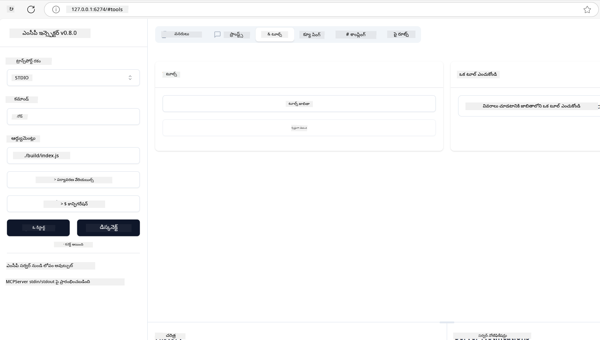
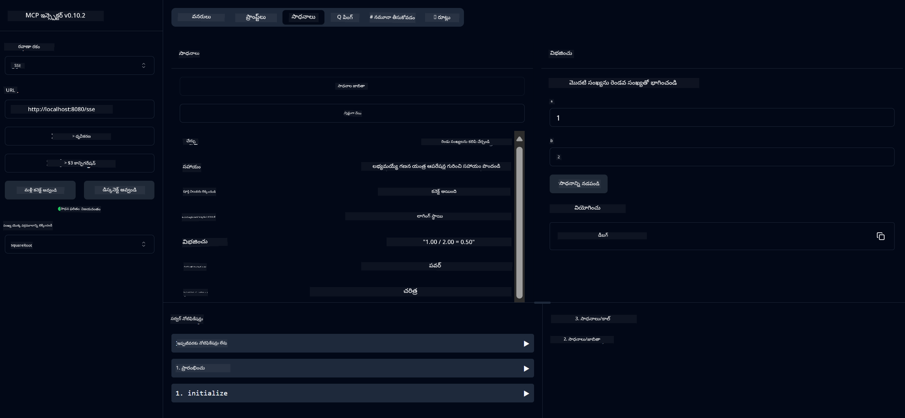
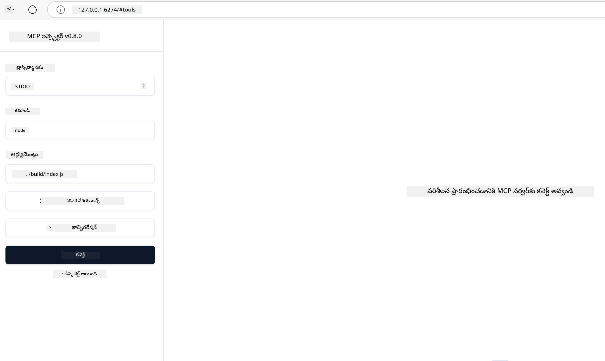
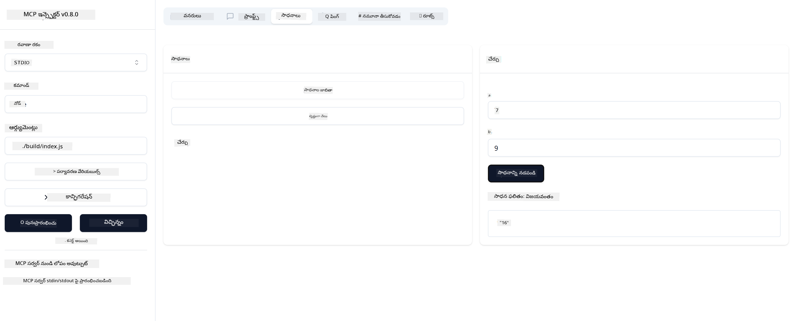

<!--
CO_OP_TRANSLATOR_METADATA:
{
  "original_hash": "8fdac7600a5f4722643d0f14e15ac259",
  "translation_date": "2025-12-11T11:54:40+00:00",
  "source_file": "03-GettingStarted/01-first-server/README.md",
  "language_code": "te"
}
-->
# MCP తో ప్రారంభించడం

Model Context Protocol (MCP) తో మీ మొదటి అడుగులకు స్వాగతం! మీరు MCP కొత్తవారైనా లేదా మీ అవగాహనను మరింత లోతుగా చేసుకోవాలనుకునే వారైనా, ఈ గైడ్ మీకు అవసరమైన సెటప్ మరియు అభివృద్ధి ప్రక్రియలో నడిపిస్తుంది. MCP ఎలా AI మోడల్స్ మరియు అప్లికేషన్ల మధ్య సులభమైన ఇంటిగ్రేషన్‌ను సాధ్యమవుతుందో మీరు తెలుసుకుంటారు, మరియు MCP ఆధారిత పరిష్కారాలను నిర్మించడానికి మరియు పరీక్షించడానికి మీ వాతావరణాన్ని త్వరగా సిద్ధం చేసుకోవడం నేర్చుకుంటారు.

> TLDR; మీరు AI యాప్స్ నిర్మిస్తే, మీరు మీ LLM (పెద్ద భాషా మోడల్)కి టూల్స్ మరియు ఇతర వనరులను జోడించవచ్చు, తద్వారా LLM మరింత జ్ఞానవంతంగా మారుతుంది. అయితే మీరు ఆ టూల్స్ మరియు వనరులను సర్వర్‌పై ఉంచితే, ఆ యాప్ మరియు సర్వర్ సామర్థ్యాలను ఏ LLM ఉన్న/లేని క్లయింట్ ఉపయోగించవచ్చు.

## అవలోకనం

ఈ పాఠం MCP వాతావరణాలను సెటప్ చేయడం మరియు మీ మొదటి MCP అప్లికేషన్లను నిర్మించడం గురించి ప్రాక్టికల్ మార్గదర్శకాన్ని అందిస్తుంది. మీరు అవసరమైన టూల్స్ మరియు ఫ్రేమ్‌వర్క్‌లను సెటప్ చేయడం, ప్రాథమిక MCP సర్వర్లను నిర్మించడం, హోస్ట్ అప్లికేషన్లను సృష్టించడం, మరియు మీ అమలు పరీక్షించడం నేర్చుకుంటారు.

Model Context Protocol (MCP) అనేది ఓపెన్ ప్రోటోకాల్, ఇది అప్లికేషన్లు LLMలకు (పెద్ద భాషా మోడల్స్) సందర్భం ఎలా అందిస్తాయో ప్రమాణీకరించేది. MCPని AI అప్లికేషన్ల కోసం USB-C పోర్ట్ లాగా భావించండి - ఇది AI మోడల్స్‌ను వివిధ డేటా మూలాలు మరియు టూల్స్‌కు కనెక్ట్ చేయడానికి ప్రమాణీకృత మార్గాన్ని అందిస్తుంది.

## నేర్చుకునే లక్ష్యాలు

ఈ పాఠం ముగిసిన తర్వాత, మీరు చేయగలుగుతారు:

- C#, Java, Python, TypeScript, మరియు Rust లో MCP అభివృద్ధి వాతావరణాలను సెటప్ చేయడం
- కస్టమ్ ఫీచర్లతో (వనరులు, ప్రాంప్ట్స్, మరియు టూల్స్) ప్రాథమిక MCP సర్వర్లను నిర్మించి డిప్లాయ్ చేయడం
- MCP సర్వర్లకు కనెక్ట్ అయ్యే హోస్ట్ అప్లికేషన్లను సృష్టించడం
- MCP అమలులను పరీక్షించి డీబగ్ చేయడం

## మీ MCP వాతావరణాన్ని సెటప్ చేయడం

MCPతో పని ప్రారంభించే ముందు, మీ అభివృద్ధి వాతావరణాన్ని సిద్ధం చేయడం మరియు ప్రాథమిక వర్క్‌ఫ్లోను అర్థం చేసుకోవడం ముఖ్యం. ఈ విభాగం MCPతో సాఫీగా ప్రారంభం కావడానికి ప్రారంభ సెటప్ దశలను మీకు మార్గనిర్దేశం చేస్తుంది.

### ముందస్తు అవసరాలు

MCP అభివృద్ధిలోకి దిగేముందు, మీరు కలిగి ఉండాలి:

- **అభివృద్ధి వాతావరణం**: మీ ఎంచుకున్న భాష (C#, Java, Python, TypeScript, లేదా Rust) కోసం
- **IDE/ఎడిటర్**: Visual Studio, Visual Studio Code, IntelliJ, Eclipse, PyCharm, లేదా ఏ ఆధునిక కోడ్ ఎడిటర్
- **ప్యాకేజ్ మేనేజర్లు**: NuGet, Maven/Gradle, pip, npm/yarn, లేదా Cargo
- **API కీలు**: మీరు హోస్ట్ అప్లికేషన్లలో ఉపయోగించబోయే ఏ AI సేవల కోసం

## ప్రాథమిక MCP సర్వర్ నిర్మాణం

ఒక MCP సర్వర్ సాధారణంగా కలిగి ఉంటుంది:

- **సర్వర్ కాన్ఫిగరేషన్**: పోర్ట్, ఆథెంటికేషన్, మరియు ఇతర సెట్టింగ్స్ సెటప్
- **వనరులు**: LLMలకు అందుబాటులో ఉన్న డేటా మరియు సందర్భం
- **టూల్స్**: మోడల్స్ పిలవగల ఫంక్షనాలిటీ
- **ప్రాంప్ట్స్**: టెక్స్ట్ ఉత్పత్తి లేదా నిర్మాణం కోసం టెంప్లేట్లు

ఇది TypeScript లో ఒక సరళీకృత ఉదాహరణ:

```typescript
import { McpServer, ResourceTemplate } from "@modelcontextprotocol/sdk/server/mcp.js";
import { StdioServerTransport } from "@modelcontextprotocol/sdk/server/stdio.js";
import { z } from "zod";

// ఒక MCP సర్వర్ సృష్టించండి
const server = new McpServer({
  name: "Demo",
  version: "1.0.0"
});

// ఒక అదనపు సాధనం జోడించండి
server.tool("add",
  { a: z.number(), b: z.number() },
  async ({ a, b }) => ({
    content: [{ type: "text", text: String(a + b) }]
  })
);

// ఒక డైనమిక్ గ్రీటింగ్ వనరును జోడించండి
server.resource(
  "file",
  // 'list' పారామీటర్ వనరు అందుబాటులో ఉన్న ఫైళ్లను ఎలా జాబితా చేస్తుందో నియంత్రిస్తుంది. దీన్ని undefined గా సెట్ చేయడం వలన ఈ వనరుకు జాబితా చేయడం నిలిపివేయబడుతుంది.
  new ResourceTemplate("file://{path}", { list: undefined }),
  async (uri, { path }) => ({
    contents: [{
      uri: uri.href,
      text: `File, ${path}!`
    }]
  })
);

// ఫైల్ కంటెంట్ చదివే ఫైల్ వనరును జోడించండి
server.resource(
  "file",
  new ResourceTemplate("file://{path}", { list: undefined }),
  async (uri, { path }) => {
    let text;
    try {
      text = await fs.readFile(path, "utf8");
    } catch (err) {
      text = `Error reading file: ${err.message}`;
    }
    return {
      contents: [{
        uri: uri.href,
        text
      }]
    };
  }
);

server.prompt(
  "review-code",
  { code: z.string() },
  ({ code }) => ({
    messages: [{
      role: "user",
      content: {
        type: "text",
        text: `Please review this code:\n\n${code}`
      }
    }]
  })
);

// stdin పై సందేశాలు స్వీకరించడం మరియు stdout పై సందేశాలు పంపించడం ప్రారంభించండి
const transport = new StdioServerTransport();
await server.connect(transport);
```

పైన కోడ్‌లో మేము:

- MCP TypeScript SDK నుండి అవసరమైన క్లాసులను దిగుమతి చేసుకున్నాము.
- కొత్త MCP సర్వర్ ఇన్స్టాన్స్ సృష్టించి కాన్ఫిగర్ చేసుకున్నాము.
- ఒక కస్టమ్ టూల్ (`calculator`)ను హ్యాండ్లర్ ఫంక్షన్‌తో రిజిస్టర్ చేసుకున్నాము.
- MCP అభ్యర్థనలను వినేందుకు సర్వర్‌ను ప్రారంభించాము.

## పరీక్షించడం మరియు డీబగ్ చేయడం

మీ MCP సర్వర్‌ను పరీక్షించడం ప్రారంభించే ముందు, అందుబాటులో ఉన్న టూల్స్ మరియు డీబగ్ చేయడానికి ఉత్తమ పద్ధతులను అర్థం చేసుకోవడం ముఖ్యం. సమర్థవంతమైన పరీక్ష మీ సర్వర్ ఆశించిన విధంగా పనిచేస్తుందో లేదో నిర్ధారిస్తుంది మరియు సమస్యలను త్వరగా గుర్తించి పరిష్కరించడంలో సహాయపడుతుంది. క్రింది విభాగం మీ MCP అమలును ధృవీకరించడానికి సిఫార్సు చేసిన విధానాలను వివరించును.

MCP మీ సర్వర్లను పరీక్షించడానికి మరియు డీబగ్ చేయడానికి సహాయపడే టూల్స్ అందిస్తుంది:

- **ఇన్స్పెక్టర్ టూల్**, ఈ గ్రాఫికల్ ఇంటర్‌ఫేస్ మీ సర్వర్‌కు కనెక్ట్ అయి మీ టూల్స్, ప్రాంప్ట్స్ మరియు వనరులను పరీక్షించడానికి అనుమతిస్తుంది.
- **curl**, మీరు curl వంటి కమాండ్ లైన్ టూల్ లేదా HTTP ఆదేశాలు సృష్టించి నడిపే ఇతర క్లయింట్లను ఉపయోగించి కూడా మీ సర్వర్‌కు కనెక్ట్ కావచ్చు.

### MCP ఇన్స్పెక్టర్ ఉపయోగించడం

[MCP ఇన్స్పెక్టర్](https://github.com/modelcontextprotocol/inspector) ఒక విజువల్ పరీక్షా టూల్, ఇది మీకు సహాయపడుతుంది:

1. **సర్వర్ సామర్థ్యాలను కనుగొనడం**: అందుబాటులో ఉన్న వనరులు, టూల్స్, మరియు ప్రాంప్ట్స్‌ను ఆటోమేటిక్‌గా గుర్తించడం
2. **టూల్ ఎగ్జిక్యూషన్ పరీక్షించడం**: వివిధ పారామీటర్లను ప్రయత్నించి ప్రత్యక్ష సమాధానాలను చూడడం
3. **సర్వర్ మెటాడేటాను వీక్షించడం**: సర్వర్ సమాచారం, స్కీమాలు, మరియు కాన్ఫిగరేషన్లను పరిశీలించడం

```bash
# ఉదాహరణ TypeScript, MCP ఇన్స్పెక్టర్ ఇన్‌స్టాల్ చేయడం మరియు నడపడం
npx @modelcontextprotocol/inspector node build/index.js
```

మీరు పై ఆదేశాలను నడిపించినప్పుడు, MCP ఇన్స్పెక్టర్ మీ బ్రౌజర్‌లో స్థానిక వెబ్ ఇంటర్‌ఫేస్‌ను ప్రారంభిస్తుంది. మీరు నమోదు చేసిన MCP సర్వర్ల డాష్‌బోర్డ్, అందుబాటులో ఉన్న టూల్స్, వనరులు, మరియు ప్రాంప్ట్స్‌ను చూడవచ్చు. ఈ ఇంటర్‌ఫేస్ టూల్ ఎగ్జిక్యూషన్‌ను ఇంటరాక్టివ్‌గా పరీక్షించడానికి, సర్వర్ మెటాడేటాను పరిశీలించడానికి, మరియు ప్రత్యక్ష సమాధానాలను వీక్షించడానికి అనుమతిస్తుంది, తద్వారా మీ MCP సర్వర్ అమలులను ధృవీకరించడం మరియు డీబగ్ చేయడం సులభమవుతుంది.

ఇది ఎలా కనిపించవచ్చో ఒక స్క్రీన్‌షాట్ ఇక్కడ ఉంది:



## సాధారణ సెటప్ సమస్యలు మరియు పరిష్కారాలు

| సమస్య | సాధ్యమైన పరిష్కారం |
|-------|-------------------|
| కనెక్షన్ తిరస్కరించబడింది | సర్వర్ నడుస్తున్నదో, పోర్ట్ సరైనదో తనిఖీ చేయండి |
| టూల్ ఎగ్జిక్యూషన్ లో లోపాలు | పారామీటర్ ధృవీకరణ మరియు లోప నిర్వహణను సమీక్షించండి |
| ఆథెంటికేషన్ విఫలమవడం | API కీలు మరియు అనుమతులను ధృవీకరించండి |
| స్కీమా ధృవీకరణ లో లోపాలు | పారామీటర్లు నిర్వచించిన స్కీమాతో సరిపోతున్నాయో చూసుకోండి |
| సర్వర్ ప్రారంభం కావడం లేదు | పోర్ట్ ఘర్షణలు లేదా లేని డిపెండెన్సీలను తనిఖీ చేయండి |
| CORS లోపాలు | క్రాస్-ఒరిజిన్ అభ్యర్థనలకు సరైన CORS హెడ్డర్లను కాన్ఫిగర్ చేయండి |
| ఆథెంటికేషన్ సమస్యలు | టోకెన్ చెల్లుబాటు మరియు అనుమతులను ధృవీకరించండి |

## లోకల్ అభివృద్ధి

లోకల్ అభివృద్ధి మరియు పరీక్ష కోసం, మీరు మీ యంత్రంపై నేరుగా MCP సర్వర్లను నడపవచ్చు:

1. **సర్వర్ ప్రాసెస్ ప్రారంభించండి**: మీ MCP సర్వర్ అప్లికేషన్‌ను నడపండి
2. **నెట్‌వర్కింగ్ కాన్ఫిగర్ చేయండి**: సర్వర్ ఆశించిన పోర్ట్‌లో అందుబాటులో ఉందని నిర్ధారించండి
3. **క్లయింట్లను కనెక్ట్ చేయండి**: `http://localhost:3000` వంటి లోకల్ కనెక్షన్ URLలను ఉపయోగించండి

```bash
# ఉదాహరణ: TypeScript MCP సర్వర్‌ను స్థానికంగా నడపడం
npm run start
# సర్వర్ http://localhost:3000 వద్ద నడుస్తోంది
```

## మీ మొదటి MCP సర్వర్ నిర్మించడం

మేము [కోర్ కాన్సెప్ట్‌లు](/01-CoreConcepts/README.md) గత పాఠంలో కవర్ చేసుకున్నాము, ఇప్పుడు ఆ జ్ఞానాన్ని ఉపయోగించడానికి సమయం.

### సర్వర్ ఏమి చేయగలదు

కోడ్ రాయడం ప్రారంభించే ముందు, సర్వర్ ఏమి చేయగలదో మళ్ళీ గుర్తు చేసుకుందాం:

ఒక MCP సర్వర్ ఉదాహరణకు:

- లోకల్ ఫైళ్లను మరియు డేటాబేస్‌లను యాక్సెస్ చేయగలదు
- రిమోట్ APIలకు కనెక్ట్ అవ్వగలదు
- గణనలను నిర్వహించగలదు
- ఇతర టూల్స్ మరియు సేవలతో ఇంటిగ్రేట్ అవ్వగలదు
- ఇంటరాక్షన్ కోసం యూజర్ ఇంటర్‌ఫేస్ అందించగలదు

బాగుంది, ఇప్పుడు మనం ఏమి చేయగలమో తెలుసుకున్నాము, కోడింగ్ ప్రారంభిద్దాం.

## వ్యాయామం: సర్వర్ సృష్టించడం

సర్వర్ సృష్టించడానికి, మీరు ఈ దశలను అనుసరించాలి:

- MCP SDKని ఇన్‌స్టాల్ చేయండి.
- ప్రాజెక్ట్ సృష్టించి ప్రాజెక్ట్ నిర్మాణాన్ని సెటప్ చేయండి.
- సర్వర్ కోడ్ రాయండి.
- సర్వర్‌ను పరీక్షించండి.

### -1- ప్రాజెక్ట్ సృష్టించండి

#### TypeScript

```sh
# ప్రాజెక్ట్ డైరెక్టరీని సృష్టించి npm ప్రాజెక్టును ప్రారంభించండి
mkdir calculator-server
cd calculator-server
npm init -y
```

#### Python

```sh
# ప్రాజెక్ట్ డైరెక్టరీని సృష్టించండి
mkdir calculator-server
cd calculator-server
# ఫోల్డర్‌ను Visual Studio Codeలో తెరవండి - మీరు వేరే IDE ఉపయోగిస్తుంటే దీన్ని దాటవేయండి
code .
```

#### .NET

```sh
dotnet new console -n McpCalculatorServer
cd McpCalculatorServer
```

#### Java

Java కోసం, Spring Boot ప్రాజెక్ట్ సృష్టించండి:

```bash
curl https://start.spring.io/starter.zip \
  -d dependencies=web \
  -d javaVersion=21 \
  -d type=maven-project \
  -d groupId=com.example \
  -d artifactId=calculator-server \
  -d name=McpServer \
  -d packageName=com.microsoft.mcp.sample.server \
  -o calculator-server.zip
```

జిప్ ఫైల్‌ను ఎక్స్‌ట్రాక్ట్ చేయండి:

```bash
unzip calculator-server.zip -d calculator-server
cd calculator-server
# ఐచ్ఛికంగా ఉపయోగించని పరీక్షను తొలగించండి
rm -rf src/test/java
```

మీ *pom.xml* ఫైల్‌కు క్రింది పూర్తి కాన్ఫిగరేషన్‌ను జోడించండి:

```xml
<?xml version="1.0" encoding="UTF-8"?>
<project xmlns="http://maven.apache.org/POM/4.0.0"
    xmlns:xsi="http://www.w3.org/2001/XMLSchema-instance"
    xsi:schemaLocation="http://maven.apache.org/POM/4.0.0 http://maven.apache.org/xsd/maven-4.0.0.xsd">
    <modelVersion>4.0.0</modelVersion>
    
    <!-- Spring Boot parent for dependency management -->
    <parent>
        <groupId>org.springframework.boot</groupId>
        <artifactId>spring-boot-starter-parent</artifactId>
        <version>3.5.0</version>
        <relativePath />
    </parent>

    <!-- Project coordinates -->
    <groupId>com.example</groupId>
    <artifactId>calculator-server</artifactId>
    <version>0.0.1-SNAPSHOT</version>
    <name>Calculator Server</name>
    <description>Basic calculator MCP service for beginners</description>

    <!-- Properties -->
    <properties>
        <java.version>21</java.version>
        <maven.compiler.source>21</maven.compiler.source>
        <maven.compiler.target>21</maven.compiler.target>
    </properties>

    <!-- Spring AI BOM for version management -->
    <dependencyManagement>
        <dependencies>
            <dependency>
                <groupId>org.springframework.ai</groupId>
                <artifactId>spring-ai-bom</artifactId>
                <version>1.0.0-SNAPSHOT</version>
                <type>pom</type>
                <scope>import</scope>
            </dependency>
        </dependencies>
    </dependencyManagement>

    <!-- Dependencies -->
    <dependencies>
        <dependency>
            <groupId>org.springframework.ai</groupId>
            <artifactId>spring-ai-starter-mcp-server-webflux</artifactId>
        </dependency>
        <dependency>
            <groupId>org.springframework.boot</groupId>
            <artifactId>spring-boot-starter-actuator</artifactId>
        </dependency>
        <dependency>
         <groupId>org.springframework.boot</groupId>
         <artifactId>spring-boot-starter-test</artifactId>
         <scope>test</scope>
      </dependency>
    </dependencies>

    <!-- Build configuration -->
    <build>
        <plugins>
            <plugin>
                <groupId>org.springframework.boot</groupId>
                <artifactId>spring-boot-maven-plugin</artifactId>
            </plugin>
            <plugin>
                <groupId>org.apache.maven.plugins</groupId>
                <artifactId>maven-compiler-plugin</artifactId>
                <configuration>
                    <release>21</release>
                </configuration>
            </plugin>
        </plugins>
    </build>

    <!-- Repositories for Spring AI snapshots -->
    <repositories>
        <repository>
            <id>spring-milestones</id>
            <name>Spring Milestones</name>
            <url>https://repo.spring.io/milestone</url>
            <snapshots>
                <enabled>false</enabled>
            </snapshots>
        </repository>
        <repository>
            <id>spring-snapshots</id>
            <name>Spring Snapshots</name>
            <url>https://repo.spring.io/snapshot</url>
            <releases>
                <enabled>false</enabled>
            </releases>
        </repository>
    </repositories>
</project>
```

#### Rust

```sh
mkdir calculator-server
cd calculator-server
cargo init
```

### -2- డిపెండెన్సీలను జోడించండి

ఇప్పుడు మీ ప్రాజెక్ట్ సృష్టించబడింది, తదుపరి డిపెండెన్సీలను జోడిద్దాం:

#### TypeScript

```sh
# ఇప్పటికే ఇన్‌స్టాల్ చేయబడకపోతే, TypeScript ను గ్లోబల్‌గా ఇన్‌స్టాల్ చేయండి
npm install typescript -g

# MCP SDK మరియు స్కీమా ధృవీకరణ కోసం Zod ను ఇన్‌స్టాల్ చేయండి
npm install @modelcontextprotocol/sdk zod
npm install -D @types/node typescript
```

#### Python

```sh
# ఒక వర్చువల్ ఎన్విరాన్‌మెంట్ సృష్టించి డిపెండెన్సీలను ఇన్‌స్టాల్ చేయండి
python -m venv venv
venv\Scripts\activate
pip install "mcp[cli]"
```

#### Java

```bash
cd calculator-server
./mvnw clean install -DskipTests
```

#### Rust

```sh
cargo add rmcp --features server,transport-io
cargo add serde
cargo add tokio --features rt-multi-thread
```

### -3- ప్రాజెక్ట్ ఫైళ్లను సృష్టించండి

#### TypeScript

*package.json* ఫైల్‌ను తెరవండి మరియు సర్వర్‌ను నిర్మించి నడపడానికి క్రింది కంటెంట్‌తో మార్చండి:

```json
{
  "name": "calculator-server",
  "version": "1.0.0",
  "main": "index.js",
  "type": "module",
  "scripts": {
    "build": "tsc",
    "start": "npm run build && node ./build/index.js",
  },
  "keywords": [],
  "author": "",
  "license": "ISC",
  "description": "A simple calculator server using Model Context Protocol",
  "dependencies": {
    "@modelcontextprotocol/sdk": "^1.16.0",
    "zod": "^3.25.76"
  },
  "devDependencies": {
    "@types/node": "^24.0.14",
    "typescript": "^5.8.3"
  }
}
```

*tsconfig.json* ను క్రింది కంటెంట్‌తో సృష్టించండి:

```json
{
  "compilerOptions": {
    "target": "ES2022",
    "module": "Node16",
    "moduleResolution": "Node16",
    "outDir": "./build",
    "rootDir": "./src",
    "strict": true,
    "esModuleInterop": true,
    "skipLibCheck": true,
    "forceConsistentCasingInFileNames": true
  },
  "include": ["src/**/*"],
  "exclude": ["node_modules"]
}
```

మీ సోర్స్ కోడ్ కోసం ఒక డైరెక్టరీ సృష్టించండి:

```sh
mkdir src
touch src/index.ts
```

#### Python

*server.py* అనే ఫైల్ సృష్టించండి

```sh
touch server.py
```

#### .NET

అవసరమైన NuGet ప్యాకేజీలను ఇన్‌స్టాల్ చేయండి:

```sh
dotnet add package ModelContextProtocol --prerelease
dotnet add package Microsoft.Extensions.Hosting
```

#### Java

Java Spring Boot ప్రాజెక్టుల కోసం, ప్రాజెక్ట్ నిర్మాణం ఆటోమేటిక్‌గా సృష్టించబడుతుంది.

#### Rust

Rust కోసం, `cargo init` నడిపినప్పుడు *src/main.rs* ఫైల్ డిఫాల్ట్‌గా సృష్టించబడుతుంది. ఫైల్‌ను తెరవండి మరియు డిఫాల్ట్ కోడ్‌ను తొలగించండి.

### -4- సర్వర్ కోడ్ సృష్టించండి

#### TypeScript

*index.ts* అనే ఫైల్ సృష్టించి క్రింది కోడ్ జోడించండి:

```typescript
import { McpServer, ResourceTemplate } from "@modelcontextprotocol/sdk/server/mcp.js";
import { StdioServerTransport } from "@modelcontextprotocol/sdk/server/stdio.js";
import { z } from "zod";
 
// ఒక MCP సర్వర్ సృష్టించండి
const server = new McpServer({
  name: "Calculator MCP Server",
  version: "1.0.0"
});
```

ఇప్పుడు మీకు ఒక సర్వర్ ఉంది, కానీ అది ఎక్కువ పని చేయదు, దాన్ని సరిచేద్దాం.

#### Python

```python
# server.py
from mcp.server.fastmcp import FastMCP

# ఒక MCP సర్వర్ సృష్టించండి
mcp = FastMCP("Demo")
```

#### .NET

```csharp
using Microsoft.Extensions.DependencyInjection;
using Microsoft.Extensions.Hosting;
using Microsoft.Extensions.Logging;
using ModelContextProtocol.Server;
using System.ComponentModel;

var builder = Host.CreateApplicationBuilder(args);
builder.Logging.AddConsole(consoleLogOptions =>
{
    // Configure all logs to go to stderr
    consoleLogOptions.LogToStandardErrorThreshold = LogLevel.Trace;
});

builder.Services
    .AddMcpServer()
    .WithStdioServerTransport()
    .WithToolsFromAssembly();
await builder.Build().RunAsync();

// add features
```

#### Java

Java కోసం, కోర్ సర్వర్ భాగాలను సృష్టించండి. మొదట, ప్రధాన అప్లికేషన్ క్లాస్‌ను మార్చండి:

*src/main/java/com/microsoft/mcp/sample/server/McpServerApplication.java*:

```java
package com.microsoft.mcp.sample.server;

import org.springframework.ai.tool.ToolCallbackProvider;
import org.springframework.ai.tool.method.MethodToolCallbackProvider;
import org.springframework.boot.SpringApplication;
import org.springframework.boot.autoconfigure.SpringBootApplication;
import org.springframework.context.annotation.Bean;
import com.microsoft.mcp.sample.server.service.CalculatorService;

@SpringBootApplication
public class McpServerApplication {

    public static void main(String[] args) {
        SpringApplication.run(McpServerApplication.class, args);
    }
    
    @Bean
    public ToolCallbackProvider calculatorTools(CalculatorService calculator) {
        return MethodToolCallbackProvider.builder().toolObjects(calculator).build();
    }
}
```

క్యాల్క్యులేటర్ సర్వీస్ సృష్టించండి *src/main/java/com/microsoft/mcp/sample/server/service/CalculatorService.java*:

```java
package com.microsoft.mcp.sample.server.service;

import org.springframework.ai.tool.annotation.Tool;
import org.springframework.stereotype.Service;

/**
 * Service for basic calculator operations.
 * This service provides simple calculator functionality through MCP.
 */
@Service
public class CalculatorService {

    /**
     * Add two numbers
     * @param a The first number
     * @param b The second number
     * @return The sum of the two numbers
     */
    @Tool(description = "Add two numbers together")
    public String add(double a, double b) {
        double result = a + b;
        return formatResult(a, "+", b, result);
    }

    /**
     * Subtract one number from another
     * @param a The number to subtract from
     * @param b The number to subtract
     * @return The result of the subtraction
     */
    @Tool(description = "Subtract the second number from the first number")
    public String subtract(double a, double b) {
        double result = a - b;
        return formatResult(a, "-", b, result);
    }

    /**
     * Multiply two numbers
     * @param a The first number
     * @param b The second number
     * @return The product of the two numbers
     */
    @Tool(description = "Multiply two numbers together")
    public String multiply(double a, double b) {
        double result = a * b;
        return formatResult(a, "*", b, result);
    }

    /**
     * Divide one number by another
     * @param a The numerator
     * @param b The denominator
     * @return The result of the division
     */
    @Tool(description = "Divide the first number by the second number")
    public String divide(double a, double b) {
        if (b == 0) {
            return "Error: Cannot divide by zero";
        }
        double result = a / b;
        return formatResult(a, "/", b, result);
    }

    /**
     * Calculate the power of a number
     * @param base The base number
     * @param exponent The exponent
     * @return The result of raising the base to the exponent
     */
    @Tool(description = "Calculate the power of a number (base raised to an exponent)")
    public String power(double base, double exponent) {
        double result = Math.pow(base, exponent);
        return formatResult(base, "^", exponent, result);
    }

    /**
     * Calculate the square root of a number
     * @param number The number to find the square root of
     * @return The square root of the number
     */
    @Tool(description = "Calculate the square root of a number")
    public String squareRoot(double number) {
        if (number < 0) {
            return "Error: Cannot calculate square root of a negative number";
        }
        double result = Math.sqrt(number);
        return String.format("√%.2f = %.2f", number, result);
    }

    /**
     * Calculate the modulus (remainder) of division
     * @param a The dividend
     * @param b The divisor
     * @return The remainder of the division
     */
    @Tool(description = "Calculate the remainder when one number is divided by another")
    public String modulus(double a, double b) {
        if (b == 0) {
            return "Error: Cannot divide by zero";
        }
        double result = a % b;
        return formatResult(a, "%", b, result);
    }

    /**
     * Calculate the absolute value of a number
     * @param number The number to find the absolute value of
     * @return The absolute value of the number
     */
    @Tool(description = "Calculate the absolute value of a number")
    public String absolute(double number) {
        double result = Math.abs(number);
        return String.format("|%.2f| = %.2f", number, result);
    }

    /**
     * Get help about available calculator operations
     * @return Information about available operations
     */
    @Tool(description = "Get help about available calculator operations")
    public String help() {
        return "Basic Calculator MCP Service\n\n" +
               "Available operations:\n" +
               "1. add(a, b) - Adds two numbers\n" +
               "2. subtract(a, b) - Subtracts the second number from the first\n" +
               "3. multiply(a, b) - Multiplies two numbers\n" +
               "4. divide(a, b) - Divides the first number by the second\n" +
               "5. power(base, exponent) - Raises a number to a power\n" +
               "6. squareRoot(number) - Calculates the square root\n" + 
               "7. modulus(a, b) - Calculates the remainder of division\n" +
               "8. absolute(number) - Calculates the absolute value\n\n" +
               "Example usage: add(5, 3) will return 5 + 3 = 8";
    }

    /**
     * Format the result of a calculation
     */
    private String formatResult(double a, String operator, double b, double result) {
        return String.format("%.2f %s %.2f = %.2f", a, operator, b, result);
    }
}
```

**ప్రొడక్షన్-రెడీ సర్వీస్ కోసం ఐచ్ఛిక భాగాలు:**

స్టార్టప్ కాన్ఫిగరేషన్ సృష్టించండి *src/main/java/com/microsoft/mcp/sample/server/config/StartupConfig.java*:

```java
package com.microsoft.mcp.sample.server.config;

import org.springframework.boot.CommandLineRunner;
import org.springframework.context.annotation.Bean;
import org.springframework.context.annotation.Configuration;

@Configuration
public class StartupConfig {
    
    @Bean
    public CommandLineRunner startupInfo() {
        return args -> {
            System.out.println("\n" + "=".repeat(60));
            System.out.println("Calculator MCP Server is starting...");
            System.out.println("SSE endpoint: http://localhost:8080/sse");
            System.out.println("Health check: http://localhost:8080/actuator/health");
            System.out.println("=".repeat(60) + "\n");
        };
    }
}
```

హెల్త్ కంట్రోలర్ సృష్టించండి *src/main/java/com/microsoft/mcp/sample/server/controller/HealthController.java*:

```java
package com.microsoft.mcp.sample.server.controller;

import org.springframework.http.ResponseEntity;
import org.springframework.web.bind.annotation.GetMapping;
import org.springframework.web.bind.annotation.RestController;
import java.time.LocalDateTime;
import java.util.HashMap;
import java.util.Map;

@RestController
public class HealthController {
    
    @GetMapping("/health")
    public ResponseEntity<Map<String, Object>> healthCheck() {
        Map<String, Object> response = new HashMap<>();
        response.put("status", "UP");
        response.put("timestamp", LocalDateTime.now().toString());
        response.put("service", "Calculator MCP Server");
        return ResponseEntity.ok(response);
    }
}
```

ఎక్స్‌సెప్షన్ హ్యాండ్లర్ సృష్టించండి *src/main/java/com/microsoft/mcp/sample/server/exception/GlobalExceptionHandler.java*:

```java
package com.microsoft.mcp.sample.server.exception;

import org.springframework.http.HttpStatus;
import org.springframework.http.ResponseEntity;
import org.springframework.web.bind.annotation.ExceptionHandler;
import org.springframework.web.bind.annotation.RestControllerAdvice;

@RestControllerAdvice
public class GlobalExceptionHandler {

    @ExceptionHandler(IllegalArgumentException.class)
    public ResponseEntity<ErrorResponse> handleIllegalArgumentException(IllegalArgumentException ex) {
        ErrorResponse error = new ErrorResponse(
            "Invalid_Input", 
            "Invalid input parameter: " + ex.getMessage());
        return new ResponseEntity<>(error, HttpStatus.BAD_REQUEST);
    }

    public static class ErrorResponse {
        private String code;
        private String message;

        public ErrorResponse(String code, String message) {
            this.code = code;
            this.message = message;
        }

        // గెటర్లు
        public String getCode() { return code; }
        public String getMessage() { return message; }
    }
}
```

కస్టమ్ బ్యానర్ సృష్టించండి *src/main/resources/banner.txt*:

```text
_____      _            _       _             
 / ____|    | |          | |     | |            
| |     __ _| | ___ _   _| | __ _| |_ ___  _ __ 
| |    / _` | |/ __| | | | |/ _` | __/ _ \| '__|
| |___| (_| | | (__| |_| | | (_| | || (_) | |   
 \_____\__,_|_|\___|\__,_|_|\__,_|\__\___/|_|   
                                                
Calculator MCP Server v1.0
Spring Boot MCP Application
```

</details>

#### Rust

*src/main.rs* ఫైల్ టాప్‌లో క్రింది కోడ్ జోడించండి. ఇది మీ MCP సర్వర్ కోసం అవసరమైన లైబ్రరీలు మరియు మాడ్యూల్స్‌ను దిగుమతి చేస్తుంది.

```rust
use rmcp::{
    handler::server::{router::tool::ToolRouter, tool::Parameters},
    model::{ServerCapabilities, ServerInfo},
    schemars, tool, tool_handler, tool_router,
    transport::stdio,
    ServerHandler, ServiceExt,
};
use std::error::Error;
```

క్యాల్క్యులేటర్ సర్వర్ రెండు సంఖ్యలను కలిపే సాదారణ సర్వర్ అవుతుంది. క్యాల్క్యులేటర్ అభ్యర్థనను సూచించడానికి ఒక struct సృష్టిద్దాం.

```rust
#[derive(Debug, serde::Deserialize, schemars::JsonSchema)]
pub struct CalculatorRequest {
    pub a: f64,
    pub b: f64,
}
```

తర్వాత, క్యాల్క్యులేటర్ సర్వర్‌ను సూచించడానికి struct సృష్టించండి. ఈ struct టూల్ రౌటర్‌ను కలిగి ఉంటుంది, ఇది టూల్స్‌ను రిజిస్టర్ చేయడానికి ఉపయోగిస్తారు.

```rust
#[derive(Debug, Clone)]
pub struct Calculator {
    tool_router: ToolRouter<Self>,
}
```

ఇప్పుడు, `Calculator` structను అమలు చేసి సర్వర్ యొక్క కొత్త ఇన్స్టాన్స్ సృష్టించండి మరియు సర్వర్ సమాచారం అందించడానికి సర్వర్ హ్యాండ్లర్‌ను అమలు చేయండి.

```rust
#[tool_router]
impl Calculator {
    pub fn new() -> Self {
        Self {
            tool_router: Self::tool_router(),
        }
    }
}

#[tool_handler]
impl ServerHandler for Calculator {
    fn get_info(&self) -> ServerInfo {
        ServerInfo {
            instructions: Some("A simple calculator tool".into()),
            capabilities: ServerCapabilities::builder().enable_tools().build(),
            ..Default::default()
        }
    }
}
```

చివరగా, సర్వర్ ప్రారంభించడానికి ప్రధాన ఫంక్షన్‌ను అమలు చేయాలి. ఈ ఫంక్షన్ `Calculator` struct ఇన్స్టాన్స్ సృష్టించి స్టాండర్డ్ ఇన్‌పుట్/ఔట్‌పుట్ ద్వారా సర్వ్ చేస్తుంది.

```rust
#[tokio::main]
async fn main() -> Result<(), Box<dyn Error>> {
    let service = Calculator::new().serve(stdio()).await?;
    service.waiting().await?;
    Ok(())
}
```

సర్వర్ ఇప్పుడు తన గురించి ప్రాథమిక సమాచారాన్ని అందించడానికి సిద్ధంగా ఉంది. తదుపరి, జోడింపు నిర్వహించడానికి ఒక టూల్ జోడిస్తాము.

### -5- టూల్ మరియు వనరును జోడించడం

క్రింది కోడ్ జోడించి ఒక టూల్ మరియు వనరును జోడించండి:

#### TypeScript

```typescript
server.tool(
  "add",
  { a: z.number(), b: z.number() },
  async ({ a, b }) => ({
    content: [{ type: "text", text: String(a + b) }]
  })
);

server.resource(
  "greeting",
  new ResourceTemplate("greeting://{name}", { list: undefined }),
  async (uri, { name }) => ({
    contents: [{
      uri: uri.href,
      text: `Hello, ${name}!`
    }]
  })
);
```

మీ టూల్ `a` మరియు `b` అనే పారామీటర్లను తీసుకుని క్రింది రూపంలో స్పందనను ఉత్పత్తి చేసే ఫంక్షన్ నడుపుతుంది:

```typescript
{
  contents: [{
    type: "text", content: "some content"
  }]
}
```

మీ వనరు "greeting" అనే స్ట్రింగ్ ద్వారా యాక్సెస్ చేయబడుతుంది, ఇది `name` అనే పారామీటర్ తీసుకుని టూల్‌కు సమానమైన స్పందనను ఉత్పత్తి చేస్తుంది:

```typescript
{
  uri: "<href>",
  text: "a text"
}
```

#### Python

```python
# ఒక జోడింపు సాధనాన్ని జోడించండి
@mcp.tool()
def add(a: int, b: int) -> int:
    """Add two numbers"""
    return a + b


# ఒక డైనమిక్ గ్రీటింగ్ వనరును జోడించండి
@mcp.resource("greeting://{name}")
def get_greeting(name: str) -> str:
    """Get a personalized greeting"""
    return f"Hello, {name}!"
```

పైన కోడ్‌లో మేము:

- `add` అనే టూల్‌ను నిర్వచించాము, ఇది `a` మరియు `b` అనే రెండు ఇంటిజర్ పారామీటర్లను తీసుకుంటుంది.
- `greeting` అనే వనరును సృష్టించాము, ఇది `name` అనే పారామీటర్ తీసుకుంటుంది.

#### .NET

దీన్ని మీ Program.cs ఫైల్‌లో జోడించండి:

```csharp
[McpServerToolType]
public static class CalculatorTool
{
    [McpServerTool, Description("Adds two numbers")]
    public static string Add(int a, int b) => $"Sum {a + b}";
}
```

#### Java

టూల్స్ ఇప్పటికే గత దశలో సృష్టించబడ్డాయి.

#### Rust

`impl Calculator` బ్లాక్ లో కొత్త టూల్ జోడించండి:

```rust
#[tool(description = "Adds a and b")]
async fn add(
    &self,
    Parameters(CalculatorRequest { a, b }): Parameters<CalculatorRequest>,
) -> String {
    (a + b).to_string()
}
```

### -6- తుది కోడ్

సర్వర్ ప్రారంభించడానికి అవసరమైన చివరి కోడ్‌ను జోడిద్దాం:

#### TypeScript

```typescript
// stdin పై సందేశాలు స్వీకరించడం ప్రారంభించి stdout పై సందేశాలు పంపించడం ప్రారంభించండి
const transport = new StdioServerTransport();
await server.connect(transport);
```

పూర్తి కోడ్ ఇక్కడ ఉంది:

```typescript
// index.ts
import { McpServer, ResourceTemplate } from "@modelcontextprotocol/sdk/server/mcp.js";
import { StdioServerTransport } from "@modelcontextprotocol/sdk/server/stdio.js";
import { z } from "zod";

// ఒక MCP సర్వర్ సృష్టించండి
const server = new McpServer({
  name: "Calculator MCP Server",
  version: "1.0.0"
});

// ఒక అదనపు సాధనం జోడించండి
server.tool(
  "add",
  { a: z.number(), b: z.number() },
  async ({ a, b }) => ({
    content: [{ type: "text", text: String(a + b) }]
  })
);

// ఒక డైనమిక్ గ్రీటింగ్ వనరు జోడించండి
server.resource(
  "greeting",
  new ResourceTemplate("greeting://{name}", { list: undefined }),
  async (uri, { name }) => ({
    contents: [{
      uri: uri.href,
      text: `Hello, ${name}!`
    }]
  })
);

// stdin పై సందేశాలు స్వీకరించడం మరియు stdout పై సందేశాలు పంపించడం ప్రారంభించండి
const transport = new StdioServerTransport();
server.connect(transport);
```

#### Python

```python
# server.py
from mcp.server.fastmcp import FastMCP

# ఒక MCP సర్వర్ సృష్టించండి
mcp = FastMCP("Demo")


# ఒక జోడింపు సాధనం జోడించండి
@mcp.tool()
def add(a: int, b: int) -> int:
    """Add two numbers"""
    return a + b


# ఒక డైనమిక్ గ్రీటింగ్ వనరు జోడించండి
@mcp.resource("greeting://{name}")
def get_greeting(name: str) -> str:
    """Get a personalized greeting"""
    return f"Hello, {name}!"

# ప్రధాన అమలు బ్లాక్ - సర్వర్ నడపడానికి ఇది అవసరం
if __name__ == "__main__":
    mcp.run()
```

#### .NET

క్రింది కంటెంట్‌తో Program.cs ఫైల్ సృష్టించండి:

```csharp
using Microsoft.Extensions.DependencyInjection;
using Microsoft.Extensions.Hosting;
using Microsoft.Extensions.Logging;
using ModelContextProtocol.Server;
using System.ComponentModel;

var builder = Host.CreateApplicationBuilder(args);
builder.Logging.AddConsole(consoleLogOptions =>
{
    // Configure all logs to go to stderr
    consoleLogOptions.LogToStandardErrorThreshold = LogLevel.Trace;
});

builder.Services
    .AddMcpServer()
    .WithStdioServerTransport()
    .WithToolsFromAssembly();
await builder.Build().RunAsync();

[McpServerToolType]
public static class CalculatorTool
{
    [McpServerTool, Description("Adds two numbers")]
    public static string Add(int a, int b) => $"Sum {a + b}";
}
```

#### Java

మీ పూర్తి ప్రధాన అప్లికేషన్ క్లాస్ ఇలా ఉండాలి:

@@CODE_BLOCK_
`Command` ఫీల్డ్‌లో `python` మరియు `Arguments` గా `server.py` సెట్ చేయడం నిర్ధారించుకోండి. ఇది స్క్రిప్ట్ సరిగ్గా నడవడానికి సహాయపడుతుంది.

#### .NET

మీ ప్రాజెక్ట్ డైరెక్టరీలో ఉన్నారని నిర్ధారించుకోండి:

```sh
cd McpCalculatorServer
npx @modelcontextprotocol/inspector dotnet run
```

#### Java

మీ calculator server నడుస్తున్నదని నిర్ధారించుకోండి
అనంతరం inspector ను నడపండి:

```cmd
npx @modelcontextprotocol/inspector
```

inspector వెబ్ ఇంటర్‌ఫేస్‌లో:

1. ట్రాన్స్‌పోర్ట్ టైప్‌గా "SSE" ఎంచుకోండి
2. URL ను ఇలా సెట్ చేయండి: `http://localhost:8080/sse`
3. "Connect" పై క్లిక్ చేయండి



**మీరు ఇప్పుడు సర్వర్‌కు కనెక్ట్ అయ్యారు**
**Java సర్వర్ టెస్టింగ్ సెక్షన్ ఇప్పుడు పూర్తయింది**

తదుపరి సెక్షన్ సర్వర్‌తో ఇంటరాక్ట్ చేయడం గురించి.

మీకు క్రింది యూజర్ ఇంటర్‌ఫేస్ కనిపించాలి:



1. Connect బటన్ ఎంచుకుని సర్వర్‌కు కనెక్ట్ అవ్వండి
  సర్వర్‌కు కనెక్ట్ అయిన తర్వాత, మీరు క్రింది దాన్ని చూడగలరు:

  

1. "Tools" మరియు "listTools" ఎంచుకోండి, "Add" కనిపించాలి, "Add" ఎంచుకుని పారామీటర్ విలువలు పూరించండి.

  మీరు క్రింది ప్రతిస్పందనను చూడగలరు, అంటే "add" టూల్ నుండి ఫలితం:

  

అభినందనలు, మీరు మీ మొదటి సర్వర్‌ను సృష్టించి నడిపించగలిగారు!

#### Rust

MCP Inspector CLI తో Rust సర్వర్ నడపడానికి, క్రింది కమాండ్ ఉపయోగించండి:

```sh
npx @modelcontextprotocol/inspector cargo run --cli --method tools/call --tool-name add --tool-arg a=1 b=2
```

### అధికారిక SDKలు

MCP అనేక భాషల కోసం అధికారిక SDKలను అందిస్తుంది:

- [C# SDK](https://github.com/modelcontextprotocol/csharp-sdk) - Microsoft తో కలిసి నిర్వహించబడుతుంది
- [Java SDK](https://github.com/modelcontextprotocol/java-sdk) - Spring AI తో కలిసి నిర్వహించబడుతుంది
- [TypeScript SDK](https://github.com/modelcontextprotocol/typescript-sdk) - అధికారిక TypeScript అమలు
- [Python SDK](https://github.com/modelcontextprotocol/python-sdk) - అధికారిక Python అమలు
- [Kotlin SDK](https://github.com/modelcontextprotocol/kotlin-sdk) - అధికారిక Kotlin అమలు
- [Swift SDK](https://github.com/modelcontextprotocol/swift-sdk) - Loopwork AI తో కలిసి నిర్వహించబడుతుంది
- [Rust SDK](https://github.com/modelcontextprotocol/rust-sdk) - అధికారిక Rust అమలు

## ముఖ్యమైన విషయాలు

- MCP అభివృద్ధి వాతావరణాన్ని భాషా-ప్రత్యేక SDKలతో సులభంగా ఏర్పాటు చేయవచ్చు
- MCP సర్వర్‌లను టూల్స్ సృష్టించడం మరియు స్పష్టమైన స్కీమాలతో నమోదు చేయడం ద్వారా నిర్మిస్తారు
- పరీక్షించడం మరియు డీబగ్గింగ్ MCP అమలులకు విశ్వసనీయత కోసం అవసరం

## నమూనాలు

- [Java Calculator](../samples/java/calculator/README.md)
- [.Net Calculator](../../../../03-GettingStarted/samples/csharp)
- [JavaScript Calculator](../samples/javascript/README.md)
- [TypeScript Calculator](../samples/typescript/README.md)
- [Python Calculator](../../../../03-GettingStarted/samples/python)
- [Rust Calculator](../../../../03-GettingStarted/samples/rust)

## అసైన్‌మెంట్

మీ ఇష్టమైన టూల్‌తో ఒక సింపుల్ MCP సర్వర్ సృష్టించండి:

1. మీ ఇష్టమైన భాషలో టూల్‌ను అమలు చేయండి (.NET, Java, Python, TypeScript, లేదా Rust).
2. ఇన్‌పుట్ పారామీటర్లు మరియు రిటర్న్ విలువలను నిర్వచించండి.
3. సర్వర్ సరిగ్గా పనిచేస్తుందో లేదో నిర్ధారించడానికి inspector టూల్ నడపండి.
4. వివిధ ఇన్‌పుట్‌లతో అమలును పరీక్షించండి.

## పరిష్కారం

[Solution](./solution/README.md)

## అదనపు వనరులు

- [Azure పై Model Context Protocol ఉపయోగించి ఏజెంట్లను నిర్మించడం](https://learn.microsoft.com/azure/developer/ai/intro-agents-mcp)
- [Azure Container Apps తో రిమోట్ MCP (Node.js/TypeScript/JavaScript)](https://learn.microsoft.com/samples/azure-samples/mcp-container-ts/mcp-container-ts/)
- [.NET OpenAI MCP ఏజెంట్](https://learn.microsoft.com/samples/azure-samples/openai-mcp-agent-dotnet/openai-mcp-agent-dotnet/)

## తదుపరి

తదుపరి: [MCP క్లయింట్లతో ప్రారంభించడం](../02-client/README.md)

---

<!-- CO-OP TRANSLATOR DISCLAIMER START -->
**అస్పష్టత**:  
ఈ పత్రాన్ని AI అనువాద సేవ [Co-op Translator](https://github.com/Azure/co-op-translator) ఉపయోగించి అనువదించబడింది. మేము ఖచ్చితత్వానికి ప్రయత్నించినప్పటికీ, ఆటోమేటెడ్ అనువాదాల్లో పొరపాట్లు లేదా తప్పిదాలు ఉండవచ్చు. మూల పత్రం దాని స్వదేశీ భాషలో అధికారిక మూలంగా పరిగణించాలి. ముఖ్యమైన సమాచారానికి, ప్రొఫెషనల్ మానవ అనువాదం సిఫార్సు చేయబడుతుంది. ఈ అనువాదం వాడకంలో ఏర్పడిన ఏవైనా అపార్థాలు లేదా తప్పుదారితీసే అర్థాలు కోసం మేము బాధ్యత వహించము.
<!-- CO-OP TRANSLATOR DISCLAIMER END -->