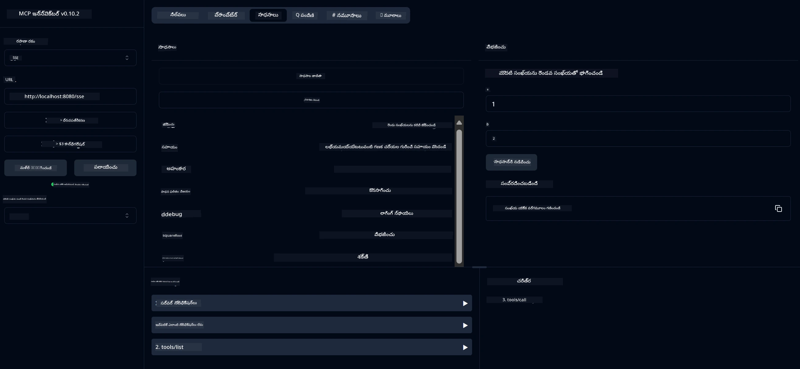

# ప్రాథమిక క్యాల్క్యులేటర్ MCP సర్వీస్

ఈ సర్వీస్ మోడల్ కాంటెక్స్ట్ ప్రోటోకాల్ (MCP) ద్వారా స్ప్రింగ్ బూట్‌తో వెబ్‌ఫ్లక్స్ ట్రాన్స్‌పోర్ట్ ఉపయోగించి ప్రాథమిక క్యాల్క్యులేటర్ ఆపరేషన్లను అందిస్తుంది. ఇది MCP అమలు గురించి నేర్చుకుంటున్న ప్రారంభకులకు ఒక సాదా ఉదాహరణగా రూపొందించబడింది.

మరింత సమాచారం కోసం, [MCP సర్వర్ బూట్ స్టార్టర్](https://docs.spring.io/spring-ai/reference/api/mcp/mcp-server-boot-starter-docs.html) సూచన డాక్యుమెంటేషన్ చూడండి.


## సర్వీస్ ఉపయోగించడం

సర్వీస్ MCP ప్రోటోకాల్ ద్వారా క్రింది API ఎండ్‌పాయింట్లను అందిస్తుంది:

- `add(a, b)`: రెండు సంఖ్యలను కలపండి
- `subtract(a, b)`: రెండవ సంఖ్యను మొదటి నుండి తీసివేయండి
- `multiply(a, b)`: రెండు సంఖ్యలను గుణించండి
- `divide(a, b)`: మొదటి సంఖ్యను రెండవదితో భాగించండి (జీరో తనిఖీతో)
- `power(base, exponent)`: ఒక సంఖ్య యొక్క శక్తిని లెక్కించండి
- `squareRoot(number)`: వర్గమూలాన్ని లెక్కించండి (నెగటివ్ సంఖ్య తనిఖీతో)
- `modulus(a, b)`: భాగించినప్పుడు మిగులు లెక్కించండి
- `absolute(number)`: పరమాణు విలువను లెక్కించండి

## ఆధారాలు

ప్రాజెక్ట్ క్రింది ముఖ్య ఆధారాలను అవసరం:

```xml
<dependency>
    <groupId>org.springframework.ai</groupId>
    <artifactId>spring-ai-starter-mcp-server-webflux</artifactId>
</dependency>
```

## ప్రాజెక్ట్ నిర్మాణం

మావెన్ ఉపయోగించి ప్రాజెక్ట్‌ను నిర్మించండి:
```bash
./mvnw clean install -DskipTests
```

## సర్వర్ నడపడం

### జావా ఉపయోగించడం

```bash
java -jar target/calculator-server-0.0.1-SNAPSHOT.jar
```

### MCP ఇన్స్పెక్టర్ ఉపయోగించడం

MCP ఇన్స్పెక్టర్ MCP సర్వీసులతో పరస్పర చర్య చేయడానికి సహాయక సాధనం. ఈ క్యాల్క్యులేటర్ సర్వీస్‌తో ఉపయోగించడానికి:

1. **MCP ఇన్స్పెక్టర్‌ను ఇన్‌స్టాల్ చేసి నడపండి** కొత్త టెర్మినల్ విండోలో:
   ```bash
   npx @modelcontextprotocol/inspector
   ```

2. **యాప్ చూపించే URL (సాధారణంగా http://localhost:6274) పై క్లిక్ చేసి వెబ్ UI యాక్సెస్ చేయండి**

3. **కనెక్షన్‌ను కాన్ఫిగర్ చేయండి**:
   - ట్రాన్స్‌పోర్ట్ రకాన్ని "SSE" గా సెట్ చేయండి
   - మీ నడుస్తున్న సర్వర్ యొక్క SSE ఎండ్‌పాయింట్ URL ను సెట్ చేయండి: `http://localhost:8080/sse`
   - "Connect" పై క్లిక్ చేయండి

4. **సాధనాలను ఉపయోగించండి**:
   - అందుబాటులో ఉన్న క్యాల్క్యులేటర్ ఆపరేషన్లను చూడటానికి "List Tools" పై క్లిక్ చేయండి
   - ఒక సాధనాన్ని ఎంచుకుని ఆపరేషన్ నడపడానికి "Run Tool" పై క్లిక్ చేయండి



---

<!-- CO-OP TRANSLATOR DISCLAIMER START -->
**అస్పష్టత**:  
ఈ పత్రాన్ని AI అనువాద సేవ [Co-op Translator](https://github.com/Azure/co-op-translator) ఉపయోగించి అనువదించబడింది. మేము ఖచ్చితత్వానికి ప్రయత్నించినప్పటికీ, ఆటోమేటెడ్ అనువాదాల్లో పొరపాట్లు లేదా తప్పిదాలు ఉండవచ్చు. మూల పత్రం దాని స్వదేశీ భాషలో అధికారిక మూలంగా పరిగణించాలి. ముఖ్యమైన సమాచారానికి, ప్రొఫెషనల్ మానవ అనువాదం సిఫార్సు చేయబడుతుంది. ఈ అనువాదం వాడకంలో ఏర్పడిన ఏవైనా అపార్థాలు లేదా తప్పుదారుల కోసం మేము బాధ్యత వహించము.
<!-- CO-OP TRANSLATOR DISCLAIMER END -->