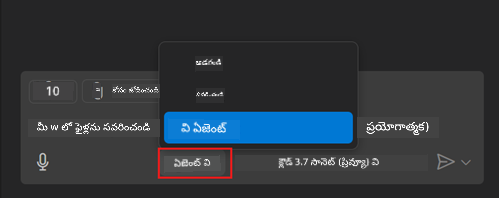
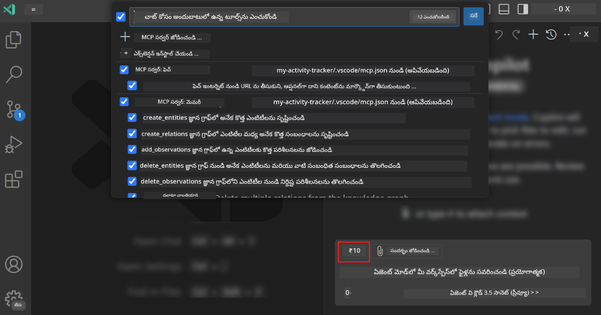
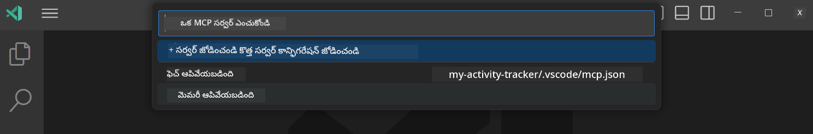
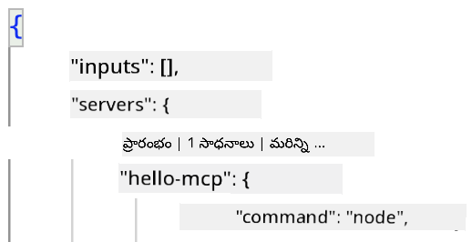
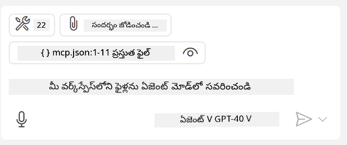

<!--
CO_OP_TRANSLATOR_METADATA:
{
  "original_hash": "d940b5e0af75e3a3a4d1c3179120d1d9",
  "translation_date": "2025-12-11T12:08:59+00:00",
  "source_file": "03-GettingStarted/04-vscode/README.md",
  "language_code": "te"
}
-->
# GitHub Copilot ఏజెంట్ మోడ్ నుండి సర్వర్‌ను వినియోగించడం

Visual Studio Code మరియు GitHub Copilot క్లయింట్‌గా పనిచేసి MCP సర్వర్‌ను వినియోగించవచ్చు. మీరు ఎందుకు అలా చేయాలనుకుంటారు అని అడగవచ్చు? అంటే MCP సర్వర్ కలిగిన ఏ ఫీచర్లు ఉన్నా అవి ఇప్పుడు మీ IDE లోనుండి ఉపయోగించుకోవచ్చు. ఉదాహరణకు GitHub యొక్క MCP సర్వర్‌ను జోడిస్తే, టెర్మినల్‌లో నిర్దిష్ట కమాండ్లను టైప్ చేయడం కాకుండా ప్రాంప్ట్‌ల ద్వారా GitHub ను నియంత్రించవచ్చు. లేదా సాధారణంగా ఏదైనా మీ డెవలపర్ అనుభవాన్ని మెరుగుపరచగలిగే దాన్ని సహజ భాష ద్వారా నియంత్రించవచ్చు. ఇప్పుడు మీరు విజయం చూడటం మొదలుపెట్టారు కదా?

## అవలోకనం

ఈ పాఠం Visual Studio Code మరియు GitHub Copilot యొక్క ఏజెంట్ మోడ్‌ను మీ MCP సర్వర్ కోసం క్లయింట్‌గా ఎలా ఉపయోగించాలో కవర్ చేస్తుంది.

## నేర్చుకునే లక్ష్యాలు

ఈ పాఠం ముగిసిన తర్వాత, మీరు చేయగలుగుతారు:

- Visual Studio Code ద్వారా MCP సర్వర్‌ను వినియోగించండి.
- GitHub Copilot ద్వారా టూల్స్ వంటి సామర్థ్యాలను నడపండి.
- Visual Studio Code ను మీ MCP సర్వర్‌ను కనుగొని నిర్వహించడానికి కాన్ఫిగర్ చేయండి.

## ఉపయోగం

మీ MCP సర్వర్‌ను రెండు విధాలుగా నియంత్రించవచ్చు:

- యూజర్ ఇంటర్‌ఫేస్, ఇది ఈ అధ్యాయం తర్వాతి భాగంలో ఎలా చేయాలో చూడవచ్చు.
- టెర్మినల్, `code` ఎగ్జిక్యూటబుల్ ఉపయోగించి టెర్మినల్ నుండి విషయాలను నియంత్రించడం సాధ్యం:

  మీ యూజర్ ప్రొఫైల్‌కు MCP సర్వర్‌ను జోడించడానికి, --add-mcp కమాండ్ లైన్ ఆప్షన్ ఉపయోగించి, JSON సర్వర్ కాన్ఫిగరేషన్‌ను {\"name\":\"server-name\",\"command\":...} రూపంలో అందించండి.

  ```
  code --add-mcp "{\"name\":\"my-server\",\"command\": \"uvx\",\"args\": [\"mcp-server-fetch\"]}"
  ```

### స్క్రీన్‌షాట్లు





మనం తర్వాతి విభాగాల్లో విజువల్ ఇంటర్‌ఫేస్‌ను ఎలా ఉపయోగించాలో మరింత చర్చిద్దాం.

## దృష్టికోణం

ఇది ఎలా చేయాలో ఉన్నత స్థాయిలో ఇలా:

- మా MCP సర్వర్‌ను కనుగొనడానికి ఒక ఫైల్‌ను కాన్ఫిగర్ చేయండి.
- ఆ సర్వర్‌ను ప్రారంభించి/కనెక్ట్ చేసి దాని సామర్థ్యాలను జాబితా చేయించుకోండి.
- ఆ సామర్థ్యాలను GitHub Copilot చాట్ ఇంటర్‌ఫేస్ ద్వారా ఉపయోగించండి.

బాగుంది, ఇప్పుడు ప్రవాహాన్ని అర్థం చేసుకున్నాము, Visual Studio Code ద్వారా MCP సర్వర్‌ను ఉపయోగించడానికి ఒక వ్యాయామం చేద్దాం.

## వ్యాయామం: సర్వర్‌ను వినియోగించడం

ఈ వ్యాయామంలో, Visual Studio Code ను మీ MCP సర్వర్‌ను కనుగొనడానికి కాన్ఫిగర్ చేస్తాము, తద్వారా GitHub Copilot చాట్ ఇంటర్‌ఫేస్ నుండి ఉపయోగించవచ్చు.

### -0- ముందస్తు దశ, MCP సర్వర్ కనుగొనడం ప్రారంభించండి

MCP సర్వర్‌ల కనుగొనడం ప్రారంభించాల్సి ఉండవచ్చు.

1. Visual Studio Code లో `File -> Preferences -> Settings` కు వెళ్లండి.

1. "MCP" కోసం శోధించి `chat.mcp.discovery.enabled` ను settings.json ఫైల్‌లో ప్రారంభించండి.

### -1- కాన్ఫిగరేషన్ ఫైల్ సృష్టించండి

మీ ప్రాజెక్ట్ రూట్‌లో ఒక కాన్ఫిగరేషన్ ఫైల్ సృష్టించడం ప్రారంభించండి, మీరు MCP.json అనే ఫైల్‌ను .vscode అనే ఫోల్డర్‌లో ఉంచాలి. ఇది ఇలా ఉండాలి:

```text
.vscode
|-- mcp.json
```

తర్వాత, సర్వర్ ఎంట్రీని ఎలా జోడించాలో చూద్దాం.

### -2- సర్వర్‌ను కాన్ఫిగర్ చేయండి

* mcp.json * లో క్రింది విషయాన్ని జోడించండి:

```json
{
    "inputs": [],
    "servers": {
       "hello-mcp": {
           "command": "node",
           "args": [
               "build/index.js"
           ]
       }
    }
}
```

పై ఉదాహరణలో Node.js లో రాసిన సర్వర్‌ను ప్రారంభించడం ఎలా అనేది చూపించబడింది, ఇతర రన్‌టైమ్‌ల కోసం సర్వర్ ప్రారంభించడానికి సరైన కమాండ్‌ను `command` మరియు `args` ఉపయోగించి సూచించండి.

### -3- సర్వర్‌ను ప్రారంభించండి

మీరు ఎంట్రీని జోడించిన తర్వాత, సర్వర్‌ను ప్రారంభిద్దాం:

1. *mcp.json* లో మీ ఎంట్రీని కనుగొని "play" ఐకాన్ కనిపిస్తుందో లేదో చూసుకోండి:

    

1. "play" ఐకాన్‌పై క్లిక్ చేయండి, GitHub Copilot చాట్‌లో టూల్స్ ఐకాన్ అందుబాటులో ఉన్న టూల్స్ సంఖ్య పెరిగినట్లు కనిపిస్తుంది. ఆ టూల్స్ ఐకాన్‌పై క్లిక్ చేస్తే, నమోదు చేసిన టూల్స్ జాబితా కనిపిస్తుంది. మీరు GitHub Copilot వాటిని సందర్భంగా ఉపయోగించాలనుకుంటే ప్రతి టూల్‌ను చెక్/అన్ చెక్ చేయవచ్చు:

  

1. ఒక టూల్ నడపడానికి, మీ టూల్స్ వివరణకు సరిపోయే ప్రాంప్ట్ టైప్ చేయండి, ఉదాహరణకు "add 22 to 1" వంటి ప్రాంప్ట్:

  

  మీరు 23 అని స్పందన చూడగలుగుతారు.

## అసైన్‌మెంట్

మీ *mcp.json* ఫైల్‌లో సర్వర్ ఎంట్రీని జోడించి సర్వర్‌ను ప్రారంభించగలరని/ఆపగలరని నిర్ధారించండి. అలాగే GitHub Copilot చాట్ ఇంటర్‌ఫేస్ ద్వారా మీ సర్వర్ టూల్స్‌తో కమ్యూనికేట్ చేయగలరని నిర్ధారించండి.

## పరిష్కారం

[పరిష్కారం](./solution/README.md)

## ముఖ్యమైన పాఠాలు

ఈ అధ్యాయం నుండి ముఖ్యమైన పాఠాలు:

- Visual Studio Code అనేది అనేక MCP సర్వర్‌లు మరియు వాటి టూల్స్‌ను వినియోగించుకునే గొప్ప క్లయింట్.
- GitHub Copilot చాట్ ఇంటర్‌ఫేస్ ద్వారా మీరు సర్వర్‌లతో పరస్పరం చేస్తారు.
- మీరు API కీలు వంటి ఇన్‌పుట్‌ల కోసం యూజర్‌ను ప్రాంప్ట్ చేయవచ్చు, అవి *mcp.json* ఫైల్‌లో సర్వర్ ఎంట్రీని కాన్ఫిగర్ చేసినప్పుడు MCP సర్వర్‌కు పంపవచ్చు.

## నమూనాలు

- [Java క్యాల్క్యులేటర్](../samples/java/calculator/README.md)
- [.Net క్యాల్క్యులేటర్](../../../../03-GettingStarted/samples/csharp)
- [JavaScript క్యాల్క్యులేటర్](../samples/javascript/README.md)
- [TypeScript క్యాల్క్యులేటర్](../samples/typescript/README.md)
- [Python క్యాల్క్యులేటర్](../../../../03-GettingStarted/samples/python)

## అదనపు వనరులు

- [Visual Studio డాక్యుమెంటేషన్](https://code.visualstudio.com/docs/copilot/chat/mcp-servers)

## తదుపరి ఏమిటి

- తదుపరి: [stdio సర్వర్ సృష్టించడం](../05-stdio-server/README.md)

---

<!-- CO-OP TRANSLATOR DISCLAIMER START -->
**అస్పష్టత**:  
ఈ పత్రాన్ని AI అనువాద సేవ [Co-op Translator](https://github.com/Azure/co-op-translator) ఉపయోగించి అనువదించబడింది. మేము ఖచ్చితత్వానికి ప్రయత్నించినప్పటికీ, ఆటోమేటెడ్ అనువాదాల్లో పొరపాట్లు లేదా తప్పిదాలు ఉండవచ్చు. మూల పత్రం దాని స్వదేశీ భాషలో అధికారిక మూలంగా పరిగణించాలి. ముఖ్యమైన సమాచారానికి, ప్రొఫెషనల్ మానవ అనువాదం సిఫార్సు చేయబడుతుంది. ఈ అనువాదం వాడకంలో ఏర్పడిన ఏవైనా అపార్థాలు లేదా తప్పుదారితీసే అర్థాలు కోసం మేము బాధ్యత వహించము.
<!-- CO-OP TRANSLATOR DISCLAIMER END -->