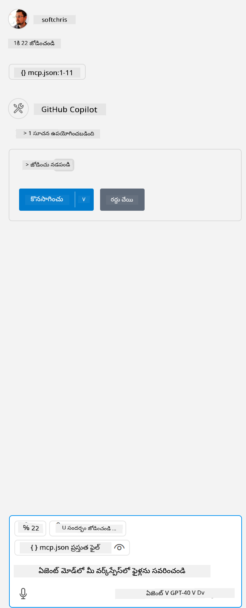

<!--
CO_OP_TRANSLATOR_METADATA:
{
  "original_hash": "5ef8f5821c1a04f7b1fc4f15098ecab8",
  "translation_date": "2025-12-11T13:16:51+00:00",
  "source_file": "03-GettingStarted/04-vscode/solution/README.md",
  "language_code": "te"
}
-->
# నమూనా నడపడం

ఇక్కడ మీరు ఇప్పటికే పని చేస్తున్న సర్వర్ కోడ్ ఉన్నట్లు అనుకుంటున్నాము. దయచేసి ముందటి అధ్యాయాలలోని ఒక సర్వర్‌ను కనుగొనండి.

## mcp.json సెటప్ చేయండి

ఇది మీరు సూచన కోసం ఉపయోగించే ఫైల్, [mcp.json](../../../../../03-GettingStarted/04-vscode/solution/mcp.json).

మీ సర్వర్‌కు సంబంధించిన పూర్తి కమాండ్‌తో పాటు సర్వర్ యొక్క పూర్తి మార్గాన్ని సూచించడానికి సర్వర్ ఎంట్రీని అవసరమైతే మార్చండి.

పై ఉదాహరణ ఫైల్‌లో సర్వర్ ఎంట్రీ ఇలా ఉంటుంది:

<details>
<summary>node.js</summary>
```json
"hello-mcp": {
    "command": "node",
    "args": [
        "build/index.js"
    ]
}
```
</details>

<details>
<summary>.NET</summary>

మీరు GitHub రిపాజిటరీ రూట్‌ను నమోదు చేయవలసి ఉండవచ్చు, ఇది `git rev-parse --show-toplevel` కమాండ్ ద్వారా పొందవచ్చు.

```jsonc
{
  "inputs": [
    {
      "type": "promptString",
      "id": "repository-root",
      "description": "The absolute path to the repository root"
    }
  ],
  "servers": {
    "calculator-mcp-dotnet": {
      "type": "stdio",
      "command": "dotnet",
      "args": [
        "run",
        "--project",
        "${input:repository-root}/03-GettingStarted/02-client/solution/server/server.csproj"
      ]
    }
  }
}
```

</details>

ఇది ఈ విధంగా కమాండ్ నడపడం అనుగుణంగా ఉంటుంది: `node build/index.js`.

- మీ సర్వర్ ఫైల్ ఎక్కడ ఉందో లేదా మీరు ఎంచుకున్న రన్‌టైమ్ మరియు సర్వర్ స్థానం ఆధారంగా సర్వర్ ప్రారంభించడానికి అవసరమైన దానిని సరిపడేలా ఈ సర్వర్ ఎంట్రీని మార్చండి.

## సర్వర్‌లో ఫీచర్లను వినియోగించండి

- మీరు *mcp.json* ను *./vscode* ఫోల్డర్‌లో జోడించిన తర్వాత, `play` ఐకాన్‌పై క్లిక్ చేయండి,

    GitHub Copilotలో చాట్ ఫీల్డ్ పై భాగంలో ఉన్న టూలింగ్ ఐకాన్ మార్పును గమనించండి, ఇది అందుబాటులో ఉన్న టూల్స్ సంఖ్య పెరుగుతుందని సూచిస్తుంది.

## ఒక టూల్ నడపండి

- మీ చాట్ విండోలో మీ టూల్ వివరణకు సరిపోయే ప్రాంప్ట్ టైప్ చేయండి. ఉదాహరణకు `add` టూల్‌ను ట్రిగ్గర్ చేయడానికి "add 3 to 20" వంటి వాక్యం టైప్ చేయండి.

    మీరు చాట్ టెక్స్ట్ బాక్స్ పై భాగంలో టూల్ ప్రదర్శించబడుతున్నదని చూడగలుగుతారు, ఇది మీరు టూల్ నడపడానికి ఎంచుకోవాలని సూచిస్తుంది, ఈ దృశ్యంలా:

    

    మీరు ఎంచుకున్న టూల్ "23" అనే సంఖ్యాత్మక ఫలితాన్ని ఉత్పత్తి చేయాలి, మీరు ముందుగా చెప్పినట్లుగా ప్రాంప్ట్ ఉంటే.

---

<!-- CO-OP TRANSLATOR DISCLAIMER START -->
**అస్పష్టత**:  
ఈ పత్రాన్ని AI అనువాద సేవ [Co-op Translator](https://github.com/Azure/co-op-translator) ఉపయోగించి అనువదించబడింది. మేము ఖచ్చితత్వానికి ప్రయత్నించినప్పటికీ, ఆటోమేటెడ్ అనువాదాల్లో పొరపాట్లు లేదా తప్పిదాలు ఉండవచ్చు. మూల పత్రం దాని స్వదేశీ భాషలో అధికారిక మూలంగా పరిగణించాలి. ముఖ్యమైన సమాచారానికి, ప్రొఫెషనల్ మానవ అనువాదం సిఫార్సు చేయబడుతుంది. ఈ అనువాదం వాడకంలో ఏర్పడిన ఏవైనా అపార్థాలు లేదా తప్పుదారితీసే అర్థాలు కోసం మేము బాధ్యత వహించము.
<!-- CO-OP TRANSLATOR DISCLAIMER END -->