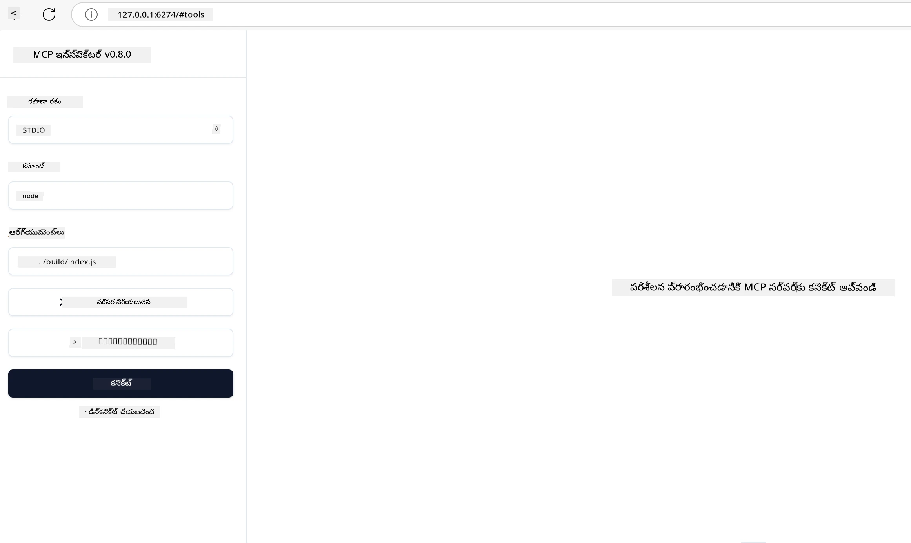

## పరీక్ష మరియు డీబగ్గింగ్

మీ MCP సర్వర్‌ను పరీక్షించడం ప్రారంభించే ముందు, అందుబాటులో ఉన్న టూల్స్ మరియు డీబగ్గింగ్ కోసం ఉత్తమ పద్ధతులను అర్థం చేసుకోవడం ముఖ్యం. సమర్థవంతమైన పరీక్ష మీ సర్వర్ ఆశించిన విధంగా పనిచేస్తుందో లేదో నిర్ధారిస్తుంది మరియు సమస్యలను త్వరగా గుర్తించి పరిష్కరించడంలో సహాయపడుతుంది. క్రింది విభాగం మీ MCP అమలును ధృవీకరించడానికి సిఫార్సు చేయబడిన విధానాలను వివరించును.

## అవలోకనం

ఈ పాఠం సరైన పరీక్షా విధానాన్ని ఎంచుకోవడం మరియు అత్యంత సమర్థవంతమైన పరీక్షా సాధనాన్ని ఎలా ఉపయోగించాలో కవర్ చేస్తుంది.

## నేర్చుకునే లక్ష్యాలు

ఈ పాఠం ముగిసిన తర్వాత, మీరు చేయగలుగుతారు:

- పరీక్ష కోసం వివిధ విధానాలను వివరించండి.
- మీ కోడ్‌ను సమర్థవంతంగా పరీక్షించడానికి వివిధ సాధనాలను ఉపయోగించండి.

## MCP సర్వర్లను పరీక్షించడం

MCP మీ సర్వర్లను పరీక్షించడానికి మరియు డీబగ్ చేయడానికి సహాయపడే సాధనాలను అందిస్తుంది:

- **MCP ఇన్స్పెక్టర్**: CLI టూల్ మరియు విజువల్ టూల్‌గా రెండింటిగా నడపగల కమాండ్ లైన్ టూల్.
- **మాన్యువల్ పరీక్ష**: మీరు curl వంటి టూల్ ఉపయోగించి వెబ్ అభ్యర్థనలను నడపవచ్చు, కానీ HTTP నడపగల ఏ టూల్ అయినా సరిపోతుంది.
- **యూనిట్ పరీక్ష**: సర్వర్ మరియు క్లయింట్ రెండింటి ఫీచర్లను పరీక్షించడానికి మీ ఇష్టమైన పరీక్షా ఫ్రేమ్‌వర్క్‌ను ఉపయోగించడం సాధ్యం.

### MCP ఇన్స్పెక్టర్ ఉపయోగించడం

మునుపటి పాఠాలలో ఈ టూల్ ఉపయోగాన్ని వివరించాము కానీ ఇక్కడ దీని గురించి కొంత సమగ్రంగా మాట్లాడుకుందాం. ఇది Node.jsలో నిర్మించబడిన టూల్ మరియు మీరు `npx` ఎగ్జిక్యూటబుల్‌ను పిలిచి దీన్ని ఉపయోగించవచ్చు, ఇది టూల్‌ను తాత్కాలికంగా డౌన్లోడ్ చేసి ఇన్‌స్టాల్ చేసి, మీ అభ్యర్థన నడిపిన తర్వాత స్వయంచాలకంగా క్లియర్ చేస్తుంది.

[MCP ఇన్స్పెక్టర్](https://github.com/modelcontextprotocol/inspector) మీకు సహాయపడుతుంది:

- **సర్వర్ సామర్థ్యాలను కనుగొనడం**: అందుబాటులో ఉన్న వనరులు, సాధనాలు, ప్రాంప్ట్‌లను ఆటోమేటిక్‌గా గుర్తించడం
- **సాధన అమలును పరీక్షించడం**: వివిధ పారామితులను ప్రయత్నించి ప్రత్యక్ష సమాధానాలను చూడడం
- **సర్వర్ మెటాడేటాను వీక్షించడం**: సర్వర్ సమాచారం, స్కీమాలు, కాన్ఫిగరేషన్లను పరిశీలించడం

సాధన సాధారణంగా ఇలా నడుస్తుంది:

```bash
npx @modelcontextprotocol/inspector node build/index.js
```

పై కమాండ్ MCP మరియు దాని విజువల్ ఇంటర్‌ఫేస్‌ను ప్రారంభించి, మీ బ్రౌజర్‌లో స్థానిక వెబ్ ఇంటర్‌ఫేస్‌ను ప్రారంభిస్తుంది. మీరు నమోదు చేసిన MCP సర్వర్లు, అందుబాటులో ఉన్న సాధనాలు, వనరులు, ప్రాంప్ట్‌లను ప్రదర్శించే డాష్‌బోర్డ్‌ను చూడవచ్చు. ఈ ఇంటర్‌ఫేస్ ద్వారా మీరు ఇంటరాక్టివ్‌గా సాధన అమలును పరీక్షించవచ్చు, సర్వర్ మెటాడేటాను పరిశీలించవచ్చు మరియు ప్రత్యక్ష సమాధానాలను వీక్షించవచ్చు, ఇది మీ MCP సర్వర్ అమలులను ధృవీకరించడంలో మరియు డీబగ్ చేయడంలో సులభతరం చేస్తుంది.

ఇది ఇలా కనిపించవచ్చు: 

మీరు ఈ టూల్‌ను CLI మోడ్‌లో కూడా నడపవచ్చు, ఆ సందర్భంలో `--cli` అట్రిబ్యూట్‌ను జోడించండి. సర్వర్‌పై ఉన్న అన్ని సాధనాలను జాబితా చేసే "CLI" మోడ్‌లో టూల్ నడిపే ఉదాహరణ ఇక్కడ ఉంది:

```sh
npx @modelcontextprotocol/inspector --cli node build/index.js --method tools/list
```

### మాన్యువల్ పరీక్ష

సర్వర్ సామర్థ్యాలను పరీక్షించడానికి ఇన్స్పెక్టర్ టూల్‌ను నడపడం తప్ప మరొక సమానమైన విధానం HTTP ఉపయోగించగల క్లయింట్‌ను నడపడం, ఉదాహరణకు curl.

curl తో, మీరు MCP సర్వర్లను నేరుగా HTTP అభ్యర్థనలతో పరీక్షించవచ్చు:

```bash
# ఉదాహరణ: పరీక్ష సర్వర్ మెటాడేటా
curl http://localhost:3000/v1/metadata

# ఉదాహరణ: ఒక సాధనాన్ని అమలు చేయండి
curl -X POST http://localhost:3000/v1/tools/execute \
  -H "Content-Type: application/json" \
  -d '{"name": "calculator", "parameters": {"expression": "2+2"}}'
```

పై curl ఉపయోగం నుండి మీరు చూడగలిగినట్లుగా, మీరు సాధనను పిలవడానికి POST అభ్యర్థనను ఉపయోగిస్తారు, ఇందులో సాధన పేరు మరియు దాని పారామితులు ఉన్న పేలొడ్ ఉంటుంది. మీకు సరిపోయే విధానాన్ని ఉపయోగించండి. CLI సాధనాలు సాధారణంగా వేగంగా ఉపయోగించడానికి అనుకూలంగా ఉంటాయి మరియు స్క్రిప్ట్ చేయడానికి అనువుగా ఉంటాయి, ఇది CI/CD వాతావరణంలో ఉపయోగకరంగా ఉంటుంది.

### యూనిట్ పరీక్ష

మీ సాధనాలు మరియు వనరుల కోసం యూనిట్ పరీక్షలను సృష్టించండి, అవి ఆశించిన విధంగా పనిచేస్తున్నాయో లేదో నిర్ధారించడానికి. ఇక్కడ కొన్ని ఉదాహరణ పరీక్షా కోడ్ ఉంది.

```python
import pytest

from mcp.server.fastmcp import FastMCP
from mcp.shared.memory import (
    create_connected_server_and_client_session as create_session,
)

# అసింక్ పరీక్షల కోసం మొత్తం మాడ్యూల్‌ను గుర్తించండి
pytestmark = pytest.mark.anyio


async def test_list_tools_cursor_parameter():
    """Test that the cursor parameter is accepted for list_tools.

    Note: FastMCP doesn't currently implement pagination, so this test
    only verifies that the cursor parameter is accepted by the client.
    """

 server = FastMCP("test")

    # కొన్ని పరీక్షా సాధనాలను సృష్టించండి
    @server.tool(name="test_tool_1")
    async def test_tool_1() -> str:
        """First test tool"""
        return "Result 1"

    @server.tool(name="test_tool_2")
    async def test_tool_2() -> str:
        """Second test tool"""
        return "Result 2"

    async with create_session(server._mcp_server) as client_session:
        # కర్సర్ పారామీటర్ లేకుండా పరీక్షించండి (వదిలివేయబడింది)
        result1 = await client_session.list_tools()
        assert len(result1.tools) == 2

        # కర్సర్=None తో పరీక్షించండి
        result2 = await client_session.list_tools(cursor=None)
        assert len(result2.tools) == 2

        # కర్సర్‌ను స్ట్రింగ్‌గా ఉపయోగించి పరీక్షించండి
        result3 = await client_session.list_tools(cursor="some_cursor_value")
        assert len(result3.tools) == 2

        # ఖాళీ స్ట్రింగ్ కర్సర్‌తో పరీక్షించండి
        result4 = await client_session.list_tools(cursor="")
        assert len(result4.tools) == 2
    
```

పైన ఇచ్చిన కోడ్ ఈ క్రింది పనులు చేస్తుంది:

- pytest ఫ్రేమ్‌వర్క్‌ను ఉపయోగిస్తుంది, ఇది మీరు ఫంక్షన్లుగా పరీక్షలను సృష్టించి assert స్టేట్మెంట్లను ఉపయోగించడానికి అనుమతిస్తుంది.
- రెండు వేర్వేరు సాధనాలతో MCP సర్వర్‌ను సృష్టిస్తుంది.
- కొన్ని షరతులు నెరవేరాయో లేదో తనిఖీ చేయడానికి `assert` స్టేట్మెంట్‌ను ఉపయోగిస్తుంది.

[పూర్తి ఫైల్ ఇక్కడ చూడండి](https://github.com/modelcontextprotocol/python-sdk/blob/main/tests/client/test_list_methods_cursor.py)

పై ఫైల్ ఆధారంగా, మీరు మీ సొంత సర్వర్‌ను పరీక్షించి సామర్థ్యాలు సరిగ్గా సృష్టించబడ్డాయో లేదో నిర్ధారించవచ్చు.

అన్ని ప్రధాన SDKలు ఇలాంటి పరీక్షా విభాగాలను కలిగి ఉంటాయి కాబట్టి మీరు మీ ఎంచుకున్న రన్‌టైమ్‌కు అనుగుణంగా సర్దుబాటు చేసుకోవచ్చు.

## నమూనాలు

- [జావా క్యాల్క్యులేటర్](../samples/java/calculator/README.md)
- [.Net క్యాల్క్యులేటర్](../../../../03-GettingStarted/samples/csharp)
- [జావాస్క్రిప్ట్ క్యాల్క్యులేటర్](../samples/javascript/README.md)
- [టైప్‌స్క్రిప్ట్ క్యాల్క్యులేటర్](../samples/typescript/README.md)
- [పైథాన్ క్యాల్క్యులేటర్](../../../../03-GettingStarted/samples/python)

## అదనపు వనరులు

- [Python SDK](https://github.com/modelcontextprotocol/python-sdk)

## తదుపరి ఏమిటి

- తదుపరి: [డిప్లాయ్‌మెంట్](../09-deployment/README.md)

---

<!-- CO-OP TRANSLATOR DISCLAIMER START -->
**అస్పష్టత**:  
ఈ పత్రాన్ని AI అనువాద సేవ [Co-op Translator](https://github.com/Azure/co-op-translator) ఉపయోగించి అనువదించబడింది. మేము ఖచ్చితత్వానికి ప్రయత్నించినప్పటికీ, ఆటోమేటెడ్ అనువాదాల్లో పొరపాట్లు లేదా తప్పులు ఉండవచ్చు. మూల పత్రం దాని స్వదేశీ భాషలోనే అధికారిక మూలంగా పరిగణించాలి. ముఖ్యమైన సమాచారానికి, ప్రొఫెషనల్ మానవ అనువాదం సిఫార్సు చేయబడుతుంది. ఈ అనువాదం వాడకంలో ఏర్పడిన ఏవైనా అపార్థాలు లేదా తప్పుదారితీసే అర్థాలు కోసం మేము బాధ్యత వహించము.
<!-- CO-OP TRANSLATOR DISCLAIMER END -->