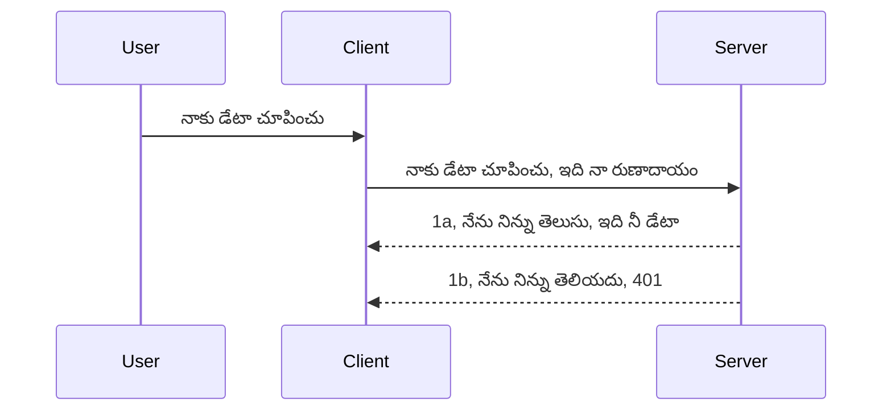

# Simple auth

MCP SDKs OAuth 2.1 ఉపయోగాన్ని మద్దతు ఇస్తాయి, ఇది నిజానికి చాలా సంక్లిష్టమైన ప్రక్రియ ఒక auth సర్వర్, రిసోర్స్ సర్వర్, క్రెడెండ్షియల్స్ పోస్ట్ చేయడం, కోడ్ పొందడం, ఆ కోడ్‌ను బేరర్ టోకెన్ కోసం మార్టిచేయడం తద్వారా మీరు చివరికి మీ రిసోర్స్ డేటాను పొందగలుగుతారు అనే సంకల్పనలను కలిగి ఉంటుంది. మీరు OAuth కి ఆడ-fashioned కానివారు అయితే, ఇది అమలు చేయడానికి అద్భుతమైన విషయం, దీని కోసం కొంత ప్రాథమిక స్థాయి auth తో ప్రారంభించడం మరియు మెరుగైన సురక్షత వరకు నిర్మించడం మంచిది. అందుకే ఈ అధ్యాయం ఉంది, మిమ్మల్ని మరింత ఆధునిక auth వైపు నిర్మించడానికి.

## Auth, మనం ఏం అర్థం చేసుకుంటాం?

Auth అనేది authentication మరియు authorization కు సంక్షిప్త రూపం. ఆ భావన ఏమిటంటే మేము రెండు విషయాలు చేయవలసిన అవసరం ఉంది:

- **Authentication**, అంటే ఒక మనిషిని మా ఇంటికి ప్రవేశించేందుకు అనుమతిస్తామా అని తెలుసుకోవడమనే ప్రక్రియ, వారు "ఇక్కడ" ఉండటం అర్థం అంటే మా రిసోర్స్ సర్వర్ కు, అక్కడ మా MCP Server ఫీచర్లు ఉంటాయి, ప్రాప్యత కలిగించే హక్కు కలిగి ఉన్నారు కాబట్టి.
- **Authorization**, అంటే ఒక వాడుకరి అడుగుతున్న ఈ ప్రత్యేక రిసోర్సులకు వారు ప్రాప్యత కలిగి ఉండాలి లేదా రాయడం అనుమతించబడదు కానీ చదవడం అనుమతించబడుతుందా అనే విషయాలు తెలుసుకోవడం, ఉదాహరణకి ఆ ఆదేశాలు లేదా ఆ ఉత్పత్తులు లేదా ఇలాంటి మరొక ఉదాహరణగా వారు కంటెంట్ తొలగించకుండా చదవడానికి అనుమతించబడుతున్నారా అని తెలుసుకోవడం.

## క్రెడెండ్షియల్స్: మేము వ్యవస్థకు మనలను ఎలా చెప్పుతామో

బాగా, అక్కడ ఎక్కువ వెబ్ డెవలపర్స్ సాధారణంగా సర్వర్ కి క్రెడెండ్షియల్ అందించే విధానం గురించి ఆలోచిస్తారు, సాధారణంగా ఒక రహస్య సమాచారం ఇది వారు ఇక్కడ ఉండేందుకు అనుమతించబడినవారుగా Authentication ప్రక్రియలో ఉపయోగిస్తారు. ఈ క్రెడెండ్షియల్ సాధారణంగా యూజర్ నేమ్ మరియు పాస్వర్డ్ యొక్క base64 ఎంకోడెడ్ సంస్కరణ లేదా ప్రత్యేకంగా ఒక వాడుకరిని గుర్తించే API కీ ఉంటుంది.

దీన్ని 'Authorization' అనే హెడ్డర్ ద్వారా ఇలా పంపిస్తారు:

```json
{ "Authorization": "secret123" }
```

ఇది సాధారణంగా basic authentication గా పిలవబడుతుంది. మొత్తం ఫ్లో ఎలా పనిచేస్తుందో క్రింది విధంగా ఉంటుంది:


మేము ఫ్లో యొక్క పరంగా ఇది ఎలా పనిచేస్తుందో అర్థం చేసుకున్నాం, దీన్ని ఎలా అమలు చేయాలి? బాగా, ఎక్కువ వెబ్ సర్వర్ లకు middleware అనే ఒక భావన ఉంటుంది, ఇది ఒక కోడ్ భాగం, అది రిక్వెస్ట్ భాగంగా నడుస్తుంది, క్రెడెండ్షియల్స్ ని ధృవీకరిస్తుంది, మరియు క్రెడెండ్షియల్స్ సరైనట్లైతే రిక్వెస్ట్ కి అనుమతి ఇస్తుంది. రిక్వెస్ట్ సరైన క్రెడెండ్షియల్స్ లేకుండా వస్తే auth error వస్తుంది. దీన్ని ఎలా అమలు చేయాలో చూద్దాం:

**Python**

```python
class AuthMiddleware(BaseHTTPMiddleware):
    async def dispatch(self, request, call_next):

        has_header = request.headers.get("Authorization")
        if not has_header:
            print("-> Missing Authorization header!")
            return Response(status_code=401, content="Unauthorized")

        if not valid_token(has_header):
            print("-> Invalid token!")
            return Response(status_code=403, content="Forbidden")

        print("Valid token, proceeding...")
       
        response = await call_next(request)
        # ప్రతిస్పందనలో ఏదైనా కస్టమర్ హెడ్‌ర్లను జోడించండి లేదా మార్పు చేయండి
        return response


starlette_app.add_middleware(CustomHeaderMiddleware)
```

ఇక్కడ:

- `AuthMiddleware` అనే middleware ను సృష్టించాము, దీని `dispatch` పద్ధతి వెబ్ సర్వర్ ద్వారా పిలవబడుతుంది.
- middleware ను వెబ్ సర్వర్ కి జోడించాము:

    ```python
    starlette_app.add_middleware(AuthMiddleware)
    ```

- Authorization హెడ్డర్ ఉందో లేదో మరియు పంపబడిన రహస్య సమాచారం సరిగ్గా ఉందా అనే ప్రయోగ రికార్డును రాశాము:

    ```python
    has_header = request.headers.get("Authorization")
    if not has_header:
        print("-> Missing Authorization header!")
        return Response(status_code=401, content="Unauthorized")

    if not valid_token(has_header):
        print("-> Invalid token!")
        return Response(status_code=403, content="Forbidden")
    ```

    రహస్య సమాచారం ఉనికి ఉన్నట్లయితే మరియు సరైనదైతే `call_next` పిలిచి రిక్వెస్ట్ పాస్ చేయించి స్పందనను (response) రిటర్న్ చేస్తాము.

    ```python
    response = await call_next(request)
    # ప్రతిస్పందనలో ఏదైనా కస్టమర్ హెడర్లు జోడించండి లేదా మార్పు చేయండి
    return response
    ```

ఇది ఎలా పనిచేస్తుందంటే, వెబ్ రిక్వెస్ట్ సర్వర్ వైపు వస్తే middleware పిలవబడుతుంది, దాని అమలును బట్టి రిక్వెస్ట్ పాస్ చేస్తుంది లేదా క్లయింట్ ముందుకు వెళ్లకూడదని ఎర్రర్ ఇచ్చి ముగుస్తుంది.

**TypeScript**

ఇక్కడ మనం Express అనే ప్రాచుర్యం పొందిన ఫ్రేమ్‌వర్క్‌తో middleware సృష్టించి MCP Server కు రిక్వెస్ట్ చేరే ముందు దాన్ని టోకెన్ చెక్ చేస్తాము. దీని కోడ్ ఈ విధంగా ఉంది:

```typescript
function isValid(secret) {
    return secret === "secret123";
}

app.use((req, res, next) => {
    // 1. అనుమతిదారుల హెడ్డర్ ఉందా?
    if(!req.headers["Authorization"]) {
        res.status(401).send('Unauthorized');
    }
    
    let token = req.headers["Authorization"];

    // 2. చెల్లింపును తనిఖీ చేయండి.
    if(!isValid(token)) {
        res.status(403).send('Forbidden');
    }

   
    console.log('Middleware executed');
    // 3. అభ్యర్థనను రిక్వెస్ట్ పైప్‌లైన్‌లో తదుపరి దశకు పంపండి.
    next();
});
```

ఈ కోడ్‌లో:

1. మొదట Authorization హెడ్డర్ ఉందో లేదో పరిశీలిస్తాము, లేకపోతే 401 ఎర్రర్ పంపుతాము.
2. క్రెడెండ్షియల్/టోకెన్ సరైనదా లేదో చెక్ చేస్తాము, తప్పైతే 403 ఎర్రర్.
3. చివరిగా రిక్వెస్ట్‌ను రిక్వెస్ట్ పైప్‌లైన్‌లోకి పంపి అడిగిన రిసోర్స్‌ను అందజేస్తుంది.

## వ్యాయామం: Authenticate అమలు చేయండి

మన విజ్ఞానాన్ని తీసుకుని దీన్ని అమలులో చూద్దాం. ప్లాన్ ఇలానే ఉంది:

సర్వర్

- వెబ్ సర్వర్ మరియు MCP ఇన్‌స్టాన్స్ సృష్టించండి.
- సర్వర్ కోసం middleware అమలు చేయండి.

క్లయింట్

- క్రెడెండ్షియల్‌తో హెడ్డర్ ద్వారా వెబ్ రిక్వెస్ట్ పంపండి.

### -1- వెబ్ సర్వర్ మరియు MCP ఇన్‌స్టాన్స్ సృష్టించండి

మొదటి దశలో, వెబ్ సర్వర్ ఇన్‌స్టాన్స్ మరియు MCP Server సృష్టించాలి.

**Python**

ఇక్కడ మేము MCP సర్వర్ ఇన్‌స్టాన్స్ సృష్టించి starlette వెబ్ యాప్ క్రియేట్ చేసి uvicorn తో హోస్ట్ చేస్తాము.

```python
# MCP సర్వర్ సృష్టించడం

app = FastMCP(
    name="MCP Resource Server",
    instructions="Resource Server that validates tokens via Authorization Server introspection",
    host=settings["host"],
    port=settings["port"],
    debug=True
)

# starlette వెబ్ యాప్ సృష్టించడం
starlette_app = app.streamable_http_app()

# uvicorn ద్వారా యాప్ సర్వ్ చేయడం
async def run(starlette_app):
    import uvicorn
    config = uvicorn.Config(
            starlette_app,
            host=app.settings.host,
            port=app.settings.port,
            log_level=app.settings.log_level.lower(),
        )
    server = uvicorn.Server(config)
    await server.serve()

run(starlette_app)
```

ఈ కోడ్‌లో మేము:

- MCP Server ను సృష్టించాము.
- MCP Server నుండి starlette web app `app.streamable_http_app()` గా నిర్మించాము.
- uvicorn `server.serve()` ఉపయోగించి వెబ్ యాప్ ను హోస్ట్ చేసి సర్వ్ చేశాము.

**TypeScript**

ఇక్కడ MCP Server ఇన్‌స్టాన్స్ సృష్టిస్తాము.

```typescript
const server = new McpServer({
      name: "example-server",
      version: "1.0.0"
    });

    // ... సర్వర్ వనరులు, పరికరాలు, మరియు ప్రాంప్ట్‌లను సജ్జం చేయండి ...
```

ఈ MCP Server సృష్టింపు POST /mcp మార్గ నిర్వచనం లో జరగాలి, కాబట్టి పై కోడ్ ను ఇలా మార్చుదాం:

```typescript
import express from "express";
import { randomUUID } from "node:crypto";
import { McpServer } from "@modelcontextprotocol/sdk/server/mcp.js";
import { StreamableHTTPServerTransport } from "@modelcontextprotocol/sdk/server/streamableHttp.js";
import { isInitializeRequest } from "@modelcontextprotocol/sdk/types.js"

const app = express();
app.use(express.json());

// సెషన్ ID ద్వారా రవాణాలను నిల్వ చేయడానికి మ్యాప్
const transports: { [sessionId: string]: StreamableHTTPServerTransport } = {};

// క్లయింట్-టు-సర్వర్ కమ్యూనికేషన్ కోసం POST అభ్యర్థనలను నిర్వహించండి
app.post('/mcp', async (req, res) => {
  // ఉన్న సెషన్ IDని తనిఖీ చేయండి
  const sessionId = req.headers['mcp-session-id'] as string | undefined;
  let transport: StreamableHTTPServerTransport;

  if (sessionId && transports[sessionId]) {
    // ఉన్న రవాణాన్ని మళ్లీ ఉపయోగించండి
    transport = transports[sessionId];
  } else if (!sessionId && isInitializeRequest(req.body)) {
    // కొత్త ఆరంభించు అభ్యర్థన
    transport = new StreamableHTTPServerTransport({
      sessionIdGenerator: () => randomUUID(),
      onsessioninitialized: (sessionId) => {
        // సెషన్ ID ద్వారా రవాణాన్ని నిల్వ చేయండి
        transports[sessionId] = transport;
      },
      // DNS రీబైండింగ్ రక్షణ మునుపటి అనుకూలత కోసం డిఫాల్ట్‌గా నిరోధించబడింది. మీరు ఈ సర్వర్‌ను
      // స్థానికంగా నడుపుతున్నట్లయితే, దయచేసి క్రింది సెట్టింగ్ చేయండి:
      // enableDnsRebindingProtection: true,
      // allowedHosts: ['127.0.0.1'],
    });

    // మూసివేయబడినప్పుడు రవాణాన్ని శుభ్రం చేయండి
    transport.onclose = () => {
      if (transport.sessionId) {
        delete transports[transport.sessionId];
      }
    };
    const server = new McpServer({
      name: "example-server",
      version: "1.0.0"
    });

    // ... సర్వర్ వనరులు, సాధనలు, మరియు ప్రాంప్ట్లను ఏర్పాటు చేయండి ...

    // MCP సర్వర్‌కు కనెక్ట్ అవ్వండి
    await server.connect(transport);
  } else {
    // చెల్లనిది అభ్యర్థన
    res.status(400).json({
      jsonrpc: '2.0',
      error: {
        code: -32000,
        message: 'Bad Request: No valid session ID provided',
      },
      id: null,
    });
    return;
  }

  // అభ్యర్థనను నిర్వహించండి
  await transport.handleRequest(req, res, req.body);
});

// GET మరియు DELETE అభ్యర్థనలకు పునర్వినియోగ జ్ఞాపకం
const handleSessionRequest = async (req: express.Request, res: express.Response) => {
  const sessionId = req.headers['mcp-session-id'] as string | undefined;
  if (!sessionId || !transports[sessionId]) {
    res.status(400).send('Invalid or missing session ID');
    return;
  }
  
  const transport = transports[sessionId];
  await transport.handleRequest(req, res);
};

// SSE ద్వారా సర్వర్-టు-క్లయింట్ సూచనలకు GET అభ్యర్థనలను నిర్వహించండి
app.get('/mcp', handleSessionRequest);

// సెషన్ ముగింపుకు DELETE అభ్యర్థనలను నిర్వహించండి
app.delete('/mcp', handleSessionRequest);

app.listen(3000);
```

ఇప్పుడు మీరు చూడగలరు MCP Server సృష్టింపు `app.post("/mcp")` లోకి మార్చబడింది.

తర్వాత middleware సృష్టించి వచ్చే క్రెడెండ్షియల్‌ను వాలిడేట్ చేద్దాం.

### -2- సర్వర్ కోసం middleware అమలు చేయండి

middleware భాగానికి వస్తే, ఇక్కడ మేము `Authorization` హెడ్డర్‌లో క్రెడెండ్షియల్ కోసం చూస్తూ దాన్ని చెక్ చేయగల middleware సృష్టిస్తాము. అది అంగీకరించబడితే రిక్వెస్ట్ తన పని చేస్తుంది (ఉదా: tools జాబితా, resource చదవడం, లేదా ఎంబీసీపీ ఫంక్షనాలిటీ).

**Python**

middleware సృష్టించడానికి, `BaseHTTPMiddleware` నుండి వ్యవహరించే క్లాస్ కావాలి. ఇక్కడ రెండు ముఖ్య భాగాలు:

- `request`,(headers సమాచారాన్ని చదవడం).
- `call_next`, క్లయింట్ సరైన క్రెడెండ్షియల్ తీసుకొచ్చుంటే పిలవవలసిన కాల్‌బ్యాక్.

మొదట `Authorization` హెడ్డర్ లేకపోతే కేస్ హ్యాండిల్ చేయాలి:

```python
has_header = request.headers.get("Authorization")

# హెడ్డర్ లేని పరిస్థితిలో 401 తో ఫెయిల్ అవ్వండి, లేనివేళ మరి ముందుకు వెళ్లండి.
if not has_header:
    print("-> Missing Authorization header!")
    return Response(status_code=401, content="Unauthorized")
```

ఇక్కడ 401 unauthorized మెసేజ్ ను పంపుతాము, క్లయింట్ authentication విఫలమవుతుండగా.

తర్వాత, క్రెడెండ్షియల్ ఇచ్చినట్లయితే దాని సరైనత పరీక్షించాలి:

```python
 if not valid_token(has_header):
    print("-> Invalid token!")
    return Response(status_code=403, content="Forbidden")
```

పై తెలిపిన విధంగా 403 forbidden మెసేజ్ పంపుతాము. ఇప్పుడు కింద పూర్తి middleware ఉంది, మేము పైన చెప్పిన అన్ని విషయం అమలు చేస్తుంది:

```python
class AuthMiddleware(BaseHTTPMiddleware):
    async def dispatch(self, request, call_next):

        has_header = request.headers.get("Authorization")
        if not has_header:
            print("-> Missing Authorization header!")
            return Response(status_code=401, content="Unauthorized")

        if not valid_token(has_header):
            print("-> Invalid token!")
            return Response(status_code=403, content="Forbidden")

        print("Valid token, proceeding...")
        print(f"-> Received {request.method} {request.url}")
        response = await call_next(request)
        response.headers['Custom'] = 'Example'
        return response

```

అద్భుతం, కానీ `valid_token` ఫంక్షన్ ఎక్కడుంది? అది ఇలా ఉంది:

```python
# ఉత్పత్తికి ఉపయోగించకండి - దీన్ని మెరుగుపరచండి !!
def valid_token(token: str) -> bool:
    # "Bearer " పదుని తీసివేయండి
    if token.startswith("Bearer "):
        token = token[7:]
        return token == "secret-token"
    return False
```

ఇది స్పష్టంగా మెరుగుపరచాలి.

IMPORTANT: కోడ్‌లో ఇలాంటి రహస్యాలు తప్పనిసరిగా ఉండకూడదు. మీరు ideally డేటా సోర్స్ లేదా IDP (Identity Service Provider) నుండి సరిపోల్చే విలువను పొందాలి లేదా IDP ని వాలిడేషన్ కోసం ఉపయోగించాలి.

**TypeScript**

Express తో ఈ middleware అమలుచేయడానికి `use` మెథడ్ పిలవాలి, ఇది middleware ఫంక్షన్స్ తీసుకుంటుంది.

- రిక్వెస్ట్ వేరియబుల్‌ను టచ్ చేసి Authorization ప్రాపర్టీ లో ఉన్న క్రెడెండ్షియల్ తనిఖీ చేయాలి.
- క్రెడెండ్షియల్ పరిశీలించి సరైనదైతే రిక్వెస్ట్ కొనసాగింపుకు అనుమతిస్తాము.

ఇక్కడ Authorization హెడ్డర్ ఉందో లేదో చెక్ చేస్తూ లేకపోతే రిక్వెస్ట్ ఆర్పుతాము:

```typescript
if(!req.headers["authorization"]) {
    res.status(401).send('Unauthorized');
    return;
}
```

హెడ్డర్ మొదటిప్రాంతం పంపబడకపోతే 401 వస్తుంది.

తర్వాత క్రెడెండ్షియల్ సరైనదో లేదో చెక్ చేయడం, తప్పైతే రిక్వెస్ట్ ఆపుతాము కాని సందేశం 403 తో:

```typescript
if(!isValid(token)) {
    res.status(403).send('Forbidden');
    return;
} 
```

మీరే చూసారు 403 ఎర్రర్ వస్తుంది.

పూర్తి కోడ్ ఇక్కడ:

```typescript
app.use((req, res, next) => {
    console.log('Request received:', req.method, req.url, req.headers);
    console.log('Headers:', req.headers["authorization"]);
    if(!req.headers["authorization"]) {
        res.status(401).send('Unauthorized');
        return;
    }
    
    let token = req.headers["authorization"];

    if(!isValid(token)) {
        res.status(403).send('Forbidden');
        return;
    }  

    console.log('Middleware executed');
    next();
});
```

మేము వెబ్ సర్వర్ middleware ద్వారా క్లయింట్ పంపే క్రెడెండ్షియల్ చెక్ చేసేలా సెట్ చేసాము. క్లయింట్ గురించి ఏమిటీ?

### -3- హెడ్డర్ ద్వారా క్రెడెండ్షియల్ తో వెబ్ రిక్వెస్ట్ పంపండి

క్లయింట్ క్రెడెండ్షియల్ హెడ్డర్ ద్వారా పంపుతున్నాడని నిర్ధారించాలి. మేము MCP క్లయింట్ ఉపయోగిస్తుండగా దీన్ని ఎలా చేయాలో తెలుసుకుందాం.

**Python**

క్లయింట్ కోసం క్రెడెండ్షియల్ తో హెడ్డర్ ఇలా ఇవ్వాలి:

```python
# విలువను హార్డ్‌కోడ్ చేయవద్దు, ఇది కనీసం ఒక వాతావరణ వేరియబుల్ లేదా మరింత సురక్షిత నిల్వలో ఉంచండి
token = "secret-token"

async with streamablehttp_client(
        url = f"http://localhost:{port}/mcp",
        headers = {"Authorization": f"Bearer {token}"}
    ) as (
        read_stream,
        write_stream,
        session_callback,
    ):
        async with ClientSession(
            read_stream,
            write_stream
        ) as session:
            await session.initialize()
      
            # TODO, మీరు క్లయింట్‌లో చేయాలని కోరుకునే పనులు, ఉదా: టూల్స్ జాబితా చేయడం, టూల్స్‌ను కాల్ చేయడం మొదలైనవి.
```

`headers = {"Authorization": f"Bearer {token}"}` అనే విధంగా హెడ్డర్స్ ప్రాపర్టీ పూరించామనుకోండి.

**TypeScript**

ఇది రెండు దశల్లో పరిష్కరించవచ్చు:

1. క్రెడెండ్షియల్‌తో కాంక్ఫిగరేషన్ ఆబ్జెక్ట్ పూరించండి.
2. ఆ ఆబ్జెక్ట్‌ను ట్రాన్స్‌పోర్ట్ కు పంపండి.

```typescript

// ఇక్కడ చూపినట్లు విలువను హార్డ్‌కోడ్ చేయద్దు. కనీసం దాన్ని env వేరియబుల్‌గా ఉంచి dev మోడ్‌లో dotenv వంటి వాటిని ఉపయోగించండి.
let token = "secret123"

// క్లయింట్ ట్రాన్స్‌పోర్ట్ ఆప్షన్ ఆబ్జెక్ట్‌ను నిర్వచించండి
let options: StreamableHTTPClientTransportOptions = {
  sessionId: sessionId,
  requestInit: {
    headers: {
      "Authorization": "secret123"
    }
  }
};

// ఆప్షన్స్ ఆబ్జెక్ట్‌ను ట్రాన్స్‌పోర్ట్‌కు పంపండి
async function main() {
   const transport = new StreamableHTTPClientTransport(
      new URL(serverUrl),
      options
   );
```

ఇక్కడ మేము `options` ఆబ్జెక్ట్ సృష్టించి `requestInit` ప్రాపర్టీలో హెడర్లు ఉంచాము.

IMPORTANT: ఇక్కడి నుండి ఎలా మెరుగుపరచాలి అంటే ప్రస్తుతం విధానం కొన్ని ఇబ్బందులు కలిగిస్తుంది. కనీసం HTTPS ఉండాలి లేకపోతే ఈ విధంగా క్రెడెండ్షియల్ పంపడం ప్రమాదకరం. దానితో పాటు, క్రెడెండ్షియల్ దొంగిలించబడవచ్చు కాబట్టి టోకెన్ ను రివోక్ చేయగలిగే మరియు అదనపు చెక్లు ఉండే మంచి పద్ధతి అవసరం - ఉదాహరణకు ప్రపంచంలోని ఎక్కడి నుండి వస్తోంది, రిక్వెస్ట్ ఎక్కువసార్లు వస్తున్నదా, (బాట్ లాంటి ప్రవర్తన) వంటి టెస్ట్‌లు. 

అయితే చాలా సింపుల్ APIs కోసం, ఎవ్వరు authenticate లేకుండా మీ API కాల్ చేయకూడదనిపిస్తే ఇది మంచి ప్రారంభం.

అందుకే, JSON Web Token(అంటే JWT లేదా "JOT" టోకెన్లు) వంటి స్థిరీకరించబడిన ఫార్మాట్ ఉపయోగించి సెక్యూరిటీ మరింత బాగా పెంచుకుందాం.

## JSON Web Tokens, JWT

మనం సులభమైన క్రెడెండ్షియల్స్ పంపడం నుండి మెరుగుపరచాలని చూస్తున్నాం. JWT ఉపయోగించి తక్షణమే మేము పొందే ప్రయోజనాలు ఏమిటి?

- **సెక్యూరిటీ మెరుగుదలలు**. basic auth లో మీరు యూజర్ నేమ్ మరియు పాస్వర్డ్ ను base64 ఎంకోడెడ్ టోకెన్‌గా పంపుతారు (లేదా API కీ), ఇది పునరావృతం అవుతుంది కనుక ప్రమాదము. JWT తో మీరు యూజర్ నేమ్ మరియు పాస్వర్డ్ పంపి టోకెన్ పొందుతారు, అది టైమ్ బౌండ్ (అంటే గడువు ఉంటుంది). JWT రోల్స్, స్కోప్స్, అనుమతులతో సూక్ష్మ ప్రాప్యత నియంత్రణ సులభంగా ఇస్తుంది.
- **స్టేట్లెస్ మరియు స్కేలబిలిటీ**. JWTలు స్వీయ-నిర్భరమైనవి, వీటిలో యూజర్ సమాచారం మొత్తం ఉంటుంది. సర్వర్ వైపు సెషన్ నిల్వ అవసరం లేకుండా టోకెన్ స్థానికంగా ధృవీకరించవచ్చు.
- **ఇంటరాఫరబిలిటీ మరియు ఫెడరేషన్**. JWTలు Open ID Connect కేంద్రబిందువు, Entra ID, Google Identity, Auth0 వంటి గుర్తింపు ప్రొవైడర్లతో ఉపయోగిస్తారు. సింగిల్ సైన్-ఆన్ మరియు మరిన్నింటిని కూడా వీటితో సాధ్యం చేస్తారు.
- **మాడ్యులారిటీ మరియు ఫ్లెక్సిబిలిటీ**. JWTలు Azure API Management, NGINX వంటి API గేట్‌వేల్తో కూడ ఉపయోగించవచ్చు. ఇది యూజర్ authentication మరియు సర్వర్-టు-సర్వీస్ కమ్యూనికేషన్ లక్షణాలను కూడా మద్దతు ఇస్తుంది.
- **పర్ఫార్మాన్స్ మరియు క్యాచింగ్**. డీకోడ్ చేసిన తర్వాత JWTలు క్యాష్ చేయవచ్చు, ఇది పార్సింగ్ అవసరాన్ని తగ్గిస్తుంది. ఇది హై-ట్రాఫిక్ యాప్స్ లో throughput పెంచగలదు మరియు ఇన్‌ఫ్రాస్ట్రక్చర్ లో లోడ్ తగ్గిస్తుంది.
- **ఆధునిక ఫీచర్లు**. ఇవి introspection (సర్వర్ వద్ద ధృవీకరణ) మరియు revocation (టోకెన్‌ను అమాన్యంగా మార్చడం) లాంటి సౌకర్యాలను కూడా కలిగి ఉంటాయి.

ఈ ప్రయోజనాలతో, మన అమలును తదుపరి దశకి తీసుకెళ్దాం.

## బేసిక్ auth ను JWT గా మార్చడం

ఇప్పుడు మించేందుకు ముఖ్యమైన మార్పులు:

- **JWT టోకెన్ ఎలా నిర్మించాలో నేర్చుకోండి** మరియు క్లయింట్ నుండి సర్వర్ కి పంపేందుకు సిద్ధంగా ఉంచండి.
- **JWT టోకెన్ వాలిడేట్ చేయండి**, సరైనదైతే క్లయింట్ కు మా రిసోర్సులను అందించండి.
- **సెక్యూర్ టోకెన్ నిల్వ**. టోకెన్ నిల్వ ఎలా చేయాలో.
- **మార్గాలను రక్షించండి**. మా కేసులో MCP ఫీచర్లను తాజా మార్గాల్లో రక్షించాలి.
- **రిఫ్రెష్ టోకెన్లు జోడించండి**. కొంతకాలం కాలం గడిచిపోయే టోకెన్లకూ, రిఫ్రెష్ టోకెన్లు ఉపయోగించి కొత్త టోకెన్లను పొందేందుకు వీలు కల్పించండి. రిఫ్రెష్ ఎండ్‌పాయింట్ మరియు రొటేషన్ స్ట్రాటజీ ఉండాలి.

### -1- JWT టోకెన్ నిర్మించండి

మొదట JWT టోకెన్‌లో క్రింది భాగాలు ఉంటాయి:

- **header**, అల్గొరిథం మరియు టోకెన్ రకం.
- **payload**, క్లెయిమ్స్, ఉదాహరణ sub (టోకెన్ సూచించే యూజర్ లేదా ఏంటిటీ), exp (గడువు), role (పాత్ర)
- **signature**, సీక్రెట్ లేదా ప్రైవేట్ కీతో సంతకం చేయడం.

దీన్ని నిర్మించే విధానం - header, payload, encoded token.

**Python**

```python

import jwt
import jwt
from jwt.exceptions import ExpiredSignatureError, InvalidTokenError
import datetime

# JWT కు సైనిన్ చేయడానికి ఉపయోగించే రహస్య కీ
secret_key = 'your-secret-key'

header = {
    "alg": "HS256",
    "typ": "JWT"
}

# యూజర్ సమాచారము మరియు దాని క్లేమ్స్ మరియు బడుగు సమయం
payload = {
    "sub": "1234567890",               # విషయం (యూజర్ ID)
    "name": "User Userson",                # సొంత క్లైమ్
    "admin": True,                     # సొంత క్లైమ్
    "iat": datetime.datetime.utcnow(),# జారీ చేయబడింది
    "exp": datetime.datetime.utcnow() + datetime.timedelta(hours=1)  # గడువు
}

# దానిని ఎంకోడ్ చేయండి
encoded_jwt = jwt.encode(payload, secret_key, algorithm="HS256", headers=header)
```

పై కోడ్‌లో:

- HS256 అల్గొరిథం మరియు JWT టోకెన్ టైప్ తో header నిర్వచించాం.
- సబ్జెక్టు లేక user id, యూజర్ నేమ్, పాత్ర, విడుదల సమయం మరియు గడువు సెట్ చేసిన payload సృష్టించాం.

**TypeScript**

ఇక్కడ JWT టోకెన్ సృష్టించేందుకు డిపెండెన్సీలు అవసరం.

డిపెండెన్సీలు

```sh

npm install jsonwebtoken
npm install --save-dev @types/jsonwebtoken
```

ఇప్పుడు header, payload సృష్టించి సంతకం చేసి టోకెన్ ఇస్తాం.

```typescript
import jwt from 'jsonwebtoken';

const secretKey = 'your-secret-key'; // ప్రొడక్షన్‌లో env వేరియబుల్స్ ఉపయోగించండి

// పేటీలో లోడ్‌ను నిర్వచించండి
const payload = {
  sub: '1234567890',
  name: 'User usersson',
  admin: true,
  iat: Math.floor(Date.now() / 1000), // ఇషూఆర్ తేదీ
  exp: Math.floor(Date.now() / 1000) + 60 * 60 // 1 గంటలో ముగుస్తుంది
};

// హెడర్‌ను నిర్వచించండి (ఐచ్ఛికం, jsonwebtoken డిఫాల్ట్స్ సెట్ చేస్తుంది)
const header = {
  alg: 'HS256',
  typ: 'JWT'
};

// టోకన్ సృష్టించండి
const token = jwt.sign(payload, secretKey, {
  algorithm: 'HS256',
  header: header
});

console.log('JWT:', token);
```

ఈ టోకెన్:

- HS256 ను ఉపయోగించి సంతకం చేయబడింది
- 1 గంటకూ సరిపోతుంది
- sub, name, admin, iat, exp వంటి క్లెయిమ్స్ కలిగి ఉంటుంది.

### -2- టోకెన్ వాలిడేట్ చేయండి

టోకెన్ సరిచూసుకోవడం సర్వర్ మీద చేయాలి, క్లయింట్ పంపింది నిజమా అని నిర్ధారణ పట్టాలి. இதற்கான பல శ్రేణి చెక్లు చేస్తారు - నిర్మాణం సరిగా ఉందా, సమయం పాటిస్తున్నదా. అడిషనల్ చెక్లు కూడా అవసరం ఉంటుంది, యూజర్ మా సిస్టంలో ఉందా, హక్కులు ఉన్నాయా అనేది.

టోకెన్ డీకోడ్ చేసి చదివి చెక్ చేయాలి:

**Python**

```python

# JWT ని డీకోడ్ చేసి నిర్ధారించండి
try:
    decoded = jwt.decode(token, secret_key, algorithms=["HS256"])
    print("✅ Token is valid.")
    print("Decoded claims:")
    for key, value in decoded.items():
        print(f"  {key}: {value}")
except ExpiredSignatureError:
    print("❌ Token has expired.")
except InvalidTokenError as e:
    print(f"❌ Invalid token: {e}")

```

ఈ కోడులో `jwt.decode` పిలిచి టోకెన్, సీక్రెట్ కీ, ఆల్గొరిథం ఇన్పుట్ గా ఇస్తాము. విఫలం అంటే ఎర్రర్ వస్తుంది కాబట్టి try-catch లో ఉన్నది.

**TypeScript**

ఇక్కడ `jwt.verify` పిలిచి టోకెన్ డీకోడ్ చేయాలి. విఫలమైతే టోకెన్ నిర్మాణం తప్పు లేదా అమాన్యం అని అర్థం.

```typescript

try {
  const decoded = jwt.verify(token, secretKey);
  console.log('Decoded Payload:', decoded);
} catch (err) {
  console.error('Token verification failed:', err);
}
```

గమనిక: పూర్వం చెప్పినట్టు, టోకెన్ మా సిస్టంలో ఉన్న యూజర్‌కి చెందినదీ కాదీని చెక్ చేయడానికి అదనపు చెక్లు చేయాలి, యూజర్ కు చెప్పుకున్న హక్కులు ఉన్నాయా అని కూడా సరిచూడాలి.
తరువాత, మనం రోల్ ఆధారిత యాక్సెస్ కంట్రోల్ (RBAC) గురించి తెలుసుకుందాం.

## రోల్ ఆధారిత యాక్సెస్ కంట్రోల్ జోడించడం

వేరొక రోల్లో వేరొక అనుమతులు ఉండాలని మనం వ్యక్తం చేయాలనుకుంటున్నాం. ఉదాహరణకి, ఒక అడ్మిన్ అన్నింటినీ చేయగలడు అనుభవిస్తాం, సాధారణ వినియోగదారు రీడ్/రైట్ చేయగలడు, గెస్ట్ మాత్రం రీడ్ మాత్రమే చేయగలడు. అందుచేత, ఇక్కడ కొన్ని అనుకూల అనుమతి స్థాయిలు ఉన్నాయి:

- Admin.Write  
- User.Read  
- Guest.Read  

ఇలాంటి నియంత్రణను మిడిల్‌వేర్ ద్వారా ఎలా అమలు చేయవచ్చో చూద్దాం. రూటు ప్రతినిధి మేరకు అనువర్తనాలు మిడిల్‌వేర్ జోడించవచ్చు అలాగే అన్ని రూట్ల కోసం జోడించవచ్చు.

**Python**

```python
from starlette.middleware.base import BaseHTTPMiddleware
from starlette.responses import JSONResponse
import jwt

# కోడ్‌లో రహస్యాన్ని ఉంచకుండండి, ఇది ప్రదర్శన కోసం మాత్రమే. దాన్ని భద్రమైన చోటు నుండి చదవండి.
SECRET_KEY = "your-secret-key" # దీన్ని env వేరియబుల్‌లో పెట్టండి
REQUIRED_PERMISSION = "User.Read"

class JWTPermissionMiddleware(BaseHTTPMiddleware):
    async def dispatch(self, request, call_next):
        auth_header = request.headers.get("Authorization")
        if not auth_header or not auth_header.startswith("Bearer "):
            return JSONResponse({"error": "Missing or invalid Authorization header"}, status_code=401)

        token = auth_header.split(" ")[1]
        try:
            decoded = jwt.decode(token, SECRET_KEY, algorithms=["HS256"])
        except jwt.ExpiredSignatureError:
            return JSONResponse({"error": "Token expired"}, status_code=401)
        except jwt.InvalidTokenError:
            return JSONResponse({"error": "Invalid token"}, status_code=401)

        permissions = decoded.get("permissions", [])
        if REQUIRED_PERMISSION not in permissions:
            return JSONResponse({"error": "Permission denied"}, status_code=403)

        request.state.user = decoded
        return await call_next(request)


```
  
మిడిల్‌వేర్‌ని క్రింది విధంగా జోడించడానికి కొన్ని మార్గాలు ఉన్నాయి:

```python

# Alt 1: స్టార్‌లెట్ యాప్‌ను నిర్మిస్తున్నప్పుడు మిడిల్వేర్‌ని జోడించండి
middleware = [
    Middleware(JWTPermissionMiddleware)
]

app = Starlette(routes=routes, middleware=middleware)

# Alt 2: స్టార్‌లెట్ యాప్ ఇప్పటికే నిర్మించబడిన తర్వాత మిడిల్వేర్‌ని జోడించండి
starlette_app.add_middleware(JWTPermissionMiddleware)

# Alt 3: ప్రతి రూట్ కోసం మిడిల్వేర్‌ని జోడించండి
routes = [
    Route(
        "/mcp",
        endpoint=..., # హ్యాండ్లర్
        middleware=[Middleware(JWTPermissionMiddleware)]
    )
]
```
  
**TypeScript**

మనం `app.use` మరియు ఒక మిడిల్‌వేర్ ఉపయోగించవచ్చు, అది అన్ని అభ్యర్థనల కోసం నడుస్తుంది.

```typescript
app.use((req, res, next) => {
    console.log('Request received:', req.method, req.url, req.headers);
    console.log('Headers:', req.headers["authorization"]);

    // 1. అనుమతిపత్రం హెడ్డర్ పంపించబడిందో లేనేది తనిఖీ చేయండి

    if(!req.headers["authorization"]) {
        res.status(401).send('Unauthorized');
        return;
    }
    
    let token = req.headers["authorization"];

    // 2. టోకెన్ చెల్లుబాటు కావడంని తనిఖీ చేయండి
    if(!isValid(token)) {
        res.status(403).send('Forbidden');
        return;
    }  

    // 3. టోకెన్ యూజర్ మా సిస్టమ్‌లో ఉన్నాడో లేదో తనిఖీ చేయండి
    if(!isExistingUser(token)) {
        res.status(403).send('Forbidden');
        console.log("User does not exist");
        return;
    }
    console.log("User exists");

    // 4. టోకెన్కు సరైన అనుమతులు ఉన్నాయో నిర్ధారించుకోండి
    if(!hasScopes(token, ["User.Read"])){
        res.status(403).send('Forbidden - insufficient scopes');
    }

    console.log("User has required scopes");

    console.log('Middleware executed');
    next();
});

```
  
మనం మిడిల్‌వేర్‌లో చేయదగిన, తప్పనిసరిగా చేయవలసిన కొన్ని పనులు ఉన్నాయి:

1. ఆథరైజేషన్ హెడ్డర్ ఉందో లేదో తనిఖీ చేయండి  
2. టోకెన్ సరైనదో లేదో తనిఖీ చేయండి, `isValid` అనే మేము రాసిన పద్ధతిని పిలుస్తాం, ఇది JWT టోకెన్ సమగ్రత మరియు చెలామణి తనిఖీ చేస్తుంది  
3. వినియోగదారు మన సిస్టంలో ఉన్నాడో లేదో వెరిఫై చేయండి, దీన్ని తనిఖీ చేయాలి  

   ```typescript
    // డేటాబేస్లో యూజర్లు
   const users = [
     "user1",
     "User usersson",
   ]

   function isExistingUser(token) {
     let decodedToken = verifyToken(token);

     // చేయవలసినది, యూజర్ డేటాబేస్లో ఉన్నాడా లేదో చెక్ చేయండి
     return users.includes(decodedToken?.name || "");
   }
   ```
  
   పై కోడ్‌లో, మనం చాలా సరళమైన `users` జాబితాను సృష్టించాం, ఇది డేటాబేసులో ఉండాలి.

4. అదనంగా, టోకెన్ సరైన అనుమతులు కలిగి ఉందో తనిఖీ చేయాలి.

   ```typescript
   if(!hasScopes(token, ["User.Read"])){
        res.status(403).send('Forbidden - insufficient scopes');
   }
   ```
  
   పై మిడిల్‌వేర్ కోడ్‌లో, టోకెన్‌లో User.Read అనుమతి ఉందా లేదో తనిఖీ చేస్తాం, లేకపోతే 403 లోపం ఇస్తాం. క్రింద `hasScopes` సహాయక పద్ధతిని చూపించాం.

   ```typescript
   function hasScopes(scope: string, requiredScopes: string[]) {
     let decodedToken = verifyToken(scope);
    return requiredScopes.every(scope => decodedToken?.scopes.includes(scope));
  }  
   ```

Have a think which additional checks you should be doing, but these are the absolute minimum of checks you should be doing.

Using Express as a web framework is a common choice. There are helpers library when you use JWT so you can write less code.

- `express-jwt`, helper library that provides a middleware that helps decode your token.
- `express-jwt-permissions`, this provides a middleware `guard` that helps check if a certain permission is on the token.

Here's what these libraries can look like when used:

```typescript
const express = require('express');
const jwt = require('express-jwt');
const guard = require('express-jwt-permissions')();

const app = express();
const secretKey = 'your-secret-key'; // put this in env variable

// Decode JWT and attach to req.user
app.use(jwt({ secret: secretKey, algorithms: ['HS256'] }));

// Check for User.Read permission
app.use(guard.check('User.Read'));

// multiple permissions
// app.use(guard.check(['User.Read', 'Admin.Access']));

app.get('/protected', (req, res) => {
  res.json({ message: `Welcome ${req.user.name}` });
});

// Error handler
app.use((err, req, res, next) => {
  if (err.code === 'permission_denied') {
    return res.status(403).send('Forbidden');
  }
  next(err);
});

```
  
మిడిల్‌వేర్‌ను ధృవీకరణ మరియు అధికారం కోసం ఎలా ఉపయోగించాలో మీరు చూసారు, అయితే MCP కొరకు ఎలా ఉంటుంది? మేము auth ఎలా చేస్తామో మారుతుందా? ఈ ప్రశ్నకు సమాధానం తదుపరిభాగంలో తెలుసుకుందాం.

### -3- MCPకి RBAC జోడించడం

మీకు ఇప్పటికే మిడిల్‌వేర్ ద్వారా RBAC ఎలా జోడించాలో తెలుసు, కానీ MCPకి ప్రతి ఫీచర్‌కు RBAC సులభంగా జోడించలేము, కాబట్టి ఏం చేయాలి? ఈ సందర్భంలో క్లయింట్ కొరకు నిర్దిష్ట టూల్‌ను పిలవడానికి హక్కులు ఉన్నాయా అని పరీక్షించే కోడ్ ఇక్కడ జోడించవచ్చు:

ప్రతి ఫీచర్ RBAC సాధించడానికి మీరు కొన్ని ఎంపికలు కలిగి ఉన్నారు, కొన్ని క్రింద ఉన్నాయి:

- ప్రతి టూల్, వనరు, ప్రాంప్ట్ కోసం అనుమతి స్థాయిని తనిఖీ చేయండి.

   **python**

   ```python
   @tool()
   def delete_product(id: int):
      try:
          check_permissions(role="Admin.Write", request)
      catch:
        pass # సర్వర్ అనుమతులు విఫలమయ్యాయి, అనుమతుల లోపం చూపించండి
   ```
  
   **typescript**

   ```typescript
   server.registerTool(
    "delete-product",
    {
      title: Delete a product",
      description: "Deletes a product",
      inputSchema: { id: z.number() }
    },
    async ({ id }) => {
      
      try {
        checkPermissions("Admin.Write", request);
        // చేయవలసింది, id ను productService మరియు remote entry కు పంపించండి
      } catch(Exception e) {
        console.log("Authorization error, you're not allowed");  
      }

      return {
        content: [{ type: "text", text: `Deletected product with id ${id}` }]
      };
    }
   );
   ```


- అడ్వాన్స్‌డ్ సర్వర్ విధానాన్ని మరియు రిక్వెస్ట్ హ్యాండ్లర్లను ఉపయోగించి తనిఖీ చేయాల్సిన స్థలాల సంఖ్య ను తగ్గించండి.

   **Python**

   ```python
   
   tool_permission = {
      "create_product": ["User.Write", "Admin.Write"],
      "delete_product": ["Admin.Write"]
   }

   def has_permission(user_permissions, required_permissions) -> bool:
      # user_permissions: వినియోగదారుడు కలిగిన అనుమతుల జాబితా
      # required_permissions: సాధనం కోసం అవసరమైన అనుమతుల జాబితా
      return any(perm in user_permissions for perm in required_permissions)

   @server.call_tool()
   async def handle_call_tool(
     name: str, arguments: dict[str, str] | None
   ) -> list[types.TextContent]:
    # request.user.permissions అనేది వినియోగదారుడికి అనుమతుల జాబితా అని ఊహించుకోండి
     user_permissions = request.user.permissions
     required_permissions = tool_permission.get(name, [])
     if not has_permission(user_permissions, required_permissions):
        # "మీకు సాధనం {name} కాల్ చేయడానికి అనుమతి లేదు" అనే లోపం ఎగరించండి
        raise Exception(f"You don't have permission to call tool {name}")
     # కొనసాగించండి మరియు సాధనాన్ని کال్ చేయండి
     # ...
   ```   
    

   **TypeScript**

   ```typescript
   function hasPermission(userPermissions: string[], requiredPermissions: string[]): boolean {
       if (!Array.isArray(userPermissions) || !Array.isArray(requiredPermissions)) return false;
       // యూజర్ కనీసం ఒక అవసరమైన అనుమతి కలిగి ఉంటే trueని తిరిగి ఇవ్వండి
       
       return requiredPermissions.some(perm => userPermissions.includes(perm));
   }
  
   server.setRequestHandler(CallToolRequestSchema, async (request) => {
      const { params: { name } } = request;
  
      let permissions = request.user.permissions;
  
      if (!hasPermission(permissions, toolPermissions[name])) {
         return new Error(`You don't have permission to call ${name}`);
      }
  
      // కొనసాగించండి..
   });
   ```
  
   గమనిక, మీ మిడిల్‌వేర్ డీకోడ్ అయిన టోకెన్‌ను రిక్వెస్ట్ యొక్క user ప్రాపర్టీకి అప్పగిస్తుందని నిర్ధారించాలి, అంతే కాకుండా పై కోడ్ సులభం అవుతుంది.

### సారాంశం

RBACని సాధారణంగా మరియు MCPకి ప్రత్యేకంగా ఎలా జోడించాలో చర్చించిన తర్వాత, మీరు మీరు అర్థం చేసుకున్న సిద్ధాంతాలను నిర్ధారించుకోవడానికి మీ స్వంత రీతిలో సెక్యూరిటిని అమలు చేయడానికి సమయం.

## అసైన్‌మెంట్ 1: ప్రాథమిక ధృవీకరణతో mcp సర్వర్ మరియు mcp క్లయింట్ నిర్మించండి

ఇక్కడ మీరు హెడర్స్ ద్వారా క్రెడెన్షియల్స్ పంపడానికి నేర్చుకున్నది తీసుకుంటారు.

## పరిష్కారం 1

[Solution 1](./code/basic/README.md)

## అసైన్‌మెంట్ 2: అసైన్‌మెంట్ 1 పరిష్కారాన్ని JWT ఉపయోగించి మెరుగుపరచండి

మొదటి పరిష్కారాన్ని తీసుకోండి, కానీ ఈసారి మెరుగుపరచడం చేద్దాం.

Basic Auth బదులుగా JWT ఉపయోగించండి.

## పరిష్కారం 2

[Solution 2](./solution/jwt-solution/README.md)

## సవాలు

"Add RBAC to MCP" విభాగంలో వివరించినట్లుగా టూల్ వారీగా RBAC జోడించండి.

## సారాంశం

ఈ అధ్యాయం ద్వారా మీరు చాలా విషయాలు నేర్చుకున్నారని ఆశిస్తున్నాం, సెక్యూరిటీ ఏమీ లేని దశ నుండి మొదలుకొని ప్రాథమిక సెక్యూరిటీ, JWT మరియు దాన్ని MCPకి ఎలా జోడించాలో.

మేము కస్టమ్ JWTs తో బలమైన పునాది ఏర్పరిచాము, కానీ విస్తరించేప్పుడు, మనం ప్రామాణిక ఆలయంలో ఆధారిత ఐడెంటిటీ నమూనా వైపు వెళ్తున్నారు. Entra లేదా Keycloak వంటి IdP అనుసరించడం ద్వారా మనం టోకెన్ జారీ, ధృవీకరణ, జీవన చక్రం నిర్వహణ బాధ్యతలు నమ్మకమైన వేదికకు అప్పగించవచ్చు — తద్వారా అప్లికేషన్ లాజిక్ మరియు వినియోగదారు అనుభవంపై దృష్టి పెట్టగలము.

దీని కోసం మన దగ్గర మరింత [అడ్వాన్స్‌డ్ అధ్యాయం Entra పై](../../05-AdvancedTopics/mcp-security-entra/README.md) ఉంది.

## తరువాత ఏమి చేయాలి

- తర్వాత: [MCP హోస్ట్స్ ఏర్పాటు](../12-mcp-hosts/README.md)

---

<!-- CO-OP TRANSLATOR DISCLAIMER START -->
**అస్పష్టత**:
ఈ దస్త్రాన్ని AI అనువాద సేవ [Co-op Translator](https://github.com/Azure/co-op-translator) ఉపయోగించి అనువదించబడింది. విశ్వసనీయత కోసం ప్రయత్నించినప్పటికీ, స్వయంచాలక అనువాదాలలో లోపాలు లేదా తప్పులుండవచ్చు. మౌలిక భాషలో ఉన్న అసలు దస్త్రాన్ని అధికారిక మూలంగా పరిగణించాలి. కీలక సమాచారం కోసం, వృత్తిపరమైన మానవ అనువాదాన్ని సూచిస్తాము. ఈ అనువాదం వలన ఏర్పడిన ఏవైనా అర్థముకాని పరిస్థితులు లేదా తప్పు భావనలకో మేము బాధ్యత వహించము.
<!-- CO-OP TRANSLATOR DISCLAIMER END -->